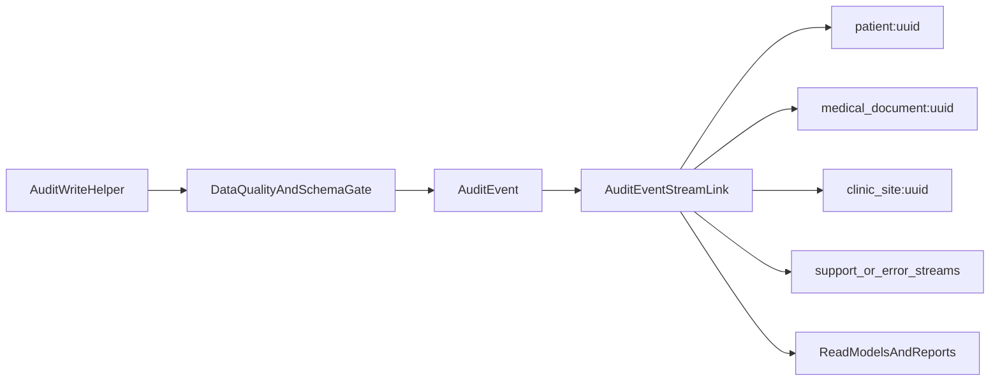

# Plan wykorzystania linkowania zdarzeń

## Cel

Wykorzystać koncepcję z filmu [„Właśnie zabiłeś wydajność systemu!” | Łukasz Reszke](https://www.youtube.com/watch?v=2bnj1OdsXho) do zbudowania wielu perspektyw na te same zdarzenia bez ich duplikacji: `per patient`, `per medical_document`, `per clinic_site`, a później także strumieni tematycznych i projekcji.

Najważniejszy wniosek z obecnego stanu repo: system już ma dwa fundamenty zdarzeniowe, ale nie ma jeszcze warstwy linkowania do strumieni.

- Audyt: `[C:\Users\piotr\Programming\cogitomedica\apps\operations\models.py](C:\Users\piotr\Programming\cogitomedica\apps\operations\models.py)`
- Outbox medyczny: `[C:\Users\piotr\Programming\cogitomedica\apps\outbox\models.py](C:\Users\piotr\Programming\cogitomedica\apps\outbox\models.py)`
- Outbox intake: `[C:\Users\piotr\Programming\cogitomedica\apps\intake\models.py](C:\Users\piotr\Programming\cogitomedica\apps\intake\models.py)`

## Co już mamy

- Jeden punkt zapisu audytu w `[C:\Users\piotr\Programming\cogitomedica\apps\operations\services.py](C:\Users\piotr\Programming\cogitomedica\apps\operations\services.py)`:

```python
create_audit_event(
    *,
    event_type: str,
    metadata: dict[str, Any] | None = None,
    actor_user_id: uuid.UUID | None = None,
    patient_id: uuid.UUID | None = None,
    medical_document_id: uuid.UUID | None = None,
    outbox_event_id: uuid.UUID | None = None,
)
```

- Globalny feed audytu z prostym filtrowaniem po `event_type`, `patient_id`, `medical_document_id` w `[C:\Users\piotr\Programming\cogitomedica\apps\operations\api_views.py](C:\Users\piotr\Programming\cogitomedica\apps\operations\api_views.py)`.
- Osobny endpoint `medical-documents/{id}/audit-trail` w `[C:\Users\piotr\Programming\cogitomedica\apps\medical\api_views.py](C:\Users\piotr\Programming\cogitomedica\apps\medical\api_views.py)`.
- Dwa dojrzałe pipeline’y outboxowe, które już reprezentują sekwencje zdarzeń procesowych.

## Najważniejsze luki do zamknięcia

- `context_clinic_site` istnieje w modelu audytu, ale nie jest ustawiany w runtime.
- Brak strumienia pacjenta i przychodni; dziś trzeba filtrować globalny log.
- Brak wspólnego widoku „support timeline” łączącego intake, medical i outbox.
- Brak lekkich projekcji raportowych per `clinic_site/day/status`.
- Brak stabilnej ścieżki migracji z audytu operacyjnego do pełniejszych zdarzeń domenowych.

## Największe zagrożenia i kroki naprawcze

- Ryzyko: budowa streamów na niepełnych lub semantycznie niespójnych danych audytowych.
  Krok naprawczy: najpierw ustalić kontrakt danych audytu, coverage matrix producentów i blokery wdrożenia dla eventów bez wymaganych referencji.
- Ryzyko: przepłacenie architekturą problemu, który może wynikać głównie z brakujących indeksów i zbyt ubogich endpointów.
  Krok naprawczy: przed dodaniem `AuditEventStreamLink` zmierzyć obecne query, dodać podstawowe indeksy i porównać koszt/efekt.
- Ryzyko: fałszywy backfill historii pacjenta/dokumentu/przychodni.
  Krok naprawczy: wprowadzić politykę backfillu z poziomem pewności i zasadą „nie zgadujemy historii”; brakujące powiązania oznaczać jawnie jako `unknown` lub pozostawić niezalinkowane.
- Ryzyko: chaos pojęciowy między `audit event`, eventem operacyjnym outboxa i przyszłym `domain event`.
  Krok naprawczy: rozdzielić te trzy klasy zdarzeń przed projektowaniem streamów i read modeli.
- Ryzyko: wycieki danych przez nowe szybkie endpointy streamowe.
  Krok naprawczy: zdefiniować osobną macierz autoryzacji dla streamów i support timeline, zamiast kopiować obecne reguły oparte częściowo na `metadata`.
- Ryzyko: niedoszacowanie kosztów projektorów, replay, lagów i niespójności eventual consistency.
  Krok naprawczy: ograniczyć v1 do read-only stream indexów i dopiero po walidacji wartości dodawać projekcje aktualizowane asynchronicznie.

## Architektura docelowa etapu 1-3



## Etap 0: Naprawa fundamentów danych i walidacja problemu

Cel: potwierdzić, że problem rzeczywiście wymaga warstwy streamów, oraz doprowadzić audyt do stanu, na którym można bezpiecznie budować dalszą architekturę.

Zakres:

- Rozdzielić klasy zdarzeń i ich cel:
  - `audit event` do compliance i osi czasu użytkownika,
  - `operational event` do przetwarzania i wsparcia,
  - przyszły `domain event` tylko tam, gdzie ma być źródłem prawdy.
- Zbudować coverage matrix wszystkich producentów audytu:
  - które eventy zapisują `patient_id`,
  - które zapisują `medical_document_id`,
  - które mogą wiarygodnie zapisać `context_clinic_site_id`,
  - które wymagają `queue_entry_id`, `assigned_doctor_id`, `intake_document_version_id`, `intake_outbox_event_id`.
- Ustalić minimalny kanoniczny kontrakt zdarzenia dla nowych zapisów:
  - obowiązkowe identyfikatory referencyjne,
  - `schema_version`,
  - źródło zdarzenia,
  - opcjonalne `correlation_id` i `causation_id`,
  - jawny typ kategorii zdarzenia: `audit`, `operational`, `domain_candidate`.
- Wykonać benchmark obecnych zapytań audytowych przed zmianami:
  - historia pacjenta,
  - historia dokumentu,
  - filtr po przychodni,
  - najczęstsze przypadki supportowe.
- Dodać i zweryfikować najtańsze ulepszenia przed streamami:
  - indeksy po `patient_id`, `medical_document_id`, `context_clinic_site_id`, `outbox_event_id`,
  - ewentualne indeksy z `event_time` pod paginację malejącą,
  - rozszerzenie filtrów API tam, gdzie dziś ich brakuje.
- Ustalić politykę backfillu:
  - bez zgadywania historii na podstawie obecnego stanu encji,
  - jawne oznaczenie rekordów `backfilled` i poziomu pewności,
  - możliwość pozostawienia części historycznych eventów poza strumieniami, jeśli nie da się ich odtworzyć wiarygodnie.
- Ustalić politykę retencji i niezmienności referencji:
  - które identyfikatory muszą pozostać trwale w evencie nawet po usunięciu lub anonimizacji obiektu,
  - które dane mogą być tylko FK, a które muszą być również zapisane jako immutable reference value.
- Zdefiniować macierz autoryzacji dla nowych odczytów streamowych i supportowych:
  - kto widzi stream pacjenta,
  - kto widzi stream przychodni,
  - jakie ograniczenia mają DOCTOR vs ADMIN vs RECEPTION.

Efekt:

- decyzja oparta na danych, czy same indeksy i lepsze API nie rozwiązują większości problemu;
- gotowy kontrakt danych i zasady backfillu, bez których streamy byłyby ryzykowne.

## Etap 1: Uporządkowanie kanonicznego audytu

Cel: przygotować dane tak, aby jedno zdarzenie dało się zalinkować do wielu strumieni.

Zakres:

- Rozszerzyć helper w `[C:\Users\piotr\Programming\cogitomedica\apps\operations\services.py](C:\Users\piotr\Programming\cogitomedica\apps\operations\services.py)` o jawne przekazywanie `context_clinic_site_id` oraz opcjonalnych identyfikatorów korelacyjnych, np. `queue_entry_id`, `intake_document_version_id`, `intake_outbox_event_id`.
- Rozważyć dodanie do modelu audytu pól lub trwałych referencji, które nie znikają wraz z `SET_NULL`, jeśli mają służyć jako oś compliance i replay supportowy.
- Ustalić minimalny kontrakt metadanych dla wszystkich producentów audytu w:
  - `[C:\Users\piotr\Programming\cogitomedica\apps\medical\services.py](C:\Users\piotr\Programming\cogitomedica\apps\medical\services.py)`
  - `[C:\Users\piotr\Programming\cogitomedica\apps\outbox\services.py](C:\Users\piotr\Programming\cogitomedica\apps\outbox\services.py)`
  - `[C:\Users\piotr\Programming\cogitomedica\apps\intake\services.py](C:\Users\piotr\Programming\cogitomedica\apps\intake\services.py)`
  - `[C:\Users\piotr\Programming\cogitomedica\apps\intake\outbox_services.py](C:\Users\piotr\Programming\cogitomedica\apps\intake\outbox_services.py)`
- Dodać spójne zasady nazewnictwa zdarzeń i strumieni, np.:
  - `patient:{uuid}`
  - `medical_document:{uuid}`
  - `clinic_site:{uuid}`
  - `outbox:error`
  - `processing:retry_requested`
- Uzupełnić testy kontraktu audytu tam, gdzie dziś testowana jest tylko obecność eventu, a nie komplet referencji.

Efekt:

- każde nowe zdarzenie audytowe ma komplet danych potrzebnych do zalinkowania bez dodatkowych joinów lub backfilli.

## Etap 2: Linkowanie do wielu strumieni

Cel: wprowadzić lekką warstwę linków bez przechodzenia na pełny Event Sourcing.

Zakres:

- Dodać nową tabelę, np. `AuditEventStreamLink`, zawierającą:
  - `audit_event_id`
  - `stream_type`
  - `stream_key`
  - opcjonalnie `position_in_stream`
  - `linked_at`
- Linkowanie wykonywać synchronicznie przy zapisie audytu albo asynchronicznie przez mały projector po `AuditEvent`.
- Na start linkować każdy event do 1..N strumieni:
  - pacjent,
  - dokument medyczny,
  - przychodnia,
  - ewentualnie strumień operacyjny dla błędów/retry/dead-letter.
- Zadbać o indeksy pod realne zapytania: `stream_type + stream_key + linked_at` oraz unikalność `audit_event_id + stream_type + stream_key`.

Decyzja implementacyjna:

- Preferowany start: osobna tabela linków zamiast przeciążania `metadata`, bo daje stabilne indeksy i przewidywalne query plans.
- Preferowany start v1: bez `position_in_stream`; porządek odczytu oprzeć na `event_time` i `audit_event_id`, aby nie wprowadzać od razu kosztów współbieżnego numerowania strumieni.
- Linkowanie uruchomić początkowo w trybie `shadow`, tj. bez przepinania głównych endpointów, z porównaniem wyników starego i nowego sposobu odczytu.

Efekt:

- to samo zdarzenie jest dostępne w wielu perspektywach bez kopiowania rekordów i bez kosztownego filtrowania pełnej tabeli `audit_event`.

## Etap 3: Szybszy audyt, compliance i wsparcie

Cel: wykorzystać strumienie jako gotowe osie nawigacji dla supportu i compliance.

Zakres API/UI:

- Rozszerzyć `[C:\Users\piotr\Programming\cogitomedica\apps\operations\api_views.py](C:\Users\piotr\Programming\cogitomedica\apps\operations\api_views.py)` o filtrowanie po:
  - `context_clinic_site_id`
  - `actor_user_id`
  - `outbox_event_id`
  - zakresie czasu
- Dodać nowe endpointy read-only:
  - `GET /patients/{id}/audit-stream`
  - `GET /medical-documents/{id}/audit-stream`
  - `GET /clinic-sites/{id}/audit-stream`
  - opcjonalnie `GET /support/cases/{entity}/{id}/timeline`
- Oprzeć te endpointy na tabeli linków, nie na globalnym `AuditEvent.objects.all()`.
- Najpierw utrzymać równolegle stare i nowe odczyty oraz porównywać wyniki na danych rzeczywistych, zanim nowe endpointy staną się źródłem prawdy dla supportu lub compliance.
- Rozszerzyć istniejący `medical-document audit-trail`, żeby korzystał z tej samej infrastruktury i zwracał pełniejszy, spójny payload.
- Dodać widok „support timeline”, który łączy zdarzenia domenowe i operacyjne dla pacjenta/dokumentu.

Efekt biznesowy:

- szybszy audyt per pacjent/dokument/przychodnia,
- prostsze odpowiedzi na pytania compliance,
- krótszy czas diagnozy przy błędach typu retry, dead-letter, brak PDF, brak SMS.

## Etap 4: Lżejsze raporty bez skanowania całego logu

Cel: użyć strumieni jako źródła pod tanie projekcje i raporty operacyjne.

Zakres:

- Wydzielić 3-5 pierwszych projekcji o najwyższej wartości operacyjnej, np.:
  - `clinic_site_daily_processing_summary`
  - `patient_processing_status_current`
  - `document_processing_status_current`
  - `outbox_failures_by_stage_daily`
- Projektory zasilać ze strumieni tematycznych zamiast z pełnego `audit_event`.
- Zanim powstaną projekcje produkcyjne, dostarczyć minimalną infrastrukturę operacyjną:
  - idempotentny projector,
  - watermark/offset postępu,
  - replay dla pojedynczej projekcji,
  - monitoring laga i błędów projekcji,
  - procedurę odbudowy po zmianie schematu.
- Rozszerzyć dashboard/reception/ops o czytelne agregaty typu:
  - ile dokumentów utknęło na PDF,
  - ile błędów HiDrive/SMS na przychodnię i dzień,
  - ilu pacjentów ma intake zakończony, ale dokument nadal nieopublikowany.
- Zsynchronizować to z obserwowalnością w:
  - `[C:\Users\piotr\Programming\cogitomedica\apps\operations\metrics.py](C:\Users\piotr\Programming\cogitomedica\apps\operations\metrics.py)`
  - `[C:\Users\piotr\Programming\cogitomedica\docs\runbooks](C:\Users\piotr\Programming\cogitomedica\docs\runbooks)`

Efekt:

- raporty i wsparcie przestają polegać na kosztownych zapytaniach ad hoc po całym logu.

## Etap 5: Przygotowanie ścieżki do pełniejszego Event Sourcingu

Cel: nie robić teraz pełnego ES, ale nie zablokować tej opcji.

Zakres architektoniczny:

- Rozdzielić pojęcia:
  - `audit event` jako zapis operacyjny/compliance,
  - `domain event` jako przyszłe źródło prawdy dla wybranych agregatów.
- W pierwszej kolejności rozważyć ES tylko dla obszarów o naturalnej sekwencji zmian:
  - `MedicalDocument` i `MedicalDocumentVersion`,
  - ewentualnie `PatientIntakeForm` / `IntakeDocumentVersion`.
- Zacząć od katalogu zdarzeń domenowych, np.:
  - `MedicalDocumentCreated`
  - `DraftSaved`
  - `DocumentPublished`
  - `PdfGenerated`
  - `HiDriveUploaded`
  - `SmsSent`
  - `ProcessingFailed`
- Zachować obecne modele relacyjne jako write/read state, a domenowe eventy wprowadzać równolegle tam, gdzie zysk jest największy.
- Nie traktować `AuditEvent` jako przyszłego event store; jeśli pojawi się pełniejszy ES, powinien mieć własny kontrakt, własne wersjonowanie i własne zasady replay.
- Read modele budować początkowo tylko dla przypadków o największym ROI, np. status dokumentu i oś czasu pacjenta.

Zasada przejścia:

- najpierw `data quality + contract + baseline indexes`,
- potem `audit + stream links`,
- potem `projection tables`,
- dopiero później wybrane `domain events` i read modele liczone stricte ze zdarzeń.

## Kolejność wdrożenia

1. Zmierzyć obecne zapytania i dodać podstawowe indeksy oraz brakujące filtry API.
2. Ujednolicić kontrakt audytu i uzupełnić brakujące referencje kontekstowe.
3. Przygotować politykę backfillu, retencji referencji i autoryzacji streamów.
4. Dodać tabelę linków do strumieni i uruchomić ją w `shadow mode`.
5. Porównać wyniki starego i nowego odczytu dla patient/document/clinic-site.
6. Dopiero potem przepiąć patient/document audit history na strumienie.
7. Dodać clinic-site stream i support timeline.
8. Zbudować 1-2 pierwsze projekcje raportowe wraz z obsługą replay i monitoringu.
9. Dopiero po potwierdzeniu wartości biznesowej zaprojektować katalog domenowych eventów pod pełniejszy ES.

## Najważniejsze pliki do zmiany w pierwszej iteracji

- `[C:\Users\piotr\Programming\cogitomedica\apps\operations\models.py](C:\Users\piotr\Programming\cogitomedica\apps\operations\models.py)`
- `[C:\Users\piotr\Programming\cogitomedica\apps\operations\services.py](C:\Users\piotr\Programming\cogitomedica\apps\operations\services.py)`
- `[C:\Users\piotr\Programming\cogitomedica\apps\operations\api_views.py](C:\Users\piotr\Programming\cogitomedica\apps\operations\api_views.py)`
- `[C:\Users\piotr\Programming\cogitomedica\apps\medical\api_views.py](C:\Users\piotr\Programming\cogitomedica\apps\medical\api_views.py)`
- `[C:\Users\piotr\Programming\cogitomedica\apps\medical\services.py](C:\Users\piotr\Programming\cogitomedica\apps\medical\services.py)`
- `[C:\Users\piotr\Programming\cogitomedica\apps\outbox\services.py](C:\Users\piotr\Programming\cogitomedica\apps\outbox\services.py)`
- `[C:\Users\piotr\Programming\cogitomedica\apps\intake\services.py](C:\Users\piotr\Programming\cogitomedica\apps\intake\services.py)`
- `[C:\Users\piotr\Programming\cogitomedica\apps\intake\outbox_services.py](C:\Users\piotr\Programming\cogitomedica\apps\intake\outbox_services.py)`
- `[C:\Users\piotr\Programming\cogitomedica\cogitomedica\api_urls.py](C:\Users\piotr\Programming\cogitomedica\cogitomedica\api_urls.py)`
- `[C:\Users\piotr\Programming\cogitomedica\apps\medical\tests.py](C:\Users\piotr\Programming\cogitomedica\apps\medical\tests.py)`
- `[C:\Users\piotr\Programming\cogitomedica\apps\outbox\tests.py](C:\Users\piotr\Programming\cogitomedica\apps\outbox\tests.py)`
- `[C:\Users\piotr\Programming\cogitomedica\apps\intake\tests.py](C:\Users\piotr\Programming\cogitomedica\apps\intake\tests.py)`
- `[C:\Users\piotr\Programming\cogitomedica\docs\runbooks](C:\Users\piotr\Programming\cogitomedica\docs\runbooks)`

## Kryteria sukcesu

- coverage matrix pokazuje, że nowe eventy mają komplet wymaganych referencji;
- nowe streamy nie zgadują historii i nie ukrywają braków danych historycznych;
- `shadow mode` potwierdza zgodność nowego odczytu z dotychczasowym tam, gdzie dane wejściowe są kompletne;
- historia pacjenta, dokumentu i przychodni działa bez pełnego skanowania `audit_event`;
- support widzi jedną oś czasu dla najczęstszych incydentów;
- raporty operacyjne korzystają z projekcji lub strumieni tematycznych;
- architektura nie wymusza jeszcze pełnego ES, ale ułatwia jego późniejsze dołożenie.

