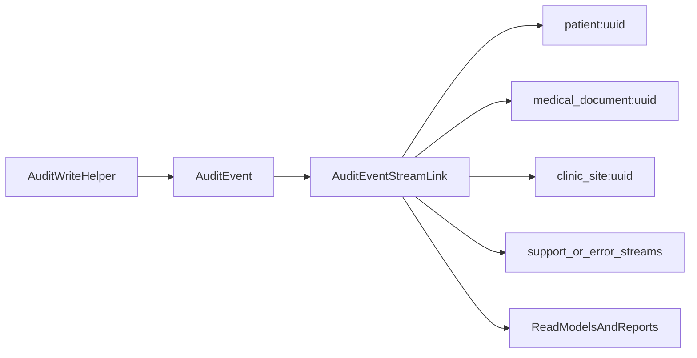

# Plan wykorzystania linkowania zdarzeń

## Cel

Wykorzystać koncepcję z filmu [„Właśnie zabiłeś wydajność systemu!” | Łukasz Reszke](https://www.youtube.com/watch?v=2bnj1OdsXho) do zbudowania wielu perspektyw na te same zdarzenia bez ich duplikacji: `per patient`, `per medical_document`, `per clinic_site`, a później także strumieni tematycznych i projekcji.

Najważniejszy wniosek z obecnego stanu repo: system już ma dwa fundamenty zdarzeniowe, ale nie ma jeszcze warstwy linkowania do strumieni.

- Audyt: `[C:\Users\piotr\Programming\cogitomedica\apps\operations\models.py](C:\Users\piotr\Programming\cogitomedica\apps\operations\models.py)`
- Outbox medyczny: `[C:\Users\piotr\Programming\cogitomedica\apps\outbox\models.py](C:\Users\piotr\Programming\cogitomedica\apps\outbox\models.py)`
- Outbox intake: `[C:\Users\piotr\Programming\cogitomedica\apps\intake\models.py](C:\Users\piotr\Programming\cogitomedica\apps\intake\models.py)`

## Co już mamy

- Jeden punkt zapisu audytu w `[C:\Users\piotr\Programming\cogitomedica\apps\operations\services.py](C:\Users\piotr\Programming\cogitomedica\apps\operations\services.py)`:

```python
create_audit_event(
    *,
    event_type: str,
    metadata: dict[str, Any] | None = None,
    actor_user_id: uuid.UUID | None = None,
    patient_id: uuid.UUID | None = None,
    medical_document_id: uuid.UUID | None = None,
    outbox_event_id: uuid.UUID | None = None,
)
```

- Globalny feed audytu z prostym filtrowaniem po `event_type`, `patient_id`, `medical_document_id` w `[C:\Users\piotr\Programming\cogitomedica\apps\operations\api_views.py](C:\Users\piotr\Programming\cogitomedica\apps\operations\api_views.py)`.
- Osobny endpoint `medical-documents/{id}/audit-trail` w `[C:\Users\piotr\Programming\cogitomedica\apps\medical\api_views.py](C:\Users\piotr\Programming\cogitomedica\apps\medical\api_views.py)`.
- Dwa dojrzałe pipeline’y outboxowe, które już reprezentują sekwencje zdarzeń procesowych.

## Najważniejsze luki do zamknięcia

- `context_clinic_site` istnieje w modelu audytu, ale nie jest ustawiany w runtime.
- Brak strumienia pacjenta i przychodni; dziś trzeba filtrować globalny log.
- Brak wspólnego widoku „support timeline” łączącego intake, medical i outbox.
- Brak lekkich projekcji raportowych per `clinic_site/day/status`.
- Brak stabilnej ścieżki migracji z audytu operacyjnego do pełniejszych zdarzeń domenowych.

## Architektura docelowa etapu 1-3




## Etap 1: Uporządkowanie kanonicznego audytu

Cel: przygotować dane tak, aby jedno zdarzenie dało się zalinkować do wielu strumieni.

Zakres:

- Rozszerzyć helper w `[C:\Users\piotr\Programming\cogitomedica\apps\operations\services.py](C:\Users\piotr\Programming\cogitomedica\apps\operations\services.py)` o jawne przekazywanie `context_clinic_site_id` oraz opcjonalnych identyfikatorów korelacyjnych, np. `queue_entry_id`, `intake_document_version_id`, `intake_outbox_event_id`.
- Ustalić minimalny kontrakt metadanych dla wszystkich producentów audytu w:
  - `[C:\Users\piotr\Programming\cogitomedica\apps\medical\services.py](C:\Users\piotr\Programming\cogitomedica\apps\medical\services.py)`
  - `[C:\Users\piotr\Programming\cogitomedica\apps\outbox\services.py](C:\Users\piotr\Programming\cogitomedica\apps\outbox\services.py)`
  - `[C:\Users\piotr\Programming\cogitomedica\apps\intake\services.py](C:\Users\piotr\Programming\cogitomedica\apps\intake\services.py)`
  - `[C:\Users\piotr\Programming\cogitomedica\apps\intake\outbox_services.py](C:\Users\piotr\Programming\cogitomedica\apps\intake\outbox_services.py)`
- Dodać spójne zasady nazewnictwa zdarzeń i strumieni, np.:
  - `patient:{uuid}`
  - `medical_document:{uuid}`
  - `clinic_site:{uuid}`
  - `outbox:error`
  - `processing:retry_requested`
- Uzupełnić testy kontraktu audytu tam, gdzie dziś testowana jest tylko obecność eventu, a nie komplet referencji.

Efekt:

- każde nowe zdarzenie audytowe ma komplet danych potrzebnych do zalinkowania bez dodatkowych joinów lub backfilli.

## Etap 2: Linkowanie do wielu strumieni

Cel: wprowadzić lekką warstwę linków bez przechodzenia na pełny Event Sourcing.

Zakres:

- Dodać nową tabelę, np. `AuditEventStreamLink`, zawierającą:
  - `audit_event_id`
  - `stream_type`
  - `stream_key`
  - opcjonalnie `position_in_stream`
  - `linked_at`
- Linkowanie wykonywać synchronicznie przy zapisie audytu albo asynchronicznie przez mały projector po `AuditEvent`.
- Na start linkować każdy event do 1..N strumieni:
  - pacjent,
  - dokument medyczny,
  - przychodnia,
  - ewentualnie strumień operacyjny dla błędów/retry/dead-letter.
- Zadbać o indeksy pod realne zapytania: `stream_type + stream_key + linked_at` oraz unikalność `audit_event_id + stream_type + stream_key`.

Decyzja implementacyjna:

- Preferowany start: osobna tabela linków zamiast przeciążania `metadata`, bo daje stabilne indeksy i przewidywalne query plans.

Efekt:

- to samo zdarzenie jest dostępne w wielu perspektywach bez kopiowania rekordów i bez kosztownego filtrowania pełnej tabeli `audit_event`.

## Etap 3: Szybszy audyt, compliance i wsparcie

Cel: wykorzystać strumienie jako gotowe osie nawigacji dla supportu i compliance.

Zakres API/UI:

- Rozszerzyć `[C:\Users\piotr\Programming\cogitomedica\apps\operations\api_views.py](C:\Users\piotr\Programming\cogitomedica\apps\operations\api_views.py)` o filtrowanie po:
  - `context_clinic_site_id`
  - `actor_user_id`
  - `outbox_event_id`
  - zakresie czasu
- Dodać nowe endpointy read-only:
  - `GET /patients/{id}/audit-stream`
  - `GET /medical-documents/{id}/audit-stream`
  - `GET /clinic-sites/{id}/audit-stream`
  - opcjonalnie `GET /support/cases/{entity}/{id}/timeline`
- Oprzeć te endpointy na tabeli linków, nie na globalnym `AuditEvent.objects.all()`.
- Rozszerzyć istniejący `medical-document audit-trail`, żeby korzystał z tej samej infrastruktury i zwracał pełniejszy, spójny payload.
- Dodać widok „support timeline”, który łączy zdarzenia domenowe i operacyjne dla pacjenta/dokumentu.

Efekt biznesowy:

- szybszy audyt per pacjent/dokument/przychodnia,
- prostsze odpowiedzi na pytania compliance,
- krótszy czas diagnozy przy błędach typu retry, dead-letter, brak PDF, brak SMS.

## Etap 4: Lżejsze raporty bez skanowania całego logu

Cel: użyć strumieni jako źródła pod tanie projekcje i raporty operacyjne.

Zakres:

- Wydzielić 3-5 pierwszych projekcji o najwyższej wartości operacyjnej, np.:
  - `clinic_site_daily_processing_summary`
  - `patient_processing_status_current`
  - `document_processing_status_current`
  - `outbox_failures_by_stage_daily`
- Projektory zasilać ze strumieni tematycznych zamiast z pełnego `audit_event`.
- Rozszerzyć dashboard/reception/ops o czytelne agregaty typu:
  - ile dokumentów utknęło na PDF,
  - ile błędów HiDrive/SMS na przychodnię i dzień,
  - ilu pacjentów ma intake zakończony, ale dokument nadal nieopublikowany.
- Zsynchronizować to z obserwowalnością w:
  - `[C:\Users\piotr\Programming\cogitomedica\apps\operations\metrics.py](C:\Users\piotr\Programming\cogitomedica\apps\operations\metrics.py)`
  - `[C:\Users\piotr\Programming\cogitomedica\docs\runbooks](C:\Users\piotr\Programming\cogitomedica\docs\runbooks)`

Efekt:

- raporty i wsparcie przestają polegać na kosztownych zapytaniach ad hoc po całym logu.

## Etap 5: Przygotowanie ścieżki do pełniejszego Event Sourcingu

Cel: nie robić teraz pełnego ES, ale nie zablokować tej opcji.

Zakres architektoniczny:

- Rozdzielić pojęcia:
  - `audit event` jako zapis operacyjny/compliance,
  - `domain event` jako przyszłe źródło prawdy dla wybranych agregatów.
- W pierwszej kolejności rozważyć ES tylko dla obszarów o naturalnej sekwencji zmian:
  - `MedicalDocument` i `MedicalDocumentVersion`,
  - ewentualnie `PatientIntakeForm` / `IntakeDocumentVersion`.
- Zacząć od katalogu zdarzeń domenowych, np.:
  - `MedicalDocumentCreated`
  - `DraftSaved`
  - `DocumentPublished`
  - `PdfGenerated`
  - `HiDriveUploaded`
  - `SmsSent`
  - `ProcessingFailed`
- Zachować obecne modele relacyjne jako write/read state, a domenowe eventy wprowadzać równolegle tam, gdzie zysk jest największy.
- Read modele budować początkowo tylko dla przypadków o największym ROI, np. status dokumentu i oś czasu pacjenta.

Zasada przejścia:

- najpierw `audit + stream links`,
- potem `projection tables`,
- dopiero później wybrane `domain events` i read modele liczone stricte ze zdarzeń.

## Kolejność wdrożenia

1. Ujednolicić kontrakt audytu i uzupełnić brakujące referencje kontekstowe.
2. Dodać tabelę linków do strumieni i indeksy.
3. Przepiąć patient/document audit history na strumienie.
4. Dodać clinic-site stream i support timeline.
5. Zbudować 1-2 pierwsze projekcje raportowe.
6. Dopiero po potwierdzeniu wartości biznesowej zaprojektować katalog domenowych eventów pod pełniejszy ES.

## Najważniejsze pliki do zmiany w pierwszej iteracji

- `[C:\Users\piotr\Programming\cogitomedica\apps\operations\models.py](C:\Users\piotr\Programming\cogitomedica\apps\operations\models.py)`
- `[C:\Users\piotr\Programming\cogitomedica\apps\operations\services.py](C:\Users\piotr\Programming\cogitomedica\apps\operations\services.py)`
- `[C:\Users\piotr\Programming\cogitomedica\apps\operations\api_views.py](C:\Users\piotr\Programming\cogitomedica\apps\operations\api_views.py)`
- `[C:\Users\piotr\Programming\cogitomedica\apps\medical\api_views.py](C:\Users\piotr\Programming\cogitomedica\apps\medical\api_views.py)`
- `[C:\Users\piotr\Programming\cogitomedica\apps\medical\services.py](C:\Users\piotr\Programming\cogitomedica\apps\medical\services.py)`
- `[C:\Users\piotr\Programming\cogitomedica\apps\outbox\services.py](C:\Users\piotr\Programming\cogitomedica\apps\outbox\services.py)`
- `[C:\Users\piotr\Programming\cogitomedica\apps\intake\services.py](C:\Users\piotr\Programming\cogitomedica\apps\intake\services.py)`
- `[C:\Users\piotr\Programming\cogitomedica\apps\intake\outbox_services.py](C:\Users\piotr\Programming\cogitomedica\apps\intake\outbox_services.py)`
- `[C:\Users\piotr\Programming\cogitomedica\cogitomedica\api_urls.py](C:\Users\piotr\Programming\cogitomedica\cogitomedica\api_urls.py)`

## Kryteria sukcesu

- historia pacjenta, dokumentu i przychodni działa bez pełnego skanowania `audit_event`;
- support widzi jedną oś czasu dla najczęstszych incydentów;
- raporty operacyjne korzystają z projekcji lub strumieni tematycznych;
- architektura nie wymusza jeszcze pełnego ES, ale ułatwia jego późniejsze dołożenie.

