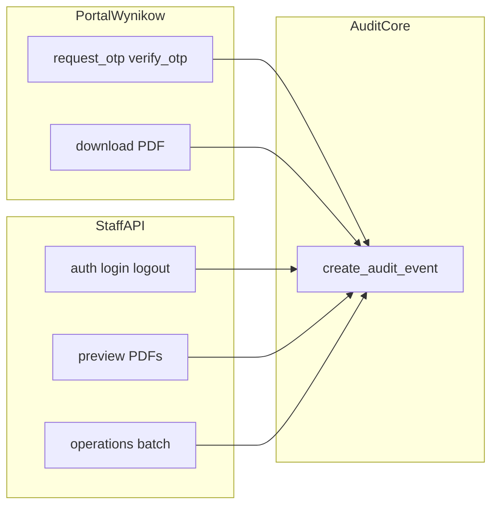

# Plan: brakujące audyty + rezygnacja z PatientContactHistory

## Założenia

- Jedna warstwa zapisu: `[create_audit_event](apps/operations/services.py)` (FK + `metadata` + `_ref`).
- **Nie** wdrażamy `MEDICAL_TEXT_EDITED` — w `[.ai/api-plan-pl.md](.ai/api-plan-pl.md)` usunąć/zmienić zdanie o „Każda modyfikacja `edited_text`…” tak, by było zgodne z rzeczywistością (`DOCUMENT_DRAFT_SAVED`).
- **PatientContactHistory**: pełne wycofanie z produktu (model, migracja `DeleteModel`, API, admin, menu, OpenAPI, testy, uprawnienia). Historyczne dane: przed migracją na produkcji ewentualny eksport tabeli `patient_contact_history` (poza zakresem kodu).

## 1. Wspólne utilki

- Dodać np. `[apps/core/http_utils.py](apps/core/http_utils.py)` — `get_client_ip(request: HttpRequest) -> str | None`: pierwszy adres z `X-Forwarded-For` (jeśli skonfigurowany reverse proxy) lub `REMOTE_ADDR`. Używać konsekwentnie w portalu wyników i (opcjonalnie) przy auth.
- Konwencja `metadata` dla zdarzeń portalu / auth: `client_ip`, `outcome` / `error_code` (bez pełnego numeru telefonu i bez jawnego DOB w logu, żeby nie pogarszać enumeracji — przy sukcesie OTP i wysłaniu SMS można ustawić `patient_id`).

## 2. Portal wyników — `[apps/patient_results/api_views.py](apps/patient_results/api_views.py)` (+ ewentualnie cienkie wywołania z `[apps/patient_results/services.py](apps/patient_results/services.py)`)

| Zdarzenie (propozycja `event_type`)         | Kiedy                                                     | Pola                                                                                                                                                                                          |
| ------------------------------------------- | --------------------------------------------------------- | --------------------------------------------------------------------------------------------------------------------------------------------------------------------------------------------- |
| `PATIENT_RESULTS_OTP_REQUEST`               | Po `request_otp` (każda ścieżka)                          | `metadata`: `client_ip`, `outcome` (`captcha_failed` / `sms_sent` / `silent_no_op` — bez rozróżniania „nie ma pacjenta” vs rate limit w odpowiedzi API); jeśli `sms_sent`, dodać `patient_id` |
| `PATIENT_RESULTS_OTP_VERIFY`                | Po `verify_otp`                                           | Sukces: `patient_id`, `client_ip`; porażka: `client_ip`, `outcome` (`invalid` / `blocked`)                                                                                                    |
| `PATIENT_RESULTS_DOCUMENTS_LISTED`          | GET `patient-results/documents` (sesja OK)                | `patient_id`, `client_ip`, opcjonalnie `item_count`                                                                                                                                           |
| `PATIENT_RESULTS_PDF_DOWNLOAD` (istniejące) | Udana odpowiedź PDF                                       | Rozszerzyć `metadata` o `client_ip` (wymóg PRD: czas już jest w `event_time`)                                                                                                                 |
| `PATIENT_RESULTS_PDF_DOWNLOAD_DENIED`       | 404 przed `create_audit_event` (brak wersji / brak pliku) | `metadata`: `version_id`, `client_ip`, `patient_id` (z sesji)                                                                                                                                 |

Testy: rozszerzyć `[apps/patient_results/api_tests.py](apps/patient_results/api_tests.py)` (liczba `AuditEvent`, `metadata`).

## 3. Auth staff API — `[apps/users/api_views.py](apps/users/api_views.py)`

- `**auth_login_view`**: po nieudanym `authenticate` / nieaktywny user → `AuditEvent` typ np. `STAFF_AUTH_LOGIN_FAILED` (`metadata`: `username`, `client_ip`; bez hasła).
- Po udanym `login` → `STAFF_AUTH_LOGIN_SUCCESS` (`actor_user_id` = user.id, `metadata`: `client_ip`).
- `**auth_logout_view`**: jeśli użytkownik był zalogowany → `STAFF_AUTH_LOGOUT` z `actor_user_id`.

Uwaga: unikać logowania przy każdym odświeżeniu strony — tylko jawne POST na te endpointy.

## 4. Retry outbox z aktorem

- `[retry_outbox_event](apps/outbox/services.py)`: dodać opcjonalny parametr `actor_user_id: UUID | None = None`; przekazać do `create_audit_event` dla `OUTBOX_EVENT_RETRY_REQUESTED`.
- Wywołania: `[apps/outbox/api_views.py](apps/outbox/api_views.py)` (`request.user.id`); `[retry_latest_document_processing](apps/medical/services.py)` — przekazać `actor.id`.
- `[retry_intake_outbox_event](apps/intake/outbox_services.py)`: analogicznie `actor_user_id`; wywołanie z `[apps/intake/api_views.py](apps/intake/api_views.py)`.

Testy: `[apps/outbox/api_tests.py](apps/outbox/api_tests.py)`, `[apps/intake/api_tests.py](apps/intake/api_tests.py)` (jeśli pokrywają retry).

## 5. Ręczne operacje admina (zbiorczy audyt)

W `[apps/outbox/api_views.py](apps/outbox/api_views.py)` po sukcesie walidacji i **przed** wywołaniem serwisu:

- `operations_outbox_process_view` → np. `OPERATIONS_OUTBOX_BATCH_TRIGGERED` (`actor_user_id`, `metadata`: `limit`, `client_ip`).
- `operations_retention_run_view` → `OPERATIONS_RETENTION_RUN_TRIGGERED` (`actor_user_id`, `metadata`: `older_than_days`, `dry_run`, `client_ip`).
- `[intake_outbox_process_view](apps/intake/api_views.py)` → `OPERATIONS_INTAKE_OUTBOX_BATCH_TRIGGERED` (analogicznie).

Nie zastępują one per-event audytu w workerach — tylko domykają „kto uruchomił narzędzie”.

## 6. Import XLSX — `[apps/reception/xlsx_import.py](apps/reception/xlsx_import.py)`

- W `[enqueue_patient_xlsx_import](apps/reception/xlsx_import.py)` po utworzeniu batcha: `PATIENT_XLSX_IMPORT_ENQUEUED` — `actor_user_id=batch.created_by_user_id`, `metadata`: `batch_id`, `source_file_name`, `source_file_sha256`.
- Na końcu `[process_patient_xlsx_import_batch](apps/reception/xlsx_import.py)` (wszystkie ścieżki wyjścia: sukces ~588–592, `FAILED` w `except`): `PATIENT_XLSX_IMPORT_FINISHED` — ten sam aktor z batcha, `context_clinic_site_id` jeśli znane (po udanym resolve kliniki), `metadata`: `batch_id`, `status`, `inserted_rows`, `error_rows`, ewentualnie `failure_reason`.

## 7. Podgląd PDF (staff)

- `[medical_document_preview_pdf_view](apps/medical/api_views.py)`: przed zwrotem PDF — `create_audit_event` np. `MEDICAL_DOCUMENT_PDF_PREVIEWED` z `actor_user_id`, `medical_document_id`, `patient_id` z kolejki, `context_clinic_site_id`, `metadata`: `client_ip`, ewentualnie `version_no`.
- `[intake_document_preview_pdf_view](apps/intake/document_views.py)`: np. `INTAKE_DOCUMENT_PDF_PREVIEWED` z `actor_user_id`, `patient_id`, `context_clinic_site_id`, `metadata`: `intake_document_version_id`, `client_ip`.

## 8. `assigned_doctor_id` w `metadata` (filtr lekarza)

W `[apps/medical/services.py](apps/medical/services.py)` przy każdym `create_audit_event` związanym z dokumentem medycznym dodać do słownika `metadata` (nie tylko `_ref`) pole `assigned_doctor_id`: `str(medical_document.queue_entry.daily_queue.assigned_doctor_id)` jeśli nie `None`. Dotyczy m.in. `DOCUMENT_DRAFT_SAVED`, `DOCUMENT_PUBLISHED`, `DOCUMENT_REVOKED` oraz ewentualnie nowych zdarzeń z pkt 7.

Sprawdzić spójność z filtrem w `[audit_events_view](apps/operations/api_views.py)` (`metadata__assigned_doctor_id`).

## 9. Utworzenie dokumentu medycznego (POST)

- W `[create_or_get_medical_document](apps/medical/services.py)` (ścieżka **utworzenia** nowego rekordu, nie idempotentnego „get”): jeden `AuditEvent` np. `MEDICAL_DOCUMENT_CREATED` z `actor_user_id`, `medical_document_id`, `patient_id`, `context_clinic_site_id`, `metadata` z `assigned_doctor_id` jak wyżej, `queue_entry_id`, `intake_form_id`.

## 10. Audyty „zalecane” GET (zakres z Twojej tabeli)

Dodać lekkie zdarzenia (np. `*_VIEWED` / `*_LISTED`) z `actor_user_id`, `client_ip`, ID zasobu, **bez** duplikowania całych payloadów:

- `[medical_documents_view](apps/medical/api_views.py)` GET, `[medical_document_detail_view](apps/medical/api_views.py)`, `[medical_document_versions_view](apps/medical/api_views.py)`, `[medical_document_version_detail_view](apps/medical/api_views.py)`.
- `[intake_documents_view](apps/intake/document_views.py)`, `[intake_document_detail_view](apps/intake/document_views.py)`.

## 11. Usunięcie PatientContactHistory

- Model i tabela: usunąć klasę z `[apps/reception/models.py](apps/reception/models.py)`, migracja `DeleteModel` + usunięcie powiązań.
- API: usunąć `[patient_contact_history_view](apps/reception/api_views_split/patients.py)`, route w `[cogitomedica/api_urls.py](cogitomedica/api_urls.py)`, fragment tworzący historię przy PATCH w tym samym pliku.
- Admin: rejestracja w `[apps/reception/admin.py](apps/reception/admin.py)`.
- Menu: wpis w `[cogitomedica/settings.py](cogitomedica/settings.py)` (`patientcontacthistory_changelist`).
- OpenAPI: `[cogitomedica/openapi_extension.py](cogitomedica/openapi_extension.py)` + ewentualnie `[cogitomedica/openapi_schemas.py](cogitomedica/openapi_schemas.py)`.
- Uprawnienia: nowa migracja w `[apps/users/migrations/](apps/users/migrations/)` usuwająca `view_patientcontacthistory` z grup (wzór jak w istniejących seedach ról).
- Testy: `[apps/reception/api_tests.py](apps/reception/api_tests.py)` (testy contact-history i PATCH historii), inne odniesienia w grep.
- Dokumentacja: [.ai/api-plan.md](.ai/api-plan.md) / [.ai/api-plan-pl.md](.ai/api-plan-pl.md) — usunąć zasób `patient-contact-history`; [.ai/db-plan.md](.ai/db-plan.md) — sekcja tabeli (jeśli opisana).

## 12. Testy regresji i dokumentacja

- Rozszerzyć testy audytu tam, gdzie już są asercje na `AuditEvent` (medical, outbox, patient_results).
- Krótka lista nowych `event_type` w komentarzu lub wewnętrznym pliku (opcjonalnie); zaktualizować `.ai/api-plan*.md` i README tylko jeśli opisują kontrakt API (usunięcie contact-history + nowe typy zdarzeń w opisie compliance — minimalnie).

## Diagram przepływu (wysoki poziom)

## Kolejność wdrożenia (sugerowana)

1. Util IP + rozszerzenie `PATIENT_RESULTS_PDF_DOWNLOAD` + nowe zdarzenia portalu.
2. Auth audyt.
3. Retry + operacje masowe + import XLSX.
4. Preview PDF + `assigned_doctor_id` + POST create document + GET audyty medical/intake.
5. Usunięcie PatientContactHistory (osobny commit PR łatwiej reviewować).
6. Poprawki dokumentacji (`api-plan-pl` bez MEDICAL_TEXT_EDITED, usunięcie contact-history).

