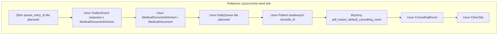

# Plan: baza produkcyjna bez seedów i demo

## Kontekst w repo

- **Źródło problemu:** migracje Django w `[apps/reception/migrations/](apps/reception/migrations/)` (np. `0005`/`0006`, `0009`, `0010`–`0012`, `0017`, `0021`–`0023`, `0025`, `0026`, `0028`) uruchamiają `RunPython`, które tworzą **placówki, pokoje, pacjentów i kolejki**. To **nie jest** sterowane przez `DEBUG` ani `ENVIRONMENT` — samo ustawienie produkcyjne w `[cogitomedica/settings.py](cogitomedica/settings.py)` **nie wyłącza** tych wstawek.
- **Stabilne identyfikatory seedów (do wykrycia / usunięcia danych):**
  - `ClinicSite.code` ∈ `**DEMO`**, `**MUC`** (druga placówka z `[0023_seed_queue_second_site_2026_03_15.py](apps/reception/migrations/0023_seed_queue_second_site_2026_03_15.py)`).
  - `Patient.doctolib_patient_id`: prefiksy `**DEMO-PAT-**`, `**DTL-2024-**`, `**DTL-2026-**` (lista dokładnych ID jest w treści migracji seedujących).
  - Emaile `**…@example.com**` w payloadach seedów (jako heurystyka, nie jako jedyne kryterium).
- **Wzór bezpiecznego usuwania** jest już w kodzie migracji `[0009_replace_demo_with_realistic_seed_data.py](apps/reception/migrations/0009_replace_demo_with_realistic_seed_data.py)`: najpierw **dokumentacja medyczna** (`MedicalDocument` + `MedicalDocumentVersion` + powiązany `**OutboxEvent`** dla wersji), potem `**DailyQueue`** (CASCADE usuwa `QueueEntry` i — przy `CASCADE` na `PatientIntakeForm.queue_entry` — formularze intake, po wcześniejszym usunięciu `MedicalDocument`, bo ma `RESTRICT` na `intake_form`).
- **Czego nie traktować jako „demo do skasowania” bez decyzji produktowej:**
  - Migracje i komenda `[apps/core/management/commands/load_default_translations.py](apps/core/management/commands/load_default_translations.py)` — to **i18n aplikacji** (`[docs/migrations-translations-summary.md](docs/migrations-translations-summary.md)`), zwykle **zostają** na produkcji.
  - Definicje zgód / anamnezy w `[apps/intake/models.py](apps/intake/models.py)` — **referencyjne**, nie seed kolejek.

## Ograniczenia modelu (kolejność operacji)

- `MedicalDocument` → `QueueEntry` i `PatientIntakeForm`: `**RESTRICT`** — najpierw usuń dokumenty (jak w `0009`).
- `DailyQueue` → `ClinicSite` / `ConsultingRoom`: `**RESTRICT`** — usuń kolejki przed usunięciem pokoi i placówek.
- `ConsultingRoom` → `ClinicSite`: `**RESTRICT`** — pokoje przed placówką.
- `ClinicSite.pdf_import_default_consulting_room`: przed usunięciem pokoju **wyzeruj** to pole (SET_NULL), jeśli wskazuje na kasowany pokój.
- `StaffUser.consulting_room`: `**SET_NULL`** przy usuwaniu pokoju — OK.
- `TabletDevice.clinic_site`: `**SET_NULL`** przy usunięciu placówki — albo ręcznie `NULL`, aldy polegać na usunięciu placówki.
- `patient_results.PatientResultsOtpSession`: `**CASCADE`** z pacjentem — przy usunięciu pacjenta sesje OTP znikną.
- `operations.AuditEvent`: `**SET_NULL`** na pacjencie / placówce — wpisy zostaną, bez referencji (akceptowalne).

## Ścieżka 1: Istniejąca baza (już po `migrate`) — jednorazowe „wyczyszczenie”

1. **Backup** (dump DB / snapshot) i — jeśli możliwe — **próba na kopii**.
2. **Inwentaryzacja przed skasowaniem** (zapytania liczące): `ClinicSite` po `code`, `Patient` po prefiksach `doctolib_patient_id`, `DailyQueue` / `QueueEntry` powiązane z tymi placówkami.
3. **Dla każdej seedowej placówki (`DEMO`, `MUC`)** — w pętli lub oddzielnie:
  - Zbiór `queue_entry_id` dla `QueueEntry` z `daily_queue__clinic_site=…`.
  - Usuń (w tej kolejności, jak `0009`): `OutboxEvent` powiązane z wersjami dokumentów → `MedicalDocumentVersion` → `MedicalDocument` dla tych `queue_entry_id`.
  - `DailyQueue.objects.filter(clinic_site=site).delete()`.
4. **Pacjenci seedowi:** `Patient` z `doctolib_patient_id` pasującym do znanych prefiksów / listy z migracji; **najpierw** odłączyć M2M `patient_clinic_site` (Django zwykle zrobi to przy `.delete()`, ale warto sprawdzić wyjątki integracyjne).
5. **Placówka i pokoje:** wyzerować `pdf_import_default_consulting_room` na `ClinicSite`, potem usunąć `ConsultingRoom` dla tej placówki, potem `ClinicSite`.
6. **Sprzątanie pozostałości:** opcjonalnie usunąć **osierocone** `PatientImportBatch` / błędy importu jeśli były tylko pod dev (tylko jeśli reguła biznesowa na to pozwala).
7. **Weryfikacja:** zero rekordów dla `DEMO`/`MUC`, zero pacjentów z prefiksami seedów; aplikacja startuje; smoke test (logowanie, lista bez demo pacjentów).
8. **Uzupełnienie produkcyjne:** utworzenie **prawdziwych** `ClinicSite` + `ConsultingRoom` (admin lub osobna procedura wdrożeniowa), przypisanie personelu (`StaffUser.clinic_sites`, `consulting_room`).

## Ścieżka 2: Świeża baza produkcyjna — żeby seed **nie wrócił**

Sam „purge” po pierwszym `migrate` wystarczy **raz**, ale **każda nowa pusta baza** z pełnym `migrate` znowu dostanie te same inserty z historii migracji.

Opcje (rosnący nakład pracy):

- **A (minimalna):** po pierwszym wdrożeniu uruchomić tę samą procedurę co Ścieżka 1 (np. management command) i z dokumentować w runbooku.
- **B (zalecana długofalowo):** dodać **nową migrację** `RunPython`, która w **forward** wywołuje ten sam kod co cleanup (no-op jeśli brak `DEMO`/`MUC`), z `noop` reverse — tak, by **ostatni stan historii** nie zostawiał sztucznych danych. Uwaga: to **nie cofa** efektu *już zastosowanych* starych migracji seedujących na istniejących DB; na istniejących instalacjach i tak potrzebny jest jednorazowy purge lub ta nowa migracja musi **usuwać** zamiast tylko „nie dodawać”.
- **C (najczystsza architektura):** **squash** lub refaktor historii tak, by seedowe `RunPython` zniknęły z ścieżki aplikowanej do nowych env — duży koszt (zgodność z DB już w produkcji, zespół).

## Rekomendacja implementacji w kodzie (opcjonalnie, poza planem „operacyjnym”)

- Wydzielić **jedną** funkcję / komendę `manage.py` (np. `purge_seed_clinics`) z logiką opartą o `[0009](apps/reception/migrations/0009_replace_demo_with_realistic_seed_data.py)` — **parametry:** lista kodów placówek (`DEMO`, `MUC`), ewentualnie `--dry-run`.
- Pokryć **testem** na pustej bazie testowej z `migrate`: po purge brak pacjentów `DTL-%` przy zachowaniu schematu.

## Ryzyka

- **Pomyłka zakresu:** jeśli kiedykolwiek użyto kodu `DEMO`/`MUC` lub pacjenta `DTL-`* do realnych wizyt — backup i audyt przed masowym `delete`.
- **Unikalność telefonu:** seedowi pacjenci zajmują numery z migracji; ich usunięcie **zwalnia** te numery dla prawdziwych rekordów (plus w `[Patient](apps/reception/models.py)` jest unikalność `phone`).

