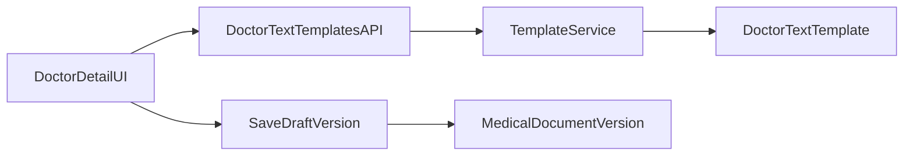

# Własne szablony lekarza (DE/EN/PL)

## Zakres i decyzje

- Używamy istniejącego modelu `DoctorTextTemplate` i rozszerzamy go o pole JSON:
  - `lesion_group_favorites` (sekwencja checkboxów/radiów + tekst grupy). Sekcja 9 korzysta z `template_body` jako pojedynczego presetu.
- Zastosowanie ulubionego dla grupy znamion: **replace-all** (nadpisuje checkboxy/radia i tekst).
- Wspieramy locale: `de-DE`, `en-GB`, `pl-PL` (oraz warianty skrócone jeśli już używane).

## Architektura

## Plan implementacji

- **Model i migracje**
  - Rozszerzyć model w `[C:/Users/piotr/Programming/cogitomedica/apps/medical/models.py](C:/Users/piotr/Programming/cogitomedica/apps/medical/models.py)`:
    - dodać `lesion_group_favorites = models.JSONField(default=list, blank=True)` (pole `summary_favorites` zostało usunięte)
  - Zaktualizować ograniczenie locale (`CheckConstraint`) tak, by akceptowało `pl`/`pl-PL` obok DE/EN.
  - Dodać migrację rozszerzającą schemat.
- **Schematy API i walidacja**
  - Rozszerzyć request/response template API w `[C:/Users/piotr/Programming/cogitomedica/apps/medical/api_schemas.py](C:/Users/piotr/Programming/cogitomedica/apps/medical/api_schemas.py)`:
    - pola create/update/list/detail dla `lesion_group_favorites`
    - walidacja struktury presetów (klucze wymagane, limity długości, typy)
  - Ustalić kontrakt JSON:
    - `lesion_group_favorites[]`: `name`, `dermatoscopic_features[]`, `clinical_assessment`, `malignancy_risk`, `text`
- **Serwisy i endpointy template**
  - Rozszerzyć serwisy w `[C:/Users/piotr/Programming/cogitomedica/apps/medical/template_services.py](C:/Users/piotr/Programming/cogitomedica/apps/medical/template_services.py)`, aby create/update/list/get zwracały i zapisywały nowe pola JSON.
  - Utrzymać aktualne endpointy (`/doctor-text-templates`, `/doctor-text-templates/{id}`) bez tworzenia nowych URL.
- **Frontend: wybór i użycie ulubionych**
  - W `[C:/Users/piotr/Programming/cogitomedica/templates/doctor/detail.html](C:/Users/piotr/Programming/cogitomedica/templates/doctor/detail.html)`:
    - dodać UI wyboru ulubionych dla grupy znamion (w obrębie template `#lesion-group-tpl`)
    - dodać UI wyboru ulubionych dla sekcji 9 (`#summary_text`)
  - W `[C:/Users/piotr/Programming/cogitomedica/static/doctor/js/befund-form.js](C:/Users/piotr/Programming/cogitomedica/static/doctor/js/befund-form.js)`:
    - pobieranie listy szablonów lekarza dla bieżącego locale
    - „apply favorite” dla grupy znamion: replace-all (checkboxy/radia + tekst)
    - „apply favorite” dla sekcji 9: wstawienie wybranego tekstu
    - zachować flow `save draft`.
- **Historyczność i zgodność AC**
  - Nie zmieniamy istniejącego mechanizmu wersjonowania `MedicalDocumentVersion`; użycie szablonu wpływa tylko na aktualną edycję.
  - Potwierdzić, że po publikacji zmiana `DoctorTextTemplate` nie dotyka historycznego `medical_payload`.
- **Testy**
  - Backend testy API:
    - create/update/list/detail template z nowymi polami
    - walidacja locale z PL
  - Testy integracyjne flow:
    - zastosowanie ulubionego presetu grupy i sekcji 9, zapis draft, odczyt kontekstu
    - zmiana szablonu po publikacji nie modyfikuje starej wersji dokumentu.

## Kryteria ukończenia

- Lekarz może tworzyć/edytować/aktywować/dezaktywować szablony z ulubionymi presetami grup dla DE/EN/PL; sekcja 9 używa treści szablonu (`template_body`) jako jednego presetu.
- Formularz pozwala zastosować preset grupy (replace-all) oraz treść szablonu w sekcji 9.
- Wersje dokumentu zachowują zapisany tekst wygenerowany i finalny po edycji; historia publikacji pozostaje niezmienna przy późniejszych zmianach szablonów.

