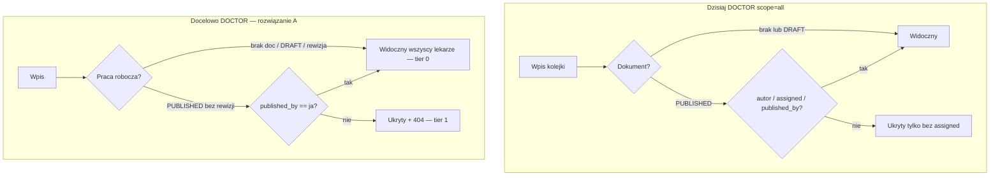
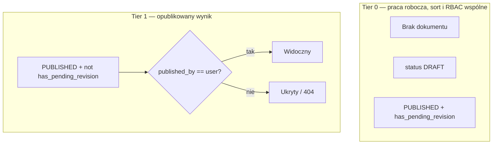
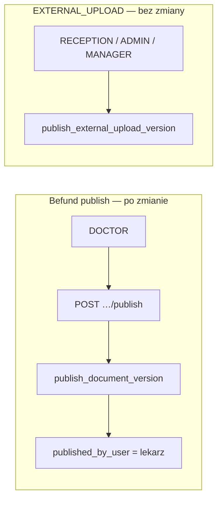
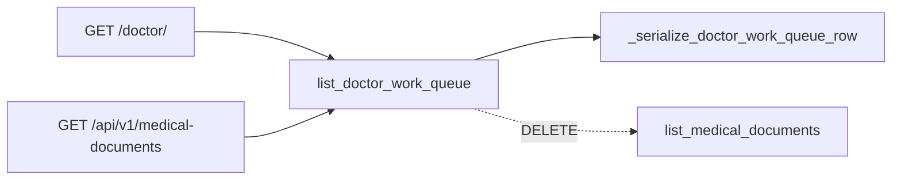
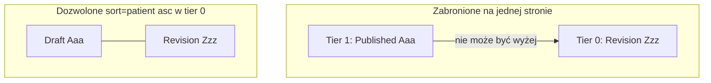

# Plan: RBAC lekarza + sortowanie Work Queue

## Stan wdrożenia (2026-05)

**Epik zamknięty w kodzie.** Poniższa sekcja „Stan obecny (skrót)” opisuje **stan sprzed wdrożenia** (archiwum decyzji).

| Warstwa | Zachowanie po wdrożeniu |
|--------|-------------------------|
| [`check_doctor_document_access`](apps/medical/services.py) | Rozwiązanie A: praca robocza wspólna; opublikowany bez rewizji tylko dla `published_by_user` |
| [`list_doctor_work_queue`](apps/medical/services.py) | Jedyna lista (HTML + API); `_doctor_work_queue_visibility_q`, tier sort z `has_pending_revision` |
| `GET /api/v1/medical-documents` | `list_doctor_work_queue` — `list_medical_documents` usunięte |
| Testy | Macierz IDOR, tier×sort, publish tylko DOCTOR (admin + manager 403), scope/in_revision lekarza, kolejność API = serwis |

Opcjonalnie poza epikiem: ukrycie `#btn-publish` dla admin/manager na `doctor/detail`, pydantic `DoctorWorkQueueListItem` w OpenAPI.

## Stan obecny (skrót) — archiwum (przed wdrożeniem)

| Warstwa | Zachowanie dziś |
|--------|------------------|
| [`check_doctor_document_access`](apps/medical/services.py) | DOCTOR: autor **lub** `assigned_doctor` **lub** dowolny `DRAFT` |
| [`list_doctor_work_queue`](apps/medical/services.py) | **Źródło prawdy** (HTML `/doctor/` już tu); DOCTOR `scope=all`: `(brak doc / DRAFT)` **lub** `personal` (autor, assigned, **published_by_user**) |
| [`list_medical_documents`](apps/medical/services.py) | **Do usunięcia** — duplikat na `MedicalDocument`; API `GET /medical-documents` dziś tu, inne filtry (brak papieru B, brak tier sort) |
| Sortowanie listy | `_doctor_queue_pub_group` + data; **dziś annotate tier 0 tylko DRAFT** (bez `has_pending_revision`) — regresja przy sort alfabetycznym |
| Test `test_draft_sorts_before_published_*` | Pilnuje DRAFT vs PUBLISHED bez rewizji; **nie** obejmuje `has_pending_revision` |

Część wymagań z TODO jest już częściowo spełniona (np. test `test_non_assigned_doctor_sees_nothing_when_only_others_published`), ale **lekarz przypisany do kolejki nadal widzi cudze PUBLISHED** przez `assigned_doctor_id` w `personal`.



**ADMIN / MANAGER (nadzór):** bez zmian — pełna widoczność przez `_is_admin_or_manager_medical_oversight`.

**DRAFT:** potwierdzone — **wspólna kolejka** dla wszystkich lekarzy (jak dziś).

---

## Rozwiązanie A (przyjęte): stan kolejki z dokumentu, nie z tabeli wersji

**Decyzja:** nie przechodzimy na „status z `MedicalDocumentVersion`” ani na nowe pole enum w DB. Korzystamy z **już istniejącego** modelu po migracji [`0017_medicaldocument_revision_state`](apps/medical/migrations/0017_medicaldocument_revision_state.py): `MedicalDocument.status`, `has_pending_revision`, `published_version_no`.

### Na czym polega

Rewizja po publikacji w kodzie **celowo** zostawia `MedicalDocument.status = PUBLISHED` i ustawia `has_pending_revision = True` (wersja robocza ma `version_status = DRAFT` z wyższym `version_no` niż `published_version_no`). To nie jest błąd modelu — to **denormalizacja** stanu wersji na wierszu dokumentu (patrz docstring `save_document_draft` w [`apps/medical/services.py`](apps/medical/services.py)).

Wprowadzamy jedno pojęcie operacyjne — **stan kolejki lekarza** (`doctor_queue_work`) — mapowane wyłącznie na pola dokumentu / brak dokumentu:

| Stan kolejki | Warunek w DB | Tier sortowania (0 = wyżej) | Widoczność DOCTOR (plan) |
|--------------|--------------|----------------------------|---------------------------|
| Brak dokumentu | `medical_document` IS NULL | 0 (praca robocza) | Widoczny (jak dziś: papier B, intake bez doc) |
| Pierwszy szkic | `status = DRAFT` | 0 | Wspólny dostęp (wszyscy lekarze) |
| Rewizja w toku | `status = PUBLISHED` AND `has_pending_revision = True` | **0** (nie 1!) | Wspólny dostęp jak szkic (wszyscy lekarze) |
| Opublikowany bez otwartej rewizji | `status = PUBLISHED` AND `has_pending_revision = False` | 1 | Tylko gdy `published_by_user` na opublikowanej wersji == ja |

Helper w serwisie (nazwa przykładowa):

- `_doctor_queue_unpublished_q()` → `Q(medical_document__isnull=True) | Q(status=DRAFT) | Q(status=PUBLISHED, has_pending_revision=True)`
- `_doctor_queue_pub_group` (annotate `Case`) → `When(_doctor_queue_unpublished_q(), then=0)`, `default=1`

### Czego rozwiązanie A **nie** robi

- **Brak migracji** schematu i brak subquery `EXISTS` na `MedicalDocumentVersion` przy każdej liście (wariant C — odrzucony: koszt, sprzeczność z architekturą 0017).
- **Brak** nowego pola `doctor_work_state` synchronizowanego przy każdym zapisie wersji (wariant B — osobny epik, jeśli kiedyś zechcemy jedno pole w API).
- **Nie** zmienia semantyki publikacji / outboxu / portalu pacjenta — tylko kolejka lekarza, `check_doctor_*` i spójny filtr list API.

### Dlaczego A zamyka krytykę „dwa rodzaje roboczego”

| Problem bez A | Po A |
|---------------|------|
| Rewizja ląduje w grupie sortowania „opublikowane” (pod szkicami) | Rewizja w **tier 0** razem z DRAFT i brakiem dokumentu |
| Plan mówił tylko `status=DRAFT` → rewizja niewidoczna / niewspółdzielona | `has_pending_revision` traktowane jak **praca robocza** |
| Myślenie „DRAFT = wspólne” vs „PUBLISHED = tylko moje” | Rozdzielenie: **praca robocza** (3 przypadki) vs **gotowy wynik** (opublikowany bez rewizji + RBAC publisher) |

### Decyzje produktowe w ramach A (zamknięte na wdrożenie)

1. **Rewizja (`has_pending_revision`):** wspólna dla wszystkich lekarzy — ten sam dostęp co pierwszy szkic (`check_doctor_document_access` jak dla DRAFT).
2. **Opublikowany bez rewizji:** tylko lekarz będący `published_by_user` na aktualnej opublikowanej wersji (bez `assigned_doctor` / `created_by` jako wyjątku).
3. **ADMIN / MANAGER:** pełna widoczność bez zmian.



---

## Punkt 1 — Ograniczenie widoczności DOCTOR

### 1.1 Wspólna reguła (jedno miejsce w kodzie)

Dodać w [`apps/medical/services.py`](apps/medical/services.py) helpery, np.:

- `_published_by_user_exists_subquery(user_id)` — `Exists` na `MedicalDocumentVersion` z `version_status=PUBLISHED` i `published_by_user_id=user_id` dla `queue_entry` / `medical_document`.
- `_doctor_queue_unpublished_q()` — warunek **pracy roboczej** (rozwiązanie A): brak dokumentu **lub** `status=DRAFT` **lub** (`status=PUBLISHED` i `has_pending_revision=True`).
- `_doctor_work_queue_visibility_q(user, scope)` — buduje `Q` dla querysetu `QueueEntry`:
  - widoczne dla lekarza: `_doctor_queue_unpublished_q()` **lub** opublikowany wynik z `published_by_user` (subquery `Exists` na `MedicalDocumentVersion` PUBLISHED)
  - **scope** — tylko dla **nadzoru** (ADMIN/MANAGER); lekarz: patrz **punkt 5** (domyślnie `all`, bez `mine` / `published_by_me`)
- `_doctor_may_access_medical_document(doc, user)` — logika dla detail/API:
  - oversight → `True`
  - lekarz + praca robocza: brak dokumentu (nie dotyczy tej funkcji) / `status=DRAFT` / `has_pending_revision` → `True` (wspólna kolejka)
  - lekarz + `status=PUBLISHED` i `not has_pending_revision` → `True` tylko gdy `published_by_user_id == user.id` na opublikowanej wersji (wg `published_version_no` lub max PUBLISHED)
  - w pozostałych przypadkach → `False`

### 1.2 Miejsca do podpięcia

| Miejsce | Zmiana |
|---------|--------|
| `check_doctor_document_access` | Zastąpić regułę autor/assigned dla PUBLISHED → `_doctor_may_access_medical_document` |
| `check_doctor_queue_entry_access` | Dla istniejącego dokumentu: to samo; bez dokumentu — lekarz OK jeśli wpis kwalifikuje się do kolejki (jak dziś) |
| `list_doctor_work_queue` | Zastąpić blok `personal` / `shared_draft_or_pending` dla `not is_oversight` → `_doctor_work_queue_visibility_q` (**jedyna lista**) |
| `get_medical_document_context` | Już woła `check_doctor_document_access` — automatycznie 404 przez `ObjectDoesNotExist` |

**Efekt uboczny (świadomy):** dokument `EXTERNAL_UPLOAD` opublikowany przez **recepcję** (`published_by_user` = recepcja) **nie pojawi się** na liście lekarza i nie otworzy się po UUID — zgodnie z TODO (ścieżka recepcji, nie panel opisów).

### 1.3 Widoki HTML i API

- [`cogitomedica/doctor_views.py`](cogitomedica/doctor_views.py): `doctor_list_view`, `doctor_document_detail_view`, `doctor_open_by_queue_view` — bez duplikacji logiki (tylko serwis).
- [`apps/medical/api_views.py`](apps/medical/api_views.py): wszystkie endpointy z `check_doctor_document_access` — spójne **404** przy odmowie RBAC (patrz **punkt 6**).
- **Bezpośredni URL** do cudzego PUBLISHED → `ObjectDoesNotExist` → 404 w HTML / API.

### 1.4 Testy widoczności (serwis + lista)

Rozszerzyć [`apps/medical/tests/test_services_coverage.py`](apps/medical/tests/test_services_coverage.py):

- Lekarz **przypisany** do kolejki, PUBLISHED przez **innego** lekarza → `list_doctor_work_queue` **0**, `check_doctor_document_access` → `DoesNotExist`.
- Lekarz nieprzypisany, DRAFT innego → **widoczny** (shared draft).
- Lekarz B, dokument opublikowany przez A z **otwartą rewizją** (`has_pending_revision`) → **widoczny** i w **tier 0** listy (rozwiązanie A).
- Lekarz przypisany, PUBLISHED przez innego **bez** rewizji → lista **0**, detail **404**.

**Macierz IDOR (osobno, punkt 6.3)** — jeden scenariusz na endpoint **nie wystarczy**.

---

## Punkt 2 — `published_by_user` jako jedyny klucz prawdy (publikacja tylko DOCTOR)

**Cel:** RBAC z punktu 1 zakłada, że **opublikowany wynik** na liście lekarza widzi wyłącznie lekarz z `MedicalDocumentVersion.published_by_user`. Dziś endpoint publikacji Befund dopuszcza też **ADMIN** i **MANAGER** (`published_by_user_id = request.user.id`), co tworzy „martwe” wpisy (opublikował nadzór, przypisany lekarz nie widzi) — patrz [`.ai/TODO.md`](.ai/TODO.md) linia 9.

### 2.1 Kto publikuje w praktyce (stan obecny)

| Ścieżka | Endpoint / widok | `allowed_roles` dziś | `published_by_user` |
|---------|------------------|----------------------|---------------------|
| Befund / intake cyfrowy + papier | `POST …/medical-documents/{id}/publish` → [`medical_document_publish_view`](apps/medical/api_views.py) | **DOCTOR, ADMIN, MANAGER** | `request.user.id` |
| Panel lekarza | [`befund-form.js`](static/doctor/js/befund-form.js) → ten sam API | tylko użytkownicy z dostępem do `/doctor/` (lekarz + nadzór) | jak wyżej |
| Zewnętrzne badanie (EXTERNAL_UPLOAD) | `POST …/external-upload/publish`, hub recepcji [`external_upload_admin_views.py`](apps/reception/external_upload_admin_views.py) | **RECEPTION, ADMIN, MANAGER** | recepcja / nadzór |
| Serwis (bez HTTP) | [`publish_document_version`](apps/medical/services.py) | **brak** sprawdzenia roli | dowolne `published_by_user_id` z wywołania |

**Decyzja produktowa (zamknięta na wdrożenie tego epiku):**

1. **Befund / dokument medyczny z opisem (wszystkie `source_type` oprócz flow EXTERNAL_UPLOAD):** publikować może **wyłącznie** `StaffUser` z rolą **DOCTOR** (`user.is_doctor`).
2. **EXTERNAL_UPLOAD:** **bez zmian** — publikuje recepcja (lub ADMIN/MANAGER); to osobny produkt, nie panel Befund. Po RBAC z punktu 1 taki dokument i tak **nie** trafia na listę lekarza (publisher ≠ lekarz) — świadome.
3. **ADMIN / MANAGER:** nadal **pełna widoczność** (oversight), edycja szkicu z bypass locka na `PUT …/draft` — **bez** prawa publikacji Befund.
4. **Dane historyczne:** wersje już opublikowane przez ADMIN/MANAGER **nie migrujemy**; po wdrożeniu RBAC lekarz ich nie zobaczy na liście (tylko oversight). Opcjonalny raport SQL do audytu — poza kodem aplikacji.



### 2.2 Zmiany w kodzie (obowiązkowe)

| Warstwa | Plik | Zmiana |
|---------|------|--------|
| API | [`apps/medical/api_views.py`](apps/medical/api_views.py) — `medical_document_publish_view` | `require_user_role(..., allowed_roles={"DOCTOR"})` zamiast `DOCTOR, ADMIN, MANAGER` |
| API — lock przy publish | ten sam widok | Przy `status=DRAFT`: zostawić blokadę „tylko holder locka”; **usunąć** wyjątek `_is_admin_or_manager_medical_oversight` przy publish (nadzór i tak dostanie **403** na wejściu). Alternatywa: zostawić dead code — **nie**; uprościć warunek locka. |
| Serwis (defense in depth) | [`apps/medical/services.py`](apps/medical/services.py) | Nowy helper `_assert_staff_user_may_publish_medical_document(actor)` → `actor.is_doctor`, inaczej `DomainError` z nowym kluczem i18n (np. `other.domain.medical_document_publish_doctor_role_required`). Wywołać na początku `publish_document_version` po rozwiązaniu `StaffUser` z `published_by_user_id` (analogicznie do `_assert_staff_user_may_act_on_external_upload` przy external upload). |
| OpenAPI | [`cogitomedica/openapi_extension.py`](cogitomedica/openapi_extension.py) — `…/publish` | Opis: **DOCTOR only**; response **403** dla innych ról; usunąć wzmiankę o bypass locka przez MANAGER/ADMIN przy publish. |
| Tłumaczenia | [`apps/core/translation_data/other_domain.json`](apps/core/translation_data/other_domain.json) + migracja seed | Klucz błędu roli przy publikacji (DE/PL minimum). |
| Dokumentacja | [`docs/manual/03-doktor.md`](docs/manual/03-doktor.md), [`docs/SECURITY_AUDIT.md`](docs/SECURITY_AUDIT.md) | Publikacja wyniku = wyłącznie lekarz; manager/admin przeglądają, nie publikują. |
| TODO | [`.ai/TODO.md`](.ai/TODO.md) linia 9 | Odlinkować do tego planu; odhaczyć po merge epiku. |

**Bez zmian w tym epiku:**

- `medical_external_upload_publish_view`, `_assert_staff_user_may_act_on_external_upload`, hub recepcji.
- `revoke_document_version` / `medical_document_revoke_view` — nadal DOCTOR+ADMIN+MANAGER (osobna decyzja produktowa; nie blokuje spójności `published_by_user` przy publikacji).
- Pozostałe endpointy medyczne z `allowed_roles={"DOCTOR", "ADMIN", "MANAGER"}` (draft, preview, lock…) — **bez** zmiany; tylko **publish** jest restrykcyjny.

### 2.3 Testy

| Test | Plik | Oczekiwanie |
|------|------|-------------|
| ADMIN publish Befund | [`apps/medical/tests/test_api.py`](apps/medical/tests/test_api.py) | **403** (zamiast `test_admin_can_override_lock_on_publish` → 200); dodać `test_manager_cannot_publish_medical_document` |
| DOCTOR publish przy cudzym locku | `test_api.py` | **423** gdy lock innego lekarza; **200** gdy własny lock / brak locka |
| ADMIN nadal omija lock na **draft** | istniejące testy draft | bez regresji |
| Serwis: publish z `published_by_user_id` managera | [`apps/medical/tests/test_services.py`](apps/medical/tests/test_services.py) | `DomainError` + klucz i18n |
| Integracja RBAC | `test_services_coverage` / `test_api` | Po publikacji przez lekarza A, lekarz B (assigned) **nie** widzi wpisu — spójne z punktem 1 |

Wywołania `publish_document_version` w testach outbox/operations — używać **wyłącznie** `staff_user` z rolą DOCTOR (już tak w większości fixture’ów; zweryfikować przy review).

### 2.4 UI

[`static/doctor/js/befund-form.js`](static/doctor/js/befund-form.js) — przycisk publikacji tylko na stronach `/doctor/`; dla użytkownika ADMIN/MANAGER na tym URL (jeśli w ogóle wchodzą) POST publish zwróci **403** — opcjonalnie ukryć `#btn-publish` w szablonie gdy `not request.user.is_doctor` ([`templates/doctor/detail.html`](templates/doctor/detail.html) + kontekst w [`doctor_views.py`](cogitomedica/doctor_views.py)) — **rekomendacja:** ukryć przycisk + krótki komunikat w i18n (`doctor.publish_doctor_role_only`), żeby nie mylić nadzoru.

### 2.5 Kolejność względem RBAC (punkt 1)

Epik **2** najlepiej wdrożyć **razem z lub tuż przed** punktem 1.2: po ograniczeniu publisherów do lekarzy reguła `published_by_user == ja` przestaje mieć wyjątki „opublikował admin”. Kolejność w diagramie wdrożenia — patrz sekcja „Kolejność wdrożenia” poniżej.

---

## Punkt 4 — Jedno źródło prawdy listy (HTML = API = `list_doctor_work_queue`)

**Problem (dwa źródła prawdy):** panel lekarza (`doctor_list_view`) woła [`list_doctor_work_queue`](apps/medical/services.py) na `QueueEntry` (stany A/B/C, tier sort, SLA, papier bez dokumentu). `GET /api/v1/medical-documents` woła [`list_medical_documents`](apps/medical/services.py) na `MedicalDocument` — inny filtr widoczności, brak wierszy „papier autoryzowany, brak doc”, inne `order_by` (`-updated_at` zamiast `_doctor_queue_pub_group`). Każda zmiana RBAC/sortu wymagała dotąd **dwóch** implementacji albo „parity” w komentarzu — to dług do usunięcia.

**Decyzja (zamknięta):** `list_doctor_work_queue` + [`_serialize_doctor_work_queue_row`](apps/medical/services.py) to **jedyne** miejsce logiki listy work queue. HTML już tak działa; API ma zostać doprowadzone do tego samego kontraktu.



### 4.1 Usunąć (bez deprecacji)

| Element | Plik | Uwaga |
|---------|------|--------|
| `list_medical_documents()` | [`apps/medical/services.py`](apps/medical/services.py) | Cała funkcja (~80 linii) |
| `_serialize_medical_document_list_item()` | [`apps/medical/api_views.py`](apps/medical/api_views.py) | Zastąpione wierszem work queue |
| Import / wywołania `list_medical_documents` | `api_views.py`, testy | Tylko work queue lub HTTP list |

**Nie** zostawiać cienkiego wrappera `list_medical_documents = list_doctor_work_queue` — myląca nazwa i kusząca powrót do querysetu na `MedicalDocument`.

### 4.2 Zmiany API `GET /api/v1/medical-documents`

| Warstwa | Zmiana |
|---------|--------|
| [`medical_documents_view`](apps/medical/api_views.py) (GET) | `items, total = list_doctor_work_queue(**list_params, user=request.user)`; `items` już są dictami — zwrócić bez drugiej serializacji |
| Parser parametrów | Przemianować `parse_medical_documents_list_params` → **`parse_doctor_work_queue_list_params`** (alias starej nazwy **nie** dodawać); używać w `doctor_views` i `api_views` |
| POST na tym samym URL | **Bez zmian** — tworzenie dokumentu nadal osobna ścieżka |
| OpenAPI | [`cogitomedica/openapi_extension.py`](cogitomedica/openapi_extension.py): opis „Doctor work queue (QueueEntry)”; usunąć odniesienie do `list_medical_documents`; opcjonalnie pydantic `DoctorWorkQueueListItem` w [`openapi_schemas.py`](cogitomedica/openapi_schemas.py) odzwierciedlający pola `_serialize_doctor_work_queue_row` |
| Audit | `MEDICAL_DOCUMENTS_LISTED` — metadata bez zmiany semantyki (nadal lista kolejki lekarza) |

### 4.3 Kontrakt odpowiedzi API (breaking, świadomy)

Kanoniczny kształt wiersza = dict z `_serialize_doctor_work_queue_row` (jak HTML), m.in.:

- `queue_entry_id` (klucz wiersza kolejki)
- `document_id` zamiast historycznego `id` na liście dokumentów
- `paper_intake_action_required`, `row_is_published`, `row_has_edit_semaphore`, pola SLA, `published_by` (display), `has_pending_revision`, …

**Nie** mapować z powrotem `document_id` → `id` „dla kompatybilności” — to utrzymuje dług. Zaktualizować:

- [`apps/medical/tests/test_api.py`](apps/medical/tests/test_api.py) — `test_medical_documents_list_get` i inne asercje na `item["id"]`
- [`apps/medical/tests/test_services_coverage.py`](apps/medical/tests/test_services_coverage.py) — testy `list_medical_documents_*` → `list_doctor_work_queue_*` lub test integracyjny GET list
- [`apps/medical/tests/test_api_coverage.py`](apps/medical/tests/test_api_coverage.py) — GET list jeśli dotyczy

Klient zewnętrzny (jeśli jest): jeden wpis bez dokumentu ma `document_id: null`, nawigacja po `queue_entry_id` / `doctor/open/{queue_entry_id}/`.

### 4.4 Powiązanie z RBAC i sortowaniem (punkty 1 i 3)

- **RBAC widoczności** — implementować **wyłącznie** w `list_doctor_work_queue` (helper `_doctor_work_queue_visibility_q`); API i HTML dostają to automatycznie.
- **Sort `sort` / `order`** — dodać tylko w `parse_doctor_work_queue_list_params` + `order_by` w `list_doctor_work_queue` (punkt 3); **nie** duplikować na `MedicalDocument`.
- **Rozwiązanie A** (`_doctor_queue_unpublished_q` w tier 0) — jedna annotacja `_doctor_queue_pub_group` w jednym querysetcie.

### 4.5 Testy regresji po ujednoliceniu

| Scenariusz | Oczekiwanie |
|------------|-------------|
| Cyfrowy intake SUBMITTED, doc DRAFT | Wiersz na GET API i HTML |
| Papier: autoryzacja, brak `medical_document` | Wiersz API z `paper_intake_action_required=true` (dziś **brak** na liście API) |
| Dwa lekarze, PUBLISHED przez A | Lekarz B: lista API **0** (po RBAC punktu 1) |
| `sort=patient&order=asc` | Identyczna kolejność `queue_entry_id` w API i w `list_doctor_work_queue` w teście serwisowym |

### 4.6 Dokumentacja

- [`docs/manual/03-doktor.md`](docs/manual/03-doktor.md) — jedna lista work queue; API list = ten sam zbiór wpisów co strona główna lekarza.
- [`.ai/TODO.md`](.ai/TODO.md) linia 14 — doprecyzować, że spójność API/HTML = ten epik (nie osobna implementacja sortu na `MedicalDocument`).

---

## Punkt 5 — `scope`, filtry i martwy UI (uproszczenie pod RBAC)

**Problem:** plan zostawiał pełny zestaw filtrów (`scope=all|mine|published_by_me|in_revision`, dropdown `published_by_user_id`) przy zaostrzonym RBAC. Większość staje się **martwa lub myląca** — koszt tłumaczeń/seed bez korzyści UX.

### 5.1 Analiza po nowym RBAC (lekarz, nie nadzór)

Widoczny zbiór `V` = **tier 0** (wspólna praca: brak doc / `DRAFT` / rewizja) ∪ **tier 1** (tylko `published_by_user == ja`).

| Parametr dziś | Semantyka w kodzie (skrót) | Po RBAC dla DOCTOR |
|---------------|----------------------------|---------------------|
| `scope=all` | `shared_draft_or_pending \| personal` | = `V` (docelowa baza) |
| `scope=published_by_me` | wiersze z moją wersją PUBLISHED | ⊆ tier 1; **redundantne** względem `status=PUBLISHED` (i tak nie widać cudzych PUBLISHED) |
| `scope=mine` | autor **lub** `assigned_doctor` **lub** published_by | **Niezdefiniowane w planie**; dziś ≠ „moja kolejka” po RBAC; często **pusto** lub wycinek bez sensu („Moje?”) |
| `scope=in_revision` | `has_pending_revision` **∧ personal** | **Błędne:** rewizja w tier 0 jest **wspólna** — `∧ personal` ukrywa cudze rewizje widoczne w `all` |
| `published_by_user_id` | filtr po publisherze | Tylko **ja** daje wynik; inni lekarze → **zawsze pusto**; dropdown **redundantny** |

**ADMIN/MANAGER:** pełna widoczność — `scope` i `published_by_user_id` **zostają** (nadzór, raporty, „kto opublikował”).

### 5.2 Decyzje produktowe (zamknięte)

| Warstwa | DOCTOR | ADMIN / MANAGER |
|---------|--------|-----------------|
| UI [`list.html`](templates/doctor/list.html) | **Ukryć** `<select scope>` i `<select published_by_user_id>` (`show_oversight_filters` w kontekście) | Bez zmian — oba dropdowny |
| Domyślny `scope` | Zawsze efektywnie **`all`** (brak pola w formularzu) | Jak dziś |
| API / parser | `parse_doctor_work_queue_list_params`: dla `user.is_doctor` i nie-oversight — **wymusić** `scope=all`, **zignorować** `published_by_user_id`; `mine` / `published_by_me` z URL traktować jak `all` (bez błędu, bez nowych kluczy i18n) | Pełna obsługa scope i `published_by_user_id` |
| `in_revision` | **Opcja A (przyjęta):** usunąć z UI lekarza; w serwisie dla lekarza **nie** stosować `in_revision ∧ personal` — jeśli kiedyś query z URL: `in_revision` = `has_pending_revision` **w obrębie** `V` (wspólne rewizje). **Opcja B (odrzucona):** osobny checkbox „Tylko rewizje” — nie w tym epiku | Bez zmian |
| Kolumna tabeli „Opublikował” | **Zostaje** (informacja), nie filtr | Zostaje + filtr |
| Nowe tłumaczenia / migracje seed | **Nie** dodawać etykiet pod martwe filtry lekarza; ewent. jeden krótki tekst pomocy przy `status` w manualu | — |

**Nie** redefiniować `mine` na „przypisana kolejka” w tym epiku — to nowy produkt; po RBAC lekarz i tak widzi wspólne szkice w `all`.

### 5.3 Zmiany w kodzie

| Miejsce | Zmiana |
|---------|--------|
| [`list_doctor_work_queue`](apps/medical/services.py) | Po `_doctor_work_queue_visibility_q` dla lekarza: gałęzie `scope=mine` / `published_by_me` **usunąć** lub nie wywoływać (zawsze baza `V`); `in_revision` bez `personal` — `qs.filter(in_revision_q)` wewnątrz widoczności |
| [`doctor_list_view`](cogitomedica/doctor_views.py) | `show_oversight_filters = _is_admin_or_manager_medical_oversight(request.user)`; nie przekazywać `published_by_doctor_options` lekarzowi |
| [`list.html`](templates/doctor/list.html) | `` wokół scope + published_by |
| OpenAPI `GET /medical-documents` | Opis: `scope` / `published_by_user_id` — **oversight only**; lekarz ignoruje |
| Testy | Lekarz: `scope=published_by_me` ≡ `all` na tym samym zbiorze; `in_revision` zwraca rewizję **innego** lekarza jeśli tier 0 wspólna; HTML bez selectów scope dla doctor client |

### 5.4 Koszt / zysk

- **Oszczędność:** brak drugiej rundy tłumaczeń pod „Moje” / „Opublikował” dla roli, która i tak ma jeden sensowny widok kolejki.
- **Zysk UX:** mniej pustych list i pytań „dlaczego filtr nic nie pokazuje?”.

---

## Punkt 3 — Sortowanie listy Work Queue

### 3.0 Ukryte koszty sortu — reguła „praca robocza na górze” (antyregresja)

**Ryzyko po włączeniu `sort` / `order`:** użytkownik sortuje alfabetycznie (`sort=patient`, `order=asc`) i **legalnie** (przy złej definicji grupy) widzi na górze strony opublikowanych pacjentów z nazwiskiem na **A**, a **pod spodem** pilne szkice lub rewizje na **Z** — bo sort kolumnowy „wygrywa” nad sensem kolejki.

**Stan kodu dziś:** [`_doctor_queue_pub_group`](apps/medical/services.py) w `list_doctor_work_queue` ma tier **0** tylko dla `medical_document IS NULL` **lub** `status=DRAFT`. Wpis `PUBLISHED` + `has_pending_revision=True` wpada do **tier 1** (default `Case`) — sprzeczne z rozwiązaniem A i z produktem („rewizja = praca do zrobienia”).

**Niedopuszczalna regresja (invariant wdrożenia):**

> Na każdej stronie listy, dla **dowolnych** `sort` i `order`, **żaden** wiersz tier **1** (opublikowany wynik bez otwartej rewizji) nie może pojawić się **przed** żadnym wierszem tier **0** (praca robocza).

Przykład, którego **nie wolno** dopuścić: opublikowany bez rewizji `last_name="Aaa"` nad rewizją `last_name="Zzz"` ani nad cudzym `DRAFT` na „Zzz”, gdy użytkownik wybrał sort alfabetyczny rosnąco.

**Definicja grupy — jedno źródło prawdy (nie negocjować przy sortowaniu):**

Tier 0 = dokładnie [`_doctor_queue_unpublished_q()`](apps/medical/services.py) z rozwiązania A:

```text
brak dokumentu  OR  status=DRAFT  OR  (status=PUBLISHED AND has_pending_revision=True)
```

Tier 1 = wszystko inne widoczne na liście (opublikowany wynik bez rewizji).

**Implementacja obowiązkowa przed UI sortu:**

1. Wyciągnąć `_doctor_queue_unpublished_q()` (jeden `Q`).
2. `_doctor_queue_pub_group` = `Case(When(_doctor_queue_unpublished_q(), then=0), default=1)` — **ten sam** warunek co RBAC „praca robocza”, bez duplikacji `When` tylko na `DRAFT`.
3. `order_by` **zawsze** zaczyna się od `"_doctor_queue_pub_group"` (rosnąco: 0 przed 1), potem dopiero pola z §3.2 — **nigdy** opcjonalnie, **nigdy** za wyjątkiem „gdy sort=date”.

**Testy istniejące — niewystarczające:**

- [`test_draft_sorts_before_published_even_when_published_is_newer`](apps/medical/tests/test_services_coverage.py) — tylko `DRAFT` vs `PUBLISHED` bez `has_pending_revision`; zostaje jako regresja bazowa, ale **nie** zamyka epiku sortu.
- **Przed** merge sortu UI: rozszerzyć / uzupełnić o scenariusz rewizji (poniżej).



### 3.1 Parametry GET (wspólne parser)

W [`parse_doctor_work_queue_list_params`](apps/medical/services.py) (przemianowane z `parse_medical_documents_list_params` — patrz punkt 4):

| Parametr | Wartości | Domyślnie |
|----------|----------|-----------|
| `sort` | `date`, `patient` | `date` |
| `order` | `asc`, `desc` | `desc` |

Walidacja: nieznane wartości → fallback do domyślnych.

### 3.2 `order_by` w `list_doctor_work_queue`

**Zawsze pierwsze:** `_doctor_queue_pub_group` z **`_doctor_queue_unpublished_q()`** (§3.0) — implementacja **musi** zostać poprawiona **przed** włączeniem parametrów `sort`/`order` w UI (dziś w kodzie brakuje `has_pending_revision` w `Case`).

Test [`test_draft_sorts_before_published_even_when_published_is_newer`](apps/medical/tests/test_services_coverage.py) — zachować; docstring uzupełnić, że dotyczy tier 0/1 przy **pierwszym** szkicu, nie rewizji.

**Wewnątrz grupy (tier 0 lub 1):**

| `sort=date` | `order=desc` (domyślne) | `order=asc` |
|-------------|---------------------------|-------------|
| Pola | `-doctor_list_sort_at`, `-daily_queue__queue_date`, `-id` | `doctor_list_sort_at`, `daily_queue__queue_date`, `id` |

| `sort=patient` | `order=asc` | `order=desc` |
|----------------|-------------|--------------|
| Pola | `patient__last_name`, `patient__first_name`, `id` | `-patient__last_name`, `-patient__first_name`, `-id` |

`NULLS LAST` dla `doctor_list_sort_at` przy sortowaniu rosnącym — opcjonalnie `F(...).asc(nulls_last=True)` jeśli Postgres (projekt używa PostgreSQL w Dockerze).

### 3.3 UI — [`templates/doctor/list.html`](templates/doctor/list.html)

- Nagłówki kolumn **Data wizyty / kolejki** i **Pacjent** jako linki GET budowane przez **ten sam helper** co paginacja (§3.6) — nie ręczne sklejanie query w szablonie.
- Przełącznik kierunku: klik w aktywną kolumnę odwraca `order`; klik w drugą kolumnę ustawia `sort` i domyślnie `desc` (data) lub `asc` (alfabet — rekomendacja UX).
- Wskaźnik aktywnego sortowania (↑/↓) w szablonie na podstawie `filters.sort` / `filters.order` z kontekstu [`doctor_list_view`](cogitomedica/doctor_views.py).

### 3.4 Tłumaczenia

Nowe klucze w [`apps/core/translation_data/doctor_ui.json`](apps/core/translation_data/doctor_ui.json) + migracja seed w `apps/core/migrations/` (wzorzec jak `0099_seed_doctor_revoke_publication_ui.py`):

- `doctor.list_sort_date`, `doctor.list_sort_patient`, `doctor.list_sort_asc`, `doctor.list_sort_desc` (lub krótkie aria-label pod nagłówkami).

### 3.5 API i OpenAPI

- Parametry `sort` / `order` na `GET /api/v1/medical-documents` — obsługiwane przez **`list_doctor_work_queue`** (punkt 4); bez osobnej ścieżki na `MedicalDocument`.
- Zaktualizować [`cogitomedica/openapi_extension.py`](cogitomedica/openapi_extension.py): query `sort`, `order` + opis tier 0/1.

### 3.6 Paginacja i formularz filtrów (UX query — weryfikacja)

**Stan w repozytorium (zweryfikowane):**

| Ścieżka | Zachowanie dziś | Po dodaniu `sort`/`order` |
|---------|-----------------|---------------------------|
| Linki paginacji (`prev_query`, `page_link_items`, `next_query`) | [`_doctor_list_page_querystring`](cogitomedica/doctor_views.py) kopiuje **całe** `request.GET` (tylko nadpisuje `page`) | **OK** — sort/order w URL zostaną przy zmianie strony |
| Formularz filtrów w [`list.html`](templates/doctor/list.html) | GET z polami: `status`, `scope`, `queue_date`, `patient_search`, `published_by_user_id` — **bez** `page`, **bez** `sort`/`order` | **Regresja:** submit filtra zbuduje URL tylko z pól formularza → **sort i order znikną** |
| Nagłówki tabeli (sort) | Jeszcze **nie ma** w szablonie | Linki muszą iść przez wspólny helper; inaczej ten sam problem co przy filtrze |

**Wniosek:** problem **nie występuje jeszcze** (brak sortu w UI), ale plan sortowania **musi** zaadresować formularz — samo „hidden w paginacji” nie wystarczy. Samo dopisanie ręcznych `<input type="hidden" name="sort">` w szablonie jest **kruche** (łatwo zapomnieć przy kolejnym parametrze listy w code review).

**Zasady wdrożenia (obowiązkowe):**

1. **Jeden helper** w [`doctor_views.py`](cogitomedica/doctor_views.py), np. `build_doctor_list_querystring(request, *, page: int | None = ..., sort: str | None = ..., order: str | None = ..., **overrides)` z **whitelistą** parametrów listy: `status`, `queue_date`, `patient_search`, `sort`, `order`, `page`, oraz **`scope` / `published_by_user_id` tylko gdy nadzór** (punkt 5).
2. Używa go: paginacja (zamiast tylko `_doctor_list_page_querystring` — można rozszerzyć istniejącą funkcję), linki sort w nagłówkach, opcjonalnie generacja query w widoku.
3. **Formularz filtrów:** w kontekście widoku `list_query_hidden` — słownik parametrów do zachowania (**wyłącznie** `sort`, `order`; pola widoczne nadpisują wartości przy submit). W szablonie **pętla** `` — nie pojedyncze hidden na sztywno.
4. **`page`:** celowo **nie** w hidden przy submit filtra — zmiana filtra = strona 1 (brak `page` w URL). Przy paginacji `page` ustawia helper.
5. **Checklist PR / code review:** nowy parametr GET listy → wpis do whitelisty helpera + test; zakaz linków `?sort=…` sklejanych ad hoc w HTML.

**Test regresji UX** ([`cogitomedica/tests/test_doctor_views.py`](cogitomedica/tests/test_doctor_views.py)):

- `GET /doctor/?sort=patient&order=asc&status=DRAFT` → 200.
- `GET /doctor/?status=DRAFT&sort=patient&order=asc` symulujący submit formularza (tylko pola filtra + hidden z widoku) **albo** asercja, że wygenerowany `list_query_hidden` zawiera sort/order, a odpowiedź po „filtrze” nadal ma `sort=patient` w tabeli/kontekście `filters`.
- Osobno: paginacja strona 2 z `sort=patient` — link `page=2` nadal zawiera `sort` i `order` (test na `pagination.next_query` / HTML).

**Antywzorzec (odrzucony w planie):** „dodaj hidden sort/order ręcznie w `list.html`” bez helpera i testu — dokładnie to, co łatwo przeoczyć przy review.

### 3.7 Testy sortowania (macierz sort × tier — obowiązkowe)

**Blokujące (bez nich nie włączać sortu w UI):**

| Test (nazwa robocza) | Ustawienie | Asercja |
|----------------------|------------|---------|
| `test_revision_in_tier0_above_published_without_revision` | Rewizja (`PUBLISHED`, `has_pending_revision=True`, nazwisko **Zzz**, nowszy `doctor_list_sort_at`); obok opublikowany bez rewizji **Aaa**; domyślny sort daty | Indeks rewizji &lt; indeks opublikowanego |
| `test_tier0_precedes_tier1_sort_patient_asc_antiregression` | Ten sam układ co wyżej; `sort=patient`, `order=asc` | **Pierwszy** wiersz listy to tier 0 (rewizja Zzz), **nie** opublikowany Aaa — **bezpośrednio** łapie regresję z §3.0 |
| `test_tier0_precedes_tier1_sort_patient_desc` | Draft **Aaa** + published **Zzz** (bez rewizji); `sort=patient`, `order=desc` | Wszystkie tier 0 przed tier 1; w tier 0 kolejność Zzz przed Aaa (alfabet w grupie), ale tier 1 dopiero po całej grupie 0 |
| `test_draft_and_revision_both_tier0_above_published` | DRAFT + rewizja + opublikowany bez rewizji; każda para `sort`×`order` z tabeli poniżej | `max(index tier0) < min(index tier1)` na stronie |

**Macierz parametrów** (parametryzowany test, np. `subTest`):

| `sort` | `order` | Minimum do sprawdzenia |
|--------|---------|-------------------------|
| `date` | `desc` | Rewizja nad opublikowanym mimo nowszej daty opublikowanego (uzupełnienie starego testu o `has_pending_revision`) |
| `date` | `asc` | Tier 0 nadal przed tier 1 |
| `patient` | `asc` | **Antyregresja Aaa / Zzz** (§3.0) |
| `patient` | `desc` | Tier 0 blok przed tier 1 |

**Wewnątrz tier 0 / tier 1** (po spełnieniu invariantu):

- Dwa DRAFT + dwa PUBLISHED (własne) — przy `sort=patient&order=asc` kolejność alfabetyczna **tylko wewnątrz** grupy 0, potem grupa 1.
- Przy `sort=date&order=desc` nowszy `doctor_list_sort_at` wyżej **w obrębie** tier 0, potem tier 1.

**Implementacja testów:** ustawiać `has_pending_revision=True` na `MedicalDocument` + wersja DRAFT z `version_no` &gt; `published_version_no` (fixture jak w testach rewizji); nie polegać wyłącznie na `status=DRAFT` dokumentu.

**Kryterium akceptacji epiku sort:** żaden PR nie może zmergować nagłówków sort w `list.html`, dopóki parametryzowany test tier0/tier1 nie przechodzi dla wszystkich czterech kombinacji `sort`/`order`.

---

## Punkt 6 — Bezpieczeństwo i semantyka błędów (404, audyt, IDOR)

### 6.1 Odpowiedź HTTP: 404 zamiast 403 przy cudzym UUID

**Decyzja (zamknięta, zgodna z dziś):** gdy lekarz **nie** ma prawa do dokumentu / wpisu kolejki wg `_doctor_may_access_*`, klient dostaje **404** (`ObjectDoesNotExist` → `other.api.medical_document_not_found` / pusta strona HTML), **nie 403** — żeby nie potwierdzać istnienia rekordu (IDOR / enumeracja UUID).

| Sytuacja | Kod | Uzasadnienie |
|----------|-----|--------------|
| RBAC: cudzy opublikowany bez rewizji, brak dostępu | **404** | Nie ujawniać „masz zakaz, ale dokument jest” |
| `require_user_role` — np. recepcja na `POST …/publish` Befund | **403** | Błąd roli na ścieżce, nie zgadywanie UUID |
| Blokada edycji (inny lekarz trzyma lock) | **423** | Zasób istnieje, konflikt sesji — już dziś |
| `unlock` — nie holder i nie admin | **403** | Jawna operacja na locku, nie IDOR dokumentu |
| EXTERNAL_UPLOAD poza `clinic_site` scope | **403** | Scope placówki, osobny kontrakt |

**Nie zmieniać** na 403 „dla czytelności API” na endpointach z `medical_document_id` w ścieżce.

### 6.2 Audyt prób dostępu (wewnętrzny, przy 404)

Dziś `check_doctor_document_access` / `check_doctor_queue_entry_access` **nie** logują odmowy — przy masowym skanowaniu UUID w logach widać tylko 404 bez kontekstu.

**Decyzja (zamknięta):**

1. Przy odmowie RBAC (tuż przed `raise ObjectDoesNotExist`) zapisać zdarzenie audytu, np. **`MEDICAL_DOCUMENT_ACCESS_DENIED`** / **`QUEUE_ENTRY_ACCESS_DENIED`** przez [`create_audit_event`](apps/operations/services.py).
2. **Metadata (minimum):** `medical_document_id` lub `queue_entry_id`, `actor_user_id`, `denial_reason` (np. `foreign_published`, `not_publisher`, `queue_not_visible`), opcjonalnie `client_ip` jeśli przekazane z warstwy HTTP.
3. **Odpowiedź klienta nadal 404** — audyt **nie** zwraca 403 ani nie ujawnia szczegółów w JSON dla lekarza.
4. Implementacja: jedna funkcja bramkowa, np. `_doctor_may_access_medical_document(..., audit_context: AuditContext | None)` wywoływana z `check_doctor_*` i z widoków; unikać duplikacji w każdym `api_views` osobno.

**Poza epikiem (nie blokować RBAC):** dashboard alertów / raport „kto próbował cudze UUID” — wystarczy zapis w `AuditEvent` do późniejszego SQL.

Zaktualizować [`docs/SECURITY_AUDIT.md`](docs/SECURITY_AUDIT.md) — akapit: 404 publicznie, denied w audycie.

### 6.3 Macierz testów IDOR (obowiązkowa)

Fixture bazowy: **lekarz A** publikuje dokument (bez rewizji); **lekarz B** (inny, może być `assigned_doctor` na kolejce) — **brak** dostępu do tier 1. Osobne wiersze pozytywne: wspólny **DRAFT** A, **rewizja** na dokumencie A (tier 0).

**Legenda oczekiwania dla B na cudzym opublikowanym bez rewizji:** `404` (lub HTML redirect/404), **nigdy** `200` / treść PDF / mutacja.

| # | Ścieżka | Metoda | Oczekiwanie B |
|---|---------|--------|----------------|
| H1 | `/doctor/{medical_document_id}/` | GET | 404 |
| H2 | `/doctor/open/{queue_entry_id}/` | GET | 404 lub brak redirectu do detail (wg implementacji open) |
| A1 | `/api/v1/medical-documents/{id}` | GET | 404 jeśli endpoint detail istnieje; inaczej pominięte |
| A2 | `…/preview-pdf` | GET | 404 |
| A3 | `…/draft` | PUT | 404 (nie 423 lock — brak dostępu wcześniej) |
| A4 | `…/publish` | POST | 404 |
| A5 | `…/revoke` | POST | 404 |
| A6 | `…/unlock` | POST | 404 lub 403 tylko jeśli endpoint najpierw ładuje doc bez check — **do naprawy:** check przed lock |
| A7 | `…/external-pdfs` | GET | 404 |
| A8 | `…/external-pdfs/{att}/content` | GET | 404 |
| A9 | `…/external-pdfs/{att}/reject` | POST | 404 |
| A10 | `…/discard-revision` | POST | 404 |
| A11 | `…/versions` | GET | 404 |
| A12 | `…/audit-trail` | GET | 404 |
| A13 | `…/retry-processing` | POST | 404 |
| A14 | `…/external-upload/revision/start` | POST | 404 (EXTERNAL_UPLOAD + Befund scope) |

**Kontrole pozytywne (ten sam fixture, inna dokumentacja):**

| # | Scenariusz | Oczekiwanie B |
|---|-----------|----------------|
| P1 | DRAFT utworzony przez A | 200 na draft/preview |
| P2 | PUBLISHED przez A + `has_pending_revision` | 200 na draft (rewizja wspólna) |
| P3 | Własny PUBLISHED B | 200 na preview |

**Gdzie pisać testy:** nowa klasa np. `DoctorRbacIdorMatrixTests` w [`apps/medical/tests/test_api.py`](apps/medical/tests/test_api.py) (API) + [`cogitomedica/tests/test_doctor_views.py`](cogitomedica/tests/test_doctor_views.py) (HTML); wspólny mixin/fixture z `test_services_coverage` (publish A, login B).

**Audyt:** test że po A13 (odmowa) powstał `AuditEvent` z `event_type=MEDICAL_DOCUMENT_ACCESS_DENIED` i `medical_document_id` (opcjonalnie `assertNumQueries` bez wymogu na pierwszy PR).

**Kryterium merge epiku RBAC:** macierz A* + H* zielona; brak regresji P1–P3.

---

## Kolejność wdrożenia (rekomendowana)

```mermaid
flowchart LR
  P0[Publish tylko DOCTOR] --> U[Usuń list_medical_documents API→work queue]
  U --> S1[Helpery widoczności]
  S1 --> S2[check_doctor_* + list_doctor_work_queue]
  S2 --> S2a[Audyt ACCESS_DENIED + macierz IDOR]
  S2a --> S3[Testy RBAC + publish + list API]
  S3 --> S3b[Naprawa _doctor_queue_pub_group + testy tier×sort]
  S3b --> S4[Parametry sort + order_by]
  S4 --> S5[UI list.html + tłumaczenia]
  S5 --> S6[Testy sort + OpenAPI]
```



1. **Punkt 4** (wcześnie) — ujednolicenie listy: API GET → `list_doctor_work_queue`, usunięcie `list_medical_documents` + starego serializera; testy API list.
2. **Punkt 2** — publish tylko DOCTOR.
3. Helpery rozwiązania A + **punkt 1** RBAC + **punkt 6** (404 + audyt) + **punkt 5** filtry w **jednej** funkcji listy.
4. **Macierz IDOR** (punkt 6.3) — przed uznaniem epiku za zamknięty.
5. **Naprawa `_doctor_queue_pub_group`** (`has_pending_revision` w tier 0) + testy antyregresji §3.7 — **przed** linkami sort w UI.
6. **Punkt 3** — `parse_doctor_work_queue_list_params` + `order_by` z tierem zawsze pierwszym.
7. UI listy + tłumaczenia + **§3.6** helper query i hidden w formularzu (dopiero po zielonej macierzy testów §3.7).
8. [`docs/manual/03-doktor.md`](docs/manual/03-doktor.md) + [`docs/SECURITY_AUDIT.md`](docs/SECURITY_AUDIT.md) — widoczność, 404/audyt, sort, filtry.

---

## Poza zakresem (nie w tym planie)

- **Wariant B:** pole `doctor_work_state` na `MedicalDocument` + synchronizacja przy każdym zapisie wersji.
- **Wariant C:** lista oparta na JOIN / subquery do `MedicalDocumentVersion` zamiast pól dokumentu.
- Publikacja **EXTERNAL_UPLOAD** przez recepcję (świadomie poza epikiem „tylko DOCTOR publikuje Befund”).
- Revoke tylko DOCTOR (obecnie ADMIN/MANAGER mogą revoke — osobna decyzja).
- Raport księgowości / widoczność `reception_note` (TODO linia 9 częściowo zależy od punktu 2 — po wdrożeniu publish tylko DOCTOR raport „per lekarz” jest spójniejszy).

Po wdrożeniu odhaczyć w [`.ai/TODO.md`](.ai/TODO.md): RBAC/sortowanie (linie 13–14) oraz regułę publikacji (linia 9).
