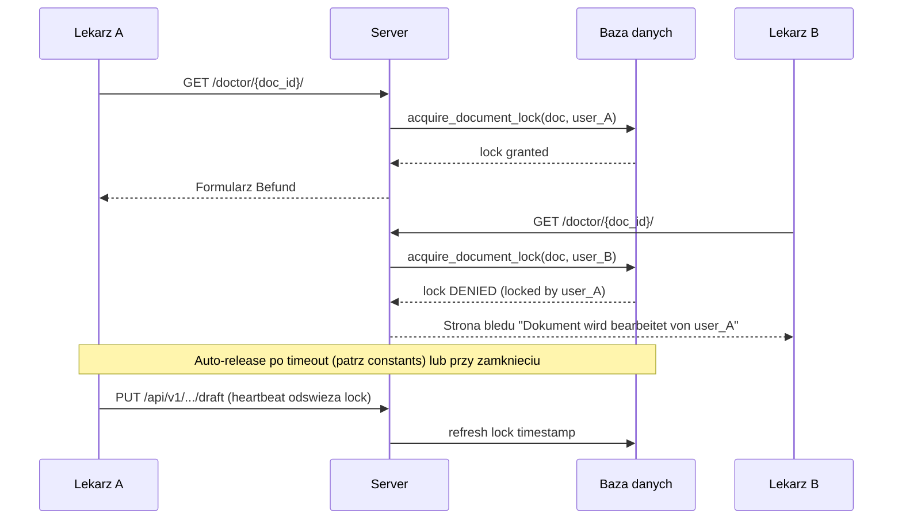

# Blokady dokumentow medycznych (Edit Lock)

## Problem

Dwoch lekarzy moze jednoczesnie otworzyc ten sam dokument Befund i nadpisywac sobie nawzajem szkice. Brak wizualnej informacji w work queue o tym, kto aktualnie edytuje dokument.

## Architektura rozwiazania



## Model danych

Nowe pola na `MedicalDocument` w [apps/medical/models.py](apps/medical/models.py) (bez nowej tabeli -- prostsze, mniej JOIN-ow):

```python
locked_by_user = models.ForeignKey(
    "users.StaffUser", null=True, blank=True, on_delete=models.SET_NULL,
    related_name="locked_medical_documents",
)
locked_at = models.DateTimeField(null=True, blank=True)
```

Lock wygasa automatycznie po czasie określonym przez **`DOCUMENT_LOCK_TIMEOUT_HOURS`** w [`apps/medical/constants.py`](../../apps/medical/constants.py) (obecnie **6 godzin**). Nie wymaga migracji danych — nowe pola nullable.

## Logika blokad

Nowe funkcje w [apps/medical/services.py](apps/medical/services.py):

- **`acquire_document_lock(doc_id, user_id)`** -- `select_for_update()`, sprawdza czy lock jest wolny lub wygasly lub nalezacy do tego samego usera. Zwraca `True/False`.
- **`release_document_lock(doc_id, user_id)`** -- zwalnia lock (tylko wlasciciel lub admin).
- **`refresh_document_lock(doc_id, user_id)`** -- odswierza `locked_at` (wywolywane przy kazdym save draft).
- **`is_document_locked(doc_id, user_id=None)`** -- zwraca `(locked: bool, locked_by_username: str | None, locked_at: datetime | None)`.

Timeout locka: stała **`DOCUMENT_LOCK_TIMEOUT_HOURS`** w [`apps/medical/constants.py`](../../apps/medical/constants.py) (używana przez funkcje locków w `apps/medical/services.py`).

## Integracja z istniejacym kodem

### 1. Detail view -- blokada przy otwarciu

W [cogitomedica/doctor_views.py](cogitomedica/doctor_views.py) `doctor_document_detail_view`:
- Przed renderowaniem: `acquire_document_lock(doc.id, request.user.id)`.
- Jesli lock sie nie powiodl: renderuj `doctor/error.html` z komunikatem "Dokument wird gerade von {username} bearbeitet" (+ link powrot do listy).

### 2. Draft save -- odswiezanie locka

W [apps/medical/api_views.py](apps/medical/api_views.py) `medical_document_draft_view`:
- Po udanym `save_draft_document_version`: `refresh_document_lock(doc.id, request.user.id)`.
- Jesli lock nalezacy do innego usera: zwroc **423 Locked** z info kto blokuje.

### 3. Publish -- zwolnienie locka

W `medical_document_publish_view`: po udanej publikacji `release_document_lock(doc.id, request.user.id)`.

### 4. Nawigacja wstecz / zamkniecie -- JavaScript heartbeat + cleanup

W [templates/doctor/detail.html](templates/doctor/detail.html):
- **`beforeunload`** event: `navigator.sendBeacon("/api/v1/medical-documents/{id}/unlock")` -- fire-and-forget POST.
- Nowy endpoint **`POST /api/v1/medical-documents/{id}/unlock`** w `api_views.py` -> `release_document_lock`.

### 5. Automatyczne wygasanie

Lock starszy niz 24h jest ignorowany (`locked_at + 24h < now()`). Nie wymaga cron/scheduler -- sprawdzany w momencie proby zablokowania.

## Kolorowanie wierszy w Work Queue

W [templates/doctor/list.html](templates/doctor/list.html) zmiana klasy `<tr>`:

| Stan | Kolor tla | Klasa CSS |
|------|-----------|-----------|
| **Zablokowany** (edytowany przez innego lekarza) | jasny zolty / amber | `bg-amber-50 dark:bg-amber-950/20` |
| **Opublikowany** (PUBLISHED) | jasny zielony / teal | `bg-emerald-50 dark:bg-emerald-950/20` |
| **Draft** (niezablokowany) | bialy (domyslny) | brak dodatkowej klasy |
| **Brak dokumentu** (jeszcze nie otworzony) | bialy (domyslny) | brak dodatkowej klasy |

Dane do szablonu: `list_doctor_work_queue` w [apps/medical/services.py](apps/medical/services.py) juz buduje dict per wiersz -- doda `locked_by_username` i `is_locked_by_other` (boolean wzgledem request.user).

Dodatkowo w wierszu zablokowanym:
- ikona klodki + tekst "Bearbeitet von {username}" obok nazwy pacjenta
- przycisk "Offnen" zamieniony na disabled / greyed out z tooltipem

## Tlumaczenia

Nowe klucze w [apps/core/translation_data/doctor_ui.json](apps/core/translation_data/doctor_ui.json):
- `doctor.document_locked_by` -- "Wird bearbeitet von {username}" / "Being edited by {username}" / "Edytowany przez {username}"
- `doctor.document_locked_error` -- "Dieses Dokument wird gerade von {username} bearbeitet. Bitte versuchen Sie es spaeter." / ...
- `doctor.unlock` -- "Freigeben" / "Unlock" / "Odblokuj"

## Migracja

Jedna migracja `apps/medical/migrations/XXXX_add_document_lock_fields.py`:
- `AddField locked_by_user` (FK, nullable)
- `AddField locked_at` (DateTimeField, nullable)

Jedna migracja seedujaca tlumaczenia `apps/core/migrations/XXXX_seed_document_lock_translations.py`.

## Aktualizacja dokumentacji projektowej

Po implementacji zaktualizowac wszystkie dokumenty, ktore opisuja endpointy, flow lekarza lub architekture:

- **[.ai/api-plan.md](.ai/api-plan.md)** + **[.ai/api-plan-pl.md](.ai/api-plan-pl.md)** -- dopisac nowy endpoint `POST /api/v1/medical-documents/{id}/unlock`, opisac semantyke 423 Locked na draft PUT, opisac pole `locked_by`/`locked_at` w odpowiedziach.
- **[.ai/staff-api-contract.md](.ai/staff-api-contract.md)** -- zaktualizowac kontrakt API o nowy endpoint unlock i zachowanie blokady.
- **[.ai/db-plan.md](.ai/db-plan.md)** -- dopisac pola `locked_by_user_id`, `locked_at` do tabeli `medical_document`.
- **[.ai/prd.md](.ai/prd.md)** / **[.ai/min-prd.md](.ai/min-prd.md)** -- dopisac wymaganie blokady dokumentu (sekcja flow lekarza).
- **[cogitomedica/openapi_extension.py](cogitomedica/openapi_extension.py)** -- dodac schemat i opis endpointu `unlock` do rozszerzenia OpenAPI/Swagger.
- **[cogitomedica/openapi_schemas.py](cogitomedica/openapi_schemas.py)** -- ewentualne nowe schematy request/response dla unlock.
- **[docs/manual/03-doktor.md](docs/manual/03-doktor.md)** -- zaktualizowac instrukcje panelu lekarza: opis blokady, kolorowania wierszy, ikony klodki.
- **[docs/SECURITY_AUDIT.md](docs/SECURITY_AUDIT.md)** -- dopisac informacje o mechanizmie blokady jako ochronie integralnosci danych.

## Co NIE wchodzi w zakres

- **Pesymistyczny lock na poziomie wiersza w DB** (juz jest `select_for_update` przy save) -- to zostaje.
- **Websocket / real-time push** -- zbyt zlozony; timeout + heartbeat wystarczy.
- **Lock na poziomie pola** (collaborative editing) -- nie potrzebny; jeden lekarz na dokument.
