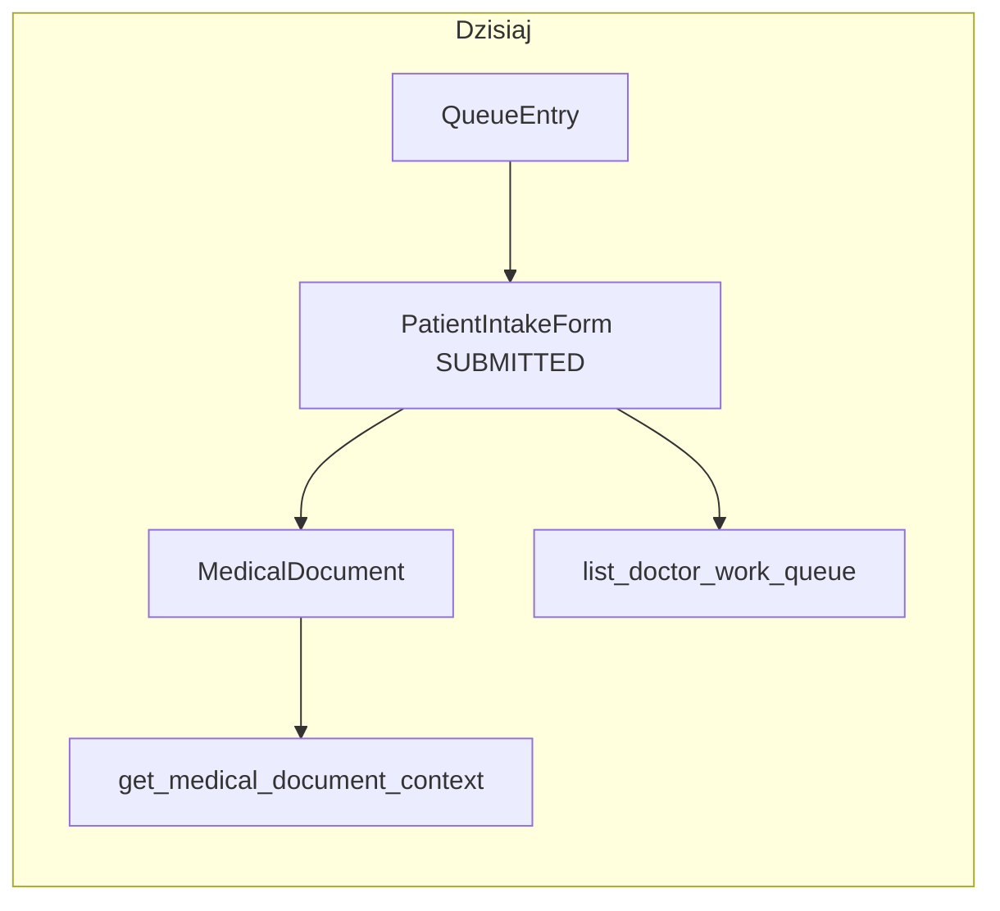

# Dokument medyczny bez cyfrowej ankiety (papier)

## Diagnoza (stan obecny)

- Model `[apps/medical/models.py](apps/medical/models.py)`: `MedicalDocument.intake_form` to `**OneToOneField` bez `null=True**` — każdy dokument musi mieć ankietę w bazie.
- Tworzenie: `[create_or_get_medical_document](apps/medical/services.py)` wymaga `intake_form_id`, waliduje zgodność z `queue_entry` i `**IntakeStatus.SUBMITTED**`; API POST używa `[CreateMedicalDocumentRequest](apps/medical/api_schemas.py)` z obowiązkowym `intake_form_id` (`[medical_documents_view](apps/medical/api_views.py)`).
- Stan faktyczny API: `POST /api/v1/medical-documents` w `[medical_documents_view](apps/medical/api_views.py)` dopuszcza dziś wyłącznie role `**DOCTOR**`, `**ADMIN**`, `**MANAGER**` (`require_user_role(... allowed_roles={"DOCTOR", "ADMIN", "MANAGER"})`) — **nie dodawać `RECEPTION`** do tej ścieżki.
- Panel lekarza — wejście z kolejki: `[doctor_open_by_queue_view](cogitomedica/doctor_views.py)` wymaga istniejącej ankiety w statusie **SUBMITTED** (oraz blokuje REOPENED).
- Kontekst Befund: `[get_medical_document_context](apps/medical/services.py)` zawsze woła `get_intake_form_context(intake_form_id=doc.intake_form_id)` i buduje `intake_summary` z wyniku — przy braku ankiety ta ścieżka się wywali.
- Lista HTML „Work Queue”: `[list_doctor_work_queue](apps/medical/services.py)` startuje od querysetu `**PatientIntakeForm`** (SUBMITTED/REOPENED) — wpisów **bez ankiety w ogóle** lub z dokumentem „tylko HiDrive” **nie widać**.
- PDF / HiDrive / outbox: generacja Befund (`[pdf_builder._build_render_context](apps/medical/pdf_builder.py)`) opiera się na `**queue_entry.patient` + `medical_payload`** — **nie wymaga** ankiety. Ścieżka HiDrive dla Befund używa pacjenta z kolejki (`[build_befund_hidrive_path](apps/outbox/hidrive_paths.py)`). SMS w `[apps/outbox/services.py](apps/outbox/services.py)` już ma bezpieczny wzorzec: `intake_form` opcjonalny dla locale (`form_locale` z sesji lub domyślnie z tłumaczeń).
- Stan faktyczny zależności od `intake_form`: ryzyko nie jest równomierne w całym systemie. Jest **wysokie w rdzeniu `apps/medical`**, bo tam `MedicalDocument.intake_form` jest dziś invariantem modelu i kontraktu API. Jest **średnie w PDF/outbox**, bo te ścieżki w dużej części korzystają z `queue_entry.patient`, `MedicalDocumentVersion` i `medical_payload`, a `intake_form` traktują częściowo defensywnie. Nie oznacza to „audytu wszystkiego” w tym samym zakresie, tylko obowiązkowe przejście miejsc tworzenia, serializacji, listowania i prezentacji dokumentu.
- Najbardziej kruche miejsca:
  - `MedicalDocument.intake_form` w `[apps/medical/models.py](apps/medical/models.py)` jest dziś wymaganym `OneToOneField`; `null=True` zmienia podstawowy invariant modelu.
  - `[get_medical_document_context](apps/medical/services.py)` bezwarunkowo woła `get_intake_form_context(intake_form_id=doc.intake_form_id)`; przy `None` wymaga osobnej gałęzi.
  - `[list_doctor_work_queue](apps/medical/services.py)` startuje z `PatientIntakeForm`, więc dokument papierowy bez intake nie pojawi się na liście bez przebudowy na `QueueEntry`.
  - `[CreateMedicalDocumentRequest](apps/medical/api_schemas.py)` wymaga `intake_form_id`; istniejący kontrakt API nie powinien być rozwadniany opcjonalnym polem dla papieru.
  - Test fixtures w `[apps/medical/tests/](apps/medical/tests/)` masowo zakładają `MedicalDocument(..., intake_form=...)`; dodać osobne fixture/testy dla `intake_form=None`, nie tylko poprawić kod produkcyjny.
- Miejsca mniej groźne, ale do regresji:
  - `[apps/outbox/services.py](apps/outbox/services.py)` w dużej części pobiera pacjenta z `queue_entry.patient`, a `intake_form` służy głównie do `form_locale` i jest sprawdzane warunkowo.
  - Befund PDF (`[apps/medical/pdf_builder.py](apps/medical/pdf_builder.py)`) wygląda na zależny przede wszystkim od `MedicalDocumentVersion`, `queue_entry.patient` i `medical_payload`, nie od ankiety jako źródła danych.
  - Adminowe `select_related("intake_form")` samo w sobie nie pęknie przy nullable, ale `list_display` / filtry powinny jasno pokazywać `source_type` oraz etykietę „brak ankiety cyfrowej”.




```mermaid
flowchart LR
  subgraph after [Po zmianie (docelowo)]
    Q[QueueEntry status=WAITING]
    I[PatientIntakeForm SUBMITTED/REOPENED]
    A[PaperIntakeAuthorization authorized_by=ADMIN/MANAGER]
    Qpc[QueueEntry status=PATIENT_COMPLETED]
    Qpic[QueueEntry status=PAPER_INTAKE_COMPLETED]
    M1[MedicalDocument source_type=DIGITAL_INTAKE intake_form_id!=NULL]
    M2[MedicalDocument source_type=PAPER_INTAKE intake_form_id=NULL]
    C[get_medical_document_context]
    L[list_doctor_work_queue source=QueueEntry]

    Q -->|tablet: submit_patient_intake_form| I
    I -->|atomowo| Qpc
    Qpc --> M1

    Q -->|T1: ADMIN/MANAGER authorize_paper_intake<br/>NIE zmienia entry_status| A
    A -.->|widoczny stan B na liście lekarza| L
    A -->|T2: DOCTOR/ADMIN/MANAGER<br/>create_medical_document_without_intake<br/>atomowo: M2 + status flip| Qpic
    Qpic --> M2

    A -.->|auto-revoke jeśli pacjent submit cyfrowy| I
    A -.->|auto-revoke jeśli QueueEntry CANCELLED| Q

    Qpc -->|stan A| L
    Qpic -->|stan C| L

    M1 --> C
    M2 --> C
  end
```


- Diagram „po zmianie” ujawnia trzy krytyczne semantyki:
  - Ścieżka papierowa jest **dwuetapowa** (T1 autoryzacja + T2 utworzenie dokumentu), nie jednoatomowa. Atomowość pozostaje w T2 (utworzenie dokumentu + flip statusu w jednej transakcji); T1 jest osobnym aktem decyzyjnym, zostawiającym `entry_status` w `WAITING`.
  - `QueueEntry` ma dwa statusy „gotowe do pracy lekarza” (`PATIENT_COMPLETED` i `PAPER_INTAKE_COMPLETED`), ale publikacja nadal należy do `MedicalDocument.status`, nie do `QueueEntry.entry_status`.
  - **Stan B (papier autoryzowany, dokument jeszcze nie utworzony) jest widoczny na liście lekarza** mimo że `entry_status` to nadal `WAITING` — eligibility listy dla papieru opiera się o istnienie `PaperIntakeAuthorization`, nie o status kolejki. To jest kluczowa różnica względem cyfrowej ścieżki, gdzie eligibility wynika z `intake_form.form_status`.
- Na diagramie celowo rozdzielono dwa warianty dokumentu (`DIGITAL_INTAKE` vs `PAPER_INTAKE`) z jawnie różnym stanem `intake_form_id`. To ma zapobiegać „cichym” regresjom, w których `source_type` i nullable FK rozjadą się semantycznie.
- Auto-revoke (linie przerywane) zamykają okno wyścigu między T1 a T2: jeśli pacjent jednak wypełni cyfrowo na tablecie albo wpis kolejki zostanie odwołany, autoryzacja papierowa traci ważność w tej samej transakcji, co wywołujące zdarzenie.

## Kierunek rozwiązania (rekomendowany)

**Uczynić `MedicalDocument.intake_form` opcjonalnym (`null=True`, `blank=True`)** i wprowadzić **jawny typ źródła dokumentu** (`source_type`) zamiast samej flagi w metadanych audytu. Opcja bez cyfrowej ankiety jest wyłącznie trybem awaryjnym, więc dla tej ścieżki stosować tylko `source_type=PAPER_INTAKE`; rezygnujemy z `ADMIN_CREATED`. Istniejące dokumenty z ankiety backfillować jako cyfrowe źródło (np. `DIGITAL_INTAKE`). Nie fałszować `PatientIntakeForm` jako „SUBMITTED z pustymi danymi” — to psuje raporty zgód/anamnezy i miesza dane kliniczne.

## Zakres zmian technicznych

### 1. Migracja schematu

- Plik migracji w `apps/medical/`: `intake_form` → `null=True`, `blank=True` (OneToOne po stronie `MedicalDocument` nadal OK: wiele dokumentów może mieć `NULL`; każda realna ankieta max jeden dokument).
- Dodać pole `MedicalDocument.source_type` jako jawny typ źródła dokumentu:
  - istniejące dokumenty z `intake_form_id IS NOT NULL` → backfill np. `DIGITAL_INTAKE`;
  - dokumenty bez cyfrowej ankiety → zawsze `PAPER_INTAKE`;
  - pole musi być dostępne w adminie, serializerach/listach i audycie, nie tylko w `AuditEvent.metadata`;
  - admin powinien pokazywać czytelny stan „brak ankiety cyfrowej” dla `PAPER_INTAKE`, zamiast wymuszać klikanie w puste `intake_form`.
- Dodać constraint spójności źródła z relacją do ankiety, żeby nowy invariant był wymuszony w bazie:
  - `source_type == DIGITAL_INTAKE` ⇒ `intake_form_id IS NOT NULL`;
  - `source_type == PAPER_INTAKE` ⇒ `intake_form_id IS NULL`;
  - test migracji/modelu ma próbować zapisać oba niespójne warianty i oczekiwać błędu integralności.
- Dodać nową wartość `QueueEntryStatus.PAPER_INTAKE_COMPLETED` (np. label „Paper intake completed”) w `[apps/reception/models.py](apps/reception/models.py)`, z tłumaczeniami i wpływem na widoki/listy kolejki. Ten status ma oznaczać, że etap ankiety został obsłużony papierowo, a nie że pacjent zakończył cyfrowy formularz.
- Najważniejsza zasada semantyczna:
  - `PATIENT_COMPLETED` = pacjent zakończył cyfrowy intake;
  - `PAPER_INTAKE_COMPLETED` = systemowo dopuszczono pracę lekarza na podstawie papieru.
  Lista lekarza może traktować oba warianty jako „gotowe do pracy lekarza”, ale raporty cyfrowego intake, konwersji tabletowej, podpisanych formularzy i kompletności cyfrowych zgód/anamnezy **nie mogą ich sumować**.
- Usunąć `QueueEntryStatus.PUBLISHED` z modelu kolejki — szczegóły wykonawcze w **§1.A**. Krótko: status jest produkcyjnie martwy (żaden serwis go nie ustawia), więc to cleanup martwego enuma, a nie migracja funkcjonalna. Po cleanupie ostatni stan wpisu kolejki po etapie ankiety to:
  - `PATIENT_COMPLETED` dla cyfrowej ankiety;
  - `PAPER_INTAKE_COMPLETED` dla awaryjnej ankiety papierowej;
  - `CANCELLED` dla odwołania.
  Publikacja Befund pozostaje stanem `MedicalDocument.status == PUBLISHED` / `MedicalDocumentVersion.version_status == PUBLISHED`, nie stanem pozycji kolejki.
- `[apps/core/translation_data/administration_choices.json](apps/core/translation_data/administration_choices.json)`: dodać label dla `administration.choice_queue_entry_status_paper_intake_completed`; klucz `administration.choice_queue_entry_status_published` znika razem z enum-em (patrz §1.A).
- `[apps/reception/models.py](apps/reception/models.py)`: ocenić indeks częściowy `qentry_active_pos_idx`, który dziś obejmuje tylko `WAITING` i `IN_PROGRESS`. `PAPER_INTAKE_COMPLETED` nie powinien wejść do indeksu „aktywnych pozycji”, jeśli indeks ma reprezentować kolejkę pacjentów oczekujących/w trakcie obsługi recepcji/tabletu.
- `[apps/reception/services.py](apps/reception/services.py)`: `update_queue_entry()` waliduje po `QueueEntryStatus.choices`, więc po dodaniu enumu API technicznie zaakceptuje `PAPER_INTAKE_COMPLETED`, a po usunięciu enumu odrzuci `PUBLISHED`. To jest akceptowalne, ale nadal oznacza brak twardej maszyny stanów — wrażliwe przejście `WAITING -> PAPER_INTAKE_COMPLETED` powinno iść przez serwis medyczny, nie przez ogólny PATCH kolejki.
- `[apps/reception/anonymization.py](apps/reception/anonymization.py)`: terminalne pozostają tylko `CANCELLED` oraz ewentualnie brak aktywnego wpisu; `PAPER_INTAKE_COMPLETED` ma blokować anonimizację tak jak `PATIENT_COMPLETED`, dopóki dokument medyczny nie przejdzie pełnego cyklu retencji/anonymizacji. Nie dodawać `PAPER_INTAKE_COMPLETED` do terminalnych statusów tylko dlatego, że pacjent zakończył etap ankiety.
- Sprawdzić unikalność / constraint-y w `Meta` modelu (jeśli jakiekolwiek zakładają non-null intake — poprawić).

### 1.A Cleanup martwego `QueueEntryStatus.PUBLISHED` (osobny, samodzielny zakres)

Ta sekcja jest celowo wyodrębniona, bo to **cleanup martwego enuma**, a nie zmiana semantyki kolejki. Mieszanie tej zmiany z resztą planu (jak w pierwotnej wersji §1) ukrywało dwa istotne fakty: (a) produkcja tego statusu nie używa, więc nie ma czego „migrować”; (b) `_TERMINAL_QUEUE_STATUSES` w anonymizacji wymaga jawnej decyzji projektowej — milczenie nad tym to luka retencji RODO.

**Inwentaryzacja (stan kodu, do zerowego usunięcia poza migracjami historycznymi):**

- Definicja: `[apps/reception/models.py](apps/reception/models.py)` — wartość `PUBLISHED = "PUBLISHED", db_gettext_lazy("administration.choice_queue_entry_status_published", "Published")` w `QueueEntryStatus`.
- Anonymizacja: `[apps/reception/anonymization.py](apps/reception/anonymization.py)` — `_TERMINAL_QUEUE_STATUSES = frozenset({QueueEntryStatus.PUBLISHED, QueueEntryStatus.CANCELLED})` używane w `anonymize_patient` jako `exclude(entry_status__in=_TERMINAL_QUEUE_STATUSES)`.
- Tłumaczenia: `[apps/core/translation_data/administration_choices.json](apps/core/translation_data/administration_choices.json)` — klucz `administration.choice_queue_entry_status_published` z wartościami DE/EN/PL.
- Testy używające PUBLISHED jako trick na obejście guardu active-visit lub jako dowolnej „terminalnej” wartości:
  - `[apps/reception/tests/test_anonymization.py](apps/reception/tests/test_anonymization.py)` (linia ~328 — `entry_status=QueueEntryStatus.PUBLISHED` w `setUp`).
  - `[apps/medical/tests/test_services_coverage.py](apps/medical/tests/test_services_coverage.py)` (linie ~94, 148, 174, 211).
  - `[apps/patient_results/tests/test_document_services.py](apps/patient_results/tests/test_document_services.py)` (linia ~68).
- Dokumentacja: `[.ai/db-plan.md](.ai/db-plan.md)` (`queue_entry_status_enum: ... PUBLISHED ...`) oraz `[.ai/prd.md](.ai/prd.md)` (diagram przejść `WAITING -> ... -> PUBLISHED`).
- **Czego NIE ruszać:** historyczne migracje `[apps/reception/migrations/0001_initial.py](apps/reception/migrations/0001_initial.py)` i `[apps/reception/migrations/0035_alter_patientformsession_options_and_more.py](apps/reception/migrations/0035_alter_patientformsession_options_and_more.py)` zachowują `PUBLISHED` w `choices` na trwałe — modyfikacja zaaplikowanych migracji jest niedopuszczalna. Cleanup robi się przez **nową migrację `AlterField`**, nie edycję starych.

**Plan wykonania (deterministyczna kolejność):**

1. **Decyzja projektowa o `_TERMINAL_QUEUE_STATUSES` — wybrana: Wariant A (rekomendowany).**
  - Dziś `_TERMINAL_QUEUE_STATUSES = {PUBLISHED, CANCELLED}` jest funkcjonalnie równe `{CANCELLED}`, bo `PUBLISHED` w produkcji nie jest osiągalny żadnym serwisem.
  - Po cleanupie: `_TERMINAL_QUEUE_STATUSES = frozenset({QueueEntryStatus.CANCELLED})`. To czyni dotychczasową rzeczywistość explicite.
  - **Nie dodawać** `PATIENT_COMPLETED` ani `PAPER_INTAKE_COMPLETED` do zbioru terminalnego — te statusy oznaczają „ankieta zakończona, dokument medyczny ma być (lub jest) procesowany”, a nie „pacjent jest gotowy do anonimizacji”.
  - Wariant B (dodanie `PATIENT_COMPLETED` / `PAPER_INTAKE_COMPLETED` do terminala) jest **odrzucony** w tym planie: rozszerzałby zakres anonymizacji bez analizy retencji dokumentu medycznego, a to wykracza poza scope tej zmiany.
2. **Nowa migracja `apps/reception/migrations/0XXX_drop_queue_entry_status_published.py`:**
  - `migrations.AlterField` na `QueueEntry.entry_status` z nowym zestawem `choices` (bez `PUBLISHED`, z `PAPER_INTAKE_COMPLETED` z §1).
  - Defensywna data migration (`RunPython`) jako siatka bezpieczeństwa dla środowisk dev/test/staging:

```python
     QueueEntry.objects.filter(entry_status="PUBLISHED").update(entry_status="PATIENT_COMPLETED")
     

```

```
 plus `create_audit_event(event_type="QUEUE_STATUS_BACKFILL_PUBLISHED_TO_PATIENT_COMPLETED", metadata={"affected_count": <n>})` **tylko jeśli `n > 0`**. Brak audytu przy `n == 0`, żeby nie zaśmiecać logów na produkcji.
```

- `reverse_code` ustawić jako `noop` z komentarzem „nie odtwarzamy martwego statusu w downgrade” (wracamy do enuma bez PUBLISHED nawet po cofnięciu — ten kierunek jest świadomy).

1. **Kod produkcyjny:**
  - `[apps/reception/models.py](apps/reception/models.py)`: usunąć wartość `PUBLISHED` z `QueueEntryStatus`.
  - `[apps/reception/anonymization.py](apps/reception/anonymization.py)`: `_TERMINAL_QUEUE_STATUSES = frozenset({QueueEntryStatus.CANCELLED})`. Komentarz nad stałą musi opisywać, że terminalność wynika tylko z anulowania wizyty; pacjenci po publikacji Befund **nie** są anonimizowani na podstawie statusu kolejki (patrz „Otwarty dług RODO” poniżej).
2. **Tłumaczenia:**
  - `[apps/core/translation_data/administration_choices.json](apps/core/translation_data/administration_choices.json)`: usunąć klucz `administration.choice_queue_entry_status_published` (DE/EN/PL).
  - Sprawdzić, czy klucz jest seedowany do bazy migracją w `apps/core/migrations/` (analogicznie do innych translation seedów). Jeśli tak — dodać migrację usuwającą wpis z `Translation` po aktualizacji JSON, żeby DB nie miała sieroty. Jeśli mechanizm seed-from-JSON sam usuwa nieobecne klucze przy następnym deployu — udokumentować to wprost w opisie migracji.
3. **Testy (przepisanie 6 wystąpień):**
  - `[apps/reception/tests/test_anonymization.py](apps/reception/tests/test_anonymization.py)`: `setUp` używał `entry_status=QueueEntryStatus.PUBLISHED` po to, żeby `anonymize_patient` w sąsiednich testach nie wybuchało na guardzie active-visit. Przepisać na `entry_status=QueueEntryStatus.CANCELLED` — semantycznie zgodne z nowym `_TERMINAL_QUEUE_STATUSES`. Jeśli któryś z testów testuje retencję dokumentu medycznego (a nie tylko mechanikę anonymizacji), wymaga osobnej analizy: być może test był do tej pory bezsensowny w produkcyjnym kontekście, bo guardował się przeciwko ścieżce, której produkcja nie używa.
  - `[apps/medical/tests/test_services_coverage.py](apps/medical/tests/test_services_coverage.py)` (4 wystąpienia): zamienić na `PATIENT_COMPLETED`. Jeśli test sprawdzał stan po publikacji Befund — to publikacja jest stanem `MedicalDocument.status`, nie `QueueEntry.entry_status`, więc test nie traci sensu, tylko poprawnie odróżnia warstwy.
  - `[apps/patient_results/tests/test_document_services.py](apps/patient_results/tests/test_document_services.py)`: jak wyżej, zamienić na `PATIENT_COMPLETED`.
4. **Dokumentacja:**
  - `[.ai/db-plan.md](.ai/db-plan.md)`: zaktualizować `queue_entry_status_enum` (usunąć `PUBLISHED`, dodać `PAPER_INTAKE_COMPLETED`).
  - `[.ai/prd.md](.ai/prd.md)`: poprawić ciąg przejść kolejki. Z dotychczasowego `WAITING -> IN_PROGRESS -> PATIENT_COMPLETED -> DOCTOR_IN_PROGRESS -> PUBLISHED + CANCELLED` na `WAITING -> IN_PROGRESS -> (PATIENT_COMPLETED | PAPER_INTAKE_COMPLETED) -> DOCTOR_IN_PROGRESS + CANCELLED`. **Nie traktować `DOCTOR_IN_PROGRESS` jako terminalnego.**
  - Pozostałe wystąpienia `PUBLISHED` w `[.ai/api-plan.md](.ai/api-plan.md)` / `[.ai/api-plan-pl.md](.ai/api-plan-pl.md)` dotyczą `MedicalDocument` / `MedicalDocumentVersion` — **nie ruszać**, to nie ten enum.
5. **Grep-guard w CI (zapobieganie regresji):**
  - Dodać do CI test/skrypt który egzekwuje, że `rg "QueueEntryStatus\.PUBLISHED"` poza `apps/reception/migrations/0001_initial.py`, `apps/reception/migrations/0035_*.py` i nową migracją wycofującą zwraca pusty wynik. Realizacja: prosty pytest-test w `apps/reception/tests/test_dead_status_guard.py` używający `subprocess.run(["rg", ...])` lub `Path.rglob` + regex.
  - Alternatywnie: wpis w `.pre-commit-config.yaml` blokujący commit z `QueueEntryStatus.PUBLISHED`. To słabsza obrona (lokalna), ale tańsza.
6. **Demo/Seed:** `[scripts/manual_demo/seed.py](scripts/manual_demo/seed.py)` używa tylko `WAITING` / `IN_PROGRESS` / `PATIENT_COMPLETED` — bez zmian. Potwierdzić grep-em przed mergem.

**Otwarty dług RODO — explicite poza scope tego planu (nie ukrywać):**

- Po cleanupie `_TERMINAL_QUEUE_STATUSES = {CANCELLED}` opisuje rzeczywisty stan systemu: anonymizacja na podstawie statusu kolejki działa **wyłącznie** dla wizyt anulowanych. Pacjenci, dla których Befund został opublikowany i przeszedł retencję, **nie są** anonimizowani przez `anonymize_patient` po `entry_status` — albo są obsługiwani przez inny mechanizm retencyjny (np. job po `MedicalDocument.last_published_at + N` w innym serwisie), albo nie są w ogóle.
- **Plan wycofania `PUBLISHED` nie zmienia tej rzeczywistości — tylko ją ujawnia.** Wcześniej `_TERMINAL_QUEUE_STATUSES` zawierał martwą wartość, która sugerowała, że istnieje ścieżka anonymizacji po publikacji. Po cleanupie ten miraż znika.
- **Wymagana osobna analiza (NIE w tym PR-ze):** czy/gdzie/jak system anonymizuje pacjentów po retencji dokumentu medycznego (Art. 17 GDPR + medyczne okresy retencji DE: §630f BGB / §10 MBO-Ä — typowo 10 lat, ale anonymizacja danych identyfikacyjnych poza dokumentem klinicznym to inna oś). Przewidzieć osobny plan/ticket: „Audyt retencji pacjentów po publikacji Befund — `MedicalDocument` jako źródło prawdy zamiast `QueueEntry.entry_status`”.
- **Dlaczego nie dołączać tego do tego planu:** zmiana semantyki anonymizacji = przegląd zgodności prawnej + pełny audyt ścieżek danych pacjenta + decyzja DPO. To jest projekt na tygodnie, nie na bullet w planie funkcji „dokument bez ankiety”. Wpychanie go tutaj złamie zasadę „małych PR-ów” i ukryje zmianę compliance pod zmianą funkcjonalną.

**Definition of Done dla §1.A:**

- `rg "QueueEntryStatus\.PUBLISHED"` poza trzema dozwolonymi migracjami zwraca 0 trafień.
- `rg "choice_queue_entry_status_published"` zwraca 0 trafień.
- `_TERMINAL_QUEUE_STATUSES == frozenset({QueueEntryStatus.CANCELLED})` — z testem jednostkowym.
- Wszystkie testy zielone po przepisaniu 6 wystąpień PUBLISHED na `CANCELLED` lub `PATIENT_COMPLETED` zgodnie z intencją testu.
- Migracja stosuje się forward; reverse jest `noop` z komentarzem.
- `.ai/db-plan.md` i `.ai/prd.md` zaktualizowane.
- Komentarz nad `_TERMINAL_QUEUE_STATUSES` jawnie odsyła do otwartego długu retencji.

### 1.B Nowy model `PaperIntakeAuthorization`

Sekcja jest osią całej zmiany w stosunku do pierwotnego planu. Jej celem jest **rozdzielenie aktu decyzji o papierowej ścieżce (autoryzacja) od aktu wykonania dokumentu (utworzenie `MedicalDocument`)**, bez wprowadzania okna niespójności w `entry_status`. Decyzja architektoniczna: `entry_status == PAPER_INTAKE_COMPLETED ⇔ MedicalDocument(source_type=PAPER_INTAKE) istnieje` musi pozostać twardym invariantem; autoryzacja jest osobnym wymiarem (osobny model), nie kolejnym stanem `QueueEntry`.

**Model w `[apps/medical/models.py](apps/medical/models.py)`:**

```python
class PaperIntakeAuthorization(models.Model):
    id = models.UUIDField(primary_key=True, default=uuid.uuid4, editable=False)
    queue_entry = models.OneToOneField(
        "reception.QueueEntry",
        on_delete=models.CASCADE,
        related_name="paper_intake_authorization",
    )
    authorized_at = models.DateTimeField()
    authorized_by = models.ForeignKey(
        "users.StaffUser",
        on_delete=models.PROTECT,
        related_name="paper_intake_authorizations_granted",
    )
    reason = models.TextField()
    created_at = models.DateTimeField(auto_now_add=True)

    class Meta:
        db_table = "paper_intake_authorization"
        indexes = [
            models.Index(fields=["authorized_at"], name="paper_auth_authorized_at_idx"),
            models.Index(fields=["authorized_by"], name="paper_auth_authorized_by_idx"),
        ]
```

**Decyzje projektowe (każda jest świadoma i ma alternatywę):**

- **OneToOne, nie FK z `unique` constraintem.** OneToOne wymusza invariant na poziomie modelu Django, nie tylko SQL. Daje czyste API: `entry.paper_intake_authorization` (None ⇔ brak autoryzacji). Alternatywa (`ForeignKey + unique`) byłaby identyczna w SQL, ale słabsza w typowaniu Django ORM.
- `**on_delete=CASCADE` z `QueueEntry`.** Kasowanie `QueueEntry` (rzadkie, głównie testy/migracje historyczne) sprząta autoryzację. W produkcji `QueueEntry` nie jest kasowane — tylko anonimizowane przez nadpisywanie pól, co nie tyka autoryzacji.
- `**on_delete=PROTECT` na `authorized_by`.** Chroni audyt — nie wolno usunąć użytkownika, który autoryzował papier, bez świadomej decyzji o reataczeniu lub wcześniejszym usunięciu autoryzacji. To jest zgodne z polityką PROTECT na innych polach actor w audycie.
- **Brak pól `revoked_at`/`revoked_by` w modelu.** Revoke = `delete()` wiersza + zdarzenie `AuditEvent.PAPER_INTAKE_AUTHORIZATION_REVOKED`. Audyt jest **jedynym** źródłem historii revoke. Soft-delete w tabeli wymagałby semantyki „active vs revoked” w każdym query listy lekarza, co komplikuje §5 i nie daje wartości dla MVP. Re-autoryzacja po revoke = nowy wiersz (poprzedzony delete poprzedniego).
- **Brak `migration data backfill`.** Jest to nowa encja; pierwsze rekordy powstają od momentu deployu. Założenie produkcyjne: **nie istnieją dokumenty `PAPER_INTAKE` bez autoryzacji**. Wymóg autoryzacji obowiązuje więc dla wszystkich papierowych dokumentów tworzonych po wdrożeniu tej zmiany, bez ścieżki „legacy”.
- `**reason: TextField` bez `blank=False` na poziomie modelu, ale wymóg w serwisie.** Walidacja długości (10–500 znaków) i niepustości w `authorize_paper_intake` (§2.1), nie w modelu. Powód: model dopuszcza pustość dla testowych fixture'ów, serwis dopilnowuje produkcyjnego inwariantu. Alternatywa (`TextField(blank=False)` + `MinLengthValidator`) byłaby OK; decyzja na rzecz prostszego modelu z silnym serwisem.
- **Brak constraintu DB na min/max długość `reason`.** Postgres nie ma natywnego CHECK na długość textu w idiomatyczny sposób, a egzekwowanie w serwisie + walidatorach formularza jest wystarczające.

**Migracja:**

- Plik `apps/medical/migrations/0XXX_paper_intake_authorization.py`.
- `migrations.CreateModel` z polami i indeksami jak wyżej.
- Brak `RunPython` (nie ma czego backfillować).
- `reverse_code` standardowy `migrations.DeleteModel` (Django default) — utrata danych autoryzacji przy rollbacku jest akceptowalna, bo i tak po rollbacku wracamy do stanu sprzed flow.

**Admin Django:**

- `PaperIntakeAuthorizationAdmin` w `apps/medical/admin.py` jako **readonly**:
  - `list_display`: `queue_entry`, `_patient_repr` (z `queue_entry.patient`), `authorized_at`, `authorized_by`, `_short_reason` (pierwsze 80 znaków), `_has_document` (boolean: `queue_entry.medical_document` istnieje).
  - `list_filter`: `authorized_at` (DateRangeFilter), `authorized_by`.
  - `search_fields`: `queue_entry__patient__last_name`, `queue_entry__patient__first_name`, `reason`.
  - `readonly_fields`: wszystkie pola.
  - `has_add_permission = False`, `has_change_permission = False`. `has_delete_permission` — patrz niżej.
- **Akcja „Revoke” w adminie:** custom admin action `admin_revoke_authorization` wywołująca `revoke_paper_intake_authorization` przez serwis (nie zwykłe `queryset.delete()`). To jest wyjątek od reguły „status zmieniaj tylko przez serwis medyczny, nie przez admin” — bo (a) jest to revoke, nie zmiana statusu kolejki, (b) działa przez serwis, więc ma walidacje i audyt, (c) admin Django nie ma dedykowanego widoku managera (ten jest osobny — patrz §7.3). Alternatywa: zablokować całkowicie. Decyzja: dopuścić, ale tylko przez akcję, nie przez button delete na edytorze obiektu.
- `has_delete_permission` zwraca `False` dla single-object delete (zapobiega obejściu serwisu); akcja zbiorcza „Revoke selected” jest jedyną drogą.

**Tłumaczenia ([`apps/core/translation_data/`]):**

Klucze rozdzielamy na **dwa istniejące pliki** zgodnie z konwencją repozytorium (nie tworzymy nowego `medical_ui.json`):

**(a) Etykiety, akcje, badge'e UI** → `[apps/core/translation_data/administration.json](apps/core/translation_data/administration.json)` (prefix `administration.*`, zgodny z konwencją etykiet i akcji panelu admina/managera + analogiczny do `administration.choice_queue_entry_status_paper_intake_completed` z §1.A):

- `administration.label_paper_intake_authorization` → „Autoryzacja ścieżki papierowej” / „Paper intake authorization” / „Papier-Intake-Autorisierung”.
- `administration.label_paper_intake_authorized_at` → „Autoryzowano” / „Authorized at” / „Autorisiert am”.
- `administration.label_paper_intake_authorized_by` → „Autoryzował” / „Authorized by” / „Autorisiert von”.
- `administration.label_paper_intake_authorization_reason` → „Powód autoryzacji” / „Authorization reason” / „Autorisierungsgrund”.
- `administration.action_authorize_paper_intake` → „Autoryzuj ścieżkę papierową” / „Authorize paper intake” / „Papier-Intake autorisieren”.
- `administration.action_revoke_paper_intake_authorization` → „Cofnij autoryzację” / „Revoke authorization” / „Autorisierung widerrufen”.
- `administration.action_create_paper_document` → „Utwórz dokument papierowy” / „Create paper document” / „Papier-Dokument erstellen”.
- `administration.badge_paper_authorized_pending_document` → „Papier autoryzowany, czeka na dokument” / „Paper authorized, awaiting document” / „Papier autorisiert, wartet auf Dokument”.
- `administration.model_paperintakeauthorization` → „Autoryzacja ścieżki papierowej” (singular, dla `PaperIntakeAuthorizationAdmin.verbose_name`).
- `administration.model_paperintakeauthorization_plural` → „Autoryzacje ścieżek papierowych” (`verbose_name_plural`).

**(b) Klucze błędów domenowych** rzucanych przez `DomainError(...)` w serwisach (§2.1, §2.2, §2.3) → `[apps/core/translation_data/other_domain.json](apps/core/translation_data/other_domain.json)` (prefix `other.domain.*`, **rozszerzenie** istniejących już 3 kluczy z pierwotnego planu: `other.domain.queue_entry_must_be_waiting_for_paper_intake`, `other.domain.paper_intake_requires_appointment_time`, `other.domain.paper_intake_earliest_after_appointment` — ten plan dodaje nowe klucze obok nich, nie zastępuje):

- `other.domain.paper_intake_authorization_invalid_role` → „Brak uprawnień do autoryzacji ścieżki papierowej (wymagana rola Administrator lub Manager)”.
- `other.domain.paper_intake_authorization_invalid_status` → „Autoryzacja papierowa wymaga wpisu kolejki w statusie WAITING”.
- `other.domain.paper_intake_authorization_too_early` → „Autoryzacja możliwa dopiero 3 godziny po godzinie wizyty”.
- `other.domain.paper_intake_authorization_intake_form_submitted` → „Nie można autoryzować papieru: pacjent wypełnił cyfrową ankietę”.
- `other.domain.paper_intake_authorization_already_exists` → „Autoryzacja papierowa już istnieje dla tego wpisu kolejki”.
- `other.domain.paper_intake_authorization_not_found` → „Brak aktywnej autoryzacji papierowej dla tego wpisu kolejki”.
- `other.domain.paper_intake_revoke_after_document_created` → „Nie można cofnąć autoryzacji po utworzeniu dokumentu medycznego”.
- `other.domain.paper_intake_not_authorized` → „Nie można utworzyć dokumentu papierowego: wymagana wcześniejsza autoryzacja administratora lub managera”.
- `other.domain.paper_intake_intake_form_appeared_after_authorization` → „Cyfrowa ankieta pojawiła się po autoryzacji — wymagana decyzja administratora (cofnięcie autoryzacji albo użycie ścieżki cyfrowej)”.

**(c) Klucze walidacji request body** (warstwa API, walidacja długości `reason`) → `[apps/core/translation_data/other_api.json](apps/core/translation_data/other_api.json)` (prefix `other.api.*`, zgodny z istniejącą konwencją błędów API):

- `other.api.paper_intake_authorization_reason_required` → „Pole „powód” jest wymagane (10–500 znaków)”.
- `other.api.paper_intake_authorization_reason_too_long` → „Pole „powód” jest za długie (max 500 znaków)”.

**Migracja seed:** standardowa migracja `apps/core/migrations/0XXX_seed_paper_intake_authorization_translations.py` używająca istniejącego mechanizmu seed-from-JSON. Migracja dotyka 3 plików JSON (`administration.json`, `other_domain.json`, `other_api.json`); żaden nowy plik nie powstaje.

**Konsekwencja dla §2 i §3:** wszystkie odniesienia do kluczy `DomainError` w §2.1, §2.2, §2.3 oraz mapowania `DomainError → HTTP` w §3 używają prefiksu `**other.domain.*`** (nie `medical.domain.*`) i `**other.api.***` (nie `medical.api.*`). To odzwierciedla istniejącą konwencję `apps/medical/services.py` (np. `other.domain.queue_entry_must_be_waiting_for_paper_intake`).

### 1.C Constraint spójności (rozszerzenie pierwotnego)

Pierwotny constraint z §1: `source_type == PAPER_INTAKE ⇒ intake_form_id IS NULL` zostaje bez zmian.

**Świadomie NIE wprowadzamy** constraint-u DB między `MedicalDocument(source_type=PAPER_INTAKE)` a istnieniem `PaperIntakeAuthorization` dla tego samego `QueueEntry`. Powody:

- Constraint między 3 tabelami z OneToOne wymagałby trigger'a w Postgresie albo deferrable check, co wykracza poza idiomatyczny Django ORM.
- Jedyną produkcyjną drogą tworzenia `MedicalDocument(source_type=PAPER_INTAKE)` jest serwis `create_medical_document_without_intake` (§2.3), który egzekwuje wymóg autoryzacji w `select_for_update` na `QueueEntry`. To jest wystarczające do zachowania invariantu.
- Konsekwencja: ktoś, kto stworzy dokument przez ORM bezpośrednio (np. w teście, fixture, shellu admina), może obejść regułę. Akceptujemy to dla MVP. Test integracyjny w §9 weryfikuje, że w zwykłej ścieżce produkcyjnej (przez API/serwis) reguła jest egzekwowana.
- **Otwarty hardening (poza scope tego planu):** dodać post-save signal na `MedicalDocument`, który dla `source_type=PAPER_INTAKE` **bezwzględnie** waliduje istnienie `PaperIntakeAuthorization`. Brak autoryzacji traktować jako invariant violation (błąd krytyczny + alert). Sygnał jest tańszym kompromisem niż trigger DB i ma sens jako osobny ticket „hardening papierowego invariantu”.

**Test migracji/modelu:**

- Test próbuje utworzyć `PaperIntakeAuthorization` dla wpisu z istniejącym dokumentem cyfrowym — serwis odrzuca (§2.1), ale na poziomie modelu (bypass serwisu) test pokazuje, że da się to zrobić. To dokumentuje granicę szczelności i uzasadnia użycie tylko serwisowej ścieżki.
- Test próbuje utworzyć drugą `PaperIntakeAuthorization` dla tego samego `QueueEntry` — błąd `IntegrityError` z OneToOne. To jest twarda gwarancja DB.

### 2. Nowe funkcje serwisowe (obok istniejącej)

Pierwotny plan zawierał jedną funkcję `create_medical_document_without_intake`. W modelu „manager autoryzuje, lekarz dokumentuje” serwis **rozbija się na trzy** (plus dwa hooki invalidacyjne w cudzych serwisach), każda z osobnym lockiem, audytem i polityką roli.

#### 2.1 `authorize_paper_intake` (nowy)

W `[apps/medical/services.py](apps/medical/services.py)`:

`authorize_paper_intake(*, queue_entry_id: UUID, authorized_by_user_id: UUID, reason: str) -> PaperIntakeAuthorization`:

- **Polityka roli:** wyłącznie `ADMIN` lub `MANAGER` (`StaffUser.is_admin_role` / `is_manager`). **NIE** `DOCTOR`, **NIE** `RECEPTION`. Powód: autoryzacja jest aktem nadzoru („dwie pary oczu w czasie”), nie aktem klinicznym. DOCTOR będzie mógł utworzyć dokument w §2.3, ale nie autoryzuje sam (chyba że ma drugą rolę ADMIN/MANAGER — patrz „Self-authorization policy” w §8).
- **Walidacja `reason` na wejściu:** niepuste, znormalizowane (`.strip()`), długość 10–500 znaków. Krótszy / pusty → `DomainError(api_message_key="other.api.paper_intake_authorization_reason_required")`. Dłuższy → `DomainError(api_message_key="other.api.paper_intake_authorization_reason_too_long")`. Walidacja po stronie serwisu, nie tylko formularza. (Klucze w `other_api.json`, bo to jest walidacja kontraktu request body, nie reguła domenowa.)
- Całość w `transaction.atomic()`.
- Pobrać `QueueEntry` z lockiem:

```python
  entry = (
      QueueEntry.objects
      .select_for_update()
      .select_related("daily_queue", "intake_form", "medical_document", "paper_intake_authorization")
      .get(id=queue_entry_id)
  )
  

```

- Walidacje domenowe (każda z dedykowanym kluczem `DomainError`, do tłumaczenia w API i UI):
  1. Wpis kolejki istnieje (jeśli nie — `other.api.queue_entry_not_found` lub istniejący klucz w `other_api.json`/`other_domain.json` — sprawdzić w fazie implementacji).
  2. `entry.entry_status == QueueEntryStatus.WAITING`. **NIE** dopuszczamy `IN_PROGRESS` (pacjent jest na tablecie), `PATIENT_COMPLETED` (cyfrowa ankieta zakończona), `PAPER_INTAKE_COMPLETED` (papier już wykonany), `CANCELLED` (wizyta odwołana). Klucz: `other.domain.paper_intake_authorization_invalid_status`.
  3. **Zabezpieczenie czasowe:** `entry.appointment_time IS NOT NULL` ORAZ `timezone.now() >= entry.appointment_time + timedelta(hours=3)`. To **ten sam warunek** co dla utworzenia dokumentu w §2.3 — egzekwowany **dwukrotnie świadomie**, żeby autoryzacja w T1 i utworzenie dokumentu w T2 obie były zgodne z regułą czasową, nawet jeśli kiedyś warunek dla T2 zostałby zmiękczony. Klucz: `other.domain.paper_intake_authorization_too_early`. Brak `appointment_time` (puste pole) jest też blokadą — patrz §8 „Brak appointment_time blokuje papier”. (Można rozważyć osobny klucz `other.domain.paper_intake_requires_appointment_time` — już istnieje w `other_domain.json` z pierwotnego planu — i odróżnić „za wcześnie” od „brak czasu wizyty”. Decyzja w fazie implementacji.)
  4. `entry.medical_document` nie istnieje (jeśli istnieje — klucz reused z istniejących, np. `other.domain.medical_document_already_exists` jeśli istnieje, w przeciwnym razie nowy klucz dla tego scenariusza w `other_domain.json`).
  5. `entry.intake_form` jest `None` LUB `entry.intake_form.form_status NOT IN (IntakeStatus.SUBMITTED,)`. Stany dozwolone: `None`, `READY_FOR_PATIENT`, `IN_PROGRESS`, `REOPENED`. Stan `SUBMITTED` blokuje, bo istnieje już cyfrowa ankieta z podpisem — papier nie ma sensu. Klucz: `other.domain.paper_intake_authorization_intake_form_submitted`.
  6. Brak aktywnej `PaperIntakeAuthorization` dla tego wpisu (`entry.paper_intake_authorization` przez OneToOne nie istnieje). Re-autoryzacja po revoke wymaga osobnego wywołania `revoke_paper_intake_authorization` najpierw. Klucz: `other.domain.paper_intake_authorization_already_exists`.
  7. Aktualny user istnieje i ma rolę ADMIN/MANAGER (już sprawdzone na granicy widoku/API, ale serwis defensywnie sprawdza ponownie). Klucz: `other.domain.paper_intake_authorization_invalid_role`.
- Tworzy obiekt:

```python
  authorization = PaperIntakeAuthorization.objects.create(
      queue_entry=entry,
      authorized_at=timezone.now(),
      authorized_by_id=authorized_by_user_id,
      reason=reason.strip(),
  )
  

```

- **NIE zmienia `entry.entry_status`** — wpis pozostaje w `WAITING`. Status zmieni się dopiero w §2.3 przy realnym utworzeniu dokumentu. Ten invariant jest kluczowy: `**entry_status == PAPER_INTAKE_COMPLETED ⇔ MedicalDocument(source_type=PAPER_INTAKE) istnieje**` (porównaj §1.C).
- **Aktualizacja klucza sortowania listy lekarza:** `entry.doctor_list_sort_at = timezone.now()` (Wariant A z §5.A — denormalizowana kolumna). Bez tego stan B (papier autoryzowany, dokument jeszcze nie utworzony) byłby niewidoczny na liście lekarza, bo `intake_form` nie istnieje, a `medical_document.created_at` nie istnieje. Zapis w tej samej transakcji co utworzenie autoryzacji.
- **Audyt:**

```python
  create_audit_event(
      event_type=AuditEventType.PAPER_INTAKE_AUTHORIZED,
      actor=authorized_by_user,
      target=entry,  # lub authorization, do zdecydowania na podstawie wzorca AuditEvent
      metadata={
          "queue_entry_id": str(entry.id),
          "patient_id": str(entry.patient_id) if entry.patient_id else None,
          "authorization_id": str(authorization.id),
          "authorization_reason": reason.strip(),
          "appointment_time": entry.appointment_time.isoformat() if entry.appointment_time else None,
          "intake_form_id_at_authorization": str(entry.intake_form_id) if entry.intake_form_id else None,
          "intake_form_status_at_authorization": entry.intake_form.form_status if entry.intake_form_id else None,
      },
  )
  

```

- Zwraca utworzone `PaperIntakeAuthorization` (do użytku przez warstwę API/widoku do serializacji odpowiedzi).

**Idempotencja i wyścigi:**

- Dwa równoczesne wywołania `authorize_paper_intake` dla tego samego `QueueEntry` — pierwszy zdobywa lock, drugi po lockzie widzi `entry.paper_intake_authorization` istnieje i wybucha walidacją 6. Brak `IntegrityError` na poziomie bazy bo OneToOne.
- Wyścig z `submit_patient_intake_form` (§2.4) — pierwszy zdobywa lock na `QueueEntry`. Jeśli autoryzacja wygrywa: tablet po lockzie widzi autoryzację i revoke-uje ją (§2.4 hook). Jeśli tablet wygrywa: autoryzacja po lockzie widzi `intake_form.form_status=SUBMITTED` i wybucha walidacją 5.
- Wyścig z `update_queue_entry(CANCELLED)` (§2.4) — analogicznie, lock na `QueueEntry` serializuje.

#### 2.2 `revoke_paper_intake_authorization` (nowy)

`revoke_paper_intake_authorization(*, queue_entry_id: UUID, revoked_by_user_id: UUID, reason: str) -> None`:

- **Polityka roli:** `ADMIN` lub `MANAGER` (jak w §2.1). DOCTOR nie może revoke-ować — to jest druga decyzja nadzorcza, symetryczna do autoryzacji.
- **Walidacja `reason`:** niepuste, 10–500 znaków (jak w §2.1) — revoke też wymaga uzasadnienia w audycie.
- Całość w `transaction.atomic()` z `select_for_update` na `QueueEntry`.
- Walidacje:
  1. Wpis kolejki istnieje.
  2. Aktywna `PaperIntakeAuthorization` istnieje (jeśli nie — `other.domain.paper_intake_authorization_not_found`).
  3. `**entry.medical_document` NIE istnieje.** Po utworzeniu dokumentu autoryzacja jest „zużyta” — revoke po fakcie nie ma sensu, bo dokument istnieje, status jest już `PAPER_INTAKE_COMPLETED`, i pojawia się pytanie „co z dokumentem”. Tej ścieżki **świadomie nie wprowadzamy** (patrz §8 „Brak cofania dokumentu papierowego”). Klucz: `other.domain.paper_intake_revoke_after_document_created`.
- **Snapshot przed delete:** zapamiętać id, authorized_by_id, authorized_at, reason w lokalnych zmiennych — będą potrzebne do audytu (po `delete()` obiekt jest niedostępny przez ORM).
- `entry.paper_intake_authorization.delete()`.
- **Reset klucza sortowania:** jeśli wpis nie ma alternatywnego źródła sortowania (cyfrowa ankieta `submitted_at`), zerujemy `entry.doctor_list_sort_at = None`. W praktyce: po revoke wpis powinien zniknąć z listy lekarza, więc reset jest właściwy. Ale jeśli istnieje `intake_form` w stanie `IN_PROGRESS` — tu też `doctor_list_sort_at` powinno być `None` (lista lekarza pokazuje tylko SUBMITTED/REOPENED). Decyzja: zawsze reset do `None` w `revoke_paper_intake_authorization`; jeśli pacjent potem wypełni cyfrowo, `submit_patient_intake_form` ustawi z powrotem.
- Audyt:

```python
  create_audit_event(
      event_type=AuditEventType.PAPER_INTAKE_AUTHORIZATION_REVOKED,
      actor=revoked_by_user,
      target=entry,
      metadata={
          "queue_entry_id": str(entry.id),
          "revoke_reason": reason.strip(),
          "previous_authorization_id": str(snapshot_authorization_id),
          "previously_authorized_by_id": str(snapshot_authorized_by_id),
          "previously_authorized_at": snapshot_authorized_at.isoformat(),
          "previous_authorization_reason": snapshot_reason,
      },
  )
  

```

- Zwraca `None`.

#### 2.3 `create_medical_document_without_intake` (zmiana względem pierwotnego planu)

`create_medical_document_without_intake(*, queue_entry_id: UUID, created_by_user_id: UUID) -> MedicalDocument`:

**Najważniejsza zmiana sygnatury:** **usunięty parametr `reason`**. Powód operacji jest snapshot-em z `PaperIntakeAuthorization.reason` (zasada: jedno źródło prawdy o decyzji o papierze). Lekarz przy utworzeniu dokumentu **nie wpisuje** nowego `reason` — robi tylko techniczną akcję dokumentującą decyzję autoryzacyjną wykonaną wcześniej przez admin/manager.

- **Polityka roli:** `DOCTOR`, `ADMIN`, `MANAGER` (`is_doctor` / `is_admin_role` / `is_manager`). **NIE** `RECEPTION`. Bez zmian względem pierwotnego planu.
- Całość w `transaction.atomic()`.
- Pobrać `QueueEntry` z lockiem:

```python
  entry = (
      QueueEntry.objects
      .select_for_update()
      .select_related(
          "daily_queue",
          "patient",
          "intake_form",
          "medical_document",
          "paper_intake_authorization",
          "paper_intake_authorization__authorized_by",
      )
      .get(id=queue_entry_id)
  )
  

```

- Walidacje domenowe:
  1. Wpis kolejki istnieje, pacjent powiązany.
  2. `entry.entry_status == QueueEntryStatus.WAITING` — używamy istniejącego już klucza z pierwotnego planu: `other.domain.queue_entry_must_be_waiting_for_paper_intake` (już seed-owany w `other_domain.json`).
  3. **Wymóg autoryzacji (NOWY, kluczowy):** `entry.paper_intake_authorization` istnieje. Bez aktywnej autoryzacji — `DomainError(api_message_key="other.domain.paper_intake_not_authorized")`. To jest **twardy blokada**, nie ostrzeżenie. Zapobiega obejściu flow przez bezpośrednie wywołanie API.
  4. **Zabezpieczenie czasowe:** `now() >= entry.appointment_time + timedelta(hours=3)`. Powtarzane dla obrony in-depth, choć autoryzacja już to sprawdziła w T1.
  5. Brak istniejącego `MedicalDocument` (po blokadzie kolejki — defensywne, bo OneToOne na poziomie bazy by i tak rzucił `IntegrityError`, ale chcemy domain error z czytelnym kluczem).
  6. `**entry.intake_form` jest `None`.** Pacjent mógł w teorii wypełnić cyfrowo między autoryzacją (T1) a wywołaniem `create` (T2), ale §2.4 hook w `submit_patient_intake_form` powinien był auto-revoke autoryzację. Jeśli mimo to widzimy intake — wybuchamy z `other.domain.paper_intake_intake_form_appeared_after_authorization` (admin musi zdecydować: revoke + cyfrowa ścieżka, czy revoke + sprzątnięcie intake'a + ponowna autoryzacja).
- Tworzy `MedicalDocument`:

```python
  doc = MedicalDocument.objects.create(
      queue_entry=entry,
      patient=entry.patient,
      intake_form=None,
      source_type=MedicalDocumentSourceType.PAPER_INTAKE,
      created_by_id=created_by_user_id,
      # ... inne pola jak w istniejącym create_or_get_medical_document
  )
  

```

- **W tej samej transakcji:** flip statusu i aktualizacja klucza sortowania:

```python
  entry.entry_status = QueueEntryStatus.PAPER_INTAKE_COMPLETED
  entry.doctor_list_sort_at = timezone.now()  # override wartości z autoryzacji
  entry.save(update_fields=["entry_status", "doctor_list_sort_at", "updated_at"])
  

```

  Decyzja UX dla `doctor_list_sort_at`: nadpisujemy wartością z momentu utworzenia dokumentu (nie autoryzacji), bo lekarz spodziewa się, że „świeżo utworzone” znajduje się na górze listy. Alternatywa (zostawić wartość z autoryzacji) — w komentarzu w kodzie udokumentować decyzję.

- **Audyt — pełny snapshot autoryzacji:**

```python
  create_audit_event(
      event_type=AuditEventType.MEDICAL_DOCUMENT_CREATED_WITHOUT_INTAKE,
      actor=created_by_user,
      target=doc,
      metadata={
          "source_type": "PAPER_INTAKE",
          "queue_entry_id": str(entry.id),
          "queue_entry_status_before": "WAITING",
          "queue_entry_status_after": "PAPER_INTAKE_COMPLETED",
          "intake_form_id": None,
          "paper_intake_authorization_id": str(entry.paper_intake_authorization.id),
          "paper_intake_authorization_reason_snapshot": entry.paper_intake_authorization.reason,
          "paper_intake_authorized_by_id": str(entry.paper_intake_authorization.authorized_by_id),
          "paper_intake_authorized_at": entry.paper_intake_authorization.authorized_at.isoformat(),
          "paper_intake_authorization_age_seconds": (
              timezone.now() - entry.paper_intake_authorization.authorized_at
          ).total_seconds(),
      },
  )
  

```

  Snapshot autoryzacji w metadata jest **konieczny**: jeśli kiedyś w przyszłości doda się ścieżkę kasowania `PaperIntakeAuthorization` (lub anonimizacji `authorized_by`), audyt utworzenia dokumentu nadal będzie miał pełną historię „kto i dlaczego pozwolił na papier dla tego dokumentu”.

- Istniejące `create_or_get_medical_document` **zostaje** dla ścieżki tabletowej (bez regresji).

#### 2.4 Hooki invalidacji w cudzych serwisach

Dwa miejsca w innych serwisach muszą revoke-ować aktywną autoryzację automatycznie, w tej samej transakcji co własna akcja, żeby zamknąć okna wyścigu:

**(a) `[submit_patient_intake_form](apps/intake/services.py)`:**

- Po pomyślnym ustawieniu `intake_form.form_status = SUBMITTED` (i w tej samej `transaction.atomic()`):

```python
  authorization = getattr(intake_form.queue_entry, "paper_intake_authorization", None)
  if authorization is not None:
      authorization_snapshot = {
          "id": str(authorization.id),
          "authorized_by_id": str(authorization.authorized_by_id),
          "authorized_at": authorization.authorized_at.isoformat(),
          "reason": authorization.reason,
      }
      authorization.delete()
      create_audit_event(
          event_type=AuditEventType.PAPER_INTAKE_AUTHORIZATION_AUTOREVOKED,
          actor=intake_form.submitted_by_user if hasattr(intake_form, "submitted_by_user") else None,
          target=intake_form.queue_entry,
          metadata={
              "queue_entry_id": str(intake_form.queue_entry_id),
              "intake_form_id": str(intake_form.id),
              "trigger": "intake_form_submitted",
              "previous_authorization": authorization_snapshot,
          },
      )
  

```

- Powód: jeśli pacjent ostatecznie wypełni cyfrową ankietę po autoryzacji papieru, autoryzacja traci sens (mamy cyfrowe SUBMITTED z podpisem). Zachowanie obu naraz tworzyłoby semantyczną sprzeczność. Auto-revoke ją usuwa. Audyt zachowuje historię — manager może zobaczyć, że jego decyzja została zinwalidowana przez tablet i kiedy.
- Lock: `submit_patient_intake_form` musi pobrać `QueueEntry` przez `select_for_update()` (jeśli jeszcze tego nie robi). Jeśli istniejący kod nie locka, to jest **otwarty wątek do sprawdzenia** w fazie implementacji — wymaga ewentualnej zmiany w `apps/intake/services.py`.

**(b) `[update_queue_entry](apps/reception/services.py)` przy `CANCELLED`:**

- Przy zmianie `entry_status -> CANCELLED`:

```python
  if new_status == QueueEntryStatus.CANCELLED:
      authorization = getattr(entry, "paper_intake_authorization", None)
      if authorization is not None:
          # snapshot + delete + audyt jak w (a), trigger="queue_entry_cancelled"
          ...
  

```

- Powód: anulowana wizyta nie powinna mieć wiszącej autoryzacji (która zaczyna sygnalizować „możesz utworzyć dokument”). Auto-revoke zamyka tę pętlę.
- Edge-case: `update_queue_entry` jest też używane przez API recepcji do zwykłych zmian pozycji (`position_no`, czas wizyty). Hook zadziała **tylko** dla przejścia statusu na `CANCELLED`, nie dla każdej zmiany.

#### 2.5 Wpływ na istniejące `create_or_get_medical_document`

- **Bez zmian.** Ścieżka tabletowa (cyfrowa, z `intake_form_id` SUBMITTED) działa jak dotychczas. Niech walidacja `intake_form_id` zostanie wymagana w jej sygnaturze i kontrakcie API; nie rozcieńczamy jej opcjonalnym parametrem.
- **Optymistyczny lock:** istniejący kod może nie mieć `select_for_update` — w fazie implementacji **sprawdzić**, bo w nowym świecie istnieje teoretyczny wyścig „pacjent wysyła cyfrowo, manager autoryzuje papier, lekarz robi `create_or_get_medical_document`” w niespójnej kolejności. §2.4 (a) zamyka większość tego ryzyka, ale ostateczna gwarancja wymaga lockowania w `create_or_get_medical_document`.

### 3. API

API jest **rozdzielone na trzy endpointy**, odzwierciedlające trzy serwisy z §2:

#### 3.1 Autoryzacja papieru — `POST /api/v1/queue-entries/<uuid>/paper-intake-authorization`

- **Role:** `ADMIN`, `MANAGER`. NIE `DOCTOR`, NIE `RECEPTION`.
- **Body (Pydantic / dataclass — wzorzec z `[apps/medical/api_schemas.py](apps/medical/api_schemas.py)`):**

```python
  class CreatePaperIntakeAuthorizationRequest:
      reason: str  # required, 10-500 chars after strip
  

```

- **Walidacja request:** `reason` po `.strip()` ma długość 10–500. Krótszy → 400 z `other.api.paper_intake_authorization_reason_required`. Dłuższy → 400 z `other.api.paper_intake_authorization_reason_too_long`.
- **Wywołuje:** `authorize_paper_intake(queue_entry_id=..., authorized_by_user_id=request.user.id, reason=body.reason)`.
- **Mapowanie `DomainError` → HTTP** (wszystkie klucze z prefiksem `other.domain.`* w `other_domain.json`):
  - `other.domain.paper_intake_authorization_invalid_role` → 403 (chociaż `require_user_role` zazwyczaj odrzuci wcześniej).
  - `other.domain.paper_intake_authorization_invalid_status` → 409 Conflict.
  - `other.domain.paper_intake_authorization_too_early` → 409 Conflict z polem `available_at` w response (`appointment_time + 3h`) — pomocne dla UI managera.
  - `other.domain.paper_intake_authorization_intake_form_submitted` → 409 Conflict.
  - `other.domain.paper_intake_authorization_already_exists` → 409 Conflict z istniejącym `authorization_id`.
  - klucz „medical_document_already_exists” (użyć istniejącego klucza w `other_domain.json` jeśli istnieje, inaczej dodać nowy `other.domain.medical_document_already_exists`) → 409 Conflict.
  - `other.api.queue_entry_not_found` (lub istniejący klucz) → 404.
- **Response (201 Created):**

```json
  {
    "id": "<uuid>",
    "queue_entry_id": "<uuid>",
    "authorized_at": "2026-04-30T10:15:00+02:00",
    "authorized_by": {"id": "<uuid>", "username": "anna_admin", "full_name": "Anna Manager"},
    "reason": "Tablet broken, paper intake collected by reception"
  }
  

```

- **OpenAPI:** rozszerzyć `[cogitomedica/openapi_extension.py](cogitomedica/openapi_extension.py)` o:
  - schema `CreatePaperIntakeAuthorizationRequest` (request body),
  - schema `PaperIntakeAuthorizationResponse` (response),
  - operacja `POST /api/v1/queue-entries/{queue_entry_id}/paper-intake-authorization` z `tags: ["medical", "paper-intake"]`,
  - kody błędów 400/403/404/409 z ciałami DomainError.

#### 3.2 Revoke autoryzacji — `DELETE /api/v1/queue-entries/<uuid>/paper-intake-authorization`

- **Role:** `ADMIN`, `MANAGER`.
- **Body (DELETE z body — Django/DRF dopuszcza, wzorzec z istniejących endpointów; alternatywnie POST `.../revoke` jeśli kontrakt unika body w DELETE):**

```python
  class RevokePaperIntakeAuthorizationRequest:
      reason: str  # required, 10-500 chars
  

```

  **Decyzja kontraktowa:** preferować `POST /api/v1/queue-entries/<uuid>/paper-intake-authorization/revoke` z body, żeby uniknąć semantyki „body in DELETE” (część proxy/CDN je gubi). Endpoint nazywa akcję jawnie.

- **Wywołuje:** `revoke_paper_intake_authorization(queue_entry_id=..., revoked_by_user_id=request.user.id, reason=body.reason)`.
- **Mapowanie `DomainError`** (klucze z `other_domain.json`):
  - `other.domain.paper_intake_authorization_not_found` → 404.
  - `other.domain.paper_intake_revoke_after_document_created` → 409 Conflict z istniejącym `medical_document_id`.
- **Response (204 No Content)** lub (200 z confirmation payload — do decyzji UX, czy UI managera potrzebuje confirmation echo).
- **OpenAPI:** dodać schema + operację jak w 3.1.

#### 3.3 Utworzenie dokumentu papierowego — `POST /api/v1/medical-documents/no-intake`

**Zmiana względem pierwotnego planu:** body **nie zawiera** `reason` (powód pochodzi z autoryzacji).

- **Role:** `DOCTOR`, `ADMIN`, `MANAGER`.
- **Body:**

```python
  class CreateMedicalDocumentWithoutIntakeRequest:
      queue_entry_id: UUID  # required
      # NO reason field — comes from PaperIntakeAuthorization.reason
  

```

- **Wywołuje:** `create_medical_document_without_intake(queue_entry_id=..., created_by_user_id=request.user.id)`.
- **Mapowanie `DomainError`** (klucze z `other_domain.json`):
  - `other.domain.paper_intake_not_authorized` → 409 Conflict — kluczowa odpowiedź dla lekarza, który próbowałby utworzyć dokument bez wcześniejszej autoryzacji managera. Komunikat sugeruje „skontaktuj się z administratorem/managerem”.
  - `other.domain.queue_entry_must_be_waiting_for_paper_intake` (istniejący klucz, użyty z pierwotnego planu) → 409.
  - `other.domain.paper_intake_intake_form_appeared_after_authorization` → 409 z `intake_form_id` w response — UI lekarza wie, że flow został „zinwalidowany” przez tablet.
  - `other.domain.medical_document_already_exists` (lub istniejący klucz, sprawdzić w `other_domain.json`) → 409.
  - `other.api.queue_entry_not_found` → 404.
- **Response (201 Created):** standardowy `MedicalDocumentResponse` jak dla `POST /api/v1/medical-documents` (z `intake_form_id: null` i `source_type: "PAPER_INTAKE"` oraz nowym polem `paper_intake_authorization` z metadanymi z §4).
- **OpenAPI:** osobna operacja (NIE rozszerzać istniejącej `POST /api/v1/medical-documents`).

#### 3.4 Istniejący `POST /api/v1/medical-documents` — bez zmian

- `[medical_documents_view](apps/medical/api_views.py)`: pozostaje jako ścieżka dla dokumentu z cyfrowej ankiety. Wymaga `intake_form_id`, role `DOCTOR`/`ADMIN`/`MANAGER`. **Nie rozszerzać** o `RECEPTION`. **Nie rozcieńczać** opcjonalnym `intake_form_id`.

#### 3.5 Testy API

W `[apps/medical/tests/test_api.py](apps/medical/tests/test_api.py)`:

- Happy path każdego z 3 endpointów (autoryzacja → utworzenie dokumentu, revoke autoryzacji).
- Role: `DOCTOR` próbujący autoryzować → 403; `RECEPTION` próbujący utworzyć papier → 403; anonim na każdy → 401.
- Walidacje body: `reason` za krótki / pusty / za długi / brakujący → 400.
- Walidacje statusu: autoryzacja na `IN_PROGRESS` / `CANCELLED` → 409.
- Walidacje czasu: autoryzacja przed `appointment_time + 3h` → 409 z polem `available_at`.
- Walidacja idempotencji: druga autoryzacja → 409 z `authorization_id`.
- Walidacja szczepionki autoryzacja-→-dokument: utworzenie dokumentu bez wcześniejszej autoryzacji → 409 z `paper_intake_not_authorized`.
- Walidacja revoke-after-document: revoke po utworzeniu dokumentu → 409 z `medical_document_id`.
- Snapshot serializacji: response autoryzacji zawiera `authorized_by.full_name` i `authorized_by.username` (do wyświetlenia w UI), nie tylko ID.
- Test OpenAPI: `cogitomedica/openapi_extension.py` zawiera 3 nowe operacje, wszystkie z poprawnymi tagami i kodami błędów.

W `[apps/medical/tests/test_services_coverage.py](apps/medical/tests/test_services_coverage.py)`: wszystkie 3 nowe serwisy (§2.1, §2.2, §2.3) z pokryciem walidacji domenowych, audytu i hooków invalidacji (§2.4).

### 4. `get_medical_document_context`

W `[get_medical_document_context](apps/medical/services.py)`:

- Jeśli `doc.intake_form_id` jest `None`: **nie** wołać `get_intake_form_context`; zbudować `intake_summary` ze stałymi pustymi sekcjami (`consents`, `body_map_data`, `anamnesis_*`) oraz `patient` z `**doc.queue_entry.patient`** (serializacja jak w intake context: id, imię, nazwisko, DOB — spójność z panelem).
- Pole `intake_form_id` w JSON: `**null**`, nie string `"None"` (dziś jest `str(doc.intake_form_id)` — przy nullable trzeba to poprawić).
- **Nowe pole `paper_intake_authorization` w payload kontekstu** dla `source_type=PAPER_INTAKE`:

```python
  if doc.source_type == MedicalDocumentSourceType.PAPER_INTAKE:
      authorization = getattr(doc.queue_entry, "paper_intake_authorization", None)
      if authorization is not None:
          context["paper_intake_authorization"] = {
              "id": str(authorization.id),
              "authorized_at": authorization.authorized_at.isoformat(),
              "authorized_by": {
                  "id": str(authorization.authorized_by_id),
                  "username": authorization.authorized_by.username,
                  "full_name": authorization.authorized_by.get_full_name() or authorization.authorized_by.username,
              },
              "reason": authorization.reason,
          }
      else:
          # Invariant violation: dokument PAPER_INTAKE bez autoryzacji nie powinien
          # istnieć. Log + alert + kontrolowany błąd domenowy.
          raise DomainError(
              domain_message("other.domain.paper_intake_authorization_not_found"),
              api_message_key="other.domain.paper_intake_authorization_not_found",
          )
  

```

- **Wymagane prefetch w warstwie wyżej** (np. w `medical_document_view`): `select_related("queue_entry__paper_intake_authorization__authorized_by")` żeby uniknąć N+1 przy każdym otwarciu Befund. To jest też zaznaczone w §5.A jako wymóg dla helpera serializacji.
- **Konsekwencja dla istniejących cyfrowych dokumentów (`source_type=DIGITAL_INTAKE`):** pole `paper_intake_authorization` w payload **nie istnieje** (klucz nieobecny), nie `null`. JSON cyfrowego dokumentu ma być identyczny jak dziś, żeby nie wymuszać zmiany kontraktu front-endu Befund dla cyfrowej ścieżki. Frontend Befund (§7.1) sprawdza obecność klucza, nie jego wartość.
- **Test:** `get_medical_document_context` dla cyfrowego dokumentu nie zawiera `paper_intake_authorization`; dla papierowego z autoryzacją zawiera pełne pole; dla papierowego bez autoryzacji rzuca `DomainError("other.domain.paper_intake_authorization_not_found")` i emituje alert.

### 5. Lista lekarza (HTML) + ewentualnie API listy

- `[list_doctor_work_queue](apps/medical/services.py)`: **nie scalać dwóch list po paginacji** (`PatientIntakeForm` + `MedicalDocument(intake_form=null)`). Źródłem prawdy ma być jeden queryset na `**QueueEntry`**, bo wszystkie warianty są sposobami doprowadzenia wpisu kolejki do gotowości dla lekarza.

#### 5.1 Trzy stany eligibility (zmiana względem pierwotnego planu)

Pierwotny plan zakładał dwa stany eligibility (cyfrowo, papier-wykonany). W modelu „manager autoryzuje, lekarz dokumentuje” pojawia się **trzeci stan pośredni** — papier autoryzowany, ale dokument jeszcze nie utworzony. Lekarz musi go widzieć na liście, żeby móc kliknąć akcję „Utwórz dokument papierowy” (§6.3).

- **Stan (A) — cyfrowo gotowe:** `QueueEntry` z `intake_form__form_status__in=(SUBMITTED, REOPENED)`. Bez zmian.
- **Stan (B) — papier autoryzowany, czeka na dokument (NOWY):** `QueueEntry.entry_status == WAITING` AND `paper_intake_authorization` istnieje (OneToOne, użyć `Exists(...)` lub `paper_intake_authorization__isnull=False`) AND `medical_document__isnull=True`. Wpis pojawia się na liście od momentu autoryzacji (T1) do momentu utworzenia dokumentu (T2) lub revoke.
- **Stan (C) — papier wykonany:** `QueueEntry.entry_status == PAPER_INTAKE_COMPLETED` AND `medical_document__intake_form__isnull=True` AND `medical_document__source_type == PAPER_INTAKE`. Bez zmian.

ORM (kierunek):

```python
qs = QueueEntry.objects.filter(
    Q(intake_form__form_status__in=[IntakeStatus.SUBMITTED, IntakeStatus.REOPENED])  # A
    | (
        Q(entry_status=QueueEntryStatus.WAITING)
        & Q(paper_intake_authorization__isnull=False)
        & Q(medical_document__isnull=True)
    )  # B
    | (
        Q(entry_status=QueueEntryStatus.PAPER_INTAKE_COMPLETED)
        & Q(medical_document__intake_form__isnull=True)
        & Q(medical_document__source_type=MedicalDocumentSourceType.PAPER_INTAKE)
    )  # C
)
```

W `EXPLAIN ANALYZE` sprawdzić, czy planner używa partial index z §5.A (eligible-for-doctor) zamiast sequential scan. Jeśli `Q(... | ... | ...)` nie korzysta z indeksów — zamienić na `Exists(...)` subquery dla każdego stanu i `union all`. Decyzja: w fazie implementacji benchmarkiem.

#### 5.2 Filtry i scope

- Filtry `status`, `queue_date`, `patient_search`, `scope` i `total` działają na tym jednym querysetcie `QueueEntry`; paginację robić **dopiero po pełnym filtrowaniu i sortowaniu**, żeby nie rozjechały się `total`, kolejność i widoczność.
- **Filtr `status`** odnosi się do `medical_document.status` (`DRAFT`/`PUBLISHED`), nie do `QueueEntry.entry_status`. Konsekwencja dla stanu B: `medical_document` nie istnieje, więc wpis stanu B **nie pojawia się** przy `status=DRAFT`/`status=PUBLISHED`. Pojawia się tylko w widoku „wszystkie” lub w dedykowanym filtrze (np. nowy `status=AWAITING_PAPER_DOCUMENT` — decyzja UX, czy dodawać). Domyślny widok listy lekarza (`status=`) musi obejmować (A), (B), (C).
- **Scope `mine`** dla stanu B wymaga decyzji: czy „mine” oznacza „ja jestem przypisanym lekarzem dla wizyty” (jeśli takie pole istnieje) czy „ja autoryzowałem” (mylące — autoryzuje admin/manager, nie doctor). Dla MVP: stan B w `scope=mine` jest **niewidoczny**, dopóki dokument nie powstanie i nie zostanie przypisany do lekarza. Akceptujemy to jako kompromis — alternatywa wymaga modelowania „assigned doctor” na poziomie `QueueEntry` lub `PaperIntakeAuthorization`, co wykracza poza scope.
- **Scope `published_by_me`** i podobne warunki po wersjach realizować przez `Exists(...)`, nie przez zwykły join do `versions`, żeby nie mnożyć wierszy i nie psuć `count()` / `distinct()` / paginacji. Stan B do tego scope nigdy nie wpada (brak dokumentu = brak wersji = brak publikacji).

#### 5.3 Sortowanie

- Wprowadzić jawny klucz sortowania. **Uwaga wykonawcza:** `Coalesce("intake_form__submitted_at", "medical_document__created_at", "appointment_time", "created_at")` jako klucz sortowania **nie jest indeksowalny w Postgres** — ten kierunek wymaga albo denormalizowanej kolumny po stronie `QueueEntry`, albo dwupoziomowego sortowania `(-daily_queue__queue_date, position_no, id)`. Decyzję projektową, indeksy i benchmark — patrz **§5.A**.
- Stan B nie ma `submitted_at` ani `created_at` dokumentu — używa `paper_intake_authorization.authorized_at` jako naturalnego źródła „świeżości”. To dodatkowy powód do wyboru Wariantu A (denormalizowana kolumna `doctor_list_sort_at`) z §5.A — `authorize_paper_intake` ustawia tam `now()` w tej samej transakcji, więc wpis stanu B sortuje się świeżo bez dodatkowych joinów.

#### 5.4 Helper serializacji `_serialize_doctor_work_queue_row(entry, doc | None)`

Sygnatura: `_serialize_doctor_work_queue_row(entry: QueueEntry, doc: MedicalDocument | None) -> dict`. **Drugi argument może być `None`** dla stanu B (dokument jeszcze nie istnieje).

- Po wybraniu strony: zebrać `queue_entry_ids`, pobrać odpowiadające `MedicalDocument` z `versions` / `outbox_events` (batch), a payload budować przez jeden helper.
- Helper musi zachować obecne pola i semantykę wiersza listy: `document_id`, `intake_form_id`, `status`, `published_by`, `has_pending_revision`, `published_version_no`, lock/semaphore (`locked_by_username`, `locked_at`, `is_locked_by_other`, `row_has_edit_semaphore`) oraz delivery/retry (`row_is_fully_delivered`, `pdf_generation_status`, `hidrive_status`, `sms_status`, `processing_error_message`, `can_retry_processing`).
- **Branch dla `doc is None` (stan B):**
  - `document_id: null`, `intake_form_id: null`, `status: null` (lub explicit pseudo-status `"AWAITING_PAPER_DOCUMENT"` — decyzja UX),
  - `published_by: null`, `has_pending_revision: false`, `published_version_no: null`,
  - locki/semaphore: wszystkie `null`/`false` (dokument nie istnieje, nie ma czego lockować),
  - delivery/retry: wszystkie `null`/`false`/`"pending"` z czytelną semantyką „nie dotyczy”,
  - **nowe pola dla stanu B:**
    - `source_type: "PAPER_INTAKE_AWAITING"` (pseudo-flaga UI, nie zapisana w bazie — pochodzi z istnienia autoryzacji bez dokumentu),
    - `paper_intake_action_required: true` — flaga dla template'u, że ma wyrenderować przycisk „Utwórz dokument papierowy”,
    - `paper_intake_authorization`: `{authorized_by_username, authorized_by_full_name, authorized_at_iso, reason}` — podsumowanie dla tooltipa/badge'a.
- **Branch dla `doc is not None`:** istniejąca logika + dodatkowe pole `source_type` (`"DIGITAL_INTAKE"` vs `"PAPER_INTAKE"`) + dla `PAPER_INTAKE` opcjonalnie `paper_intake_authorization` (z analogicznymi polami) — żeby lekarz widział „kto autoryzował” także po utworzeniu dokumentu.
- **Helper nie wykonuje zapytań DB** (kontrakt z §5.A). Wszystkie potrzebne dane są w prefetcha/select_related na poziomie wyższym.

#### 5.5 Template i tłumaczenia

- W `[templates/doctor/list.html](templates/doctor/list.html)`: osobne renderowanie wiersza dla `paper_intake_action_required: true` z badge'em „Papier autoryzowany, czeka na dokument” + tooltipem z `authorized_by_full_name` i `reason` + przyciskiem akcji „Utwórz dokument papierowy”.
- Dla stanu C i `source_type=PAPER_INTAKE` z istniejącym dokumentem: badge „Bez ankiety cyfrowej, ankieta papierowa” (jak w pierwotnym §7).
- Dla stanu A: bez zmian.
- Tłumaczenia w `[apps/core/translation_data/doctor_ui.json](apps/core/translation_data/doctor_ui.json)` + migracja seed w `apps/core/migrations/`. Klucze:
  - `doctor.badge_paper_authorized_pending_document`
  - `doctor.tooltip_paper_authorized_by` (z parametrami `{username}`, `{authorized_at}`, `{reason}`)
  - `doctor.action_create_paper_document`
  - `doctor.badge_paper_intake_completed` (dla stanu C — może już istnieć z pierwotnego planu).

### 5.A Wydajność listy lekarza (`list_doctor_work_queue`)

Refactor §5 nie jest neutralny wydajnościowo. Przejście ze startu po `PatientIntakeForm` (z `submitted_at` jako naturalnym kluczem sortowania) na start po `QueueEntry` z heurystycznym kluczem łączącym daty z trzech tabel — **bez zaprojektowanych indeksów** — zaowocuje regresją: pierwszy „wolny ekran” lekarza pojawi się przy kilkuset wpisach na dzień. Ta sekcja musi zostać domknięta przed mergem PR-a, nie odsunięta na „później”.

**Założenia projektowe (do potwierdzenia benchmarkiem):**

- Realistyczny rozmiar danych: zaprojektować scenariusz testowy odpowiadający 6/12/24 miesiącom pracy kliniki (np. 50 / 100 / 200 wizyt/dzień × 252 dni roboczych = ~12k / 25k / 50k `QueueEntry` rocznie). Bez tego nie ma sensu mówić o „optymalizacji”.
- **Mix stanów eligibility w datasecie:** ~85% cyfrowych (stan A), ~5% papier autoryzowany bez dokumentu (stan B), ~10% papier wykonany (stan C). Procenty są przybliżone — ważne, by wszystkie 3 stany były reprezentowane, bo każdy ma inny kształt query. Bench bez stanu B nie wykryje regresji w `Q(paper_intake_authorization__isnull=False)`.
- SLA dla pierwszej strony listy lekarza (50 wierszy): **p50 ≤ 200 ms, p95 ≤ 800 ms** od wejścia do widoku do gotowego JSON-a (mierzone na poziomie serwisu, bez czasu sieci/renderowania szablonu). Cel jest do potwierdzenia z product/UX, ale plan musi mieć jakikolwiek explicit cel.
- Liczba zapytań DB na stronę listy: **≤ 6** (po dodaniu nowego batcha `PaperIntakeAuthorization` dla stanu B; dziś jest co najmniej 4: queryset główny + count + batch `MedicalDocument` + batch `published_versions`, plus prefetch). Cel ≤ 6 utrzymujemy także po dodaniu trzech stanów. Jeśli planner Postgres pozwoli — można połączyć batch autoryzacji z prefetchem QueueEntry przez `select_related("paper_intake_authorization__authorized_by")` i utrzymać 5.

**Obowiązkowy plan wykonawczy (po kolei, z artefaktami w PR):**

1. **Bench przed (baseline na obecnym kodzie):**
  - Skrypt `apps/medical/management/commands/bench_doctor_work_queue.py` ładujący dataset (12k / 25k / 50k wpisów + odpowiadające ankiety/dokumenty/wersje/outbox) i mierzący `list_doctor_work_queue` dla typowych kombinacji (`scope=all|mine|published_by_me|in_revision`, z/bez `patient_search`, page 1 i page 5).
  - Wynik zapisać jako tabelę w `docs/perf/doctor_work_queue_baseline.md`: liczba zapytań, total time, max single query, plan z `EXPLAIN (ANALYZE, BUFFERS)` dla 3 najwolniejszych zapytań.
  - To jest **baseline**, a nie „dobry wynik” — może już dziś być za wolne. Bez tego nie wiemy, czy refactor §5 pogarsza, czy poprawia.
2. **Decyzja: klucz sortowania.**
  - **Wariant A (rekomendowany): denormalizowana kolumna** `QueueEntry.doctor_list_sort_at: DateTime, null=True, db_index=True`, ustawiana w **czterech** serwisach (jeden więcej niż w pierwotnym planie):
    - `submit_patient_intake_form` ← `intake_form.submitted_at` (cyfrowa ankieta, stan A);
    - `**authorize_paper_intake`** ← `timezone.now()` (papier autoryzowany, stan B — KLUCZOWE: bez tego stan B byłby niewidoczny na liście lekarza, bo nie ma `submitted_at` ani `created_at` dokumentu);
    - `create_medical_document_without_intake` ← `timezone.now()` (papier wykonany, stan C, override wartości z autoryzacji w tej samej transakcji co utworzenie dokumentu);
    - `revoke_paper_intake_authorization` ← `None` (wpis wraca poza listę, alternatywne źródło to ewentualnie cyfrowa ankieta, ale §2.1 wykluczał SUBMITTED przy autoryzacji, więc reset do `None` jest spójny);
    - `update_queue_entry` przy odwołaniu (`CANCELLED`) — ustawić na `None` (wpada poza listę). Hook auto-revoke autoryzacji z §2.4 (b) zamknie też pole.
     Indeks: `Index(fields=["-doctor_list_sort_at"], name="qentry_doctor_sort_idx", condition=Q(doctor_list_sort_at__isnull=False))`.
     Sortowanie: `order_by("-daily_queue__queue_date", "-doctor_list_sort_at", "position_no", "id")`.
     Zalety: indeksowane, deterministyczne, niezależne od liczby joinów, jednolity klucz dla wszystkich 3 stanów eligibility. Koszt: write-side update w 4-5 serwisach + migracja backfill (już zaplanowana, wymaga rozszerzenia o `paper_intake_authorization.authorized_at` jako fallback dla istniejących stanów B w środowiskach po-deployowych).
  - **Wariant B: dwupoziomowe sortowanie bez nowego pola** — `order_by("-daily_queue__queue_date", "position_no", "id")`. Tani, ale tracimy „świeższe ankiety pierwsze” dla tej samej daty kolejki — potwierdzić z UX, czy `position_no` jest akceptowalnym proxy.
  - **Wariant C: `Coalesce` cross-table** — odrzucony jako default, bo nieindeksowalny i nieprzewidywalny wydajnościowo dla > 10k wierszy. Zostawiony tylko jeśli dataset jest gwarantowanie mały (mała klinika, niski wzrost) i benchmark to potwierdzi.
  - **Plan musi wybrać wariant A albo B przed implementacją** i uzasadnić benchmarkiem. Nie zostawiać „TBD”.
3. **Plan indeksów (konkretny, nie ogólnik):**
  - Eligibility (cyfrowa lub papierowa ankieta gotowa do pracy lekarza): rozważyć **partial index** na `QueueEntry`:

```sql
     CREATE INDEX qentry_doctor_eligible_idx ON queue_entry (daily_queue_id, position_no)
       WHERE entry_status IN ('PATIENT_COMPLETED', 'PAPER_INTAKE_COMPLETED');
     

```

```
 Pokrywa szybką ścieżkę listy lekarza dla statusów po-ankiecie (stan C). Eligibility cyfrowa po `intake_form__form_status` IN (SUBMITTED, REOPENED) zostaje sprawdzana joinem do `intake.PatientIntakeForm` — istniejący `intake.PatientIntakeForm.indexes` w `[apps/intake/models.py](apps/intake/models.py)` ma już `(form_status, submitted_at)`, **zweryfikować EXPLAIN-em**, czy planner go wybiera.
```

- **Eligibility stanu B** (papier autoryzowany, dokument jeszcze nie utworzony): partial index pokrywający trzy warunki:

```sql
     CREATE INDEX qentry_paper_authorized_pending_idx ON queue_entry (daily_queue_id, position_no)
       WHERE entry_status = 'WAITING';
     

```

```
 ORAZ wykorzystać auto-unique index z OneToOne `paper_intake_authorization.queue_entry_id` (`paper_intake_authorization_queue_entry_id_key`) — planner powinien używać `Exists(...)` lub `JOIN` na tym indeksie, jeśli liczba autoryzacji jest mała (typowo <100 dziennie). Sprawdzić EXPLAIN-em.
 Alternatywa: **jawnie używać `Exists(PaperIntakeAuthorization.objects.filter(queue_entry=OuterRef("pk")))` w querysecie listy** zamiast `paper_intake_authorization__isnull=False` — to daje plannerowi czyste subquery zamiast left join + null check.
```

- Sortowanie (zależne od wariantu wyboru z punktu 2):
  - Wariant A: `Index(fields=["-doctor_list_sort_at"], condition=...)` jak wyżej.
  - Wariant B: istniejący `qentry_active_pos_idx` nie pokrywa `PATIENT_COMPLETED`/`PAPER_INTAKE_COMPLETED`; rozważyć rozszerzenie albo osobny partial.
- `patient_search` (`icontains` na `Patient.first_name` / `last_name`): dziś sequential scan. Wprowadzić `**pg_trgm` + GIN trigram index** na obu polach:

```python
     from django.contrib.postgres.indexes import GinIndex
     GinIndex(fields=["last_name"], name="patient_last_name_trgm_idx", opclasses=["gin_trgm_ops"])
     GinIndex(fields=["first_name"], name="patient_first_name_trgm_idx", opclasses=["gin_trgm_ops"])
     

```

```
 Wymaga `CREATE EXTENSION IF NOT EXISTS pg_trgm` (osobna migracja `RunSQL`). Bez tego search po nazwisku przy 50k pacjentów = sekundy.
```

- **Każdy nowy index udokumentować** w pliku migracji z komentarzem „dla `list_doctor_work_queue` — patrz §5.A planu”.

1. **Eliminacja nadmiarowych joinów do `versions` (scope `published_by_me`):**
  - Dziś: `Q(queue_entry__medical_document__versions__published_by_user_id=user.id)` — to **left join do `medical_document_version`**, mnoży wiersze, wymusza `distinct()`, psuje `count()`.
  - Po: `Exists(MedicalDocumentVersion.objects.filter(medical_document__queue_entry=OuterRef("pk"), published_by_user_id=user.id))`.
  - Zysk: brak duplikatów, prawdziwy `count()` bez `distinct()` po wielokrotnym joinie, planner wybiera anti-/semi-join zamiast left+distinct.
  - Analogicznie dla `in_revision` — sprawdzić, czy nie ma ukrytego joinu do `versions`.
2. **Batchowanie pobrania dokumentów + wersji + outbox eventów + autoryzacji:**
  - Dziś: 1 zapytanie po `PatientIntakeForm` (z paginacją), potem 1 zapytanie po `MedicalDocument.objects.filter(queue_entry_id__in=...)` z `Prefetch("versions")` z `Prefetch("outbox_events")`, potem 1 zapytanie po `published_versions`. Razem ~4 zapytania + count.
  - Po (z trzema stanami eligibility):
    - 1 query: `QueueEntry` z filtrami eligibility (3 stany) i paginacją.
    - 1 count.
    - 1 batch: `MedicalDocument.objects.filter(queue_entry_id__in=page_ids)` (dla A i C). Stan B nie ma dokumentu — w słowniku batchowym nie ma wpisu, helper to obsługuje.
    - 1 batch: `PaperIntakeAuthorization.objects.filter(queue_entry_id__in=page_ids).select_related("authorized_by")` (dla B i też dla C+autoryzacja jako audyt). Tu kluczowe: **NIE odpytywać per wiersz** w helperze.
    - 1 batch: `published_versions` jak dziś.
    - Razem ~5 zapytań + count.
  - Alternatywa upraszczająca: pobierać `QueueEntry` z `select_related("paper_intake_authorization__authorized_by", "intake_form", "medical_document")` (3 OneToOne, akceptowalne dla page_size=50). Sprawdzić w benchmarku, czy tani LEFT JOIN nie pogarsza p95 versus 5 osobnych zapytań.
  - Zachować wzorzec page-then-batch i udokumentować jako kontrakt. **Serializer `_serialize_doctor_work_queue_row(entry, doc)` MUSI nie wykonywać żadnych nowych zapytań DB** — wszystkie potrzebne dane przychodzą z prefetcha lub `select_related`.
  - Funkcje pomocnicze do audytu pod kątem N+1:
    - `latest_retryable_outbox_event(latest)` — zweryfikować, czy korzysta z prefetchowanej `latest.outbox_events`, a nie robi nowego query.
    - `get_document_lock_state(doc)` — j.w. Dla `doc=None` (stan B) zwraca pusty stan bez query.
    - `latest_version_processing_error_message(latest)` — j.w.
    - **Nowy helper:** `paper_intake_authorization_summary(entry: QueueEntry) -> dict | None` — read-only po `entry.paper_intake_authorization` (z prefetcha), zwraca `{authorized_by_username, authorized_by_full_name, authorized_at_iso, reason}` lub `None`. Docstring: „read-only over prefetched paper_intake_authorization with authorized_by; do NOT trigger queries”.
  - Każda z tych funkcji powinna mieć w docstring informację „read-only over prefetched data; do NOT trigger queries”.
3. **Asercja `assertNumQueries` w testach:**
  - Dodać test `apps/medical/tests/test_doctor_work_queue_query_budget.py`:

```python
     with self.assertNumQueries(6):  # próg do potwierdzenia benchmarkiem (5 jeśli select_related zamiast batch)
         items, total = list_doctor_work_queue(user=self.doctor, page=1, page_size=50)
     

```

```
 dla każdego scope (`all`, `mine`, `published_by_me`, `in_revision`) i osobno dla `patient_search`.
```

- Test ma fail-em chronić przed regresją N+1 w przyszłych zmianach (np. dodanie nowego pola serializowanego z lazy attribute).
- **Dataset testowy minimum 30 `QueueEntry`:** mix wszystkich 3 stanów eligibility (10 cyfrowych SUBMITTED, 5 cyfrowych REOPENED, 5 papier autoryzowany bez dokumentu — stan B, 10 papier wykonany — stan C), z dokumentami w różnych stanach (DRAFT, PUBLISHED, in revision). Dataset musi wymusić, że helper dla stanu B NIE wykonuje zapytań (test by failował, gdyby ktoś dodał lazy attribute).
- Dodatkowy test: dla scope `mine` w datasecie ze stanem B sprawdza, że stan B się **nie pojawia** w wyniku (zgodnie z decyzją z §5.2).

1. **Decyzja: paginacja offset vs kursor:**
  - Dziś: offset (`qs[start:end]` + `count()`). Działa do ~10k pasujących wierszy; powyżej — `OFFSET 9000 LIMIT 50` pogarsza się liniowo.
  - Próg decyzji: jeśli benchmark pokazuje p95 > 800 ms dla page 5 (~250 wierszy do przeskoczenia) na dataset 25k, **wprowadzić paginację kursorową**.
  - Kursor: `(daily_queue__queue_date DESC, doctor_list_sort_at DESC, id ASC)` jako stabilny tuple, zakodowany base64. `id` jako tie-breaker jest **obowiązkowy** — bez niego strona może dublować/pomijać wiersze przy równych datach.
  - Jeśli próg nie jest przekroczony — zostawić offset, ale w komentarzu odnotować decyzję i próg, żeby przyszły reviewer wiedział, kiedy zmienić.
  - **Nie wprowadzać kursora „na zapas”** — to dodatkowy koszt API i klienta, który ma sens tylko jeśli dane go wymagają.
2. **Bench po (po refactorze §5 + §5.A):**
  - Ten sam skrypt, ten sam dataset, ten sam zestaw kombinacji, ale na nowej implementacji.
  - Wynik w `docs/perf/doctor_work_queue_after.md` z jawnym porównaniem do baseline (`Δ ms`, `Δ queries`, `Δ buffers`).
  - **Akceptacja PR**: dla każdej kombinacji `time_after ≤ 1.2 × time_before` LUB `time_after ≤ SLA`. Jeśli któraś kombinacja jest > 1.2× wolniejsza i nie spełnia SLA — PR nie wchodzi bez decyzji o dalszej optymalizacji.
3. **VACUUM ANALYZE po deployu nowych indeksów:**
  - Dodać krok do runbooka deployu: po zaaplikowaniu migracji indeksowych uruchomić `VACUUM ANALYZE queue_entry; VACUUM ANALYZE patient_intake_form; VACUUM ANALYZE medical_document; VACUUM ANALYZE patient;`. Bez `ANALYZE` planner Postgresa nie zna statystyk nowych indeksów i może wybierać stare plany.
  - Udokumentować w `[docs/manual/03-doktor.md](docs/manual/03-doktor.md)` lub osobnym `docs/operations/deploy-runbook.md` (jeśli istnieje).

**Czego ta sekcja świadomie NIE wprowadza (out-of-scope, do osobnej analizy):**

- Materializowane widoki / cache na poziomie aplikacji (Redis): potrzeba do udowodnienia osobnym benchmarkiem; przedwczesne wprowadzanie cache zwiększy złożoność i ryzyko niespójności (lock state, retry status — to dane realtime).
- Zmiana modelu uprawnień (`scope=mine` vs RLS w Postgresie): wykraczające poza ten plan, wymaga osobnej decyzji.
- Server-side pagination state w sesji: niezgodne z idempotentnym REST-em; nie wprowadzać.

**Definition of Done dla §5.A:**

- `docs/perf/doctor_work_queue_baseline.md` i `docs/perf/doctor_work_queue_after.md` istnieją i pokazują pomiary dla minimum 3 rozmiarów datasetu × 4 scope × 2 strony × **3 stany eligibility** (mix A/B/C w datasecie).
- Wybrany wariant klucza sortowania jest udokumentowany z benchmarkowym uzasadnieniem; lista miejsc ustawiania `doctor_list_sort_at` zawiera **wszystkie 4 serwisy** (`submit_patient_intake_form`, `authorize_paper_intake`, `create_medical_document_without_intake`, `revoke_paper_intake_authorization` + opcjonalnie `update_queue_entry` dla CANCELLED).
- Migracja indeksowa istnieje w `apps/reception/migrations/` (i/lub `apps/intake/migrations/`, `apps/medical/migrations/`), z komentarzem odsyłającym do tej sekcji. Migracja zawiera partial index dla stanu B oraz auto-unique z `PaperIntakeAuthorization.queue_entry_id`.
- Test `assertNumQueries` jest zielony dla 4 scope’ów × 2 (z/bez `patient_search`) z datasetem zawierającym wszystkie 3 stany eligibility.
- Dla każdej kombinacji benchmarkowej spełniony jest warunek akceptacji z punktu 8.
- Komentarz nad `list_doctor_work_queue` opisuje obowiązujący kontrakt: „serializer wiersza nie wykonuje zapytań DB, helper `_serialize_doctor_work_queue_row` toleruje `doc=None` dla stanu B” + odsyła do testu query-budget.

### 6. Punkty wejścia (manager autoryzuje, lekarz dokumentuje)

Pierwotny plan zakładał jeden punkt wejścia (lekarz/admin/manager wybiera wpis WAITING i tworzy dokument). W modelu „manager autoryzuje, lekarz dokumentuje” punktów wejścia jest **trzy**, w trzech różnych miejscach UI, dla różnych ról i z różnymi prerekwizytami.

#### 6.1 T1 — Autoryzacja papieru (ADMIN/MANAGER)

- **Źródło prawdy:** użytkownik z roli `ADMIN` lub `MANAGER` (NIE `DOCTOR`) wybiera konkretny `QueueEntry` w statusie `WAITING` w **dedykowanym widoku administracyjnym** (NIE w generycznym Django admin) i klika „Autoryzuj ścieżkę papierową”.
- **Lokalizacja UI:** osobny widok w panelu admina/managera, np. `/admin-panel/queue/<uuid>/authorize-paper-intake`. Może być też wbudowany w widok szczegółów `QueueEntry` w panelu admin/manager (jako sekcja „Autoryzacja papieru” z formularzem). **Generyczny Django admin** dla `QueueEntry` (`/admin/reception/queueentry/...`) **nie pozwala** na zmianę `entry_status` na `PAPER_INTAKE_COMPLETED` ani na tworzenie autoryzacji — to jest rygor z §1 (linia o „nie ogólny PATCH kolejki”).
- **Formularz:** pole `reason` (textarea, wymagane, 10–500 znaków po `.strip()`) + przycisk akcji „Autoryzuj”.
- **Warunki widoczności przycisku „Autoryzuj”** (egzekwowane w UI; serwis i tak waliduje):
  - rola w `{ADMIN, MANAGER}`,
  - `entry.entry_status == WAITING`,
  - `now() >= entry.appointment_time + 3h` (jeśli niespełnione — UI pokazuje przycisk **disabled** z tooltipem „Dostępne od HH:MM” gdzie HH:MM = `appointment_time + 3h`, a nie ukrywa przycisku — żeby manager wiedział, że ścieżka istnieje, tylko jeszcze za wcześnie),
  - `entry.medical_document` nie istnieje,
  - brak aktywnej `PaperIntakeAuthorization`,
  - `entry.intake_form` jest `None` LUB `intake_form.form_status != SUBMITTED`.
- **API:** `POST /api/v1/queue-entries/<uuid>/paper-intake-authorization` z body `{"reason": "..."}` (§3.1). Wywołuje `authorize_paper_intake(...)`. Role: `ADMIN`, `MANAGER`. Zwraca 201 + `PaperIntakeAuthorizationResponse`.
- **Po sukcesie:**
  - `PaperIntakeAuthorization` istnieje dla `QueueEntry`.
  - `entry.entry_status` **NIE** zmienia się — pozostaje `WAITING`. (Invariant: status flipuje się dopiero w T2.)
  - `entry.doctor_list_sort_at = now()` — wpis zaczyna pojawiać się na liście lekarza ze świeżą datą sortowania (stan B).
  - Audyt `PAPER_INTAKE_AUTHORIZED` w `AuditEvent` (§2.1).
  - UI managera odświeża widok `QueueEntry` z badge'em „Autoryzacja papierowa: , , ” + przyciskiem „Cofnij autoryzację” (§6.2).

#### 6.2 T1' — Revoke autoryzacji (ADMIN/MANAGER)

- **Kiedy dostępne:** tylko gdy `entry.paper_intake_authorization` istnieje I `entry.medical_document` NIE istnieje.
- **Lokalizacja UI:** przycisk „Cofnij autoryzację” w widoku szczegółów `QueueEntry` (panel admin/manager, w tej samej sekcji co T1); formularz z polem `revoke_reason` (10–500 znaków).
- **API:** `POST /api/v1/queue-entries/<uuid>/paper-intake-authorization/revoke` z body `{"reason": "..."}` (§3.2). Wywołuje `revoke_paper_intake_authorization(...)`.
- **Po sukcesie:**
  - autoryzacja usunięta z bazy (§2.2),
  - `entry.doctor_list_sort_at = None` — wpis znika z eligibility listy lekarza,
  - audyt `PAPER_INTAKE_AUTHORIZATION_REVOKED` z snapshot-em poprzedniej autoryzacji,
  - UI managera pokazuje ponownie przycisk „Autoryzuj” (jeśli warunki spełnione).

#### 6.3 T2 — Utworzenie dokumentu papierowego (DOCTOR/ADMIN/MANAGER)

- **Źródło prawdy:** użytkownik z roli `DOCTOR`, `ADMIN` lub `MANAGER` widzi na liście lekarza wpis w **stanie B** („Papier autoryzowany, czeka na dokument” z §5), klika przycisk „Utwórz dokument papierowy” w wierszu listy.
- **Lokalizacja UI:** lista lekarza (`[templates/doctor/list.html](templates/doctor/list.html)`). Wiersz stanu B ma osobny przycisk akcji „Utwórz dokument papierowy” obok zwykłego „Otwórz pacjenta”. Akcja jest **osobnym przyciskiem** — nie częścią głównego przepływu „Otwórz pacjenta”. Lekarz musi świadomie kliknąć „Utwórz dokument papierowy”, żeby flipnąć stan B → C.
- **Warunki widoczności przycisku „Utwórz dokument papierowy”:**
  - rola w `{DOCTOR, ADMIN, MANAGER}`,
  - wiersz w stanie B (logiczne równoważne: `entry.entry_status == WAITING` AND `entry.paper_intake_authorization` istnieje AND `entry.medical_document` nie istnieje),
  - `now() >= entry.appointment_time + 3h` (z autoryzacji powinno być już spełnione, ale UI defensywnie sprawdza).
- **API:** `POST /api/v1/medical-documents/no-intake` z body `{"queue_entry_id": "..."}` — **bez `reason`** (pochodzi z autoryzacji, §3.3). Role: `DOCTOR`, `ADMIN`, `MANAGER`.
- **Po sukcesie (atomowo, §2.3):**
  - `MedicalDocument(source_type=PAPER_INTAKE, intake_form=None)` istnieje,
  - `entry.entry_status = PAPER_INTAKE_COMPLETED`,
  - `entry.doctor_list_sort_at` zaktualizowane (override wartości z autoryzacji do `now()`),
  - audyt `MEDICAL_DOCUMENT_CREATED_WITHOUT_INTAKE` ze snapshot-em pól autoryzacji,
  - lekarz przekierowany do widoku Befund (`doctor-document-detail`) — istniejący flow.

#### 6.4 Konsekwencje dla `doctor_open_by_queue_view`

`[doctor_open_by_queue_view](cogitomedica/doctor_views.py)` **musi zostać przebudowane**: usunąć fallback do `create_medical_document_without_intake` (linie ~228–234 w obecnym kodzie). Powód: obecna implementacja narusza §6 — tworzy dokument papierowy jako automatyczny side-effect kliknięcia w pacjenta z listy, bez świadomej decyzji lekarza, bez `reason` od użytkownika, na metodzie GET, bez autoryzacji managera. To było zgodne z pierwotnym (jednoetapowym) planem; w nowym (dwuetapowym) jest zarówno semantycznie nielegalne (brak autoryzacji), jak i UX-owo wprowadzające w błąd.

**Nowa logika widoku:**

- jeśli istnieje `MedicalDocument` (cyfrowy lub papierowy, niezależnie) → przekieruj do `doctor-document-detail` (istniejące zachowanie),
- jeśli istnieje `intake_form.form_status == SUBMITTED` → wywołaj `create_or_get_medical_document` i przekieruj (istniejące),
- jeśli `intake_form.form_status == REOPENED` → render istniejącego ekranu „pacjent edytuje” (bez zmian),
- jeśli `intake_form` nie istnieje LUB jest w innym stanie → **render osobnego ekranu informacyjnego** „Brak ankiety cyfrowej”, **bez** automatycznego tworzenia dokumentu papierowego.

**Treść ekranu „Brak ankiety cyfrowej”:**

> Pacjent <imię/nazwisko> nie wypełnił ankiety cyfrowej dla wizyty zaplanowanej na 
>
> Tworzenie dokumentu medycznego bez ankiety cyfrowej (na podstawie ankiety papierowej) wymaga **autoryzacji administratora lub managera**. Skontaktuj się z nadzorem.

**Refactor kodu:**

- Usunąć linie ~228–234 z `[cogitomedica/doctor_views.py](cogitomedica/doctor_views.py)` (call do `create_medical_document_without_intake` z `reason="doctor_open_by_queue_fallback"`).
- Zaktualizować docstring widoku: usunąć „paper fallback when missing” — teraz widok jest tylko cyfrowy.
- Dodać branch dla `intake_form is None` → render `doctor/no_intake_screen.html` (nowy template) z przekazanym `entry`, `lang`, `ui` i flagą `can_authorize_paper` (True jeśli user.is_admin_role lub user.is_manager).
- Test regresji: `doctor_open_by_queue_view` z entry bez intake'a NIE tworzy dokumentu (`MedicalDocument.objects.count()` nie zmienia się), zwraca 200 z templatem `doctor/no_intake_screen.html`.

#### 6.5 Tabelka: kto, gdzie, co, kiedy


| Etap            | Aktor                      | Lokalizacja UI                             | Akcja                                         | Stan przed                                              | Stan po                                                      |
| --------------- | -------------------------- | ------------------------------------------ | --------------------------------------------- | ------------------------------------------------------- | ------------------------------------------------------------ |
| T1              | ADMIN/MANAGER              | Panel admin/manager → szczegóły QueueEntry | „Autoryzuj ścieżkę papierową” + reason        | WAITING, brak auth, brak doc, intake nie SUBMITTED, +3h | WAITING + auth istnieje, sort_at=now                         |
| T1'             | ADMIN/MANAGER              | Panel admin/manager → szczegóły QueueEntry | „Cofnij autoryzację” + reason                 | WAITING, auth istnieje, brak doc                        | WAITING, brak auth, sort_at=NULL                             |
| T2              | DOCTOR/ADMIN/MANAGER       | Lista lekarza → wiersz stanu B → przycisk  | „Utwórz dokument ”                            | WAITING, auth istnieje, brak doc                        | PAPER_INTAKE_COMPLETED, doc istnieje, sort_at=now (override) |
| (auto-revoke a) | system (actor=tablet user) | —                                          | submit_patient_intake_form revoke-uje auth    | WAITING, auth istnieje                                  | PATIENT_COMPLETED + intake SUBMITTED, brak auth              |
| (auto-revoke b) | system (actor=admin)       | —                                          | update_queue_entry(CANCELLED) revoke-uje auth | dowolny + auth istnieje                                 | CANCELLED, brak auth                                         |


### 7. Frontend

UI ma trzy nowe miejsca: panel Befund (lekarz), lista lekarza (lekarz, stan B), panel admina/managera (autoryzacja T1 i revoke T1').

#### 7.1 Panel Befund (lekarz, dokument papierowy)

- Przejrzeć `[static/doctor/js/befund-form.js](static/doctor/js/befund-form.js)` / szablon `[templates/doctor/detail.html](templates/doctor/detail.html)`: upewnić się, że pusty `intake_summary` nie powoduje błędów (sekcje ankiety ukryte lub „brak danych”).
- Ryzyko klinicznej interpretacji: jeśli UI pokaże pusty `intake_summary` bez jasnej etykiety, lekarz może uznać, że pacjent nic nie zaznaczył, zamiast że **ankieta cyfrowa nie istnieje**. To są różne znaczenia kliniczne.
- Rekomendacja UI: w panelu Befund i na liście lekarza pokazać jawny badge/komunikat **„Bez ankiety cyfrowej, ankieta papierowa”** dla `source_type=PAPER_INTAKE`. Nie prezentować pustych sekcji ankiety tak, jakby były realnymi pustymi odpowiedziami pacjenta.
- **Nowość — sekcja „Autoryzacja papierowa” w nagłówku Befund** dla `source_type=PAPER_INTAKE`:
  - źródło danych: pole `paper_intake_authorization` w payload kontekstu (§4),
  - format wyświetlania:
    > **Autoryzacja papierowa:** <username/full_name>, 
    > **Powód:** 
  - `paper_intake_authorization` jest wymagane dla każdego `source_type=PAPER_INTAKE`; brak danych oznacza błąd invariantu i kończy się kontrolowanym błędem (render strony błędu + komunikat operacyjny), nie „miękkim” fallbackiem UI.
- **Smoke JS:** `befund-form.js` nie próbuje renderować `intake_summary.consents`/`anamnesis_*`, gdy te są puste (pusty array / pusty obiekt). Zachowanie ma być deterministyczne — sekcje ukryte z czytelną etykietą, nie pokazane jako „pacjent zaznaczył nic”.

#### 7.2 Lista lekarza — wiersz stanu B (papier autoryzowany, czeka na dokument)

- Badge wiersza: „Papier autoryzowany, czeka na dokument” (kolor odróżniający od cyfrowej i od papier-zakończonej; np. żółty/pomarańczowy jako stan przejściowy).
- Tooltip na badge'u: „ autoryzował : ” (`reason` skrócony do 100 znaków + „…”).
- Akcja w wierszu: **przycisk** „Utwórz dokument papierowy” — POST do `/api/v1/medical-documents/no-intake` z `{queue_entry_id: <id>}`. Przycisk:
  - widoczny tylko przy `paper_intake_action_required: true` w payload (§5.4),
  - wymaga potwierdzenia (modal lub `confirm()`): „Czy na pewno utworzyć dokument medyczny na podstawie autoryzacji papierowej? Po utworzeniu dokumentu autoryzacji nie da się cofnąć.”,
  - po sukcesie: redirect do `doctor-document-detail` (z payload response),
  - po błędzie 409 `paper_intake_intake_form_appeared_after_authorization`: komunikat „Pacjent jednak wypełnił cyfrową ankietę — odśwież listę i otwórz pacjenta cyfrowo, lub poproś admin/manager o ponowną autoryzację” + automatyczny refresh listy.
- Wiersz stanu B nie pokazuje statusu dokumentu (`null`), nie pokazuje statusu PDF/HiDrive/SMS (też `null`/`pending` z czytelną etykietą „Brak dokumentu”), nie pokazuje przycisków „Otwórz dokument” (bo dokumentu nie ma).

#### 7.3 Panel admina/managera — autoryzacja (T1) i revoke (T1')

- **Nowy widok** (Django view, NIE generyczny Django admin), np. `/admin-panel/queue/<uuid>/paper-intake-authorization`:
  - **GET:** render formularza autoryzacji LUB widoku „autoryzacja istnieje” w zależności od stanu.
    - Jeśli warunki autoryzacji niespełnione (np. status nie WAITING, intake SUBMITTED, dokument istnieje, before +3h): renderuje stronę „Nie można autoryzować” z konkretnym powodem (jak DomainError z §2.1, ale w UI managera).
    - Jeśli warunki spełnione i brak istniejącej autoryzacji: formularz z `reason` (textarea, walidacja front-end 10–500 znaków).
    - Jeśli istnieje aktywna autoryzacja: widok podsumowania autoryzacji (kto, kiedy, reason) + przycisk „Cofnij autoryzację”.
  - **POST authorize:** wywołanie `authorize_paper_intake`, redirect z komunikatem sukcesu.
  - **POST revoke:** wywołanie `revoke_paper_intake_authorization` z `revoke_reason` z formularza, redirect z komunikatem.
- **Wpis w widoku admina/managera szczegółów `QueueEntry`:** sekcja „Ścieżka papierowa” pokazuje:
  - status autoryzacji (brak / autoryzowana / wykonana — jeśli dokument istnieje),
  - jeśli autoryzowana: kto, kiedy, reason + link do widoku z §7.3,
  - przycisk „Autoryzuj” / „Cofnij autoryzację” / „Otwórz dokument” w zależności od stanu.
- **Generyczny Django admin (`/admin/medical/paperintakeauthorization/`):** `PaperIntakeAuthorizationAdmin` jako readonly (z §1.B). Brak możliwości tworzenia/edytowania z generic admin. Akcja „Revoke selected” jako custom admin action (przez serwis, nie zwykły delete) — opcjonalna, tylko jako backup dla awaryjnych przypadków.
- **Generyczny Django admin (`/admin/reception/queueentry/`):** **NIE** rozszerzać o akcje autoryzacji/revoke. Przyciski admina z generic listy (`change_form_template`) mogłyby pokusić się o autoryzację stamtąd, ale plan §1 wymaga, żeby przejście statusu szło przez serwis medyczny. Generic admin nie wie o `appointment_time + 3h`, nie wymusza `reason` jako tekstu min. 10 znaków, nie loguje audytu w sposób spójny z resztą flow. Trzymamy się: generic admin = readonly view dla tej domeny.

#### 7.4 Tłumaczenia

- `[apps/core/translation_data/doctor_ui.json](apps/core/translation_data/doctor_ui.json)`: klucze z §5.5 z prefiksem `doctor.*` (badge stanu B, tooltip, przycisk „Utwórz dokument papierowy” widziany przez lekarza, sekcja „Autoryzacja papierowa” w panelu Befund).
- `[apps/core/translation_data/administration.json](apps/core/translation_data/administration.json)`: klucze z prefiksem `administration.*` z §1.B dla widoku autoryzacji managera z §7.3 (etykiety formularza, akcja „Autoryzuj”, akcja „Cofnij autoryzację”, badge w panelu admina, nazwa modelu w generic admin Django).
- `[apps/core/translation_data/other_domain.json](apps/core/translation_data/other_domain.json)` i `[apps/core/translation_data/other_api.json](apps/core/translation_data/other_api.json)`: klucze błędów rzucanych przez serwisy/API (z §1.B).
- **Świadoma duplikacja tekstów**: ten sam tekst „Utwórz dokument papierowy” występuje w `doctor.action_create_paper_document` (lista lekarza, §5.5) i `administration.action_create_paper_document` (panel admina, §1.B) — różne domeny UI, różne pliki tłumaczeń, ten sam tekst w 3 językach. Spójne z istniejącą konwencją repo (np. `doctor.*` vs `administration.*` mają niezależne klucze nawet dla identycznych tekstów).
- Migracja seed dla wszystkich 4 plików w `apps/core/migrations/` (jeden plik migracji dotykający 4 plików JSON, lub 4 osobne migracje — decyzja zgodna z istniejącym wzorcem seed).
- Wszystkie 3 języki (DE/EN/PL) — z punktu §1.B.

#### 7.5 Routing

Rejestracja URL-i dla nowych widoków:

- `[cogitomedica/api_urls.py](cogitomedica/api_urls.py)`: trzy nowe endpointy z §3 (autoryzacja POST, revoke POST, create-no-intake POST).
- [`cogitomedica/`] (główny `urls.py` lub admin-panel): widok `paper_intake_authorization_view` z §7.3 + view `doctor_no_intake_screen_view` z §6.4 (lub embedded w `doctor_open_by_queue_view`).

### 8. Ukryte koszty

- **Testy:** nie wystarczy happy path utworzenia dokumentu bez ankiety. Potrzebne są regresje dla publikacji (`publish_document_version`), outbox/SMS/HiDrive, locków, listy lekarza, widoków HTML i panelu Befund. To jest koszt obowiązkowy, bo zmiana dotyka invariant-u `MedicalDocument.intake_form`, kontraktu API i sposobu kwalifikowania wpisów kolejki do pracy lekarza.
- **Drugi (i trzeci) audyt po stronie autoryzacji:** `PAPER_INTAKE_AUTHORIZED`, `PAPER_INTAKE_AUTHORIZATION_REVOKED`, `PAPER_INTAKE_AUTHORIZATION_AUTOREVOKED` to trzy nowe `event_type` w `AuditEvent`. Dodać do enuma typów + tłumaczeń + widoków historii audytu (jeśli istnieją). Bez tego audyt papierowej ścieżki będzie niepełny (samo utworzenie dokumentu nie pokaże, kto i dlaczego dopuścił papier).
- **Wyścig autoryzacja vs tablet:** `submit_patient_intake_form` musi auto-revoke autoryzację (§2.4 (a)). Test współbieżności obowiązkowy. Konsekwencja praktyczna: manager autoryzował papier, ale pacjent ostatecznie ogarnął tablet — autoryzacja znika cicho, manager dowiaduje się o tym tylko z audytu (lub z faktu, że wpis przeszedł na cyfrowo zakończony). UX do udokumentowania w manualu — manager nie powinien być zaskoczony, gdy „jego” autoryzacja zniknęła.
- **Cancel kolejki revoke-uje autoryzację:** `update_queue_entry` przy `CANCELLED` musi auto-revoke (§2.4 (b)). To prosty hook, ale jest miejscem, w którym łatwo zapomnieć — testem regresji obowiązkowo.
- **Self-authorization policy (świadomy kompromis):** **NIE** wymuszamy w kodzie, że `authorized_by_user_id != created_by_user_id`. W małych klinikach (1 manager = 1 doktor — ten sam człowiek z dwoma rolami) wymuszenie różnych ID-ków byłoby zbyt restrykcyjne i wymusiłoby fikcyjne konta lub blokowałoby flow. **W praktyce:** ten sam `StaffUser` z rolami `ADMIN`+`DOCTOR` może autoryzować w T1 jako ADMIN i wykonać dokument w T2 jako DOCTOR. Audyt zachowuje oba zdarzenia z tym samym actor — to jest dowód „dwóch ról tego samego człowieka”, nie „dwóch ludzi”. UI/dokumentacja informuje, że przy obsadzie >1 osoby zaleca się rozdział, ale system nie blokuje. **Otwarty hardening (poza scope):** osobny ticket na flagę konfiguracyjną klinik „enforce two-person paper authorization” dla większych placówek.
- **Brak appointment_time blokuje papier:** wpis kolejki bez `appointment_time` (np. wizyty bez harmonogramu, walk-in, awaryjne dodanie) nie może być autoryzowany papierowo, bo reguła +3h nie ma punktu odniesienia. To może być zaskoczeniem w klinikach, gdzie zdarzają się wizyty bez czasu — w manualu jasno: „papier wymaga zaplanowanej godziny wizyty”. Alternatywa (flag „bez ograniczenia czasowego”) wykracza poza ten plan.
- **Stan B widoczny dla DOCTOR ale nie w `scope=mine`:** filtr `scope=mine` (§5.2) nie pokazuje stanu B, dopóki dokument nie powstanie. Decyzja akceptowalna dla MVP, ale UX warto przetestować z lekarzem — może woleć widzieć „autoryzowany dla mnie”. Modelowanie „assigned doctor” na poziomie `QueueEntry` lub `PaperIntakeAuthorization` to osobna decyzja produktowa.
- **Migracja danych historycznych:** Brak. Założenie wejściowe: produkcja nie zawiera `MedicalDocument(source_type=PAPER_INTAKE)` bez `PaperIntakeAuthorization`. Weryfikacja pre-deploy: jednorazowy check SQL/ORM z asercją 0 rekordów niespójnych. Po wdrożeniu brak autoryzacji dla `PAPER_INTAKE` traktujemy jako invariant violation (błąd + alert), nie jako wspierany przypadek danych historycznych.
- **OpenAPI / kontrakty:** dodanie 3 endpointów wymaga osobnych schematów request/response, dokumentacji, testów i aktualizacji ręcznego OpenAPI. Koszt nie do pominięcia — `cogitomedica/openapi_extension.py` ma 2157 linii i każda nowa operacja musi być spójna z resztą.
- **UI w trzech miejscach (lekarz lista, lekarz Befund, admin panel):** trzy różne template'y, dwa różne flow nawigacji, jeden nowy widok admina. Czas implementacji UI jest >50% czasu implementacji backendu — zaplanować realistycznie.
- **Zabezpieczenie czasowe:** warunek `appointment_time + 3h` ma być egzekwowany **w obu serwisach** (autoryzacja i utworzenie dokumentu) — duplikacja świadoma jako defense-in-depth. UI pomaga przez disable/tooltip, ale nie polega się na samym ukryciu przycisku.
- **Operacje i audyt:** świadomie **nie projektujemy opcji usunięcia/cofnięcia błędnie utworzonego dokumentu bez ankiety cyfrowej**. Po §6.3 (T2) drogi nie ma. Pierwotne uzasadnienie zostaje: utworzenie dokumentu papierowego jest decyzją audytowaną; odpowiedzialność za zasadność leży po stronie autoryzującego nadzoru. System ma ułatwiać wykrycie użycia papieru, ale nie dodaje ścieżki „undo dokumentu”. **Revoke autoryzacji (§6.2) jest dostępny tylko PRZED utworzeniem dokumentu** — to jest jedyne „cofnięcie” w nowym flow.
- **Raporty historyczne:** metryki intake, kolejki i publikacji będą wymagały rozróżnienia `DIGITAL_INTAKE` vs `PAPER_INTAKE`; nie wolno sumować `PATIENT_COMPLETED` i `PAPER_INTAKE_COMPLETED` jako „pacjent wypełnił ankietę”. Dodatkowo **stan B (papier autoryzowany, brak dokumentu)** to **nowy wymiar** w raportach: trzeba osobno raportować „autoryzacje papierowe wykonane” vs „autoryzacje papierowe użyte (utworzono dokument)” vs „autoryzacje papierowe wygasłe/cofnięte” — bez tego nie wiadomo, czy proces papierowy działa.
- **Otwarty dług retencji RODO (świadomie poza scope):** bez zmian względem pierwotnego planu. `_TERMINAL_QUEUE_STATUSES = {CANCELLED}`, anonymizacja pacjentów po publikacji Befund nie jest wyzwalana po `entry_status`. Nowy model `PaperIntakeAuthorization` zawiera `authorized_by` (FK do StaffUser, nie pacjenta), więc nie ma RODO-wrażliwych pól pacjenta — ale `reason` może zawierać tekst dotyczący pacjenta (np. „pacjent nie umie obsłużyć tabletu”). Anonymizacja pacjenta powinna obejmować też kasowanie/anonimizację `PaperIntakeAuthorization.reason`. **Dodać do osobnego planu** „Audyt retencji pacjentów po publikacji Befund”: `PaperIntakeAuthorization.reason` jest jednym z pól do anonimizacji.
- **Wydajność listy lekarza jest mierzalnym kosztem PR-a, nie „później”** (patrz §5.A). Refactor §5 z trzema stanami eligibility bez wcześniej zdefiniowanego baseline-u, planu indeksów i testu query-budget jest gwarantowanym źródłem regresji wydajnościowej. Akceptacja PR-a wymaga `docs/perf/doctor_work_queue_after.md` z porównaniem do baseline-u + zielonego `assertNumQueries` dla wszystkich scope'ów × 3 stanów eligibility w datasecie.

### 9. Regresje i jakość

#### 9.1 Testy serwisu autoryzacji (§2.1)

- **Happy path:** `authorize_paper_intake` dla wpisu w stanie WAITING, +3h, brak intake/dokumentu/autoryzacji → tworzy `PaperIntakeAuthorization`, ustawia `entry.doctor_list_sort_at`, **NIE zmienia `entry.entry_status`** (asercja!), audyt `PAPER_INTAKE_AUTHORIZED` z metadata zawierającymi `authorization_id`, `reason`, `intake_form_status_at_authorization`.
- **Reguły roli:** `DOCTOR` → `DomainError("paper_intake_authorization_invalid_role")`; `RECEPTION` → 403 na granicy widoku/API; anonim → 401.
- **Status WAITING wymagany:** `IN_PROGRESS`, `PATIENT_COMPLETED`, `PAPER_INTAKE_COMPLETED`, `CANCELLED` → DomainError z odpowiednim kluczem.
- **Reguła czasowa:** `appointment_time = now() - 1h` → DomainError „too_early”; `appointment_time = now() - 3h - 1min` → OK; `appointment_time = NULL` → DomainError „too_early” (puste appointment też blokuje).
- **Brak dokumentu:** istniejący `MedicalDocument` (cyfrowy lub papierowy) → DomainError.
- **Stan intake:** `intake_form = None` → OK; `IN_PROGRESS` → OK; `READY_FOR_PATIENT` → OK; `REOPENED` → OK; `SUBMITTED` → DomainError „intake_form_submitted”.
- **Idempotencja:** istniejąca aktywna autoryzacja → DomainError „already_exists” z `existing_authorization_id` w response.
- **Lock:** dwa równoczesne wywołania (test z `threading` lub explicit transaction barriers) → jedno succeeds, drugie DomainError.

#### 9.2 Testy serwisu revoke (§2.2)

- **Happy path:** revoke istniejącej autoryzacji → wiersz `PaperIntakeAuthorization` usunięty, `doctor_list_sort_at = None`, audyt `PAPER_INTAKE_AUTHORIZATION_REVOKED` z snapshot-em poprzedniej autoryzacji.
- **Reguły roli:** `DOCTOR` → DomainError; `RECEPTION` → 403; anonim → 401.
- **Brak autoryzacji:** revoke gdy nie ma autoryzacji → DomainError „not_found”.
- **Po utworzeniu dokumentu:** revoke gdy `MedicalDocument` istnieje → DomainError „revoke_after_document_created” z `medical_document_id` w response.
- **Reset sort_at:** revoke przy braku alternatywnego źródła → `doctor_list_sort_at = None`.

#### 9.3 Testy serwisu tworzenia dokumentu (§2.3) — zmiany względem pierwotnego planu

- **Happy path z autoryzacją:** `create_medical_document_without_intake` po `authorize_paper_intake` → tworzy `MedicalDocument(source_type=PAPER_INTAKE)`, flipuje `entry_status = PAPER_INTAKE_COMPLETED` atomowo, audyt `MEDICAL_DOCUMENT_CREATED_WITHOUT_INTAKE` zawiera **snapshot** autoryzacji (`paper_intake_authorization_id`, `_reason_snapshot`, `_authorized_by_id`, `_authorized_at`).
- **Bez autoryzacji:** wywołanie bez wcześniejszej `authorize_paper_intake` → DomainError „paper_intake_not_authorized”. **Asercja:** żaden `MedicalDocument` nie powstał, `entry.entry_status` pozostał `WAITING`.
- **Sygnatura serwisu:** test importowy sprawdza, że `create_medical_document_without_intake` **nie ma** parametru `reason` (regresja względem pierwotnego planu, gdzie `reason` był wymagany).
- **Edge — intake pojawił się po autoryzacji:** test symuluje wyścig: autoryzacja w T1, ręczna manipulacja `intake_form.form_status = SUBMITTED` (bypass §2.4 hooka, np. raw SQL w teście), próba `create_medical_document_without_intake` → DomainError „intake_form_appeared_after_authorization” z `intake_form_id` w response.
- **Asercja `source_type`:** utworzony dokument ma `source_type == PAPER_INTAKE`, `intake_form_id == None`.
- **Asercja statusu:** po sukcesie `entry.entry_status == PAPER_INTAKE_COMPLETED` (z `WAITING`), `entry.doctor_list_sort_at` zaktualizowane do `now()`.
- **Lock + idempotencja:** równoległe wywołanie `create_medical_document_without_intake` dla tego samego `queue_entry_id` → jedno succeeds, drugie DomainError „medical_document_already_exists”.
- **Role:** `DOCTOR`/`ADMIN`/`MANAGER` mogą; `RECEPTION` 403.

#### 9.4 Testy hooków invalidacji (§2.4)

- **Hook `submit_patient_intake_form`:** `submit_patient_intake_form` na wpisie z aktywną autoryzacją → autoryzacja revoked w tej samej transakcji, audyt `PAPER_INTAKE_AUTHORIZATION_AUTOREVOKED` z `trigger="intake_form_submitted"`. **Asercja:** `entry.paper_intake_authorization` not exists, intake jest SUBMITTED, audyt zawiera snapshot.
- **Hook `update_queue_entry(CANCELLED)`:** zmiana statusu na CANCELLED → autoryzacja revoked w tej samej transakcji, audyt `PAPER_INTAKE_AUTHORIZATION_AUTOREVOKED` z `trigger="queue_entry_cancelled"`.
- **Negatywny:** `update_queue_entry` ze zmianą `position_no` (bez zmiany statusu) NIE revoke-uje autoryzacji.
- **Test współbieżności:** `submit_patient_intake_form` i `authorize_paper_intake` równolegle → jeden wygrywa lock, drugi dostaje DomainError albo (jeśli auth wygra pierwsze) sam siebie revokuje przez hook tabletu.

#### 9.5 Testy modelu i constraint-u (§1.B/§1.C)

- **OneToOne unique:** próba utworzenia drugiej `PaperIntakeAuthorization` dla tego samego `QueueEntry` przez ORM → `IntegrityError`.
- **PROTECT na authorized_by:** próba usunięcia `StaffUser` z istniejącą autoryzacją → `ProtectedError`.
- **CASCADE z queue_entry:** usunięcie `QueueEntry` (testowe) → autoryzacja kasowana automatycznie. Audyt — sprawdzić, czy nie generuje hooku autoryzacji autorewoke (delete na poziomie ORM nie idzie przez serwis). Jeśli generuje sieroty audytowe — udokumentować.
- **Brak constraintu DB między `MedicalDocument(source_type=PAPER_INTAKE)` a istnieniem autoryzacji:** test dokumentuje granicę szczelności — utworzenie `MedicalDocument(source_type=PAPER_INTAKE)` przez ORM bezpośrednio (bypass serwisu) **przechodzi** na poziomie DB, ale jest blokowane przez serwis. Test pokazuje obie ścieżki i komentuje „intentional limitation, hardening in separate ticket”.

#### 9.6 Testy widoku `doctor_open_by_queue_view` (§6.4)

- **Brak intake_form:** wywołanie widoku dla wpisu bez intake'a → render `doctor/no_intake_screen.html`, `**MedicalDocument.objects.count() == 0`** (kluczowa asercja: brak automatycznego utworzenia dokumentu jak w obecnej implementacji), brak audytu utworzenia dokumentu.
- **Z intake SUBMITTED:** widok działa jak dziś — `create_or_get_medical_document` + redirect.
- **Z intake REOPENED:** render istniejącego ekranu „pacjent edytuje”.
- **Z istniejącym dokumentem (cyfrowym lub papierowym):** redirect do `doctor-document-detail`.
- **Test regresji od poprzedniej (sprzecznej z planem) implementacji:** asercja, że w kodzie widoku nie ma już `create_medical_document_without_intake(...)` w gałęzi `intake_form is None` — `rg "create_medical_document_without_intake" cogitomedica/doctor_views.py` zwraca 0 trafień (lub tylko w komentarzu odsyłającym do nowego flow).

#### 9.7 Testy listy lekarza i eligibility (§5)

- **Stan A widoczny:** wpis z `intake_form.form_status=SUBMITTED` na liście, ze wszystkimi standardowymi polami.
- **Stan B widoczny:** wpis z `entry_status=WAITING`, autoryzacją, bez dokumentu — **na liście**, payload zawiera `paper_intake_action_required=true`, `paper_intake_authorization` z metadanymi, `document_id=null`, locki/outbox/PDF wszystko `null`.
- **Stan C widoczny:** wpis z `entry_status=PAPER_INTAKE_COMPLETED` i papierowym dokumentem — na liście jak dziś.
- **Stan B NIE w `scope=mine`:** zgodnie z §5.2 — test asertuje brak.
- **Filtr `status=DRAFT`:** stan B nie pojawia się (brak dokumentu).
- **Sortowanie:** stan B sortuje się po `paper_intake_authorization.authorized_at` (przez `doctor_list_sort_at`); stan A po `intake_form.submitted_at`; stan C po `medical_document.created_at`. Test sprawdza kolejność dla mieszanego datasetu.
- **Helper serializacji `_serialize_doctor_work_queue_row(entry, None)`:** nie wykonuje zapytań DB (assertNumQueries=0 wokół samego helpera), zwraca `paper_intake_action_required=true` i `paper_intake_authorization` z prefetcha.
- **Query budget:** `assertNumQueries(<=6)` dla każdego z 4 scope'ów × (z/bez `patient_search`) na datasecie z mix-em A/B/C (§5.A pkt 6).

#### 9.8 Testy kontekstu Befund (§4)

- **Cyfrowy dokument:** `get_medical_document_context` zwraca payload bez klucza `paper_intake_authorization` (kluczowa asercja: klucz nie istnieje w odpowiedzi).
- **Papierowy z autoryzacją:** zwraca `paper_intake_authorization` z `id`, `authorized_at`, `authorized_by.{id,username,full_name}`, `reason`. `intake_form_id == null`, `intake_summary` ma puste sekcje.
- **Papierowy bez autoryzacji (niespójność danych):** `get_medical_document_context` rzuca `DomainError("other.domain.paper_intake_authorization_not_found")`; test asertuje błąd + ścieżkę alertowania (monitoring/instrumentation).
- **Pacjent z `queue_entry.patient`:** dla papierowego dokumentu pacjent w payload pochodzi z `doc.queue_entry.patient`, nie z intake.
- **N+1 guard:** `assertNumQueries` dla pełnego `get_medical_document_context` (cyfrowy i papierowy) ≤ ustalonego budżetu.

#### 9.9 Testy API (§3)

- **Authorize:** `POST /api/v1/queue-entries/<id>/paper-intake-authorization` happy path 201, role 403, brak `reason` 400, `reason<10` 400, `reason>500` 400, status nie WAITING 409, before +3h 409 z `available_at`, intake SUBMITTED 409, autoryzacja istnieje 409 z `authorization_id`, dokument istnieje 409, queue not found 404.
- **Revoke:** `POST .../paper-intake-authorization/revoke` happy path 204/200, brak autoryzacji 404, dokument istnieje 409 z `medical_document_id`.
- **Create-no-intake:** `POST /api/v1/medical-documents/no-intake` body bez `reason` (asercja kontraktu — `reason` w request 400 z „unknown field”), bez autoryzacji 409 z `paper_intake_not_authorized`, intake pojawił się po 409 z `intake_form_id`, role DOCTOR/ADMIN/MANAGER OK, RECEPTION 403.
- **OpenAPI:** `cogitomedica/openapi_extension.py` zawiera 3 nowe operacje, generated schema poprawnie typuje response.

#### 9.10 Testy bezpieczeństwa i ról

- `ADMIN`/`MANAGER` mogą autoryzować i revoke; `DOCTOR` próba autoryzacji 403 (lub DomainError, w zależności od warstwy).
- `DOCTOR`/`ADMIN`/`MANAGER` mogą tworzyć dokument papierowy (po autoryzacji); `RECEPTION` 403.
- Anonim → 401 na każdym endpointie.
- **Self-authorization (informacyjny test, NIE blokujący):** ten sam `StaffUser` z rolami `ADMIN`+`DOCTOR` może autoryzować i utworzyć dokument; audyt zawiera oba zdarzenia z tym samym actor — test dokumentuje, że zachowanie jest świadome (patrz §8).

#### 9.11 Testy istniejących flow bez regresji

- Cyfrowy flow: `create_or_get_medical_document` z `intake_form_id` SUBMITTED → bez zmian (tworzy dokument cyfrowy, nie wymaga autoryzacji papierowej).
- Istniejący `POST /api/v1/medical-documents` nadal wymaga `intake_form_id` (pierwotne zachowanie), nie pozwala utworzyć papieru przez brak pola.
- `publish_document_version` na dokumencie papierowym (po §6.3) — działa, audyt, outbox SMS/HiDrive jak dla cyfrowego.

#### 9.12 Testy cleanupu `QueueEntryStatus.PUBLISHED` (§1.A — bez zmian względem pierwotnego planu)

- (Zachowane z poprzedniej wersji planu, niezmienione.)
- `publish_document_version()` nie ustawia i nie musi ustawiać `QueueEntry.entry_status=PUBLISHED`; lista lekarza nadal filtruje publikację po `MedicalDocument.status`.
- `update_queue_entry()` w API recepcji odrzuca `entry_status="PUBLISHED"` z domain-error.
- `_TERMINAL_QUEUE_STATUSES == frozenset({QueueEntryStatus.CANCELLED})`.
- Pacjent z `entry_status=PAPER_INTAKE_COMPLETED` blokuje `anonymize_patient` jak `PATIENT_COMPLETED`.
- Grep-guard, migracja idempotentna — bez zmian.

#### 9.13 Dokumentacja operacyjna

- `[docs/manual/03-doktor.md](docs/manual/03-doktor.md)`: krótki akapit „Praca z dokumentem papierowym” — jak rozpoznać stan B na liście, kiedy kliknąć „Utwórz dokument papierowy”, co oznacza badge.
- Nowy plik `docs/manual/04-administrator-paper-intake.md` (lub rozszerzenie istniejącego manuala admina): „Autoryzacja ścieżki papierowej” — krok po kroku z screenami widoku z §7.3, kiedy autoryzować, kiedy revoke-ować, jak interpretować `reason`.
- Manual przepływu: jeden krótki diagram (`docs/manual/paper_intake_flow.md`) z trzema etapami T1/T1'/T2, audyt punktów synchronizacji (auto-revoke), różnice względem cyfrowej ścieżki.

## Decyzja produktowa (ustalona)

- **Flow dwustopniowy „manager autoryzuje, lekarz dokumentuje”:**
  - **T1 (autoryzacja):** `ADMIN` lub `MANAGER` w dedykowanym widoku admina/managera (NIE generyczny Django admin) klika „Autoryzuj ścieżkę papierową” na `QueueEntry`. Tworzy się `PaperIntakeAuthorization`. **Status kolejki NIE zmienia się** — pozostaje `WAITING`.
  - **T1' (revoke autoryzacji):** `ADMIN` lub `MANAGER` może cofnąć autoryzację, ale tylko PRZED utworzeniem dokumentu. Po `T2` revoke nie jest możliwy (patrz „Brak cofania”).
  - **T2 (utworzenie dokumentu):** `DOCTOR`, `ADMIN` lub `MANAGER` na liście lekarza klika „Utwórz dokument papierowy” w wierszu stanu B. Atomowo tworzy się `MedicalDocument(source_type=PAPER_INTAKE)` i `entry.entry_status` flipuje na `PAPER_INTAKE_COMPLETED`.
- **Kto autoryzuje (T1, T1'):** `ADMIN` lub `MANAGER` (`StaffUser.is_admin_role` / `is_manager`). **NIE** `DOCTOR`, **NIE** `RECEPTION`, **NIE** `RECEPTION` jakkolwiek nazwana. To jest decyzja nadzorcza, nie kliniczna.
- **Kto tworzy dokument (T2):** `DOCTOR`, `ADMIN` lub `MANAGER` (`is_doctor` / `is_admin_role` / `is_manager`). **NIE** `RECEPTION`.
- **Self-authorization:** dozwolone — ten sam `StaffUser` z rolami `ADMIN`+`DOCTOR` (multi-role) może autoryzować w T1 i wykonać dokument w T2. Audyt zawiera oba zdarzenia z tym samym actor — to jest **świadome dopuszczenie** dla małych klinik (1 manager = 1 doktor). System nie wymusza rozdziału (patrz §8 „Self-authorization policy”). Większe placówki mogą egzekwować rozdział proceduralnie lub w przyszłości flagą konfiguracyjną (poza scope tego planu).
- **Kiedy autoryzować/wykonać:**
  - autoryzacja po wyborze wpisu w statusie `WAITING` (`QueueEntryStatus.WAITING` w `[apps/reception/models.py](apps/reception/models.py)`),
  - **warunek czasowy +3h** dla autoryzacji ORAZ utworzenia dokumentu (egzekwowany dwukrotnie — defense-in-depth),
  - brak `appointment_time` (puste pole) blokuje obie akcje — papier wymaga zaplanowanej godziny.
- **Warunek czasowy:** autoryzacja i utworzenie dokumentu możliwe dopiero po **3 godzinach od `QueueEntry.appointment_time`**. Świadome zabezpieczenie przed przypadkowym utworzeniem dokumentu przed wizytą albo w trakcie wizyty pacjenta.
- **Po akcji T1 (autoryzacja):** istnieje `PaperIntakeAuthorization`, `entry.entry_status` pozostaje `WAITING`, `entry.doctor_list_sort_at = now()`, audyt `PAPER_INTAKE_AUTHORIZED`. Wpis pojawia się na liście lekarza w **stanie B** („Papier autoryzowany, czeka na dokument”).
- **Po akcji T2 (utworzenie dokumentu):** `MedicalDocument(source_type=PAPER_INTAKE)` istnieje, `entry.entry_status = PAPER_INTAKE_COMPLETED` (atomowo), `entry.doctor_list_sort_at = now()` (override), audyt `MEDICAL_DOCUMENT_CREATED_WITHOUT_INTAKE` ze snapshot-em pól autoryzacji. **Dopiero teraz** wpis kolejki ma status papierowy — invariant: `entry_status == PAPER_INTAKE_COMPLETED ⇔ MedicalDocument(source_type=PAPER_INTAKE) istnieje`.
- **Auto-revoke autoryzacji:** jeśli między T1 a T2 pacjent jednak wypełni cyfrową ankietę na tablecie (`submit_patient_intake_form`) lub wpis kolejki zostanie odwołany (`update_queue_entry(CANCELLED)`), autoryzacja jest auto-revoked w tej samej transakcji co wywołujące zdarzenie. Audyt `PAPER_INTAKE_AUTHORIZATION_AUTOREVOKED` ze snapshot-em.
- **Brak `QueueEntryStatus.PUBLISHED`:** wartość jest produkcyjnie martwa (żaden serwis jej nie ustawia) — wycofujemy ją zgodnie z §1.A. Status `PUBLISHED` należy do `MedicalDocument` / `MedicalDocumentVersion`, nie do pozycji kolejki. Wpis kolejki nie przechodzi na `PUBLISHED` po publikacji Befund; ostatni nieanulowany status kolejki pozostaje `PATIENT_COMPLETED` albo `PAPER_INTAKE_COMPLETED`. Po cleanupie `_TERMINAL_QUEUE_STATUSES = {CANCELLED}` — anonymizacja pacjentów po publikacji to **otwarty dług**, nie zakres tego planu.
- **Source type:** dokumenty bez cyfrowej ankiety mają jawne `source_type=PAPER_INTAKE`; sam `AuditEvent.metadata["without_intake"]` nie jest wystarczającym modelem domenowym. Rezygnujemy z `ADMIN_CREATED`.
- **Dowód papieru poza systemem:** świadomie akceptujemy, że system zapisuje fakt użycia ścieżki papierowej (`source_type=PAPER_INTAKE`, status `PAPER_INTAKE_COMPLETED`, actor autoryzacji, actor utworzenia, czas i powód w audycie i w `PaperIntakeAuthorization.reason`), ale **nie przechowuje samej treści papierowej zgody/anamnezy ani skanu dowodu jej weryfikacji**. Procedura operacyjna musi określić, gdzie fizycznie przechowywany jest papier i kto odpowiada za jego weryfikację.
- `**reason` jako pole domenowe (nie tylko audytu):** powód autoryzacji jest w `PaperIntakeAuthorization.reason` (TextField, 10–500 znaków, walidacja serwisowa). Powód utworzenia dokumentu pochodzi ze snapshot-u autoryzacji (lekarz nie wpisuje drugiego `reason` w T2 — patrz §2.3). Audyt zawiera oba.
- **Brak cofania/usuwania DOKUMENTU:** świadomie NIE wprowadzamy opcji usunięcia dokumentu utworzonego bez ankiety cyfrowej. Po T2 droga wstecz nie istnieje. Akcja jest ograniczona rolami, audytowana i traktowana jako decyzja administracyjna/nadzorcza, a nie operacja odwracalna w UI. **Revoke autoryzacji (§6.2) jest dostępny TYLKO PRZED utworzeniem dokumentu.**
- **Lekarz NIE zakłada dokumentu „bez ankiety” tą samą ścieżką co tablet:** `doctor_open_by_queue_view` jest przebudowane (§6.4) — usuwa fallback do `create_medical_document_without_intake`, render osobnego ekranu „brak ankiety cyfrowej” bez przycisku tworzenia. Akcja „Utwórz dokument papierowy” pojawia się dopiero po autoryzacji i tylko na liście lekarza w wierszu stanu B (§5.5, §6.3). Po utworzeniu lekarz dalej pracuje w istniejącym panelu Befund (ten sam `medical_document_id`).

## Alternatywa (nie rekomendowana)

- Sztuczny `PatientIntakeForm` w statusie `SUBMITTED` z pustym payloadem: odrzucamy jako rozwiązanie docelowe. Zachowuje invariant `MedicalDocument.intake_form != null`, ale kupuje to kosztem fałszywego rekordu klinicznego.
- `PatientIntakeForm` nie jest neutralnym kontenerem. Ma obowiązkowe powiązanie z `QueueEntry` oraz `PatientFormSession`; pusta ankieta papierowa wymagałaby syntetycznej sesji tabletu albo rozluźnienia kolejnego invariant-u w modelu intake.
- Constraint `intake_submitted_requires_signature` wymaga dla `SUBMITTED` wartości `submitted_at` oraz podpisu (`signature_file_path` albo `signature_sha256`). Papierowy pusty rekord musiałby mieć sztuczny podpis albo wymagałby obchodzenia constraintu.
- `[submit_patient_intake_form](apps/intake/services.py)` waliduje wymagane zgody, wymagane odpowiedzi anamnezy i podpis, a potem tworzy `IntakeDocumentVersion` oraz zdarzenie generowania PDF ankiety. Dla pustej ankiety papierowej trzeba byłoby dodać bypass walidacji, blokadę generowania PDF/outbox i osobną ścieżkę semantyczną w module intake.
- Pusta ankieta z `PatientIntakeConsent` bez zaakceptowanych zgód i pustą anamnezą nie znaczy „papier istnieje poza systemem”. Znaczy w danych: „pacjent nie zaakceptował cyfrowych zgód i nie udzielił odpowiedzi”. To szkodzi raportom, anonimizacji, audytowi i przyszłym integracjom.
- Taki wariant przenosi rozgałęzienia z `apps/medical` do `apps/intake`, tabletu, PDF intake, outboxu, retencji, anonimizacji i raportów. W efekcie jest mniej jawny i bardziej kosztowny niż `MedicalDocument.intake_form = null` + `source_type=PAPER_INTAKE`.
- Wariant z papierową ankietą byłby sensowny tylko jako osobny model procesu (`PAPER_TRANSCRIBED` / realnie przepisana ankieta z dowodem źródłowym), a nie jako pusty `PatientIntakeForm` udający cyfrowe `SUBMITTED`.

