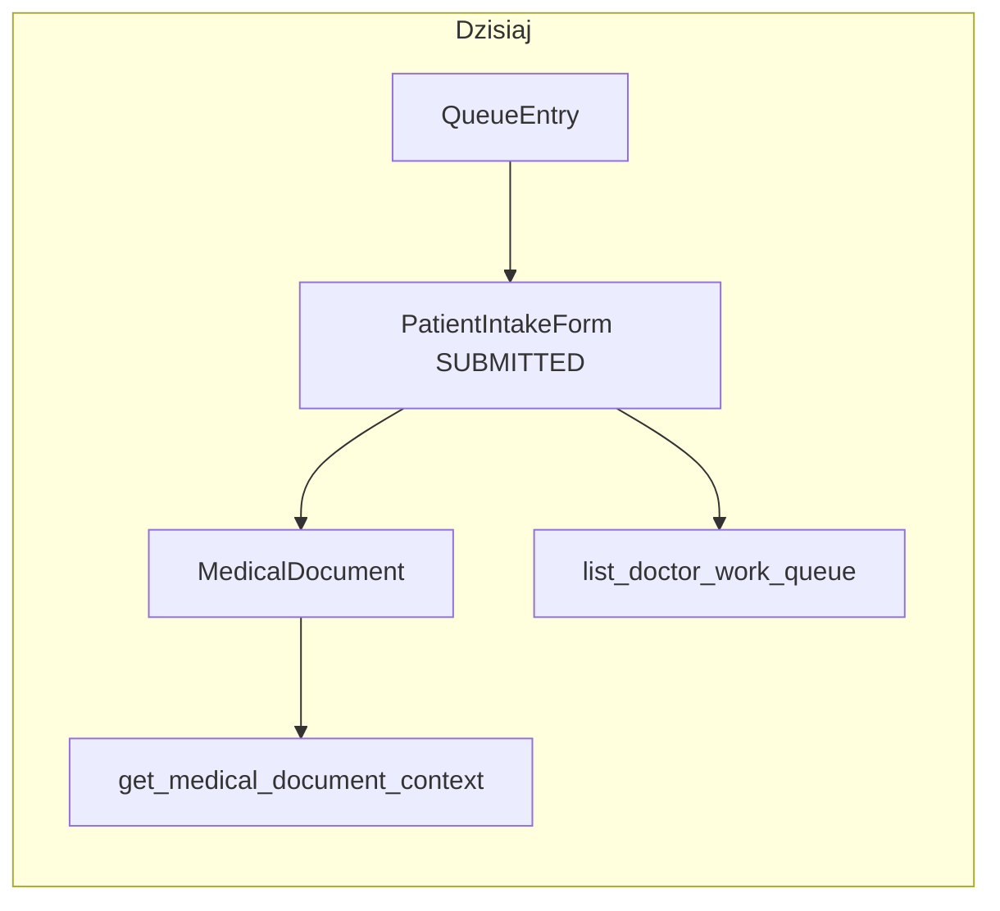

# Dokument medyczny bez cyfrowej ankiety (papier)

## Diagnoza (stan obecny)

- Model [`apps/medical/models.py`](apps/medical/models.py): `MedicalDocument.intake_form` to **`OneToOneField` bez `null=True`** — każdy dokument musi mieć ankietę w bazie.
- Tworzenie: [`create_or_get_medical_document`](apps/medical/services.py) wymaga `intake_form_id`, waliduje zgodność z `queue_entry` i **`IntakeStatus.SUBMITTED`**; API POST używa [`CreateMedicalDocumentRequest`](apps/medical/api_schemas.py) z obowiązkowym `intake_form_id` ([`medical_documents_view`](apps/medical/api_views.py)).
- Stan faktyczny API: `POST /api/v1/medical-documents` w [`medical_documents_view`](apps/medical/api_views.py) dopuszcza dziś wyłącznie role **`DOCTOR`**, **`ADMIN`**, **`MANAGER`** (`require_user_role(... allowed_roles={"DOCTOR", "ADMIN", "MANAGER"})`) — **nie dodawać `RECEPTION`** do tej ścieżki.
- Panel lekarza — wejście z kolejki: [`doctor_open_by_queue_view`](cogitomedica/doctor_views.py) wymaga istniejącej ankiety w statusie **SUBMITTED** (oraz blokuje REOPENED).
- Kontekst Befund: [`get_medical_document_context`](apps/medical/services.py) zawsze woła `get_intake_form_context(intake_form_id=doc.intake_form_id)` i buduje `intake_summary` z wyniku — przy braku ankiety ta ścieżka się wywali.
- Lista HTML „Work Queue”: [`list_doctor_work_queue`](apps/medical/services.py) startuje od querysetu **`PatientIntakeForm`** (SUBMITTED/REOPENED) — wpisów **bez ankiety w ogóle** lub z dokumentem „tylko HiDrive” **nie widać**.
- PDF / HiDrive / outbox: generacja Befund ([`pdf_builder._build_render_context`](apps/medical/pdf_builder.py)) opiera się na **`queue_entry.patient` + `medical_payload`** — **nie wymaga** ankiety. Ścieżka HiDrive dla Befund używa pacjenta z kolejki ([`build_befund_hidrive_path`](apps/outbox/hidrive_paths.py)). SMS w [`apps/outbox/services.py`](apps/outbox/services.py) już ma bezpieczny wzorzec: `intake_form` opcjonalny dla locale (`form_locale` z sesji lub domyślnie z tłumaczeń).
- Stan faktyczny zależności od `intake_form`: ryzyko nie jest równomierne w całym systemie. Jest **wysokie w rdzeniu `apps/medical`**, bo tam `MedicalDocument.intake_form` jest dziś invariantem modelu i kontraktu API. Jest **średnie w PDF/outbox**, bo te ścieżki w dużej części korzystają z `queue_entry.patient`, `MedicalDocumentVersion` i `medical_payload`, a `intake_form` traktują częściowo defensywnie. Nie oznacza to „audytu wszystkiego” w tym samym zakresie, tylko obowiązkowe przejście miejsc tworzenia, serializacji, listowania i prezentacji dokumentu.
- Najbardziej kruche miejsca:
  - `MedicalDocument.intake_form` w [`apps/medical/models.py`](apps/medical/models.py) jest dziś wymaganym `OneToOneField`; `null=True` zmienia podstawowy invariant modelu.
  - [`get_medical_document_context`](apps/medical/services.py) bezwarunkowo woła `get_intake_form_context(intake_form_id=doc.intake_form_id)`; przy `None` wymaga osobnej gałęzi.
  - [`list_doctor_work_queue`](apps/medical/services.py) startuje z `PatientIntakeForm`, więc dokument papierowy bez intake nie pojawi się na liście bez przebudowy na `QueueEntry`.
  - [`CreateMedicalDocumentRequest`](apps/medical/api_schemas.py) wymaga `intake_form_id`; istniejący kontrakt API nie powinien być rozwadniany opcjonalnym polem dla papieru.
  - Test fixtures w [`apps/medical/tests/`](apps/medical/tests/) masowo zakładają `MedicalDocument(..., intake_form=...)`; dodać osobne fixture/testy dla `intake_form=None`, nie tylko poprawić kod produkcyjny.
- Miejsca mniej groźne, ale do regresji:
  - [`apps/outbox/services.py`](apps/outbox/services.py) w dużej części pobiera pacjenta z `queue_entry.patient`, a `intake_form` służy głównie do `form_locale` i jest sprawdzane warunkowo.
  - Befund PDF ([`apps/medical/pdf_builder.py`](apps/medical/pdf_builder.py)) wygląda na zależny przede wszystkim od `MedicalDocumentVersion`, `queue_entry.patient` i `medical_payload`, nie od ankiety jako źródła danych.
  - Adminowe `select_related("intake_form")` samo w sobie nie pęknie przy nullable, ale `list_display` / filtry powinny jasno pokazywać `source_type` oraz etykietę „brak ankiety cyfrowej”.



```mermaid
flowchart LR
  subgraph after [Po zmianie (docelowo)]
    Q[QueueEntry]
    I[PatientIntakeForm SUBMITTED/REOPENED]
    M1[MedicalDocument source_type=DIGITAL_INTAKE intake_form_id!=NULL]
    M2[MedicalDocument source_type=PAPER_INTAKE intake_form_id=NULL]
    C[get_medical_document_context]
    L[list_doctor_work_queue source=QueueEntry]

    Q -->|cyfrowo| I
    I --> M1
    Q -->|papierowo po akcji uprawnionej roli| M2

    Q -->|entry_status=PATIENT_COMPLETED| L
    Q -->|entry_status=PAPER_INTAKE_COMPLETED| L

    M1 --> C
    M2 --> C
  end
```

- Diagram „po zmianie” ujawnia krytyczną semantykę: `QueueEntry` ma dwa statusy „gotowe do pracy lekarza” (`PATIENT_COMPLETED` i `PAPER_INTAKE_COMPLETED`), ale publikacja nadal należy do `MedicalDocument.status`, nie do `QueueEntry.entry_status`.
- Na diagramie celowo rozdzielono dwa warianty dokumentu (`DIGITAL_INTAKE` vs `PAPER_INTAKE`) z jawnie różnym stanem `intake_form_id`. To ma zapobiegać „cichym” regresjom, w których `source_type` i nullable FK rozjadą się semantycznie.

## Kierunek rozwiązania (rekomendowany)

**Uczynić `MedicalDocument.intake_form` opcjonalnym (`null=True`, `blank=True`)** i wprowadzić **jawny typ źródła dokumentu** (`source_type`) zamiast samej flagi w metadanych audytu. Opcja bez cyfrowej ankiety jest wyłącznie trybem awaryjnym, więc dla tej ścieżki stosować tylko `source_type=PAPER_INTAKE`; rezygnujemy z `ADMIN_CREATED`. Istniejące dokumenty z ankiety backfillować jako cyfrowe źródło (np. `DIGITAL_INTAKE`). Nie fałszować `PatientIntakeForm` jako „SUBMITTED z pustymi danymi” — to psuje raporty zgód/anamnezy i miesza dane kliniczne.

## Zakres zmian technicznych

### 1. Migracja schematu

- Plik migracji w `apps/medical/`: `intake_form` → `null=True`, `blank=True` (OneToOne po stronie `MedicalDocument` nadal OK: wiele dokumentów może mieć `NULL`; każda realna ankieta max jeden dokument).
- Dodać pole `MedicalDocument.source_type` jako jawny typ źródła dokumentu:
  - istniejące dokumenty z `intake_form_id IS NOT NULL` → backfill np. `DIGITAL_INTAKE`;
  - dokumenty bez cyfrowej ankiety → zawsze `PAPER_INTAKE`;
  - pole musi być dostępne w adminie, serializerach/listach i audycie, nie tylko w `AuditEvent.metadata`;
  - admin powinien pokazywać czytelny stan „brak ankiety cyfrowej” dla `PAPER_INTAKE`, zamiast wymuszać klikanie w puste `intake_form`.
- Dodać constraint spójności źródła z relacją do ankiety, żeby nowy invariant był wymuszony w bazie:
  - `source_type == DIGITAL_INTAKE` ⇒ `intake_form_id IS NOT NULL`;
  - `source_type == PAPER_INTAKE` ⇒ `intake_form_id IS NULL`;
  - test migracji/modelu ma próbować zapisać oba niespójne warianty i oczekiwać błędu integralności.
- Dodać nową wartość `QueueEntryStatus.PAPER_INTAKE_COMPLETED` (np. label „Paper intake completed”) w [`apps/reception/models.py`](apps/reception/models.py), z tłumaczeniami i wpływem na widoki/listy kolejki. Ten status ma oznaczać, że etap ankiety został obsłużony papierowo, a nie że pacjent zakończył cyfrowy formularz.
- Najważniejsza zasada semantyczna:
  - `PATIENT_COMPLETED` = pacjent zakończył cyfrowy intake;
  - `PAPER_INTAKE_COMPLETED` = systemowo dopuszczono pracę lekarza na podstawie papieru.
  Lista lekarza może traktować oba warianty jako „gotowe do pracy lekarza”, ale raporty cyfrowego intake, konwersji tabletowej, podpisanych formularzy i kompletności cyfrowych zgód/anamnezy **nie mogą ich sumować**.
- Usunąć `QueueEntryStatus.PUBLISHED` z modelu kolejki — szczegóły wykonawcze w **§1.A**. Krótko: status jest produkcyjnie martwy (żaden serwis go nie ustawia), więc to cleanup martwego enuma, a nie migracja funkcjonalna. Po cleanupie ostatni stan wpisu kolejki po etapie ankiety to:
  - `PATIENT_COMPLETED` dla cyfrowej ankiety;
  - `PAPER_INTAKE_COMPLETED` dla awaryjnej ankiety papierowej;
  - `CANCELLED` dla odwołania.
  Publikacja Befund pozostaje stanem `MedicalDocument.status == PUBLISHED` / `MedicalDocumentVersion.version_status == PUBLISHED`, nie stanem pozycji kolejki.
- [`apps/core/translation_data/administration_choices.json`](apps/core/translation_data/administration_choices.json): dodać label dla `administration.choice_queue_entry_status_paper_intake_completed`; klucz `administration.choice_queue_entry_status_published` znika razem z enum-em (patrz §1.A).
- [`apps/reception/models.py`](apps/reception/models.py): ocenić indeks częściowy `qentry_active_pos_idx`, który dziś obejmuje tylko `WAITING` i `IN_PROGRESS`. `PAPER_INTAKE_COMPLETED` nie powinien wejść do indeksu „aktywnych pozycji”, jeśli indeks ma reprezentować kolejkę pacjentów oczekujących/w trakcie obsługi recepcji/tabletu.
- [`apps/reception/services.py`](apps/reception/services.py): `update_queue_entry()` waliduje po `QueueEntryStatus.choices`, więc po dodaniu enumu API technicznie zaakceptuje `PAPER_INTAKE_COMPLETED`, a po usunięciu enumu odrzuci `PUBLISHED`. To jest akceptowalne, ale nadal oznacza brak twardej maszyny stanów — wrażliwe przejście `WAITING -> PAPER_INTAKE_COMPLETED` powinno iść przez serwis medyczny, nie przez ogólny PATCH kolejki.
- [`apps/reception/anonymization.py`](apps/reception/anonymization.py): terminalne pozostają tylko `CANCELLED` oraz ewentualnie brak aktywnego wpisu; `PAPER_INTAKE_COMPLETED` ma blokować anonimizację tak jak `PATIENT_COMPLETED`, dopóki dokument medyczny nie przejdzie pełnego cyklu retencji/anonymizacji. Nie dodawać `PAPER_INTAKE_COMPLETED` do terminalnych statusów tylko dlatego, że pacjent zakończył etap ankiety.
- Sprawdzić unikalność / constraint-y w `Meta` modelu (jeśli jakiekolwiek zakładają non-null intake — poprawić).

### 1.A Cleanup martwego `QueueEntryStatus.PUBLISHED` (osobny, samodzielny zakres)

Ta sekcja jest celowo wyodrębniona, bo to **cleanup martwego enuma**, a nie zmiana semantyki kolejki. Mieszanie tej zmiany z resztą planu (jak w pierwotnej wersji §1) ukrywało dwa istotne fakty: (a) produkcja tego statusu nie używa, więc nie ma czego „migrować”; (b) `_TERMINAL_QUEUE_STATUSES` w anonymizacji wymaga jawnej decyzji projektowej — milczenie nad tym to luka retencji RODO.

**Inwentaryzacja (stan kodu, do zerowego usunięcia poza migracjami historycznymi):**

- Definicja: [`apps/reception/models.py`](apps/reception/models.py) — wartość `PUBLISHED = "PUBLISHED", db_gettext_lazy("administration.choice_queue_entry_status_published", "Published")` w `QueueEntryStatus`.
- Anonymizacja: [`apps/reception/anonymization.py`](apps/reception/anonymization.py) — `_TERMINAL_QUEUE_STATUSES = frozenset({QueueEntryStatus.PUBLISHED, QueueEntryStatus.CANCELLED})` używane w `anonymize_patient` jako `exclude(entry_status__in=_TERMINAL_QUEUE_STATUSES)`.
- Tłumaczenia: [`apps/core/translation_data/administration_choices.json`](apps/core/translation_data/administration_choices.json) — klucz `administration.choice_queue_entry_status_published` z wartościami DE/EN/PL.
- Testy używające PUBLISHED jako trick na obejście guardu active-visit lub jako dowolnej „terminalnej” wartości:
  - [`apps/reception/tests/test_anonymization.py`](apps/reception/tests/test_anonymization.py) (linia ~328 — `entry_status=QueueEntryStatus.PUBLISHED` w `setUp`).
  - [`apps/medical/tests/test_services_coverage.py`](apps/medical/tests/test_services_coverage.py) (linie ~94, 148, 174, 211).
  - [`apps/patient_results/tests/test_document_services.py`](apps/patient_results/tests/test_document_services.py) (linia ~68).
- Dokumentacja: [`.ai/db-plan.md`](.ai/db-plan.md) (`queue_entry_status_enum: ... PUBLISHED ...`) oraz [`.ai/prd.md`](.ai/prd.md) (diagram przejść `WAITING -> ... -> PUBLISHED`).
- **Czego NIE ruszać:** historyczne migracje [`apps/reception/migrations/0001_initial.py`](apps/reception/migrations/0001_initial.py) i [`apps/reception/migrations/0035_alter_patientformsession_options_and_more.py`](apps/reception/migrations/0035_alter_patientformsession_options_and_more.py) zachowują `PUBLISHED` w `choices` na trwałe — modyfikacja zaaplikowanych migracji jest niedopuszczalna. Cleanup robi się przez **nową migrację `AlterField`**, nie edycję starych.

**Plan wykonania (deterministyczna kolejność):**

1. **Decyzja projektowa o `_TERMINAL_QUEUE_STATUSES` — wybrana: Wariant A (rekomendowany).**
   - Dziś `_TERMINAL_QUEUE_STATUSES = {PUBLISHED, CANCELLED}` jest funkcjonalnie równe `{CANCELLED}`, bo `PUBLISHED` w produkcji nie jest osiągalny żadnym serwisem.
   - Po cleanupie: `_TERMINAL_QUEUE_STATUSES = frozenset({QueueEntryStatus.CANCELLED})`. To czyni dotychczasową rzeczywistość explicite.
   - **Nie dodawać** `PATIENT_COMPLETED` ani `PAPER_INTAKE_COMPLETED` do zbioru terminalnego — te statusy oznaczają „ankieta zakończona, dokument medyczny ma być (lub jest) procesowany”, a nie „pacjent jest gotowy do anonimizacji”.
   - Wariant B (dodanie `PATIENT_COMPLETED` / `PAPER_INTAKE_COMPLETED` do terminala) jest **odrzucony** w tym planie: rozszerzałby zakres anonymizacji bez analizy retencji dokumentu medycznego, a to wykracza poza scope tej zmiany.
2. **Nowa migracja `apps/reception/migrations/0XXX_drop_queue_entry_status_published.py`:**
   - `migrations.AlterField` na `QueueEntry.entry_status` z nowym zestawem `choices` (bez `PUBLISHED`, z `PAPER_INTAKE_COMPLETED` z §1).
   - Defensywna data migration (`RunPython`) jako siatka bezpieczeństwa dla środowisk dev/test/staging:
     ```python
     QueueEntry.objects.filter(entry_status="PUBLISHED").update(entry_status="PATIENT_COMPLETED")
     ```
     plus `create_audit_event(event_type="QUEUE_STATUS_BACKFILL_PUBLISHED_TO_PATIENT_COMPLETED", metadata={"affected_count": <n>})` **tylko jeśli `n > 0`**. Brak audytu przy `n == 0`, żeby nie zaśmiecać logów na produkcji.
   - `reverse_code` ustawić jako `noop` z komentarzem „nie odtwarzamy martwego statusu w downgrade” (wracamy do enuma bez PUBLISHED nawet po cofnięciu — ten kierunek jest świadomy).
3. **Kod produkcyjny:**
   - [`apps/reception/models.py`](apps/reception/models.py): usunąć wartość `PUBLISHED` z `QueueEntryStatus`.
   - [`apps/reception/anonymization.py`](apps/reception/anonymization.py): `_TERMINAL_QUEUE_STATUSES = frozenset({QueueEntryStatus.CANCELLED})`. Komentarz nad stałą musi opisywać, że terminalność wynika tylko z anulowania wizyty; pacjenci po publikacji Befund **nie** są anonimizowani na podstawie statusu kolejki (patrz „Otwarty dług RODO” poniżej).
4. **Tłumaczenia:**
   - [`apps/core/translation_data/administration_choices.json`](apps/core/translation_data/administration_choices.json): usunąć klucz `administration.choice_queue_entry_status_published` (DE/EN/PL).
   - Sprawdzić, czy klucz jest seedowany do bazy migracją w `apps/core/migrations/` (analogicznie do innych translation seedów). Jeśli tak — dodać migrację usuwającą wpis z `Translation` po aktualizacji JSON, żeby DB nie miała sieroty. Jeśli mechanizm seed-from-JSON sam usuwa nieobecne klucze przy następnym deployu — udokumentować to wprost w opisie migracji.
5. **Testy (przepisanie 6 wystąpień):**
   - [`apps/reception/tests/test_anonymization.py`](apps/reception/tests/test_anonymization.py): `setUp` używał `entry_status=QueueEntryStatus.PUBLISHED` po to, żeby `anonymize_patient` w sąsiednich testach nie wybuchało na guardzie active-visit. Przepisać na `entry_status=QueueEntryStatus.CANCELLED` — semantycznie zgodne z nowym `_TERMINAL_QUEUE_STATUSES`. Jeśli któryś z testów testuje retencję dokumentu medycznego (a nie tylko mechanikę anonymizacji), wymaga osobnej analizy: być może test był do tej pory bezsensowny w produkcyjnym kontekście, bo guardował się przeciwko ścieżce, której produkcja nie używa.
   - [`apps/medical/tests/test_services_coverage.py`](apps/medical/tests/test_services_coverage.py) (4 wystąpienia): zamienić na `PATIENT_COMPLETED`. Jeśli test sprawdzał stan po publikacji Befund — to publikacja jest stanem `MedicalDocument.status`, nie `QueueEntry.entry_status`, więc test nie traci sensu, tylko poprawnie odróżnia warstwy.
   - [`apps/patient_results/tests/test_document_services.py`](apps/patient_results/tests/test_document_services.py): jak wyżej, zamienić na `PATIENT_COMPLETED`.
6. **Dokumentacja:**
   - [`.ai/db-plan.md`](.ai/db-plan.md): zaktualizować `queue_entry_status_enum` (usunąć `PUBLISHED`, dodać `PAPER_INTAKE_COMPLETED`).
   - [`.ai/prd.md`](.ai/prd.md): poprawić ciąg przejść kolejki. Z dotychczasowego `WAITING -> IN_PROGRESS -> PATIENT_COMPLETED -> DOCTOR_IN_PROGRESS -> PUBLISHED + CANCELLED` na `WAITING -> IN_PROGRESS -> (PATIENT_COMPLETED | PAPER_INTAKE_COMPLETED) -> DOCTOR_IN_PROGRESS + CANCELLED`. **Nie traktować `DOCTOR_IN_PROGRESS` jako terminalnego.**
   - Pozostałe wystąpienia `PUBLISHED` w [`.ai/api-plan.md`](.ai/api-plan.md) / [`.ai/api-plan-pl.md`](.ai/api-plan-pl.md) dotyczą `MedicalDocument` / `MedicalDocumentVersion` — **nie ruszać**, to nie ten enum.
7. **Grep-guard w CI (zapobieganie regresji):**
   - Dodać do CI test/skrypt który egzekwuje, że `rg "QueueEntryStatus\.PUBLISHED"` poza `apps/reception/migrations/0001_initial.py`, `apps/reception/migrations/0035_*.py` i nową migracją wycofującą zwraca pusty wynik. Realizacja: prosty pytest-test w `apps/reception/tests/test_dead_status_guard.py` używający `subprocess.run(["rg", ...])` lub `Path.rglob` + regex.
   - Alternatywnie: wpis w `.pre-commit-config.yaml` blokujący commit z `QueueEntryStatus.PUBLISHED`. To słabsza obrona (lokalna), ale tańsza.
8. **Demo/Seed:** [`scripts/manual_demo/seed.py`](scripts/manual_demo/seed.py) używa tylko `WAITING` / `IN_PROGRESS` / `PATIENT_COMPLETED` — bez zmian. Potwierdzić grep-em przed mergem.

**Otwarty dług RODO — explicite poza scope tego planu (nie ukrywać):**

- Po cleanupie `_TERMINAL_QUEUE_STATUSES = {CANCELLED}` opisuje rzeczywisty stan systemu: anonymizacja na podstawie statusu kolejki działa **wyłącznie** dla wizyt anulowanych. Pacjenci, dla których Befund został opublikowany i przeszedł retencję, **nie są** anonimizowani przez `anonymize_patient` po `entry_status` — albo są obsługiwani przez inny mechanizm retencyjny (np. job po `MedicalDocument.last_published_at + N` w innym serwisie), albo nie są w ogóle.
- **Plan wycofania `PUBLISHED` nie zmienia tej rzeczywistości — tylko ją ujawnia.** Wcześniej `_TERMINAL_QUEUE_STATUSES` zawierał martwą wartość, która sugerowała, że istnieje ścieżka anonymizacji po publikacji. Po cleanupie ten miraż znika.
- **Wymagana osobna analiza (NIE w tym PR-ze):** czy/gdzie/jak system anonymizuje pacjentów po retencji dokumentu medycznego (Art. 17 GDPR + medyczne okresy retencji DE: §630f BGB / §10 MBO-Ä — typowo 10 lat, ale anonymizacja danych identyfikacyjnych poza dokumentem klinicznym to inna oś). Przewidzieć osobny plan/ticket: „Audyt retencji pacjentów po publikacji Befund — `MedicalDocument` jako źródło prawdy zamiast `QueueEntry.entry_status`”.
- **Dlaczego nie dołączać tego do tego planu:** zmiana semantyki anonymizacji = przegląd zgodności prawnej + pełny audyt ścieżek danych pacjenta + decyzja DPO. To jest projekt na tygodnie, nie na bullet w planie funkcji „dokument bez ankiety”. Wpychanie go tutaj złamie zasadę „małych PR-ów” i ukryje zmianę compliance pod zmianą funkcjonalną.

**Definition of Done dla §1.A:**

- `rg "QueueEntryStatus\.PUBLISHED"` poza trzema dozwolonymi migracjami zwraca 0 trafień.
- `rg "choice_queue_entry_status_published"` zwraca 0 trafień.
- `_TERMINAL_QUEUE_STATUSES == frozenset({QueueEntryStatus.CANCELLED})` — z testem jednostkowym.
- Wszystkie testy zielone po przepisaniu 6 wystąpień PUBLISHED na `CANCELLED` lub `PATIENT_COMPLETED` zgodnie z intencją testu.
- Migracja stosuje się forward; reverse jest `noop` z komentarzem.
- `.ai/db-plan.md` i `.ai/prd.md` zaktualizowane.
- Komentarz nad `_TERMINAL_QUEUE_STATUSES` jawnie odsyła do otwartego długu retencji.

### 2. Nowa funkcja serwisowa (obok istniejącej)

W [`apps/medical/services.py`](apps/medical/services.py):

- Np. `create_medical_document_without_intake(*, queue_entry_id, created_by_user_id, reason: str | None)`:
  - Całość w `transaction.atomic()`.
  - Najpierw pobrać `QueueEntry` przez `QueueEntry.objects.select_for_update().select_related("daily_queue", "patient").get(id=queue_entry_id)` i dopiero pod tą blokadą walidować status oraz tworzyć dokument.
  - Nie opierać bezpieczeństwa wyłącznie na luźnym `get_or_create`: po blokadzie kolejki sprawdzić brak istniejącego `MedicalDocument` dla `queue_entry`, a przy tworzeniu nadal obsłużyć konflikt unikalności jako błąd domenowy/idempotencję.
  - Tworzyć dokument z **`intake_form_id=None`** oraz `source_type=PAPER_INTAKE` ustawianym po stronie serwisu (nie przyjmować `source_type` z requestu).
  - Walidacje domenowe: kolejka istnieje; brak drugiego dokumentu; wpis kolejki w statusie **`QueueEntryStatus.WAITING`** („oczekujący”); pacjent powiązany z wpisem.
  - **Zabezpieczenie czasowe:** dokument bez cyfrowej ankiety można utworzyć dopiero po upływie **3 godzin od `QueueEntry.appointment_time`**. Przykład: wizyta o 10:00 ⇒ najwcześniej 13:00. Jeśli `appointment_time` jest puste albo `timezone.now() < appointment_time + 3h`, serwis zwraca kontrolowany błąd domenowy i nie tworzy dokumentu. To ogranicza przypadkowe utworzenie papierowego dokumentu przed wizytą albo w jej trakcie.
  - **Po utworzeniu dokumentu:** ten sam `QueueEntry` przechodzi w status **`QueueEntryStatus.PAPER_INTAKE_COMPLETED`**, nie `PATIENT_COMPLETED`, żeby nie mieszać cyfrowego zakończenia ankiety z awaryjną ścieżką papierową. Wykonanie w **tej samej transakcji** co utworzenie dokumentu + wpis audytu (spójność przy błędzie).
  - **Polityka roli (ustalona):** wywołanie wyłącznie dla ról **`DOCTOR`**, **`ADMIN`**, **`MANAGER`** (`is_doctor` / `is_admin_role` / `is_manager`); **nie dodawać `RECEPTION`** do tworzenia dokumentów medycznych.
  - `create_audit_event` z typem np. `MEDICAL_DOCUMENT_CREATED_WITHOUT_INTAKE` lub rozszerzone metadata przy istniejącym `MEDICAL_DOCUMENT_CREATED`, ale audyt nie zastępuje pola domenowego: w metadata zapisać co najmniej `source_type: "PAPER_INTAKE"`, `queue_entry_status_before` / `after`, `reason`, `intake_form_id: null`.

Istniejące `create_or_get_medical_document` **zostaje** dla ścieżki tabletowej (bez regresji).

### 3. API

- [`CreateMedicalDocumentRequest`](apps/medical/api_schemas.py): dziś `intake_form_id` jest obowiązkowe; preferować **osobny endpoint** `POST .../medical-documents/no-intake` albo osobny request schema dla gałęzi bez ankiety, żeby nie przeciążać istniejącego kontraktu opcjonalnym `intake_form_id`.
- [`medical_documents_view`](apps/medical/api_views.py): istniejący `POST /medical-documents` zostaje ścieżką dokumentu z ankiety (`DOCTOR`/`ADMIN`/`MANAGER`, wymagane `intake_form_id`) bez rozszerzania o `RECEPTION`.
- Nowa gałąź/API bez ankiety: role **`DOCTOR`**, **`ADMIN`**, **`MANAGER`**; wymaga `queue_entry_id` i `reason`, a `source_type=PAPER_INTAKE` ustawia serwis. Endpoint wywołuje serwis z blokadą `QueueEntry.select_for_update()` i po sukcesie ustawia `QueueEntryStatus.PAPER_INTAKE_COMPLETED`.
- Testy w [`apps/medical/tests/test_api.py`](apps/medical/tests/test_api.py) + serwis w [`test_services_coverage.py`](apps/medical/tests/test_services_coverage.py).

### 4. `get_medical_document_context`

W [`get_medical_document_context`](apps/medical/services.py):

- Jeśli `doc.intake_form_id` jest `None`: **nie** wołać `get_intake_form_context`; zbudować `intake_summary` ze stałymi pustymi sekcjami (`consents`, `body_map_data`, `anamnesis_*`) oraz `patient` z **`doc.queue_entry.patient`** (serializacja jak w intake context: id, imię, nazwisko, DOB — spójność z panelem).
- Pole `intake_form_id` w JSON: **`null`**, nie string `"None"` (dziś jest `str(doc.intake_form_id)` — przy nullable trzeba to poprawić).

### 5. Lista lekarza (HTML) + ewentualnie API listy

- [`list_doctor_work_queue`](apps/medical/services.py): **nie scalać dwóch list po paginacji** (`PatientIntakeForm` + `MedicalDocument(intake_form=null)`). Źródłem prawdy ma być jeden queryset na **`QueueEntry`**, bo oba warianty są sposobami doprowadzenia wpisu kolejki do gotowości dla lekarza.
- Eligibility listy lekarza:
  - cyfrowo: `QueueEntry` z `intake_form__form_status__in=(SUBMITTED, REOPENED)`;
  - papierowo: `QueueEntry.entry_status == PAPER_INTAKE_COMPLETED` oraz `medical_document__intake_form__isnull=True` i `medical_document__source_type == PAPER_INTAKE`.
- Filtry `status`, `queue_date`, `patient_search`, `scope` i `total` działają na tym jednym querysetcie `QueueEntry`; paginację robić **dopiero po pełnym filtrowaniu i sortowaniu**, żeby nie rozjechały się `total`, kolejność i widoczność.
- Brak kolizji z usunięciem `QueueEntryStatus.PUBLISHED`: filtr `status` w liście lekarza musi oznaczać **status dokumentu medycznego** (`medical_document__status`, np. `DRAFT` / `PUBLISHED`), nie `QueueEntry.entry_status`. Gotowość wpisu do listy wynika z eligibility (`SUBMITTED`/`REOPENED` albo `PAPER_INTAKE_COMPLETED`), a publikacja z `MedicalDocument.status`.
- Sortowanie: wprowadzić jawny klucz sortowania. **Uwaga wykonawcza:** `Coalesce("intake_form__submitted_at", "medical_document__created_at", "appointment_time", "created_at")` jako klucz sortowania **nie jest indeksowalny w Postgres** (functional index nie pokrywa wyrażenia z kolumn z różnych tabel) — ten kierunek wymaga albo denormalizowanej kolumny po stronie `QueueEntry`, albo dwupoziomowego sortowania `(-daily_queue__queue_date, position_no, id)`. Decyzję projektową, indeksy i benchmark — patrz **§5.A**. Papier nie ma `submitted_at`, więc nie może dziedziczyć sortowania z ankiet.
- Scope `published_by_me` i podobne warunki po wersjach realizować przez `Exists(...)`, nie przez zwykły join do `versions`, żeby nie mnożyć wierszy i nie psuć `count()` / `distinct()` / paginacji.
- Po wybraniu strony: zebrać `queue_entry_ids`, pobrać odpowiadające `MedicalDocument` z `versions` / `outbox_events`, a payload budować przez jeden helper, np. `_serialize_doctor_work_queue_row(entry, doc)`.
- Helper serializacji musi zachować obecne pola i semantykę wiersza listy: `document_id`, `intake_form_id`, `status`, `published_by`, `has_pending_revision`, `published_version_no`, lock/semaphore (`locked_by_username`, `locked_at`, `is_locked_by_other`, `row_has_edit_semaphore`) oraz delivery/retry (`row_is_fully_delivered`, `pdf_generation_status`, `hidrive_status`, `sms_status`, `processing_error_message`, `can_retry_processing`). Papierowy wiersz nie może zgubić zachowania locków ani statusów outbox tylko dlatego, że `intake_form_id` jest `null`.
- W payloadzie wiersza: `intake_form_id: null` dla papieru, `source_type`, ewentualnie flaga/etykieta UI wyprowadzona z `source_type` (np. „bez ankiety cyfrowej” dla `PAPER_INTAKE`) w [`templates/doctor/list.html`](templates/doctor/list.html).
- Tłumaczenia w [`apps/core/translation_data/doctor_ui.json`](apps/core/translation_data/doctor_ui.json) + migracja seed w `apps/core/migrations/`.

### 5.A Wydajność listy lekarza (`list_doctor_work_queue`)

Refactor §5 nie jest neutralny wydajnościowo. Przejście ze startu po `PatientIntakeForm` (z `submitted_at` jako naturalnym kluczem sortowania) na start po `QueueEntry` z heurystycznym kluczem łączącym daty z trzech tabel — **bez zaprojektowanych indeksów** — zaowocuje regresją: pierwszy „wolny ekran” lekarza pojawi się przy kilkuset wpisach na dzień. Ta sekcja musi zostać domknięta przed mergem PR-a, nie odsunięta na „później”.

**Założenia projektowe (do potwierdzenia benchmarkiem):**

- Realistyczny rozmiar danych: zaprojektować scenariusz testowy odpowiadający 6/12/24 miesiącom pracy kliniki (np. 50 / 100 / 200 wizyt/dzień × 252 dni roboczych = ~12k / 25k / 50k `QueueEntry` rocznie). Bez tego nie ma sensu mówić o „optymalizacji”.
- SLA dla pierwszej strony listy lekarza (50 wierszy): **p50 ≤ 200 ms, p95 ≤ 800 ms** od wejścia do widoku do gotowego JSON-a (mierzone na poziomie serwisu, bez czasu sieci/renderowania szablonu). Cel jest do potwierdzenia z product/UX, ale plan musi mieć jakikolwiek explicit cel.
- Liczba zapytań DB na stronę listy: **≤ 5** (dziś jest co najmniej 4: queryset główny + count + batch `MedicalDocument` + batch `published_versions`, plus prefetch). Cel ≤ 5 utrzymujemy także po dodaniu papieru.

**Obowiązkowy plan wykonawczy (po kolei, z artefaktami w PR):**

1. **Bench przed (baseline na obecnym kodzie):**
   - Skrypt `apps/medical/management/commands/bench_doctor_work_queue.py` ładujący dataset (12k / 25k / 50k wpisów + odpowiadające ankiety/dokumenty/wersje/outbox) i mierzący `list_doctor_work_queue` dla typowych kombinacji (`scope=all|mine|published_by_me|in_revision`, z/bez `patient_search`, page 1 i page 5).
   - Wynik zapisać jako tabelę w `docs/perf/doctor_work_queue_baseline.md`: liczba zapytań, total time, max single query, plan z `EXPLAIN (ANALYZE, BUFFERS)` dla 3 najwolniejszych zapytań.
   - To jest **baseline**, a nie „dobry wynik” — może już dziś być za wolne. Bez tego nie wiemy, czy refactor §5 pogarsza, czy poprawia.
2. **Decyzja: klucz sortowania.**
   - **Wariant A (rekomendowany): denormalizowana kolumna** `QueueEntry.doctor_list_sort_at: DateTime, null=True, db_index=True`, ustawiana w trzech serwisach:
     - `submit_patient_intake_form` ← `intake_form.submitted_at` (cyfrowa ankieta);
     - `create_medical_document_without_intake` ← `timezone.now()` (papier, w tej samej transakcji co utworzenie dokumentu);
     - opcjonalnie `update_queue_entry` przy odwołaniu — ustawić na NULL (wpada poza listę).
     Indeks: `Index(fields=["-doctor_list_sort_at"], name="qentry_doctor_sort_idx", condition=Q(doctor_list_sort_at__isnull=False))`.
     Sortowanie: `order_by("-daily_queue__queue_date", "-doctor_list_sort_at", "position_no", "id")`.
     Zalety: indeksowane, deterministyczne, niezależne od liczby joinów. Koszt: write-side update w 2-3 serwisach + migracja backfill.
   - **Wariant B: dwupoziomowe sortowanie bez nowego pola** — `order_by("-daily_queue__queue_date", "position_no", "id")`. Tani, ale tracimy „świeższe ankiety pierwsze” dla tej samej daty kolejki — potwierdzić z UX, czy `position_no` jest akceptowalnym proxy.
   - **Wariant C: `Coalesce` cross-table** — odrzucony jako default, bo nieindeksowalny i nieprzewidywalny wydajnościowo dla > 10k wierszy. Zostawiony tylko jeśli dataset jest gwarantowanie mały (mała klinika, niski wzrost) i benchmark to potwierdzi.
   - **Plan musi wybrać wariant A albo B przed implementacją** i uzasadnić benchmarkiem. Nie zostawiać „TBD”.
3. **Plan indeksów (konkretny, nie ogólnik):**
   - Eligibility (cyfrowa lub papierowa ankieta gotowa do pracy lekarza): rozważyć **partial index** na `QueueEntry`:
     ```sql
     CREATE INDEX qentry_doctor_eligible_idx ON queue_entry (daily_queue_id, position_no)
       WHERE entry_status IN ('PATIENT_COMPLETED', 'PAPER_INTAKE_COMPLETED');
     ```
     Pokrywa szybką ścieżkę listy lekarza dla statusów po-ankiecie. Eligibility cyfrowa po `intake_form__form_status` IN (SUBMITTED, REOPENED) zostaje sprawdzana joinem do `intake.PatientIntakeForm` — istniejący `intake.PatientIntakeForm.indexes` w [`apps/intake/models.py`](apps/intake/models.py) ma już `(form_status, submitted_at)`, **zweryfikować EXPLAIN-em**, czy planner go wybiera.
   - Sortowanie (zależne od wariantu wyboru z punktu 2):
     - Wariant A: `Index(fields=["-doctor_list_sort_at"], condition=...)` jak wyżej.
     - Wariant B: istniejący `qentry_active_pos_idx` nie pokrywa `PATIENT_COMPLETED`/`PAPER_INTAKE_COMPLETED`; rozważyć rozszerzenie albo osobny partial.
   - `patient_search` (`icontains` na `Patient.first_name` / `last_name`): dziś sequential scan. Wprowadzić **`pg_trgm` + GIN trigram index** na obu polach:
     ```python
     from django.contrib.postgres.indexes import GinIndex
     GinIndex(fields=["last_name"], name="patient_last_name_trgm_idx", opclasses=["gin_trgm_ops"])
     GinIndex(fields=["first_name"], name="patient_first_name_trgm_idx", opclasses=["gin_trgm_ops"])
     ```
     Wymaga `CREATE EXTENSION IF NOT EXISTS pg_trgm` (osobna migracja `RunSQL`). Bez tego search po nazwisku przy 50k pacjentów = sekundy.
   - **Każdy nowy index udokumentować** w pliku migracji z komentarzem „dla `list_doctor_work_queue` — patrz §5.A planu”.
4. **Eliminacja nadmiarowych joinów do `versions` (scope `published_by_me`):**
   - Dziś: `Q(queue_entry__medical_document__versions__published_by_user_id=user.id)` — to **left join do `medical_document_version`**, mnoży wiersze, wymusza `distinct()`, psuje `count()`.
   - Po: `Exists(MedicalDocumentVersion.objects.filter(medical_document__queue_entry=OuterRef("pk"), published_by_user_id=user.id))`.
   - Zysk: brak duplikatów, prawdziwy `count()` bez `distinct()` po wielokrotnym joinie, planner wybiera anti-/semi-join zamiast left+distinct.
   - Analogicznie dla `in_revision` — sprawdzić, czy nie ma ukrytego joinu do `versions`.
5. **Batchowanie pobrania dokumentów + wersji + outbox eventów:**
   - Dziś: 1 zapytanie po `PatientIntakeForm` (z paginacją), potem 1 zapytanie po `MedicalDocument.objects.filter(queue_entry_id__in=...)` z `Prefetch("versions")` z `Prefetch("outbox_events")`, potem 1 zapytanie po `published_versions`. Razem ~4 zapytania + count.
   - Po: zachować ten sam wzorzec (page-then-batch), ale udokumentować jako kontrakt. **Serializer `_serialize_doctor_work_queue_row(entry, doc)` MUSI nie wykonywać żadnych nowych zapytań DB** — wszystkie potrzebne dane przychodzą z prefetcha.
   - Funkcje pomocnicze do audytu pod kątem N+1:
     - `latest_retryable_outbox_event(latest)` — zweryfikować, czy korzysta z prefetchowanej `latest.outbox_events`, a nie robi nowego query.
     - `get_document_lock_state(doc)` — j.w.
     - `latest_version_processing_error_message(latest)` — j.w.
   - Każda z tych funkcji powinna mieć w docstring informację „read-only over prefetched data; do NOT trigger queries”.
6. **Asercja `assertNumQueries` w testach:**
   - Dodać test `apps/medical/tests/test_doctor_work_queue_query_budget.py`:
     ```python
     with self.assertNumQueries(5):  # próg do potwierdzenia benchmarkiem
         items, total = list_doctor_work_queue(user=self.doctor, page=1, page_size=50)
     ```
     dla każdego scope (`all`, `mine`, `published_by_me`, `in_revision`) i osobno dla `patient_search`.
   - Test ma fail-em chronić przed regresją N+1 w przyszłych zmianach (np. dodanie nowego pola serializowanego z lazy attribute).
   - Dataset testowy: minimum 20 `QueueEntry` (mix cyfrowych i papierowych) z dokumentami w różnych stanach — mały, deterministyczny, ale wystarczający do wykrycia N+1.
7. **Decyzja: paginacja offset vs kursor:**
   - Dziś: offset (`qs[start:end]` + `count()`). Działa do ~10k pasujących wierszy; powyżej — `OFFSET 9000 LIMIT 50` pogarsza się liniowo.
   - Próg decyzji: jeśli benchmark pokazuje p95 > 800 ms dla page 5 (~250 wierszy do przeskoczenia) na dataset 25k, **wprowadzić paginację kursorową**.
   - Kursor: `(daily_queue__queue_date DESC, doctor_list_sort_at DESC, id ASC)` jako stabilny tuple, zakodowany base64. `id` jako tie-breaker jest **obowiązkowy** — bez niego strona może dublować/pomijać wiersze przy równych datach.
   - Jeśli próg nie jest przekroczony — zostawić offset, ale w komentarzu odnotować decyzję i próg, żeby przyszły reviewer wiedział, kiedy zmienić.
   - **Nie wprowadzać kursora „na zapas”** — to dodatkowy koszt API i klienta, który ma sens tylko jeśli dane go wymagają.
8. **Bench po (po refactorze §5 + §5.A):**
   - Ten sam skrypt, ten sam dataset, ten sam zestaw kombinacji, ale na nowej implementacji.
   - Wynik w `docs/perf/doctor_work_queue_after.md` z jawnym porównaniem do baseline (`Δ ms`, `Δ queries`, `Δ buffers`).
   - **Akceptacja PR**: dla każdej kombinacji `time_after ≤ 1.2 × time_before` LUB `time_after ≤ SLA`. Jeśli któraś kombinacja jest > 1.2× wolniejsza i nie spełnia SLA — PR nie wchodzi bez decyzji o dalszej optymalizacji.
9. **VACUUM ANALYZE po deployu nowych indeksów:**
   - Dodać krok do runbooka deployu: po zaaplikowaniu migracji indeksowych uruchomić `VACUUM ANALYZE queue_entry; VACUUM ANALYZE patient_intake_form; VACUUM ANALYZE medical_document; VACUUM ANALYZE patient;`. Bez `ANALYZE` planner Postgresa nie zna statystyk nowych indeksów i może wybierać stare plany.
   - Udokumentować w [`docs/manual/03-doktor.md`](docs/manual/03-doktor.md) lub osobnym `docs/operations/deploy-runbook.md` (jeśli istnieje).

**Czego ta sekcja świadomie NIE wprowadza (out-of-scope, do osobnej analizy):**

- Materializowane widoki / cache na poziomie aplikacji (Redis): potrzeba do udowodnienia osobnym benchmarkiem; przedwczesne wprowadzanie cache zwiększy złożoność i ryzyko niespójności (lock state, retry status — to dane realtime).
- Zmiana modelu uprawnień (`scope=mine` vs RLS w Postgresie): wykraczające poza ten plan, wymaga osobnej decyzji.
- Server-side pagination state w sesji: niezgodne z idempotentnym REST-em; nie wprowadzać.

**Definition of Done dla §5.A:**

- `docs/perf/doctor_work_queue_baseline.md` i `docs/perf/doctor_work_queue_after.md` istnieją i pokazują pomiary dla minimum 3 rozmiarów datasetu × 4 scope × 2 strony.
- Wybrany wariant klucza sortowania jest udokumentowany z benchmarkowym uzasadnieniem.
- Migracja indeksowa istnieje w `apps/reception/migrations/` (i/lub `apps/intake/migrations/`, `apps/medical/migrations/`), z komentarzem odsyłającym do tej sekcji.
- Test `assertNumQueries` jest zielony dla 4 scope’ów × 2 (z/bez `patient_search`).
- Dla każdej kombinacji benchmarkowej spełniony jest warunek akceptacji z punktu 8.
- Komentarz nad `list_doctor_work_queue` opisuje obowiązujący kontrakt: „serializer wiersza nie wykonuje zapytań DB” + odsyła do testu query-budget.

### 6. Punkt wejścia (lekarz / nadzór — bez roli recepcji)

- **Źródło prawdy:** użytkownik z roli **Doctor**, **Administrator** lub **Manager** wybiera **konkretny wpis kolejki** (`QueueEntry`) w statusie **`WAITING`** i uruchamia akcję „Utwórz dokument medyczny (bez ankiety cyfrowej)”. Akcja jest dostępna dopiero po **3 godzinach od `QueueEntry.appointment_time`**; przed tym czasem UI powinno ją ukryć albo zablokować z jasnym komunikatem, a serwis i tak egzekwuje regułę. Po sukcesie wpis przechodzi na **`PAPER_INTAKE_COMPLETED`** (patrz §2).
- Realizacja techniczna (do wyboru w implementacji, można połączyć):
  - **Dedykowane API** (np. `POST /api/v1/medical-documents/no-intake`) wywoływane z panelu lekarza / nadzoru — spójne z obecną polityką `DOCTOR`/`ADMIN`/`MANAGER`.
  - **Akcja admina/nadzoru** na modelu `QueueEntry` lub `MedicalDocument`, ale widoczna tylko dla `ADMIN`/`MANAGER` i wołająca ten sam serwis z `select_for_update`.
- [`doctor_open_by_queue_view`](cogitomedica/doctor_views.py) pozostaje ścieżką **lekarza + ankieta SUBMITTED**; tworzenie „papierowe” powinno iść osobną akcją, żeby nie ukrywać różnicy między cyfrową ankietą a dokumentem bez intake.

### 7. Front panelu Befund (jeśli zakłada intake)

- Przejrzeć [`static/doctor/js/befund-form.js`](static/doctor/js/befund-form.js) / szablon [`templates/doctor/detail.html`](templates/doctor/detail.html): upewnić się, że pusty `intake_summary` nie powoduje błędów (sekcje ankiety ukryte lub „brak danych”).
- Ryzyko klinicznej interpretacji: jeśli UI pokaże pusty `intake_summary` bez jasnej etykiety, lekarz może uznać, że pacjent nic nie zaznaczył, zamiast że **ankieta cyfrowa nie istnieje**. To są różne znaczenia kliniczne.
- Rekomendacja UI: w panelu Befund i na liście lekarza pokazać jawny badge/komunikat **„Bez ankiety cyfrowej, ankieta papierowa”** dla `source_type=PAPER_INTAKE`. Nie prezentować pustych sekcji ankiety tak, jakby były realnymi pustymi odpowiedziami pacjenta.

### 8. Ukryte koszty

- **Testy:** nie wystarczy happy path utworzenia dokumentu bez ankiety. Potrzebne są regresje dla publikacji (`publish_document_version`), outbox/SMS/HiDrive, locków, listy lekarza, widoków HTML i panelu Befund. To jest koszt obowiązkowy, bo zmiana dotyka invariant-u `MedicalDocument.intake_form`, kontraktu API i sposobu kwalifikowania wpisów kolejki do pracy lekarza.
- **OpenAPI / kontrakty:** osobny endpoint zmniejsza ryzyko luki bezpieczeństwa, ale wymaga osobnego schema, dokumentacji, testów i aktualizacji ręcznego OpenAPI.
- **UI lekarza:** nowa akcja awaryjna musi być widoczna tylko w poprawnym kontekście (`QueueEntryStatus.WAITING`) i czytelnie odróżniona od ścieżki tabletowej, inaczej lekarz może nieświadomie ominąć cyfrową ankietę.
- **Zabezpieczenie czasowe:** warunek `appointment_time + 3h` ma być egzekwowany w serwisie, a UI może tylko pomagać (disable/tooltip). Nie opierać bezpieczeństwa na samym ukryciu przycisku w HTML.
- **Operacje i audyt:** świadomie **nie projektujemy opcji usunięcia/cofnięcia błędnie utworzonego dokumentu bez ankiety cyfrowej**. Utworzenie dokumentu papierowego jest decyzją uprawnionego użytkownika, audytowaną przez actor/czas/powód; odpowiedzialność za zasadność tej decyzji leży po stronie administratora/nadzoru wykonującego akcję. System ma ułatwiać wykrycie użycia papieru (`source_type`, etykiety, audyt), ale nie dodaje ścieżki „undo”.
- **Raporty historyczne:** metryki intake, kolejki i publikacji będą wymagały rozróżnienia `DIGITAL_INTAKE` vs `PAPER_INTAKE`; nie wolno sumować `PATIENT_COMPLETED` i `PAPER_INTAKE_COMPLETED` jako „pacjent wypełnił ankietę”.
- **Otwarty dług retencji RODO (świadomie poza scope):** §1.A sprowadza `_TERMINAL_QUEUE_STATUSES` do `{CANCELLED}`, co ujawnia, że anonymizacja pacjentów po publikacji Befund nie jest dziś wyzwalana po `entry_status`. To **nie jest regresja** wprowadzana przez ten plan (wcześniejszy `PUBLISHED` był martwy w produkcji), ale jest to luka, której ten plan świadomie nie zamyka. Wymagany osobny plan: „Audyt retencji pacjentów po publikacji Befund” — `MedicalDocument.last_published_at + retention_window` jako źródło prawdy zamiast `QueueEntry.entry_status`. Bez tego planu klinika ma realne ryzyko niespełnienia GDPR Art. 17 dla pacjentów po wizycie zakończonej publikacją dokumentu.
- **Wydajność listy lekarza jest mierzalnym kosztem PR-a, nie „później”** (patrz §5.A). Refactor §5 bez wcześniej zdefiniowanego baseline-u, planu indeksów i testu query-budget jest gwarantowanym źródłem regresji wydajnościowej, której nikt nie wykryje, dopóki klinika nie urośnie. Akceptacja PR-a wymaga `docs/perf/doctor_work_queue_after.md` z porównaniem do baseline-u + zielonego `assertNumQueries` dla wszystkich scope’ów.

### 9. Regresje i jakość

- Testy: utworzenie dokumentu bez intake, **asercja** `source_type == PAPER_INTAKE`, **asercja** `entry_status == PAPER_INTAKE_COMPLETED` na `QueueEntry`, GET kontekstu, lista work queue zawiera wiersz, publish + outbox (mock SMS/HiDrive jak w istniejących testach).
- Testy kontekstu nullable: `get_medical_document_context()` nie woła `get_intake_form_context()` przy `intake_form_id=None`, zwraca `intake_form_id: null`, pacjenta z `queue_entry.patient` i puste sekcje `intake_summary`.
- Testy kontraktu API: istniejący `CreateMedicalDocumentRequest` nadal wymaga `intake_form_id`, a ścieżka papierowa ma osobny schema/endpoint i nie przyjmuje `source_type` z requestu.
- Testy admin/list/serializerów: dokument `PAPER_INTAKE` jest widoczny bez crasha i ma czytelną etykietę „brak ankiety cyfrowej”; `select_related("intake_form")` nie maskuje braku danych.
- Testy listy lekarza: jeden queryset `QueueEntry` zachowuje poprawny `total`, sortowanie, paginację, `scope=mine/published_by_me/in_revision`, `status` dokumentu, lock/semaphore oraz delivery/retry statusy dla dokumentów cyfrowych i papierowych.
- Testy statusu kolejki: dotychczasowe miejsca oczekujące `PATIENT_COMPLETED` po cyfrowej ankiecie nie mogą automatycznie traktować `PAPER_INTAKE_COMPLETED` jako tego samego zdarzenia; tam, gdzie UI ma pokazywać „ankieta gotowa do pracy lekarza”, jawnie uwzględnić oba statusy.
- Testy cleanupu `QueueEntryStatus.PUBLISHED` (zgodne z §1.A):
  - `publish_document_version()` nie ustawia i nie musi ustawiać `QueueEntry.entry_status=PUBLISHED`; lista lekarza nadal filtruje publikację po `MedicalDocument.status`.
  - `update_queue_entry()` w API recepcji odrzuca `entry_status="PUBLISHED"` z domain-error (`other.domain.invalid_queue_entry_status`), bo enum nie zawiera już tej wartości.
  - **Asercja stałej:** `_TERMINAL_QUEUE_STATUSES == frozenset({QueueEntryStatus.CANCELLED})`. Test zabezpiecza przed niezamierzonym dodaniem `PATIENT_COMPLETED` lub `PAPER_INTAKE_COMPLETED` do zbioru terminalnego (Wariant B z §1.A — odrzucony).
  - **Anonymizacja po cleanupie:** pacjent z `entry_status=CANCELLED` jest anonymizowalny; pacjent z `entry_status=PATIENT_COMPLETED` lub `PAPER_INTAKE_COMPLETED` blokuje `anonymize_patient` z `DomainError("other.domain.anonymization_patient_has_active_visits")` — dokładnie tak, jak dla `WAITING`/`IN_PROGRESS`/`DOCTOR_IN_PROGRESS`. To NIE jest test zgodności z RODO (patrz §8 — otwarty dług), tylko test, że cleanup nie zmienił semantyki guardu poza usunięciem martwej wartości.
  - **Grep-guard:** test (lub krok CI) sprawdza, że `QueueEntryStatus.PUBLISHED` nie pojawia się w kodzie poza migracjami `0001_initial`, `0035_*` i nową migracją wycofującą.
  - **Migracja idempotentna na pustej DB:** zastosowanie nowej migracji na bazie bez wierszy `entry_status='PUBLISHED'` nie loguje zdarzenia audytu i nie wybucha; na bazie z takimi wierszami robi update + jeden audyt zbiorczy.
- Testy bezpieczeństwa/ról: `DOCTOR`/`ADMIN`/`MANAGER` mogą wywołać ścieżkę bez ankiety; `RECEPTION` dostaje 403; istniejący `POST /medical-documents` nadal wymaga `intake_form_id` i nie pozwala utworzyć dokumentu papierowego przez brak pola.
- Testy zabezpieczenia czasowego: dla `appointment_time=10:00` wywołanie przed 13:00 zwraca błąd domenowy i nie tworzy dokumentu; od 13:00 tworzenie jest dozwolone. Brak `appointment_time` również blokuje ścieżkę papierową, żeby nie dało się obejść zabezpieczenia pustą datą.
- Test współbieżności/idempotencji: równoległe wywołanie tworzenia bez ankiety dla tego samego `QueueEntry` kończy się jednym dokumentem; druga próba dostaje kontrolowany wynik/błąd domenowy, a status kolejki pozostaje spójny.
- Dokumentacja operacyjna: krótki akapit w [`docs/manual/03-doktor.md`](docs/manual/03-doktor.md) oraz krótka instrukcja dla lekarza/nadzoru w `docs/manual/` (konkretny plik wg miejsca akcji w UI).

## Decyzja produktowa (ustalona)

- **Kto:** tylko **Doctor**, **Administrator** lub **Manager** (`StaffUser`: `is_doctor` / `is_admin_role` / `is_manager`). **Rejestracja nie tworzy dokumentu medycznego bez ankiety.**
- **Kiedy:** po wyborze wpisu kolejki w statusie **`WAITING`** (`QueueEntryStatus.WAITING` w [`apps/reception/models.py`](apps/reception/models.py)).
- **Warunek czasowy:** dokument bez cyfrowej ankiety można utworzyć dopiero po **3 godzinach od `QueueEntry.appointment_time`**. To jest świadome zabezpieczenie przed przypadkowym utworzeniem dokumentu przed wizytą albo w trakcie wizyty pacjenta.
- **Po akcji:** wpis kolejki przechodzi w **`PAPER_INTAKE_COMPLETED`**, czyli osobny status oznaczający papierową ankietę. Nie używać `PATIENT_COMPLETED`, żeby nie fałszować metryk cyfrowego intake.
- **Brak `QueueEntryStatus.PUBLISHED`:** wartość jest produkcyjnie martwa (żaden serwis jej nie ustawia) — wycofujemy ją zgodnie z §1.A. Status `PUBLISHED` należy do `MedicalDocument` / `MedicalDocumentVersion`, nie do pozycji kolejki. Wpis kolejki nie przechodzi na `PUBLISHED` po publikacji Befund; ostatni nieanulowany status kolejki pozostaje `PATIENT_COMPLETED` albo `PAPER_INTAKE_COMPLETED`. Po cleanupie `_TERMINAL_QUEUE_STATUSES = {CANCELLED}` — anonymizacja pacjentów po publikacji to **otwarty dług**, nie zakres tego planu.
- **Source type:** dokumenty bez cyfrowej ankiety mają jawne `source_type=PAPER_INTAKE`; sam `AuditEvent.metadata["without_intake"]` nie jest wystarczającym modelem domenowym. Rezygnujemy z `ADMIN_CREATED`.
- **Dowód papieru poza systemem:** świadomie akceptujemy, że system zapisuje fakt użycia ścieżki papierowej (`source_type=PAPER_INTAKE`, status `PAPER_INTAKE_COMPLETED`, actor, czas i powód w audycie), ale **nie przechowuje samej treści papierowej zgody/anamnezy ani skanu dowodu jej weryfikacji**. To jest decyzja zakresowa dla awaryjnej ścieżki, nie brakujący element implementacji. Procedura operacyjna musi określić, gdzie fizycznie przechowywany jest papier i kto odpowiada za jego weryfikację.
- **Brak cofania/usuwania:** świadomie nie wprowadzamy opcji usunięcia dokumentu utworzonego bez ankiety cyfrowej jako „błędnego kliknięcia”. Akcja ma być ograniczona rolami, audytowana i traktowana jako decyzja administracyjna/nadzorcza, a nie operacja odwracalna w UI.
- Lekarz **nie** zakłada dokumentu „bez ankiety” tą samą ścieżką co tablet; po utworzeniu osobną akcją dalej pracuje w istniejącym panelu Befund (ten sam `medical_document_id`).

## Alternatywa (nie rekomendowana)

- Sztuczny `PatientIntakeForm` w statusie `SUBMITTED` z pustym payloadem: odrzucamy jako rozwiązanie docelowe. Zachowuje invariant `MedicalDocument.intake_form != null`, ale kupuje to kosztem fałszywego rekordu klinicznego.
- `PatientIntakeForm` nie jest neutralnym kontenerem. Ma obowiązkowe powiązanie z `QueueEntry` oraz `PatientFormSession`; pusta ankieta papierowa wymagałaby syntetycznej sesji tabletu albo rozluźnienia kolejnego invariant-u w modelu intake.
- Constraint `intake_submitted_requires_signature` wymaga dla `SUBMITTED` wartości `submitted_at` oraz podpisu (`signature_file_path` albo `signature_sha256`). Papierowy pusty rekord musiałby mieć sztuczny podpis albo wymagałby obchodzenia constraintu.
- [`submit_patient_intake_form`](apps/intake/services.py) waliduje wymagane zgody, wymagane odpowiedzi anamnezy i podpis, a potem tworzy `IntakeDocumentVersion` oraz zdarzenie generowania PDF ankiety. Dla pustej ankiety papierowej trzeba byłoby dodać bypass walidacji, blokadę generowania PDF/outbox i osobną ścieżkę semantyczną w module intake.
- Pusta ankieta z `PatientIntakeConsent` bez zaakceptowanych zgód i pustą anamnezą nie znaczy „papier istnieje poza systemem”. Znaczy w danych: „pacjent nie zaakceptował cyfrowych zgód i nie udzielił odpowiedzi”. To szkodzi raportom, anonimizacji, audytowi i przyszłym integracjom.
- Taki wariant przenosi rozgałęzienia z `apps/medical` do `apps/intake`, tabletu, PDF intake, outboxu, retencji, anonimizacji i raportów. W efekcie jest mniej jawny i bardziej kosztowny niż `MedicalDocument.intake_form = null` + `source_type=PAPER_INTAKE`.
- Wariant z papierową ankietą byłby sensowny tylko jako osobny model procesu (`PAPER_TRANSCRIBED` / realnie przepisana ankieta z dowodem źródłowym), a nie jako pusty `PatientIntakeForm` udający cyfrowe `SUBMITTED`.
