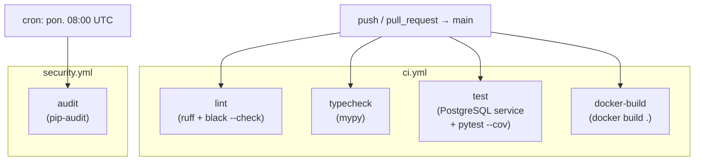

# Plan wdrożenia GitHub Actions

## Stack i wymagania CI

- Python **3.13**, Django 6.0.2, PostgreSQL **16-alpine**
- Narzędzia deweloperskie: `ruff`, `black`, `mypy`, `pytest-cov`, `pip-audit` (z `requirements-dev.txt`)
- Zależności systemowe WeasyPrint (z `Dockerfile`): `libcairo2`, `libpango-1.0-0`, `libpangoft2-1.0-0`, `libgdk-pixbuf-2.0-0`, `libffi-dev`, `shared-mime-info`, `fonts-dejavu-core`, `libpq-dev`, `gettext`
- Zewnętrzne integracje wyłączone w CI: `SMSAPI_USE_MOCK=1`, `HIDRIVE_USE_MOCK=1`, `CAPTCHA_VERIFY_SKIP=1`

## Architektura workflows




## Plik 1: `.github/workflows/ci.yml`

Triggers: `push` do `main`, `pull_request` do `main`.

**Job `lint`** (Ubuntu Latest, bez DB):

- `actions/checkout@v4`
- `actions/setup-python@v5` → Python 3.13
- `pip install ruff black`
- `ruff check .`
- `black --check .`

**Job `typecheck`** (Ubuntu Latest, bez DB):

- `actions/checkout@v4`
- `actions/setup-python@v5` → Python 3.13
- `pip install -r requirements-dev.txt`
- `mypy .`

**Job `test`** (Ubuntu Latest + PostgreSQL service):

PostgreSQL service:

```yaml
services:
  postgres:
    image: postgres:16-alpine
    env:
      POSTGRES_DB: cogitomedica
      POSTGRES_USER: cogito_user
      POSTGRES_PASSWORD: ci-password
    ports: ["5432:5432"]
    options: --health-cmd pg_isready --health-interval 5s --health-timeout 5s --health-retries 10
```

Kroki:

- `apt-get install` zależności systemowych WeasyPrint + `gettext`, `libpq-dev`
- `actions/setup-python@v5` → Python 3.13
- `pip install -r requirements-dev.txt`
- Ustawienie zmiennych środowiskowych (jako `env:` na poziomie joba — bez żadnych sekretów dla CI):
  - `SECRET_KEY`, `DB_*`, `ALLOWED_HOSTS`, `DJANGO_TIME_ZONE`, `PROMETHEUS_METRICS_TOKEN`, `SMSAPI_USE_MOCK=1`, `HIDRIVE_USE_MOCK=1`, `CAPTCHA_VERIFY_SKIP=1`, `PATIENT_RESULTS_OTP_PEPPER`
- `python manage.py migrate`
- `python manage.py load_default_translations`
- `python manage.py check_translations_completeness`
- `python -m pytest -q --tb=short --cov=. --cov-report=xml`
- `actions/upload-artifact@v4` → upload `coverage.xml`

**Job `docker-build`** (tylko `push`, nie PR, aby uniknąć podwójnych buildów):

- `actions/checkout@v4`
- `docker build .` (weryfikacja że `Dockerfile` się kompiluje)

## Plik 2: `.github/workflows/security.yml`

Triggers: `schedule: cron: '0 8 * * 1'` (poniedziałek 08:00 UTC), `workflow_dispatch`.

**Job `audit`**:

- `actions/setup-python@v5` → Python 3.13
- `pip install pip-audit`
- `pip-audit -r requirements.txt`

## Zmienne środowiskowe CI (bez sekretów)

Wszystkie wartości to bezpieczne placeholdery testowe — żadna zewnętrzna usługa nie jest wywoływana w CI:

- `SECRET_KEY: ci-secret-key-for-testing-only`
- `DB_HOST: localhost`, `DB_PORT: 5432`, `DB_NAME: cogitomedica`, `DB_USER: cogito_user`, `DB_PASSWORD: ci-password`
- `PATIENT_RESULTS_BASE_URL: http://localhost:8000`
- `PATIENT_RESULTS_OTP_PEPPER: ci-test-pepper`

## Struktura plików do utworzenia

- `[.github/workflows/ci.yml](.github/workflows/ci.yml)` — nowy plik
- `[.github/workflows/security.yml](.github/workflows/security.yml)` — nowy plik

