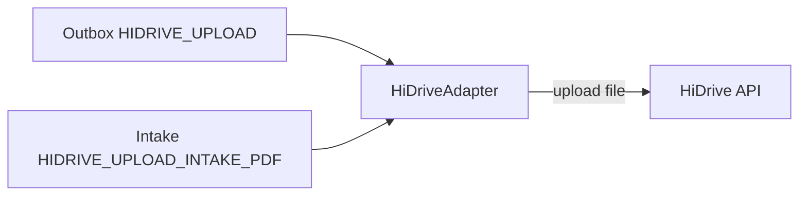

# Plan integracji z HiDrive

## Kontekst

- **Obecny stan:** W obu pipeline’ach outbox upload do HiDrive jest **mockiem** – ustawiane są tylko `hidrive_path`, `hidrive_sent`, `hidrive_sent_at` bez wysyłania pliku ([apps/outbox/services.py](apps/outbox/services.py) HIDRIVE_UPLOAD, [apps/intake/outbox_services.py](apps/intake/outbox_services.py) HIDRIVE_UPLOAD_INTAKE_PDF).
- **Ścieżki zdalne:** Zdefiniowane w [apps/outbox/hidrive_paths.py](apps/outbox/hidrive_paths.py) — Befund: `/patients/{patient_uuid}/Befund_v{version_no}.pdf`, intake: `/patients/{patient_uuid}/Intake_v{version_no}.pdf` (wspólny prefiks `HIDRIVE_PATIENTS_DIR_PREFIX`; bez `/hidrive/` w ścieżce logicznej).
- **Plik lokalny:** Befund – `version.pdf_local_path` (względny do `MEDIA_ROOT`); retencja i odczyt już używają `Path(settings.MEDIA_ROOT) / path` ([apps/outbox/services.py](apps/outbox/services.py) `_try_delete_file`).
- **Dokumentacja:** PRD Faza 3 – „Integracja z API HiDrive”; runbook [docs/runbooks/INTEGRATION_ERROR.md](docs/runbooks/INTEGRATION_ERROR.md) opisuje już 401/503 dla HiDrive; [.cursor/plans/plan-pdf-generation.plan.md](.cursor/plans/plan-pdf-generation.plan.md) wskazuje, że szczegóły uploadu to „osobny plan integracji HiDrive”.

HiDrive API (Strato): OAuth 2.0, endpoint `https://api.hidrive.strato.com/2.1/`, token w nagłówku `Authorization: Bearer <access_token>`, access token 1h, refresh token 60 dni (auto‑odnawialny). Rejestracja aplikacji (client_id/client_secret) – do 72h.

---

## Architektura docelowa

- Jeden **adapter HiDrive** w `apps/integrations`, używany z [apps/outbox/services.py](apps/outbox/services.py) i [apps/intake/outbox_services.py](apps/intake/outbox_services.py).
- Tryb **mock** pozostaje wybieralny (np. zmienna `HIDRIVE_USE_MOCK=1`), żeby nie wymagać OAuth w dev/CI.

---

## Zakres prac

### 1. Konfiguracja i OAuth2

- **Zmienne środowiskowe** (dodać do [.env.example](.env.example) i opisać w README / runbooku):
  - `HIDRIVE_USE_MOCK` – jeśli ustawione (np. 1), adapter nie wykonuje HTTP (obecne zachowanie).
  - `HIDRIVE_CLIENT_ID`, `HIDRIVE_CLIENT_SECRET` – z rejestracji w [HiDrive Developer](https://developer.hidrive.com/get-api-key/).
  - `HIDRIVE_REFRESH_TOKEN` – refresh token (typ „Server/Desktop”), uzyskany raz (OAuth2 code flow z ręczną autoryzacją w przeglądarce) i przechowywany w env/secrecie; używany do pobierania access tokena.
- W [cogitomedica/settings.py](cogitomedica/settings.py) dodać odczyt tych zmiennych (bez wartości domyślnych w prod gdy `HIDRIVE_USE_MOCK` wyłączony).
- **Odświeżanie tokena:** Access token 1h, refresh 60 dni. W adapterze (lub osobnym modułe `apps/integrations/hidrive/auth.py`): przed każdym requestem sprawdzić, czy access token jest ważny (np. zapisana data wygaśnięcia); jeśli nie – jednym requestem POST do `https://my.hidrive.com/oauth2/token` z `grant_type=refresh_token` i `refresh_token=...` uzyskać nowy access (i ewentualnie nowy refresh), zapisać w pamięci/cache. Nie logować tokenów (Sentry już filtruje `authorization`).

### 2. Adapter w `apps/integrations`

- **Interfejs (abstrakcja pod testy i mock):**
  - Metoda typu `upload(remote_path: str, local_path: Path) -> None` (lub `upload_bytes(remote_path, bytes)` – wtedy outbox sam odczytuje plik). Przyjęcie: `**upload(remote_path, local_path: Path)`** – adapter czyta plik z dysku; `local_path` już rozwiązywany przez wywołującego (MEDIA_ROOT + relative).
- **Implementacja realna:**
  - Użycie oficjalnej dokumentacji HiDrive (HTTP API Reference) do uploadu pliku – typowo PUT lub POST na endpoint typu `/2.1/file` z path w query/body (konkretna składnia z [HiDrive API](https://api.hidrive.strato.com/2.1/static/apidoc/index.html) / HTTP API Reference).
  - Przed requestem: uzyskać access token (własna logika refresh).
  - Nagłówek: `Authorization: Bearer <access_token>`.
  - W razie **401**: jednokrotna próba refresh tokena i ponowienie requestu; jeśli dalej 401 – wyjątek (np. `HiDriveAuthError`), outbox ustawi FAILED, runbook: „odnowienie tokena w panelu HiDrive lub zgłoszenie deweloperowi”.
  - **5xx / timeout:** rzucić wyjątek – outbox zrobi retry z backoff (istniejąca logika).
  - **4xx** (np. 409 konflikt ścieżki): zgodnie z semantyką API – nadpisać plik jeśli API to pozwala, w przeciwnym razie błąd (retry nie pomoże – możliwa eskalacja).
- **Implementacja mock** (gdy `HIDRIVE_USE_MOCK=1`): brak HTTP; zapis `remote_path` i ewentualnie symulacja opóźnienia; zwraca sukces. Zachowanie zgodne z obecnym kodem (tylko ustawienie pól w DB po stronie wywołującego).
- **Umiejscowienie:** np. `apps/integrations/hidrive/client.py` (klasa `HiDriveAdapter`) oraz `apps/integrations/hidrive/auth.py` (token refresh). Wywołanie z outbox: `from apps.integrations.hidrive.client import get_hidrive_adapter` (lub wstrzykiwanie zależności w testach).

### 3. Integracja w outbox – Befund (medical)

- W [apps/outbox/services.py](apps/outbox/services.py) w `_execute_event_internal`, przy `event.event_type == OutboxEventType.HIDRIVE_UPLOAD`:
  - Nie zmieniać logiki mock-failure do testów (`_maybe_raise_mock_failure`).
  - Jeśli mock: zachowanie jak dotąd (ustawienie `hidrive_path` z [build_befund_hidrive_path](apps/outbox/hidrive_paths.py), `hidrive_sent`, `hidrive_sent_at`).
  - Jeśli nie mock: rozwiązać pełną ścieżkę pliku: `full_path = Path(settings.MEDIA_ROOT) / version.pdf_local_path`; jeśli plik nie istnieje – wyjątek (FAILED, retry). Wywołać `adapter.upload(remote_path=build_befund_hidrive_path(version), local_path=full_path)`. Po sukcesie – ustawić `version.hidrive_path`, `hidrive_sent=True`, `hidrive_sent_at=now` i zapisać; następnie jak dotąd enqueue SMS_SEND (treść logistyczna: „Nowa dokumentacja w Cogito" – PRD 3.4a).
- Nie zmieniać kontraktu outbox (payload, event_type); zmiana tylko wewnątrz handlera.

### 4. Integracja w outbox – Intake PDF

- W [apps/intake/outbox_services.py](apps/intake/outbox_services.py) w obsłudze `HIDRIVE_UPLOAD_INTAKE_PDF`:
  - Analogicznie: przy mock – bez zmian; przy prawdziwym adapterze – `full_path = Path(settings.MEDIA_ROOT) / version.pdf_local_path`, `adapter.upload(remote_path=build_intake_hidrive_path(version, now=...), local_path=full_path)`, potem ustawienie `hidrive_path`, `hidrive_sent`, `hidrive_sent_at`.
- Użyć tego samego adaptera (jedna konfiguracja OAuth dla obu typów plików).

### 5. Obsługa błędów i observability

- **Błędy adaptera:** Wyjątki z adaptera (timeout, 5xx, 401 po nieudanym refresh) – nie łapać w adapterze; outbox zapisze je w `event.error_message` i ustawi FAILED/DEAD_LETTER (obecna logika). Runbook [INTEGRATION_ERROR](docs/runbooks/INTEGRATION_ERROR.md) już opisuje HiDrive 401/503 – ewentualnie doprecyzować „refresh token wygasł”.
- **Metryki:** Istniejące metryki w [apps/operations/metrics.py](apps/operations/metrics.py) i health w [apps/operations/api_views.py](apps/operations/api_views.py) opierają się na statusach outbox (HIDRIVE_UPLOAD PROCESSED/FAILED) – bez zmian. Opcjonalnie: licznik wywołań refresh tokena (np. `hidrive_token_refresh_total`) dla obserwacji.
- **Audit:** Obecne `create_audit_event` przy OUTBOX_EVENT_PROCESSED/FAILED już rejestruje zdarzenia – bez zmian.

### 6. Testy

- **Unit adaptera:**
  - Mock HTTP (responses/httpx): przy `HIDRIVE_USE_MOCK=1` – brak requestu, sukces.
  - Przy wyłączonym mocku – test z zamockowanym HTTP: request na właściwy URL z Bearer, body/query path; odpowiedź 200/201 → sukces; 401 → po refresh i drugim requeście 200 → sukces; 503 → wyjątek.
- **Outbox (Befund):** Istniejące testy w [apps/outbox/tests.py](apps/outbox/tests.py) (np. `test_process_outbox_events_runs_full_chain`) ustawiają prawdopodobnie env; zapewnić `HIDRIVE_USE_MOCK=1` w CI/teście, żeby nie wymagać HiDrive. Opcjonalnie: test integracyjny z zamockowanym adapterem (patch `get_hidrive_adapter` na fake, który zapisuje wywołania) – asercja `upload(remote_path=..., local_path=...)` z poprawną ścieżką.
- **Intake:** Analogicznie w [apps/intake/tests.py](apps/intake/tests.py) – test z mockiem HiDrive (lub patch adaptera), sprawdzenie że po procesie `hidrive_sent` i `hidrive_path` są ustawione.

### 7. Dokumentacja

- **[.env.example](.env.example):** Dodać komentarze dla `HIDRIVE_USE_MOCK`, `HIDRIVE_CLIENT_ID`, `HIDRIVE_CLIENT_SECRET`, `HIDRIVE_REFRESH_TOKEN`.
- **README:** Krótka wzmianka w sekcji konfiguracji (HiDrive Faza 3: opcjonalnie wyłączenie mocka i ustawienie credentials; link do HiDrive Developer).
- **Runbook [INTEGRATION_ERROR](docs/runbooks/INTEGRATION_ERROR.md):** Uzupełnić punkt 401: „Jeśli po odświeżeniu tokena nadal 401 – refresh token mógł wygasnąć; uzyskać nowy (OAuth2 code flow) i zaktualizować HIDRIVE_REFRESH_TOKEN”.
- **[.ai/api-plan.md](.ai/api-plan.md) / [.ai/api-plan-pl.md](.ai/api-plan-pl.md):** Krótki opis logicznych ścieżek HiDrive przy sekcji outbox (ścieżki plików vs. REST); flagi `hidrive_sent` / `hidrive_path` bez zmian.

---

## Kolejność wdrożenia

1. Konfiguracja: zmienne w settings, .env.example, walidacja (np. przy wyłączonym mocku wymagane client_id, client_secret, refresh_token).
2. Moduł OAuth2: odświeżanie tokena w `apps/integrations/hidrive/auth.py`, bez zapisu tokenów do logów.
3. Adapter: interfejs + implementacja mock (HIDRIVE_USE_MOCK) + implementacja real (HTTP upload według HiDrive API).
4. Podłączenie w [apps/outbox/services.py](apps/outbox/services.py) (Befund) z rozwiązywaniem ścieżki i wywołaniem `upload`.
5. Podłączenie w [apps/intake/outbox_services.py](apps/intake/outbox_services.py) (intake PDF).
6. Testy jednostkowe adaptera i testy outbox/intake z mockiem.
7. Aktualizacja runbooka i README/.env.example.

---

## Ryzyka i ustalenia

- **Rejestracja aplikacji HiDrive:** Do 72h; potrzebna przed testami z prawdziwym API. Do tego czasu i w CI obowiązuje `HIDRIVE_USE_MOCK=1`.
- **Refresh token:** Wymaga jednorazowego OAuth2 code flow (przeglądarka). Dokumentacja HiDrive: Server/Desktop – code → exchange → refresh_token; przechowywanie tylko refresh_token w env.
- **Ścieżki HiDrive:** Konwencja z kodu — `/patients/{uuid}/…` dla PDF z aplikacji; PDF z labu listowane z `HIDRIVE_INCOMING_PATH` (domyślnie `/incoming/`); po publikacji przeniesienie do `HIDRIVE_PROCESSED_PATH` (domyślnie `/processed/`). Adapter normalizuje ścieżki względem konta API (`/users/{alias}/…`).
- **Intake i retencja:** Intake PDF ma własny pipeline i własne pole `pdf_local_path`; retencja dla intake (jeśli będzie) – osobna decyzja; ten plan nie zmienia retencji, tylko realizuje upload do HiDrive dla obu typów plików.

