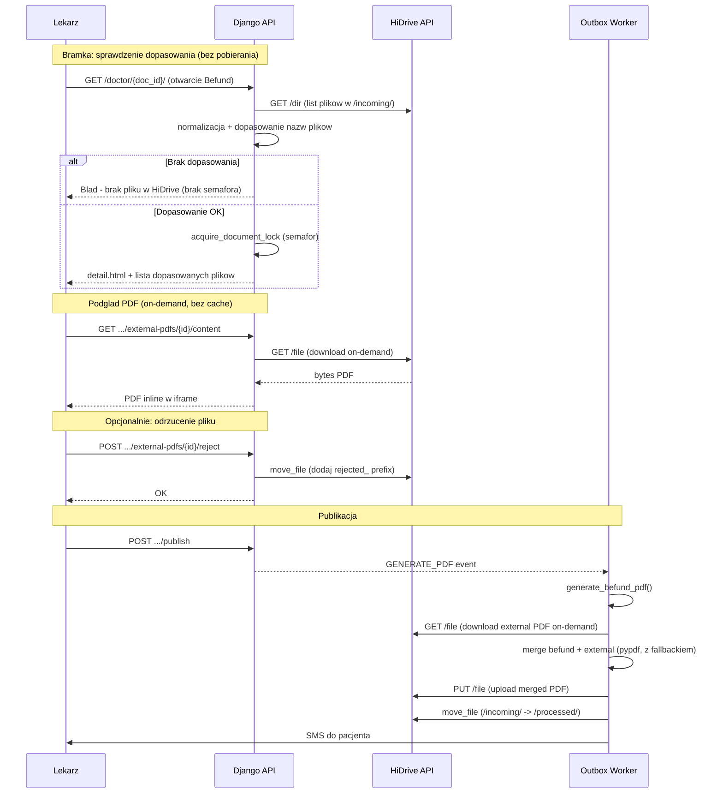

# Plan: Pobieranie PDF z HiDrive i scalanie z Befund

## Stan aktualny

- HiDrive jest zintegrowany **tylko jako upload** — system generuje PDF Befundu (WeasyPrint), uploaduje go do `/patients/{patient_id}/Befund_v{N}.pdf` ([apps/outbox/hidrive_paths.py](apps/outbox/hidrive_paths.py)), a następnie wysyła SMS z linkiem do portalu pacjenta.
- Klient HiDrive ([apps/integrations/hidrive/client.py](apps/integrations/hidrive/client.py)) obsluguje wylacznie `PUT /file` (upload), `GET /user/me` i `POST /dir`.
- **Brak** metod `download`, `list_dir`, `move_file` w kliencie HiDrive.
- **Brak** scalania PDF (brak pypdf w [requirements.txt](requirements.txt)).
- Widok Befund ([templates/doctor/detail.html](templates/doctor/detail.html)) nie wyswietla zadnych zewnetrznych plikow PDF.
- Istniejacy mechanizm semafora (document lock) w [apps/medical/services.py](apps/medical/services.py) gwarantuje, ze nad jednym dokumentem pracuje dokladnie jeden uzytkownik.

## Konwencja plikow i struktura folderow HiDrive

Recepcja kliniki wrzuca pliki PDF bezposrednio do folderu `/incoming/` na HiDrive. **Bez podfolderow.**

### Struktura folderow na HiDrive

Katalogi logiczne na **tym samym poziomie** (bez podfolderu `hidrive` w ścieżce aplikacji):

```
/incoming/          <- pliki do przetworzenia (PDF z laboratorium)
  Kowalski_Jan.pdf
  Kowalski_Jan_1985_03_12.pdf
  Mueller_Anna_1990_07_22.pdf
  rejected_Kowalski_Jan.pdf  <- odrzucony przez lekarza, ignorowany

/patients/          <- PDF wygenerowane przez aplikację (Befund / intake)
  {patient_uuid}/
    Befund_v1.pdf
    Intake_v1.pdf

/processed/         <- przetworzone pliki (po scaleniu z Befund)
  Kowalski_Jan_1985_03_12.pdf
```

- `/incoming/` — pliki czekające na przetworzenie. System czyta z tego folderu.
- `/patients/{uuid}/` — zapis `Befund_v{N}.pdf` / `Intake_v{N}.pdf` po stronie outboxu.
- `/processed/` — pliki przeniesione po udanym scaleniu i publikacji. System pisze do tego folderu. **Portal pacjenta NIE ma dostepu do /processed/** -- zabezpieczenie przed wyciekiem danych.
- Pliki z przedrostkiem `rejected_` sa **ignorowane** przez algorytm dopasowania.

### Konwencja nazw plikow

Nazwa pliku PDF musi odpowiadac jednemu z wariantow (case-insensitive, separator `_` wszedzie, rowniez w dacie):

1. `Imie_Nazwisko.pdf` (np. `Jan_Kowalski.pdf`)
2. `Nazwisko_Imie.pdf` (np. `Kowalski_Jan.pdf`)
3. `Imie_Nazwisko_RRRR_MM_DD.pdf` (np. `Jan_Kowalski_1985_03_12.pdf`)
4. `Nazwisko_Imie_RRRR_MM_DD.pdf` (np. `Kowalski_Jan_1985_03_12.pdf`)

Wiele plikow dla jednego pacjenta: `Kowalski_Jan_1985_03_12.pdf`, `Kowalski_Jan_1985_03_12_2.pdf`.

### Normalizacja diakrytykow (RODO-safe matching)

**Krytyczne**: Pliki na HiDrive beda najczesciej BEZ znakow diakrytycznych (Mueller, Kowalski), natomiast dane pacjentow w bazie MAJA znaki diakrytyczne (Muller, Kowalska). Dlatego przed dopasowaniem:

1. Normalizacja Unicode NFKD + usuniecie combining marks: `Muller` -> `Muller`, `Kowalska-Nowak` -> `Kowalska-Nowak`
2. Zamiana mylnikow na podkreslenia: `Kowalska-Nowak` -> `Kowalska_Nowak`
3. Case-insensitive (lowercase)
4. Strip bialych znakow

Normalizacja stosowana jest zarowno do danych pacjenta z bazy, jak i do nazw plikow z HiDrive.

```python
import unicodedata

def normalize_name(name: str) -> str:
    nfkd = unicodedata.normalize("NFKD", name)
    ascii_stripped = "".join(c for c in nfkd if not unicodedata.combining(c))
    return ascii_stripped.strip().replace("-", "_").replace(" ", "_").lower()
```

### Algorytm dopasowania -- SCISLE (nie prefixowe!)

**Zabezpieczenie RODO**: Dopasowanie jest **scisle** (exact match po normalizacji), NIE prefixowe. Plik `Kowalski_Jan_wyniki_brata.pdf` **NIE** zostanie dopasowany do pacjenta Jan Kowalski, poniewaz stem `kowalski_jan_wyniki_brata` != `kowalski_jan`.

Wyjatki od scislosci:
- Pliki z sufiksem `_N` (gdzie N to cyfra/cyfry): `Kowalski_Jan_1985_03_12_2.pdf` -- stem `kowalski_jan_1985_03_12_2` dopasowany do kandydata `kowalski_jan_1985_03_12` + regex `_\d+$` na reszte.

### Obsluga kolizji

- Warianty z data urodzenia maja **wyzszy priorytet**.
- Jesli plik bez daty pasuje do wiecej niz jednego pacjenta w bazie -- system **nie dopasowuje** i wyswietla lekarzowi komunikat: "Niejednoznaczne dopasowanie -- prosimy recepcje o dodanie daty urodzenia do nazwy pliku".
- **Petla zwrotna**: Lekarz widzi brak dopasowania PRZED rozpoczeciem pracy (bramka), wiec moze natychmiast skontaktowac sie z recepcja.

## Architektura rozwiazania



## Kluczowe zasady projektowe

### Brak lokalnego cache (eliminacja wyciekow dyskowych i stalych danych)

System **NIE trzyma** plikow z HiDrive na dysku lokalnym. Pliki sa pobierane **on-demand**:

- **Podglad lekarza**: `download()` z HiDrive -> stream do przegladarki. Brak zapisu na dysk.
- **Merge przy publikacji**: `download()` -> bytes w pamieci -> merge z Befund -> zapis scalonego PDF. Zrodlowy plik z HiDrive nie jest zapisywany.

Korzysci:
- Brak problemow z aktualizacja plikow (recepcja nadpisuje plik na HiDrive -- lekarz zawsze widzi najnowsza wersje).
- Brak wyciekow dyskowych -- jedyny zapisywany plik to scalony Befund.
- Brak race conditions na plikach lokalnych.

### Bramka przed Befund (gate)

Przed otwarciem formularza Befund, system:
1. Wywoluje `list_dir(/incoming/)`.
2. Uruchamia algorytm dopasowania (normalizacja + scisle porownanie).
3. **Jesli brak dopasowania** -- lekarz widzi komunikat bledu, semafor NIE jest zakladany, formularz sie nie otwiera.
4. **Jesli dopasowanie OK** -- semafor zakladany, formularz otwarty.

To daje **petle zwrotna**: lekarz natychmiast wie, ze recepcja nie wrzucila pliku lub nazwa jest bledna.

### Odrzucanie plikow przez lekarza

Lekarz moze odrzucic blednie dopasowany plik. Akcja:
1. API wywoluje `move_file` na HiDrive: zmiana nazwy z `Kowalski_Jan.pdf` na `rejected_Kowalski_Jan.pdf`.
2. Rekord `ExternalPdfAttachment` dostaje `status=REJECTED`.
3. Plik z prefixem `rejected_` jest ignorowany przez algorytm dopasowania.
4. Recepcja widzi plik z prefixem `rejected_` i wie, ze wymaga korekty.

### Przenoszenie przetworzonych plikow (retencja /incoming/)

Po udanym scaleniu, uploadzie i wyslaniu SMS:
1. Outbox worker wywoluje `move_file` na HiDrive: `/incoming/Kowalski_Jan.pdf` -> `/processed/Kowalski_Jan.pdf`.
2. Folder `/incoming/` nie rosnie w nieskonczonosc.
3. `/processed/` sluzy jako archiwum -- portal pacjenta NIE ma dostepu.

### Fallback przy bledzie scalania PDF

Jesli `merge_pdfs()` rzuci wyjatek (uszkodzony PDF, niekompatybilne czcionki, podpisy cyfrowe):
1. System zapisuje **sam Befund** (bez scalonego pliku) jako `pdf_local_path`.
2. Publikacja przechodzi dalej (pacjent dostaje przynajmniej Befund).
3. `ExternalPdfAttachment.status` = `MERGE_FAILED`.
4. Audit event `EXTERNAL_PDF_MERGE_FAILED` z `error_message`.
5. Lekarz/admin jest informowany o bledzie (widoczne w panelu admina).
6. Plik NIE jest przenoszony do `/processed/` -- pozostaje w `/incoming/` do ponownej proby.

### Obsluga czesciowych plikow (upload w trakcie)

Ryzyko: recepcja uploaduje duzy plik, lekarz otwiera Befund w trakcie uploadu.
Zabezpieczenie: przy `download()` on-demand system waliduje pobrany plik:
- Sprawdza, czy PDF jest poprawny (`PdfReader` nie rzuca wyjatku).
- Jesli plik jest uszkodzony/niekompletny, traktuje go jak brak pliku i wyswietla komunikat: "Plik moze byc w trakcie uploadu -- prosze sprobowac za chwile".

### Utrata metadanych przy scalaniu PDF

Scalanie PDF niszczy podpisy cyfrowe (staja sie niewazne po dodaniu stron). Zabezpieczenia:
- `pypdf.PdfWriter` uzyty w trybie czystym -- NIE klonujemy document root ze zrodlowego PDF.
- Nie obiecujemy zachowania podpisow/zakladek -- dokumentacja jasno informuje, ze scalony PDF to nowy dokument.
- Testy z przykladowymi plikami z rzeczywistych laboratoriow (rozne czcionki, formaty stron, osadzone obrazy).

## Zmiany w kodzie

### 1. HiDrive Client -- dodanie `download`, `list_dir`, `move_file`

Plik: [apps/integrations/hidrive/client.py](apps/integrations/hidrive/client.py)

- `download(remote_path) -> bytes` -- `GET {base}/file?path=...`. Retry przy 401.
- `list_dir(remote_path) -> list[dict]` -- `GET {base}/dir?path=...&members=file&fields=name,size,mtime`. Zwraca liste plikow (nie folderow).
- `move_file(source_path, dest_path)` -- `PATCH {base}/file?path=...` z JSON `{"path": dest_path}` (HiDrive API rename/move). Uzywane do przenoszenia do `/processed/` i dodawania prefixu `rejected_`.
- Rozszerzyc `HiDriveAdapterProtocol` o te 3 metody.
- Rozszerzyc `_MockHiDriveAdapter` o wersje mock.
- Obsluga 401 z retry (jak w `upload`).

### 2. Modul normalizacji nazw

Nowy plik: `apps/medical/name_normalize.py`

```python
import re
import unicodedata

def normalize_name(name: str) -> str:
    """Normalizacja imienia/nazwiska: NFKD, strip diakrytykow, lowercase, _ jako separator."""
    nfkd = unicodedata.normalize("NFKD", name)
    ascii_only = "".join(c for c in nfkd if not unicodedata.combining(c))
    return ascii_only.strip().replace("-", "_").replace(" ", "_").lower()

def build_patient_filename_candidates(patient) -> list[str]:
    """4 warianty znormalizowanej nazwy pliku (bez .pdf) dla pacjenta."""
    first = normalize_name(patient.first_name)
    last = normalize_name(patient.last_name)
    dob = patient.date_of_birth.isoformat() if patient.date_of_birth else None
    candidates = [f"{first}_{last}", f"{last}_{first}"]
    if dob:
        dob_us = dob.replace("-", "_")
        candidates += [f"{first}_{last}_{dob_us}", f"{last}_{first}_{dob_us}"]
    return candidates

def match_filename_to_candidates(filename_stem: str, candidates: list[str]) -> bool:
    """Scisle dopasowanie (exact lub exact + _N sufiks)."""
    norm = normalize_name(filename_stem)
    for c in candidates:
        if norm == c:
            return True
        if re.fullmatch(re.escape(c) + r"_\d+", norm):
            return True
    return False
```

### 3. Nowy model: `ExternalPdfAttachment`

Plik: [apps/medical/models.py](apps/medical/models.py) (+ migracja)

```python
class ExternalPdfStatus(models.TextChoices):
    MATCHED = "MATCHED"       # dopasowany
    ACCEPTED = "ACCEPTED"     # lekarz zaakceptowal (implicit przy publish)
    REJECTED = "REJECTED"     # lekarz odrzucil -- plik dostaje prefix rejected_
    MERGE_FAILED = "MERGE_FAILED"  # scalanie nie powiodlo sie

class ExternalPdfAttachment(models.Model):
    id = UUIDField(primary_key=True, default=uuid.uuid4)
    medical_document = ForeignKey(MedicalDocument, related_name="external_pdfs")
    hidrive_remote_path = CharField(max_length=500)  # sciezka w /incoming/
    original_filename = CharField(max_length=255)
    status = CharField(max_length=20, choices=ExternalPdfStatus.choices,
                       default=ExternalPdfStatus.MATCHED)
    created_at = DateTimeField(auto_now_add=True)
```

**Brak** `local_cache_path` -- pliki NIE sa cachowane lokalnie. Pobierane on-demand z HiDrive.

### 4. Serwis zewnetrznych PDF

Nowy plik: `apps/medical/external_pdf_service.py`

- `check_external_pdf_gate(patient) -> GateResult`:
  - Wywoluje `list_dir(/incoming/)`.
  - Filtruje pliki z prefixem `rejected_`.
  - Normalizuje nazwy i dopasowuje do pacjenta (scisle).
  - Sprawdza kolizje (plik bez daty pasuje do >1 pacjenta w bazie).
  - Zwraca `GateResult(passed=True/False, matched_files=[...], error_message=...)`.
  - **Nie pobiera plikow** -- tylko sprawdza istnienie.

- `create_attachment_records(medical_document, matched_files) -> list[ExternalPdfAttachment]`:
  - Tworzy rekordy `ExternalPdfAttachment` (status=MATCHED) dla dopasowanych plikow.
  - Idempotentne -- nie duplikuje rekordow dla tej samej sciezki.

- `download_external_pdf(attachment) -> bytes`:
  - Pobiera plik on-demand z HiDrive.
  - Waliduje, czy pobrany plik jest poprawnym PDF (`PdfReader` test).
  - Rzuca `ExternalPdfCorruptError` jesli plik uszkodzony/niekompletny.

- `reject_external_pdf(attachment)`:
  - Wywoluje `move_file` na HiDrive: dodaje prefix `rejected_` do nazwy pliku.
  - Aktualizuje `attachment.status = REJECTED` i `hidrive_remote_path`.

### 5. Bramka w widoku lekarza

Plik: [cogitomedica/doctor_views.py](cogitomedica/doctor_views.py) -- `doctor_document_detail_view`

Zmodyfikowac flow otwarcia Befund:

```python
# PRZED acquire_document_lock:
gate = check_external_pdf_gate(patient)
if not gate.passed:
    return _render_doctor(request, "doctor/error.html", {
        "message": gate.error_message,  # np. "Brak pliku w HiDrive" lub "Niejednoznaczne dopasowanie"
        "ui": ui, "lang": lang,
    }, status=422)

# Dopiero teraz semafor:
granted, lock_holder = acquire_document_lock(...)
if not granted:
    ...

# Tworzenie rekordow attachment:
create_attachment_records(doc, gate.matched_files)
```

Semafor NIE jest zakladany jesli bramka nie przepuszcza.

### 6. API endpoints dla lekarza

Plik: [apps/medical/api_views.py](apps/medical/api_views.py)

- `GET .../external-pdfs` -- lista dopasowanych PDF (z rekordow `ExternalPdfAttachment`). Zwraca `[{id, filename, status}]`.
- `GET .../external-pdfs/{id}/content` -- **on-demand download** z HiDrive, serwuje inline. Nie zapisuje na dysk. Jesli plik uszkodzony -> 422 z komunikatem "Plik moze byc w trakcie uploadu".
- `POST .../external-pdfs/{id}/reject` -- odrzucenie pliku (rename na HiDrive + status REJECTED).

### 7. UI lekarza

Plik: [templates/doctor/detail.html](templates/doctor/detail.html)

- Sekcja **nad formularzem Befund**:
  - Lista dopasowanych plikow z HiDrive (nazwa, status).
  - Klikniecie na plik -> podglad w `<iframe>` (endpoint content, on-demand).
  - Przycisk **"Odrzuc plik"** per plik -> POST reject.
  - Komunikat statusu: "Plik dopasowany", "Odrzucony", "Blad scalania".

Plik: [static/doctor/js/befund-form.js](static/doctor/js/befund-form.js)

- `fetch()` do endpointu `external-pdfs` po zaladowaniu.
- Renderowanie listy + iframe + przycisk reject.

### 8. Scalanie PDF -- z fallbackiem

Dodac do [requirements.txt](requirements.txt): `pypdf>=4.0`

Nowy plik: `apps/medical/pdf_merge.py`

```python
from pypdf import PdfReader, PdfWriter
from io import BytesIO
import logging

logger = logging.getLogger(__name__)

def merge_pdfs(befund_pdf_bytes: bytes, external_pdf_bytes_list: list[bytes]) -> bytes:
    """Scalanie Befund + zewnetrzne PDFy. Rzuca wyjatek jesli scalanie niemozliwe."""
    writer = PdfWriter()
    reader = PdfReader(BytesIO(befund_pdf_bytes))
    for page in reader.pages:
        writer.add_page(page)
    for ext_bytes in external_pdf_bytes_list:
        ext_reader = PdfReader(BytesIO(ext_bytes))
        for page in ext_reader.pages:
            writer.add_page(page)
    output = BytesIO()
    writer.write(output)
    return output.getvalue()

def safe_merge_pdfs(befund_pdf_bytes: bytes, external_pdf_bytes_list: list[bytes]) -> tuple[bytes, bool]:
    """Merge z fallbackiem. Zwraca (pdf_bytes, merge_succeeded).
    Jesli merge sie nie uda, zwraca sam Befund."""
    try:
        merged = merge_pdfs(befund_pdf_bytes, external_pdf_bytes_list)
        return merged, True
    except Exception:
        logger.exception("PDF merge failed, falling back to Befund-only PDF")
        return befund_pdf_bytes, False
```

### 9. Modyfikacja pipeline GENERATE_PDF

Plik: [apps/medical/pdf_builder.py](apps/medical/pdf_builder.py)

Zmodyfikowac `generate_befund_pdf()`:

```python
def generate_befund_pdf(version: MedicalDocumentVersion) -> tuple[str, str]:
    befund_bytes = build_befund_pdf_bytes(version)

    attachments = ExternalPdfAttachment.objects.filter(
        medical_document=version.medical_document,
        status=ExternalPdfStatus.MATCHED,  # nie REJECTED
    )
    external_bytes_list = []
    for att in attachments:
        try:
            ext_bytes = download_external_pdf(att)
            external_bytes_list.append((att, ext_bytes))
        except ExternalPdfCorruptError:
            att.status = ExternalPdfStatus.MERGE_FAILED
            att.save(update_fields=["status"])
            # audit event

    if external_bytes_list:
        final_bytes, merge_ok = safe_merge_pdfs(
            befund_bytes, [b for _, b in external_bytes_list]
        )
        if not merge_ok:
            for att, _ in external_bytes_list:
                att.status = ExternalPdfStatus.MERGE_FAILED
                att.save(update_fields=["status"])
            # audit event EXTERNAL_PDF_MERGE_FAILED
    else:
        final_bytes = befund_bytes

    # Zapis jak dotychczas...
    full_path.write_bytes(final_bytes)
    checksum = hashlib.sha256(final_bytes).hexdigest()
    return relative_str, checksum
```

### 10. Przenoszenie do /processed/ po sukcesie

Plik: [apps/outbox/services.py](apps/outbox/services.py) -- po `HIDRIVE_UPLOAD`

Po udanym uploadzie scalonego PDF i PRZED enqueue SMS:
```python
for att in ExternalPdfAttachment.objects.filter(
    medical_document=version.medical_document,
    status=ExternalPdfStatus.MATCHED,
):
    adapter.move_file(
        source_path=att.hidrive_remote_path,
        dest_path=att.hidrive_remote_path.replace("/incoming/", "/processed/"),
    )
    att.status = ExternalPdfStatus.ACCEPTED
    att.save(update_fields=["status"])
```

Pliki z `MERGE_FAILED` NIE sa przenoszone -- zostaja w `/incoming/` do recznej interwencji.

### 11. Preview PDF z zewnetrznymi (obowiazkowy przed publikacja)

Plik: [apps/medical/api_views.py](apps/medical/api_views.py) -- endpoint `preview-pdf`

Zmodyfikowac preview aby pobieralo zewnetrzne PDFy on-demand i scalo z Befundem na zywo. Lekarz widzi finalny wynik przed publikacja. Jesli merge sie nie uda -- preview pokazuje sam Befund + komunikat o bledzie.

**Obowiazkowy podglad**: Przycisk "Opublikuj" jest zablokowany do momentu, az lekarz uzyje "Preview PDF" przynajmniej raz (po ostatnim zapisie draftu). Chroni to przed sytuacja, w ktorej fallback `safe_merge_pdfs` wyslalby pacjentowi sam Befund bez zalacznikow -- lekarz MUSI zobaczyc scalony dokument na wlasne oczy. Implementacja: flaga JS `previewSeenSinceLastSave`, reset przy kazdym save/draft, set przy uzyciu preview. Przycisk publish disabled gdy `!previewSeenSinceLastSave`.

### 12. Testy

**Normalizacja i dopasowanie:**
- `normalize_name()`: diakrytyki niemieckie (Muller->Muller, Konig->Konig, Strasse->Strasse, Grossmann->Grossmann), polskie (Sliwka->Sliwka, Zolnierz->Zolnierz, Swiatek->Swiatek), umlauts (a->a, o->o, u->u, ss->ss), mylniki (`Kowalska-Nowak`->`kowalska_nowak`), spacje (`Kowalski Jan`->`kowalski_jan`), case, puste stringi, wielokrotne spacje/podkreslenia.
- `build_patient_filename_candidates()`: 4 warianty, z/bez daty, poprawna zamiana `-` na `_` w dacie.
- `match_filename_to_candidates()`:
  - Exact match: `kowalski_jan` == `kowalski_jan` -> True
  - Sufiks `_2`: `kowalski_jan_1985_03_12_2` matches `kowalski_jan_1985_03_12` -> True
  - Dodatkowy tekst NIE pasuje (RODO): `kowalski_jan_wyniki_brata` != `kowalski_jan` -> False
  - Prefix `rejected_` ignorowany przez algorytm
  - Spacje w nazwie pliku: `Kowalski Jan.pdf` -> normalizacja -> `kowalski_jan` -> match
  - Pacjent z cyfra w nazwisku (edge case): jezeli nazwisko zawiera cyfre, testy pokrywaja ten przypadek
  - Zachlannosc regex: `kowalski_jan_2` vs pacjent "Jan Kowalski" (match) vs pacjent "Jan Kowalski 2" (tez match -- ale to kolizja, wiec system ja wykrywa)

**Kolizje:**
- 2 pacjentow o tym samym imieniu/nazwisku, plik bez daty -> brak dopasowania + komunikat
- 2 pacjentow o tym samym imieniu/nazwisku, plik z data -> dopasowanie do wlasciwego
- Pacjent z podwojnym nazwiskiem vs prosty (Kowalska_Nowak vs Kowalska)

**Scalanie PDF:**
- Happy path: Befund + 1 zewnetrzny PDF -> poprawny scalony PDF.
- Wiele zewnetrznych PDF: Befund + 3 pliki -> poprawna kolejnosc stron.
- Uszkodzony PDF -> `safe_merge_pdfs` fallback do Befund-only + `merge_succeeded=False`.
- PDF z osadzonymi czcionkami (Type1, TrueType, CIDFont) -> brak krzaczkow po scaleniu.
- PDF z roznymi rozmiarami stron (A4, Letter, A3) -> poprawne scalenie.
- PDF zabezpieczony haslem -> wyjatek -> fallback.
- Pusty PDF (0 stron) -> wyjatek -> fallback.
- PDF z formularzami / annotacjami -> scalenie bez utraty czytelnosci.

**Bramka i flow:**
- Brak pliku w /incoming/ -> 422, brak semafora.
- Kolizja -> 422, brak semafora.
- Dopasowanie OK -> 200 + semafor + rekordy ExternalPdfAttachment.
- Reject: rename na HiDrive, status REJECTED, plik nie pasuje ponownie.
- Walidacja pobranego PDF (niekompletny upload -> ExternalPdfCorruptError).

**URL encoding (spacje w nazwach plikow):**
- Download pliku z HiDrive ze spacja w nazwie (`Kowalski Jan.pdf`) -> poprawne URL encoding w `requests.get(params=...)`.
- Move pliku ze spacja -> poprawne URL encoding.

**Pipeline e2e:**
- Publish -> download on-demand -> merge -> upload merged -> move to /processed/ -> SMS.
- Publish -> download -> merge FAIL -> upload Befund-only -> audit event `EXTERNAL_PDF_MERGE_FAILED` -> plik NIE przeniesiony do /processed/.
- Publish -> download -> ExternalPdfCorruptError -> fallback -> audit event.

### 13. Dokumentacja

Plik: `docs/manual/` (nowy rozdzial)

Instrukcja dla recepcji:
- Jak wrzucac pliki PDF do `/incoming/` -- bezposrednio, bez podfolderow.
- Dozwolone formaty nazw: `Nazwisko_Imie.pdf`, `Imie_Nazwisko.pdf`, `Nazwisko_Imie_RRRR_MM_DD.pdf`, `Imie_Nazwisko_RRRR_MM_DD.pdf`.
- Separator `_` wszedzie (takze w dacie). BEZ znakow diakrytycznych w nazwie pliku.
- Kiedy dodac date urodzenia (kolizja imion -- lekarz zglasza problem).
- Co oznacza prefix `rejected_` (plik odrzucony przez lekarza, wymaga korekty nazwy).
- Folder `/processed/` -- pliki przeniesione po udanej publikacji, nie ruszac.
- Wiele plikow dla jednego pacjenta: dodac sufiks `_2`, `_3` itd.
