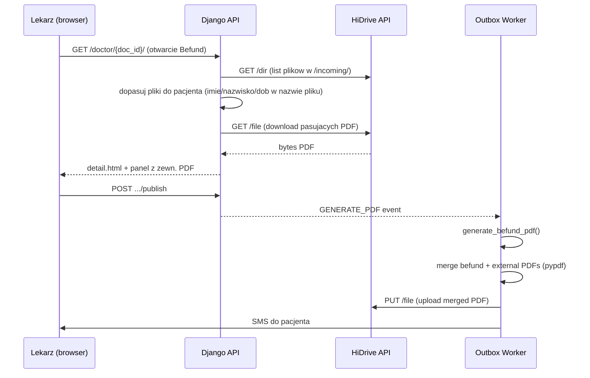

# Plan: Pobieranie PDF z HiDrive i scalanie z Befund

## Stan aktualny

- HiDrive jest zintegrowany **tylko jako upload** -- system generuje PDF Befundu (WeasyPrint), uploaduje go do `/hidrive/patients/{patient_id}/Befund_v{N}.pdf`, a nastepnie wysyla SMS z linkiem do portalu pacjenta.
- Klient HiDrive ([apps/integrations/hidrive/client.py](apps/integrations/hidrive/client.py)) obsluguje wylacznie `PUT /file` (upload), `GET /user/me` i `POST /dir`.
- **Brak** metod `download` i `list_dir` w kliencie HiDrive.
- **Brak** scalania PDF (brak pypdf/PyPDF2 w [requirements.txt](requirements.txt)).
- Widok Befund ([templates/doctor/detail.html](templates/doctor/detail.html)) nie wyswietla zadnych zewnetrznych plikow PDF.

## Konwencja plikow w folderze wspolnym

Recepcja kliniki wrzuca pliki PDF bezposrednio do folderu `/hidrive/incoming/` na HiDrive (np. przez WebDAV / interfejs HiDrive). **Bez podfolderow** -- kazdy plik to osobny PDF nazwany wg konwencji.

### Struktura

```
/hidrive/incoming/
  Kowalski_Jan.pdf
  Kowalski_Jan_1985_03_12.pdf
  Mueller_Anna_1990_07_22.pdf
```

### Konwencja nazw plikow

Nazwa pliku PDF musi odpowiadac jednemu z wariantow (case-insensitive, separator `_` wszedzie, rowniez w dacie):

1. `Imie_Nazwisko.pdf` (np. `Jan_Kowalski.pdf`)
2. `Nazwisko_Imie.pdf` (np. `Kowalski_Jan.pdf`)
3. `Imie_Nazwisko_RRRR_MM_DD.pdf` (np. `Jan_Kowalski_1985_03_12.pdf`)
4. `Nazwisko_Imie_RRRR_MM_DD.pdf` (np. `Kowalski_Jan_1985_03_12.pdf`)

### Algorytm dopasowania

System wywoluje `list_dir(/hidrive/incoming/)` i dopasowuje **nazwy plikow** (bez rozszerzenia) do pacjenta:

- Warianty z data urodzenia maja **wyzszy priorytet** (scislejsze dopasowanie).
- Jesli plik bez daty pasuje do wiecej niz jednego pacjenta w bazie (kolizja imie+nazwisko), system **nie przypisuje** pliku i wyswietla lekarzowi komunikat z prosba o dopisanie daty urodzenia do nazwy pliku na HiDrive.
- Jeden pacjent moze miec wiele pasujacych plikow (np. `Kowalski_Jan_1985-03-12.pdf`, `Kowalski_Jan_1985-03-12_2.pdf`).

### Obsluga kolizji

Gdy recepcja napotka problem z dopasowaniem, dopisuje date urodzenia pacjenta do nazwy pliku na HiDrive, co rozwiazuje kolizje.

### Dokumentacja

Nalezy opisac te strategie w dokumentacji systemu ([docs/manual/](docs/manual/)) -- instrukcja dla recepcji dot. nazewnictwa plikow na HiDrive, dozwolone formaty, jak postepowac przy kolizji imion.

## Architektura rozwiazania



## Zmiany w kodzie

### 1. HiDrive Client -- dodanie `download` i `list_dir`

Plik: [apps/integrations/hidrive/client.py](apps/integrations/hidrive/client.py)

- Dodac metode `download(remote_path) -> bytes` -- `GET {base}/file?path=...` z `Authorization: Bearer`.
- Dodac metode `list_dir(remote_path) -> list[dict]` -- `GET {base}/dir?path=...&members=file&fields=name,size,mtime` do listowania plikow w folderze.
- Rozszerzyc `HiDriveAdapterProtocol` o te metody.
- Rozszerzyc `_MockHiDriveAdapter` o wersje mock (zwracajace puste listy / przykladowe bytes).
- Obsluga 401 z retry (jak w `upload`).

### 2. Nowy model: `ExternalPdfAttachment`

Plik: [apps/medical/models.py](apps/medical/models.py) (+ migracja)

```python
class ExternalPdfAttachment(models.Model):
    id = UUIDField(primary_key=True)
    medical_document = ForeignKey(MedicalDocument, related_name="external_pdfs")
    hidrive_remote_path = CharField(max_length=500)
    original_filename = CharField(max_length=255)
    local_cache_path = CharField(max_length=500, blank=True, null=True)
    file_size_bytes = IntegerField(blank=True, null=True)
    downloaded_at = DateTimeField(blank=True, null=True)
    checksum_sha256 = CharField(max_length=64, blank=True, null=True)
    created_at = DateTimeField(auto_now_add=True)
```

Wiaze zewnetrzne PDFy z `MedicalDocument` (nie z wersja -- zrodlowe pliki sa takie same niezaleznie od wersji Befundu).

### 3. Serwis: pobieranie i cache plikow z HiDrive

Nowy plik: `apps/medical/external_pdf_service.py`

- `match_incoming_files(patient) -> list[str]`:
  - Wywoluje `list_dir(/hidrive/incoming/)` aby pobrac liste plikow.
  - Generuje warianty nazwy pliku dla pacjenta (4 warianty, case-insensitive).
  - Dopasowuje nazwy plikow (bez `.pdf`) do wariantow.
  - Warianty z data urodzenia maja priorytet.
  - Jesli plik bez daty pasuje do wiecej niz 1 pacjenta w bazie -- pomija go i loguje ostrzezenie.
  - Zwraca liste zdalnych sciezek pasujacych plikow.

- `sync_external_pdfs(medical_document) -> list[ExternalPdfAttachment]`:
  - Pobiera `patient` z `medical_document.queue_entry.patient`.
  - Wywoluje `match_incoming_files(patient)` aby znalezc pasujace pliki na HiDrive.
  - Jesli brak pasujacych plikow -- zwraca pusta liste.
  - Dla kazdego pasujacego pliku, ktory nie istnieje jeszcze w `ExternalPdfAttachment`:
    - `download()` z HiDrive.
    - Zapisuje lokalnie pod `MEDIA_ROOT/pdfs/external/{patient_id}/{filename}`.
    - Tworzy rekord `ExternalPdfAttachment`.
  - Zwraca liste attachmentow.

- `get_external_pdf_bytes(attachment_id) -> bytes`:
  - Zwraca zawartosc zcachowanego pliku. Jesli brak lokalnie -- ponownie pobiera z HiDrive.

### 4. Sciezki HiDrive i dopasowanie nazw plikow

Plik: [apps/outbox/hidrive_paths.py](apps/outbox/hidrive_paths.py)

```python
HIDRIVE_INCOMING_BASE_DIR = "/hidrive/incoming"

def build_patient_filename_candidates(patient) -> list[str]:
    """Zwraca mozliwe nazwy plikow (bez .pdf) dla pacjenta (do dopasowania)."""
    first = patient.first_name.strip()
    last = patient.last_name.strip()
    dob = patient.date_of_birth.isoformat() if patient.date_of_birth else None
    candidates = [
        f"{first}_{last}",
        f"{last}_{first}",
    ]
    if dob:
        dob_underscored = dob.replace("-", "_")  # 1985-03-12 -> 1985_03_12
        candidates += [
            f"{first}_{last}_{dob_underscored}",
            f"{last}_{first}_{dob_underscored}",
        ]
    return [c.lower() for c in candidates]
```

Dopasowanie dziala na nazwie pliku (stem, bez rozszerzenia `.pdf`), case-insensitive. Pliki z sufiksem (np. `Kowalski_Jan_1985-03-12_2.pdf`) sa rowniez dopasowane jesli stem zaczyna sie od jednego z kandydatow.

### 5. API endpoints dla lekarza

Plik: [apps/medical/api_views.py](apps/medical/api_views.py)

- `GET /api/v1/medical-documents/{id}/external-pdfs` -- lista zewnetrznych PDF (trigger sync jesli potrzebne). Zwraca JSON `[{id, filename, size, downloaded_at}]`.
- `GET /api/v1/medical-documents/{id}/external-pdfs/{attachment_id}/content` -- serwuje PDF inline (`Content-Disposition: inline`), umozliwiajac wyswietlenie w iframe/embed.

### 6. UI lekarza -- panel z zewnetrznym PDF

Plik: [templates/doctor/detail.html](templates/doctor/detail.html)

- Dodac sekcje **przed** formularzem Befund (lub obok w layout split-screen):
  - Panel z lista zewnetrznych PDF.
  - Klikniecie na plik otwiera go w `<iframe>` lub `<embed>` wewnatrz strony.
  - Alternatywnie: layout dwukolumnowy -- lewa: formularz Befund, prawa: viewer PDF.

Plik: [static/doctor/js/befund-form.js](static/doctor/js/befund-form.js)

- Po zaladowaniu strony: `fetch()` do endpointu external-pdfs.
- Renderuje liste plikow + iframe z podgladem wybranego pliku.

### 7. Scalanie PDF -- nowa biblioteka + modul

Dodac do [requirements.txt](requirements.txt): `pypdf>=4.0`

Nowy plik: `apps/medical/pdf_merge.py`

```python
from pypdf import PdfReader, PdfWriter

def merge_pdfs(befund_pdf_bytes: bytes, external_pdf_paths: list[Path]) -> bytes:
    writer = PdfWriter()
    # Najpierw strony Befundu
    reader = PdfReader(BytesIO(befund_pdf_bytes))
    for page in reader.pages:
        writer.add_page(page)
    # Potem strony z zewnetrznych PDF
    for path in external_pdf_paths:
        ext_reader = PdfReader(str(path))
        for page in ext_reader.pages:
            writer.add_page(page)
    output = BytesIO()
    writer.write(output)
    return output.getvalue()
```

### 8. Modyfikacja pipeline GENERATE_PDF

Plik: [apps/medical/pdf_builder.py](apps/medical/pdf_builder.py)

Zmodyfikowac `generate_befund_pdf()`:

```python
def generate_befund_pdf(version: MedicalDocumentVersion) -> tuple[str, str]:
    befund_bytes = build_befund_pdf_bytes(version)
    
    # Pobierz zewnetrzne PDFy przypiete do dokumentu
    external_pdfs = ExternalPdfAttachment.objects.filter(
        medical_document=version.medical_document,
        local_cache_path__isnull=False,
    )
    external_paths = [
        Path(settings.MEDIA_ROOT) / att.local_cache_path 
        for att in external_pdfs 
        if att.local_cache_path
    ]
    existing_paths = [p for p in external_paths if p.exists()]
    
    if existing_paths:
        final_bytes = merge_pdfs(befund_bytes, existing_paths)
    else:
        final_bytes = befund_bytes
    
    # Zapis jak dotychczas...
    full_path.write_bytes(final_bytes)
    checksum = hashlib.sha256(final_bytes).hexdigest()
    return relative_str, checksum
```

Reszta pipeline (HIDRIVE_UPLOAD, SMS_SEND) dziala **bez zmian** -- uploaduje i serwuje scalony PDF.

### 9. Testy

- Testy jednostkowe klienta HiDrive (`download`, `list_dir`) z mockami HTTP.
- Testy `merge_pdfs()` z przykladowymi plikami PDF.
- Testy `match_incoming_files()` -- dopasowanie wariantow nazw plikow (imie_nazwisko, nazwisko_imie, z/bez daty, case-insensitive, brak dopasowania, kolizja, sufiks `_2`).
- Testy `sync_external_pdfs()` z mockowanym klientem HiDrive.
- Testy endpointow API (`external-pdfs` list + content).
- Test integracyjny: publish -> GENERATE_PDF z external PDFs -> scalony plik.

### 10. Dokumentacja

Plik: `docs/manual/` (nowy rozdzial lub rozszerzenie istniejacego)

Instrukcja dla recepcji opisujaca:
- Jak wrzucac pliki PDF do `/hidrive/incoming/` -- bezposrednio, bez podfolderow.
- Dozwolone formaty nazw plikow: `Nazwisko_Imie.pdf`, `Imie_Nazwisko.pdf`, `Nazwisko_Imie_RRRR_MM_DD.pdf`, `Imie_Nazwisko_RRRR_MM_DD.pdf`.
- Kiedy konieczne jest dodanie daty urodzenia (gdy w systemie istnieje wiecej niz jeden pacjent o takim samym imieniu i nazwisku).
- Co sie dzieje gdy dopasowanie sie nie powiedzie (lekarz zobaczy komunikat w panelu Befund).
- Mozliwosc dodawania wielu plikow dla jednego pacjenta (np. z sufiksem `_2`).

### 11. Preview PDF z zewnetrznymi

Plik: [apps/medical/api_views.py](apps/medical/api_views.py) -- endpoint `preview-pdf`

Zmodyfikowac `medical_document_preview_pdf_view` aby preview rowniez uwzglednialo zewnetrzne PDFy (merge na zywo), tak aby lekarz widzial finalny wynik przed publikacja.
