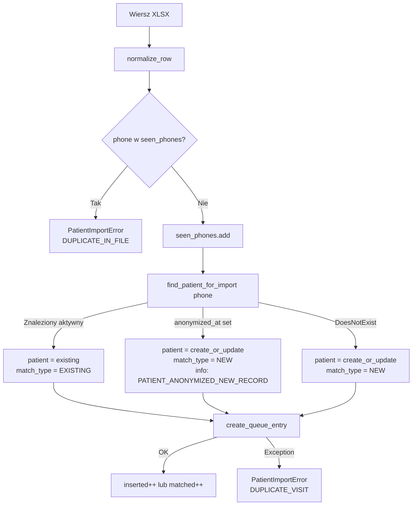

# Modyfikacja importu XLSX — obsługa powracającego i zanonimizowanego pacjenta

## Stan wdrożenia

Import XLSX jest **w pełni zaimplementowany** w `[apps/reception/xlsx_import.py](apps/reception/xlsx_import.py)`:

- odczyt pliku + walidacja nagłówków (elastyczne aliasy)
- normalizacja wierszy (imię/nazwisko, DOB, telefon, email, czas wizyty)
- tworzenie `PatientImportBatch` + `PatientImportError` per wiersz
- zadanie w tle (`run_patient_xlsx_import`) + audit `PATIENT_XLSX_IMPORT_FINISHED`

**Brakujące przypadki:**


| Przypadek                                      | Aktualne zachowanie                                      | Wymagane                                          |
| ---------------------------------------------- | -------------------------------------------------------- | ------------------------------------------------- |
| Pacjent istnieje (ten sam telefon)             | `IntegrityError` → `INVALID_ROW_FORMAT`                  | Lookup → reuse Patient, dodaj tylko QueueEntry    |
| Pacjent zanonimizowany powraca                 | Nowy wiersz Patient (telefon `ANON-<uuid>` nie koliduje) | Nowy wiersz Patient (poprawne — udokumentować)    |
| Duplikat w pliku (dwa wiersze ten sam telefon) | DB error przy drugim wierszu lub dwie QueueEntry         | Deduplikacja per batch, error `DUPLICATE_IN_FILE` |


---

## Zmiana 1 — Lookup pacjenta przed upsert

### Nowa funkcja `find_patient_for_import`

Lokalizacja: `[apps/reception/xlsx_import.py](apps/reception/xlsx_import.py)` lub `[apps/reception/services.py](apps/reception/services.py)`:

```python
def find_patient_for_import(*, phone: str) -> Patient | None:
    """
    Zwraca aktywnego (niezanonimizowanego) pacjenta po telefonie lub None.
    Zanonimizowany pacjent (anonymized_at IS NOT NULL) traktowany jak brak
    — import tworzy nowy rekord.
    """
    try:
        patient = Patient.objects.get(phone=phone)
    except Patient.DoesNotExist:
        return None
    # Zależność: pole anonymized_at pochodzi z migracji planu retencja_pdf_us-013
    if getattr(patient, "anonymized_at", None) is not None:
        return None
    return patient
```

### Zmodyfikowany przepływ per wiersz w `process_patient_xlsx_import_batch`

```python
# Aktualne (błędne):
patient = create_or_update_patient_manual(...)

# Po zmianie:
existing = find_patient_for_import(phone=norm.phone)
if existing:
    patient = existing
    match_type = "EXISTING"
else:
    was_anonymized = _is_anonymized_phone(norm.phone)  # fallback heuristic
    patient = create_or_update_patient_manual(
        first_name=norm.first_name,
        last_name=norm.last_name,
        date_of_birth=norm.date_of_birth,
        phone=norm.phone,
        email=norm.email,
        created_or_updated_by_user_id=created_by_user_id,
        doctolib_patient_id=None,
        patient_id=None,
    )
    match_type = "NEW"
```

---

## Zmiana 2 — Deduplikacja w obrębie jednego pliku

```python
seen_phones: set[str] = set()

# Przed create / find:
if norm.phone in seen_phones:
    errors_count += 1
    PatientImportError.objects.create(
        batch=batch,
        row_number=norm.row_number,
        error_code=XlsxImportErrorCode.DUPLICATE_IN_FILE,
        error_message=f"Duplikat telefonu {norm.phone!r} w tym pliku.",
        raw_row={"first_name": norm.first_name, "last_name": norm.last_name},
    )
    continue
seen_phones.add(norm.phone)
```

---

## Zmiana 3 — Statystyki batcha

Rozszerzenie liczników per batch:

```python
inserted = 0    # nowi pacjenci + nowe QueueEntry
matched = 0     # istniejący pacjenci, tylko QueueEntry dodany

# ...
if match_type == "EXISTING":
    matched += 1
else:
    inserted += 1

# Audit z nowymi polami:
metadata={
    "batch_id": str(batch.id),
    "status": status,
    "inserted_rows": inserted_rows,
    "matched_rows": matched_rows,   # ← nowe
    "error_rows": error_rows,
}
```

> Opcjonalnie: dodać `matched_rows` jako pole do `PatientImportBatch` (migracja). Na start wystarczy w metadanych audit event.

---

## Diagram przepływu — po zmianie




---

## Trzy przypadki — specyfikacja

### Przypadek A: Pacjent powracający (nowa wizyta, istnieje w systemie)

- **Trigger:** `phone` z pliku XLSX = znormalizowany telefon istniejącego `Patient`
- **Zachowanie:** `find_patient_for_import` zwraca istniejący rekord → **brak** `create_or_update_patient_manual` → tylko `create_queue_entry`
- **Statystyki:** `matched_rows += 1` (nie `inserted_rows`)
- **Audit:** brak osobnego event — widoczne w `matched_rows` w `PATIENT_XLSX_IMPORT_FINISHED`
- **Ważne:** dane pacjenta z pliku (imię, email) NIE są aktualizowane przy lookup — recepcja robi to ręcznie przez panel jeśli coś się zmieniło

### Przypadek B: Pacjent zanonimizowany powraca (RODO)

- **Trigger:** `phone` z pliku XLSX — po anonimizacji poprzedni rekord ma `phone = "ANON-<uuid>"` → lookup **nie trafi**
- **Zachowanie:** `find_patient_for_import` zwraca `None` → tworzy **nowy** rekord `Patient`
- **Wynik:** pacjent ma nowe UUID, nową historię — brak powiązania z zanonimizowanym rekordem (celowe)
- **Zależność:** poprawne zachowanie nie wymaga żadnej dodatkowej logiki; zależy od tego, że `ANON-<uuid>` ≠ żaden prawdziwy numer
- **Edge case:** jeśli `anonymized_at` jest ustawiony na rekordzie znalezionym przez telefon (niemożliwe gdy telefon zmieniony na ANON, ale jako defensywna warstwa): `find_patient_for_import` zwraca `None`, tworzy nowy rekord, opcjonalnie loguje `PATIENT_ANONYMIZED_NEW_RECORD`

### Przypadek C: Duplikat w pliku XLSX

- **Trigger:** dwa wiersze w tym samym pliku z tym samym znormalizowanym telefonem
- **Zachowanie:** pierwszy wiersz przetworzony normalnie, drugi → `seen_phones` → `DUPLICATE_IN_FILE` error, wiersz pominięty
- **Dlaczego:** sam pacjent może być zapisany do dwóch kolejek naraz → to decyzja recepcji, nie automatyczna; import nie powinien tworzyć dwie QueueEntry bez jawnej intencji

---

## Nowe kody błędów

Rozszerzenie `XlsxImportErrorCode` w `[apps/reception/xlsx_import.py](apps/reception/xlsx_import.py)`:

```python
class XlsxImportErrorCode:
    # istniejące:
    TEMPLATE_HEADER_INVALID = "TEMPLATE_HEADER_INVALID"
    MISSING_IMPORT_DATE = "MISSING_IMPORT_DATE"
    MISSING_CLINIC_NAME = "MISSING_CLINIC_NAME"
    UNKNOWN_CLINIC = "UNKNOWN_CLINIC"
    INVALID_ROW_FORMAT = "INVALID_ROW_FORMAT"
    INVALID_DATE_OF_BIRTH = "INVALID_DATE_OF_BIRTH"
    INVALID_PHONE = "INVALID_PHONE"
    MISSING_REQUIRED_FIELD = "MISSING_REQUIRED_FIELD"
    DUPLICATE_VISIT = "DUPLICATE_VISIT"
    # nowe:
    DUPLICATE_IN_FILE = "DUPLICATE_IN_FILE"           # ten sam telefon drugi raz w tym pliku
    PATIENT_ANONYMIZED_NEW_RECORD = "PATIENT_ANONYMIZED_NEW_RECORD"  # info: nowy rekord dla zanonimizowanego
```

---

## Zależności

- `**anonymized_at` na modelu `Patient**` — pole dodawane w planie `[retencja_pdf_us-013](.cursor/plans/retencja_pdf_us-013.plan.md)`; do czasu wdrożenia: fallback `patient.first_name == "ANONYMIZED"` jako heurystyka
- `**patient_phone_unique**` constraint — pozostaje; `find_patient_for_import` eliminuje `IntegrityError` jako ścieżkę główną

---

## Testy

- `test_import_existing_patient_reuses_record` — pacjent z tym samym telefonem istnieje → `Patient.objects.count()` nie rośnie, `QueueEntry` dodany, `matched_rows=1`
- `test_import_anonymized_patient_creates_new` — istniejący rekord z `phone="ANON-uuid"`, import z prawdziwym telefonem → nowy `Patient` stworzony
- `test_import_duplicate_in_file` — dwa wiersze z tym samym telefonem → pierwszy OK, drugi `DUPLICATE_IN_FILE` error, `error_rows=1`
- `test_import_new_patient` — telefon nie istnieje w DB → nowy `Patient` + `QueueEntry`, `inserted_rows=1`

