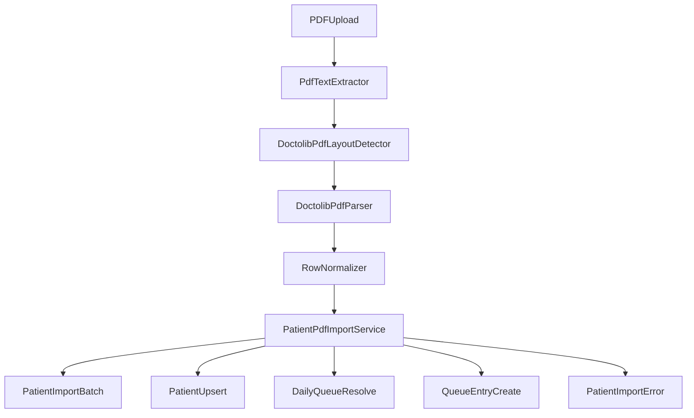

# Plan importu pacjentów z PDF

## Założenia wejściowe

- Źródłem jest tekstowy, machine-readable PDF z jednym ustalonym układem Doctolib.
- PDF zawiera co najmniej:
  - datę,
  - nazwę kliniki,
  - rekordy pacjentów z polami: `godzina`, `imię i nazwisko`, `telefon`, `data urodzenia`, `email`, `adres`, `kod pocztowy`.
- Klinika jest mapowana po nazwie na `ClinicSite`.
- Data kolejki jest pobierana z PDF.
- Parser ma wspierać jeden ustalony układ tekstowego PDF Doctolib, bez OCR.
- Import ma działać zgodnie z uproszczonym modelem `Patient`:
  - unikalność pacjenta: `first_name + last_name + phone + date_of_birth`,
  - `doctolib_patient_id` pozostaje opcjonalne i nie jest wymagane w imporcie PDF.

## Co już istnieje

- Modele batch/error importu są gotowe w `apps/reception/models.py`: `PatientImportBatch`, `PatientImportError`.
- Serwisy, które importer powinien wykorzystać, istnieją w `apps/reception/services.py`: `create_daily_queue()`, `create_queue_entry()`, `create_or_update_patient_manual()`.
- Dokumentacja importów istnieje, ale runtime endpointów `/imports/*` jeszcze nie ma.

## Zakres planowanej funkcji

- Dodać rzeczywistą ścieżkę importu PDF dla recepcji/admina:
  - upload pliku PDF,
  - utworzenie `PatientImportBatch`,
  - parsowanie nagłówka PDF: data + nazwa kliniki,
  - parsowanie wierszy pacjentów,
  - mapowanie kliniki po nazwie,
  - znalezienie lub utworzenie odpowiedniej kolejki dziennej,
  - utworzenie/aktualizacja pacjentów,
  - dodanie `QueueEntry` z `appointment_time`,
  - zapis błędów per wiersz do `PatientImportError`.
- Zachować częściowy sukces importu: błędne wiersze są raportowane, poprawne są importowane.
- Oprzeć idempotencję na danych dostępnych w PDF:
  - pacjent: `first_name + last_name + phone + date_of_birth`,
  - wizyta: pochodny klucz z `queue_date + clinic_site + appointment_time + patient identity`, jeśli PDF nie dostarcza stabilnego `visit_external_id`.

## Architektura parsera PDF

- Zbudować parser w czterech warstwach:
  - `PdfTextExtractor`: otwarcie PDF przez `pdfplumber`, pobranie tekstu i linii/wordów z pozycjami,
  - `DoctolibPdfLayoutDetector`: weryfikacja, czy PDF pasuje do oczekiwanego layoutu,
  - `DoctolibPdfParser`: odczyt daty, nazwy kliniki i surowych wierszy pacjentów,
  - `PatientPdfImportService`: mapowanie na domenę i zapis do bazy.
- Parser nie powinien zapisywać nic do DB; zapis należy wyłącznie do warstwy serwisowej.
- Preferowana biblioteka do odczytu: `pdfplumber`.

## Modele pośrednie

- Dodać model pośredni surowego rekordu, np.:
  - `ParsedPatientRow(row_number, appointment_time_raw, full_name_raw, phone_raw, date_of_birth_raw, email_raw, address_raw, postal_code_raw)`
- Dodać model wyniku parsera PDF:
  - `ParsedPdfImport(import_date, clinic_name, rows[])`
- Dodać model po normalizacji:
  - `NormalizedPatientRow(row_number, appointment_time, first_name, last_name, phone, date_of_birth, email, street, postal_code, city, country_code)`

## Główne decyzje projektowe

- Parsowanie PDF:
  - użyć `pdfplumber`,
  - główna ścieżka parsowania powinna bazować na `extract_words(...)` i grupowaniu po pozycjach,
  - `extract_text()` może służyć pomocniczo do debugowania i fallbacku,
  - błędny lub nieoczekiwany układ ma kończyć się jawnym błędem importu, nie heurystyką wielowariantową.
- Nazwa kliniki:
  - w MVP dopasowanie dokładne do `ClinicSite.name`,
  - jeśli dopasowanie się nie powiedzie, batch kończy się błędem `UNKNOWN_CLINIC`.
- Rozbicie `imię i nazwisko`:
  - przyjąć deterministyczną regułę splitu zgodną z jednym formatem Doctolib,
  - przypadki nieparsowalne raportować jako błąd wiersza.
- Adres:
  - mapować `adres` do `street`, `kod pocztowy` do `postal_code`,
  - jeśli w PDF nie ma osobnego miasta, pozostawić `city=None`,
  - `country_code` domyślnie ustawiać na `DE`.

## Najważniejsza zależność domenowa

- Obecny model `DailyQueue` nadal wymaga `clinic_site`, `consulting_room`, `shift_code`.
- Ponieważ PDF daje tylko datę i nazwę kliniki, implementacja importu musi przewidzieć regułę wykonawczą:
  - konfigurację domyślnego `consulting_room` i `shift_code` dla importów PDF per klinika, albo
  - jawny fallback operacyjny, jeśli klinika nie ma pełnej konfiguracji.
- To powinien być pierwszy element implementacji technicznej importu, bo bez niego nie da się utworzyć `DailyQueue`.

## Proponowane miejsca zmian

- Serwis importu PDF w warstwie recepcji, np. nowy moduł w `apps/reception/` lub rozszerzenie `apps/reception/services.py`.
- Kontrakty request/response w `apps/reception/api_schemas.py`.
- Endpointy importowe i batch detail/errors w:
  - `apps/reception/api_views.py`,
  - `cogitomedica/api_urls.py`,
  - `cogitomedica/openapi_extension.py`,
  - `cogitomedica/openapi_schemas.py`.
- Opcjonalnie admin/dashboard dla podglądu wyników importu w:
  - `apps/reception/admin.py`,
  - `templates/admin/reception/dashboard.html`.

## Kroki implementacyjne

- Dodać kontrakt API dla importu PDF:
  - `POST /imports/patients/pdf` albo spójny wariant pod `/imports/patients`,
  - `GET /imports/batches`,
  - `GET /imports/batches/{id}`,
  - `GET /imports/batches/{id}/errors`.
- Dodać parser PDF z etapami:
  - extract text,
  - parse header,
  - parse rows,
  - normalize row data.
- Zaimplementować serwis importu:
  - obliczenie SHA256 pliku,
  - utworzenie `PatientImportBatch`,
  - mapowanie `ClinicSite` po nazwie,
  - znalezienie/utworzenie `DailyQueue` dla daty z PDF,
  - upsert pacjenta zgodnie z nową unikalnością,
  - bezpieczne tworzenie `QueueEntry` bez duplikacji przy ponownym imporcie,
  - zapis `PatientImportError` dla błędów parsera i walidacji,
  - zamknięcie batcha statusem `COMPLETED`, `COMPLETED_WITH_ERRORS` albo `FAILED`.

## Kody błędów importu PDF

- `PDF_PARSE_FAILED`
- `PDF_UNSUPPORTED_LAYOUT`
- `MISSING_IMPORT_DATE`
- `MISSING_CLINIC_NAME`
- `UNKNOWN_CLINIC`
- `INVALID_ROW_FORMAT`
- `INVALID_APPOINTMENT_TIME`
- `INVALID_DATE_OF_BIRTH`
- `AMBIGUOUS_FULL_NAME`
- `PATIENT_UNIQUENESS_CONFLICT`
- `DUPLICATE_VISIT`

## Ryzyka i luki do pokrycia

- Największa luka to brak reguły domyślnego `consulting_room` i `shift_code` dla kliniki przy imporcie PDF.
- PDF nie zawiera stabilnego identyfikatora wizyty, więc idempotencję trzeba zdefiniować po danych pochodnych.
- Brak osobnego miasta w wejściu oznacza niepełne mapowanie adresu.
- Parser zależy od jednego layoutu Doctolib; każda zmiana formatu PDF wymaga aktualizacji parsera i fixture testowych.

## Testy i weryfikacja

- Dodać testy parsera PDF dla:
  - poprawnego odczytu daty,
  - poprawnego odczytu nazwy kliniki,
  - poprawnego odczytu wielu rekordów,
  - nieobsługiwanego layoutu,
  - brakujących pól nagłówka i wierszy.
- Dodać testy integracyjne importu dla:
  - utworzenia `PatientImportBatch` i `PatientImportError`,
  - utworzenia pacjentów,
  - utworzenia `QueueEntry` z `appointment_time`,
  - ponownego importu tego samego PDF bez duplikacji wpisów.
- Uruchomić testy w Dockerze przynajmniej dla `reception` oraz obszarów zależnych od `Patient` i kolejek.

## Dokumentacja do aktualizacji

- Zmienić dokumentację importów z `.csv/.xlsx` na PDF albo opisać PDF jako nowy docelowy kanał importu w:
  - `.ai/prd.md`,
  - `.ai/api-plan.md`,
  - `.ai/api-plan-pl.md`,
  - `.ai/db-plan.md`.
- Uspójnić dokumentację importu z nową semantyką `Patient`: bez `TEMPORARY`, bez alertów, bez wymogu `doctolib_patient_id` dla importu PDF.
