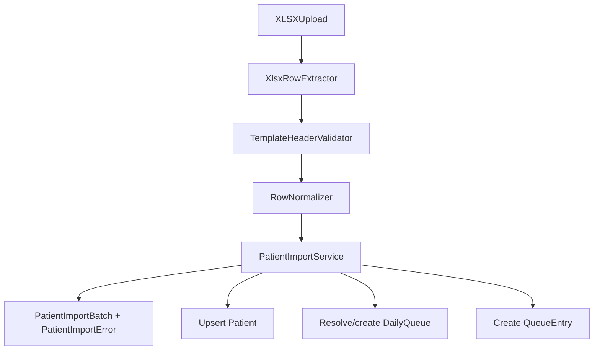

# Wycofanie importu PDF, przygotowanie importu XLSX

## 1) Kontekst: gdzie dziś jest import z PDF

- Backend znajduje się w `apps/reception/pdf_import.py` i opiera się o `pdfplumber` (opcjonalnie fallback do `fitz`/PyMuPDF).
- API ma endpoint `POST /imports/patients/pdf` w `apps/reception/api_views_split/imports.py`, podpinany w `cogitomedica/api_urls.py` oraz dokumentowany w `cogitomedica/openapi_extension.py`.
- Admin ma akcję „Import z pliku” na liście kolejek w `templates/admin/reception/dailyqueue/change_list.html`, link generowany w `apps/reception/admin.py`, oraz formularz uploadu w `templates/admin/reception/dailyqueue/import_pdf.html`.

## 2) Plan wycofania PDF (kod + zależności + wiring)

### A. Backend i zależności

1. Usunąć zależność biblioteki odczytu PDF z `requirements.txt` (aktualnie `pdfplumber==0.11.9`).
2. Usunąć/wyłączyć całą logikę importu PDF:
  - plik `apps/reception/pdf_import.py` (lub wyraźnie „retire” jako nieużywany moduł, jeśli potrzebujesz tymczasowo utrzymać kod w gałęzi),
  - zadanie w tle `run_patient_pdf_import` z `apps/reception/tasks.py` (bo wywołuje `process_patient_pdf_import_batch`).
3. Usunąć konfigurację loggera specyficzną dla modułu `apps.reception.pdf_import` z `cogitomedica/settings.py`.

### B. API i dokumentacja

1. Usunąć endpoint `patient_pdf_import_view` oraz jego wiring:
  - `apps/reception/api_views_split/imports.py` (funkcja `patient_pdf_import_view` sprawdza `.endswith(".pdf")` i łapie `ImportError` od `pdfplumber`).
  - eksport widoków w `apps/reception/api_views.py`.
  - ścieżkę w `cogitomedica/api_urls.py` (`imports/patients/pdf`).
  - definicję OpenAPI w `cogitomedica/openapi_extension.py` dla `/imports/patients/pdf`.

### C. Admin UI (zachować „frontend upload” jako wspólny element)

1. W `templates/admin/reception/dailyqueue/change_list.html` zmienić przycisk tak, żeby nadal korzystał z tej samej mechaniki uploadu (tylko zmieniona etykieta i docelowy link), tj. zastąpić `import_pdf_url` nowym `import_xlsx_url`.
2. W `apps/reception/admin.py`:
  - usunąć custom URL `import-pdf/` i metodę `import_pdf_view`,
  - zamiast niej przygotować widok `import_xlsx_view` (na razie tylko „UI wiring” — bez logiki importu), który będzie korzystał z tego samego formularza/uploadu i podmieni akceptowane rozszerzenie.
3. W `templates/admin/reception/dailyqueue/import_pdf.html` uogólnić pod upload xlsx:
  - podmienić opis/etykietę oraz atrybut `accept` na `.xlsx,application/vnd.openxmlformats-officedocument.spreadsheetml.sheet`,
  - zachować JavaScript do podglądu wybranego pliku (żeby rzeczywiście nie wyrzucać „frontend upload” z PDF).

### D. Testy

1. Wycofać testy PDF importu:
  - `apps/reception/api_tests.py` – klasę `PatientPdfImportApiTests`.
  - `apps/reception/tests.py` – testy admin importu (`DailyQueueAdminImportTests`) i testy parsera/normalizacji w `pdf_import.py`.
2. Utrzymać wspólne testy „batch/errors API” (ponieważ model `PatientImportBatch` i `PatientImportError` jest niezależny od formatu pliku).

## 3) Następny krok: nowa ścieżka importu `.xlsx` (adapter zamiast PDF)

### A. Architektura (reuse batch + upsert)

- Zostawić model batch i per-wiersz błędy (te elementy już istnieją).
- Dodać nowy moduł analogiczny do `apps/reception/pdf_import.py`, np. `apps/reception/xlsx_import.py`, z:
  - walidacją sztywnego formatu wejścia (kolumny i typy),
  - normalizacją danych do domeny `create_or_update_patient_manual` + `create_daily_queue` + `create_queue_entry`.

### B. Proponowana biblioteka do XLSX

- Propozycja: `openpyxl` do odczytu `.xlsx`.
  - Daje przewidywalny i wystarczająco szybki odczyt wiersz-po-wierszu,
  - pozwala na twardą walidację nagłówków i typów komórek (dob/same day, phone normalization itd.),
  - minimalizuje „magiczne” konwersje typów w porównaniu do high-level bibliotek.
- W kolejnym kroku dodać `openpyxl` do `requirements.txt` i stworzyć sztywny importer XLSX pod ustalony template.

### C. Mapping kolumn XLSX -> `Patient`

- Wymagane ustalenie konkretnego szablonu `.xlsx` (kolumny/arkusz) zgodnie z docelowym workflow, np.:
  - `first_name`, `last_name`, `dob`, `phone`, `email`.
- W importerze mapping powinien prowadzić do:
  - `dob` -> `date_of_birth`
  - `phone` -> `phone` po normalizacji (reuse `apps/reception/phone_utils.normalize_phone`)
  - oraz wstawienie `QueueEntry` zgodnie z wymaganiami trybu (np. `appointment_time=None` jeśli template nie zawiera czasu).

## 4) Diagram przepływu (dla XLSX zamiast PDF)

## Ryzyka i decyzje do potwierdzenia

- Nazewnictwo i logika docelowego trybu kolejek: czy XLSX dostarcza `appointment_time` i `clinic_name` jak PDF, czy import XLSX zakłada inny zestaw pól (np. bez czasu wizyty).
- Pola w modelu mają nazwy `pdf_import_*` (w `apps/reception/models.py`) – plan zakłada na tym etapie niezmienianie ich (żeby uniknąć migracji), ale później warto je zrefaktorować do neutralnych nazw. Przed zakończeniem pracy zmień je na neutralne ale upewnić się że to nie wpłynie na działanie systemu, w razie problemów rozwiąż je. 

