# Moduł przeglądania Intake PDF

## Stan obecny

PDF intake już powstają i są zapisywane lokalnie, ale repo nie ma jeszcze modułu biznesowego do ich listowania i podglądu.

Kluczowe miejsca:

- [apps/intake/models.py](C:/Users/piotr/Programming/cogitomedica/apps/intake/models.py): `IntakeDocumentVersion` przechowuje `pdf_generation_status`, `pdf_local_path`, `pdf_checksum_sha256`, `hidrive_path`, `hidrive_sent`.
- [apps/intake/services.py](C:/Users/piotr/Programming/cogitomedica/apps/intake/services.py): `submit_patient_intake_form()` tworzy `IntakeDocumentVersion` i enqueue'uje `GENERATE_INTAKE_PDF`.
- [apps/intake/pdf_builder.py](C:/Users/piotr/Programming/cogitomedica/apps/intake/pdf_builder.py): `generate_intake_pdf()` zapisuje plik do `MEDIA_ROOT/pdfs/intake/YYYY/MM/<version_id>.pdf`.
- [apps/intake/api_views.py](C:/Users/piotr/Programming/cogitomedica/apps/intake/api_views.py): są endpointy formularza intake i outbox, ale brak `list/detail/preview` dla PDF.
- [apps/medical/api_views.py](C:/Users/piotr/Programming/cogitomedica/apps/medical/api_views.py): gotowy wzorzec `list/detail/preview-pdf` do reużycia.
- [apps/core/api_utils.py](C:/Users/piotr/Programming/cogitomedica/apps/core/api_utils.py): gotowy mechanizm ról i scope po `clinic_site`.

## Proponowany zakres modułu

W pierwszej iteracji moduł powinien być read-only i obejmować:

- listę dokumentów intake PDF dla `RECEPTION` i `ADMIN`,
- detail dokumentu z metadanymi i statusem generacji,
- podgląd PDF inline dla wygenerowanych plików,
- filtrowanie po pacjencie, dacie kolejki, statusie PDF i placówce w zakresie uprawnień użytkownika.

Bez zmian w generatorze PDF i bez edycji snapshotów. Moduł ma tylko korzystać z już wygenerowanych artefaktów.

## Kształt backendu

Dodać nowy read-only zestaw endpointów intake, w stylu `medical-documents`:

- `GET /api/v1/intake-documents`
- `GET /api/v1/intake-documents/<uuid:intake_document_version_id>`
- `GET /api/v1/intake-documents/<uuid:intake_document_version_id>/preview-pdf`

Implementacja:

- nowy moduł np. [apps/intake/document_views.py](C:/Users/piotr/Programming/cogitomedica/apps/intake/document_views.py) albo rozszerzenie [apps/intake/api_views.py](C:/Users/piotr/Programming/cogitomedica/apps/intake/api_views.py),
- nowe funkcje list/detail/access w serwisie np. [apps/intake/document_services.py](C:/Users/piotr/Programming/cogitomedica/apps/intake/document_services.py),
- reużycie `require_auth()`, `require_user_role()`, `get_scoped_clinic_site_ids()` z [apps/core/api_utils.py](C:/Users/piotr/Programming/cogitomedica/apps/core/api_utils.py).

Filtrowanie dostępu oprzeć o relację:
`IntakeDocumentVersion -> intake_form -> queue_entry -> daily_queue -> clinic_site`

Zasady dostępu:

- `ADMIN`: pełny dostęp,
- `RECEPTION`: tylko dokumenty z przypisanych `clinic_sites`,
- brak dostępu dla `DOCTOR` i `TABLET` w tym module, jeśli celem jest moduł rejestracyjny.

`preview-pdf` powinien:

- zwracać `404`, jeśli `pdf_local_path` nie istnieje albo status nie jest `COMPLETED`,
- czytać plik z `MEDIA_ROOT / pdf_local_path`,
- zwracać `HttpResponse(..., content_type="application/pdf")` z `Content-Disposition: inline`.

## Kształt danych odpowiedzi

Lista powinna zwracać gotowe do UI metadane:

- `id`, `version_no`, `form_locale`, `pdf_generation_status`, `created_at`,
- `queue_entry_id`, `intake_form_id`,
- `queue_date`, `clinic_site_id`, `clinic_site_name`,
- pacjent: `id`, `first_name`, `last_name`, `date_of_birth`,
- `pdf_available` jako pochodna z `pdf_generation_status == COMPLETED and pdf_local_path`,
- opcjonalnie `hidrive_sent` i `processing_error_message` jeśli ma być widoczne operacyjnie.

To najlepiej wzorować na `_serialize_medical_document_list_item()` z [apps/medical/api_views.py](C:/Users/piotr/Programming/cogitomedica/apps/medical/api_views.py), ale uprościć do read-only.

## UI modułu

Najkrótsza ścieżka wdrożenia:

- najpierw gotowe API,
- potem prosty read-only widok HTML dla recepcji/admina oparty na wzorcu z [cogitomedica/doctor_views.py](C:/Users/piotr/Programming/cogitomedica/cogitomedica/doctor_views.py), ale bez części edycyjnej.

Minimalny UI:

- lista z filtrami i paginacją,
- detail z metadanymi dokumentu,
- przycisk `Podgląd PDF` otwierający `preview-pdf` w nowej karcie.

W praktyce można dodać np.:

- [cogitomedica/reception_views.py](C:/Users/piotr/Programming/cogitomedica/cogitomedica/reception_views.py)
- `templates/reception/intake_documents_list.html`
- `templates/reception/intake_document_detail.html`

Jeżeli zespół chce szybciej dowieźć funkcję, etap 1 może zakończyć się na API + linkach z Django admin, a HTML dodać w etapie 2.

## Testy i bezpieczeństwo

Dodać testy dla:

- listy w scope i poza scope dla `RECEPTION`,
- pełnego dostępu `ADMIN`,
- `403` dla `DOCTOR` i `TABLET`,
- `404` gdy PDF jeszcze nie został wygenerowany lub plik zniknął z dysku,
- poprawnego `Content-Type: application/pdf` i `inline` dla podglądu.

Najbardziej naturalne miejsce: [apps/intake/tests.py](C:/Users/piotr/Programming/cogitomedica/apps/intake/tests.py) albo nowy plik `apps/intake/api_tests.py`, zależnie od obecnego podziału testów.

## Proponowana kolejność prac

1. Dodać serwis listowania i kontroli dostępu dla `IntakeDocumentVersion`.
2. Dodać read-only endpointy API i zarejestrować je w [cogitomedica/api_urls.py](C:/Users/piotr/Programming/cogitomedica/cogitomedica/api_urls.py).
3. Dodać testy uprawnień, scope i preview PDF.
4. Dodać prosty UI HTML dla recepcji/admina albo zostawić jako etap 2, jeśli celem jest najpierw backend.

## Diagram przepływu

```mermaid
flowchart LR
    intakeForm[PatientIntakeForm] --> submitService[submit_patient_intake_form]
    submitService --> docVersion[IntakeDocumentVersion]
    docVersion --> outboxEvent[GENERATE_INTAKE_PDF]
    outboxEvent --> pdfBuilder[generate_intake_pdf]
    pdfBuilder --> localPdf[pdf_local_path]
    localPdf --> intakeApi[RECEPTION_ADMIN_intake_documents_API]
    intakeApi --> receptionUi[ReceptionAdmin_UI]
```

