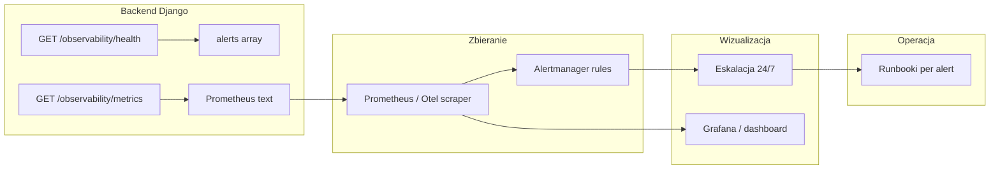

# Plan wdrożenia PRD 3.5 – Observability i gotowość operacyjna

## Źródła wymagań

- **[.ai/prd.md](.ai/prd.md) §3.5** – wymaganie obowiązkowe: metryki (outbox, integracje, import, dokumenty), dwa dashboardy operacyjne, alerting 24/7 z progami i eskalacją, runbook przy każdym alercie.
- **US-014** (prd.md §5) – dwa dashboardy (prosty recepcji/lekarza + zaawansowany utrzymaniowy), alerty zgodne z 3.5, runbooki, wyraźne powiadomienia przy FAILED/DEAD_LETTER.

---

## Stan implementacji (as-is)

| Obszar                 | Zaimplementowane                                                                                                                                                                                         | Braki                                                                                                                                                                            |
| ---------------------- | -------------------------------------------------------------------------------------------------------------------------------------------------------------------------------------------------------- | -------------------------------------------------------------------------------------------------------------------------------------------------------------------------------- |
| **Health**             | [apps/operations/api_views.py](apps/operations/api_views.py) – `observability_health_view` bez auth; sprawdza DB, outbox; zwraca `alerts[]` (OUTBOX_BACKLOG_AGE, *_FAILED_OVER_10M, *_SUCCESS_RATIO_LOW) | Logika „failed >10 min”: `updated_at__lte=ten_minutes_ago` daje **trwały** alert dla starych failed (np. wczorajszy DEAD_LETTER). Brak „godziny pracy” dla alertu backlog >900s. |
| **Metryki Prometheus** | [apps/operations/metrics.py](apps/operations/metrics.py) – outbox (pending/failed/dead_letter, oldest_pending_age), success_ratio_1h (PDF, HiDrive, SMS), latency p95 publish→pdf/hidrive/sms            | Brak **p99**; brak metryk **importu** (liczba batchy udane/nieudane, row_error_rate, czas przetwarzania); brak „liczba błędów per provider i per typ błędu”.                     |
| **Endpoint metrics**   | GET `/api/v1/observability/metrics` – wymaga **ADMIN** ([api_views.py](apps/operations/api_views.py) L166–170)                                                                                           | Prometheus zwykle składa request bez sesji; do wyboru: endpoint bez auth (np. dla wewnętrznej sieci) lub dedykowany token / proxy.                                               |
| **Dashboardy**         | Lista lekarza pokazuje statusy PDF/HiDrive/SMS i `processing_error_message`; brak dedykowanych widoków „dashboard recepcji” i „dashboard utrzymaniowy”.                                                  | Brak UI: status importu, zaległe dokumenty, awarie krytyczne (recepcja); brak UI: SLO/SLI, retry, dead letter, trendy 24h/7d (utrzymanie).                                       |
| **Runbooki**           | [.cursor/plans/translations-admin-runbook.md](.cursor/plans/translations-admin-runbook.md) – tylko tłumaczenia.                                                                                          | Brak runbooków dla: OUTBOX_BACKLOG_AGE, HIDRIVE_FAILED_OVER_10M, SMS_FAILED_OVER_10M, *_SUCCESS_RATIO_LOW (diagnostyka i obejście).                                              |
| **Alerting 24/7**      | Tylko odpowiedź JSON z `alerts[]` w health.                                                                                                                                                              | Brak integracji z Prometheus Alertmanager / PagerDuty / innym kanałem 24/7 z eskalacją.                                                                                          |

Model importu: [apps/reception/models.py](apps/reception/models.py) – `PatientImportBatch` (total_rows, inserted_rows, error_rows, status, created_at, finished_at); `PatientImportError` – dane do metryk i row_error_rate są w DB.

---

## Proponowana architektura

---

## Kolejność zadań

### 1. Poprawa logiki alertów w health (backend)

- **Plik:** [apps/operations/api_views.py](apps/operations/api_views.py).
- **Alert „failed >10 min”:** Zamiast „istnieje event FAILED/DEAD_LETTER z `updated_at <= 10 min temu`” (co obejmuje stare failed) – zmienić na: „w ostatnich 10 min **nastąpiła** zmiana na FAILED/DEAD_LETTER” (np. `updated_at` w przedziale `[now-10min, now]` i status FAILED/DEAD_LETTER), albo dodać osobną metrykę „oldest failed/DEAD_LETTER age” i alertować tylko gdy ten wiek >10 min („nierozwiązany od 10 min”).
- **Alert backlog >900s:** Opcjonalnie: uwzględnienie „godzin pracy” (konfigurowalne okno w settings lub zmienna środowiskowa); jeśli nie w pierwszej iteracji – zostawić zawsze.
- **Dokumentacja:** Zaktualizować docstring / `.ai/stan-wdrozenia-i-dalej.md` opisem nowej logiki.

### 2. Uzupełnienie metryk Prometheus

- **Plik:** [apps/operations/metrics.py](apps/operations/metrics.py).
- **Outbox:** Dodać `cogitomedica_outbox_processing_latency_p99_seconds` (analogicznie do p95) dla GENERATE_PDF, HIDRIVE_UPLOAD, SMS_SEND (PRD: „processing_latency_p95/p99”).
- **Import:**
  - Liczba batchy: `cogitomedica_import_batches_total` (labels: status=COMPLETED|PROCESSING|FAILED).
  - `cogitomedica_import_row_error_rate` – np. suma(error_rows) / suma(total_rows) w oknie (np. 24h) lub per ostatnie N batchy.
  - Czas przetwarzania: `cogitomedica_import_processing_duration_seconds` (histogram lub gauge z ostatniego batcha / percentyle).
- **Integracje – liczba błędów:** `cogitomedica_outbox_errors_total` (labels: event_type=HIDRIVE_UPLOAD|SMS_SEND, status=FAILED|DEAD_LETTER); opcjonalnie `error_code` jeśli jest w modelu.
- **Dokumenty:** Metryki „czas od publikacji do hidrive_sent/sms_sent” są już w dużej mierze pokryte przez `publish_to_hidrive_latency_p95_seconds` i `publish_to_sms_latency_p95_seconds`; ewentualnie dodać p99 dla spójności z PRD.

Źródła danych: [apps/outbox/models.py](apps/outbox/models.py) (OutboxEvent), [apps/reception/models.py](apps/reception/models.py) (PatientImportBatch, PatientImportError).

### 3. Endpoint metrics – dostęp dla Prometheusa

- **Opcje:** (A) Zdjąć auth z GET `/observability/metrics` i polegać na sieci (np. bind tylko wewnętrzny / reverse proxy z IP allowlist); (B) Obsługa nagłówka `Authorization: Bearer <token>` z wartością z settings (np. `PROMETHEUS_METRICS_TOKEN`); (C) Osobna ścieżka np. `/internal/observability/metrics` bez auth, dostępna tylko z localhost / wewnętrznego VPC.
- **Rekomendacja:** W pierwszej iteracji (A) lub (C) + dokumentacja w README/runbooku; opcjonalnie (B) w środowisku współdzielonym.
- **Dokumentacja:** [.ai/staff-api-contract.md](.ai/staff-api-contract.md) i api-plan – doprecyzować, że health jest publiczny, metrics – jak wyżej.

### 4. Dashboard recepcji (UI)

- **Zakres (PRD 3.5 + US-014):** status importu (ostatnie batche, PROCESSING/COMPLETED/COMPLETED_WITH_ERRORS), zaległe dokumenty (np. lista dokumentów z pdf_generation_status=FAILED lub outbox w DEAD_LETTER), awarie krytyczne (czerwona lampka/toast).
- **Lokalizacja:** Nowy widok w panelu staff (Django + Unfold), np. `/reception/dashboard/` lub strona startowa dla roli RECEPTION z widgetami.
- **Dane:** API już istniejące (lista outbox, lista medical-documents z filtrami, lista import batchy – jeśli jest endpoint; w przeciwnym razie odczyty z modeli w widoku lub lekkie endpointy JSON).
- **Wskazanie FAILED/DEAD_LETTER:** Spójnie z listą lekarza – wyraźny komunikat/toast lub badge przy listach (recepcja: np. „X dokumentów z błędem przetwarzania”, link do listy outbox).

### 5. Dashboard utrzymaniowy (UI)

- **Zakres:** SLO/SLI, retry, dead letter, trend 24h/7d (PRD: „dashboard utrzymaniowy”).
- **Źródło danych:** GET `/api/v1/observability/metrics` (Prometheus) lub dedykowany GET `/api/v1/observability/summary` zwracający JSON (liczby, ratio, p95/p99) dla widgetów – unikając parsowania Prometheus w przeglądarce.
- **Rekomendacja:** Endpoint `observability/summary` (JSON) tylko dla ADMIN z wartościami wyliczonymi tak jak w metrics (pending_count, failed_count, success_ratio_1h, latency_p95/p99, import stats), plus opcjonalnie ostatnie N alertów z health. Frontend: jedna strona Unfold z kartami (Outbox, HiDrive, SMS, Import) i ewentualnie linkami do runbooków.
- **Trend 24h/7d:** W minimalnej wersji: snapshot „teraz” z summary; pełne trendy wymagają albo zapisywania snapshotów metryk w czasie (np. cron + tabela) albo zewnętrznego Prometheusa + Grafana.

### 6. Runbooki operacyjne

- **Katalog:** np. `.cursor/plans/runbooks/` lub `docs/runbooks/` w repo.
- **Dokumenty do utworzenia (po jednym na kod alertu):**
  - `OUTBOX_BACKLOG_AGE.md` – diagnostyka (zapytania do outbox, logi), obejście (uruchomienie process outbox, retry pojedynczych eventów, zwiększenie workerów).
  - `HIDRIVE_UPLOAD_FAILED_OVER_10M.md` – sprawdzenie outbox i error_message, retry z panelu, kontakt z dostawcą HiDrive.
  - `SMS_SEND_FAILED_OVER_10M.md` – analogicznie dla SMS.
  - `HIDRIVE_UPLOAD_SUCCESS_RATIO_LOW.md` / `SMS_SEND_SUCCESS_RATIO_LOW.md` – analiza błędów w oknie 1h, typowe kody, eskalacja.
- **Format:** krótki cel, warunek alertu, kroki diagnostyki, kroki obejścia/awaryjne, kontakt/eskalacja. Link do runbooka w opisie alertu (np. w payloadzie health lub w UI dashboardu przy danym alercie).

### 7. Alerting 24/7 z eskalacją

- **Po stronie aplikacji:** Health zwraca już `alerts[]`; brak jest ciągłego „wypychania” do zewnętrznego systemu.
- **Propozycja:** Użyć Prometheusa + Alertmanager:
  - Prometheus zbiera GET `/observability/metrics` (i ewentualnie GET `/observability/health` jako probe).
  - Reguły Alertmanager na podstawie metryk (np. `cogitomedica_outbox_oldest_pending_age_seconds > 900`, `cogitomedica_outbox_failed_count > 0`, `cogitomedica_hidrive_success_ratio_1h < 0.98`) – zgodne z PRD 3.5.
  - Kanały: email, Slack, PagerDuty (konfiguracja po stronie infrastruktury; w planie tylko dokumentacja „jak podłączyć” i przykładowe reguły w repozytorium, np. `deploy/prometheus/alerts.yml`).
- **Runbooki:** W adnotacjach alertów (Alertmanager) link do runbooków w repo (np. `runbook_url`).

### 8. Definition of Done i testy

- **DoD (PRD 3.5):** Dla funkcji modyfikujących outbox/import/integracje – dopisywanie wpisu w checklist: „alerting i runbook zaktualizowane”.
- **Testy:**
  - Jednostkowe/integracyjne: health zwraca 503 przy nieaktywnej DB; przy danych testowych (stary failed) – weryfikacja, że nowa logika alertu „failed >10 min” nie daje fałszywego alarmu dla starych; metryki importu – przy pustych batchach i przy batchu z error_rows – sprawdzenie wartości gauge.
  - E2E (opcjonalnie): jeden scenariusz „opublikuj dokument → sprawdź metryki/health” w CI.

---

## Zależności i kolejność

1. **Faza 1 (backend, bez zewn. systemów):** Zadania 1 (alerty), 2 (metryki), 6 (runbooki). Opcjonalnie 3 (dostęp do metrics).
2. **Faza 2 (UI):** Zadania 4 (dashboard recepcji), 5 (dashboard utrzymaniowy + ewentualny endpoint summary).
3. **Faza 3 (24/7):** Zadanie 7 (reguły Prometheus/Alertmanager, dokumentacja wdrożenia).
4. **Na bieżąco:** Zadanie 8 (DoD, testy).

---

## Pliki do utworzenia/modyfikacji (skrót)

| Zadanie | Pliki                                                                                                                   |
| ------- | ----------------------------------------------------------------------------------------------------------------------- |
| 1       | `apps/operations/api_views.py`                                                                                          |
| 2       | `apps/operations/metrics.py`                                                                                            |
| 3       | `apps/operations/api_views.py`, `cogitomedica/api_urls.py` (jeśli nowa ścieżka), `README` / `.ai/staff-api-contract.md` |
| 4       | Nowe widoki/szablony staff (reception dashboard), ewentualnie `apps/reception/views.py` lub `apps/operations/views.py`  |
| 5       | Endpoint `observability/summary` w `apps/operations/api_views.py`, szablony Unfold (dashboard utrzymaniowy)             |
| 6       | `docs/runbooks/OUTBOX_BACKLOG_AGE.md`, `*_FAILED_OVER_10M.md`, `*_SUCCESS_RATIO_LOW.md`                                 |
| 7       | `deploy/prometheus/alerts.yml` (przykład), `docs/observability-setup.md`                                                |
| 8       | `apps/operations/api_tests.py`, ewentualnie `apps/operations/tests.py`                                                  |

---

## Uwagi

- **Health bez auth** – celowo (liveness/readiness dla Kubernetes/orchestratorów); nie zwracać w health wrażliwych danych.
- **Metryki importu** – model `PatientImportBatch` ma wszystko, co potrzeba do `row_error_rate` i czasu przetwarzania (finished_at - created_at); uwzględnić batche w statusie PROCESSING (np. nie wliczać do ratio do zakończenia).
- **Dashboardy w Unfold** – zgodnie z [.cursor/plans/plan_django_staff_frontend.plan.md](.cursor/plans/plan_django_staff_frontend.plan.md) i [plan_frontendu_cogitomedica.plan.md](.cursor/plans/plan_frontendu_cogitomedica.plan.md) – widgety na stronie startowej lub dedykowane widoki z odwołaniami do API/summary.

