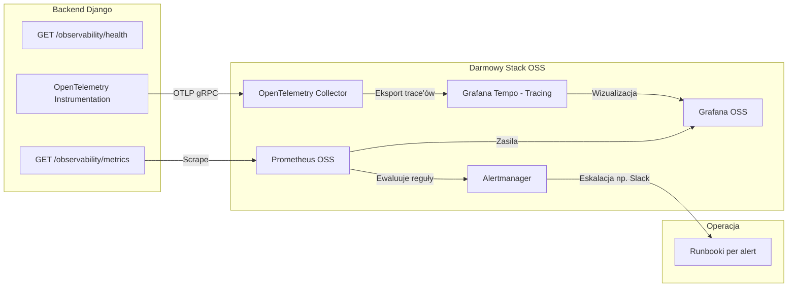

# Plan wdrożenia PRD 3.5 – Observability i gotowość operacyjna

## Decyzja architektoniczna

Zgodnie z weryfikacją architektury odchodzimy od budowania zaawansowanych mechanizmów agregacji, okien czasowych oraz dashboardów utrzymaniowych wewnątrz samego Django (np. w Django Unfold). 
Wykorzystujemy **w 100% darmowy stack Open Source**:

- **Prometheus OSS** – baza danych szeregów czasowych, zbierająca metryki w czasie rzeczywistym.
- **Grafana OSS** – platforma do wizualizacji dashboardu utrzymaniowego.
- **Prometheus Alertmanager** – menedżer reguł powiadomień (24/7, eskalacje).

Pozwala to odciążyć bazę transakcyjną PostgreSQL oraz uniknąć w aplikacji Django tzw. "metryk wyliczanych w locie".

## Źródła wymagań

- **[.ai/prd.md](.ai/prd.md) §3.5** – wymaganie obowiązkowe: metryki (outbox, integracje, import, dokumenty), dwa dashboardy operacyjne (recepcja w Django, utrzymanie w Grafanie), alerting 24/7 z progami i eskalacją, runbook przy każdym alercie.

---

## Stan implementacji (as-is)

| Obszar                  | Zaimplementowane                                                                                                          | Braki                                                                                                                                           |
| ----------------------- | ------------------------------------------------------------------------------------------------------------------------- | ----------------------------------------------------------------------------------------------------------------------------------------------- |
| **Health**              | [apps/operations/api_views.py](apps/operations/api_views.py) – `observability_health_view` bez auth; sprawdza DB, outbox. | Zawiera złożoną logikę okien czasowych (np. "failed >10 min", "success ratio 1h"), która powinna być zrealizowana w PromQL, a nie na bazie SQL. |
| **Metryki Prometheus**  | [apps/operations/metrics.py](apps/operations/metrics.py) – wyliczane "w locie" success_ratio_1h, latency p95.             | Brak surowych liczników (Counters) i Histogramów (do liczenia p95/p99 i success ratio w PromQL). Brak metryk importu.                           |
| **Endpoint metrics**    | GET `/api/v1/observability/metrics` – wymaga **ADMIN**.                                                                   | Scraper Prometheusa potrzebuje prostego dostępu (np. Basic Auth, Bearer Token) do zrzucania danych co kilkanaście sekund.                       |
| **Dashboardy**          | Lista lekarza pokazuje błędy.                                                                                             | Brak UI "dashboard recepcji" w Django; Brak dashboardu "utrzymanie" w Grafanie.                                                                 |
| **Alerting i Runbooki** | Tylko JSON w health; jeden runbook dla tłumaczeń.                                                                         | Brak wdrożenia Prometheus Alertmanager i kompletu plików markdown dla alertów w repo.                                                           |
| **Tracing (OTel)**      | Zależności `opentelemetry-*` dodane do `requirements.txt`. | Brak instrumentacji, konfiguracji i eksportu logów/trace'ów z aplikacji; brak kolektora OTel i wizualizacji (Jaeger/Tempo). |

---

## Proponowana architektura

---

## Kolejność zadań

### 1. Przebudowa metryk Prometheus na surowe eventy (backend)

Zamiast wyliczać wartości statystyczne w SQL (co obciąży bazę), emitujemy podstawowe wielkości dla Prometheusa w `apps/operations/metrics.py`:

- `cogitomedica_outbox_events_total` (Counter, labels: event_type, status) - zastępuje query o ratio i zliczenia w czasie.
- `cogitomedica_outbox_processing_duration_seconds` (Histogram, labels: event_type) - zastępuje ciężkie zapytania p95/p99.
- `cogitomedica_outbox_pending_age_seconds` (Gauge, labels: event_type) - pomiar najstarszego eventu.
- `cogitomedica_import_batches_total` (Counter, labels: status).
- `cogitomedica_import_rows_total` (Counter, labels: status np. inserted/error).
*Powyższe pozwala przenieść logikę agregacji (okna czasowe, success ratio) całkowicie do PromQL.*

### 2. Uproszczenie `/observability/health`

Usunięcie z endpointu `health` logiki czasowej ("błąd od ponad 10 minut", "ratio < 98%"). `health` powinien weryfikować jedynie, czy procesy żyją (połączenie z DB, widoczność HiDrive/SMS). Eskalacje czasowe przejmie całkowicie Alertmanager.

### 3. Zabezpieczenie endpointu metrics dla Prometheusa

- Modyfikacja autoryzacji na GET `/api/v1/observability/metrics`: wprowadzenie stałego `Bearer token` zdefiniowanego w pliku `.env` (np. `PROMETHEUS_METRICS_TOKEN`), z którego korzystać będzie zewnętrzny Prometheus.

### 4. Dashboard recepcji w Django (UI)

- Stworzenie prostego widoku w panelu administracyjnym Django/Unfold dla recepcji pokazującego operacyjne dane "tu i teraz":
  - Ostatnie importy pacjentów (status, błędy).
  - Zaległe dokumenty (liczba zdarzeń w `FAILED`/`DEAD_LETTER`).
  - Odnośniki do ręcznych akcji ponowienia (Retry).

### 5. Konfiguracja Grafana OSS i Prometheus (Darmowy Stack)

- Dodanie kontenerów `prometheus`, `alertmanager`, `grafana` do `docker-compose.yml`.
- Przygotowanie pliku konfiguracyjnego `prometheus.yml` (scrape jobs do serwera Django z tokenem).
- Budowa dashboardu utrzymaniowego w Grafanie: wizualizacja SLO/SLI, success ratio (korzystając z `rate()`), percentyle p95/p99 (korzystając z `histogram_quantile()`). Plik dashboardu (JSON) zapisany w repozytorium (Dashboard-as-code).

### 6. Reguły Alertmanager i Runbooki

- Zdefiniowanie reguł (alerts) w Prometheusze zgodnie z limitami biznesowymi (PRD 3.5), np.:
  - `Alert: OutboxBacklogTooOld` (jeśli `oldest_pending_age_seconds > 900`)
  - `Alert: IntegrationErrorSpike` (jeśli `rate(errors[10m]) > 0`)
  - `Alert: LowSuccessRatio` (success ratio < 0.98 w ciągu 1h).
- Utworzenie folderu `docs/runbooks/` z plikami Markdown (np. `OUTBOX_BACKLOG_AGE.md`, `INTEGRATION_ERROR.md`) z konkretnymi krokami operacyjnymi naprawy błędu. Alertmanager w powiadomieniu (Slack/Email) dokleja link do runbooka.

### 7. Pełny wgląd i Tracing (OpenTelemetry)
- **Problem:** Obecnie widzimy błędy, czasy i alerty w ujęciu zagregowanym. Wiemy że był błąd integracji, ale nie widzimy całej drogi pojedynczego żądania (od akcji użytkownika do błędu).
- **Rozwiązanie:** 
  1. Instalacja paczek `opentelemetry-instrumentation-django`, `requests` itp.
  2. Ręczna instrumentacja kluczowych metod (np. `generate_pdf_task`, metody wysyłające SMS/HiDrive) przez dołączenie atrybutów biznesowych (np. `document_id`) do Spanów i obsługę `span.record_exception(e)`.
  3. Skonfigurowanie eksportera OTLP w Django i uruchomienie instancji OTel Collector + bazy do trzymania trace'ów (np. Grafana Tempo lub Jaeger) w `docker-compose.yml`.
  4. Dodanie w Grafanie opcji skoku z loga/błędu wprost do interfejsu graficznego dla danego Trace ID, prezentującego "wodospad" czasów i komunikatów o błędach.

---

## Podsumowanie etapów

1. **Faza 1 (Refaktoryzacja Backend):** Zadanie 1 (surowe metryki), Zadanie 2 (lekki health), Zadanie 3 (token dla metrics).
2. **Faza 2 (Recepcja UI):** Zadanie 4 (dashboard w Django).
3. **Faza 3 (Infrastruktura OSS):** Zadanie 5 (Grafana+Prometheus w Dockerze) oraz Zadanie 6 (Alertmanager + Runbooki).
4. **Faza 4 (Tracing/OTel - Przyszłość):** Zadanie 7 (Instrumentacja aplikacji i dodanie stosu OTel Collector + Tempo/Jaeger dla pełnego Distributed Tracingu, co zapewni precyzyjne śledzenie źródła pojedynczego requestu/błędu).

