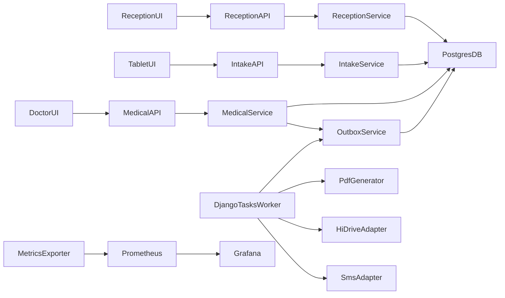

# Plan implementacji Cogitomedica (PRD + DB)

## Kontekst startowy

- Repo jest obecnie blisko stanu greenfield (aktywny szkielet Django: `[manage.py](C:/Users/piotr/Programming/cogitomedica/manage.py)`, `[cogitomedica/settings.py](C:/Users/piotr/Programming/cogitomedica/cogitomedica/settings.py)`, `[cogitomedica/urls.py](C:/Users/piotr/Programming/cogitomedica/cogitomedica/urls.py)`).
- Wymagania domenowe i model danych są już dobrze zdefiniowane w `[/.ai/prd.md](C:/Users/piotr/Programming/cogitomedica/.ai/prd.md)` i `[/.ai/db-plan.md](C:/Users/piotr/Programming/cogitomedica/.ai/db-plan.md)`.
- Priorytet: architektura warstwowa (API -> serializers/schemas -> services -> models), idempotentna publikacja, outbox, Django Tasks, testy przejść stanów i observability.

## Stan bieżący (aktualizacja)

- Etap 1 i Etap 2 oznaczone jako ukończone (foundation + modele/migracje).
- Runtime backendu podniesiony do Django 6.0.x, a mechanizm zadań tła ujednolicony do jednego rozwiązania: **Django Tasks + Transactional Outbox**.
- Dokumentacje projektowe (`README.md`, `.ai/prd.md`, `.ai/db-plan.md`, `.ai/api-plan.md`, `.ai/api-plan-pl.md`) zaktualizowane pod Django 6 i `django.tasks`.
- Zredukowano dług w zależnościach: aktualizacje krytycznych bibliotek HTTP/TLS, usunięcie duplikatu `dotenv`, usunięcie nieużywanych `django-select2`, `reportlab`, `PyPDF2`, dodanie `requirements-dev.txt` (pytest + QA), przejście na `psycopg`.
- Zaimplementowano kluczowe serwisy domenowe i testy: Faza 1 (`reception` + `intake`), Faza 2 (`medical`), pipeline outbox oraz bazowy audit trail.
- Decyzja wykonawcza: **API jest aktualnie najwyższym priorytetem**, a walidacja payloadów JSON ma być realizowana przez **Pydantic v2**.
- Dowieziono endpointy API v1: `daily-queues`, `queue-entries`, `clinic-sites`, `consulting-rooms`, `tablet-devices` (+ `heartbeat`), `**patients`** (list/search, create, detail/PATCH), `staff-users` (list/create/detail/update/deactivate) – z walidacją Pydantic i testami API. (Historia kontaktów `patient-contact-history` została wycofana z produktu.)
- **Ostatnie zmiany (backend + docs):**
  - **Pacjenci:** walidacja Pydantic dla `phone` (regex zgodny z DB), walidacja `date_of_birth` w GET (PatientsListQuery, format YYYY-MM-DD); usunięcie `created_by_user_id` z body tworzenia pacjenta (aktor wyłącznie z sesji).
  - **RBAC:** endpointy recepcji i intake przyjmują także rolę **TABLET** tam, gdzie przewidziano w planie poczekalni (lista kolejek, lista wpisów, POST sessions, formularz intake – tylko odczyt danych pacjenta + anamneza/zgody/podpis/submit); RECEPTION/ADMIN bez zmian; medical – DOCTOR/ADMIN.
  - **Medical:** błędy domenowe szablonów (TemplatePermissionError) zwracane jako **400** zamiast 403 (ujednolicenie z code-review).
  - **OpenAPI/Swagger:** dodane `components.securitySchemes` (session cookie) oraz `security` na operacjach – w dokumentacji widoczna **ikona kłódki** przy endpointach wymagających logowania; wyjątki: health, metrics, auth/login.
  - `.ai/api-plan.md` i `.ai/api-plan-pl.md` zaktualizowane (date_of_birth GET, POST patients bez created_by_user_id, błędy walidacji).
- Zweryfikowano uruchamianie testów w środowisku Docker; testy modułowe i API recepcji/medical przechodzą.
- **Następny krok (propozycja poniżej):** zamrożenie kontraktu API dla panelu staff i/lub uzupełnienie luk (np. GET lista dokumentów medycznych) przed frontem Django Staff (Unfold).
- **Proces poczekalni (uproszczony):** tablet na wyposażeniu rejestracji, zalogowany na rolę **TABLET**. Recepcja na tablecie **wybiera kolejkę** z listy dzisiejszych kolejek (brak twardego przypisania w panelu), potem pacjenta z listy → ekran weryfikacji danych → formularz intake. **Bez tokenu** – sesja formularza bez pola token; migracje: usunięcie `token_hash` z `patient_form_session`, zastąpienie w `tablet_device` pól `name`/`device_code` przez **tylko `android_id`**. Szczegóły: **[.ai/proces-poczekalni.md](../../.ai/proces-poczekalni.md)**.

## Docelowa architektura modułów

- Utwórz aplikacje Django (proponowany podział):
  - `apps/core` (wspólne: błędy domenowe, typy, utils, base model, telemetry).
  - `apps/users` (custom `staff_user`, role i auth).
  - `apps/reception` (patient, daily_queue, queue_entry, tablet session, import).
  - `apps/intake` (zgody, ankieta, body map, podpis).
  - `apps/medical` (medical_document, wersje, szablony lekarza).
  - `apps/outbox` (outbox_event + zadania Django Tasks).
  - `apps/integrations` (HiDrive mock/API, SMS provider).
  - `apps/operations` (audit_event, runbook hooks, metryki operacyjne).
- Utrzymaj kontrakty i routing API w osobnych pakietach `api/serializers/services` per aplikacja.

## Etap 1: Fundament techniczny i standardy

- Skonfiguruj ustawienia aplikacji i środowisk (`dev/test/prod`) w `[cogitomedica/settings.py](C:/Users/piotr/Programming/cogitomedica/cogitomedica/settings.py)`:
  - `AUTH_USER_MODEL`, `LANGUAGES` (`de`, `en`), timezone, security flags per env, OpenTelemetry, Prometheus.
  - Rejestracja `TASKS`, limity batch/retry/circuit-breaker dla outbox.
- Dodaj wspólne mechanizmy:
  - bazowe klasy modeli (`UUID`, `created_at`, `updated_at`),
  - globalny handler błędów domenowych -> HTTP,
  - wspólne typed DTO (Pydantic/DRF) dla JSON payloadów (`schema_version`).
- Ustal standard testów `pytest` + `pytest-django` i fixture factory dla ról (`RECEPTION`, `DOCTOR`, `ADMIN`).

## Etap 2: Model danych i migracje (DB-first)

- Zaimplementuj modele i migracje 1:1 wg `[/.ai/db-plan.md](C:/Users/piotr/Programming/cogitomedica/.ai/db-plan.md)`:
  - ENUM-y, constraints, unique keys, partial indexes, GIN indexes, `citext`, `pgcrypto`.
  - Priorytet tabel krytycznych: `staff_user`, `patient`, `daily_queue`, `queue_entry`, `patient_form_session`, `patient_intake_form`, `medical_document`, `medical_document_version`, `outbox_event`, `patient_import_*`.
- Wydziel migracje na paczki tematyczne (identity/queue/intake/medical/outbox/import), aby uprościć rollback i review. **Proces poczekalni:** migracje wycofania tokenu (usunięcie `token_hash` z `patient_form_session`) oraz TabletDevice (usunięcie `name`/`device_code`, wprowadzenie tylko `android_id`).
- Dodaj testy integralności DB (constraint tests) dla: statusów, idempotency key, retencji; sesja bez tokenu.

## Etap 3: Faza 1 PRD (Recepcja + Tablet, API-first)

- Priorytet realizacji w tym etapie:
  - najpierw endpointy API (DRF) oparte o istniejące serwisy domenowe,
  - następnie domknięcie walidacji kontraktów i testów E2E.
- Zaimplementuj serwisy domenowe:
  - `create_or_update_patient_manual()` z `TEMPORARY` + alert admin przy braku `doctolib_patient_id`.
  - `create_queue_entry()` z dopuszczeniem wielu wizyt/dzień.
  - Tworzenie sesji formularza (latest-wins) **bez tokenu** – `issue_tablet_session_`* zwraca `intake_form_id`; autoryzacja tabletu: rola TABLET + zakres kolejki. Migracja usuwa `token_hash` z `patient_form_session`.
  - `submit_patient_intake_form()` z walidacją wymaganych zgód i pytań anamnestycznych.
- Zaimplementuj API i walidację payloadów:
  - intake (`anamnesis_payload`, `body_map_data`, podpis),
  - locale-aware słowniki pytań/zgód (DE/EN, neutralne kody w DB).
  - walidacja kontraktów JSON przez **Pydantic v2** (`schema_version` obowiązkowe).
- Dodaj testy przejść stanu `queue_entry` i `patient_intake_form` (pozytywne + negatywne).

## Etap 4: Faza 2 PRD (Panel lekarza + publikacja)

- Zaimplementuj dokument medyczny i wersjonowanie:
  - `save_draft_document_version()`,
  - `publish_document_version()` z `transaction.atomic` + `select_for_update` + idempotencja (`publish_request_id` i/lub in-progress guard).
- Zaimplementuj US-019 (szablony lekarza DE/EN):
  - CRUD szablonów lekarza (`create/update/activate/deactivate`),
  - rozróżnienie uprawnień dla szablonów globalnych (klinika) i prywatnych (per lekarz),
  - użycie szablonu bazowego przy zapisie draft i zapis `generated_text`/`edited_text`.
- Wprowadź kontrakt `medical_payload` v1 (global + lesions, `generated_text`/`edited_text`, template context).
- Wdroż walidację `medical_payload` przez **Pydantic v2** (wersjonowanie schematu + kompatybilność wsteczna).
- Dodaj logikę republish (edycja opublikowanego dokumentu -> nowa wersja, ta sama ścieżka HiDrive, opcjonalny SMS).
- Pokryj testami scenariusze wyścigów (podwójne kliknięcie publish, retry publish).

## Etap 5: Outbox + Django Tasks + integracje

- Zbuduj przetwarzanie outbox przez Django Tasks (cykliczne enqueue):
  - sekwencja `GENERATE_PDF -> HIDRIVE_UPLOAD -> SMS_SEND`,
  - lockowanie `FOR UPDATE SKIP LOCKED`, retry/backoff, `DEAD_LETTER`.
- Faza 1-2: adapter HiDrive mock zgodny z docelowym kontraktem.
- Faza 3: adapter API HiDrive + import dzienny `.xlsx/.csv` (manual + harmonogram).
- Dodaj retencję 30 dni: usuń lokalny PDF tylko gdy `hidrive_sent=true && sms_sent=true` + audit event.

## Etap 6: Observability, alerting i runbooki

- Dodaj metryki OTel/Prometheus wymagane przez PRD:
  - outbox (`pending_count`, `failed_count`, `dead_letter_count`, `oldest_pending_age_seconds`, latency p95/p99),
  - integracje (success ratio/error rate),
  - import (`row_error_rate`, processing time),
  - dokumenty (publish->hidrive/sms delay).
- Przygotuj dashboardy (recepcja i utrzymanie) i reguły alertów z progami PRD.
- Dla outbox/import/integracji dodaj runbooki operacyjne do repo.
- Dodaj audit trail zdarzeń domenowych i operacyjnych jako obowiązkowy kontrakt:
  - m.in. `DOCUMENT_DRAFT_SAVED`, `DOCUMENT_PUBLISHED`, `DOCUMENT_REPUBLISHED`, `RETENTION_FILE_DELETED` (edycje tekstu Befundu są audytowane przez zapis szkicu / publikację — bez osobnego typu `MEDICAL_TEXT_EDITED`),
  - spójne metadane (`actor`, `timestamp`, `entity_id`, `reason`) i testy integralności logowania.

## Etap 7: Hardening i gotowość produkcyjna

- Security hardening: env-only secrets, secure cookies/HTTPS/HSTS (prod), minimalizacja PII w logach.
- Auth/session hardening (US-001):
  - timeout sesji po bezczynności, rotacja/odświeżanie sesji i właściwe ustawienia cookie (`Secure`, `HttpOnly`, `SameSite`),
  - testy negatywne dla wygasłych sesji i niedozwolonego dostępu między rolami.
- Testy E2E krytycznych flow:
  - manual intake -> publish -> outbox complete,
  - republish,
  - import z błędnymi wierszami,
  - sesja formularza (latest-wins, bez tokenu).
- Performance sanity:
  - p95 ładowania formularza,
  - p95 czasu ścieżki publish->HiDrive->SMS.
- DoD release:
  - migracje odtwarzalne,
  - test suite green,
  - alerty i dashboardy aktywne,
  - runbooki dostępne dla dyżuru.

## Kluczowe pliki do utworzenia/rozszerzenia

- Konfiguracja i entrypointy:
  - `[cogitomedica/settings.py](C:/Users/piotr/Programming/cogitomedica/cogitomedica/settings.py)`
  - `[cogitomedica/urls.py](C:/Users/piotr/Programming/cogitomedica/cogitomedica/urls.py)`
- Specyfikacje i kontrakty:
  - `[/.ai/prd.md](C:/Users/piotr/Programming/cogitomedica/.ai/prd.md)`
  - `[/.ai/db-plan.md](C:/Users/piotr/Programming/cogitomedica/.ai/db-plan.md)`
- Nowe moduły aplikacyjne (do utworzenia):
  - `apps/users/`*, `apps/reception/`*, `apps/intake/*`, `apps/medical/*`, `apps/outbox/*`, `apps/integrations/*`, `apps/operations/*`.

## Proponowany kolejny krok

**Zamrożenie kontraktu API dla panelu staff + ewentualne uzupełnienie luk (przed frontem Django Staff).**

1. **Staff API contract (zalecane jako pierwsze)**
  Spisać w jednym miejscu (np. `.ai/staff-api-contract.md`) listę endpointów używanych przez panel staff (recepcja, lekarz, admin/ops), z metodami, payloadami i kodami błędów – na podstawie **obecnej implementacji** w kodzie (source of truth). To pozwoli budować front bez rozjazdów z backendem.
2. **Luki do rozstrzygnięcia przed lub równolegle z frontem**
  - **GET lista dokumentów medycznych:** w `.ai/api-plan.md` jest `GET /medical-documents` z filtrami (status, queue_date, doctor_view, patient_search), w kodzie jest tylko **POST** (tworzenie). Panel lekarza potrzebuje listy pracy – dodać endpoint GET z paginacją i filtrami albo uzgodnić alternatywną ścieżkę (np. lista po queue_entry / dacie).  
  - **Operacje admin/ops:** endpointy `operations/outbox/process` i `operations/retention/run` są obecnie dostępne dla dowolnego zalogowanego użytkownika. Przed produkcją dodać `require_user_role(..., allowed_roles={"ADMIN"})` (lub osobną rolę ops), zgodnie z planem frontu staff.
3. **Alternatywa / równolegle**
  Po (lub zamiast) punktu 1 można od razu przejść do **planu frontu staff** (`.cursor/plans/plan_django_staff_frontend.plan.md`): integracja Django Unfold, shell SSR pod `/staff/`, recepcja MVP, lekarz MVP, ops MVP. Kontrakt z punktu 1 można uzupełniać w trakcie.

**Rekomendacja:** wykonać punkt 1 (dokument kontraktu staff), rozstrzygnąć GET medical-documents i RBAC dla operations, a następnie uruchomić fazę Unfold + shell staff.

---

## Proponowana kolejność realizacji (sprintowo)

- Sprint 0: Etap 1 + skeleton Etapu 2.
- Sprint 1: dokończenie Etapu 2 + Etap 3 (MVP recepcja/tablet).
- Sprint 2: Etap 4 + core Etapu 5 (publish pipeline na mockach).
- Sprint 3: Etap 5 (HiDrive API + import Faza 3) + Etap 6.
- Sprint 4: Etap 7 + stabilizacja + release readiness.

