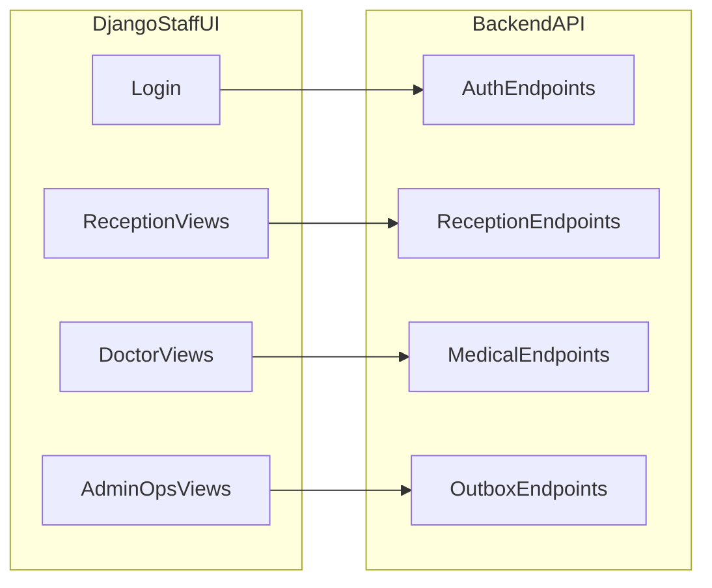

# Plan frontendu staff w Django

## Cel

Dostarczyć stabilny panel personelu (`RECEPTION`, `DOCTOR`, `ADMIN`) w Django SSR bez uzależniania delivery od pełnego frontendu SPA.

## Zakres MVP

- Logowanie i sesja staff (`/auth/login`, `/auth/me`, `/auth/logout`) w oparciu o Django views + templates.
- Recepcja: kolejki dzienne, wpisy kolejki, pacjenci, generowanie sesji tabletu.
- Lekarz: tworzenie dokumentu, zapis draftu, publikacja (na istniejących endpointach).
- Admin/Ops: outbox list/retry/process, retencja, podstawowy health/metrics status.

## Django Unfold – wykorzystanie

- **Motyw i layout:** Tailwind CSS, ciemny/jasny tryb, sidebar z ikonami i zwijaniem sekcji. Wszystkie widoki staff (recepcja, lekarz, admin) renderowane w tym samym layoutcie Unfold.
- **MVP:** własny `AdminSite` (Unfold), bazowy sidebar z linkami per rola, strony list/detail/form zbudowane jako widoki Django (custom lub `ModelAdmin` z Unfold), wywołujące API w tle. Formularze i tabele w stylu Unfold (klasy CSS / komponenty szablonów).
- **Iteracja 2+:** command palette, zaawansowane filtry; ewentualne rejestrowanie modeli w Unfold tam, gdzie CRUD idzie wprost na modele Django zamiast API. Zaawansowane statystyki i wykresy utrzymaniowe zrealizowane poza Django za pomocą Prometheus i Grafana.

## Zakres poza MVP (iteracja 2+)

- Zaawansowane filtry i procesy domenowe, ewentualnie proste runbooki UI (główny dashboard utrzymaniowy zrealizowany w Grafana OSS).
- Rozbudowane zarządzanie słownikami medycznymi i szablonami lekarza (ponad minimum CRUD).

## Kluczowe założenia techniczne

- Front staff pozostaje SSR (`Django templates`) z punktowym HTMX/JS.
- **UI staff oparte o [Django Unfold](https://github.com/unfoldadmin/django-unfold):** nowoczesny motyw admina (Tailwind CSS, dark mode, sidebar z ikonami i grupowaniem). Panel staff korzysta z Unfold jako warstwy prezentacji – spójny layout, nawigacja boczna, filtry i komponenty (widgety, dashboardy w iteracji 2+). Instalacja: `pip install django-unfold`, dopisanie `unfold` do `INSTALLED_APPS`, konfiguracja `UNFOLD` w `settings.py`; własny `AdminSite` (np. `UnfoldAdminSite`) jako punkt wejścia dla widoków staff.
- Jeden model auth dla staff: `session + CSRF`.
- Brak logiki domenowej w widokach frontu; front mapuje tylko request/response.
- Obsługa błędów API centralnie (mapowanie 400/401/403/404/409).

## Ryzyka i kontrola

- Rozjazd plan API vs kod: traktować kod backendu jako source-of-truth i uzupełnić brakujące endpointy dopiero gdy niezbędne.
- Brak GET listy dokumentów medycznych: dostarczyć minimalną listę pracy lekarza albo uzgodnić endpoint backendowy przed UI.
- Endpointy operacyjne bez twardego RBAC: dodać kontrolę roli `ADMIN` przed wystawieniem UI produkcyjnie.

## Fazy realizacji

1. **Shell aplikacji staff**
  - **Integracja Django Unfold:** instalacja pakietu, `INSTALLED_APPS`, konfiguracja `UNFOLD` (np. `UNFOLD["SIDEBAR"]`, kolory, tytuł). Własny `AdminSite` dziedziczący po Unfold dla panelu staff (nie mieszanie z domyślnym adminem Django). Bazowy layout: sidebar z nawigacją per rola (Recepcja / Lekarz / Admin), header z użytkownikiem i wylogowaniem. Widoki logowania (login/logout) poza Unfold lub jako strona logowania Unfold; po zalogowaniu przekierowanie do dashboardu/strony startowej w Unfold.
  - Routing (urls) pod ścieżką staff (np. `/staff/`), middleware i18n, komponenty komunikatów i błędów w stylu Unfold (toasty/alerty).
  - Pliki: [C:\Users\piotr\Programming\cogitomedica\apps\users\api_views.py](C:\Users\piotr\Programming\cogitomedica\apps\users\api_views.py), [C:\Users\piotr\Programming\cogitomedica\apps\core\api_utils.py](C:\Users\piotr\Programming\cogitomedica\apps\core\api_utils.py), [C:\Users\piotr\Programming\cogitomedica\cogitomedica\settings.py](C:\Users\piotr\Programming\cogitomedica\cogitomedica\settings.py)
2. **Recepcja MVP**
  - Lista kolejek, wpisy, CRUD pacjentów, generowanie sesji tabletu.
  - Pliki: [C:\Users\piotr\Programming\cogitomedica\apps\reception\api_views_split\patients.py](C:\Users\piotr\Programming\cogitomedica\apps\reception\api_views_split\patients.py), [C:\Users\piotr\Programming\cogitomedica\apps\reception\api_views_split\dictionaries.py](C:\Users\piotr\Programming\cogitomedica\apps\reception\api_views_split\dictionaries.py), [C:\Users\piotr\Programming\cogitomedica\apps\reception\api_views_split\devices.py](C:\Users\piotr\Programming\cogitomedica\apps\reception\api_views_split\devices.py)
3. **Lekarz MVP na istniejącym API**
  - Create document -> draft (`PUT`) -> publish (`POST`) + statusy processing.
  - Pliki: [C:\Users\piotr\Programming\cogitomedica\apps\medical\api_views.py](C:\Users\piotr\Programming\cogitomedica\apps\medical\api_views.py)
4. **Admin/Ops MVP**
  - Outbox events, retry, process, retention; health check widoczny dla admina.
  - Pliki: [C:\Users\piotr\Programming\cogitomedica\apps\outbox\api_views.py](C:\Users\piotr\Programming\cogitomedica\apps\outbox\api_views.py)
5. **Hardening i UAT**
  - Spójność i18n EN/DE, walidacje, testy regresji krytycznych ścieżek staff.

## Kryteria gotowości (DoR/DoD)

- Każdy ekran staff ma zdefiniowany kontrakt endpointów (metoda, payload, kody błędów).
- Każda akcja krytyczna ma scenariusz błędu i retry.
- Testy E2E obejmują: login -> recepcja -> dokument lekarza -> publikacja -> status outbox.

## Diagram przepływu staff

