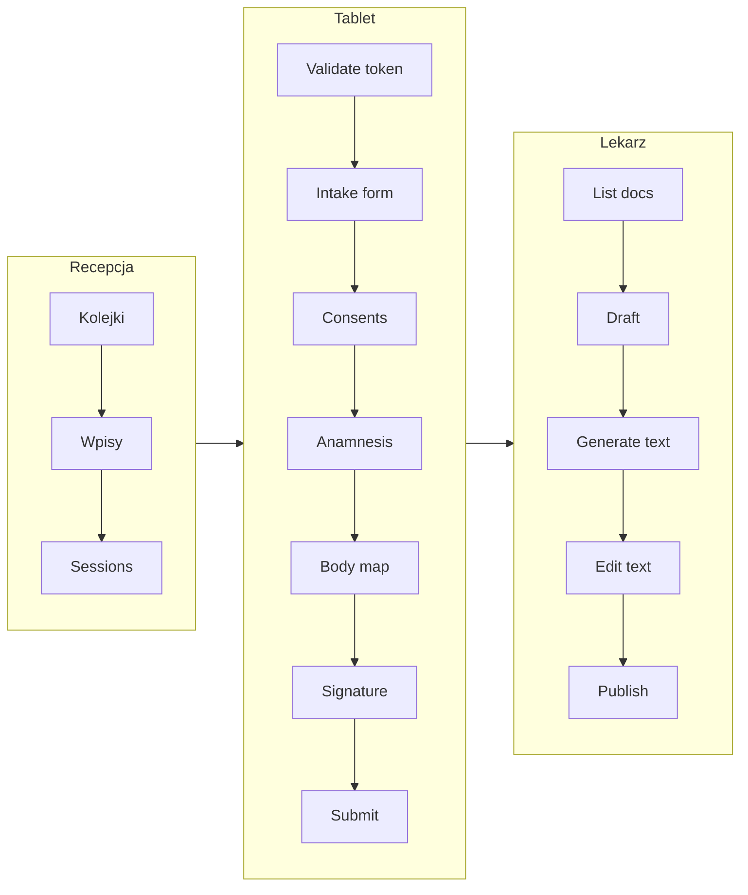

# Plan dla frontendowca – Cogitomedica Digital Consents

Plan oparty o [.ai/prd.md](.ai/prd.md) (wymagania produktu) oraz [.ai/api-plan.md](.ai/api-plan.md) (REST API). **Główny framework: Django** – frontend to warstwa szablonów i widoków Django (SSR), z istniejącym API JSON pod `/api/v1` jako zapleczem danych.

---

## 1. Zakres i kontekst

- **Języki UI:** angielski i niemiecki (preferencja użytkownika / locale z linku tabletu).
- **Urządzenia:** panel personelu (desktop), **4 tablety** dla pacjentów (RWD, obsługa dotykowa).
- **Auth:** sesja (cookie + CSRF) dla personelu; **token jednorazowy** w URL dla tabletu (Bearer w requestach po walidacji).
- **API:** baza `/api/v1`, JSON, paginacja `page`, `page_size`, `ordering`; format błędów: `{"error": "...", "details": ...}` (np. 400/401/403/404/409/422).

---

## 2. Stos technologiczny (Django jako główny framework)

- **Frontend = Django:** widoki (views) zwracające HTML, szablony (templates), formularze Django (forms) lub ręczne formularze HTML. Routing: `urls.py` w aplikacjach (osobne ścieżki dla portalu personelu vs. formularza tabletu pacjenta).
- **Dane:** widoki mogą wywoływać wewnętrznie modele/serwisy Django **albo** wykonywać requesty do własnego API (`/api/v1`) z serwera (np. `requests` / `httpx`) i przekazywać dane do kontekstu szablonu. Alternatywa: szablony + JavaScript wywołujący `/api/v1` z przeglądarki (fetch) – wtedy CSRF i cookie sesji jak w api-plan.
- **Interakcja:** klasyczne POST/GET (odświeżenie strony) lub **HTMX** dla częściowego odświeżania bez pełnego przeładowania; opcjonalnie **Alpine.js** dla prostego stanu po stronie klienta (np. rozwijane sekcje, toasty). Formularze tabletu (schemat ciała, podpis, wielokrotne zapisy) – fragmenty z fetch do API z JS.
- **Auth:** logowanie przez widok Django (formularz POST do widoku, który wywołuje `POST /api/v1/auth/login` lub bezpośrednio `django.contrib.auth`) i sesja Django; w szablonach dostęp do `request.user` i roli. Dla tabletu: osobna ścieżka bez sesji personelu, walidacja tokenu z URL przez API.
- **i18n:** `django.utils.translation` (gettext), `LANGUAGE_CODE` i middleware locale; pliki `.po`/`.mo` dla języków (np. `en`, `de`). Locale użytkownika z `request.user.preferred_locale` (jeśli model to ma) lub z parametru `?locale=` na tablecie.
- **Statyczne:** `STATIC_URL`, `django.contrib.staticfiles`; CSS/JS w `static/` aplikacji lub wspólnego katalogu. Brak wymogu osobnego buildu SPA (opcjonalnie npm tylko pod bundle HTMX/Alpine lub lekki JS formularza tabletu).

Proponowana struktura (w ramach istniejącego projektu Django):

- **Aplikacje Django:** `reception` (już częściowo – rozszerzyć o widoki/szablony), `patient_form` (formularz tabletu), `doctor` (panel lekarza), `users` (login, profil), `admin_ops` (merge, outbox, dashboardy). Słowniki w `reception` lub osobna app `dictionaries`.
- **Szablony:** `templates/` w każdej app lub wspólny `templates/` z namespace `reception/`, `doctor/`, `patient_form/`, `registration/` (login/logout).
- **Widoki:** Class-based (ListView, CreateView, FormView) lub function-based; wywołania API z serwera w helperach/serwisach (np. `core.api_client`) lub przekazanie `API_BASE_URL` do szablonu i wywołania z JS.
- **Wspólne:** bazowy szablon z menu (zależne od roli), bloki na komunikaty błędów/sukcesu, CSRF token w formularzach.

---

## 3. Mapowanie przepływów na API i zadania

### 3.1 Uwierzytelnienie personelu (US-001)

- **Ekran:** Login (login + hasło).
- **API:**  
  - `POST /api/v1/auth/login` → `{ user, session_expires_at }`; błędy: 400, 401, 429.  
  - `GET /api/v1/auth/me` → dane zalogowanego użytkownika i rola (RECEPTION | DOCTOR | ADMIN).  
  - `POST /api/v1/auth/logout`.
- **Zadania:** strona logowania, przechowywanie stanu sesji, przekierowanie po 401 na login, wyświetlanie ogólnego komunikatu przy błędzie logowania (bez ujawniania „użytkownik vs. hasło”). Opcjonalnie: licznik czasu do wygaśnięcia sesji (np. na podstawie `session_expires_at`).

---

### 3.2 Recepcja – listy dzienne i pacjenci (US-002, US-003, US-004)

- **Kolejki dzienne:**  
  - `GET /api/v1/daily-queues` (parametry: `queue_date`, `clinic_site_id`, `consulting_room_id`, `shift_code`, `status`).  
  - `POST /api/v1/daily-queues`, `PATCH /api/v1/daily-queues/{id}` (np. zamknięcie kolejki).
- **Wpisy kolejki (Poczekalnia):**  
  - `GET /api/v1/daily-queues/{id}/entries` (filtr `entry_status`, `patient_id`, `ordering`).  
  - `POST /api/v1/daily-queues/{id}/entries` (dodanie pacjenta do kolejki).  
  - `GET/PATCH/DELETE /api/v1/queue-entries/{id}` (np. zmiana statusu, anulowanie).
- **Pacjenci:**  
  - `GET /api/v1/patients` (search, filtry: `identity_status`, `doctolib_patient_id` itd.).  
  - `POST /api/v1/patients` (ręczne dodanie; przy braku `doctolib_patient_id` odpowiedź zawiera `identity_alert` – pokazać alert w UI).  
  - `GET/PATCH /api/v1/patients/{id}`.
- **Link na tablet (US-004):**  
  - `POST /api/v1/queue-entries/{id}/sessions` → `{ session_id, launch_url, expires_at }`.  
  - UI: przy wpisie kolejki przycisk „Otwórz na tablecie” – otwarcie `launch_url` (lub skopiowanie). Model „latest-wins”: nowy link unieważnia poprzedni.

Zadania: widok listy kolejek, wybór kolejki → lista wpisów (Poczekalnia), formularz dodania pacjenta (ręcznie), formularz dodania do kolejki, generowanie i otwarcie linku tabletu. Słowniki: `GET /api/v1/clinic-sites`, `GET /api/v1/consulting-rooms` (np. do filtrów/selectów).

---

### 3.3 Import pacjentów (US-003, US-011, US-015, US-017)

- **Import pliku:**  
  - `POST /api/v1/imports/patients` (multipart, opcjonalnie `mode=daily|scheduled`).  
  - `POST /api/v1/imports/patients/emergency` – ścieżka awaryjna (szablon .xlsx).
- **Status i błędy:**  
  - `GET /api/v1/imports/batches`, `GET /api/v1/imports/batches/{id}`, `GET /api/v1/imports/batches/{id}/errors`.  
  - `GET /api/v1/imports/templates/emergency.xlsx` – pobranie szablonu awaryjnego.

Zadania: ekran uploadu pliku (csv/xlsx), lista batchy z statusem (PROCESSING, COMPLETED, COMPLETED_WITH_ERRORS), podgląd błędów wierszy; link do pobrania szablonu awaryjnego i krótka instrukcja (runbook).

---

### 3.4 Interfejs pacjenta – tablet (US-005, US-006, US-007, US-016)

Przepływ: użytkownik wchodzi na `launch_url` (token w query). Aplikacja najpierw waliduje token, potem ładuje formularz.

- **Walidacja tokenu:**  
  - `POST /api/v1/patient-sessions/validate` → `{ valid, session_id, queue_entry_id, form_locale, patient_snapshot }`.  
  - Przy niepoprawnym/wygasłym/zużytym tokenze: 401/409/410 – ekran błędu (np. „Link nieważny lub wygasły”).
- **Formularz intake (jedna sesja = jeden formularz):**  
  - `GET /api/v1/intake-forms/by-session/{session_id}` → pełny kontekst: zgody, pytania anamnestyczne (z tłumaczeniami dla `form_locale`), body_map_data, status.  
  - `PATCH /api/v1/intake-forms/{id}` – zapis body map + opcjonalnie szkic podpisu.  
  - `PUT /api/v1/intake-forms/{id}/consents` – zaznaczenie zgód.  
  - `PUT /api/v1/intake-forms/{id}/anamnesis` – odpowiedzi anamnestyczne (kody pytań/opcji + opcjonalnie `free_text`, `body_map_points` dla lokalizacji).  
  - `POST /api/v1/intake-forms/{id}/signature` – podpis (base64).  
  - `POST /api/v1/intake-forms/{id}/submit` – finalizacja (wymagane: zgody wymagane, podpis, wymagane pytania); po sukcesie token jest zużyty.

Zadania:

- **Routing:** osobna ścieżka (np. `/patient/form`) z odczytem tokenu z URL; po walidacji zapisać `session_id` (i ewentualnie token do nagłówka) w stanie/kontekście.
- **Sekcje formularza:**  
  - Dane osobowe (tylko do odczytu z `patient_snapshot`).  
  - Zgody – checkboxy, blokada „dalej” przy braku wymaganych.  
  - Ankieta anamnestyczna – pytania jednokrotne/wielokrotne z kodami; dla pytania o lokalizację: predefiniowane obszary + opcjonalnie schemat ciała + pole „Inna lokalizacja”.  
  - Schemat ciała – przód/tył, naniesienie znaczników (współrzędne względne), cofanie.  
  - Podpis – canvas (dotyk/rysik), wymagany przed submit.
- **Walidacja przed submit:** wymagane zgody, wymagane pytania, podpis – zgodnie z komunikatami API (400 REQUIRED_*).
- **i18n:** treści z API już w `form_locale`; etykiety przycisków/nawigacji z Django i18n (``, `get_current_language`) lub ustawienie języka sesji na podstawie `form_locale` na stronie tabletu.

Kontrakt anamnezy (api-plan 4.3): odpowiedzi wysyłane jako `question_code` + `selected_option_codes` (+ `free_text`, `body_map_points` gdzie wymagane). Nie wymyślać własnych kodów – używać tych z `anamnesis-definitions`.

---

### 3.5 Panel lekarza (US-008, US-009, US-010, US-019)

- **Lista dokumentów:**  
  - `GET /api/v1/medical-documents` (parametry: `status`, `queue_date`, `doctor_view`, `patient_search`) – lista z flagami `pdf_generation_status`, `hidrive_sent`, `sms_sent`.
- **Szczegóły i edycja:**  
  - `GET /api/v1/medical-documents/{id}` (z `include_versions`) – intake_summary + current_version (medical_payload).  
  - `POST /api/v1/medical-documents` – utworzenie dokumentu po `queue_entry_id` (idempotent).  
  - `PATCH /api/v1/medical-documents/{id}/draft` – zapis szkicu (pełny medical_payload v1).  
  - `POST /api/v1/medical-documents/{id}/publish` – publikacja z opcjonalnym `publish_request_id` (idempotencja) i `resend_sms`.
- **Szablony tekstu (US-019):**  
  - `GET /api/v1/doctor-text-templates` (filtr locale, scope).  
  - CRUD: `POST/GET/PATCH/DELETE /api/v1/doctor-text-templates/{id}`.  
  - Szablony używane jako ulubione (presety) przy wypełnianiu pól tekstowych.
- **Wersje i status:**  
  - `GET /api/v1/medical-documents/{id}/versions`, `GET /api/v1/medical-document-versions/{id}` – historia i status przetwarzania (PDF/HiDrive/SMS).

Zadania:

- Widok listy dokumentów (np. pending_review / published / failed) z wyraźnym wskaźnikiem błędów (np. czerwona lampka/toast przy FAILED / DEAD_LETTER – PRD US-014).
- Edycja dokumentu: podgląd intake (zgody, schemat ciała, anamneza), sekcja medyczna (checkboxy, listy, pola tekstowe) zgodnie z `medical_payload` v1 (api-plan 4.4): zakres badania, Fitzpatrick, ocena globalna, lista zmian (cechy dermatoskopowe, ocena kliniczna, ryzyko złośliwości), rekomendacje, ocena końcowa.
- **Befund „baza, nie klatka”:** wyświetlać tekst wygenerowany (`generated_text` / `summary_generated_text`), umożliwić edycję w polach `edited_text` / `summary_edited_text`; zapis draftu z oboma wersjami.
- Przycisk „Zatwierdź i wyślij”: wysyłka z `publish_request_id` (np. UUID z frontu), obsługa 409 (publikacja w toku) – pokazać komunikat bez ponownego wysyłania; nie blokować UI podczas generowania PDF (status „Przetwarzanie…” z odświeżaniem lub polling).
- Edycja opublikowanego: możliwość ponownej publikacji z opcją „Wyślij ponownie SMS”.

Enumy i struktura `medical_payload` – trzymać się api-plan 4.4 (examination_scope, fitzpatrick_type, lesions[], recommendations, final_assessment itd.).

---

### 3.6 Admin i operacje (US-018, US-014, US-017)

- **Scalanie pacjentów (US-018):**  
  - `POST /api/v1/patients/{id}/merge` → body: `target_patient_id`, `source_action`, `reason`.  
  - UI: dla pacjenta TEMPORARY przycisk „Scal z potwierdzonym”, wyszukanie pacjenta docelowego (np. po nazwisku/ID), potwierdzenie.
- **Outbox:**  
  - `GET /api/v1/outbox-events` (status, event_type, …).  
  - `POST /api/v1/outbox-events/{id}/retry`.  
  - `POST /api/v1/operations/outbox/process` (limit).  
- **Retencja:**  
  - `POST /api/v1/operations/retention/run` (dry_run, older_than_days).
- **Import awaryjny:**  
  - Pobranie szablonu + upload na `POST /api/v1/imports/patients/emergency` (US-017).
- **Dashboardy (US-014):**  
  - **Recepcja/lekarz:** status importów, zaległe dokumenty, awarie krytyczne (np. failed/DEAD_LETTER) – wyraźne powiadomienie (czerwona lampka/toast).  
  - **Utrzymaniowy:** poza aplikacją Django (wykorzystujemy darmowe rozwiązanie Prometheus + Grafana OSS).  
  - Health: `GET /api/v1/observability/health` – status aplikacji, DB, outbox, integracji (HiDrive, SMS).

Zadania: widok merge pacjentów, lista outbox z przyciskiem retry, uruchomienie procesu outbox i retencji (z dry_run), dashboard recepcji. Obsługa alertów zgodnie z PRD (runbooki jako linki/tekst w UI).

---

### 3.7 Słowniki i konfiguracja

- Zgody: `GET/POST/GET/PATCH/DELETE /api/v1/consent-definitions` (admin).  
- Anamneza: `GET /api/v1/anamnesis-definitions` (effective_on, locale) – używane przy budowaniu formularza tabletu; CRUD dla admina.  
- Tablety: `GET/POST/... /api/v1/tablet-devices`, `POST /api/v1/tablet-devices/{id}/heartbeat` (opcjonalnie z tabletu).  
- Audyt: `GET /api/v1/audit-events` (filtr event_type, actor, patient, from, to).

---

## 4. Wspólne wymagania

- **RBAC:** ukrywanie/disable linków i akcji w zależności od roli (RECEPTION / DOCTOR / ADMIN) – na podstawie `GET /auth/me` lub `permissions` jeśli API je zwróci.
- **Błędy API:** jedna warstwa obsługi (toast/snackbar lub inline), mapowanie 400/409/422 na czytelne komunikaty (np. z `details` przy walidacji).
- **Paginacja:** komponenty list z `page`, `page_size`, `total` i przyciskami/ infinite scroll według odpowiedzi API.
- **Daty/czas:** ISO 8601 UTC; wyświetlanie w strefie użytkownika (np. `Intl` lub dayjs/date-fns z timezone).
- **Dostępność:** podstawowa a11y (labelki, focus, kontrast); na tablecie – duże targety dotykowe.

---

## 5. Kolejność wdrożenia (sugestia)

1. **Szkielet Django:** routing (urls) dla staff vs. tablet, bazowy layout (base template), widoki logowania/wylogowania (Django auth lub proxy do API), middleware locale, i18n (EN/DE – pliki .po). Opcjonalnie: helper do wywołań API z serwera (np. `core.api_client`) lub konfiguracja JS fetch + CSRF dla wywołań z przeglądarki.  
2. **Recepcja:** widoki list kolejek dziennych i wpisów (Poczekalnia), formularze dodania pacjenta i wpisu do kolejki, przycisk „Otwórz na tablecie” (generowanie linku przez API).  
3. **Tablet:** widok wejścia z tokenem (np. `/patient/form/?token=...`) → walidacja tokenu (API) → szablon formularza intake; sekcje zgody/anamneza/schemat ciała/podpis z zapisem przez API (fetch z strony lub POST przez Django do API).  
4. **Import:** widok uploadu pliku (multipart do API), lista batchy, podgląd błędów, link do szablonu awaryjnego.  
5. **Lekarz:** widok listy dokumentów medycznych, edycja draftu (formularze + edytowalne pola tekstu), publikacja z idempotencją, status przetwarzania.  
6. **Szablony lekarza:** CRUD w panelu (formularze Django lub HTMX).  
7. **Admin/operacje:** merge pacjentów, outbox (lista + retry), retencja (dry_run), dashboard recepcji, health.  
8. **Observability:** spójne wyświetlanie alertów w UI (dashboard utrzymaniowy zrealizowany będzie w Prometheus/Grafana).

---

## 6. Diagram przepływu (tablet + lekarz)

---

## 7. Pliki referencyjne

- Wymagania i user stories: [.ai/prd.md](.ai/prd.md).  
- Kontrakty API, endpointy, walidacja, auth: [.ai/api-plan.md](.ai/api-plan.md).  
- Uwagi z code review backendu (np. brak listy dokumentów GET – już zasygnalizowany; spójność ról): [.ai/code-review-backend-pre-frontend.md](.ai/code-review-backend-pre-frontend.md).

Po zaimplementowaniu każdego przepływu warto zweryfikować go pod kątem PRD (kryteria akceptacji w historyjkach) oraz realnych odpowiedzi API z backendu Django.
