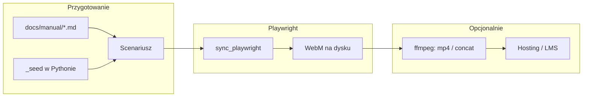

# Filmy instruktażowe per rola (Playwright + docs/manual)

## Zakres treści (źródło: [docs/manual/](docs/manual/))

| Film (rola)            | Dokument źródłowy                                        | Główne ścieżki UI                                                                                                                 |
| ---------------------- | -------------------------------------------------------- | --------------------------------------------------------------------------------------------------------------------------------- |
| Recepcja               | [01-rejestracja.md](docs/manual/01-rejestracja.md)       | `/admin/login/`, reception dashboard, kolejki, import XLSX, intake PDF                                                            |
| Tablet                 | [02-tablet.md](docs/manual/02-tablet.md)                 | `/tablet/login/`, kolejka, wpis, formularz (fragmenty — pełny flow jest długi)                                                    |
| Lekarz                 | [03-doktor.md](docs/manual/03-doktor.md)                 | `/doctor/login/`, lista, otwarcie dokumentu, fragment Befund                                                                      |
| Administrator          | [04-administrator.md](docs/manual/04-administrator.md)   | `/admin/`, Staff user, (opcjonalnie) te same widoki co recepcja dla importu                                                       |
| Pacjent                | [05-pacjent-wyniki.md](docs/manual/05-pacjent-wyniki.md) | `/`, `/otp/`, `/documents/`                                                                                                       |
| (Opcjonalnie) Przegląd | [00-przeglad.md](docs/manual/00-przeglad.md)             | Raczej **slajdy / narracja** nad diagramem — sam Playwright mało daje; można krótki film z jednym ekranem + tekst w postprodukcji |

Pozostałe pliki w [docs/](docs/) (runbooki, security, observability) **nie są** naturalnym materiałem na „filmy dla ról” — można je pominąć lub traktować osobno (IT, nie personel operacyjny).

## Co Playwright realnie dostarcza

- **Nagranie ekranu (WebM)** przez `browser.new_context(record_video_dir=..., record_video_size=...)` — jeden plik wideo **na każdą zamkniętą stronę** (`page.close()`), więc dla jednego „filmu” roli wygodniej: **jedna długa strona** w jednym `BrowserContext` lub **scalanie** kilku WebM przez ffmpeg.
- **Zwolnione tempo:** `chromium.launch(slow_mo=…)` (np. 200–400 ms) ułatwia odbiór bez montażu.
- **Bez lektora:** Playwright nie generuje mowy; „instruktaż” w sensie **głosu** = osobna warstwa: nagranie lektora, TTS, lub napisy (SRT) zsynchronizowane w edytorze wideo / ffmpeg.

## Stan obecny w repo (do wykorzystania)

- [scripts/capture_manual_screenshots.py](scripts/capture_manual_screenshots.py): kompletny `**_seed()**`, logowania (`_login_admin`, `_login_doctor`, `_login_tablet`), nawigacja po URL-ach zgodna ze zrzutami, obejścia portalu pacjenta przez **cookies sesji** (`session_otp_key`, `session_doc_key`) — stabilne na CI, mniej „teatralne” niż wpisywanie OTP z mocka SMS.
- [docker-compose.yml](docker-compose.yml) + [Dockerfile.screenshots](Dockerfile.screenshots): profil `screenshots` — ten sam stack co PNG; nagrywanie wideo w Chromium headless **jest wspierane**; pliki wideo będą **duże** → nie commitować do git (jak `_build` PDF), tylko artefakt CI / release.

## Proponowana implementacja (kroki)

1. **Refaktor (mały, kontrolowany):** wydzielić z `capture_manual_screenshots.py` moduł współdzielony, np. `scripts/manual_demo/` z `seed.py` (lub `context.py`) i funkcjami logowania — żeby **nie duplikować** seeda i ID z `ctx`. Skrypt PNG zostaje cienkim wrapperem wywołującym te same helpery.
2. **Nowy skrypt** `scripts/record_manual_videos.py` (lub `record_role_tutorials.py`):
  - argumenty: `--base-url`, `--role reception|tablet|doctor|admin|patient|all`, `--out-dir`, opcjonalnie `--slow-mo`, rozdzielczość wideo.
  - dla każdej roli: jeden `BrowserContext` z `record_video_dir` + jedna główna `Page` (lub jawne `page.close()` na końcu sceny i potem ffmpeg concat — dokumentacja w README).
  - scenariusz **1:1 z sekcjami** odpowiedniego pliku `.md` (kolejność kroków jak w instrukcji); dłuższe formularze tableta: **skrócony** film (logowanie → lista → start sesji → 1–2 ekrany formularza) zgodnie z tym, co jest opisane w `02-tablet.md`, z komentarzem w README że pełna ankieta = osobny materiał.
3. **Zmienne środowiskowe** jak przy zrzutach: `CAPTCHA_VERIFY_SKIP`, mock SMS, pepper OTP ([nagłówek skryptu PNG](scripts/capture_manual_screenshots.py)) — wymóg do nieblokującego nagrania pacjenta w dev/staging.
4. **Docker:** rozszerzyć komendę profilu `screenshots` **albo** dodać `docker compose --profile videos run ...` wywołujący nowy skrypt; upewnić się, że katalog wyjściowy jest **volume** lub kopiowany z kontenera (`docker cp`), bo `_build`/artefakty są ulotne.
5. **Dokumentacja:** krótki `docs/manual/assets/videos/README.md` (lub sekcja w [docs/manual/README.md](docs/manual/README.md)): jak wygenerować filmy, gdzie trafia WebM, jak złożyć mp4, że dane to **wyłącznie demo** (`screenshot`_*).
6. **Opcjonalna faza „produkcja”:** szablon napów (PL/DE) z tekstem zsynchronizowanym z nagłówkami z MD; lektor zewnętrzny; **nie** wpinamy w CI ciężkiego montażu — tylko opis narzędzi.

## Ryzyka i decyzje

- **Rozmiar repo / artefakty:** trzymać wideo poza gitem lub w Git LFS; w repo tylko skrypty i README.
- **Stabilność selektorów:** scenariusze oparte na istniejących selektorach ze skryptu PNG; przy zmianach UI — aktualizacja skryptu (jak dziś przy zrzutach).
- **Pacjent:** nagranie z cookie jest **mniej edukacyjne** dla kroku OTP; można dodać **drugi wariant** scenariusza: request OTP przez UI + odczyt kodu z bazy/sesji dev (wymaga dodatkowego endpointu lub komendy management — większy zakres; oznaczyć jako opcjonalny follow-up).
- **Prawo / RODO:** wyłącznie konta i dane fikcyjne; ten sam komunikat co przy zrzutach ekranu.

## Podsumowanie

**Tak, jest to wykonalne** i naturalnie opiera się na [docs/manual/](docs/manual/) oraz istniejącym Playwright + seedzie. Kluczowy koszt inżynierski to **refaktor wspólnego seeda** + **jeden skrypt nagrywający** + **polityka artefaktów** (gitignore, Docker volume). Lektor i „prawdziwy” instruktaż głosowy to **osobna, redakcyjna** warstwa poza Playwrightem.