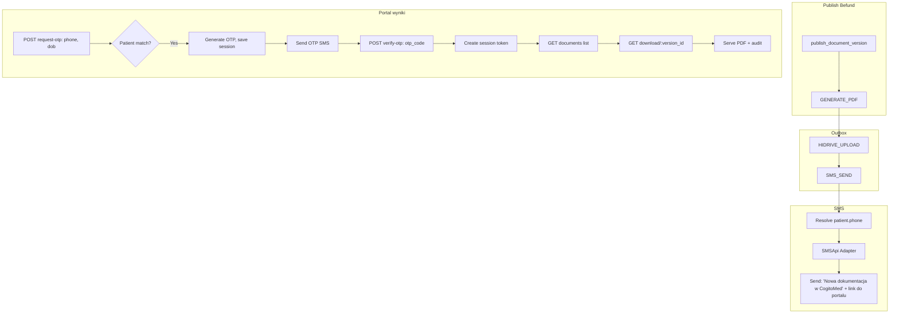

# Plan implementacji – portal wyniki (4 etapy)

## Kontekst i zakres

Proces udostępniania zgodnie z PRD 3.4a i US-018:

1. **SMS logistyczny** – wysyłany po publikacji Befund; treść: „Nowa dokumentacja w CogitoMed" + link do portalu (np. [https://wyniki.cogitomedica.pl](https://wyniki.cogitomedica.pl))
2. **Logowanie cross-verification** – pacjent na wyniki.cogitomedica.pl; phone + date_of_birth
3. **OTP 15 min** – 6-cyfrowy kod, MFA
4. **Dostęp do PDF** – serwowanie przez HTTPS; logi audytowe; filtrowanie wycofanych publikacji

**Stan wyjściowy (z analizy kodu):**

- Handler `SMS_SEND` w [apps/outbox/services.py](apps/outbox/services.py) tylko ustawia `sms_sent` – brak wywołania SMSApi
- Brak endpointów dla pacjenta (publicznych, bez staff auth)
- `smsapi-client` w `requirements.txt`; brak adaptera i konfiguracji
- Pacjent: `Patient` w [apps/reception/models.py](apps/reception/models.py) – `phone`, `date_of_birth`; migracja doda `UNIQUE(phone)`. Pacjent potwierdza dane w ankiecie
- PDF: `build_befund_pdf_bytes` w [apps/medical/pdf_builder.py](apps/medical/pdf_builder.py) – generuje z wersji; preview w [apps/medical/api_views.py](apps/medical/api_views.py) (linie 167–198)

**Wymagania biznesowe:**
- **Unikalność numeru telefonu:** W systemie nie mogą istnieć dwie osoby z tym samym numerem. Migracja: `UNIQUE(phone)` na `Patient` (lub walidacja przy tworzeniu/impicie).
- **Normalizacja telefonu:** Przy imporcie i ręcznym dodawaniu pacjenta numer jest normalizowany (np. `re.sub(r'\D', '', v)` → tylko cyfry; ewentualnie prefix kraju). Kolumna `phone` lub `phone_normalized` – spójna całość.
- **Weryfikacja danych:** Pacjent potwierdza numer i datę urodzenia w ankiecie na tablecie – dane są zweryfikowane.
- **CAPTCHA:** Mechanizm CAPTCHA przed wysłaniem OTP – ochrona przed botami, skanerami i masowym wywoływaniem request-otp (np. DoS na koszt SMSów).

---

## Architektura przepływu




---

## Faza 1: Integracja SMSApi (krok 1 procesu)

### 1.1 Adapter SMS w `apps/integrations/`

- Utworzyć moduł `apps/integrations/sms/`:
  - `client.py` – klasa `SmsAdapter` z metodą `send_sms(to: str, message: str) -> None`
  - Wykorzystać `SmsApiPlClient` z [smsapi.pl](https://ssl.smsapi.pl/) (umowa projektowa)
  - Konfiguracja: `SMSAPI_ACCESS_TOKEN`, `SMSAPI_USE_MOCK` (domyślnie `True` w dev)
  - Przy mock: tylko log; bez HTTP
- Dodać do [.env.example](.env.example):

```
  SMSAPI_ACCESS_TOKEN=
  SMSAPI_USE_MOCK=1
  PATIENT_RESULTS_BASE_URL=https://wyniki.cogitomedica.pl
  PATIENT_RESULTS_OTP_PEPPER=change-me-secret-pepper
  TURNSTILE_SECRET_KEY=
  TURNSTILE_SITE_KEY=
  CAPTCHA_VERIFY_SKIP=0
  

```

### 1.2 Modyfikacja handlera `SMS_SEND` w [apps/outbox/services.py](apps/outbox/services.py)

- Pobrać pacjenta: `version.medical_document.queue_entry.patient` (select_related)
- Numer już znormalizowany w DB (patrz: normalizacja przy imporcie)
- Język SMS: z `form_locale` ankiety pacjenta (intake_form) lub fallback – treść w DE/EN/PL
- Treść: „Nowa dokumentacja w CogitoMed {url}" (słownik tłumaczeń per język)
- Wywołać `get_sms_adapter().send_sms(to=phone, message=text)`
- **SMSApi:** umowa z [ssl.smsapi.pl](https://ssl.smsapi.pl/) – użyć `SmsApiPlClient`
- Po sukcesie: `version.sms_sent = True`, `version.sms_sent_at = now` (jak obecnie)
- Przy błędzie SMSApi: rzucić wyjątek – outbox ustawi FAILED/retry
- Zachować logikę `resend_sms` i pomijanie przy wcześniej wysłanym SMS

### 1.3 Testy

- Test jednostkowy adaptera (mock HTTP)
- Test outbox: publish → process → sprawdzenie wywołania `send_sms` i `sms_sent=True`

---

## Faza 2: Model OTP i serwis (kroki 2–3)

### 2.1 Nowa aplikacja `apps/patient_results/`

- `models.py` – model `PatientResultsOtpSession`:
  - `id` UUID PK
  - `patient_id` FK → Patient (CASCADE)
  - `phone` varchar(20) – numer, na który wysłano OTP
  - `otp_code_hash` varchar(64) – SHA-256(pepper + otp) – pepper z `PATIENT_RESULTS_OTP_PEPPER` w .env
  - `expires_at` timestamptz – ważność 15 min
  - `verified_at` timestamptz NULL – po poprawnej weryfikacji (atomowy UPDATE)
  - `verify_attempt_count` int DEFAULT 0 – liczba nieudanych prób; max 5, potem blokada sesji
  - `created_at`
  - Indeks: `(patient_id, expires_at)`; ograniczenie: `expires_at > created_at`
- Migracja
- Helper normalizacji: spójny z warstwą importu (tylko cyfry)

### 2.2 Serwis domenowy `request_otp(phone: str, date_of_birth: date, captcha_token: str)`

- **CAPTCHA:** Najpierw walidacja tokenu (wywołanie Turnstile/reCAPTCHA verify). Przy błędzie – zwrócić błąd bez dalszej logiki.
- Walidacja wejścia: format telefonu (regex jak w Patient), DOB w rozsądnym zakresie
- `Patient.objects.get(phone=normalize_phone(phone), date_of_birth=dob)` – phone jest UNIQUE, więc max 1 rekord
- **Bez enumeracji:** jeśli brak dopasowania – zwrócić generyczną odpowiedź sukcesu (ten sam timing co przy sukcesie)
- Przy dopasowaniu (w transakcji):
  - Wygenerować 6-cyfrowy OTP: `random.randint(100000, 999999)`
  - Hash: `SHA-256(pepper + otp)` gdzie pepper z `PATIENT_RESULTS_OTP_PEPPER`
  - Zapis: `PatientResultsOtpSession(patient_id=..., phone=..., otp_code_hash=..., expires_at=now+15min, verify_attempt_count=0)`
  - Wywołać `SmsAdapter.send_sms(...)` – jeśli wyjątek: wycofać transakcję (usunąć sesję)
  - Ograniczenie rate: max 3 OTP na ten numer w ciągu 1h
- Zwracać zawsze ten sam typ odpowiedzi (np. `{"status": "ok"}`)

### 2.3 Serwis `verify_otp(phone: str, date_of_birth: date, otp_code: str) -> str | None`

- Znaleźć **najnowszą** pasującą sesję: `.filter(patient__phone=..., patient__date_of_birth=..., expires_at__gt=now, verified_at__isnull=True).order_by('-created_at').first()`
- Sprawdzić `session.verify_attempt_count < 5` – jeśli przekroczone: błąd (sesja zablokowana)
- Porównać hash `SHA-256(pepper + otp_code.strip()) == session.otp_code_hash`
- Przy nieudanej próbie: `session.verify_attempt_count += 1`, zapis (atomowy)
- Przy sukcesie: **atomowy** `UPDATE ... SET verified_at=now WHERE id=... AND verified_at IS NULL` (select_for_update lub raw UPDATE) – zapobiegamy ponownemu użyciu OTP i race conditions
- Po sukcesie: zwrócić sesję Django (login jako „patient_results” – mechanizm identyczny jak w reszcie portalu)
- Token: sesja Django (cookie), krótkotrwała (np. 1h)

---

## Faza 3: API i widoki portalu (krok 4)

### 3.1 Endpointy API (publiczne, bez staff auth)

Dodać do [cogitomedica/api_urls.py](cogitomedica/api_urls.py) i [cogitomedica/openapi_extension.py](cogitomedica/openapi_extension.py) (NO_AUTH_OPERATIONS):


| Metoda | Ścieżka                                                   | Opis                                                                                                                                      |
| ------ | --------------------------------------------------------- | ----------------------------------------------------------------------------------------------------------------------------------------- |
| POST   | `/api/v1/patient-results/request-otp`                     | Body: `{"phone": "...", "date_of_birth": "YYYY-MM-DD", "captcha_token": "..."}`; walidacja CAPTCHA przed wysyłką OTP                          |
| POST   | `/api/v1/patient-results/verify-otp`                      | Body: `{"phone": "...", "date_of_birth": "...", "otp_code": "123456"}`; Response: `{"session_token": "...", "expires_at": "..."}`         |
| GET    | `/api/v1/patient-results/documents`                       | Sesja Django (cookie); Response: lista dokumentów `[{id, queue_date, document_id, version_id}, ...]`                                       |
| GET    | `/api/v1/patient-results/documents/<version_id>/download` | Zwraca PDF (FileResponse); wymaga sesji Django                                                                                            |


### 3.2 Logika listy dokumentów

- Z sesji Django wyciągnąć `patient_id` (patient_results session)
- Zapytanie: `MedicalDocumentVersion` gdzie `version_status=PUBLISHED`, `pdf_generation_status=COMPLETED`, `medical_document__queue_entry__patient_id=patient_id`
- **Aktualna wersja:** `version.version_no == doc.current_version_no` (model ma `current_version_no`, nie `current_version_id`)
- **Retencja:** tylko dokumenty z `local_pdf_deleted_at IS NULL` – po 30 dniach plik i dane wrażliwe są usuwane; dokument jest niedostępny dla pacjenta
- **Wycofanie:** tylko wersje z `revoked_at IS NULL`
- Sortowanie: `-published_at`
- Zwracać: `version_id`, `queue_date`, `document_id` (dla audytu)

### 3.3 Serwowanie PDF

- Weryfikacja sesji Django → `patient_id`
- Sprawdzenie: `version` należy do dokumentu, którego `queue_entry.patient_id == patient_id`
- Sprawdzenie: `version.version_status == PUBLISHED`, `pdf_generation_status == COMPLETED`, `revoked_at IS NULL`
- **Retencja:** tylko wersje z `local_pdf_deleted_at IS NULL` – po 30 dniach dokument niedostępny (plik usunięty, medical_payload wyczyszczony zgodnie z polityką danych wrażliwych)
- Serwowanie: jeśli `version.pdf_local_path` istnieje i plik na dysku → `FileResponse(open(path), content_type='application/pdf')`. **Brak fallbacku** – nie można odtwarzać z medical_payload po retencji.
- Nagłówki: `Content-Disposition: attachment; filename="befund-{queue_date}.pdf"`
- **Audit:** `create_audit_event(event_type="PATIENT_RESULTS_PDF_DOWNLOAD", ...)`

### 3.4 Mechanizm sesji

- **Sesja Django** – taki sam mechanizm jak w reszcie portalu (tablet, recepcja, lekarz). Całość to jeden system. Po zweryfikowaniu OTP: `request.session['patient_results_patient_id'] = patient_id` (lub dedykowany backend sesji dla roli „patient_results"); cookie sesji standardowo.

---

## Faza 4: Frontend portalu (HTML)

### 4.1 Widoki Django (SSR)

- `path("wyniki/", include("apps.patient_results.urls"))` w [cogitomedica/urls.py](cogitomedica/urls.py)
- Szablony: `wyniki/login.html`, `wyniki/otp.html`, `wyniki/documents.html`
- Flow:
  1. `/wyniki/` – formularz phone + DOB + CAPTCHA → POST do API request-otp (z tokenem CAPTCHA)
  2. `/wyniki/otp/` – formularz 6 cyfr → POST do API verify-otp → redirect na listę
  3. `/wyniki/documents/` – lista dokumentów z linkami do download

### 4.2 Mechanizm CAPTCHA

- **Miejsce:** Przed `POST request-otp` – walidacja tokenu CAPTCHA przed wysłaniem OTP.
- **Opcje:** Cloudflare Turnstile (darmowy, przyjazny prywatności) lub Google reCAPTCHA v3 (niewidoczny, score-based).
- **Flow:**
  1. Frontend: widget CAPTCHA na stronie logowania (`/wyniki/`); użytkownik wypełnia phone+DOB i przechodzi challenge.
  2. Request: `POST /patient-results/request-otp` z body `{ "phone": "...", "date_of_birth": "...", "captcha_token": "..." }`.
  3. Backend: przed logiką OTP wywołać API weryfikacji (np. `https://challenges.cloudflare.com/turnstile/v0/siteverify`) z tokenem i `SECRET_KEY`. Jeśli zwrot negatywny – `400` bez wysyłania SMS.
- **Konfiguracja .env:** `TURNSTILE_SECRET_KEY` (lub `RECAPTCHA_SECRET_KEY`), `TURNSTILE_SITE_KEY` (lub `RECAPTCHA_SITE_KEY`) dla frontendu.
- **Mock w dev:** Możliwość pominięcia CAPTCHA gdy `CAPTCHA_VERIFY_SKIP=1` (np. w testach E2E).

### 4.3 Styl i UX

- Prosty layout RWD (Tailwind jeśli w projekcie; inaczej minimalny CSS)
- Tłumaczenia: DE/EN/PL z `translation_key` (jak tablet)
- Komunikaty błędów ogólne (bez ujawniania np. „nieprawidłowy numer”)

---

## Faza 5: Zabezpieczenia, CAPTCHA i rate limiting

- **CAPTCHA:** Wymagane przy `request-otp` – walidacja tokenu przed wysyłką OTP (Cloudflare Turnstile lub reCAPTCHA v3). Ochrona przed botami i masowymi requestami.
- **Rate limit OTP:** max 3 request-otp na numer/h; max 5 verify-otp na sesję (`verify_attempt_count`)
- **Throttling:** django-ratelimit lub cache na IP (dodatkowa warstwa obrony)
- **CORS:** jeśli front na innej domenie – `CORS_ALLOWED_ORIGINS` dla wyniki.cogitomedica.pl
- **Nagłówki:** `X-Content-Type-Options: nosniff` na PDF

---

## Faza 6: Wycofanie publikacji (MVP – wymagane)

- Dodać pole `MedicalDocumentVersion.revoked_at` (timestamptz NULL)
- Endpoint w panelu lekarza: `POST /medical-documents/{id}/revoke` – ustawia `revoked_at` na bieżącej opublikowanej wersji
- **Usunięcie PDF:** przy wycofaniu – usunąć plik lokalny (`pdf_local_path`), ustawić `pdf_local_path=NULL` (lub odpowiedni flag), aby pacjent nie mógł go pobrać
- W portalu: przy liście i download wykluczać wersje z `revoked_at IS NOT NULL`; dokument wycofany nie jest widoczny ani pobieralny

---

## Kolejność wdrożenia


| Kolejność | Zadanie                                                      | Zależności         |
| --------- | ------------------------------------------------------------ | ------------------ |
| 1         | Adapter SMS + konfiguracja                                   | -                  |
| 2         | Modyfikacja SMS_SEND w outbox                                | Adapter SMS        |
| 3         | Model PatientResultsOtpSession + migracja                    | -                  |
| 4         | Serwisy request_otp, verify_otp                              | Model, Adapter SMS |
| 5         | API endpointy (request-otp, verify-otp, documents, download) | Serwisy            |
| 6         | Widoki HTML / wyniki/                                        | API                |
| 7         | CAPTCHA (Turnstile/reCAPTCHA) przy request-otp               | API endpointy      |
| 8         | Rate limiting, testy E2E                                     | Wszystko           |
| 9         | Revocation (revoked_at, usunięcie PDF przy wycofaniu)       | -                  |
| 10        | Migracja: UNIQUE(phone) na Patient, normalizacja przy imporcie | -                  |


---

## Pliki do utworzenia/modyfikacji


| Plik                                | Akcja                                                         |
| ----------------------------------- | ------------------------------------------------------------- |
| `apps/integrations/sms/client.py`   | Utworzyć                                                      |
| `apps/integrations/sms/__init__.py` | Utworzyć                                                      |
| `cogitomedica/settings.py`          | Dodać SMSAPI_*, PATIENT_RESULTS_*, TURNSTILE_*, CAPTCHA_VERIFY_SKIP |
| `.env.example`                      | Dodać SMSAPI_*, PATIENT_RESULTS_*, TURNSTILE_*, CAPTCHA_VERIFY_SKIP |
| `apps/reception/` (import, patient create) | Normalizacja phone przy zapisie                              |
| Migracja `Patient`                  | UNIQUE(phone) – jedna osoba na numer                          |
| `apps/outbox/services.py`           | Modyfikacja SMS_SEND                                          |
| `apps/patient_results/`             | Nowa aplikacja (models, services, api_views, urls, templates) |
| `cogitomedica/urls.py`              | path wyniki/                                                  |
| `cogitomedica/api_urls.py`          | Ścieżki patient-results                                       |
| `cogitomedica/openapi_extension.py` | NO_AUTH dla patient-results                                   |


---

## Definicja ukończenia

- SMS logistyczny wysyłany przez SMSApi (SmsApiPlClient) po publikacji; treść „Nowa dokumentacja w CogitoMed" + link; język z form_locale pacjenta (DE/EN/PL)
- Unikalność `phone` na Patient; normalizacja przy imporcie i tworzeniu
- Pacjent może wejść na /wyniki/, podać phone+DOB, otrzymać OTP i zalogować się (sesja Django)
- OTP: pepper w .env, throttling verify (max 5), atomowy UPDATE przy weryfikacji, najnowsza sesja ważna
- CAPTCHA przy request-otp (Turnstile lub reCAPTCHA v3)
- Lista dokumentów: tylko aktualne wersje (`current_version_no`), `local_pdf_deleted_at IS NULL`, `revoked_at IS NULL`
- Pobranie PDF tylko gdy plik lokalny istnieje (brak odtwarzania po retencji)
- Wycofanie publikacji: revoked_at, usunięcie pliku – pacjent nie widzi wycofanego dokumentu
- Testy jednostkowe i integracyjne; dokumentacja w api-plan.md

