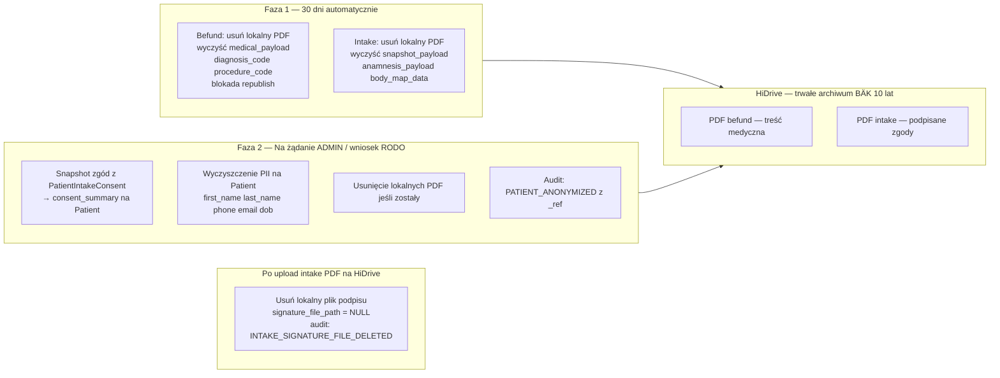

# Plan implementacji US-013 — Retencja PDF + Anonimizacja pacjenta

## Przegląd architektury: dwufazowy cykl życia




---

## Stan bieżący (co jest już wdrożone)

Dla befund retencja jest **w pełni zaimplementowana**:

- `run_retention_cleanup` w `[apps/outbox/services.py](apps/outbox/services.py)` — selekcja, warunek `hidrive_sent AND sms_sent`, dry-run, `local_pdf_deleted_at`, audit `RETENTION_FILE_DELETED` / `RETENTION_FILE_SKIPPED`
- DB constraint `medical_document_local_pdf_deletion_guard` + partial index `medical_document_retention_idx`
- Task w `[apps/outbox/tasks.py](apps/outbox/tasks.py)` — hardcoded `older_than_days=30, dry_run=False`
- API `POST /operations/retention/run` (ADMIN, dry-run) w `[apps/outbox/api_views.py](apps/outbox/api_views.py)`
- Enqueue w `[apps/operations/management/commands/](apps/operations/management/commands/)`
- `AuditEvent._ref` (IDs przeżywają SET_NULL po anonimizacji) w `[apps/operations/services.py](apps/operations/services.py)`
- 1 test API (`test_operations_retention_run_endpoint_dry_run_and_execute`)

**Brakuje:**

1. Retencja intake PDF (brak `local_pdf_deleted_at` na `IntakeDocumentVersion`)
2. `PDF_RETENTION_DAYS` w settings (hardcoded 30 w task)
3. Portal pacjenta: generic 404 zamiast dedykowanego 410 gdy plik usunięty retencją
4. Testy jednostkowe serwisu `run_retention_cleanup`
5. Anonimizacja pacjenta (serwis + model + API)
6. Runbook

---

## Faza 1: Retencja lokalnych plików PDF

### 1a. Konfigurowalny `PDF_RETENTION_DAYS`

- `[cogitomedica/settings.py](cogitomedica/settings.py)`: `PDF_RETENTION_DAYS = int(os.environ.get("PDF_RETENTION_DAYS", "30"))`
- `[apps/outbox/tasks.py](apps/outbox/tasks.py)`: `run_retention_cleanup_service(older_than_days=settings.PDF_RETENTION_DAYS, dry_run=False)`; analogicznie dla intake task

### 1b. Retencja intake PDF — model i migracja

`**[apps/intake/models.py](apps/intake/models.py)`** / `IntakeDocumentVersion`:

```python
local_pdf_deleted_at = models.DateTimeField(blank=True, null=True)
```

DB constraint (tylko `hidrive_sent`, bez `sms_sent` — intake nie ma SMS):

```python
models.CheckConstraint(
    condition=Q(local_pdf_deleted_at__isnull=True) | Q(hidrive_sent=True),
    name="intake_document_local_pdf_deletion_guard",
)
```

Partial index dla wydajności selekcji kandydatów:

```python
models.Index(
    fields=["created_at"],
    name="intake_document_retention_idx",
    condition=Q(hidrive_sent=True, local_pdf_deleted_at__isnull=True),
)
```

### 1c. Wyczyszczenie podpisu po upload na HiDrive (pipeline outbox)

`**[apps/intake/outbox_services.py](apps/intake/outbox_services.py)**` — w `_execute_event`, bezpośrednio po potwierdzeniu `HIDRIVE_UPLOAD_INTAKE_PDF`:

```python
# Podpis odręczny = biometria (RODO Art. 9); wyrenderowany w PDF na HiDrive → lokalny plik zbędny
_try_delete_file(version.intake_form.signature_file_path)
version.intake_form.signature_file_path = None
version.intake_form.save(update_fields=["signature_file_path", "updated_at"])
create_audit_event(
    event_type="INTAKE_SIGNATURE_FILE_DELETED",
    patient_id=...,
    metadata={"intake_document_version_id": str(version.id), "reason": "hidrive_confirmed"},
)
```

Nie czekamy 30 dni — biometria jest zbędna od momentu gdy PDF jest na HiDrive.

### 1d. Serwis retencji intake + wyczyszczenie danych zdrowotnych

Nowy plik `**[apps/intake/retention_services.py](apps/intake/retention_services.py)**`:

```python
@transaction.atomic
def run_intake_retention_cleanup(*, older_than_days: int = 30, dry_run: bool = True):
    # warunek: IntakeDocumentVersion, created_at <= now - days,
    # hidrive_sent=True, local_pdf_deleted_at IS NULL
    # skip gdy hidrive_sent=False → audit INTAKE_RETENTION_FILE_SKIPPED
    # dry_run=True → tylko zlicz kandydatów
    # execute:
    #   _try_delete_file(version.pdf_local_path)
    #   version.local_pdf_deleted_at = now, version.pdf_local_path = None
    #   version.snapshot_payload = {"cleared_at_retention": True}   ← PII + zdrowie
    #   intake_form.anamnesis_payload = {}                           ← Art. 9 RODO
    #   intake_form.body_map_data = []                               ← dane zdrowotne
    #   audit INTAKE_RETENTION_FILE_DELETED
```

> Użyć `created_at` (data złożenia formularza) jako timestamp — intake nie ma `published_at`.

**Tabela decyzji — co czyścić kiedy:**


| Pole                               | Wyczyszczone kiedy  | Uzasadnienie                                                          |
| ---------------------------------- | ------------------- | --------------------------------------------------------------------- |
| `signature_file_path` (plik)       | Po upload HiDrive   | Biometria Art. 9; wyrenderowana w PDF                                 |
| `snapshot_payload`                 | Retencja 30 dni     | PII + zdrowie; cel (render PDF) spełniony                             |
| `anamnesis_payload`                | Retencja 30 dni     | Art. 9 RODO — leki, alergie, choroby                                  |
| `body_map_data`                    | Retencja 30 dni     | Dane zdrowotne; zbędne po archiwizacji                                |
| `medical_payload` (befund)         | **Retencja 30 dni** | Republish **zablokowany** po `local_pdf_deleted_at`; kopia na HiDrive |
| `diagnosis_code`, `procedure_code` | **Retencja 30 dni** | Kody medyczne; zbędne operacyjnie po archiwizacji                     |
| PII pacjenta                       | Pełna anonimizacja  | Operacyjnie potrzebne dopóki pacjent aktywny                          |


**Co zostaje w DB po retencji intake:**

- `PatientIntakeConsent` wiersze — strukturalne zgody (kod + `accepted`), bez treści zdrowotnych
- `signature_sha256` — suma kontrolna, nie ujawnia treści
- `hidrive_path`, `pdf_checksum_sha256` — wskaźnik i integralność archiwum HiDrive

### 1e. Befund — wyczyszczenie treści medycznej przy retencji + blokada republish

**Rozszerzenie `run_retention_cleanup`** w `[apps/outbox/services.py](apps/outbox/services.py)` — obok usunięcia pliku:

```python
version.medical_payload = {"cleared_at_retention": True}
version.diagnosis_code = None
version.procedure_code = None
version.save(update_fields=[
    "local_pdf_deleted_at", "pdf_local_path",
    "medical_payload", "diagnosis_code", "procedure_code",
])
```

**Blokada republish** w `[apps/medical/services.py](apps/medical/services.py)`:

```python
if current_version.local_pdf_deleted_at is not None:
    raise DomainError(
        domain_message("other.domain.republish_after_retention_not_allowed"),
        api_message_key="other.domain.republish_after_retention_not_allowed",
    )
```

Klucz tłumaczenia do `[apps/core/translation_data/other_domain.json](apps/core/translation_data/other_domain.json)`:

```json
"other.domain.republish_after_retention_not_allowed": {
  "de": "Eine erneute Veröffentlichung ist nach Ablauf der Aufbewahrungsfrist nicht möglich.",
  "en": "Republishing is not allowed after the retention period has passed.",
  "pl": "Ponowna publikacja nie jest możliwa po upływie okresu retencji."
}
```

**Co zostaje w DB po retencji befund:**

- `hidrive_path`, `pdf_checksum_sha256` — wskaźnik i integralność archiwum
- `published_at`, `local_pdf_deleted_at`, `hidrive_sent_at`, `sms_sent_at` — timestampy audytowe
- `version_status`, `publish_locale`, `version_no` — metadane wersji
- `publish_requested_by_user`, `published_by_user` — kto opublikował (FK → NULL przy pełnej anonimizacji, `_ref` w `AuditEvent`)

### 1f. Portal pacjenta — 410 Gone

`**[apps/patient_results/services.py](apps/patient_results/services.py)`**:
Wyodrębnić dwa przypadki zamiast jednego:

- Wersja nie istnieje / brak autoryzacji → `None` (→ 404, brak informacji o przyczynie)
- Wersja istnieje ale `local_pdf_deleted_at IS NOT NULL` → sentinel `"RETENTION_EXPIRED"` (→ 410)

`**[apps/patient_results/api_views.py](apps/patient_results/api_views.py)`**:

- 410 z kluczem `other.api.document_retention_expired`
- Audit: `PATIENT_RESULTS_PDF_DOWNLOAD_DENIED` z `reason: "retention_expired"`

`**[apps/core/translation_data/other_api.json](apps/core/translation_data/other_api.json)`** (między `document_not_found` a `duplicate_queue_slot`):

```json
"other.api.document_retention_expired": {
  "de": "Ihre Ergebnisse sind online nicht mehr verfügbar. Bitte kontaktieren Sie die Klinik.",
  "en": "Your results are no longer available online. Please contact the clinic.",
  "pl": "Wyniki nie są już dostępne online. Prosimy o kontakt z kliniką."
}
```

---

## Faza 2: Anonimizacja pacjenta

### Kluczowy fakt: `PatientIntakeConsent` już istnieje

`[apps/intake/models.py](apps/intake/models.py)` zawiera model `PatientIntakeConsent` z:

- FK do `ConsentDefinition` (ma `code`, `version`, `title_de/en/pl`, `is_required`)
- `accepted: bool`, `accepted_at: datetime`
- `selected_option_codes: list` (dla zgód wielowariantowych)

To oznacza, że **nie trzeba parsować `anamnesis_payload`** żeby poznać zgody. Serwis anonimizacji po prostu odczyta `PatientIntakeConsent` przed wyczyszczeniem i zapisze snapshot.

### 2a. Model — nowe pola na `Patient`

`**[apps/reception/models.py](apps/reception/models.py)**`:

```python
anonymized_at = models.DateTimeField(blank=True, null=True)
consent_summary = models.JSONField(blank=True, null=True)
```

`consent_summary` — format (przykład):

```json
{
  "extracted_at": "2025-03-01T10:00:00Z",
  "consents": [
    {
      "code": "PHONE_CONTACT",
      "version": 1,
      "accepted": true,
      "accepted_at": "2024-11-15T09:30:00Z",
      "intake_form_id": "uuid-...",
      "queue_date": "2024-11-15"
    },
    {
      "code": "EMAIL_MARKETING",
      "version": 1,
      "accepted": false,
      "accepted_at": null,
      "intake_form_id": "uuid-...",
      "queue_date": "2024-11-15"
    }
  ]
}
```

- `intake_form_id` pozostaje jako referencja do wiersza DB i odpowiadającego PDF intake na HiDrive
- `queue_date` dla czytelności audytu
- Jeśli pacjent miał wiele wizyt, `consents` zawiera najnowszy zestaw (ostatnia data `submitted_at`)

### 2b. Serwis anonimizacji

Nowy plik `**[apps/reception/anonymization.py](apps/reception/anonymization.py)**`:

```python
@transaction.atomic
def anonymize_patient(patient_id: uuid.UUID, *, actor_user_id: uuid.UUID) -> Patient:
    patient = Patient.objects.select_for_update().get(id=patient_id)

    # Idempotentność: jeśli już zanonimizowany, zwróć bez zmian
    if patient.anonymized_at:
        return patient

    # 1. Snapshot zgód z ostatniego IntakeForm
    consent_summary = _extract_consent_summary(patient_id)

    # 2. Wyczyszczenie PII
    patient.first_name = "ANONYMIZED"
    patient.last_name = "ANONYMIZED"
    patient.phone = f"ANON-{patient.id}"   # zachowuje unikalność
    patient.email = f"anon-{patient.id}@deleted.invalid"
    patient.date_of_birth = None
    patient.postal_code = None
    patient.address = None
    patient.doctolib_patient_id = None
    patient.consent_summary = consent_summary
    patient.anonymized_at = now()
    patient.save()

    # 3. Wyczyszczenie payloadów intake (jeśli retencja nie zrobiła tego wcześniej)
    #    medical_payload/diagnosis_code już wyczyszczone przez retencję 30 dni
    PatientIntakeForm.objects.filter(queue_entry__patient=patient).update(
        anamnesis_payload={}, body_map_data=[]
    )
    # 4. Wyczyszczenie snapshot w wersjach dokumentów intake
    IntakeDocumentVersion.objects.filter(
        intake_form__queue_entry__patient=patient
    ).update(snapshot_payload={"anonymized": True})

    # 5. Usunięcie pliku podpisu (jeśli nie usunięto wcześniej przez outbox)
    _delete_signature_files(patient_id)

    # 6. Natychmiastowe usunięcie lokalnych PDFs (befund + intake)
    #    niezależnie od hidrive_sent / sms_sent (prawo do usunięcia > retencja)
    _delete_remaining_local_pdfs(patient_id, now=now())

    # 7. Audit event
    create_audit_event(
        event_type="PATIENT_ANONYMIZED",
        actor_user_id=actor_user_id,
        patient_id=patient_id,  # FK zaraz stanie się NULL przy powiązaniach
        metadata={"_ref": {"patient_id": str(patient_id)}},
    )
    return patient
```

### 2c. API endpoint

`POST /api/v1/patients/<patient_id>/anonymize` — ADMIN only:

- Wywołuje `anonymize_patient(patient_id, actor_user_id=request.user.id)`
- Dodatkowy audit: `PATIENT_ANONYMIZE_REQUESTED` z `client_ip`
- Odpowiedź: `{"patient_id": "...", "anonymized_at": "..."}`

---

## Co pozostaje w systemie po anonimizacji


| Dane                                         | Stan po anonimizacji                                    | Uzasadnienie                          |
| -------------------------------------------- | ------------------------------------------------------- | ------------------------------------- |
| Dane                                         | Kiedy czyszczone                                        | Stan końcowy                          |
| ---                                          | ---                                                     | ---                                   |
| `signature_file_path` (plik)                 | **Po upload HiDrive**                                   | NULL                                  |
| `snapshot_payload`                           | **Retencja 30 dni**                                     | `{"cleared_at_retention": true}`      |
| `anamnesis_payload`                          | **Retencja 30 dni**                                     | `{}`                                  |
| `body_map_data`                              | **Retencja 30 dni**                                     | `[]`                                  |
| `medical_payload`                            | **Retencja 30 dni**                                     | `{"cleared_at_retention": true}`      |
| `diagnosis_code`, `procedure_code`           | **Retencja 30 dni**                                     | `None`                                |
| Lokalne PDFs befund/intake                   | **Retencja 30 dni** (lub natychmiast przy anonimizacji) | Plik usunięty, `local_pdf_deleted_at` |
| PII pacjenta (`first_name` itd.)             | **Pełna anonimizacja**                                  | `"ANONYMIZED"` / NULL                 |
| `Patient.consent_summary`                    | Zapisywany **przy anonimizacji**                        | JSON snapshot zgód                    |
| `PatientIntakeConsent` wiersze               | Nigdy nie usuwane                                       | Nienaruszone                          |
| `AuditEvent` wiersze                         | Nigdy nie usuwane                                       | FK → NULL, `_ref` zachowany           |
| `MedicalDocumentVersion.hidrive_path`        | Nigdy                                                   | Zachowany                             |
| `MedicalDocumentVersion.pdf_checksum_sha256` | Nigdy                                                   | Zachowany                             |
| PDF befund na HiDrive                        | Poza zakresem aplikacji                                 | Zostaje                               |
| PDF intake na HiDrive                        | Poza zakresem aplikacji                                 | Zostaje                               |


### Zmiana ścieżek HiDrive — UUID zamiast imienia i nazwiska

**Plik:** `[apps/outbox/hidrive_paths.py](apps/outbox/hidrive_paths.py)`

Obecna implementacja (`_patient_folder_name`) buduje folder z `last_name + first_name`:

```
/hidrive/patients/Kowalski Jan/Befund_v1.pdf
```

**Zmiana:** usunąć `_patient_folder_name()`, zastąpić przez `str(patient.id)`:

```python
def build_befund_hidrive_path(version: "MedicalDocumentVersion") -> str:
    patient = version.medical_document.queue_entry.patient
    file_name = HIDRIVE_BEFUND_FILENAME_TEMPLATE.format(version_no=version.version_no)
    return f"/hidrive/patients/{patient.id}/{file_name}"

def build_intake_hidrive_path(version: "IntakeDocumentVersion") -> str:
    patient = version.intake_form.queue_entry.patient
    file_name = HIDRIVE_INTAKE_FILENAME_TEMPLATE.format(version_no=version.version_no)
    return f"/hidrive/patients/{patient.id}/{file_name}"
```

Nowa ścieżka:

```
/hidrive/patients/3f7a2c1d-.../Befund_v1.pdf
```

**Korzyści:**

- Listing folderów HiDrive nie ujawnia nazwisk pacjentów
- Ścieżka stabilna po anonimizacji (UUID się nie zmienia)
- Prosta, deterministyczna, bez sanitizacji
- `_sanitize_folder_part()` i `_patient_folder_name()` do usunięcia w całości

**Uwaga:** `hidrive_path` jest zapisywany w DB przy pierwszym upload — zmiana dotyczy nowych dokumentów. Istniejące wpisy zachowują stare ścieżki (migracja danych na HiDrive poza zakresem).

### Napięcie RODO Art. 17 vs BÄK §10 MBO-Ä

- Pliki PDF na HiDrive zawierają imię/nazwisko **w treści** (podpisany dokument) — usunięcie treści PDF poza zakresem aplikacji (decyzja kliniki / RODO-konsultanta); **ścieżka pliku** nie zawiera PII (UUID)
- `medical_payload` czyszczony **przy retencji 30 dni** razem z plikiem PDF; republish zablokowany → brak kolizji z BÄK (kopia medyczna jest na HiDrive)
- Po retencji DB zawiera wyłącznie metadane (timestampy, flagi, UUIDs) i PII pacjenta — żadnych treści medycznych
- System nie wymusza usunięcia z HiDrive — dostarcza narzędzia do minimalizacji danych w DB

---

## Testy jednostkowe

### Retencja befund (`apps/outbox/tests.py`)

- `test_retention_skips_when_not_safe` — `hidrive_sent=False` OR `sms_sent=False` → `skipped=1`, plik nie usunięty, audit `RETENTION_FILE_SKIPPED`
- `test_retention_dry_run_does_not_delete` — `dry_run=True` → plik istnieje po wywołaniu
- `test_retention_deletes_safe_version` — `hidrive_sent=True, sms_sent=True, published_at > 30d` → plik usunięty, `local_pdf_deleted_at` ustawiony, audit `RETENTION_FILE_DELETED`
- `test_retention_ignores_already_deleted` — `local_pdf_deleted_at` ustawiony → `candidates=0`
- `test_retention_days_positive_guard` — `older_than_days=0` → `DomainError`

### Retencja intake (`apps/intake/tests.py`)

- Analogiczne 5 testów dla `run_intake_retention_cleanup` (warunek: tylko `hidrive_sent=True`)
- `test_intake_retention_clears_anamnesis` — po execute: `anamnesis_payload == {}`, `body_map_data == []`, `snapshot_payload == {"cleared_at_retention": True}`
- `test_intake_signature_deleted_after_hidrive` — po `HIDRIVE_UPLOAD_INTAKE_PDF`: `signature_file_path IS NULL`, plik usunięty, audit `INTAKE_SIGNATURE_FILE_DELETED`

### Anonimizacja (`apps/reception/tests.py` lub nowy plik)

- `test_anonymize_clears_pii` — po anonimizacji pola PII wyczyszczone, `anonymized_at` ustawiony
- `test_anonymize_preserves_consent_summary` — `consent_summary` zawiera kody zgód i wartości `accepted`
- `test_anonymize_does_not_need_to_clear_medical_payload` — po anonimizacji `medical_payload` już `{"cleared_at_retention": true}` (retencja to zrobiła wcześniej)
- `test_anonymize_deletes_signature_file` — plik podpisu usunięty z FS (jeśli nie wcześniej przez outbox)
- `test_anonymize_deletes_remaining_local_pdfs` — lokalne PDFs usunięte niezależnie od `hidrive_sent`
- `test_anonymize_idempotent` — drugi call na tym samym pacjencie nie modyfikuje danych (sprawdź `anonymized_at`)
- `test_anonymize_creates_audit_event` — `AuditEvent` z `event_type=PATIENT_ANONYMIZED` i `_ref.patient_id`

---

## Runbook — `[docs/runbooks/RETENTION_PDF_CLEANUP.md](docs/runbooks/RETENTION_PDF_CLEANUP.md)`

- Jak uruchomić dry-run: `POST /api/v1/operations/retention/run {"older_than_days": 30, "dry_run": true}`
- Debug `skipped_not_safe`: filtr audit `RETENTION_FILE_SKIPPED`, sprawdź outbox DEAD_LETTER dla HiDrive/SMS
- Weryfikacja integralności: `pdf_checksum_sha256` w DB vs plik na HiDrive
- Pacjent zgłasza brak dostępu po 30 dniach: → ścieżka eskalacji do kliniki → HiDrive → lekarz może udostępnić PDF ręcznie
- Żądanie RODO Art. 17: `POST /api/v1/patients/<id>/anonymize` (ADMIN), po anonimizacji co pozostaje w systemie

---

## Compliance / RODO — podsumowanie gwarancji

- **Minimalizacja danych warstwami**: biometria (podpis) → przy upload HiDrive; treści medyczne (intake + befund) + pliki PDF → retencja 30 dni + blokada republish; PII pacjenta → pełna anonimizacja na żądanie
- **Audit trail nienaruszalny**: `AuditEvent` nigdy nie jest usuwany; `_ref` zachowuje UUIDs po SET_NULL
- **Zgody audytowalne**: `PatientIntakeConsent` (strukturalnie) + `consent_summary` na `Patient` (snapshot przy anonimizacji) + PDF intake na HiDrive (legal record)
- **Republish zablokowany po retencji**: `medical_payload` wyczyszczony przy 30 dniach; kopia medyczna wyłącznie na HiDrive (BÄK)
- **Integralność archiwum**: `pdf_checksum_sha256` i `hidrive_path` nigdy nie są usuwane
- **Brak wycieku PII w logach**: audit events zawierają tylko UUIDs i sumy kontrolne
- **Prawo do usunięcia > polityka retencji**: anonimizacja usuwa lokalne PDFs natychmiast, niezależnie od `hidrive_sent`

