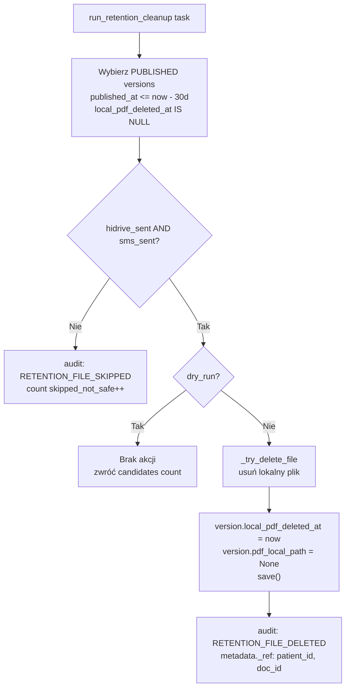

# Plan implementacji US-013 — retencja lokalnych plików PDF

## Stan bieżący (co jest już wdrożone)

Dla dokumentów medycznych (befund) mechanizm retencji jest **w pełni zaimplementowany**:

- `run_retention_cleanup` w `[apps/outbox/services.py](apps/outbox/services.py)` — selekcja, warunek `hidrive_sent AND sms_sent`, dry-run, usunięcie pliku, `local_pdf_deleted_at`, audit `RETENTION_FILE_DELETED` / `RETENTION_FILE_SKIPPED`
- DB constraint `medical_document_local_pdf_deletion_guard` (nie można ustawić `local_pdf_deleted_at` bez obu flag)
- Partial index `medical_document_retention_idx` (wyłącznie bezpieczne kandydaty)
- Task w `[apps/outbox/tasks.py](apps/outbox/tasks.py)` — hardcoded `older_than_days=30, dry_run=False`
- API endpoint `POST /operations/retention/run` (ADMIN, dry-run) w `[apps/outbox/api_views.py](apps/outbox/api_views.py)`
- Enqueue z `enqueue_tasks` / `run_periodic_tasks` w `[apps/operations/management/commands/](apps/operations/management/commands/)`
- Audit trail z `_ref` (IDs przeżywają SET_NULL po anonimizacji) w `[apps/operations/services.py](apps/operations/services.py)`
- 1 test API w `[apps/outbox/api_tests.py](apps/outbox/api_tests.py)` (`test_operations_retention_run_endpoint_dry_run_and_execute`)

**Brakuje:**

1. Retencja intake PDF (`IntakeDocumentVersion` nie ma `local_pdf_deleted_at`)
2. `PDF_RETENTION_DAYS` w settings (task ma hardcoded 30)
3. Właściwy komunikat portalu pacjenta — aktualnie 404 `file_missing`; powinno być 410/dedykowany komunikat gdy PDF usunięto retencją
4. Testy jednostkowe serwisu `run_retention_cleanup` (tylko test API)
5. Runbook w `docs/runbooks/`

---

## Zmiany do implementacji

### 1. Konfigurowalny `PDF_RETENTION_DAYS` w settings

- `[cogitomedica/settings.py](cogitomedica/settings.py)`: dodać `PDF_RETENTION_DAYS = int(os.environ.get("PDF_RETENTION_DAYS", "30"))`
- `[apps/outbox/tasks.py](apps/outbox/tasks.py)`: odczytywać z `settings.PDF_RETENTION_DAYS` zamiast hardcoded `30`

### 2. Retencja intake PDF

**Model** — `[apps/intake/models.py](apps/intake/models.py)` / `IntakeDocumentVersion`:

- Dodać pole `local_pdf_deleted_at = models.DateTimeField(blank=True, null=True, ...)`
- Dodać DB constraint: `local_pdf_deleted_at IS NULL OR hidrive_sent = True` (intake nie ma SMS — warunek tylko `hidrive_sent`)
- Dodać partial index analogiczny do `medical_document_retention_idx`
- Migracja

**Serwis** — `[apps/intake/outbox_services.py](apps/intake/outbox_services.py)` (lub nowy `apps/intake/retention_services.py`):

- Nowa funkcja `run_intake_retention_cleanup(*, older_than_days: int = 30, dry_run: bool = True)` — wzorzec 1:1 z `run_retention_cleanup`, warunek: `hidrive_sent=True` (bez `sms_sent`)
- Audit events: `INTAKE_RETENTION_FILE_DELETED`, `INTAKE_RETENTION_FILE_SKIPPED`

**Task** — `[apps/outbox/tasks.py](apps/outbox/tasks.py)`:

- Dodać `run_intake_retention_cleanup` task; enqueue z tą samą kolejką `"retention"`

**Enqueue** — `[apps/operations/management/commands/enqueue_tasks.py](apps/operations/management/commands/enqueue_tasks.py)` i `run_periodic_tasks.py`:

- Dodać enqueue `run_intake_retention_cleanup`

### 3. Portal pacjenta — „wyniki niedostępne online"

**Problem**: `get_patient_pdf_version` w `[apps/patient_results/](apps/patient_results/)` filtruje `local_pdf_deleted_at__isnull=True`, więc zwraca `None` → 404 identyczny jak przy nieautoryzowanym dostępie.

**Zmiana w `[apps/patient_results/services.py](apps/patient_results/services.py)`**:

- Wyodrębnić dwa przypadki:
  - Wersja nie istnieje / brak dostępu → `None` (→ 404, bez ujawniania powodu)
  - Wersja istnieje, ale `local_pdf_deleted_at IS NOT NULL` → nowy sygnał `RETENTION_EXPIRED`

**Zmiana w `[apps/patient_results/api_views.py](apps/patient_results/api_views.py)`**:

- Obsłużyć nowy przypadek → HTTP **410 Gone** z kluczem `other.api.document_retention_expired`
- Audit event `PATIENT_RESULTS_PDF_DOWNLOAD_DENIED` z `reason: "retention_expired"` (bez ujawniania szczegółów retention w odpowiedzi JSON)

**Tłumaczenie** — dodać klucz `other.api.document_retention_expired` do `[apps/core/translation_data/other_api.json](apps/core/translation_data/other_api.json)` (wzorzec alfabetyczny, między `document_not_found` a `duplicate_queue_slot`):

```json
"other.api.document_retention_expired": {
  "de": "Ihre Ergebnisse sind online nicht mehr verfügbar. Bitte kontaktieren Sie die Klinik.",
  "en": "Your results are no longer available online. Please contact the clinic.",
  "pl": "Wyniki nie są już dostępne online. Prosimy o kontakt z kliniką."
}
```

Klucz ładowany przez `python manage.py load_default_translations` (idempotentne).

### 4. Testy jednostkowe serwisu retencji

Plik `[apps/outbox/tests.py](apps/outbox/tests.py)` (lub nowy `test_retention.py`):

- `test_retention_skips_when_not_safe` — wersja bez `hidrive_sent` lub `sms_sent` → `skipped=1`, plik NIE usunięty, audit `RETENTION_FILE_SKIPPED`
- `test_retention_dry_run_does_not_delete` — `dry_run=True`, plik istnieje → nie usunięty, `local_pdf_deleted_at` null
- `test_retention_deletes_safe_version` — `hidrive_sent=True, sms_sent=True, published_at` > 30 dni → plik usunięty, `local_pdf_deleted_at` ustawiony, audit `RETENTION_FILE_DELETED`
- `test_retention_ignores_already_deleted` — `local_pdf_deleted_at` ustawiony → kandydat nie pojawia się w kolejce
- `test_retention_days_positive_guard` — `older_than_days=0` → `DomainError`
- Analogiczne testy dla `run_intake_retention_cleanup`

### 5. Runbook — `[docs/runbooks/RETENTION_PDF_CLEANUP.md](docs/runbooks/RETENTION_PDF_CLEANUP.md)`

Zawartość:

- Kiedy alert się odpala (np. `retention_skipped_count > 0` przez X dni)
- Jak uruchomić dry-run ręcznie: `POST /api/v1/operations/retention/run` `{"older_than_days": 30, "dry_run": true}`
- Jak sprawdzić blokady: zapytanie SQL / filtr audit events `RETENTION_FILE_SKIPPED`
- Najczęstsze przyczyny `skipped_not_safe` (HiDrive upload failed, SMS failed → outbox DEAD_LETTER)
- Jak zweryfikować integralność: `pdf_checksum_sha256` w DB vs plik na HiDrive
- Co zrobić gdy pacjent zgłosi brak dostępu po 30 dniach: ścieżka eskalacji do kliniki → HiDrive

---

## Diagram przepływu retencji (befund)




---

## Compliance / RODO — co jest zabezpieczone (retencja)

- `AuditEvent` z `_ref`: UUIDs pacjenta i dokumentu są trwale zapisane w `metadata._ref` — przeżywają SET_NULL na FK po ewentualnej przyszłej anonimizacji
- `pdf_checksum_sha256` i `hidrive_path` pozostają w DB po usunięciu lokalnego pliku — możliwa weryfikacja integralności i wskazanie lokalizacji archiwum
- HiDrive: długoterminowe archiwum (BÄK 10 lat) — kopia NIE jest usuwana przez retencję
- 30-dniowe okno pobierania: celowa decyzja produktowa; pacjent po upływie widzi 410 + komunikat „skontaktuj się z kliniką"
- Brak logowania ścieżki pliku ani treści PDF w audit events (tylko UUIDs i checksuma SHA-256)

---

## Anonimizacja — zakres i dane pozostające w systemie

> Anonimizacja (RODO Art. 17 — prawo do usunięcia) jest **poza zakresem tego planu**. Jest to osobna funkcja wymagająca osobnego US i wdrożenia jako `anonymize_patient(patient_id)` lub podobnie. Poniżej opisano, co by obejmowała i co po niej zostaje — żeby plan retencji był z nią spójny już teraz.

### Struktura danych PII w systemie


| Tabela / Model           | Pola PII                                                                                                      | Pola medyczne                                               | Pola nieusuwalne                                            |
| ------------------------ | ------------------------------------------------------------------------------------------------------------- | ----------------------------------------------------------- | ----------------------------------------------------------- |
| `Patient`                | `first_name`, `last_name`, `phone`, `email`, `date_of_birth`, `postal_code`, `address`, `doctolib_patient_id` | —                                                           | `id` (UUID), `created_at`                                   |
| `PatientIntakeForm`      | pośrednio przez FK `patient`                                                                                  | `anamnesis_payload`, `body_map_data`, `signature_file_path` | `id`, `created_at`                                          |
| `IntakeDocumentVersion`  | `snapshot_payload` (kopia danych pacjenta w momencie wypełnienia)                                             | zawartość snapshotu                                         | `id`, `created_at`, `pdf_checksum_sha256`                   |
| `MedicalDocumentVersion` | —                                                                                                             | `medical_payload` (Befund)                                  | `id`, `published_at`, `pdf_checksum_sha256`, `hidrive_path` |
| `QueueEntry`             | pośrednio przez FK `patient_id`                                                                               | —                                                           | `id`, `created_at`                                          |
| `AuditEvent`             | NIE ANONYMIZOWAĆ — dokument audytowy                                                                          | —                                                           | cały wiersz, `_ref` w metadata                              |


### Co robiłaby anonimizacja (przyszła implementacja)

**Kasowane / zerowane** (na tabeli `Patient`):

- `first_name` → `"ANONYMIZED"`, `last_name` → `"ANONYMIZED"`, `phone` → unikalny pseudonim (np. `"ANON-<uuid4>"` żeby nie łamać unikalności), `email` → `"anon-<uuid>@deleted.invalid"`, `date_of_birth` → NULL lub `1900-01-01`, `postal_code` / `address` → NULL, `doctolib_patient_id` → NULL

**Kasowane pliki** (filesystem):

- `PatientIntakeForm.signature_file_path` — fizyczny plik podpisu SVG/PNG
- lokalne PDFs — powinny być już usunięte przez retencję; jeśli nie — usunąć natychmiast niezależnie od flag `hidrive_sent` / `sms_sent`

**Zerowane payloady** (dane osobowe w JSON):

- `PatientIntakeForm.anamnesis_payload` → `{}` / `{"anonymized": true}`, `body_map_data` → `[]`
- `IntakeDocumentVersion.snapshot_payload` → `{"anonymized": true}`

**Napięcie RODO vs BÄK**: Dokumentacja medyczna podlega 10-letniemu obowiązkowi przechowywania (§10 MBO-Ä). Dlatego:

- `MedicalDocumentVersion.medical_payload` (Befund) — **NIE zerować** bez decyzji prawnej; w praktyce usunięcie identyfikatora pacjenta (SET_NULL na FK) może wystarczyć, jeśli Befund staje się niereidentyfikowalny
- Plik na HiDrive — decyzja kliniki / RODO-konsultanta; nie jest w zakresie aplikacji

### Co zostaje w systemie po anonimizacji

- Wszystkie wiersze `AuditEvent` — niezmienione; FK (`patient_id`, `medical_document_id`) stają się NULL (SET_NULL już działa); `_ref.patient_id` (UUID) pozostaje — umożliwia korelację zdarzeń bez PII
- Wiersze `QueueEntry`, `DailyQueue`, `MedicalDocumentVersion` — zostają, FK `patient_id` → NULL
- `MedicalDocumentVersion`: `pdf_checksum_sha256`, `hidrive_path`, `published_at`, `local_pdf_deleted_at` — zostają dla audytu BÄK
- `OutboxEvent` — zostaje (FK na `MedicalDocumentVersion` przez CASCADE lub NULL zgodnie z modelem)

### Spójność z retencją

Retencja (ten plan) nie wpływa na anonimizację. Jedyna korelacja: jeśli żądanie anonimizacji przyjdzie przed upływem 30 dni (lokalne PDFs jeszcze istnieją), serwis anonimizacji powinien:

1. Natychmiastowo usunąć lokalne pliki PDF (niezależnie od `hidrive_sent` / `sms_sent`) — prawo do usunięcia > polityka retencji
2. Ustawić `local_pdf_deleted_at = now` na wszystkich wersjach pacjenta
3. Wyemitować audit event `PATIENT_ANONYMIZED` z `_ref` (po czym FK będą NULL)

