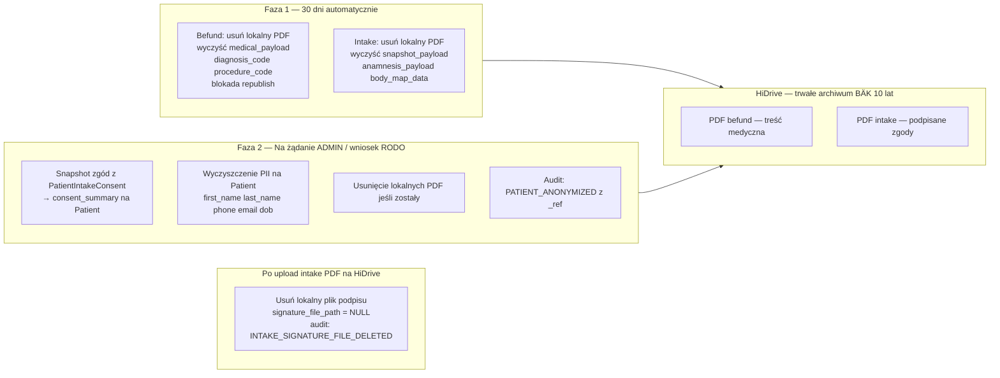

# Plan implementacji US-013 — Retencja PDF + Anonimizacja pacjenta

## Przegląd architektury: dwufazowy cykl życia




---

## Stan bieżący (co jest już wdrożone)

Dla befund retencja jest **w pełni zaimplementowana**:

- `run_retention_cleanup` w `[apps/outbox/services.py](apps/outbox/services.py)` — selekcja, warunek `hidrive_sent AND sms_sent`, dry-run, `local_pdf_deleted_at`, audit `RETENTION_FILE_DELETED` / `RETENTION_FILE_SKIPPED`
- DB constraint `medical_document_local_pdf_deletion_guard` + partial index `medical_document_retention_idx`
- Task w `[apps/outbox/tasks.py](apps/outbox/tasks.py)` — hardcoded `older_than_days=30, dry_run=False`
- API `POST /operations/retention/run` (ADMIN, dry-run) w `[apps/outbox/api_views.py](apps/outbox/api_views.py)`
- Enqueue w `[apps/operations/management/commands/](apps/operations/management/commands/)`
- `AuditEvent._ref` (IDs przeżywają SET_NULL po anonimizacji) w `[apps/operations/services.py](apps/operations/services.py)`
- 1 test API (`test_operations_retention_run_endpoint_dry_run_and_execute`)

**Brakuje:**

1. Retencja intake PDF (brak `local_pdf_deleted_at` na `IntakeDocumentVersion`)
2. `PDF_RETENTION_DAYS` w settings (hardcoded 30 w task)
3. Portal pacjenta: generic 404 zamiast dedykowanego 410 gdy plik usunięty retencją
4. Testy jednostkowe serwisu `run_retention_cleanup`
5. Anonimizacja pacjenta (serwis + model + API)
6. Runbook

---

## Faza 1: Retencja lokalnych plików PDF

### 1a. Konfigurowalny `PDF_RETENTION_DAYS`

- `[cogitomedica/settings.py](cogitomedica/settings.py)`: `PDF_RETENTION_DAYS = int(os.environ.get("PDF_RETENTION_DAYS", "30"))`
- `[apps/outbox/tasks.py](apps/outbox/tasks.py)`: `run_retention_cleanup_service(older_than_days=settings.PDF_RETENTION_DAYS, dry_run=False)`; analogicznie dla intake task

### 1b. Retencja intake PDF — model i migracja

`**[apps/intake/models.py](apps/intake/models.py)`** / `IntakeDocumentVersion`:

```python
local_pdf_deleted_at = models.DateTimeField(blank=True, null=True)
```

DB constraint (tylko `hidrive_sent`, bez `sms_sent` — intake nie ma SMS):

```python
models.CheckConstraint(
    condition=Q(local_pdf_deleted_at__isnull=True) | Q(hidrive_sent=True),
    name="intake_document_local_pdf_deletion_guard",
)
```

Partial index dla wydajności selekcji kandydatów:

```python
models.Index(
    fields=["created_at"],
    name="intake_document_retention_idx",
    condition=Q(hidrive_sent=True, local_pdf_deleted_at__isnull=True),
)
```

Dodać również `anonymization_deleted_at` — osobne pole dla wymuszonego usunięcia przez Art. 17 (bez żadnego constrainta, patrz sekcja „Art. 17 vs. DB constraint"):

```python
anonymization_deleted_at = models.DateTimeField(blank=True, null=True)
```

Zaktualizować kwerendy dostępu w `apps/intake/` o filtr `anonymization_deleted_at__isnull=True` wszędzie, gdzie pobierane są wersje dostępne do pobrania lub wyświetlenia.

### 1c. Wyczyszczenie podpisu po upload na HiDrive (pipeline outbox)

`**[apps/intake/outbox_services.py](apps/intake/outbox_services.py)**` — w `_execute_event`, bezpośrednio po potwierdzeniu `HIDRIVE_UPLOAD_INTAKE_PDF`:

```python
# Podpis odręczny = biometria (RODO Art. 9); wyrenderowany w PDF na HiDrive → lokalny plik zbędny
_try_delete_file(version.intake_form.signature_file_path)
version.intake_form.signature_file_path = None
version.intake_form.save(update_fields=["signature_file_path", "updated_at"])
create_audit_event(
    event_type="INTAKE_SIGNATURE_FILE_DELETED",
    patient_id=...,
    metadata={"intake_document_version_id": str(version.id), "reason": "hidrive_confirmed"},
)
```

Nie czekamy 30 dni — biometria jest zbędna od momentu gdy PDF jest na HiDrive.

### 1d. Serwis retencji intake + wyczyszczenie danych zdrowotnych

Nowy plik `**[apps/intake/retention_services.py](apps/intake/retention_services.py)**`:

```python
@transaction.atomic
def run_intake_retention_cleanup(*, older_than_days: int = 30, dry_run: bool = True):
    # warunek: IntakeDocumentVersion, created_at <= now - days,
    # hidrive_sent=True, local_pdf_deleted_at IS NULL
    # skip gdy hidrive_sent=False → audit INTAKE_RETENTION_FILE_SKIPPED
    # dry_run=True → tylko zlicz kandydatów
    # execute:
    #   _try_delete_file(version.pdf_local_path)
    #   version.local_pdf_deleted_at = now, version.pdf_local_path = None
    #   version.snapshot_payload = {"cleared_at_retention": True}   ← PII + zdrowie
    #   intake_form.anamnesis_payload = {}                           ← Art. 9 RODO
    #   intake_form.body_map_data = []                               ← dane zdrowotne
    #   audit INTAKE_RETENTION_FILE_DELETED
```

> Użyć `created_at` (data złożenia formularza) jako timestamp — intake nie ma `published_at`.

**Tabela decyzji — co czyścić kiedy:**


| Pole                               | Wyczyszczone kiedy  | Uzasadnienie                                                          |
| ---------------------------------- | ------------------- | --------------------------------------------------------------------- |
| `signature_file_path` (plik)       | Po upload HiDrive   | Biometria Art. 9; wyrenderowana w PDF                                 |
| `snapshot_payload`                 | Retencja 30 dni     | PII + zdrowie; cel (render PDF) spełniony                             |
| `anamnesis_payload`                | Retencja 30 dni     | Art. 9 RODO — leki, alergie, choroby                                  |
| `body_map_data`                    | Retencja 30 dni     | Dane zdrowotne; zbędne po archiwizacji                                |
| `medical_payload` (befund)         | **Retencja 30 dni** | Republish **zablokowany** po `local_pdf_deleted_at`; kopia na HiDrive |
| `diagnosis_code`, `procedure_code` | **Retencja 30 dni** | Kody medyczne; zbędne operacyjnie po archiwizacji                     |
| PII pacjenta                       | Pełna anonimizacja  | Operacyjnie potrzebne dopóki pacjent aktywny                          |


**Co zostaje w DB po retencji intake:**

- `PatientIntakeConsent` wiersze — strukturalne zgody (kod + `accepted`), bez treści zdrowotnych
- `signature_sha256` — suma kontrolna, nie ujawnia treści
- `hidrive_path`, `pdf_checksum_sha256` — wskaźnik i integralność archiwum HiDrive

### 1e. Befund — wyczyszczenie treści medycznej przy retencji + blokada republish

**Rozszerzenie `run_retention_cleanup`** w `[apps/outbox/services.py](apps/outbox/services.py)` — obok usunięcia pliku:

```python
version.medical_payload = {"cleared_at_retention": True}
version.diagnosis_code = None
version.procedure_code = None
version.save(update_fields=[
    "local_pdf_deleted_at", "pdf_local_path",
    "medical_payload", "diagnosis_code", "procedure_code",
])
```

**Blokada republish** w `[apps/medical/services.py](apps/medical/services.py)`:

```python
if current_version.local_pdf_deleted_at is not None:
    raise DomainError(
        domain_message("other.domain.republish_after_retention_not_allowed"),
        api_message_key="other.domain.republish_after_retention_not_allowed",
    )
```

Klucz tłumaczenia do `[apps/core/translation_data/other_domain.json](apps/core/translation_data/other_domain.json)`:

```json
"other.domain.republish_after_retention_not_allowed": {
  "de": "Eine erneute Veröffentlichung ist nach Ablauf der Aufbewahrungsfrist nicht möglich.",
  "en": "Republishing is not allowed after the retention period has passed.",
  "pl": "Ponowna publikacja nie jest możliwa po upływie okresu retencji."
}
```

**Stan UI lekarza po retencji — `retention_expired` flag**

Po wyczyszczeniu `medical_payload`, `diagnosis_code`, `procedure_code` widok lekarza (`get_medical_document_context` w `[apps/medical/services.py](apps/medical/services.py)`) musi rozróżniać dokument archiwalny od błędu ładowania. Zmiana w serializacji wersji:

```python
if current_version.local_pdf_deleted_at:
    current_version_payload = {
        "version_no": current_version.version_no,
        "version_status": current_version.version_status,
        "retention_expired": True,                       # ← sygnał dla UI
        "local_pdf_deleted_at": current_version.local_pdf_deleted_at.isoformat(),
        "hidrive_path": current_version.hidrive_path,
        "pdf_checksum_sha256": current_version.pdf_checksum_sha256,
        # medical_payload, diagnosis_code, procedure_code — celowo pominięte
    }
else:
    current_version_payload = {
        # ... dotychczasowa struktura z medical_payload itd.
    }
```

Frontend sprawdza `retention_expired == True` i wyświetla dedykowany komunikat zamiast pustego formularza. Klucz tłumaczenia `other.domain.republish_after_retention_not_allowed` (już zaplanowany dla blokady republish) może być tu reużyty lub dodać osobny `other.domain.document_retention_archived`.

**Co zostaje w DB po retencji befund:**

- `hidrive_path`, `pdf_checksum_sha256` — wskaźnik i integralność archiwum
- `published_at`, `local_pdf_deleted_at`, `hidrive_sent_at`, `sms_sent_at` — timestampy audytowe
- `version_status`, `publish_locale`, `version_no` — metadane wersji
- `publish_requested_by_user`, `published_by_user` — kto opublikował (FK → NULL przy pełnej anonimizacji, `_ref` w `AuditEvent`)

### 1f. Art. 17 vs. DB constraint — `anonymization_deleted_at`

**Problem**: istniejący `CheckConstraint medical_document_local_pdf_deletion_guard` wymaga `hidrive_sent=True AND sms_sent=True` jako warunku ustawienia `local_pdf_deleted_at`. Anonimizacja na żądanie (RODO Art. 17) musi usuwać lokalne pliki PDF natychmiast, niezależnie od tego, czy HiDrive upload się zakończył. Próba ustawienia `local_pdf_deleted_at` bez spełnienia warunku → crash na poziomie DB.

**Rozwiązanie**: nowe pole `anonymization_deleted_at` na `MedicalDocumentVersion` (i analogicznie `IntakeDocumentVersion`) z osobną semantyką — brak constraintów, prawo do usunięcia nie wymaga warunków wstępnych.

```python
# apps/medical/models.py — MedicalDocumentVersion
anonymization_deleted_at = models.DateTimeField(blank=True, null=True)

# apps/intake/models.py — IntakeDocumentVersion
anonymization_deleted_at = models.DateTimeField(blank=True, null=True)
```

Istniejący constraint `medical_document_local_pdf_deletion_guard` pozostaje **nienaruszony** — nadal chroni ścieżkę retencji automatycznej. Anonimizacja używa wyłącznie nowego pola.

Kwerendy w `[apps/patient_results/document_services.py](apps/patient_results/document_services.py)` — rozszerzyć oba filtry:

```python
# get_patient_pdf_version i list_patient_documents:
local_pdf_deleted_at__isnull=True,
anonymization_deleted_at__isnull=True,   # ← nowy filtr
```

### 1g. Per-record transakcje w retention cleanup

**Problem**: obecny `run_retention_cleanup` blokuje wszystkich kandydatów w jednej transakcji przez cały czas przetwarzania (selekcja + pętla + I/O na plikach). Przy większym backlogu powoduje długotrwałe locki na tabeli.

**Rozwiązanie**: wyciągnij selekcję kandydatów poza transakcję (tylko ID-je, bez locków), przetwarzaj każdy rekord w osobnym `@transaction.atomic` z `select_for_update(nowait=True)`:

```python
def run_retention_cleanup(*, older_than_days: int, dry_run: bool) -> RetentionCleanupResult:
    threshold = timezone.now() - timedelta(days=older_than_days)
    candidate_ids = list(
        MedicalDocumentVersion.objects.filter(
            version_status=DocVersionStatus.PUBLISHED,
            published_at__lte=threshold,
            local_pdf_deleted_at__isnull=True,
        ).values_list("id", flat=True)
    )
    for version_id in candidate_ids:
        _process_single_version_retention(version_id, dry_run=dry_run, ...)

@transaction.atomic
def _process_single_version_retention(version_id, *, dry_run, older_than_days):
    try:
        version = MedicalDocumentVersion.objects.select_for_update(nowait=True).get(
            id=version_id,
            local_pdf_deleted_at__isnull=True,  # re-check po locku
        )
    except MedicalDocumentVersion.DoesNotExist:
        return  # już przetworzone
    except OperationalError:
        return  # inny worker trzyma lock — pomiń, następny cykl schedulera podejmie próbę
    ...
```

Analogicznie dla `run_intake_retention_cleanup`.

### 1i. Portal pacjenta — 410 Gone

`**[apps/patient_results/services.py](apps/patient_results/services.py)`**:
Wyodrębnić dwa przypadki zamiast jednego:

- Wersja nie istnieje / brak autoryzacji → `None` (→ 404, brak informacji o przyczynie)
- Wersja istnieje ale `local_pdf_deleted_at IS NOT NULL` → sentinel `"RETENTION_EXPIRED"` (→ 410)

`**[apps/patient_results/api_views.py](apps/patient_results/api_views.py)`**:

- 410 z kluczem `other.api.document_retention_expired`
- Audit: `PATIENT_RESULTS_PDF_DOWNLOAD_DENIED` z `reason: "retention_expired"`

`**[apps/core/translation_data/other_api.json](apps/core/translation_data/other_api.json)`** (między `document_not_found` a `duplicate_queue_slot`):

```json
"other.api.document_retention_expired": {
  "de": "Ihre Ergebnisse sind online nicht mehr verfügbar. Bitte kontaktieren Sie die Klinik.",
  "en": "Your results are no longer available online. Please contact the clinic.",
  "pl": "Wyniki nie są już dostępne online. Prosimy o kontakt z kliniką."
}
```

---

## Faza 2: Anonimizacja pacjenta

### Kluczowy fakt: `PatientIntakeConsent` już istnieje

`[apps/intake/models.py](apps/intake/models.py)` zawiera model `PatientIntakeConsent` z:

- FK do `ConsentDefinition` (ma `code`, `version`, `title_de/en/pl`, `is_required`)
- `accepted: bool`, `accepted_at: datetime`
- `selected_option_codes: list` (dla zgód wielowariantowych)

To oznacza, że **nie trzeba parsować `anamnesis_payload`** żeby poznać zgody. Serwis anonimizacji po prostu odczyta `PatientIntakeConsent` przed wyczyszczeniem i zapisze snapshot.

### 2a. Model — nowe pola na `Patient` i migracja `date_of_birth`

`**[apps/reception/models.py](apps/reception/models.py)**`:

```python
# Pole istniejące — zmienić na nullable (migracja wymagana):
date_of_birth = models.DateField(blank=True, null=True, ...)

# Nowe pola anonimizacji:
anonymization_started_at = models.DateTimeField(blank=True, null=True)
anonymized_at = models.DateTimeField(blank=True, null=True)
consent_summary = models.JSONField(blank=True, null=True)
```

**Dlaczego `date_of_birth` nullable**: serwis anonimizacji ustawia go na `None`; brak `null=True` powoduje rollback transakcji na poziomie DB. Po anonimizacji pacjent nie może się zalogować przez OTP (nie ma telefonu w formacie cyfrowym, brak DOB) — to prawidłowe zachowanie.

`**anonymization_started_at`** — znacznik początku operacji anonimizacji. Umożliwia wykrycie partial failure: `anonymization_started_at IS NOT NULL AND anonymized_at IS NULL` → anonimizacja padła na etapie I/O plików, można bezpiecznie wznowić od fazy 2 (pliki, które zniknęły, `_try_delete_file` pominie cicho).

Runbook query dla admina:

```python
Patient.objects.filter(anonymization_started_at__isnull=False, anonymized_at__isnull=True)
```

`consent_summary` — format (przykład):

```json
{
  "extracted_at": "2025-03-01T10:00:00Z",
  "consents": [
    {
      "code": "PHONE_CONTACT",
      "version": 1,
      "accepted": true,
      "accepted_at": "2024-11-15T09:30:00Z",
      "intake_form_id": "uuid-...",
      "queue_date": "2024-11-15"
    },
    {
      "code": "EMAIL_MARKETING",
      "version": 1,
      "accepted": false,
      "accepted_at": null,
      "intake_form_id": "uuid-...",
      "queue_date": "2024-11-15"
    }
  ]
}
```

- `intake_form_id` pozostaje jako referencja do wiersza DB i odpowiadającego PDF intake na HiDrive
- `queue_date` dla czytelności audytu
- Jeśli pacjent miał wiele wizyt, `consents` zawiera najnowszy zestaw (ostatnia data `submitted_at`)

### 2b. Serwis anonimizacji — dwufazowy commit

Nowy plik `**[apps/reception/anonymization.py](apps/reception/anonymization.py)**`.

Podział na trzy funkcje eliminuje ryzyko partial failure (FS nie jest transakcyjny):

```python
_TERMINAL_STATUSES = {QueueEntryStatus.PUBLISHED, QueueEntryStatus.CANCELLED}

def anonymize_patient(patient_id: uuid.UUID, *, actor_user_id: uuid.UUID) -> Patient:
    """Punkt wejścia — orkiestruje trzy fazy."""
    # Pre-check poza transakcją: blokada jeśli pacjent ma aktywne wizyty w kolejce.
    # Statusy terminalne (PUBLISHED, CANCELLED) nie blokują.
    active_count = QueueEntry.objects.filter(
        patient_id=patient_id,
    ).exclude(
        entry_status__in=_TERMINAL_STATUSES,
    ).count()
    if active_count > 0:
        raise DomainError(
            domain_message("other.domain.anonymization_patient_has_active_visits"),
            api_message_key="other.domain.anonymization_patient_has_active_visits",
        )

    patient, should_continue = _phase1_begin(patient_id)
    if not should_continue:
        return patient                   # już zanonimizowany — idempotentne
    _phase2_delete_files(patient_id)     # I/O poza transakcją DB
    return _phase3_finalize(patient_id, actor_user_id=actor_user_id)


@transaction.atomic
def _phase1_begin(patient_id: uuid.UUID) -> tuple[Patient, bool]:
    """
    Faza 1 (DB, krótka transakcja):
    - idempotentność: jeśli anonymized_at → return (patient, False)
    - partial failure detection: jeśli anonymization_started_at bez anonymized_at
      → poprzednie wywołanie padło na plikach → kontynuuj od fazy 2
    - snapshot zgód, wyczyszczenie payloadów, ustawienie anonymization_started_at
    """
    patient = Patient.objects.select_for_update().get(id=patient_id)

    if patient.anonymized_at:
        return patient, False            # kompletne — nic nie rób

    if not patient.anonymization_started_at:
        # Pierwsze wywołanie — snapshot + cleanup DB payloadów
        consent_summary = _extract_consent_summary(patient_id)
        PatientIntakeForm.objects.filter(
            queue_entry__patient_id=patient_id
        ).update(anamnesis_payload={}, body_map_data=[])
        IntakeDocumentVersion.objects.filter(
            intake_form__queue_entry__patient_id=patient_id
        ).update(snapshot_payload={"anonymized": True})
        Patient.objects.filter(id=patient_id).update(
            consent_summary=consent_summary,
            anonymization_started_at=now(),
        )
    # else: poprzednia faza 1 zakończyła się, ale faza 2 padła → pomiń cleanup,
    #        idź do usunięcia plików (faza 2 jest idempotentna przez _try_delete_file)

    patient.refresh_from_db()
    return patient, True


def _phase2_delete_files(patient_id: uuid.UUID) -> None:
    """
    Faza 2 (poza transakcją DB — FS I/O):
    - _try_delete_file pomija brakujące pliki cicho → idempotentne przy retry
    - używa anonymization_deleted_at zamiast local_pdf_deleted_at (brak constraintów)
    """
    _delete_signature_files(patient_id)

    now_ts = now()
    # Befund versions
    befund_versions = MedicalDocumentVersion.objects.filter(
        medical_document__queue_entry__patient_id=patient_id,
        pdf_local_path__isnull=False,
        anonymization_deleted_at__isnull=True,
    )
    for v in befund_versions:
        _try_delete_file(v.pdf_local_path)
        MedicalDocumentVersion.objects.filter(id=v.id).update(
            pdf_local_path=None,
            anonymization_deleted_at=now_ts,
        )

    # Intake versions
    intake_versions = IntakeDocumentVersion.objects.filter(
        intake_form__queue_entry__patient_id=patient_id,
        pdf_local_path__isnull=False,
        anonymization_deleted_at__isnull=True,
    )
    for v in intake_versions:
        _try_delete_file(v.pdf_local_path)
        IntakeDocumentVersion.objects.filter(id=v.id).update(
            pdf_local_path=None,
            anonymization_deleted_at=now_ts,
        )


@transaction.atomic
def _phase3_finalize(patient_id: uuid.UUID, *, actor_user_id: uuid.UUID) -> Patient:
    """
    Faza 3 (DB, krótka transakcja):
    - wyczyszczenie PII przez update() zamiast save() — omija normalize_phone,
      model.clean() i sygnały Django; konieczne, bo sentinel values łamią
      operacyjne invarianty (phone regex, date_of_birth non-null)
    - ustawienie anonymized_at = punkt idempotentności dla kolejnych wywołań
    """
    patient = Patient.objects.select_for_update().get(id=patient_id)
    if patient.anonymized_at:
        return patient                   # faza 3 już zakończona

    Patient.objects.filter(id=patient_id).update(
        first_name="ANONYMIZED",
        last_name="ANONYMIZED",
        # UUID.int = 128-bit integer, dziesiętnie zawsze 38-39 cyfr [0-9].
        # Pierwsze 20 cyfr spełnia CHECK constraint ^[0-9]{7,20}$ deterministycznie.
        # update() omija normalize_phone i Django validation; constraint DB jest spełniony.
        phone=str(patient_id.int)[:20],
        email=f"anon-{patient_id}@deleted.invalid",
        date_of_birth=None,             # nullable po migracji
        street=None,
        city=None,
        postal_code=None,
        doctolib_patient_id=None,
        anonymized_at=now(),
    )
    create_audit_event(
        event_type="PATIENT_ANONYMIZED",
        actor_user_id=actor_user_id,
        patient_id=patient_id,
        metadata={"_ref": {"patient_id": str(patient_id)}},
    )
    return Patient.objects.get(id=patient_id)
```

**Uwaga o `phone` i constraintach**: `save()` wywołuje `normalize_phone`, który usuwa znaki niebędące cyframi — użycie `update()` omija to jawnie. Constraint DB `patient_phone_format` (`^[0-9]{7,20}$`) jest spełniony bezwarunkowo: `uuid.UUID.int` to 128-bit integer, którego reprezentacja dziesiętna ma zawsze 38-39 cyfr (`0-9`). Pierwsze 20 cyfr jest unikalne per-pacjent (UUID są unikalne), więc spełniony jest też `patient_phone_unique`.

### 2c. API endpoint

`POST /api/v1/patients/<patient_id>/anonymize` — ADMIN only:

- Wywołuje `anonymize_patient(patient_id, actor_user_id=request.user.id)`
- Gdy pacjent ma aktywne wizyty: `DomainError` → HTTP 422 z kluczem `other.domain.anonymization_patient_has_active_visits`
- Dodatkowy audit: `PATIENT_ANONYMIZE_REQUESTED` z `client_ip`
- Odpowiedź: `{"patient_id": "...", "anonymized_at": "..."}`

Klucz tłumaczenia blokady anonimizacji do `[apps/core/translation_data/other_domain.json](apps/core/translation_data/other_domain.json)`:

```json
"other.domain.anonymization_patient_has_active_visits": {
  "de": "Der Patient kann nicht anonymisiert werden, da er aktive Einträge in der Warteschlange hat.",
  "en": "Patient cannot be anonymized because they have active queue entries.",
  "pl": "Pacjent nie może zostać zanonimizowany, ponieważ ma aktywne wpisy w kolejce."
}
```

---

## Co pozostaje w systemie po anonimizacji


| Dane                                         | Stan po anonimizacji                                 | Uzasadnienie                              |
| -------------------------------------------- | ---------------------------------------------------- | ----------------------------------------- |
| Dane                                         | Kiedy czyszczone                                     | Stan końcowy                              |
| ---                                          | ---                                                  | ---                                       |
| `signature_file_path` (plik)                 | **Po upload HiDrive**                                | NULL                                      |
| `snapshot_payload`                           | **Retencja 30 dni**                                  | `{"cleared_at_retention": true}`          |
| `anamnesis_payload`                          | **Retencja 30 dni**                                  | `{}`                                      |
| `body_map_data`                              | **Retencja 30 dni**                                  | `[]`                                      |
| `medical_payload`                            | **Retencja 30 dni**                                  | `{"cleared_at_retention": true}`          |
| `diagnosis_code`, `procedure_code`           | **Retencja 30 dni**                                  | `None`                                    |
| Lokalne PDFs befund/intake (retencja)        | **Retencja 30 dni** (hidrive+sms wymagane)           | Plik usunięty, `local_pdf_deleted_at`     |
| Lokalne PDFs befund/intake (anonimizacja)    | **Faza 2 anonimizacji** (niezależnie od hidrive/sms) | Plik usunięty, `anonymization_deleted_at` |
| PII pacjenta (`first_name` itd.)             | **Pełna anonimizacja** (faza 3)                      | `"ANONYMIZED"` / NULL                     |
| `Patient.consent_summary`                    | Zapisywany **przy anonimizacji**                     | JSON snapshot zgód                        |
| `PatientIntakeConsent` wiersze               | Nigdy nie usuwane                                    | Nienaruszone                              |
| `AuditEvent` wiersze                         | Nigdy nie usuwane                                    | FK → NULL, `_ref` zachowany               |
| `MedicalDocumentVersion.hidrive_path`        | Nigdy                                                | Zachowany                                 |
| `MedicalDocumentVersion.pdf_checksum_sha256` | Nigdy                                                | Zachowany                                 |
| PDF befund na HiDrive                        | Poza zakresem aplikacji                              | Zostaje                                   |
| PDF intake na HiDrive                        | Poza zakresem aplikacji                              | Zostaje                                   |


### Ścieżki HiDrive — UUID, `/patients/` bez `/hidrive/`

**Plik:** [apps/outbox/hidrive_paths.py](apps/outbox/hidrive_paths.py)

Docelowy układ logiczny (współrzędny z `/incoming/` i `/processed/`):

- PDF Befund / intake: `/patients/{patient_uuid}/Befund_v{N}.pdf`, `/patients/{patient_uuid}/Intake_v{N}.pdf`
- W kodzie: `HIDRIVE_PATIENTS_DIR_PREFIX = "/patients"`, `build_befund_hidrive_path` / `build_intake_hidrive_path`

**Korzyści:**

- Listing folderów HiDrive nie ujawnia nazwisk pacjentów w nazwie katalogu (tylko UUID)
- Ścieżka stabilna względem anonimizacji tożsamości w DB (UUID pacjenta)
- Prosta, deterministyczna

**Uwaga:** `hidrive_path` jest zapisywany w DB przy pierwszym uploadzie; zmiana konwencji dotyczy nowych dokumentów. Starsze wpisy w DB lub pliki na dysku kliniki mogą wymagać migracji ręcznej lub skryptu (poza zakresem tego planu).

### Napięcie RODO Art. 17 vs BÄK §10 MBO-Ä

- Pliki PDF na HiDrive zawierają imię/nazwisko **w treści** (podpisany dokument) — usunięcie treści PDF poza zakresem aplikacji (decyzja kliniki / RODO-konsultanta); **ścieżka pliku** nie zawiera PII (UUID)
- `medical_payload` czyszczony **przy retencji 30 dni** razem z plikiem PDF; republish zablokowany → brak kolizji z BÄK (kopia medyczna jest na HiDrive)
- Po retencji DB zawiera wyłącznie metadane (timestampy, flagi, UUIDs) i PII pacjenta — żadnych treści medycznych
- System nie wymusza usunięcia z HiDrive — dostarcza narzędzia do minimalizacji danych w DB

---

## Podział na PR-y — ograniczenie blast radius

Plan dotyka 8 aplikacji i 6 warstw (outbox, intake, medical, patient_results, reception, core/translations). Implementacja w jednym PR tworzy bardzo duże okno regresji. Rekomendowany podział:


| PR                                       | Zakres                                                                                                                                                                                                                                                           | Zależności                          |
| ---------------------------------------- | ---------------------------------------------------------------------------------------------------------------------------------------------------------------------------------------------------------------------------------------------------------------- | ----------------------------------- |
| **PR-1: Migracje**                       | Nowe pola w modelach: `anonymization_started_at`, `anonymized_at`, `consent_summary`, `date_of_birth nullable` na `Patient`; `anonymization_deleted_at` na `MedicalDocumentVersion` i `IntakeDocumentVersion`; `local_pdf_deleted_at` na `IntakeDocumentVersion` | Brak — czyste migracje, zero logiki |
| **PR-2: Retencja intake**                | `run_intake_retention_cleanup`, task, enqueue, testy, signature delete po HiDrive upload                                                                                                                                                                         | PR-1                                |
| **PR-3: Befund extensions + portal 410** | Wyczyszczenie `medical_payload` przy retencji, blokada republish, `retention_expired` w UI lekarza, per-record transakcje, portal 410, translacje                                                                                                                | PR-1                                |
| **PR-4: Anonimizacja**                   | `anonymize_patient` (trzy fazy), API endpoint, `anonymization_deleted_at` w document queries, testy, runbook                                                                                                                                                     | PR-1, PR-2, PR-3                    |


Każdy PR ma własne testy i może być deployowany niezależnie. Pary, które się wzajemnie testują:

- PR-2 i PR-3 nie mają wzajemnych zależności → mogą iść równolegle
- PR-4 musi być ostatni — anonimizacja czyści pola, które PR-2 i PR-3 ustawiają

---

## Testy jednostkowe

### Retencja befund (`apps/outbox/tests.py`)

- `test_retention_skips_when_not_safe` — `hidrive_sent=False` OR `sms_sent=False` → `skipped=1`, plik nie usunięty, audit `RETENTION_FILE_SKIPPED`
- `test_retention_dry_run_does_not_delete` — `dry_run=True` → plik istnieje po wywołaniu
- `test_retention_deletes_safe_version` — `hidrive_sent=True, sms_sent=True, published_at > 30d` → plik usunięty, `local_pdf_deleted_at` ustawiony, audit `RETENTION_FILE_DELETED`
- `test_retention_ignores_already_deleted` — `local_pdf_deleted_at` ustawiony → `candidates=0`
- `test_retention_days_positive_guard` — `older_than_days=0` → `DomainError`

### Retencja intake (`apps/intake/tests.py`)

- Analogiczne 5 testów dla `run_intake_retention_cleanup` (warunek: tylko `hidrive_sent=True`)
- `test_intake_retention_clears_anamnesis` — po execute: `anamnesis_payload == {}`, `body_map_data == []`, `snapshot_payload == {"cleared_at_retention": True}`
- `test_intake_signature_deleted_after_hidrive` — po `HIDRIVE_UPLOAD_INTAKE_PDF`: `signature_file_path IS NULL`, plik usunięty, audit `INTAKE_SIGNATURE_FILE_DELETED`

### Retencja befund — per-record lock

- `test_retention_skips_locked_record` — gdy inny worker trzyma lock (`select_for_update(nowait=True)` rzuca `OperationalError`), rekord jest pomijany bez błędu; kolejny call przetwarza go poprawnie

### Anonimizacja (`apps/reception/tests.py` lub nowy plik)

- `test_anonymize_clears_pii` — po anonimizacji pola PII wyczyszczone (`first_name="ANONYMIZED"`, `street=None`, `date_of_birth=None`), `anonymized_at` ustawiony
- `test_anonymize_phone_sentinel_passes_constraint` — sentinel `phone` po anonimizacji (`str(patient_id.int)[:20]`) zawiera wyłącznie cyfry dziesiętne, ma długość 20, spełnia `patient_phone_format` (`^[0-9]{7,20}$`) i `patient_phone_unique`
- `test_anonymize_preserves_consent_summary` — `consent_summary` zawiera kody zgód i wartości `accepted`
- `test_anonymize_does_not_need_to_clear_medical_payload` — po anonimizacji `medical_payload` już `{"cleared_at_retention": true}` (retencja to zrobiła wcześniej)
- `test_anonymize_deletes_signature_file` — plik podpisu usunięty z FS (jeśli nie wcześniej przez outbox)
- `test_anonymize_sets_anonymization_deleted_at` — `anonymization_deleted_at` ustawiony na obu modelach wersji, plik fizycznie usunięty; `local_pdf_deleted_at` **nie** jest modyfikowany przez anonimizację
- `test_anonymize_deletes_pdf_regardless_of_hidrive_sent` — lokalne PDFs usunięte nawet gdy `hidrive_sent=False` (Art. 17 > constraint)
- `test_anonymize_idempotent_complete` — drugi call gdy `anonymized_at` ustawiony: zwraca pacjenta bez żadnych zmian, brak nowych AuditEvent
- `test_anonymize_partial_failure_recovery` — symulacja partial failure: po `_phase1_begin` (ustawiony `anonymization_started_at`, brak `anonymized_at`) ponowne wywołanie `anonymize_patient` omija fazę 1, usuwa pliki (faza 2) i finalizuje (faza 3); weryfikacja że `_extract_consent_summary` **nie** jest wołany ponownie
- `test_anonymize_creates_audit_event` — `AuditEvent` z `event_type=PATIENT_ANONYMIZED` i `_ref.patient_id`
- `test_anonymize_portal_access_denied` — po anonimizacji `get_patient_pdf_version` zwraca `None` dla wersji z `anonymization_deleted_at` ustawionym
- `test_anonymize_blocked_when_patient_has_active_queue_entry` — pacjent z `entry_status=WAITING` → `anonymize_patient` rzuca `DomainError`; pacjent z `entry_status=PUBLISHED` → anonimizacja przechodzi normalnie

---

## Runbook — `[docs/runbooks/RETENTION_PDF_CLEANUP.md](docs/runbooks/RETENTION_PDF_CLEANUP.md)`

- Jak uruchomić dry-run: `POST /api/v1/operations/retention/run {"older_than_days": 30, "dry_run": true}`
- Debug `skipped_not_safe`: filtr audit `RETENTION_FILE_SKIPPED`, sprawdź outbox DEAD_LETTER dla HiDrive/SMS
- Weryfikacja integralności: `pdf_checksum_sha256` w DB vs plik na HiDrive
- Pacjent zgłasza brak dostępu po 30 dniach: → ścieżka eskalacji do kliniki → HiDrive → lekarz może udostępnić PDF ręcznie
- Żądanie RODO Art. 17: `POST /api/v1/patients/<id>/anonymize` (ADMIN), po anonimizacji co pozostaje w systemie
- **Partial failure recovery anonimizacji**:
  - Wykrycie: `Patient.objects.filter(anonymization_started_at__isnull=False, anonymized_at__isnull=True)` → lista pacjentów w stanie pośrednim
  - Przyczyna: anonimizacja padła po fazie 1 (DB cleanup), przed ukończeniem fazy 2 (I/O pliki) lub fazy 3 (PII)
  - Naprawa: ponowne wywołanie `POST /api/v1/patients/<id>/anonymize` — serwis wykrywa `anonymization_started_at` bez `anonymized_at` i wznawia od fazy 2; operacja jest idempotentna (brakujące pliki pominięte cicho)
  - Weryfikacja po naprawie: `anonymized_at IS NOT NULL`, `anonymization_deleted_at IS NOT NULL` na wszystkich wersjach dokumentów pacjenta

---

## Compliance / RODO — podsumowanie gwarancji

- **Minimalizacja danych warstwami**: biometria (podpis) → przy upload HiDrive; treści medyczne (intake + befund) + pliki PDF → retencja 30 dni + blokada republish; PII pacjenta → pełna anonimizacja na żądanie
- **Audit trail nienaruszalny**: `AuditEvent` nigdy nie jest usuwany; `_ref` zachowuje UUIDs po SET_NULL
- **Zgody audytowalne**: `PatientIntakeConsent` (strukturalnie) + `consent_summary` na `Patient` (snapshot przy anonimizacji) + PDF intake na HiDrive (legal record)
- **Republish zablokowany po retencji**: `medical_payload` wyczyszczony przy 30 dniach; kopia medyczna wyłącznie na HiDrive (BÄK)
- **Integralność archiwum**: `pdf_checksum_sha256` i `hidrive_path` nigdy nie są usuwane
- **Brak wycieku PII w logach**: audit events zawierają tylko UUIDs i sumy kontrolne
- **Prawo do usunięcia > polityka retencji**: anonimizacja usuwa lokalne PDFs natychmiast, niezależnie od `hidrive_sent`

