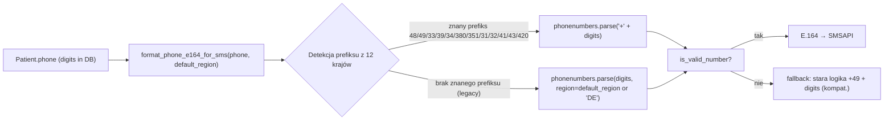

## Cel

Rozszerzyć wysyłkę SMS na 12 krajów: **PL (+48), DE (+49), FR (+33), IT (+39), ES (+34), UA (+380), PT (+351), NL (+31), BE (+32), CH (+41), AT (+43), CZ (+420)**. Kraj rozpoznawany **po prefiksie w numerze**. Treści SMS pozostają w obecnych de/en/pl.

## Stan obecny (krótko)

Cała logika prefiksu siedzi w jednej funkcji:

```25:42:apps/reception/phone_utils.py
def format_phone_e164_for_sms(phone: str) -> str:
    ...
    if digits.startswith("48"):
        return f"+{digits}"
    if digits.startswith("49"):
        return f"+{digits}"
    return f"+49{digits}"
```

Wszystko inne niż `48*`/`49*` dziś dostaje `+49` na siłę. Zmieniamy tylko ten plik + jego konsumentów (delegujący `apps/integrations/sms/client.py` nie wymaga zmian w API).

## Architektura docelowa



## Zmiany w plikach

### 1. Zależności
- [`requirements.txt`](requirements.txt) i [`requirements-prod.txt`](requirements-prod.txt): dodać `phonenumbers` (najnowsza stabilna).

### 2. Rdzeń logiki – [`apps/reception/phone_utils.py`](apps/reception/phone_utils.py)

Refaktor `format_phone_e164_for_sms` z heurystyki na `phonenumbers`:

- Stała `SUPPORTED_SMS_REGIONS` = `("PL", "DE", "FR", "IT", "ES", "UA", "PT", "NL", "BE", "CH", "AT", "CZ")`.
- Mapa `_PREFIX_TO_REGION` budowana raz z `phonenumbers.country_code_for_region(r)` posortowana malejąco po długości prefiksu (żeby `380`/`420`/`351` „wygrywało” przed `38`/`42`/`35`).
- Nowy podpis: `format_phone_e164_for_sms(phone: str, default_region: str = "DE") -> str`.
- Algorytm: rozpoznaj prefiks z mapy → parse jako międzynarodowy; w razie braku → parse z `region=default_region`; waliduj `is_valid_number`; zwróć `PhoneNumberFormat.E164`. Jeśli `phonenumbers` odrzuci → fallback do dotychczasowego `+49` + cyfry (zachowanie kompatybilne).
- `normalize_phone` zostaje, ale zyska opcjonalne `default_region` używane tylko gdy chcemy zachować pełny prefiks E.164 po normalizacji (przy zapisie pacjenta).

### 3. Zapis numerów – [`apps/reception/models.py`](apps/reception/models.py) `Patient.save()`

W miejscu wywołania `normalize_phone(self.phone)` przekazać `default_region=self.country_code or "DE"`, żeby numer wpisany w formacie krajowym (np. `0612345678` przy `country_code='FR'`) został zapisany jako `33612345678` z prefiksem. Constraint `^[0-9]{7,20}$` pozostaje bez zmian (mieści wszystkie 12 krajów łącznie z UA `380XXXXXXXXX`).

### 4. Import XLSX – [`apps/reception/xlsx_import.py`](apps/reception/xlsx_import.py)

**Brak zmian w zakresie tego ticketu.** Plik importu nie przewiduje kolumny z krajem — nie ma skąd wziąć `default_region` dla wiersza. Import nadal wywołuje `normalize_phone(phone_raw)` jak dziś; numery z prefiksem krajowym w komórce (np. `33612345678`, `49176…`) zapiszą się poprawnie i trafią na właściwy kraj przy SMS. Numery bez prefiksu zachowują się jak legacy (interpretacja przez `format_phone_e164_for_sms` z `default_region` z `Patient.country_code` przy zapisie z UI — przy samym imporcie `country_code` może być domyślny DE, więc **w XLSX warto podawać pełny numer z prefiksem** dla krajów innych niż DE).

### 5. Adapter SMS – [`apps/integrations/sms/client.py`](apps/integrations/sms/client.py)

Zero zmian funkcjonalnych: `format_phone_for_smsapi` deleguje do `format_phone_e164_for_sms` i automatycznie skorzysta z nowej logiki.

### 6. Testy

- [`apps/reception/tests/test_phone_utils.py`](apps/reception/tests/test_phone_utils.py): parametryzowany test dla wszystkich 12 krajów (E.164 in → E.164 out), test legacy DE (`176123456` → `+49176123456`), test odrzucenia niepoprawnego numeru, test `normalize_phone(default_region=...)` dla numeru w formacie krajowym.
- [`apps/integrations/sms/tests/test_sms.py`](apps/integrations/sms/tests/test_sms.py): rozszerzyć `test_format_phone_for_smsapi` o reprezentantów: PL, DE, FR, UA (3-cyfrowy prefiks), CZ (`420`), CH (z wiodącym 0).
- Brak zmian w testach outboxa/OTP – używają mocka adaptera, więc samo rozszerzenie prefiksów nie wpływa na ich asercje.

## Kompatybilność wsteczna

- Numery zapisane w DB jako same cyfry bez znanego prefiksu (np. `176123456`) nadal trafią do SMSAPI jako `+49…` (efekt tożsamy z dotychczasowym).
- Fallback w `phone_utils` na starą gałąź `+49 + digits` zostaje, gdyby `phonenumbers` nie sparsował numeru (gwarantuje brak regresji w środowisku produkcyjnym).
- Brak zmian w schemacie DB → brak migracji.
- Treści SMS pozostają w trzech istniejących lokalizacjach (de/en/pl); OTP zostaje hardcoded po niemiecku.

## Nie w zakresie

- Nowe lokalizacje SMS (fr/it/es/uk/pt/nl/cs) – świadoma decyzja, oddzielny ticket.
- Migracja istniejących rekordów (świadoma decyzja: kompatybilność „nieznany prefiks → DE”).
- Zmiany w polu `phone` `StaffUser` (nie używane w SMS do pacjentów).
- Routing/konfiguracja konta SMSAPI dla nowych krajów – założenie: konto już obsługuje wszystkie 12 (do potwierdzenia operacyjnie po stronie SMSAPI, poza kodem).