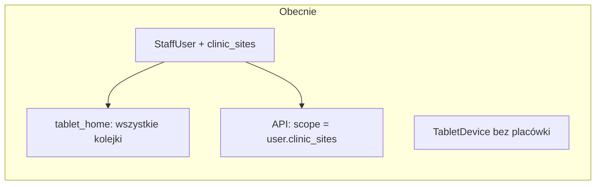
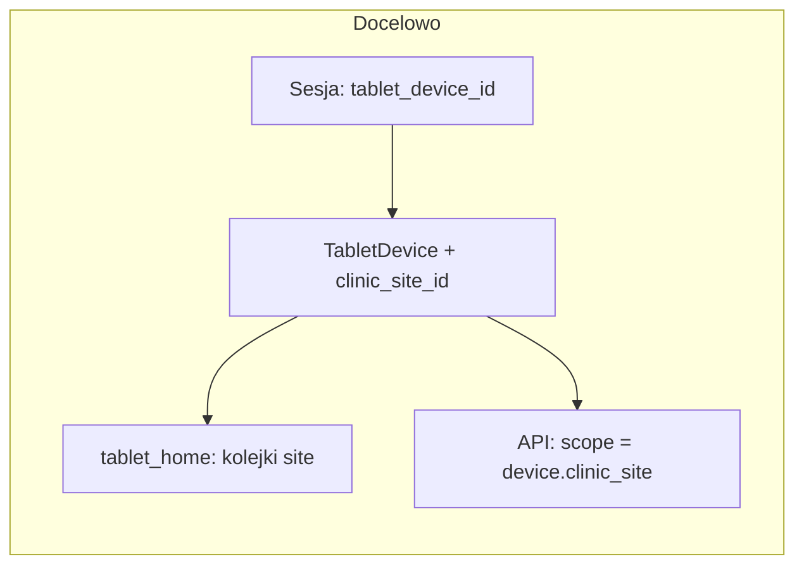

# Plan: Tablet przypisany do placówki (ClinicSite)

## Stan obecny

- **TabletDevice** ([apps/reception/models.py](apps/reception/models.py)): pola `id`, `android_id`, `is_active`, `last_seen_at`, `created_at` – brak powiązania z placówką.
- **Widok HTML tabletu** ([cogitomedica/tablet_views.py](cogitomedica/tablet_views.py)): `tablet_home_view` pobiera **wszystkie** dzisiejsze kolejki (`DailyQueue.objects.filter(queue_date=today)`), bez filtrowania – stąd na ekranie widać zarówno „CogitoMedica Berlin”, jak i „CogitoMedica München”.
- **API** ([apps/reception/api_views_split/queues.py](apps/reception/api_views_split/queues.py)): dla roli TABLET scope pochodzi z **użytkownika** – `get_scoped_clinic_site_ids(request.user)` zwraca `user.clinic_sites` ([apps/core/api_utils.py](apps/core/api_utils.py)).
- **Logowanie tabletu**: przy POST podawany jest `android_id`; wywoływane jest `get_or_create_tablet_device_by_android_id`, ale **identyfikator urządzenia nie jest zapisywany w sesji** – kolejne requesty nie wiedzą, który tablet jest używany.

## Kierunek zmian

Scope kolejek dla tabletu ma zależeć od **urządzenia**: jeśli urządzenie ma przypisaną placówkę, tablet widzi tylko kolejki tej placówki. Wymaga to: (1) pola `clinic_site` w TabletDevice, (2) zapisania urządzenia w sesji przy logowaniu, (3) używania scope z urządzenia w widokach HTML i w API.

---

## 1. Model i migracja

**Plik:** [apps/reception/models.py](apps/reception/models.py)

- W modelu **TabletDevice** dodać pole:
  - `clinic_site = models.ForeignKey(ClinicSite, null=True, blank=True, on_delete=models.SET_NULL, related_name='tablet_devices')`
- **Migracja** (Django `makemigrations`): dodanie kolumny `clinic_site_id` (nullable). Istniejące urządzenia pozostaną bez przypisania; po wdrożeniu admin przypisze placówki.

---

## 2. Sesja tabletu przy logowaniu

**Plik:** [cogitomedica/tablet_views.py](cogitomedica/tablet_views.py)

- W **tablet_login_view** (POST, po udanym `login()`):
  - Jeśli przekazano `android_id`, wywołać `get_or_create_tablet_device_by_android_id(android_id=...)` i zapisać w sesji: `request.session['tablet_device_id'] = str(device.id)`.
  - Jeśli `android_id` nie jest podany (np. logowanie z przeglądarki), opcjonalnie: `request.session.pop('tablet_device_id', None)`, żeby nie używać starego device.
- Przy **tablet_logout_view**: usuwać `request.session.pop('tablet_device_id', None)`.

Dzięki temu kolejne requesty (HTML i API) mają w sesji `tablet_device_id` i mogą ładować urządzenie oraz jego `clinic_site_id`.

---

## 3. Widok HTML: lista kolejek

**Plik:** [cogitomedica/tablet_views.py](cogitomedica/tablet_views.py)

- **tablet_home_view**:
  - Pobrać `tablet_device_id` z sesji; jeśli brak – nie traktować requestu jako „tablet z urządzenia” (np. pokazać wszystkie dzisiejsze kolejki jak dziś, albo pustą listę – do ustalenia w implementacji).
  - Jeśli jest `tablet_device_id`: wczytać `TabletDevice` z `clinic_site_id` (select_related).
    - Gdy `device.clinic_site_id` jest ustawiony: filtrować `DailyQueue` po `queue_date=today` **oraz** `clinic_site_id=device.clinic_site_id`.
    - Gdy urządzenie nie ma przypisanej placówki: zwracać pustą listę kolejek (lub jedną wiadomość w szablonie: „Tablet nie jest przypisany do placówki. Skontaktuj się z administratorem.”).
  - Przekazać do szablonu np. `queue_list` i ewentualnie `tablet_unassigned: bool`.

---

## 4. Widok HTML: wejście do kolejki i formularz

**Pliki:** [cogitomedica/tablet_views.py](cogitomedica/tablet_views.py)

- **tablet_queue_entries_view** (lista pacjentów w kolejce): po pobraniu `DailyQueue` po `daily_queue_id` sprawdzić, czy dla requestu z sesji `tablet_device_id` i device z `clinic_site_id` zachodzi `queue.clinic_site_id == device.clinic_site_id`. Jeśli nie – 403 lub przekierowanie + komunikat („Brak dostępu do tej kolejki”).
- **tablet_entry_start_view** (start sesji formularza): analogicznie – jeśli znane urządzenie z sesji ma `clinic_site_id`, sprawdzić, czy `entry.daily_queue.clinic_site_id == device.clinic_site_id`; w przeciwnym razie 403.

Zapobiega to wejściu w URL innej placówki przy zalogowanym tablecie przypisanym do jednej.

---

## 5. API: scope dla tabletu z urządzenia

**Potrzeba:** dla requestów z rolą TABLET (i ewentualnie RECEPTION/ADMIN używających tabletu) scope ma brać się z urządzenia zapisanego w sesji, gdy jest dostępne i ma `clinic_site_id`.

**Opcja A (zalecana):** W miejscach, gdzie używany jest `get_scoped_clinic_site_ids(request.user)`, dla użytkownika z rolą TABLET najpierw sprawdzać sesję:

- `tablet_device_id = request.session.get('tablet_device_id')`
- Jeśli jest: załadować `TabletDevice` (z `clinic_site_id`). Gdy `device.clinic_site_id` nie jest None: **zwrócić scope = [device.clinic_site_id]** (jako listę UUID).
- W przeciwnym razie (brak device w sesji lub device bez placówki): dla TABLET zwracać `[]` (tablet bez przypisania nie widzi kolejek); dla RECEPTION/ADMIN zostawić `get_scoped_clinic_site_ids(request.user)`.

Wymaga to przekazywania **request** (a nie tylko user) do helpera scope albo wyciągnięcia logiki „tablet scope z device” do osobnej funkcji używanej w API.

**Pliki do zmiany:**

- [apps/reception/api_views_split/queues.py](apps/reception/api_views_split/queues.py):  
  - **daily_queues_view** (GET): zamiast wyłącznie `get_scoped_clinic_site_ids(request.user)` dla TABLET użyć scope z `request.session` + TabletDevice (jak wyżej); stosować ten scope do `qs.filter(clinic_site_id__in=scope_ids)`.
  - **daily_queue_entries_view**: sprawdzanie dostępu do kolejki – scope z requestu (user lub device z sesji); odrzucać 403, gdy queue nie należy do scope.
  - **queue_entry_sessions_view** (POST): to samo – scope z device z sesji (jeśli TABLET + device), inaczej z user; sprawdzić, że `entry.daily_queue.clinic_site_id` jest w scope.

**Helper:** Dodać w [apps/core/api_utils.py](apps/core/api_utils.py) (lub w reception) funkcję np. `get_tablet_scope_clinic_site_ids(request) -> list[UUID] | None`, która:

- jeśli w sesji jest `tablet_device_id` i device ma `clinic_site_id`: zwraca `[device.clinic_site_id]`;
- w przeciwnym razie zwraca `None` (caller użyje wtedy `get_scoped_clinic_site_ids(request.user)`).

Następnie w API: dla roli TABLET najpierw `scope = get_tablet_scope_clinic_site_ids(request)`; jeśli `scope is not None`, użyć tego; jeśli `scope == []` (tablet bez placówki), zwrócić pustą listę kolejek / 403 przy wejściu do konkretnej kolejki.

---

## 6. Serwisy i API urządzeń

**Plik:** [apps/reception/services.py](apps/reception/services.py)

- **create_tablet_device**: dodać opcjonalny argument `clinic_site_id: UUID | None = None`; przy tworzeniu ustawiać `device.clinic_site_id`.
- **update_tablet_device**: dodać argument `clinic_site_id: UUID | None = NOT_PROVIDED` (lub osobna flaga); aktualizować `device.clinic_site_id` i zapisać.

**Plik:** [apps/reception/api_schemas.py](apps/reception/api_schemas.py)

- **CreateTabletDeviceRequest**: pole opcjonalne `clinic_site_id: UUID | None = None`.
- **UpdateTabletDeviceRequest**: pole opcjonalne `clinic_site_id: UUID | None = None` (np. `None` = odpinanie od placówki).

**Plik:** [apps/reception/api_views_split/devices.py](apps/reception/api_views_split/devices.py)

- **_serialize_tablet_device**: dodać `"clinic_site_id": str(device.clinic_site_id) if device.clinic_site_id else None`.
- **tablet_devices_view** (POST): przekazać `body.clinic_site_id` do `create_tablet_device`.
- **tablet_device_detail_view** (PATCH): przekazać `body.clinic_site_id` do `update_tablet_device` (obsłużyć w serwisie „clear” przez `None`).

---

## 7. Admin

**Plik:** [apps/reception/admin.py](apps/reception/admin.py)

- **TabletDeviceAdmin**: dodać `clinic_site` do `list_display`, `list_filter` i do formularza (np. `raw_id_fields` lub autocomplete dla ClinicSite), żeby można było przypisać/zmienić placówkę z panelu admina.

---

## 8. Testy

- **apps/reception/api_tests.py**:  
  - Rozszerzyć testy TABLET o scenariusze z urządzeniem w sesji i `device.clinic_site_id`: tablet widzi tylko kolejki tej placówki; tablet bez placówki dostaje pustą listę; tablet nie może wejść do kolejki innej placówki (403).  
  - **TabletDevicesApiTests**: testy tworzenia/aktualizacji urządzenia z `clinic_site_id` oraz serializacji (pole `clinic_site_id` w odpowiedzi).
- **cogitomedica/tablet_views** (jeśli są testy HTML tabletu): test, że po zalogowaniu z `android_id` w sesji jest `tablet_device_id`; oraz że home zwraca tylko kolejki przypisanej placówki (mock device z clinic_site).

---

## 9. Dokumentacja do aktualizacji

| Dokument                                                                                         | Zmiany                                                                                                                                                                                                                                                                                                                                     |
| ------------------------------------------------------------------------------------------------ | ------------------------------------------------------------------------------------------------------------------------------------------------------------------------------------------------------------------------------------------------------------------------------------------------------------------------------------------ |
| **[.cursor/plans/plan_proces-poczekalni.plan.md](.cursor/plans/plan_proces-poczekalni.plan.md)** | Zaktualizować założenie „Recepcja na tablecie ma możliwość **wyboru kolejki**” oraz „nie ma twardego przypisania tabletu do kolejki”: tablet jest **przypisany do jednej placówki** (ClinicSite); widzi wyłącznie kolejki tej placówki. Opisać, że TabletDevice ma pole `clinic_site` i że przypisania dokonuje się w adminie / przez API. |
| **[docs/SECURITY_AUDIT.md](docs/SECURITY_AUDIT.md)**                                             | W sekcji o tabletach dopisać, że scope kolejek dla tabletu wynika z przypisania urządzenia do placówki (TabletDevice.clinic_site_id); bez przypisania tablet nie widzi kolejek.                                                                                                                                                            |
| **OpenAPI / drf-spectacular**                                                                    | W schemacie API dla `tablet-devices` (GET/POST/PATCH) oraz w opisach: dodać pole `clinic_site_id` (UUID, nullable) w request/response; krótki opis: „Przypisana placówka; tablet widzi tylko kolejki tej placówki.”                                                                                                                        |
| **README.md** (jeśli jest opis konfiguracji tabletu)                                             | Dodać krok: w panelu admin (lub przez API) przypisać TabletDevice do ClinicSite; bez tego tablet nie wyświetli kolejek.                                                                                                                                                                                                                    |
| **.ai/staff-api-contract.md** lub *.ai/api-plan.md** (jeśli opisują API tabletu)                 | Uwzględnić `clinic_site_id` w TabletDevice oraz zachowanie GET daily-queues / queue-entries przy roli TABLET (scope z urządzenia).                                                                                                                                                                                                         |

---

## 10. Kolejność wdrożenia (proponowana)

1. Migracja: dodanie `TabletDevice.clinic_site_id`.
2. Model, admin, serwisy (create/update), API schemas i widoki devices (serializacja, POST/PATCH).
3. Zapis/odczyt `tablet_device_id` w sesji przy logowaniu/wylogowaniu tabletu.
4. Helper scope (np. `get_tablet_scope_clinic_site_ids(request)`) i użycie w API queues (daily_queues, daily_queue_entries, queue_entry_sessions).
5. Widoki HTML tabletu: home (filtr po device.clinic_site_id), queue_entries i entry_start (sprawdzenie scope).
6. Testy (API + ewentualne testy widoków).
7. Aktualizacja dokumentacji (plan poczekalni, SECURITY_AUDIT, OpenAPI, README, .ai).

---

## Uwagi

- **Backward compatibility:** Istniejące TabletDevice z `clinic_site_id=None` po wdrożeniu nie będą pokazywać kolejek (pusta lista / komunikat), dopóki admin nie przypisze placówki.  
- **RECEPTION/ADMIN:** Logowanie z przeglądarki bez `android_id` – brak `tablet_device_id` w sesji; wtedy API może nadal używać `get_scoped_clinic_site_ids(request.user)`, żeby nie blokować dostępu z panelu staff.  
- **Wieloplacówkowość:** Jeden tablet = jedna placówka (FK). Przypisanie wielu placówek do tabletu wymagałoby M2M i zmiany logiki scope (poza zakresem tego planu).

