## Tryb wgrywania zewnętrznego badania (External upload)

### Decyzje (potwierdzone z użytkownikiem)

- Źródło PDF: **plik trafia najpierw do HiDrive `/incoming` przez API HiDrive**, a aplikacja medyczna potem tylko listuje/wybiera/promuje gotowy plik do wersji roboczej. Nie robimy ciężkiego uploadu 250 MB przez synchroniczny endpoint `multipart/form-data` głównego API Django, bo taki request blokowałby workery WSGI/Gunicorn/Nginx i mógłby zatrzymać całe API.
- Transfer pliku do `/incoming` jest osobnym torem uploadowym opartym o API HiDrive: krótki endpoint aplikacji może utworzyć sesję/metadane uploadu, ale same bajty PDF nie mogą przechodzić przez worker obsługujący normalne API medyczne. Implementacyjnie dopuszczalne są tylko warianty nieblokujące dla głównej aplikacji: dedykowany upload gateway/ASGI worker streamujący do HiDrive API, zadanie tła poza pulą request workerów albo natywny klient HiDrive API po stronie zaufanego komponentu. **Nie wolno wystawiać stałych credentiali HiDrive do przeglądarki recepcji** i nie wolno podnosić limitów `client_max_body_size` głównego API pod 250 MB.
- Powiązanie: **wymaga `QueueEntry`** (recepcja najpierw dodaje pacjenta do `DailyQueue`).
- Role: **RECEPTION + MANAGER + ADMIN** (bez DOCTOR — to nie jest Befund).
- Model: **nowy `MedicalDocumentSourceType.EXTERNAL_UPLOAD`**, **bez generowania Befundu** — plik przyjęty z `/incoming` najpierw trafia do wersji roboczej (`DRAFT + pdf_generation_status=COMPLETED`), a dopiero po ponownej weryfikacji pacjenta i podglądzie PDF staje się `PUBLISHED`.
  - `intake_form` jest **wymagane** (`NOT NULL`) i zawsze wskazuje na `PatientIntakeForm` dla danego `QueueEntry` (w praktyce rekord ankiety powstaje już przy wydaniu sesji tabletu — patrz `issue_tablet_session_latest_wins` w [`apps/reception/services.py`](apps/reception/services.py:569-592)).
  - Operacyjnie external upload jest sensowny dopiero po **wysłaniu ankiety** (`IntakeStatus.SUBMITTED`) albo w ścieżce **reopen** (`IntakeStatus.REOPENED`) — bo dopiero wtedy mamy „zamknięty” kontekst identyfikacji pacjenta po stronie intake (a `QueueEntry` przechodzi m.in. w `PATIENT_COMPLETED` po submit — patrz [`apps/intake/services.py`](apps/intake/services.py:1070-1224)).

### Flow docelowy

```mermaid
flowchart LR
    Hub["Hub: wybór QueueEntry z listy"] --> Identity["Ekran pacjenta: imię, nazwisko, DOB, telefon, data kolejki"]
    Identity --> Upload["Upload PDF do HiDrive /incoming przez API HiDrive<br/>poza workerem głównego API Django"]
    Upload --> Incoming["Plik widoczny w HiDrive /incoming"]
    Incoming --> Select["Odśwież/listuj /incoming i wybierz plik dopasowany do pacjenta"]
    Select --> Stage["Stage from /incoming: lokalna kopia robocza + checksum"]
    Stage --> Preview["Podgląd staged PDF + metadane pliku"]
    Preview --> Confirm["Osobne potwierdzenie: pacjent i plik zweryfikowane"]
    Confirm --> Publish[publish_staged_external_upload_version]
    Publish --> DB["MedicalDocument source_type=EXTERNAL_UPLOAD<br/>Version: PUBLISHED + COMPLETED"]
    Publish --> Outbox["OutboxEvent HIDRIVE_UPLOAD (pomija GENERATE_PDF)"]
    Outbox --> Hidrive[Upload na HiDrive /patients/... + move /incoming -> /processed]
    Hidrive --> SMS[SMS do pacjenta]
    SMS --> Patient["Portal pacjenta (OTP) -> pobranie wgranego PDF"]
```



### Zakres zmian (konkretne pliki)

#### 1. Model + migracja

[`apps/medical/models.py`](apps/medical/models.py:47-55) — dodać wartość:

```python
class MedicalDocumentSourceType(models.TextChoices):
    DIGITAL_INTAKE = "DIGITAL_INTAKE", db_gettext_lazy(...)
    PAPER_INTAKE = "PAPER_INTAKE", db_gettext_lazy(...)
    EXTERNAL_UPLOAD = "EXTERNAL_UPLOAD", db_gettext_lazy(
        "administration.choice_medical_document_source_type_external_upload",
        "External upload",
    )
```

[`apps/medical/models.py`](apps/medical/models.py:173-183) — zastąpić constraint `medical_document_source_type_intake_consistency` wersją 3‑stanową:
- `DIGITAL_INTAKE` ⇒ `intake_form` **NOT NULL** (bez zmian semantycznej),
- `PAPER_INTAKE` ⇒ `intake_form` **NULL** (bez zmian),
- `EXTERNAL_UPLOAD` ⇒ `intake_form` **NOT NULL** (jak cyfrowa ścieżka: wynik zewnętrzny jest powiązany z tą samą wizytą i jej `PatientIntakeForm`).

[`apps/medical/models.py`](apps/medical/models.py:255-510) — w `MedicalDocumentVersion` dodać opcjonalne pola audytowe dla uploadu:
- `external_original_filename = models.CharField(max_length=255, blank=True, null=True)`,
- `external_uploaded_by_user = models.ForeignKey(..., null=True, blank=True, related_name="uploaded_external_medical_documents")`,
- `external_uploaded_at = models.DateTimeField(null=True, blank=True)`,
- `external_verified_by_user = models.ForeignKey(..., null=True, blank=True, related_name="verified_external_medical_documents")`,
- `external_verified_at = models.DateTimeField(null=True, blank=True)`.

Uzasadnienie: przy tym trybie nie ma naturalnej kontroli treści w formularzu Befundu. Trzeba mieć audyt, kto wgrał plik i kto świadomie potwierdził zgodność pacjent + plik przed SMS-em.

Migracja `apps/medical/migrations/0020_medicaldocument_external_upload.py`:
- `AlterField` na `source_type` (nowe choice),
- `RemoveConstraint` + `AddConstraint` na `medical_document_source_type_intake_consistency`,
- `AddField` pól `external_*`.
- Seed tłumaczeń DB (`db_gettext_lazy`) — analogicznie do migracji typu `0036_seed_administration_templates.py`: nowe klucze dla DE/EN/PL: choice, label przycisku, błędy walidacji uploadu (zgodnie z regułą "Tłumaczenia: tylko w DB" z [`.ai/min-prd.md`](.ai/min-prd.md:31)).

Standard projektowy tłumaczeń (obowiązkowy dla nowych kluczy):

- Źródło prawdy to DB (`TranslationKey`/`TranslationValue`), a nie hardcoded stringi w kodzie; używać `db_gettext_lazy` / `resolve_other_message` / tagów i18n projektu.
- Każdy nowy klucz musi mieć komplet języków `de`, `en`, `pl` (loader wymaga pełnego zestawu; brak języka kończy się błędem seedowania).
- Klucze dodajemy przez standardowy seed JSON w `apps/core/translation_data/*.json` + migracja seedująca (jak istniejące `seed_*_i18n.py`), tak aby środowiska były deterministyczne po migracjach.
- Kategoria klucza musi odpowiadać prefiksowi (`administration.*`, `doctor.*`, `waiting_room.*`, `other.*`) zgodnie z `category_for_key` w [`apps/core/translation_loader.py`](apps/core/translation_loader.py).
- Jeśli komunikat używa placeholderów (`{hours}`, `{max_bytes}`, itp.), trzeba dodać/utrzymać `allowed_placeholders` zgodnie ze standardem loadera i używać formatowania przez `resolve_other_message(..., **params)`.
- Dla nowego flow EXTERNAL_UPLOAD nie dodajemy fallbacków tekstowych w kodzie „na stałe” poza technicznym defaultem pomocniczym; docelowe copy ma pochodzić z DB i być pokryte seedem.

#### 2. Serwisy

[`apps/medical/services.py`](apps/medical/services.py) — nowe funkcje obok istniejących (reuse istniejącej semantyki wersji/republish/revoke):

- `create_external_upload_medical_document(*, queue_entry_id, created_by_user_id) -> MedicalDocument`
  - reuse części walidacji „tworzenia dokumentu bez Befundu”, ale **nie** kopiujemy semantyki `intake_form=NULL` z papierowej ścieżki — external upload jest powiązany z `PatientIntakeForm`,
  - ustawia `source_type=EXTERNAL_UPLOAD`,
  - **wymaga** istniejącego `PatientIntakeForm` dla `queue_entry` i ustawia `intake_form_id` (relacja 1:1 przez `PatientIntakeForm.queue_entry`),
  - dodatkowo waliduje `form_status ∈ {SUBMITTED, REOPENED}` (dokładna semantyka reopen: pozwala na korekty przed ponownym submit),
  - idempotentne `get_or_create` po `queue_entry_id`,
  - jeżeli istnieje już dokument o innym `source_type` → `DomainError`.

- `refresh_external_upload_incoming_matches(*, medical_document_id) -> list[ExternalPdfAttachment]`
  - używa istniejącego `check_external_pdf_gate` / `create_attachment_records` z [`apps/medical/external_pdf_service.py`](apps/medical/external_pdf_service.py), żeby nie dublować logiki listowania i dopasowania plików z HiDrive `/incoming`,
  - listuje wyłącznie pliki PDF z `/incoming`, pomija `rejected_*`, stosuje istniejące reguły dopasowania nazwy do pacjenta i zapisuje/odświeża rekordy `ExternalPdfAttachment` w statusie `MATCHED`,
  - nie pobiera pliku i nie dotyka `MedicalDocumentVersion`; to szybki krok UI do pokazania operatorowi kandydatów z `/incoming`,
  - jeśli HiDrive jest niedostępny, zwraca kontrolowany błąd/warning zgodny z istniejącą semantyką gate; nie czyści stale widocznych rekordów, gdy listing cloud storage nie działa.

- `stage_external_upload_version_from_incoming(*, medical_document_id, attachment_id, uploaded_by_user_id) -> MedicalDocumentVersion`
  - `select_for_update` na dokumencie + walidacja `source_type=EXTERNAL_UPLOAD`,
  - wymaga `ExternalPdfAttachment` należącego do tego dokumentu, statusu `MATCHED` albo `ACCEPTED`, oraz `hidrive_remote_path` pod `HIDRIVE_INCOMING_PATH` (`/incoming/...`),
  - pobiera wskazany plik z HiDrive `/incoming` do lokalnego stagingu przez adapter (`download_external_pdf` lub streamingowy odpowiednik); **nie przyjmuje `pdf_bytes` z requestu HTTP**,
  - walidacja PDF/magic/limit dzieje się po stronie worker/task wykonującego staging, na danych pobranych z `/incoming`; jeśli plik jest za duży/uszkodzony, attachment dostaje kontrolowany status błędu albo pozostaje `MATCHED` z czytelnym komunikatem,
  - **pierwsza publikacja (jeszcze bez opublikowanej wersji medycznej)**: jeśli istnieje już `DRAFT`, nadpisuje go w miejscu (jak `save_draft_document_version` dla samego DRAFT); jeśli nie ma `DRAFT`, tworzy `version_no=1`.
  - **korekta po publikacji (dokument w `PUBLISHED`)**: wymaga `has_pending_revision=True` i istniejącego `DRAFT` utworzonego przez `start_external_upload_revision` (poniżej); wtedy staging nadpisuje **wyłącznie** ten `DRAFT` (nigdy nie zapisuje PDF „na” opublikowanej wersji).
  - ustawia `pdf_generation_status=COMPLETED`, `pdf_local_path`, `pdf_checksum_sha256`, `external_original_filename=attachment.original_filename`, `external_uploaded_by_user`, `external_uploaded_at`,
  - oznacza wybrany `ExternalPdfAttachment` jako `ACCEPTED` dopiero po poprawnym staged copy + checksum (bez przenoszenia z `/incoming` w tym kroku),
  - **nie ustawia** `published_at`, `published_by_user`, `publish_request_id`, `publish_locale`,
  - **nie tworzy outboxu** i nie wysyła SMS — plik jest tylko stagingiem do podglądu.
  - ciężkie I/O nie może wisieć w request/response; endpoint zleca staging do Django 6 Tasks/outbox-like job i zwraca status do pollingu. Decyzja architektoniczna: **zadanie tła + polling**, żeby nie blokować workerów aplikacyjnych.

- `start_external_upload_revision(*, medical_document_id, actor_user_id) -> MedicalDocumentVersion`
  - analog semantyczny do `save_draft_document_version(..., intent="amend")` dla Befundu ([`apps/medical/services.py`](apps/medical/services.py:909-1073)): na `PUBLISHED` tworzy nowy `DRAFT` z `version_no = max_published_version_no + 1`, ustawia `has_pending_revision=True`, **nie** podbija `current_version_no` (pacjent nadal widzi starą wersję w portalu dopóki nie opublikujemy nowej).
  - jeśli `has_pending_revision` już jest `True` i istnieje pending `DRAFT`, zwraca go (idempotentnie).

- `publish_staged_external_upload_version(*, medical_document_id, publish_request_id, published_by_user_id, publish_locale, verification_ack, resend_sms: bool) -> MedicalDocumentVersion`
  - `select_for_update` na dokumencie + walidacja `source_type=EXTERNAL_UPLOAD`,
  - wymaga istniejącej najnowszej wersji `DRAFT` z `pdf_generation_status=COMPLETED` i `pdf_local_path`,
  - wymaga jawnego `verification_ack=True` z UI po obejrzeniu danych pacjenta i podglądu pliku,
  - **pomija** `validate_medical_payload_complete_for_publish` (payload pozostaje pustym `{}`),
  - zmienia wersję roboczą na `version_status=PUBLISHED`, ustawia `published_at=now`, `publish_request_id`, `publish_locale`, `published_by_user`, `external_verified_by_user`, `external_verified_at`,
  - aktualizuje `MedicalDocument`: `status=PUBLISHED`, `current_version_no`, `published_version_no`, `last_published_at`, `has_pending_revision=False`,
  - **wstawia outbox `HIDRIVE_UPLOAD` od razu** (pomija `GENERATE_PDF`) — idempotentnie po `(version, event_type)`,
  - payload outboxu musi przenosić `resend_sms` (bool) tak jak w `publish_document_version` → `GENERATE_PDF` ([`apps/medical/services.py`](apps/medical/services.py:1298-1313)), bo `SMS_SEND` w outboxie **nie wyśle** drugiego SMS, jeśli inna wersja tego dokumentu ma już `sms_sent=True`, chyba że `resend_sms` jest `True` ([`apps/outbox/services.py`](apps/outbox/services.py:184-198)).
  - kontrakt idempotencji `publish_request_id` (jawnie, bez domysłów):
    - ten sam `publish_request_id` + ten sam `medical_document_id` + ta sama wersja `DRAFT` => zwracamy już opublikowaną wersję (idempotent success),
    - ten sam `publish_request_id`, ale inny `publish_locale` => `IdempotencyConflictError` (jak istniejący flow publikacji Befundu),
    - ten sam `publish_request_id`, ale **inny staged plik** (inny checksum/`version_id`) => `IdempotencyConflictError` z dedykowanym kluczem API (np. `other.api.publish_request_id_payload_conflict`) — request jest odrzucony, nie ignorowany po cichu.
  - technicznie: utrwalamy fingerprint publikacji (`staged_version_id`, `pdf_checksum_sha256`) w payloadzie/polach wersji i porównujemy przy retry, żeby uniknąć utraty aktualizacji oraz rozjazdu DB vs plik na dysku.
  - UX: dla **pierwszej publikacji** domyślnie `resend_sms=false`; dla **korekty/republikacji** UI powinno domyślnie proponować `resend_sms=true` (pacjent musi dostać logistyczny SMS ponownie).
  - cała operacja w `transaction.atomic` zgodnie z regułą "outbox + zmiana stanu atomowo" z [`.cursor/rules/backend-django-cogitomedica.mdc`](.cursor/rules/backend-django-cogitomedica.mdc).
  - zapis pliku i update DB muszą być „cleanup-safe”: przy błędzie po zapisie lokalnej kopii staged (np. konflikt idempotencji/outbox) usuwamy świeżo zapisany plik tymczasowy albo używamy atomowego rename z katalogu stagingowego w tym samym filesystemie, żeby nie zostawić osieroconych PDF.
  - publikacja pozostawia finalne sprzątanie `/incoming` istniejącemu handlerowi `HIDRIVE_UPLOAD`: po wysłaniu pliku do docelowej ścieżki pacjenta pętla po `ExternalPdfAttachment` przenosi zaakceptowany plik z `/incoming` do `/processed`. Dzięki temu nie powstaje druga, równoległa implementacja "incoming -> processed".

#### 2a. Rewokacja i „zastąpienie pliku” (wersjonowanie)

Istniejący mechanizm rewokacji publikacji:

- `revoke_document_version` ustawia `revoked_at`, usuwa lokalny plik i ustawia `local_pdf_deleted_at` ([`apps/medical/services.py`](apps/medical/services.py:1349-1408)).
- Portal pacjenta filtruje `revoked_at__isnull=True` ([`apps/patient_results/document_services.py`](apps/patient_results/document_services.py:21-29)).

Proponowany proces operacyjny dla EXTERNAL_UPLOAD (twardy „circuit breaker” + wersjonowanie):

1. **Opcjonalnie** wywołać `revoke_document_version` na aktualnej opublikowanej wersji (np. gdy wynik został błędnie opublikowany pacjentowi). To natychmiast odcina dostęp w portalu.
2. `start_external_upload_revision` → powstaje nowy `DRAFT` z wyższym `version_no`, `has_pending_revision=True`.
3. `refresh_external_upload_incoming_matches` + `stage_external_upload_version_from_incoming` → wybór pliku z `/incoming`, lokalna kopia w `DRAFT` + preview (jak pierwsza publikacja).
4. `publish_staged_external_upload_version` z `resend_sms=true` → podbicie `current_version_no`/`published_version_no` do nowego `version_no`, upload na HiDrive pod nową nazwę pliku zawierającą `version_no` (`build_befund_hidrive_path`), SMS.

Uwaga do produktu: rewokacja wymaga pełnej dostawy (`hidrive_sent && sms_sent`) ([`apps/medical/services.py`](apps/medical/services.py:1390-1394)) — jeśli chcemy umożliwić cofnięcie „w locie” przed SMS, to osobny wątek (poza zakresem tego planu).

Założenie kompatybilności: outbox handler `HIDRIVE_UPLOAD` w [`apps/outbox/services.py`](apps/outbox/services.py:107-221) i ścieżka `build_befund_hidrive_path` z [`apps/outbox/hidrive_paths.py`](apps/outbox/hidrive_paths.py:22-26) działają na `pdf_local_path` + `version_no` — bez zmian. Dla EXTERNAL_UPLOAD świadomie wykorzystujemy istniejącą pętlę `ExternalPdfAttachment` (incoming/processed move): zaakceptowany attachment z `/incoming` ma zostać przeniesiony do `/processed` dopiero po skutecznym uploadzie finalnego PDF do docelowej ścieżki pacjenta.

#### 2b. Upload do HiDrive `/incoming` przez API HiDrive (bez blokowania Gunicorna)

Cel tej części: recepcja może wskazać lokalny PDF, ale transfer 250 MB nie może blokować workerów obsługujących normalne API Django. `/incoming` staje się technicznym buforem wejściowym, a dalsze etapy używają istniejącego `ExternalPdfAttachment` i istniejącego move `/incoming -> /processed`.

Wymagania architektoniczne:

- **Zakaz** endpointu typu `POST /external-upload/stage` z `multipart/form-data` zawierającym PDF do głównej aplikacji WSGI. Taki endpoint nie przejdzie review.
- Upload do `/incoming` musi iść przez API HiDrive z komponentu, który nie używa puli workerów normalnego API medycznego. Preferowany wariant: dedykowany upload gateway/ASGI endpoint streamujący request do HiDrive API z backpressure i limitami równoległości.
- Backend nie ujawnia credentiali HiDrive w przeglądarce. Przeglądarka recepcji dostaje wyłącznie identyfikator sesji uploadu/statusu w aplikacji, a zaufany komponent wykonuje autoryzowane żądania do HiDrive API.
- Nazwa pliku wysyłanego do `/incoming` musi być deterministycznie sanitizowana i zawierać korelację techniczną, np. `external-upload/{queue_entry_id}/{upload_session_id}/{safe_original_filename}` albo równoważny prefiks pod `/incoming`. Nie polegamy wyłącznie na nazwie nadanej przez użytkownika.
- Upload musi mieć statusy domenowe co najmniej: `PENDING`, `UPLOADING`, `AVAILABLE_IN_INCOMING`, `FAILED`, `CANCELLED`. Dopiero `AVAILABLE_IN_INCOMING` pozwala przejść do `refresh-incoming` / `stage-from-incoming`.
- Limit równoległych uploadów i retry do HiDrive API musi być kontrolowany oddzielnie od outboxu publikacji, żeby duże transfery wejściowe nie zagłodziły `HIDRIVE_UPLOAD` i `SMS_SEND`.
- Przy przerwanym uploadzie komponent uploadowy usuwa częściowy plik z `/incoming` albo oznacza go prefiksem `failed_`/metadanymi ignorowanymi przez listing, żeby `ExternalPdfAttachment` nie złapał połowicznego PDF.
- Jeśli API HiDrive nie daje wystarczająco bezpiecznej semantyki streamowania, wznawiania albo kasowania częściowych plików, MVP musi obniżyć limit rozmiaru albo wymagać dedykowanego klienta/upload gateway; nie wolno wracać do dużego multipart przez główne Django.

#### 2c. Macierz decyzji korekty (finalna) + drzewko operacyjne

Założenie polityki produktu:
- Na HiDrive przechowujemy historyczne pliki (wersje).
- W portalu pacjenta pokazujemy zawsze tylko najnowszą wersję (`current_version`).
- W standardowej korekcie po publikacji domyślna ścieżka to `revision + republish + resend_sms`; `revoke` jest trybem incydentowym.

| Sytuacja operacyjna | Cel biznesowy | Revoke starej wersji | Nowa wersja (revision + republish) | `resend_sms` | Kto może wykonać | Ryzyko jeśli zrobisz źle |
|---|---|---|---|---|---|---|
| Literówka/techniczna korekta, stary plik merytorycznie błędny | Pacjent ma widzieć poprawny dokument | **Nie (domyślnie)**, chyba że incydent | **Tak** | **Tak** | RECEPTION/MANAGER/ADMIN (wg uprawnień) | Pacjent nie dostanie info o korekcie lub długo widzi błędny plik |
| Doszła nowsza wersja z labu (update) | Pacjent ma zawsze najnowszy wynik | **Nie** | **Tak** | **Tak** | RECEPTION/MANAGER/ADMIN | Brak powiadomienia o nowej wersji |
| Zły plik przypisany do złego pacjenta (incydent prywatności) | Natychmiast odciąć błędny dostęp | **Tak (obowiązkowo)** | **Tak** po weryfikacji | **Tak** po poprawnej publikacji | MANAGER/ADMIN + procedura incydentowa | Naruszenie RODO i eskalacja prawna |
| Plik uszkodzony/nieczytelny po publikacji | Przywrócić prawidłowy dostęp | **Nie (zwykle)** | **Tak** | **Tak** | RECEPTION/MANAGER/ADMIN | Pacjent bez działającego wyniku |

Drzewko decyzyjne (operacyjne, do UI i instrukcji recepcji):

1. Czy to incydent prywatności (zły pacjent / błędna publikacja do niewłaściwej osoby)?
   - Tak: natychmiast `revoke` (rola nadzorcza), potem `start revision -> stage-from-incoming -> publish(resend_sms=true)` po poprawnej weryfikacji.
   - Nie: przejdź do pkt 2.
2. Czy treść opublikowanego pliku jest błędna albo pojawiła się nowsza wersja?
   - Tak: `start revision -> stage-from-incoming -> publish(resend_sms=true)` (bez `revoke` jako domyślny tor).
   - Nie: brak działań w tym flow.
3. Przy `publish` nowej wersji zawsze wymuś świadomy wybór `resend_sms` (dla korekty domyślnie `true`).

#### 3. API

[`apps/medical/api_views.py`](apps/medical/api_views.py) — nowe widoki:
- `POST /api/v1/medical/documents/external-upload/incoming-upload-session`
  - role `ADMIN/MANAGER/RECEPTION`,
  - JSON: `queue_entry_id`, `original_filename`, `size_bytes`, opcjonalnie `content_type`,
  - tworzy `MedicalDocument` przez `create_external_upload_medical_document`, waliduje rozmiar/rozszerzenie i tworzy sesję uploadu do `/incoming` z docelową, sanitizowaną ścieżką HiDrive,
  - odpowiedź zwraca `document_id`, `upload_session_id`, status URL i dane pacjenta do ponownego wyświetlenia; nie zwraca stałych credentiali HiDrive,
  - nie przyjmuje PDF i musi kończyć się szybko.

- `POST /api/v1/medical/documents/external-upload/incoming-upload-session/{upload_session_id}/upload`
  - **nie może być obsłużony przez główny WSGI/Gunicorn pool**. Jeśli zostaje w tym samym repo, ma być wystawiony jako dedykowany upload gateway/ASGI route albo delegowany do osobnego komponentu,
  - streamuje plik do HiDrive API pod ścieżkę `/incoming/...`, bez trzymania całego PDF w RAM,
  - kontroluje limit 250 MB, timeouty, backpressure, liczbę równoległych uploadów i cleanup częściowego pliku w HiDrive,
  - po sukcesie ustawia sesję na `AVAILABLE_IN_INCOMING`; po błędzie na `FAILED` z kodem błędu do UI.

- `GET /api/v1/medical/documents/external-upload/incoming-upload-session/{upload_session_id}`
  - role `ADMIN/MANAGER/RECEPTION`,
  - zwraca status uploadu, docelową ścieżkę `/incoming`, rozmiar, oryginalną nazwę i błąd techniczny/domenowy, jeśli wystąpił.

- `POST /api/v1/medical/documents/external-upload/refresh-incoming`,
- `require_user_role(request, allowed_roles={"ADMIN", "MANAGER", "RECEPTION"})`,
- JSON: `queue_entry_id` (UUID),
- najpierw `create_external_upload_medical_document`, potem `refresh_external_upload_incoming_matches`; jeśli request zawiera `upload_session_id`, endpoint dodatkowo weryfikuje, że sesja ma status `AVAILABLE_IN_INCOMING`,
- odpowiedź zwraca `document_id`, dane pacjenta do ponownego wyświetlenia oraz listę kandydatów `ExternalPdfAttachment` z `/incoming` (`attachment_id`, `original_filename`, `hidrive_remote_path`, status, ewentualny warning HiDrive).
- endpoint **nie przyjmuje pliku** i nie używa `multipart/form-data`; duże transfery plików nie przechodzą przez worker Django.

- `POST /api/v1/medical/documents/{medical_document_id}/external-upload/stage-from-incoming`
  - role `ADMIN/MANAGER/RECEPTION`,
  - JSON: `attachment_id` (UUID),
  - wywołuje `stage_external_upload_version_from_incoming` albo zleca staging do Django 6 Tasks i zwraca `202 Accepted` + `task_id`/status URL; preferowana semantyka dla 250 MB: **zadanie tła + polling**,
  - walidacja: attachment należy do dokumentu, wskazuje na `/incoming`, plik jest PDF, magic bytes/PdfReader poprawne, rozmiar ≤ `EXTERNAL_UPLOAD_MAX_BYTES` ustawiony na **250 MB**,
  - odpowiedź po ukończeniu stagingu zwraca `document_id`, `version_id`, `attachment_id`, `original_filename`, `pdf_checksum_sha256`, `preview_url`, dane pacjenta do ponownego wyświetlenia.

- `GET /api/v1/medical/documents/{medical_document_id}/external-upload/preview`
  - role `ADMIN/MANAGER/RECEPTION`,
  - streamuje roboczy PDF z lokalnego `pdf_local_path` utworzonego przez `stage-from-incoming`,
  - tylko dla `source_type=EXTERNAL_UPLOAD`, najnowszej wersji `DRAFT`, przed publikacją.

- `POST /api/v1/medical/documents/{medical_document_id}/external-upload/publish`
  - role `ADMIN/MANAGER/RECEPTION`,
  - JSON: `publish_locale`, `publish_request_id`, `verification_ack=true`, opcjonalnie `resend_sms` (bool; dla republikacji domyślnie `true`),
  - wywołuje `publish_staged_external_upload_version`,
  - dopiero ten endpoint tworzy outbox `HIDRIVE_UPLOAD`, więc dopiero stąd rusza upload HiDrive i SMS.
  - dla konfliktów idempotencji (`publish_request_id` reuse z innym locale lub innym plikiem) zwraca 409 + czytelny kod błędu; klient UI ma pokazać operatorowi, że musi wygenerować nowe `publish_request_id` po zmianie pliku.

- `POST /api/v1/medical/documents/{medical_document_id}/external-upload/revision/start`
  - role `ADMIN/MANAGER/RECEPTION`,
  - wywołuje `start_external_upload_revision` (tworzy pending `DRAFT` bez pliku / z pustym PDF do uzupełnienia przez `stage-from-incoming`).

- Reuse istniejącego endpointu rewokacji: `POST /api/v1/medical/documents/{medical_document_id}/revoke` (`medical_document_revoke_view` w [`apps/medical/api_views.py`](apps/medical/api_views.py:948-981)) **albo** dodać równoległy endpoint pod `/external-upload/revoke` delegujący do `revoke_document_version` (preferencja implementacyjna: jeden kod ścieżki).
  - decyzja produktowa: rozszerzyć `allowed_roles` o `RECEPTION` dla EXTERNAL_UPLOAD-only (dziś jest `DOCTOR/ADMIN/MANAGER`), albo wymusić, że rewokację robi lekarz/manager, a recepcja tylko robi republish bez revoke — do wyboru przy wdrożeniu; plan zakłada, że **operacja cofnięcia dostępu pacjenta** musi być możliwa dla ról nadzorczych zgodnie z PRD.

- error handling spójny z resztą `apps/medical/api_views.py` (`json_error`, klucze `other.*` w DB),
- zarejestrować URL w [`cogitomedica/api_urls.py`](cogitomedica/api_urls.py).

#### 4. Lista wpisów i twarda bariera UX

Wzorować się na module autoryzacji papierowej:
- [`apps/reception/paper_intake_admin_views.py`](apps/reception/paper_intake_admin_views.py:39-60) listuje wpisy z ostatnich `PAPER_INTAKE_HUB_QUEUE_ENTRY_LOOKBACK_DAYS` dni, tylko `QueueEntryStatus.WAITING`, `select_related("patient", "daily_queue", "daily_queue__clinic_site")`, sortowanie `-queue_date`, `daily_queue_id`, `position_no`.
- [`templates/admin/reception/paper_intake_entry.html`](templates/admin/reception/paper_intake_entry.html:30-40) przed decyzją pokazuje pacjenta, datę kolejki, status, appointment i link do `QueueEntry` w adminie.

Dla external upload zrobić analogiczny hub, ale z ostrzejszym UX:

- Widok listy: `admin/external-upload/` lub sekcja w panelu recepcji.
- Queryset bazowy:
  - `daily_queue__queue_date >= today - EXTERNAL_UPLOAD_HUB_QUEUE_ENTRY_LOOKBACK_DAYS` (domyślnie 30),
  - `entry_status` w zbiorze statusów **po stronie pacjenta/tabletu**, które w praktyce współwystają z gotową ankietą, np. `PATIENT_COMPLETED` (ustawiane przy submit intake — [`apps/intake/services.py`](apps/intake/services.py:1220-1224)) oraz ewentualnie inne statusy „w kolejce do lekarza” jeśli produktowo chcemy umożliwić upload jeszcze przed wejściem lekarza — ale **nie** `WAITING` jako proxy „ankieta gotowa” (bo `WAITING` nie implikuje `SUBMITTED`),
  - `Exists(PatientIntakeForm)` dla `queue_entry` oraz filtr `form_status in (SUBMITTED, REOPENED)` (twardy gate UX),
  - brak istniejącego `MedicalDocument` albo istniejący `MedicalDocument.source_type=EXTERNAL_UPLOAD` z nieopublikowaną wersją roboczą (`has_pending_revision=True` / istnieje `DRAFT` nowszy niż ostatnia publikacja),
  - pacjent ma telefon i datę urodzenia (bo portal wyników i OTP opierają się na tych danych),
  - `select_related("patient", "daily_queue", "daily_queue__clinic_site", "daily_queue__consulting_room")`,
  - sortowanie jak papierowy hub.
- Zakres:
  - `ADMIN/MANAGER`: globalna lista jak papierowy hub (oversight, bez clinic-site gate),
  - `RECEPTION`: lista ograniczona do `request.user.clinic_sites`, jeśli użytkownik ma przypisane placówki; jeśli nie ma przypisań, blokada lub pusta lista z komunikatem konfiguracyjnym. To jest zgodne z obecnymi endpointami kolejek/wpisów: `daily_queues_view`, `daily_queue_entries_view` i `queue_entry_detail_view` używają `get_scoped_clinic_site_ids`, a ten helper zwraca listę placówek także dla roli `RECEPTION`.

Ekran szczegółów przed uploadem musi pokazywać co najmniej:
- imię i nazwisko pacjenta,
- data urodzenia,
- telefon (najlepiej pełny dla pracownika albo maskowany z możliwością odsłonięcia zgodnie z obecnymi wzorcami RODO),
- data kolejki, placówka, gabinet, pozycja, status,
- `QueueEntry.id`,
- link do `QueueEntry` w Django Admin.

Proces UI nie może mieć przycisku "upload i publikuj" w jednym kroku:

1. **Wybór pacjenta/wpisu** z kontrolowanej listy.
2. **Ekran tożsamości**: pracownik widzi dane pacjenta i wybiera lokalny PDF, ale UI nie wysyła go do głównego endpointu medycznego Django.
3. **Sesja uploadu do `/incoming`**: UI tworzy `incoming-upload-session`, a dedykowany upload gateway/ASGI route streamuje plik przez API HiDrive do `/incoming`. Na ekranie jest progress/status; normalne API medyczne pozostaje wolne dla lekarzy i recepcji.
4. **Odśwież `/incoming`**: po statusie `AVAILABLE_IN_INCOMING` przycisk listuje kandydatów przez `refresh-incoming`; operator wybiera konkretny dopasowany plik z listy `ExternalPdfAttachment`.
5. **Staging roboczy z `/incoming`**: aplikacja pobiera wybrany plik z HiDrive w zadaniu tła, zapisuje lokalną kopię roboczą, wylicza checksum, ale wersja zostaje `DRAFT`, bez outboxu i bez SMS.
6. **Podgląd po stagingu**: osadzony viewer PDF (`<iframe>`/`object` albo PDF.js dla większych plików) z `preview_url`, nazwa pliku, rozmiar, SHA-256, data uploadu/stagingu, osoba stagingująca, źródłowa ścieżka `/incoming`.
7. **Drugie potwierdzenie**: checkbox/ack „Potwierdzam, że dane pacjenta na ekranie odpowiadają plikowi PDF oraz że plik można opublikować pacjentowi”. Przycisk powinien być nazwany jednoznacznie: „Opublikuj i wyślij SMS”.
8. Dopiero po drugim potwierdzeniu JS generuje `publish_request_id` i woła endpoint `publish`.

#### 5. Doctor / patient

- [`cogitomedica/doctor_views.py`](cogitomedica/doctor_views.py:470-612) — gdy lekarz (przez przypadek) trafi na dokument `source_type=EXTERNAL_UPLOAD`, render strony "read-only": informacja "Wynik wgrany z zewnątrz" + link do pobrania PDF + brak panelu Befundu. Nie tworzymy w tym trybie nowego DRAFT przez `create_or_get_medical_document`. Jeśli `has_pending_revision=True`, pokazać komunikat „trwa przygotowanie nowej wersji (upload przez recepcję)” + link do aktualnie publikowanej wersji.
- [`apps/patient_results/document_services.py`](apps/patient_results/document_services.py:16-51) — **bez zmian**, filtr `version_status=PUBLISHED + pdf_generation_status=COMPLETED + current_version` obejmuje także EXTERNAL_UPLOAD.
- Etykieta w `templates/ergebnisse/documents.html` — opcjonalnie różnicować "Befund vom" vs "Untersuchung vom" (niski priorytet, można pominąć w MVP).

#### 6. Admin

[`apps/medical/admin.py`](apps/medical/admin.py) — w `MedicalDocumentAdmin` dodać `list_filter` dla `source_type` (jeśli brak) i kolumnę `source_type`. W `MedicalDocumentVersionAdmin` pokazać `external_original_filename` w polu read-only.

#### 7. Testy (pytest, zgodnie z regułą "każde przejście stanu — pozytywny + negatywny")

Wymóg wykonawczy: wszystkie testy dla tego zakresu uruchamiamy w kontenerze Docker (standard projektu), nie na lokalnym interpreterze hosta. Dotyczy to zarówno testów jednostkowych/integracyjnych w `apps/medical`, `apps/outbox`, `apps/reception`, jak i testów API/end-to-end.

- `apps/medical/tests/test_services.py`:
  - tworzenie EXTERNAL_UPLOAD (happy / już istnieje DIGITAL → DomainError / już istnieje EXTERNAL idempotentne),
  - refresh `/incoming`: listuje dopasowane pliki przez istniejące reguły `ExternalPdfAttachment`, nie pobiera PDF, nie tworzy wersji dokumentu, nie blokuje gdy HiDrive listing zwraca soft warning,
  - staging from `/incoming`: pobiera wskazany attachment, zapisuje lokalną kopię staged, checksum, metadane uploadu, wersja zostaje `DRAFT`, brak outboxu,
  - publikacja staged: wymaga `verification_ack`, ustawia statusy + outbox `HIDRIVE_UPLOAD` (bez `GENERATE_PDF`) + idempotencja po `publish_request_id`,
  - republikacja: `start_external_upload_revision` tworzy nowy `DRAFT` z wyższym `version_no`, `publish` podbija `current_version_no`, a `SMS_SEND` przechodzi tylko z `resend_sms=true` gdy istnieje starsza wersja z `sms_sent=True`,
  - constraint DB: niedozwolone kombinacje typów (np. `DIGITAL_INTAKE` bez `intake_form`, `PAPER_INTAKE` z `intake_form`, `EXTERNAL_UPLOAD` bez `intake_form`) rzucają `IntegrityError`,
  - warstwa serwisowa: próba `create_external_upload_medical_document` przy `form_status=IN_PROGRESS` → `DomainError` (nawet jeśli rekord `PatientIntakeForm` już istnieje),
  - hub nie pokazuje wpisów bez `SUBMITTED/REOPENED` (test regresji na „WAITING ≠ gotowe”).
  - idempotencja publish: retry z tym samym `publish_request_id` i tym samym staged plikiem zwraca ten sam wynik; retry z tym samym `publish_request_id`, ale innym checksum/version_id => `IdempotencyConflictError`.
- `apps/medical/tests/test_api.py`:
  - 200 dla RECEPTION/MANAGER/ADMIN, 403 dla DOCTOR/TABLET,
  - `incoming-upload-session`: tworzy szybką sesję uploadu, nie przyjmuje PDF, nie zwraca credentiali HiDrive, waliduje rozmiar i nazwę pliku,
  - upload gateway/ASGI contract: streamuje do mockowanego HiDrive API chunkami, nie ładuje całego pliku do RAM, ustawia `AVAILABLE_IN_INCOMING` po sukcesie i `FAILED` po błędzie/timeout/cancel,
  - test konfiguracji/architektury: endpoint z PDF nie może być podpięty pod główny WSGI/Gunicorn pool; jeśli framework testowy nie potrafi tego wymusić automatycznie, wymagany jest test kontraktowy route/config + check w dokumentacji wdrożeniowej,
  - `refresh-incoming` zwraca kandydatów i nie akceptuje `multipart/form-data` z plikiem,
  - `stage-from-incoming` 4xx: attachment nie istnieje, attachment z innego dokumentu, path poza `/incoming`, nie-PDF/magic bytes nieprawidłowe po pobraniu, plik > limit (powyżej 250 MB), queue_entry nie istnieje,
  - graniczne przypadki rozmiaru: plik z `/incoming` tuż poniżej i równy 250 MB przechodzi walidację, plik minimalnie powyżej jest odrzucany,
  - duży plik nie jest uploadowany przez Django request: test kontraktu endpointu potwierdza brak ciężkiego `multipart stage` i preferowane `202 + polling` dla stagingu tła,
  - preview przed publikacją działa dla staff i nie jest dostępny po publikacji,
  - publish bez `verification_ack=true` jest odrzucony i nie tworzy outboxu/SMS.
  - publish retry: ten sam `publish_request_id` + ten sam staged plik => 200/idempotent response; ten sam `publish_request_id` + inny staged plik => 409 z kodem konfliktu idempotencji.
- `apps/reception/tests/test_external_upload_admin_views.py`:
  - queryset huba: tylko ostatnie 30 dni, `PatientIntakeForm.form_status in {SUBMITTED, REOPENED}`, sensowny podzbiór `QueueEntry.entry_status` (min. `PATIENT_COMPLETED`), brak już opublikowanego dokumentu, pacjent ma phone + DOB,
  - `ADMIN/MANAGER` widzą globalnie jak papierowy hub,
  - `RECEPTION` widzi tylko swoje `clinic_sites`,
  - ekran szczegółów zawiera imię, nazwisko, DOB, telefon, queue date, clinic site, room, status, `QueueEntry.id`,
  - ekran pokazuje wybór PDF, status/progress sesji uploadu do `/incoming` przez API HiDrive, przycisk odświeżenia listy, kandydatów `ExternalPdfAttachment`, viewer PDF po stagingu, nazwę pliku, checksum, datę stagingu i wymaga drugiego potwierdzenia.
- `apps/outbox/tests/...`:
  - po publikacji EXTERNAL_UPLOAD `HIDRIVE_UPLOAD` -> `SMS_SEND` przechodzi przez handler bez `GENERATE_PDF`; pętla po `ExternalPdfAttachment` przenosi zaakceptowany plik z `/incoming` do `/processed`.
  - scenariusz drugiej publikacji: bez `resend_sms` SMS jest pominięty zgodnie z logiką w [`apps/outbox/services.py`](apps/outbox/services.py:184-198); z `resend_sms=true` SMS idzie.
- `apps/patient_results/tests/...`:
  - portal listuje dokument EXTERNAL_UPLOAD, download zwraca wgrany plik (poprawny checksum).

#### 7a. Kontrakt outbox / „brak GENERATE_PDF” (cel: nie dać się przyszłemu refaktorowi)

Ryzyko, które chcemy zamknąć testami: założenie „`HIDRIVE_UPLOAD` działa tak samo po pominięciu `GENERATE_PDF`” jest prawdziwe tylko dopóki handler nie ma **niejawnych** zależności od stanów ustawianych wyłącznie w `GENERATE_PDF` (np. resetów pól, kolejności, merge załączników, payloadu przekazywanego dalej).

Minimalny zestaw testów kontraktowych (osobny moduł, np. `apps/outbox/tests/test_external_upload_outbox_contract.py` + ewentualnie cienkie testy integracyjne w `apps/medical/tests/...`), z **mockiem HiDrive/SMS** jak w istniejących testach outbox:

- **Asercja łańcucha zdarzeń dla EXTERNAL_UPLOAD (happy path)**:
  - po `publish_staged_external_upload_version` istnieje dokładnie jeden `OutboxEvent` typu `HIDRIVE_UPLOAD` w stanie `PENDING` dla danej wersji,
  - **nie istnieje** `OutboxEvent` typu `GENERATE_PDF` dla tej wersji,
  - po `process_outbox_events` kolejno: `HIDRIVE_UPLOAD` → `PROCESSED`, potem powstaje `SMS_SEND` → `PROCESSED`,
  - po `HIDRIVE_UPLOAD`: `version.hidrive_sent=True`, `hidrive_sent_at` ustawione, `version.hidrive_path` zgodne z `build_befund_hidrive_path(version)`,
  - po `SMS_SEND`: `version.sms_sent=True` (z uwzględnieniem `resend_sms` jak w [`apps/outbox/services.py`](apps/outbox/services.py:184-198)).

- **Regresja „zapomniany if source_type” (najważniejsze)**:
  - test „policy table”: dla `MedicalDocument.source_type` ∈ `{DIGITAL_INTAKE, PAPER_INTAKE}` publikacja nadal tworzy `GENERATE_PDF` (istniejący flow),
  - dla `EXTERNAL_UPLOAD` publikacja **nigdy** nie tworzy `GENERATE_PDF`, nawet jeśli w przyszłości ktoś spróbuje skleić oba flow w jednym helperze — test ma paść głośno.

- **Macierz `ExternalPdfAttachment` × EXTERNAL_UPLOAD** (świadomie używamy istniejącego `incoming -> processed`):
  - dokument `EXTERNAL_UPLOAD` + zaakceptowany `ExternalPdfAttachment` w statusie `ACCEPTED` z ścieżką `/incoming/...`:
    - asercja, że handler `HIDRIVE_UPLOAD` uploaduje finalny staged PDF do ścieżki pacjenta oraz przenosi źródłowy plik `/incoming/...` do `/processed/...`,
    - asercja, że attachment po move ma status `ACCEPTED` i nowy `hidrive_remote_path` pod `/processed`,
  - dokument `EXTERNAL_UPLOAD` + attachment `MATCHED`, ale nigdy nie staged/accepted: publish nie powinien być możliwy bez staged `DRAFT`,
  - analogicznie: dokument cyfrowy/papierowy (Befund) + załącznik: upewnić się, że istniejący behavior nie regresuje (baseline).

- **Payload / idempotencja / przekazanie flag**:
  - `HIDRIVE_UPLOAD` dla EXTERNAL musi przenosić w `payload` minimum: `publish_request_id`, `publish_locale`, `resend_sms` (bool) — i te same klucze muszą być widoczne w `SMS_SEND.payload` po kopiowaniu w [`apps/outbox/services.py`](apps/outbox/services.py:171-180),
  - idempotencja: drugie `get_or_create`/drugi publish z tym samym `publish_request_id` nie tworzy duplikatów eventów,
  - konflikt payloadu: ten sam `publish_request_id` z innym staged checksum/version_id jest odrzucony i **nie** może nadpisać już opublikowanego efektu.

- **Negatywne ścieżki stanu wersji przed `HIDRIVE_UPLOAD`**:
  - brak `pdf_local_path` → `HIDRIVE_UPLOAD` rzuca błąd (RuntimeError dziś) i outbox idzie w `FAILED`/`retry` zgodnie z istniejącą polityką — ważne, bo przy EXTERNAL nie ma etapu, który „naprawi” PDF,
  - `pdf_generation_status` nie może być przypadkiem resetowane do `PENDING/PROCESSING` przez refaktor (asercja na polach zapisanych w DB po publish/stage).
  - duże pliki (do 250 MB): testy muszą potwierdzić brak pełnego trzymania pliku w pamięci tam, gdzie to możliwe (stream/chunks), oraz że transfer pliku do `/incoming` nie przechodzi przez synchroniczny endpoint Django.

- **Wyścigi i podwójny staging (równoległe requesty)**:
  - dwa równoległe `POST /external-upload/stage-from-incoming` dla tego samego dokumentu:
    - końcowy stan DB ma wskazywać dokładnie jeden „ostatni” `DRAFT` (deterministycznie wygrywa ostatni commit),
    - brak osieroconych plików na dysku po przegranym wyścigu (assert na katalogu docelowym),
    - checksum i `pdf_local_path` odpowiadają finalnie wybranemu plikowi.
  - dwa równoległe `POST /external-upload/publish` dla tego samego `DRAFT`:
    - z tym samym `publish_request_id` => pojedynczy łańcuch outbox + idempotentny rezultat,
    - z różnymi `publish_request_id` => dokładnie jedna publikacja wersji, druga kończy się kontrolowanym konfliktem domenowym (brak podwójnego SMS i brak duplikatu `HIDRIVE_UPLOAD`).
  - wyścig `stage-from-incoming` vs `publish`:
    - publish musi blokować się na `select_for_update` i publikować spójny snapshot pliku (bez „połowicznego” pliku),
    - jeśli w trakcie publish staged plik został podmieniony, zachowanie musi być jednoznaczne: albo publish bierze wersję sprzed podmiany, albo zwraca konflikt i wymaga ponowienia — test ma wymusić wybraną semantykę.

- **Retry processing (`retry_latest_document_processing`)**:
  - osobny test, czy recepcja/admin może bezpiecznie retryować łańcuch dla EXTERNAL po częściowej dostawie; jeśli obecny endpoint nadal woła `check_doctor_document_access` ([`apps/medical/api_views.py`](apps/medical/api_views.py:902-930)), to albo:
    - dopisać test pokazujący problem (regresja produktowa), albo
    - w implementacji naprawić gate dla EXTERNAL — test ma wymusić decyzję.

#### 8. Observability i RODO

- Span/log dla `incoming-upload-session`, uploadu przez API HiDrive do `/incoming`, `refresh_external_upload_incoming_matches`, `stage_external_upload_version_from_incoming` i `publish_staged_external_upload_version` (nazwa atrybutu `medical.source_type=EXTERNAL_UPLOAD`).
- Audyt: `published_by_user`, `created_by_user`, `external_original_filename`, `external_uploaded_by_user`, `external_uploaded_at`, `external_verified_by_user`, `external_verified_at`, `pdf_checksum_sha256`.
- Retencja PDF: dokument trafia w istniejący indeks `medical_document_retention_idx` ([`apps/medical/models.py`](apps/medical/models.py:495-504)) i będzie kasowany lokalnie po 30 dniach gdy `hidrive_sent && sms_sent` — bez zmian w `apps/medical/retention*.py`.

Kontrakt telemetryczny (żeby rozstrzygać spory „czy to był ten sam plik”):

- **Korelacja end-to-end** (w każdym kluczowym kroku: incoming upload session, upload do `/incoming`, refresh, stage, publish, HIDRIVE_UPLOAD, SMS_SEND, revoke, revision/start):
  - `medical_document_id`,
  - `medical_document_version_id`,
  - `queue_entry_id`,
  - `upload_session_id`,
  - `external_pdf_attachment_id`,
  - `incoming_remote_path` / `processed_remote_path` (bez danych klinicznych w nazwie poza tym, co już jest w HiDrive),
  - `patient_id` (jeśli polityka telemetryczna to dopuszcza; w przeciwnym razie pseudonimizowany identyfikator),
  - `publish_request_id` (główne correlation id publikacji),
  - `pdf_checksum_sha256`,
  - `pdf_size_bytes`,
  - `pdf_local_path` (tylko ścieżka techniczna, bez treści),
  - `source_type`,
  - `resend_sms`,
  - `outbox_event_id` + `event_type` dla kroków outbox.

- **Spany OTel**:
  - osobne span names: `medical.external_upload.incoming_upload_session`, `medical.external_upload.hidrive_incoming_upload`, `medical.external_upload.refresh_incoming`, `medical.external_upload.stage_from_incoming`, `medical.external_upload.publish`, `outbox.hidrive_upload`, `outbox.sms_send`,
  - każdy span musi mieć powyższy zestaw atrybutów korelacyjnych + wynik (`success|conflict|failed`) i kod błędu domenowego/API,
  - przy konflikcie idempotencji (`publish_request_id` reuse z innym plikiem) logujemy dodatkowo `incoming_pdf_checksum` i `stored_pdf_checksum` (hash-e, bez treści).

- **Polityka logów (bez wycieku PDF/PII)**:
  - zakaz logowania `pdf_bytes`, base64, fragmentów tekstu OCR/HTML, payloadów dokumentów medycznych,
  - zakaz logowania pełnych danych osobowych pacjenta w logach aplikacyjnych technicznych (imię/nazwisko/telefon/DOB) poza audytem domenowym, jeśli wymagany prawnie,
  - dozwolone: identyfikatory systemowe, checksum, rozmiar pliku, statusy, kody błędów, timestamps,
  - `external_original_filename` logować tylko po sanitizacji (bez ścieżek lokalnych użytkownika, bez znaków kontrolnych).

- **Mierniki/alerty pod incydenty operacyjne**:
  - licznik konfliktów idempotencji (`publish_request_id_payload_conflict`),
  - licznik retry dla `HIDRIVE_UPLOAD` i `SMS_SEND`,
  - histogram opóźnień `stage→publish`, `publish→hidrive_sent`, `publish→sms_sent`,
  - licznik przypadków „publish succeeded, sms skipped because resend_sms=false and prior sms_sent=true”,
  - alert przy wzroście konfliktów idempotencji lub FAILED outbox dla EXTERNAL_UPLOAD ponad próg.
  - osobny histogram/percentyle czasu `upload_session→incoming_available`, `incoming→stage`, czasu stagingu i rozmiaru (`pdf_size_bytes`) dla EXTERNAL_UPLOAD, alert na p95/p99 blisko timeoutów upload gateway/HiDrive API/zadań tła.

#### 9. Dokumentacja

[`docs/manual/`](docs/manual/) — nowy rozdział "Wgrywanie zewnętrznego badania" pod recepcję: kroki w UI, lista dozwolonych wpisów, konieczność sprawdzenia tożsamości pacjenta, upload PDF przez sesję uploadu do HiDrive `/incoming`, odświeżenie listy kandydatów, staging z `/incoming` + podgląd PDF + drugie potwierdzenie publikacji, **procedura korekty po publikacji** (zgodna z sekcją "Macierz decyzji korekty (finalna) + drzewko operacyjne"), ograniczenia (tylko PDF, limit), różnica vs Befund (brak edycji, brak intake), aktualizacja `docs/manual/screenshot-checklist.md`.

Dodatkowo w DoD: lista nowych kluczy i18n użytych w tym flow + wskazanie plików `translation_data` i migracji seedującej, aby review mogło łatwo sprawdzić zgodność ze standardem tłumaczeń.

### Świadome ograniczenia MVP (do potwierdzenia, jeśli istotne)

- Korekta po publikacji jest obsługiwana przez **nowy `version_no`** + opcjonalną rewokację poprzedniej wersji; wymaga świadomego `resend_sms` przy republikacji.
- Integracja z HiDrive `/incoming` jest celowym elementem MVP: reużywamy `ExternalPdfAttachment` i istniejący mechanizm przenoszenia zaakceptowanego pliku do `/processed` po `HIDRIVE_UPLOAD`; wejściowy transfer PDF do `/incoming` robimy przez API HiDrive w osobnym, nieblokującym torze, zamiast budować ciężki multipart w głównym Django.
- Brak skanowania antywirusowego pliku w MVP — tylko walidacja MIME/magic/limit.
- Limit 250 MB nadal zwiększa ryzyka operacyjne: większe zużycie RAM/CPU i I/O podczas stagingu, szybsze zapełnianie `MEDIA_ROOT`, dłuższe czasy pobierania z HiDrive i finalnego uploadu do ścieżki pacjenta oraz większa podatność na retry storm przy chwilowych problemach sieci.
- Wdrożeniowo nie podnosimy limitów `client_max_body_size` dla głównego API Django pod 250 MB, bo normalne endpointy medyczne nie przyjmują takiego uploadu. Trzeba natomiast skonfigurować upload gateway/ASGI route do HiDrive API, limity równoległości i timeouty transferu, cleanup częściowych plików w `/incoming`, limity i timeouty zadań stagingu, cleanup lokalnych kopii roboczych oraz monitoring zajętości dysku.