## Stan wdrożenia (weryfikacja kodu, 2026-05-17)

**MVP external upload jest wdrożony.** Wszystkie pozycje `todos` w frontmatter oznaczone jako `completed` lub `cancelled` (elementy poza MVP).

### Zaimplementowane (zgodnie z planem)

- **Model i migracje:** `MedicalDocumentSourceType.EXTERNAL_UPLOAD`, constraint 3-stanowy, pola `external_*` / FK `external_selected_attachment` — `apps/medical/models.py`, migracja `0020_medicaldocument_external_upload.py` i kolejne.
- **Serwisy:** `create_external_upload_medical_document`, `upload_external_pdf_to_incoming`, `create_external_upload_pdf_and_bind_draft`, `select_external_upload_attachment_for_draft` (MATCHED|ACCEPTED), `publish_external_upload_version`, `start_external_upload_revision` — `apps/medical/services.py`.
- **PDF / outbox:** `generate_external_upload_pdf` + `/Info /cogitomedicaldocumentid` — `apps/medical/pdf_builder.py`; gałąź EXTERNAL w `apps/outbox/services.py` (`GENERATE_PDF` → `HIDRIVE_UPLOAD` → `SMS_SEND`).
- **Izolacja Befund:** prefiks `/incoming/external-upload/` pomijany w gate — `apps/medical/external_pdf_service.py`, testy `test_external_pdf_service.py`.
- **API:** `external-upload/upload`, `select-attachment`, `preview-pdf`, `publish`, `revision/start` — `cogitomedica/api_urls.py`, `apps/medical/api_views.py`; revoke przez istniejący `POST …/revoke` (DOCTOR/ADMIN/MANAGER).
- **Hub recepcji:** `apps/reception/external_upload_admin_views.py`, szablony `external_upload_hub.html` / `external_upload_entry.html`, testy `test_external_upload_admin_views.py`.
- **Lekarz:** `doctor_document_detail_view` — `external_readonly`, pominięty `check_external_pdf_gate`, brak locka na read-only; `templates/doctor/detail.html` (komunikat, link PDF, bez `#befund-form`); `befund-form.js` (`PANEL.externalUploadReadOnly`, baner revoke/revision); podgląd opublikowany przez `medical-document-preview-pdf` (surowy PDF labu); testy `test_external_upload_readonly_*` w `cogitomedica/tests/test_doctor_views.py`.
- **Admin:** `MedicalDocumentAdmin` — `source_type` w `list_display` / `list_filter`; `MedicalDocumentVersionAdmin` — pola `external_*` read-only + `external_selected_attachment_link` — `apps/medical/admin.py`.
- **Dokumentacja:** `docs/manual/07-wgranie-zewnetrznego-badania.md`, `screenshot-checklist.md`, `00-przeglad.md`.
- **Testy:** `ExternalUploadApiTests` + `test_external_upload_diff_coverage.py`; `CreateExternalUploadMedicalDocumentTests`, `SelectExternalUploadAttachmentForDraftTests`, `UploadExternalPdfToIncomingTests` w `test_services_coverage.py`; `GenerateExternalUploadPdfTests` (`test_generate_external_upload_pdf_injects_document_id_metadata`); `apps/outbox/tests/test_external_upload_outbox_contract.py` (m.in. `test_full_chain_generate_pdf_then_hidrive_then_sms`); `ExternalUploadPatientResultsTests` w `apps/patient_results/tests/test_document_services.py`; opcjonalny gate RAM: `test_external_upload_memory_gate.py` (env `RUN_EXTERNAL_UPLOAD_MEMORY_GATE`).

### Odchylenia od litera planu (akceptowalne w MVP)

- **Hub UI:** formularze HTML POST (`action=upload|select|publish`), bez XHR/progress/`crypto.randomUUID()` w JS — funkcjonalnie równoważne API.
- **Lekarz:** wspólny szablon `doctor/detail.html`, nie osobny plik „tylko external”; zachowanie read-only realizowane warunkami szablonu + JS.
- **Podgląd lekarza (DRAFT):** celowo brak podglądu przed publikacją dla roli DOCTOR (`externalUploadLoadAttachmentPanel`); po publikacji — `preview-pdf` bez strony okładkowej Befundu.
- **Revoke recepcji:** `POST /revoke` nadal tylko DOCTOR/ADMIN/MANAGER; recepcja nie ma revoke w UI huba (zgodnie z planem §3 jako decyzja produktowa).

### Backlog poza MVP (nie blokuje zamknięcia planu)

1. **Observability §8:** nazwane spany `medical.external_upload.*` i dedykowane liczniki (413, idempotencja, retry) — ogólny `cogito_business_span` jest, bez pełnego kontraktu z planu.
2. **Hub UX:** ostrzeżenie w UI o `--workers 1` przy dużych plikach (jest w manualu).
3. **Portal po retencji** `pdf_local_path` przy plikach 250 MB — otwarte pytanie produktowe (plan §8).
4. **ClamAV**, **streaming preview** bez pełnego `bytes`, **revoke przed SMS** — jak w planie „świadome ograniczenia MVP”.
5. **RBAC publikacji tylko DOCTOR** — osobny temat w `.ai/TODO.md`, nie external upload.

---

## Tryb wgrywania zewnętrznego badania (External upload)

### Terminologia i konwencja nazewnicza

- **Produkt (PL/EN):** „wgrywanie zewnętrznego badania” / **External upload** (etykiety w interfejsie).
- **Kod / model:** `MedicalDocumentSourceType.EXTERNAL_UPLOAD`, w tekście często skrót **EXTERNAL_UPLOAD** przy polu `source_type`.
- **Ankieta pacjenta:** stan jest w `**PatientIntakeForm.form_status`** i przyjmuje wartości `**IntakeStatus.***` (np. `SUBMITTED`, `REOPENED`, `IN_PROGRESS`). Nie mylić z `**QueueEntry.entry_status**` (kolejka / tablet).
- **Zadania tła:** mechanizm opisany jako „Django 6 Tasks” oznacza wbudowane zadania asynchroniczne Django 6 (np. `django.tasks`), a nie osobny produkt — przy implementacji spiąć z faktycznym workerem w deploymencie.

### Stan obecny aplikacji (wzorzec HiDrive / PDF — do odwzorowania)

Źródło: moduł `[apps/medical/external_pdf_service.py](apps/medical/external_pdf_service.py)` (nagłówek modułu: *„no local disk cache”*) oraz `[apps/medical/pdf_builder.py](apps/medical/pdf_builder.py)` + `[apps/outbox/services.py](apps/outbox/services.py)`.


| Etap               | Zachowanie                                                                                                                                                                                                                                                                                                                                   |
| ------------------ | -------------------------------------------------------------------------------------------------------------------------------------------------------------------------------------------------------------------------------------------------------------------------------------------------------------------------------------------- |
| Gate / dopasowanie | `check_external_pdf_gate` — tylko `**list_dir`** na `/incoming`, dopasowanie nazw, **bez downloadu** plików.                                                                                                                                                                                                                                 |
| Rekordy DB         | `ExternalPdfAttachment` w `MATCHED` + ścieżka HiDrive — **nie** oznacza kopii na dysku aplikacji.                                                                                                                                                                                                                                            |
| Podgląd (lekarz)   | `build_merged_preview_pdf_bytes` → dla każdego załącznika `**download_external_pdf`** (pełny download), merge w **pamięci**, odpowiedź HTTP z bajtami — analogicznie `[medical_document_preview_pdf_view](apps/medical/api_views.py)`.                                                                                                       |
| Publikacja         | `publish_document_version` ustawia wersję na `PUBLISHED` i `**pdf_generation_status=PENDING`**, outbox `**GENERATE_PDF**`. Worker wywołuje `generate_befund_pdf` → ponowny download załączników, merge z Befund, **pierwszy trwały zapis** pod `MEDIA_ROOT` (`pdf_local_path`), checksum, potem `**HIDRIVE_UPLOAD`** czyta ten plik lokalny. |
| Republish          | `generate_befund_pdf` filtruje załączniki `status__in=(MATCHED, ACCEPTED)` (`apps/medical/pdf_builder.py:607-612`). `ACCEPTED` to historyczne pliki już w `/processed` — używane przy republishu rewizji bez przeklejania pliku z powrotem do `/incoming`. **Ten sam wzorzec replikujemy w EXTERNAL_UPLOAD.** |


**Wniosek dla EXTERNAL_UPLOAD:** nie wprowadzamy trwałego „stagingu” laboratorium w `MEDIA_ROOT` przed publikacją. **Wybór pliku = metadane + FK w wersji**; **podgląd recepcji = na żądanie pełny download** (jak podgląd lekarza); **materializacja `pdf_local_path` dopiero w obsłudze `GENERATE_PDF`** (nowa funkcja równoległa do `generate_befund_pdf`, bez treści strony Befund w PDF, ale **z jednym wstrzykniętym polem metadanych `/Info /cogitomedicaldocumentid`** jako kotwica audytowa), potem ten sam `HIDRIVE_UPLOAD` → `SMS_SEND`. Republish bez ponownego uploadu do HiDrive jest możliwy przez wybranie istniejącego załącznika w statusie `ACCEPTED` (analogicznie do Befundu).

### Decyzje (potwierdzone z użytkownikiem)

- **Upload pliku przez zwykły endpoint Django (`multipart/form-data`).** Nie budujemy osobnego upload gateway/ASGI ani sesji uploadu z 5 statusami — flow jest na tyle rzadki (recepcja, kilkadziesiąt razy w tygodniu na klinikę), że koszt drugiego procesu webowego jest nieproporcjonalny do ryzyka.
- **Limit twardy: `EXTERNAL_UPLOAD_MAX_BYTES = 250 * 1024 * 1024` (250 MB).** Spójny z **już wdrożoną** infrastrukturą prod:
  - `[deploy/nginx/nginx.prod.conf](deploy/nginx/nginx.prod.conf:38-40)` ma `client_max_body_size 250m;` + `client_body_timeout 600s;` + `proxy_read_timeout/send_timeout 600s` (linie 61–62) — komentarz inline wprost wspomina ten flow,
  - `[Dockerfile.prod](Dockerfile.prod:40)` ma `gunicorn --timeout 600`,
  - `[cogitomedica/settings.py](cogitomedica/settings.py:782-786)` ma `DATA_UPLOAD_MAX_MEMORY_SIZE = FILE_UPLOAD_MAX_MEMORY_SIZE = UPLOAD_MEMORY_BUFFER_MB * 1024 * 1024` (default `UPLOAD_MEMORY_BUFFER_MB=5`); komentarz w settings: *„Duże multipart (np. PDF ~250 MB): mały bufor w RAM, reszta strumieniowana na dysk”*.
  Czyli plan **nie wymaga zmian deploymentowych** — działa pod istniejącą konfigurację. Implementacja serwisu/widoku ma egzekwować limit 250 MB wcześnie (przed otwarciem strumienia, na podstawie `Content-Length` lub `uploaded_file.size`) z 413, żeby nie marnować dysku `/tmp` na request, który i tak zostanie odrzucony.
- **Django nie ładuje pliku do RAM workerów Gunicorna podczas uploadu.** Bufor RAM = `UPLOAD_MEMORY_BUFFER_MB` (5 MB w prod); pliki większe niż próg trafiają przez `TemporaryFileUploadHandler` na `/tmp`, a `_HiDriveAdapter.upload(local_path)` (`[apps/integrations/hidrive/client.py:136-225]`) streamuje plik z dysku do HiDrive przez `requests.put(data=file_stream)`. Worker jest „zajęty” na czas trwania requestu (slow-client problem WSGI), ale RAM peak jest ograniczony do ~5 MB.
- **Single Gunicorn worker w prod (`--workers 1` w `[Dockerfile.prod](Dockerfile.prod:40)`).** To realne ograniczenie, które plan musi nazwać: w trakcie uploadu lub `preview` 250 MB **cały serwis HTTP jest zablokowany** dla pozostałych użytkowników (recepcja, lekarz, portal pacjenta). Flow jest rzadki, ale operacyjnie znaczy „nie publikuj 250 MB pliku w godzinach szczytu wizyt”. Mitigation poza zakresem MVP: zwiększyć `--workers` do 2–3 (wymaga ~2× RAM) albo wprowadzić osobny worker pool dla uploadu.
- **Peak RAM przy `preview` i `generate_external_upload_pdf` jest realny i ≈ 250 MB × 3.** `download_external_pdf` (`[apps/medical/external_pdf_service.py:198-208]`) zwraca pełne `bytes` (kopia 1) → `pypdf.PdfReader(BytesIO(...))` (kopia 2) → `PdfWriter.write(out)` (kopia 3). Dla 250 MB pliku worker chwilowo zużywa ~750 MB RAM. Implikacje:
  - VPS musi mieć min. ~1.5 GB RAM headroom dla samego workera HTTP/outbox podczas tego flow.
  - `process_outbox_events` ma `OUTBOX_BATCH_SIZE` (sprawdzić w settings) — jeśli >1, dwa równoległe `GENERATE_PDF` dla EXTERNAL_UPLOAD mogą wziąć 1.5 GB RAM. Plan **wymaga**, żeby worker outboxu obsługiwał EXTERNAL_UPLOAD `GENERATE_PDF` sekwencyjnie — albo `OUTBOX_BATCH_SIZE=1` globalnie, albo specjalna gałąź serializująca tylko ten typ (do udokumentowania jako *known constraint* w runbooku).
  - Preview: alternatywnie streamować `HttpResponse` przez chunki pobierane z HiDrive (zamiast `bytes`) — ale to wymaga refaktoryzacji `download_external_pdf`/adaptera (V2). MVP akceptuje peak RAM przy preview jako udokumentowane ograniczenie.
- Powiązanie: **wymaga `QueueEntry`** (recepcja najpierw dodaje pacjenta do `DailyQueue`).
- Role: **RECEPTION + MANAGER + ADMIN** (bez DOCTOR — to nie jest Befund).
- Model: **nowy `MedicalDocumentSourceType.EXTERNAL_UPLOAD`**, **bez treści Befundu** (brak strony Befund w PDF). Wersja robocza `DRAFT` ma `**pdf_generation_status=PENDING`** i **brak `pdf_local_path`** do momentu publikacji; po akceptacji operatora wersja przechodzi w `**PUBLISHED` + `PENDING**` i uruchamia ten sam łańcuch outbox co Befund: `**GENERATE_PDF` → `HIDRIVE_UPLOAD` → `SMS_SEND**`, przy czym krok `GENERATE_PDF` dla tego `source_type` materializuje plik wyłącznie z wybranego PDF na HiDrive (bez merge z szablonem Befund).
  - `intake_form` jest **wymagane** (`NOT NULL`) i zawsze wskazuje na `PatientIntakeForm` dla danego `QueueEntry` (w praktyce rekord ankiety powstaje już przy wydaniu sesji tabletu — patrz `issue_tablet_session_latest_wins` w `[apps/reception/services.py](apps/reception/services.py:569-592)`).
  - Operacyjnie external upload jest sensowny dopiero gdy `**PatientIntakeForm.form_status ∈ {IntakeStatus.SUBMITTED, IntakeStatus.REOPENED}`** — bo dopiero wtedy mamy „zamknięty” kontekst identyfikacji pacjenta po stronie intake (przy submit często ustawiane jest też `QueueEntry.entry_status=PATIENT_COMPLETED` — patrz `[apps/intake/services.py](apps/intake/services.py:1070-1224)`).
- **Republish bez re-uploadu:** `select_external_upload_attachment_for_draft` przyjmuje `ExternalPdfAttachment` w statusie `MATCHED` **lub** `ACCEPTED`, dokładnie jak `generate_befund_pdf` filtruje `status__in=(MATCHED, ACCEPTED)` (`[apps/medical/pdf_builder.py](apps/medical/pdf_builder.py:607-612)`). Po pierwszej publikacji plik jest w `/processed` ze statusem `ACCEPTED`; przy korekcie tego samego pliku (np. resend SMS po pomyłce, lub revision z tym samym wynikiem) operator wybiera ten sam attachment z listy „historyczne wgrane” i nie musi nic ponownie wysyłać.
- **Metadane PDF (uproszczone):** w pliku materializowanym przez `generate_external_upload_pdf` wstrzykujemy **jedno pole** w słowniku `/Info`: `/cogitomedicaldocumentid = str(MedicalDocument.id)`. To wystarczy jako jednoznaczna kotwica do archiwum (HiDrive / portal pacjenta). Nie zmieniamy XMP, nie kopiujemy pełnego kontraktu metadanych Befundu (WeasyPrint), nie nadpisujemy oryginalnych metadanych labu poza tym jednym kluczem.

### Flow docelowy

```mermaid
flowchart LR
    Hub["Hub: wybór QueueEntry z listy<br/>(form_status SUBMITTED|REOPENED)"] --> Identity["Ekran pacjenta: imię, nazwisko, DOB, telefon, data kolejki"]
    Identity --> Upload["POST /external-upload/upload<br/>(multipart Django, ≤ 250 MB,<br/>TemporaryFileUploadHandler → /tmp)"]
    Upload --> ToHidrive["Worker HTTP: walidacja PDF →<br/>HiDrive adapter.upload(/incoming/external-upload/{qe_id}/{file})"]
    ToHidrive --> Match["Utworzenie ExternalPdfAttachment MATCHED<br/>+ select_external_upload_attachment_for_draft"]
    Match --> Preview["GET preview: download_external_pdf → response<br/>(pełny download, jak preview lekarza)"]
    Preview --> Confirm["Drugie potwierdzenie: pacjent + plik"]
    Confirm --> Publish[publish_external_upload_version]
    Publish --> OutGen["Outbox GENERATE_PDF"]
    OutGen --> Materialize["Worker: download HiDrive → wstrzyk /Info /cogitomedicaldocumentid<br/>+ zapis pdf_local_path + checksum<br/>(generate_external_upload_pdf)"]
    Materialize --> OutUp["Outbox HIDRIVE_UPLOAD"]
    OutUp --> Hidrive[Upload na HiDrive /patients/... + move /incoming -> /processed<br/>attachment status MATCHED → ACCEPTED]
    Hidrive --> SMS[SMS do pacjenta]
    SMS --> Patient["Portal pacjenta (OTP) → plik jak dziś"]
```




### Zakres zmian (konkretne pliki)

#### 1. Model + migracja

`[apps/medical/models.py](apps/medical/models.py:47-55)` — dodać wartość:

```python
class MedicalDocumentSourceType(models.TextChoices):
    DIGITAL_INTAKE = "DIGITAL_INTAKE", db_gettext_lazy(...)
    PAPER_INTAKE = "PAPER_INTAKE", db_gettext_lazy(...)
    EXTERNAL_UPLOAD = "EXTERNAL_UPLOAD", db_gettext_lazy(
        "administration.choice_medical_document_source_type_external_upload",
        "External upload",
    )
```

`[apps/medical/models.py](apps/medical/models.py:173-183)` — zastąpić constraint `medical_document_source_type_intake_consistency` wersją 3‑stanową:

- `DIGITAL_INTAKE` ⇒ `intake_form` **NOT NULL** (bez zmian semantycznej),
- `PAPER_INTAKE` ⇒ `intake_form` **NULL** (bez zmian),
- `EXTERNAL_UPLOAD` ⇒ `intake_form` **NOT NULL** (jak cyfrowa ścieżka: wynik zewnętrzny jest powiązany z tą samą wizytą i jej `PatientIntakeForm`).

`[apps/medical/models.py](apps/medical/models.py:255-510)` — w `MedicalDocumentVersion` dodać:

- `**external_selected_attachment`** — `ForeignKey(ExternalPdfAttachment, null=True, blank=True, on_delete=models.PROTECT, related_name="selected_for_versions")`: który rekord (status `MATCHED` po nowym uploadzie albo `ACCEPTED` z `/processed` po wcześniejszej publikacji) jest **przeznaczony** do publikacji w tej wersji; **źródłem prawdy przed `GENERATE_PDF`** jest HiDrive + ten FK, nie `pdf_local_path`.
- Pola audytowe:
  - `external_original_filename = models.CharField(max_length=255, blank=True, null=True)` (kopia z załącznika przy wyborze / denormalizacja do admina),
  - `external_uploaded_by_user`, `external_uploaded_at` (kto **powiązał** plik z wizytą — przy uploadzie lub `select`),
  - `external_verified_by_user`, `external_verified_at` (kto **opublikował** / potwierdził przed SMS).

Uzasadnienie: przy tym trybie nie ma naturalnej kontroli treści w formularzu Befundu. Audyt + jawny FK eliminują niejednoznaczność „który plik z /incoming” bez trzymania drugiej kopii labu na dysku przed publikacją.

Migracja `apps/medical/migrations/0020_medicaldocument_external_upload.py` (numer **przykładowy** względem stanu repo w momencie planu — ostatnia wtedy `0019_...`; przy wdrożeniu użyć **następnego** wolnego numeru w `apps/medical/migrations/`):

- `AlterField` na `source_type` (nowe choice),
- `RemoveConstraint` + `AddConstraint` na `medical_document_source_type_intake_consistency`,
- `AddField` pól `external_*`.
- Seed tłumaczeń DB (`db_gettext_lazy`) — analogicznie do migracji typu `0036_seed_administration_templates.py`: nowe klucze dla DE/EN/PL: choice, label przycisku, błędy walidacji uploadu (zgodnie z regułą "Tłumaczenia: tylko w DB" z `[.ai/min-prd.md](.ai/min-prd.md:31)`).

Standard projektowy tłumaczeń (obowiązkowy dla nowych kluczy):

- Źródło prawdy to DB (`TranslationKey`/`TranslationValue`), a nie hardcoded stringi w kodzie; używać `db_gettext_lazy` / `resolve_other_message` / tagów i18n projektu.
- Każdy nowy klucz musi mieć komplet języków `de`, `en`, `pl` (loader wymaga pełnego zestawu; brak języka kończy się błędem seedowania).
- Klucze dodajemy przez standardowy seed JSON w `apps/core/translation_data/*.json` + migracja seedująca (jak istniejące `seed_*_i18n.py`), tak aby środowiska były deterministyczne po migracjach.
- Kategoria klucza musi odpowiadać prefiksowi (`administration.*`, `doctor.*`, `waiting_room.*`, `other.*`) zgodnie z `category_for_key` w `[apps/core/translation_loader.py](apps/core/translation_loader.py)`.
- Jeśli komunikat używa placeholderów (`{hours}`, `{max_bytes}`, itp.), trzeba dodać/utrzymać `allowed_placeholders` zgodnie ze standardem loadera i używać formatowania przez `resolve_other_message(..., **params)`.
- Dla nowego flow EXTERNAL_UPLOAD nie dodajemy fallbacków tekstowych w kodzie „na stałe” poza technicznym defaultem pomocniczym; docelowe copy ma pochodzić z DB i być pokryte seedem.

#### 2. Serwisy

`[apps/medical/services.py](apps/medical/services.py)` — nowe funkcje obok istniejących (reuse istniejącej semantyki wersji/republish/revoke):

- `create_external_upload_medical_document(*, queue_entry_id, created_by_user_id) -> MedicalDocument`
  - reuse części walidacji „tworzenia dokumentu bez Befundu”, ale **nie** kopiujemy semantyki `intake_form=NULL` z papierowej ścieżki — external upload jest powiązany z `PatientIntakeForm`,
  - ustawia `source_type=EXTERNAL_UPLOAD`,
  - **wymaga** istniejącego `PatientIntakeForm` dla `queue_entry` i ustawia `intake_form_id` (relacja 1:1 przez `PatientIntakeForm.queue_entry`),
  - dodatkowo waliduje `PatientIntakeForm.form_status ∈ {IntakeStatus.SUBMITTED, IntakeStatus.REOPENED}` (semantyka `REOPENED`: korekty przed ponownym submit),
  - idempotentne `get_or_create` po `queue_entry_id`,
  - jeżeli istnieje już dokument o innym `source_type` → `DomainError`,
  - przy `**get_or_create(..., created=True)`** dodaje pierwszą wersję `**DRAFT**` (`version_no=1`, `pdf_generation_status=PENDING`, pusty `medical_payload`); jeśli dokument już istnieje, zakładamy że wersja szkicu jest utworzona wcześniej (albo dołożyć idempotentny `ensure` w implementacji).
- `upload_external_pdf_to_incoming(*, medical_document_id, uploaded_file, actor_user_id) -> ExternalPdfAttachment`
  - przyjmuje `django.core.files.uploadedfile.UploadedFile`. W prod przy `UPLOAD_MEMORY_BUFFER_MB=5` (`[cogitomedica/settings.py:783-786]`) pliki >5 MB lecą jako `TemporaryUploadedFile` na `/tmp` (czyli realnie wszystko poza trywialnymi PDF-ami labu); poniżej progu — `InMemoryUploadedFile`. Funkcja **musi obsłużyć oba warianty** (np. `getattr(uploaded_file, "temporary_file_path", None)` z fallbackiem do zapisu na własny tempfile),
  - waliduje (kolejność ma znaczenie — najtańsze najpierw, żeby 250 MB dysku `/tmp` nie marnować na request, który i tak odpadnie):
    1. wcześnie: `uploaded_file.size > EXTERNAL_UPLOAD_MAX_BYTES` (250 MB) → `DomainError` → 413; widok HTTP może też sprawdzić `request.META.get("CONTENT_LENGTH")` przed parsowaniem multipart (Django parser i tak rzuci `RequestDataTooBig` przy `DATA_UPLOAD_MAX_MEMORY_SIZE` — w prod ustawione na ten sam 5 MB, więc dla pól formularza limit obowiązuje, ale **nie dla samego pliku**),
    2. `medical_document.source_type == EXTERNAL_UPLOAD`,
    3. `uploaded_file.content_type in ("application/pdf", "application/x-pdf")` (sanity check; nie ufamy temu),
    4. magic number: pierwsze 4 bajty == `%PDF` (bez ładowania całego pliku — `uploaded_file.read(4)` + `seek(0)`),
    5. `pypdf.PdfReader(uploaded_file)` — plik jest realnie PDF-em z ≥1 stroną. **Uwaga RAM:** dla plików 250 MB `pypdf.PdfReader` może wczytać dużą część pliku do pamięci podczas budowania xref. Ten koszt jest akceptowalny, bo `--workers 1` i tak serializuje upload-y, a po walidacji od razu robimy upload do HiDrive ze ścieżki `/tmp`,
  - sanitizuje nazwę pliku: `safe_filename = sanitize_filename(uploaded_file.name)` — dozwolone tylko `[A-Za-z0-9._-]`, długość ≤ 200, kolizje rozwiązywane przez sufiks UUID,
  - buduje docelową ścieżkę: `f"{HIDRIVE_INCOMING_PATH}/external-upload/{queue_entry_id}/{safe_filename}"` — **osobny prefiks** `external-upload/` w `/incoming/` izoluje pliki recepcji od plików wgranych przez laboratorium (inny katalog logiczny, ale ta sama gałąź `/incoming` żeby reuse `hidrive_incoming_dir()`, `logical_path_to_processed`),
  - wywołuje `get_hidrive_adapter().upload(remote_path=..., local_path=Path(uploaded_file.temporary_file_path()))` — adapter streamuje przez `requests.put(data=file_stream)`, **bez** trzymania 250 MB w RAM Pythona. Dla `InMemoryUploadedFile` (małe PDF-y) wymagany jest fallback: zapisać do `tempfile.NamedTemporaryFile(delete=False)` i przekazać ścieżkę,
  - **nigdy** nie wywołuje `_HiDriveAdapter.download` synchronicznie z tej ścieżki (download bytes potrzebny dopiero w preview / `generate_external_upload_pdf`),
  - tworzy `ExternalPdfAttachment` w statusie `MATCHED` z polami `medical_document_id`, `hidrive_remote_path`, `original_filename` (sanitizowana nazwa), idempotentne `update_or_create` po `(medical_document, hidrive_remote_path)`,
  - **nie** wywołuje `select_external_upload_attachment_for_draft` — endpoint API robi to osobno (idempotencja per krok), ale **w praktyce** widok HTTP wywoła oba pod jednym `transaction.atomic`.
- `refresh_external_upload_attachments(*, medical_document_id) -> list[ExternalPdfAttachment]`
  - lekka odświeżarka listy załączników dla huba: zwraca `ExternalPdfAttachment.objects.filter(medical_document_id=..., status__in=(MATCHED, ACCEPTED)).order_by(...)`,
  - **nie** woła HiDrive listingu (w odróżnieniu od `check_external_pdf_gate` dla Befundu — tam dopasowanie po nazwie ma sens, tutaj recepcja sama wgrała plik pod deterministyczną ścieżką, więc nie trzeba `list_dir`),
  - może zwrócić warning, jeśli któryś rekord wskazuje ścieżkę, której HiDrive obecnie nie zwraca przy `head`/`stat` — ale to jest opcjonalne (V2).
- `select_external_upload_attachment_for_draft(*, medical_document_id, attachment_id, actor_user_id) -> MedicalDocumentVersion`
  - `select_for_update` na dokumencie + walidacja `source_type=EXTERNAL_UPLOAD`,
  - wymaga aktywnej wersji `DRAFT` (najnowszej po `version_no`) w stanie **przed publikacją** (`version_status=DRAFT`),
  - wymaga `ExternalPdfAttachment` należącego do tego dokumentu, statusu **`MATCHED`** (świeży upload do `/incoming/external-upload/...`) **lub `ACCEPTED`** (historyczny plik w `/processed/...` po wcześniejszej publikacji — wzorzec `[apps/medical/pdf_builder.py](apps/medical/pdf_builder.py:607-612)`),
  - **nie wywołuje** `download_external_pdf` w ścieżce synchronicznej serwisu (tylko zapis decyzji w DB),
  - ustawia na wersji `DRAFT`: `external_selected_attachment_id`, `external_original_filename`, `external_uploaded_by_user`, `external_uploaded_at`; **czyści** `pdf_local_path` / `pdf_checksum_sha256` jeśli operator zmienił wybór; `**pdf_generation_status` pozostaje `PENDING`**,
  - **nie** zmienia statusu załącznika (`MATCHED`/`ACCEPTED` → bez zmian; promocja `MATCHED` → `ACCEPTED` następuje po udanej materializacji w `generate_external_upload_pdf` lub po `HIDRIVE_UPLOAD` zgodnie z istniejącą logiką Befundu),
  - **nie** tworzy outboxu.
- `start_external_upload_revision(*, medical_document_id, actor_user_id) -> MedicalDocumentVersion`
  - bez zmian semantycznie: jak `save_draft_document_version(..., intent="amend")` (`[apps/medical/services.py](apps/medical/services.py:909-1073)`) — nowy `DRAFT`, `has_pending_revision=True`, brak podbicia `current_version_no` do czasu publikacji.
  - **Operator wybiera** w nowym `DRAFT` albo świeżo wgrany załącznik (status `MATCHED`), albo historyczny (`ACCEPTED`, np. „ten sam plik, tylko resend SMS po wcześniejszej pomyłce w numerze telefonu”).
- `publish_external_upload_version(*, medical_document_id, publish_request_id, published_by_user_id, publish_locale, verification_ack, resend_sms: bool) -> MedicalDocumentVersion`
  - **Ten sam układ stanów i outbox co `[publish_document_version](apps/medical/services.py)`** (linie ~1251–1313): publikacja ustawia `version_status=PUBLISHED`, `**pdf_generation_status=PENDING**`, `published_*`, aktualizuje `MedicalDocument` (`current_version_no`, `published_version_no`, `has_pending_revision=False`, itd.), `**OutboxEvent` typu `GENERATE_PDF**` z payloadem m.in. `publish_request_id`, `publish_locale`, `resend_sms`.
  - Warunki wstępne specyficzne dla EXTERNAL_UPLOAD:
    - najnowsza wersja musi mieć `**external_selected_attachment_id**` ustawione i wskazywać na rekord w statusie `MATCHED` lub `ACCEPTED`,
    - `verification_ack=True`,
    - **pomija** `validate_medical_payload_complete_for_publish` (pusty `{}`).
  - **Nie** wstawia bezpośrednio `HIDRIVE_UPLOAD` — to robi handler `GENERATE_PDF` po utworzeniu `pdf_local_path` (jak dla Befundu).
  - Idempotencja `publish_request_id`: jak w Befundzie; konflikt gdy ten sam id, ale **inny** `external_selected_attachment_id` → `IdempotencyConflictError` (`other.api.publish_request_id_payload_conflict`). **Nie** porównujemy `pdf_checksum_sha256` przed workerem (nie istnieje do czasu `GENERATE_PDF`). **Nie** porównujemy ścieżki HiDrive — bo ścieżka tego samego załącznika może się zmienić między retry (`/incoming/external-upload/...` → `/processed/external-upload/...` po HIDRIVE_UPLOAD) zachowując `attachment_id`.
  - UX `resend_sms`: dla pierwszej publikacji domyślnie `false` (i tak wyśle SMS, bo żadnej wersji jeszcze nie było); dla republish — wymuszenie świadomego wyboru w UI z domyślną wartością `true`.
- **`generate_external_upload_pdf(version)`** — nowa funkcja w [`apps/medical/pdf_builder.py`](apps/medical/pdf_builder.py), wywoływana z [`apps/outbox/services.py`](apps/outbox/services.py) w gałęzi `GENERATE_PDF` gdy `version.medical_document.source_type == EXTERNAL_UPLOAD`:
  - pobiera bajty przez istniejące [`download_external_pdf`](apps/medical/external_pdf_service.py) dla `version.external_selected_attachment` (działa zarówno dla `MATCHED` w `/incoming/external-upload/...` jak i dla `ACCEPTED` w `/processed/external-upload/...` — adapter HiDrive nie rozróżnia po prefiksie),
  - waliduje PDF przez `pypdf.PdfReader` (jak `download_external_pdf`),
  - **wstrzykuje JEDNO pole metadanych:**

    ```python
    reader = PdfReader(BytesIO(data))
    writer = PdfWriter(clone_from=reader)
    writer.add_metadata({"/cogitomedicaldocumentid": str(version.medical_document_id)})
    out = BytesIO()
    writer.write(out)
    final_bytes = out.getvalue()
    ```

    Wszystkie pozostałe metadane (XMP, oryginalny `/Producer`, `/CreationDate` itd.) **zostają nietknięte** — nie nadpisujemy podpisów cyfrowych ani metadanych skanera/labu.
  - zapis pod `MEDIA_ROOT` w **tej samej konwencji ścieżki** co `generate_befund_pdf` (np. `pdfs/befund/YYYY/MM/{version.id}.pdf` lub osobny prefiks `pdfs/external_upload/YYYY/MM/{version.id}.pdf` — preferowane, żeby admin filesystem miał czytelne audytowanie),
  - liczy SHA-256 i zwraca `(pdf_local_path_względem_MEDIA_ROOT, sha256_hex)`,
  - przy sukcesie promuje **MATCHED → ACCEPTED** na wybranym załączniku, jeśli był `MATCHED` (analog `generate_befund_pdf`); jeśli był już `ACCEPTED`, status pozostaje bez zmian,
  - przy błędzie corrupt/infra — ten sam wzorzec audytów co w `generate_befund_pdf` (`MERGE_FAILED`/`EXTERNAL_PDF_DOWNLOAD_FAILED`, retry outboxu).
  - Po tej funkcji reszta łańcucha **bez zmian**: utworzenie `HIDRIVE_UPLOAD`, upload lokalnego pliku, przeniesienie `/incoming` → `/processed`, `SMS_SEND`. **Uwaga:** `HIDRIVE_UPLOAD` w `[apps/outbox/services.py](apps/outbox/services.py:147-169)` przenosi załączniki w `MATCHED|ACCEPTED` z `/incoming` do `/processed` — przy republishu z `ACCEPTED` (już w `/processed`) ten move nie ma nic do zrobienia (filtr `incoming_q` go nie złapie), zachowanie domyślnie zgodne.

#### 2a. Rewokacja i „zastąpienie pliku” (wersjonowanie)

Istniejący mechanizm rewokacji publikacji:

- `revoke_document_version` ustawia `revoked_at`, usuwa lokalny plik i ustawia `local_pdf_deleted_at` (`[apps/medical/services.py](apps/medical/services.py:1349-1408)`).
- Portal pacjenta filtruje `revoked_at__isnull=True` (`[apps/patient_results/document_services.py](apps/patient_results/document_services.py:21-29)`).

Proponowany proces operacyjny dla EXTERNAL_UPLOAD (wersjonowanie + opcjonalny revoke):

1. **Opcjonalnie** wywołać `revoke_document_version` na aktualnej opublikowanej wersji (np. gdy wynik został błędnie opublikowany pacjentowi). To natychmiast odcina dostęp w portalu.
2. `start_external_upload_revision` → powstaje nowy `DRAFT` z wyższym `version_no`, `has_pending_revision=True`.
3. Wybór załącznika dla nowego `DRAFT` — dwie ścieżki:
   - **(a) Wgranie nowego pliku:** `POST /external-upload/upload` (ten sam endpoint co przy pierwszej publikacji) → `MATCHED` w `/incoming/external-upload/{queue_entry_id}/...` + `select_external_upload_attachment_for_draft`.
   - **(b) Republish istniejącego pliku** (np. „zła osoba dostała SMS, ale plik jest poprawny”): `POST /external-upload/select-attachment` z `attachment_id` historycznego załącznika `ACCEPTED` (już w `/processed/external-upload/...`). Bez nowego uploadu.
4. `publish_external_upload_version` z `resend_sms=true` → `**GENERATE_PDF**` (materializacja z HiDrive do `pdf_local_path`) → `**HIDRIVE_UPLOAD**` pod ścieżkę z `build_befund_hidrive_path` → SMS.

Uwaga do produktu: rewokacja wymaga pełnej dostawy (`hidrive_sent && sms_sent`) (`[apps/medical/services.py](apps/medical/services.py:1390-1394)`) — jeśli chcemy umożliwić cofnięcie „w locie” przed SMS, to osobny wątek (poza zakresem tego planu, znana luka).

Założenie kompatybilności: `**GENERATE_PDF**` w `[apps/outbox/services.py](apps/outbox/services.py)` dostaje gałąź dla `EXTERNAL_UPLOAD` (nowa funkcja w `pdf_builder`), po czym **niezmieniona** sekwencja `**HIDRIVE_UPLOAD` → `SMS_SEND**` i ta sama pętla `ExternalPdfAttachment` (`/incoming` → `/processed`) po udanym uploadzie pliku z `pdf_local_path`.

#### 2b. Upload do HiDrive `/incoming` (zwykły Django multipart, limit 250 MB)

Cel tej części: recepcja wgrywa lokalny PDF jednym requestem multipart przez Django, plik trafia do HiDrive `/incoming/external-upload/...` przez istniejący adapter (`apps/integrations/hidrive/client.py`) i staje się widoczny jako `ExternalPdfAttachment` w statusie `MATCHED`. Bez osobnego upload gateway, bez ASGI, bez modelu sesji uploadu.

**Stan istniejącej infrastruktury (już zrobione przed tym planem — nie wymaga zmian):**

- `[deploy/nginx/nginx.prod.conf:38-40](deploy/nginx/nginx.prod.conf:38-40)`: `client_max_body_size 250m;` + `client_body_timeout 600s;`. Komentarz inline wspomina ten flow wprost.
- `[deploy/nginx/nginx.prod.conf:61-62](deploy/nginx/nginx.prod.conf:61-62)`: `proxy_read_timeout 600s;` + `proxy_send_timeout 600s;` — okno na długie I/O HiDrive.
- `[Dockerfile.prod:40](Dockerfile.prod:40)`: `gunicorn --workers 1 --timeout 600`.
- `[cogitomedica/settings.py:782-786](cogitomedica/settings.py:782-786)`: `DATA_UPLOAD_MAX_MEMORY_SIZE = FILE_UPLOAD_MAX_MEMORY_SIZE = UPLOAD_MEMORY_BUFFER_MB * 1024 * 1024`, default `UPLOAD_MEMORY_BUFFER_MB=5`. Komentarz: *„Duże multipart (np. PDF ~250 MB): mały bufor w RAM, reszta strumieniowana na dysk”*.

Wymagania architektoniczne:

- Endpoint: `POST /api/v1/medical/documents/external-upload/upload`, `Content-Type: multipart/form-data`, pole `file` (PDF), pole `queue_entry_id` (UUID).
- **Limit twardy:** `EXTERNAL_UPLOAD_MAX_BYTES = 250 * 1024 * 1024` (250 MB). Spójny z `client_max_body_size 250m` w nginx prod (powyżej). Egzekwowany **dwustopniowo**:
  1. nginx zwraca `413` zanim request dotrze do Django, jeśli `Content-Length > 250m`,
  2. widok Django sprawdza `uploaded_file.size > EXTERNAL_UPLOAD_MAX_BYTES` na początku — defense-in-depth na wypadek bezpośredniego dostępu do app servera albo zmian w nginxie.
- **Pamięć vs dysk** (Django upload handlers):
  - bufor RAM przy parsowaniu = `UPLOAD_MEMORY_BUFFER_MB` (5 MB w prod). Pliki >5 MB lecą przez `TemporaryFileUploadHandler` na dysk; pliki ≤5 MB lądują w `InMemoryUploadedFile` — `upload_external_pdf_to_incoming` musi obsłużyć **oba** warianty (patrz §2).
  - `DATA_UPLOAD_MAX_MEMORY_SIZE = UPLOAD_MEMORY_BUFFER_MB * 1024 * 1024 = 5 MB` w prod — to limit dla **innych pól formularza** niż file (Django docs: *„The size of files is excluded from this limit”*). Praktycznie znaczy: nie wrzucać do tego endpointu wielkich pól JSON; `queue_entry_id` (UUID) i ewentualne małe pola — bez problemu.
  - `FILE_UPLOAD_HANDLERS` — zostawiamy default `[MemoryFileUploadHandler, TemporaryFileUploadHandler]`.
  - `FILE_UPLOAD_TEMP_DIR` — `tempfile.gettempdir()`. **Wymóg deploymentowy:** `/tmp` (lub mountpoint, do którego pisze Django w kontenerze prod) musi mieć min. ~600 MB wolnego miejsca: 250 MB na bieżący upload + 250 MB rezerwy na drugi (recepcja w innym oknie) + ~100 MB headroomu. Zweryfikować w `[Dockerfile.prod]` / compose volume mount.
- **Gunicorn już ma `--timeout 600`** (`[Dockerfile.prod:40]`) — wystarczające dla 250 MB nawet na słabym łączu (250 MB / 1 Mbps = ~33 min — to jednak za dużo; przyjmujemy że recepcja jest na min. 10 Mbps, czyli ≤4 min). Realnie jeśli upload trwa >10 min, klient i tak rozłączy się timeoutem TCP.
- **`--workers 1` znaczy: cały serwis HTTP jest zablokowany na czas uploadu/preview.** To ograniczenie operacyjne (sekcja Decyzje), nie blokujące dla MVP, ale musi być w runbooku/dokumentacji recepcji: „nie publikuj 250 MB pliku w godzinach przyjęć”.
- **Konsumpcja `/tmp`:** Django po zakończeniu requestu (sukces lub wyjątek) czyści `TemporaryUploadedFile` automatycznie. Jeśli proces gunicorna zostanie ubity (`SIGKILL`, OOM), pliki z `/tmp` zostają — w kontenerze rotującym wraz z restartem to zwykle nie problem, ale dla long-running deployment dodać alarm `df /tmp` (sekcja Observability).
- **HiDrive credentiale** **nigdy** nie są wystawiane do przeglądarki — adapter HiDrive woła się tylko po stronie Django.
- **Sanitizacja nazwy:** bez `..`, NUL, znaków kontrolnych, CRLF, RTL override, długości >200 znaków; znaki Unicode w nazwiskach pacjentów dopuszczalne tylko po normalizacji NFC i konwersji do ASCII fallback (analogicznie do `build_patient_filename_candidates`); kolizje rozwiązuje sufiks UUID.
- **Ścieżka HiDrive:** `/incoming/external-upload/{queue_entry_id}/{safe_filename}`. Osobny prefiks `external-upload/` izoluje pliki recepcji od plików laboratorium w `/incoming/` — `check_external_pdf_gate` dla Befundu **nie** powinien dopasowywać tych plików (filtruje przez `match_filename_to_candidates` na podstawie nazwiska — sanitizacja nazwy może to złamać, więc dodatkowo `[apps/medical/external_pdf_service.py](apps/medical/external_pdf_service.py)` musi pomijać prefiks `external-upload/` przy listingu dla Befundu). **Dodatkowy koszt: jedna linijka w gate Befundu, jeden test regresyjny.**
- **Walidacja zawartości:** magic number (pierwsze 4 bajty == `%PDF`) + `pypdf.PdfReader(uploaded_file)` — odrzucenie corrupt. **Brak skanowania AV w MVP** (znana luka, w backlogu — rozważyć ClamAV w V2; przy 250 MB skan to dodatkowe 5–30 s CPU per upload).
- **Idempotencja:** dwa uploady tej samej (sanitizowanej) nazwy → drugi nadpisuje pierwszy w HiDrive (deterministyczny path); jeden `ExternalPdfAttachment` (`update_or_create` po `(medical_document, hidrive_remote_path)`).
- **Slow client / cancellation:** klient zamyka połączenie w trakcie uploadu → Django dostaje `IOError`/`RequestAborted`, request kończy się 4xx; `TemporaryUploadedFile` jest czyszczone automatycznie. **Nie tworzymy** `ExternalPdfAttachment` dopóki HiDrive upload nie zwróci sukcesu — czyli przerwany request nie zostawia osieroconego rekordu w DB. Plik na HiDrive może zostać częściowo wgrany (przez `requests.put` z file streamem) — w takiej sytuacji **adapter HiDrive musi** rozpoznać błąd statusu (≠ 2xx) i nie zapisywać `hidrive_remote_path`; jeśli HiDrive zaakceptował częściowy plik i zwrócił 2xx, to poza zakresem MVP (sygnalizuje błąd HiDrive API) — w runbooku odnotować ścieżkę ręcznego cleanupu pod `/incoming/external-upload/...`.

#### 2c. Macierz decyzji korekty (finalna) + drzewko operacyjne

Założenie polityki produktu:

- Na HiDrive przechowujemy historyczne pliki (wersje).
- W portalu pacjenta pokazujemy zawsze tylko najnowszą wersję (`current_version`).
- W standardowej korekcie po publikacji domyślna ścieżka to `revision + republish + resend_sms`; `revoke` jest trybem incydentowym.


| Sytuacja operacyjna                                           | Cel biznesowy                        | Revoke starej wersji                   | Nowa wersja (revision + republish) | Re-upload pliku?                  | `resend_sms`                    | Kto może wykonać                       |
| ------------------------------------------------------------- | ------------------------------------ | -------------------------------------- | ---------------------------------- | --------------------------------- | ------------------------------- | -------------------------------------- |
| Literówka/techniczna korekta, stary plik merytorycznie błędny | Pacjent ma widzieć poprawny dokument | **Nie (domyślnie)**, chyba że incydent | **Tak**                            | **Tak (nowy plik z labu)**        | **Tak**                         | RECEPTION/MANAGER/ADMIN (wg uprawnień) |
| Doszła nowsza wersja z labu (update)                          | Pacjent ma zawsze najnowszy wynik    | **Nie**                                | **Tak**                            | **Tak (nowy plik z labu)**        | **Tak**                         | RECEPTION/MANAGER/ADMIN                |
| Zły plik przypisany do złego pacjenta (incydent prywatności)  | Natychmiast odciąć błędny dostęp     | **Tak (obowiązkowo)**                  | **Tak** po weryfikacji             | **Tak (poprawny plik)**           | **Tak** po poprawnej publikacji | MANAGER/ADMIN + procedura incydentowa  |
| Plik uszkodzony/nieczytelny po publikacji                     | Przywrócić prawidłowy dostęp         | **Nie (zwykle)**                       | **Tak**                            | **Tak (poprawiony plik)**         | **Tak**                         | RECEPTION/MANAGER/ADMIN                |
| **Resend SMS bez nowego pliku** (np. zła osoba dostała SMS, ale plik jest poprawny dla właściwej osoby) | Powiadomić właściwego pacjenta | **Nie**                                | **Tak**                            | **Nie** — `select-attachment` na **istniejącym `ACCEPTED`** | **Tak**                         | RECEPTION/MANAGER/ADMIN                |


Drzewko decyzyjne (operacyjne, do UI i instrukcji recepcji):

1. Czy to incydent prywatności (zły pacjent / błędna publikacja do niewłaściwej osoby)?
  - Tak: natychmiast `revoke` (rola nadzorcza), potem `start revision -> upload nowy plik LUB select istniejący attachment -> publish(resend_sms=true)`.
  - Nie: przejdź do pkt 2.
2. Czy treść opublikowanego pliku jest błędna albo pojawiła się nowsza wersja?
  - Tak: `start revision -> upload nowy plik -> publish(resend_sms=true)`.
  - Nie, plik jest OK ale chcę powtórzyć SMS: `start revision -> select istniejący ACCEPTED attachment -> publish(resend_sms=true)`. **Bez ponownego uploadu.**
3. Przy `publish` nowej wersji zawsze wymuś świadomy wybór `resend_sms` (dla korekty domyślnie `true`).

#### 3. API

`[apps/medical/api_views.py](apps/medical/api_views.py)` — nowe widoki:

- `POST /api/v1/medical/documents/external-upload/upload`
  - role `ADMIN/MANAGER/RECEPTION` (`require_user_role(...)`),
  - `Content-Type: multipart/form-data`,
  - pola: `queue_entry_id` (UUID), `file` (PDF, ≤ 250 MB),
  - serializator/parser DRF dla multipart (lub natywny Django `request.FILES`),
  - logika (w jednym `transaction.atomic`):
    1. walidacja roli + queue_entry_id istnieje + pacjent ma phone + DOB + `PatientIntakeForm.form_status ∈ {SUBMITTED, REOPENED}`,
    2. walidacja rozmiaru pliku (przed otwarciem — `uploaded_file.size`),
    3. `create_external_upload_medical_document(queue_entry_id, actor)` — idempotentne,
    4. `upload_external_pdf_to_incoming(medical_document_id, uploaded_file, actor)` — walidacja + sanitizacja + HiDrive upload + utworzenie `ExternalPdfAttachment`,
    5. `select_external_upload_attachment_for_draft(medical_document_id, attachment_id, actor)` — dowiązanie do `DRAFT`,
  - odpowiedź: `{ "document_id": ..., "draft_version_id": ..., "attachment_id": ..., "hidrive_remote_path": ..., "size_bytes": ..., "original_filename": ... }`.
  - error handling: `413` przy zbyt dużym pliku, `415` przy niewłaściwym MIME, `422` przy corrupt PDF lub niespełnionych warunkach domenowych (`form_status`, role), `502` przy błędzie HiDrive.
- `POST /api/v1/medical/documents/{medical_document_id}/external-upload/select-attachment`
  - role `ADMIN/MANAGER/RECEPTION`,
  - JSON: `attachment_id` (UUID),
  - wywołuje `select_external_upload_attachment_for_draft` — szybka odpowiedź (zapis FK + audytu),
  - walidacja: załącznik należy do dokumentu, status `MATCHED` lub `ACCEPTED`, ścieżka pod `HIDRIVE_INCOMING_PATH/external-upload/...` lub `HIDRIVE_PROCESSED_PATH/external-upload/...`,
  - **kluczowe wykorzystanie:** republish bez ponownego uploadu (operator wybiera historyczny plik z `/processed`).
- `GET /api/v1/medical/documents/{medical_document_id}/external-upload/preview`
  - role `ADMIN/MANAGER/RECEPTION`,
  - analog `[medical_document_preview_pdf_view](apps/medical/api_views.py)`: woła `download_external_pdf` dla `external_selected_attachment` bieżącego `DRAFT`, zwraca `HttpResponse` z PDF (pełny download z HiDrive na żądanie),
  - tylko dla `source_type=EXTERNAL_UPLOAD`, wersji `DRAFT` z ustawionym wyborem załącznika.
- `POST /api/v1/medical/documents/{medical_document_id}/external-upload/publish`
  - role `ADMIN/MANAGER/RECEPTION`,
  - JSON: `publish_locale`, `publish_request_id`, `verification_ack=true`, opcjonalnie `resend_sms` (bool),
  - wywołuje `publish_external_upload_version`,
  - tworzy outbox `**GENERATE_PDF`** (jak Befund); **dopiero worker** ustawia `pdf_local_path` i kolejny `**HIDRIVE_UPLOAD`** uruchamia wysyłkę na HiDrive pacjenta + SMS.
  - konflikty idempotencji: `409` przy reuse `publish_request_id` z innym `attachment_id`.
- `POST /api/v1/medical/documents/{medical_document_id}/external-upload/revision/start`
  - role `ADMIN/MANAGER/RECEPTION`,
  - wywołuje `start_external_upload_revision` (nowy `DRAFT`: `PENDING`, bez `pdf_local_path`).
- Reuse istniejącego endpointu rewokacji: `POST /api/v1/medical/documents/{medical_document_id}/revoke` (`medical_document_revoke_view` w `[apps/medical/api_views.py](apps/medical/api_views.py:948-981)`).
  - decyzja produktowa: rozszerzyć `allowed_roles` o `RECEPTION` dla EXTERNAL_UPLOAD-only (dziś jest `DOCTOR/ADMIN/MANAGER`), albo wymusić, że rewokację robi lekarz/manager, a recepcja tylko robi republish bez revoke — do wyboru przy wdrożeniu.
- error handling spójny z resztą `apps/medical/api_views.py` (`json_error`, klucze `other.*` w DB),
- zarejestrować URL w `[cogitomedica/api_urls.py](cogitomedica/api_urls.py)`.

#### 4. Lista wpisów i twarda bariera UX

Wzorować się na module autoryzacji papierowej:

- `[apps/reception/paper_intake_admin_views.py](apps/reception/paper_intake_admin_views.py:39-60)` listuje wpisy z ostatnich `PAPER_INTAKE_HUB_QUEUE_ENTRY_LOOKBACK_DAYS` dni, tylko `QueueEntryStatus.WAITING`, `select_related("patient", "daily_queue", "daily_queue__clinic_site")`, sortowanie `-queue_date`, `daily_queue_id`, `position_no`.
- `[templates/admin/reception/paper_intake_entry.html](templates/admin/reception/paper_intake_entry.html:30-40)` przed decyzją pokazuje pacjenta, datę kolejki, status, appointment i link do `QueueEntry` w adminie.

Dla external upload zrobić analogiczny hub, ale z ostrzejszym UX:

- Widok listy: `admin/external-upload/` lub sekcja w panelu recepcji.
- Queryset bazowy:
  - `daily_queue__queue_date >= today - EXTERNAL_UPLOAD_HUB_QUEUE_ENTRY_LOOKBACK_DAYS` (domyślnie 30),
  - `entry_status` w zbiorze statusów po stronie pacjenta/tabletu współwystających z gotową ankietą (min. `PATIENT_COMPLETED` ustawiane przy submit intake — `[apps/intake/services.py](apps/intake/services.py:1220-1224)`); **nie** `WAITING` jako proxy „ankieta gotowa”,
  - `Exists(PatientIntakeForm)` dla `queue_entry` oraz filtr `form_status in (IntakeStatus.SUBMITTED, IntakeStatus.REOPENED)` (twardy gate UX),
  - brak istniejącego `MedicalDocument` albo istniejący `MedicalDocument.source_type=EXTERNAL_UPLOAD` z nieopublikowaną wersją roboczą (`has_pending_revision=True` / istnieje `DRAFT` nowszy niż ostatnia publikacja),
  - pacjent ma telefon i datę urodzenia (bo portal wyników i OTP opierają się na tych danych),
  - `select_related("patient", "daily_queue", "daily_queue__clinic_site", "daily_queue__consulting_room")`,
  - sortowanie jak papierowy hub.
- Zakres:
  - `ADMIN/MANAGER`: globalna lista jak papierowy hub (oversight, bez clinic-site gate),
  - `RECEPTION`: lista ograniczona do `request.user.clinic_sites`, jeśli użytkownik ma przypisane placówki; jeśli nie ma przypisań, blokada lub pusta lista z komunikatem konfiguracyjnym. Spójne z istniejącymi endpointami kolejek/wpisów (`get_scoped_clinic_site_ids`).

Ekran szczegółów przed uploadem musi pokazywać co najmniej:

- imię i nazwisko pacjenta,
- data urodzenia,
- telefon (najlepiej pełny dla pracownika albo maskowany z możliwością odsłonięcia zgodnie z obecnymi wzorcami RODO),
- data kolejki, placówka, gabinet, pozycja, status,
- `QueueEntry.id`,
- link do `QueueEntry` w Django Admin.

Proces UI nie może mieć przycisku "upload i publikuj" w jednym kroku:

1. **Wybór pacjenta/wpisu** z kontrolowanej listy huba.
2. **Ekran tożsamości**: pracownik widzi dane pacjenta i wybiera lokalny PDF.
3. **Upload (POST `/external-upload/upload`)**: zwykły multipart, max 250 MB. Spinner + pasek postępu (XHR `progress` event). UI **musi** pokazywać przewidywany czas trwania i ostrzegać przy plikach >50 MB („upload trwa zwykle X s — w tym czasie inne ekrany aplikacji mogą działać wolniej”) — ze względu na `--workers 1` w prod. Po sukcesie — `attachment_id` + `draft_version_id` w odpowiedzi.
4. **Lista wgranych załączników** (`GET` na liście dla dokumentu): pokazuje świeży `MATCHED` plus historyczne `ACCEPTED` (republish flow). Operator może zmienić wybór przez `select-attachment`.
5. **Podgląd**: request do `preview` — pełny download z HiDrive w locie; wyświetl nazwę/ścieżkę z metadanych + informację, że checksum produkcyjny pojawi się po publikacji (worker).
6. **Drugie potwierdzenie**: checkbox/ack „Potwierdzam, że dane pacjenta na ekranie odpowiadają plikowi PDF oraz że plik można opublikować pacjentowi”. Przycisk powinien być nazwany jednoznacznie: „Opublikuj i wyślij SMS”.
7. Dopiero po drugim potwierdzeniu JS generuje `publish_request_id` (`crypto.randomUUID()`) i woła endpoint `publish`.

#### 5. Doctor / patient

- `[cogitomedica/doctor_views.py](cogitomedica/doctor_views.py:470-612)` — gdy lekarz (przez przypadek) trafi na dokument `source_type=EXTERNAL_UPLOAD`, render strony "read-only": informacja "Wynik wgrany z zewnątrz" + link do pobrania PDF + brak panelu Befundu. Nie tworzymy w tym trybie nowego DRAFT przez `create_or_get_medical_document`. Jeśli `has_pending_revision=True`, pokazać komunikat „trwa przygotowanie nowej wersji (upload przez recepcję)” + link do aktualnie publikowanej wersji.
- `[apps/patient_results/document_services.py](apps/patient_results/document_services.py:16-51)` — **bez zmian**, filtr `version_status=PUBLISHED + pdf_generation_status=COMPLETED + current_version` obejmuje także EXTERNAL_UPLOAD.
- Etykieta w `templates/ergebnisse/documents.html` — opcjonalnie różnicować "Befund vom" vs "Untersuchung vom" (niski priorytet, można pominąć w MVP).

#### 6. Admin

`[apps/medical/admin.py](apps/medical/admin.py)` — w `MedicalDocumentAdmin` dodać `list_filter` dla `source_type` (jeśli brak) i kolumnę `source_type`. W `MedicalDocumentVersionAdmin` read-only: `external_original_filename`, `external_selected_attachment` (lub jego id/ścieżka HiDrive).

#### 7. Testy (pytest, zgodnie z regułą "każde przejście stanu — pozytywny + negatywny")

Wymóg wykonawczy: wszystkie testy dla tego zakresu uruchamiamy w kontenerze Docker (standard projektu, `make pytest` / `docker compose run web`), nie na lokalnym interpreterze hosta. Dotyczy testów jednostkowych/integracyjnych w `apps/medical`, `apps/outbox`, `apps/reception`, jak i testów API/end-to-end.

- `apps/medical/tests/test_services.py`:
  - tworzenie EXTERNAL_UPLOAD (happy / już istnieje DIGITAL → DomainError / już istnieje EXTERNAL idempotentne),
  - `upload_external_pdf_to_incoming`: walidacja rozmiaru (boundary `EXTERNAL_UPLOAD_MAX_BYTES = 250 MB` — `size == limit` przechodzi, `size == limit + 1` → `DomainError`/413; **w teście używać sparsowanego `UploadedFile.size` na fixturze, nie alokować realnych 250 MB** — np. `SimpleUploadedFile(name=..., content=b"%PDF-1.4...", content_type=...)` z monkeypatched `.size` lub realny `TemporaryUploadedFile` o rozmiarze ~10 MB i osobny path testowy boundary z mockiem rozmiaru), MIME (nie-PDF → DomainError), magic number (pierwsze 4 bajty ≠ `%PDF` → DomainError zanim pypdf zostanie zawołany), corrupt PDF (`pypdf` rzuca → DomainError), sanitizacja nazwy (`../`, NUL, długie nazwy, znaki kontrolne → odrzucenie lub deterministyczna sanitizacja), happy path tworzy `ExternalPdfAttachment` MATCHED z poprawną ścieżką `/incoming/external-upload/{queue_entry_id}/{safe}` (mock HiDrive adapter),
  - **Obsługa obu typów `UploadedFile`:** test, że funkcja działa zarówno dla `InMemoryUploadedFile` (plik <`UPLOAD_MEMORY_BUFFER_MB`=5 MB) jak i dla `TemporaryUploadedFile` (>5 MB). Dla `InMemoryUploadedFile` upewnić się, że tworzony jest tymczasowy plik na dysku przed `adapter.upload(local_path=...)`,
  - `select-attachment`:
    - **MATCHED** ze świeżego uploadu → ustawia `external_selected_attachment` na `DRAFT`, **bez** `pdf_local_path` i bez outboxu; `pdf_generation_status` pozostaje `PENDING`,
    - **ACCEPTED** z historycznego załącznika w `/processed/external-upload/...` (republish bez re-uploadu) → też przechodzi, ten sam efekt na DRAFT,
    - inny status (`MERGE_FAILED`, `REJECTED`, `OBSOLETE` jeśli istnieje) → 4xx,
    - załącznik z innego dokumentu → 4xx,
  - publikacja: wymaga `verification_ack` + wybranego załącznika (MATCHED lub ACCEPTED); ustawia `PUBLISHED` + `PENDING` + outbox `**GENERATE_PDF`** (nie `HIDRIVE_UPLOAD` bezpośrednio); idempotencja po `publish_request_id`,
  - worker: `generate_external_upload_pdf` ustawia `pdf_local_path` + `COMPLETED`; potem jak dziś `HIDRIVE_UPLOAD` → `SMS_SEND`; republikacja z `resend_sms=true` gdy starsza wersja ma `sms_sent=True`,
  - **republish „ten sam plik”:** scenariusz: publish v1 → HIDRIVE_UPLOAD → ACCEPTED → start_revision → select ACCEPTED → publish v2 → kolejne `GENERATE_PDF`/`HIDRIVE_UPLOAD`/`SMS_SEND`; weryfikacja, że w kroku `HIDRIVE_UPLOAD` move `/incoming → /processed` nie jest wywoływany ponownie (filtr `incoming_q` już nie łapie pliku w `/processed`),
  - constraint DB: niedozwolone kombinacje typów (np. `DIGITAL_INTAKE` bez `intake_form`, `PAPER_INTAKE` z `intake_form`, `EXTERNAL_UPLOAD` bez `intake_form`) rzucają `IntegrityError`,
  - warstwa serwisowa: próba `create_external_upload_medical_document` przy `PatientIntakeForm.form_status=IntakeStatus.IN_PROGRESS` → `DomainError` (nawet jeśli rekord `PatientIntakeForm` już istnieje),
  - hub nie pokazuje wpisów, gdzie `PatientIntakeForm.form_status ∉ {IntakeStatus.SUBMITTED, IntakeStatus.REOPENED}` (test regresji na „`WAITING` kolejki ≠ gotowa ankieta”).
  - idempotencja publish: retry z tym samym `publish_request_id` i tym samym `attachment_id` zwraca ten sam wynik; ten sam id przy **innym** wyborze załącznika → `IdempotencyConflictError`.
- `apps/medical/tests/test_api.py`:
  - 200 dla RECEPTION/MANAGER/ADMIN, 403 dla DOCTOR/TABLET,
  - **upload endpoint** (testy z DRF/Django `APIClient.post(format='multipart')` + mock `_HiDriveAdapter.upload`):
    - happy path z fixture ~1–10 MB (nie generujemy realnych 250 MB w testach — test długo trwałby i zżerał `/tmp` CI), tworzy attachment MATCHED, dowiązuje do DRAFT, zwraca komplet pól w odpowiedzi,
    - boundary 413: osobny test z `SimpleUploadedFile`/monkeypatched `.size = EXTERNAL_UPLOAD_MAX_BYTES + 1`,
    - boundary 200: `.size == EXTERNAL_UPLOAD_MAX_BYTES` przechodzi,
    - 415 przy `content_type` != PDF,
    - 422 przy corrupt PDF (mock `pypdf.PdfReader` rzuca),
    - 422 przy `form_status=IN_PROGRESS`,
    - 502/5xx propagacja przy błędach HiDrive (mock adapter rzuca `HiDriveApiError`),
    - sanitizacja nazwy: testy z nazwami `../etc/passwd.pdf`, `con.pdf`, plikiem z 300 znakami w nazwie, plikiem z polskimi znakami i emoji — sprawdzić, że ścieżka HiDrive jest deterministyczna i bezpieczna,
    - **brak hard-coded credentiali HiDrive** w odpowiedzi i w request log (test inspekcji response body i logger output),
  - `select-attachment`:
    - 4xx: attachment nie istnieje, status nie w {MATCHED, ACCEPTED}, inny dokument, brak aktywnego DRAFT,
    - 200 dla MATCHED i 200 dla ACCEPTED (kontraktowe pokrycie obu ścieżek),
  - `preview`: dla wybranego załącznika woła `download_external_pdf` (mock); brak wyboru → 404/400,
  - publish bez `verification_ack=true` jest odrzucony i nie tworzy `GENERATE_PDF`,
  - publish retry: ten sam `publish_request_id` + ten sam `attachment_id` => idempotentnie; inny załącznik => 409.
- `apps/reception/tests/test_external_upload_admin_views.py`:
  - queryset huba: tylko ostatnie 30 dni, `PatientIntakeForm.form_status in {IntakeStatus.SUBMITTED, IntakeStatus.REOPENED}`, sensowny podzbiór `QueueEntry.entry_status` (min. `PATIENT_COMPLETED`), warunek dokumentu jak w sekcji 4: brak `MedicalDocument` **albo** `source_type=EXTERNAL_UPLOAD` z niezakończoną publikacją roboczą / oczekującą korektą, pacjent ma phone + DOB,
  - `ADMIN/MANAGER` widzą globalnie jak papierowy hub,
  - `RECEPTION` widzi tylko swoje `clinic_sites`,
  - ekran szczegółów zawiera imię, nazwisko, DOB, telefon, queue date, clinic site, room, status, `QueueEntry.id`,
  - ekran: upload pliku (multipart), lista kandydatów (MATCHED + ACCEPTED), wybór załącznika, podgląd na żądanie, drugie potwierdzenie przed publish.
- `apps/outbox/tests/...`:
  - EXTERNAL_UPLOAD: po `publish` jest `**GENERATE_PDF` → `HIDRIVE_UPLOAD` → `SMS_SEND`**; `generate_external_upload_pdf` ustawia `pdf_local_path`; następnie ten sam ruch `/incoming` → `/processed`,
  - druga publikacja / `resend_sms`: jak `[apps/outbox/services.py](apps/outbox/services.py:184-198)`,
  - **negatywny `check_external_pdf_gate` dla Befundu nie wciąga plików z prefiksu `/incoming/external-upload/...`** (regresja izolacji katalogów).
- `apps/patient_results/tests/...`:
  - portal listuje dokument EXTERNAL_UPLOAD, download zwraca wgrany plik (poprawny checksum).

- **Metadane PDF (jedno pole tożsamości)** — obowiązkowe testy w `apps/medical/tests/` (preferowanie rozszerzenia [`test_pdf_builder_generate.py`](apps/medical/tests/test_pdf_builder_generate.py) lub osobny moduł, np. `test_external_upload_pdf_metadata.py`):
  - **Happy path:** dla wersji EXTERNAL_UPLOAD po `generate_external_upload_pdf` (mock `download_external_pdf` zwraca prawdziwy minimalny PDF z fixture) wczytać wynikowy plik przez `pypdf.PdfReader` i zasertować, że `reader.metadata["/cogitomedicaldocumentid"] == str(version.medical_document_id)`.
  - **Regresja:** test, który pada, jeśli implementacja `generate_external_upload_pdf` nie wywoła `writer.add_metadata({...})` (np. stub bez metadanych — kontrakt utrzymywany przez test).
  - **Idempotencja metadanych przy republish:** test, że dla tej samej wersji po wielokrotnym przebiegu wartość `/cogitomedicaldocumentid` jest zawsze równa `str(medical_document_id)` (a nie np. UUID wersji).
  - **Brak nadpisania innych metadanych:** test, że oryginalne pola `/Producer`, `/Title` (jeśli źródłowy fixture je miał) są **zachowane** — `add_metadata` w `pypdf.PdfWriter` mergeuje, ale potwierdzić w teście.
  - **Checksum:** asercja, że `sha256_hex` jest deterministyczny dla zadanego źródła + tej samej wersji (poza polami zależnymi od czasu — fixture czasu w teście).

#### 7.1. Kontrakt outbox / spójność z pipeline PDF (GENERATE_PDF → HIDRIVE_UPLOAD → SMS_SEND)

Cel testów: **EXTERNAL_UPLOAD** nie może obchodzić `GENERATE_PDF`, bo handler `HIDRIVE_UPLOAD` w `[apps/outbox/services.py](apps/outbox/services.py)` wymaga wcześniej ustawionego `pdf_local_path` — tak samo jak dla Befundu. Różnica jest **wyłącznie w treści** kroku `GENERATE_PDF` (`generate_befund_pdf` vs `generate_external_upload_pdf`), nie w kolejności zdarzeń.

Minimalny zestaw (np. `apps/outbox/tests/test_external_upload_outbox_contract.py`), z mockiem HiDrive/SMS:

- **Happy path EXTERNAL_UPLOAD**:
  - po `publish_external_upload_version`: dokładnie jeden `OutboxEvent` `**GENERATE_PDF`** `PENDING` dla wersji; **brak** `HIDRIVE_UPLOAD` do czasu przetworzenia `GENERATE_PDF`,
  - po `process_outbox_events`: `GENERATE_PDF` → `COMPLETED`, `pdf_local_path` + checksum ustawione; powstaje `HIDRIVE_UPLOAD` → `PROCESSED`; potem `SMS_SEND` → `PROCESSED`,
  - po `HIDRIVE_UPLOAD`: `hidrive_sent`, ścieżka zgodna z `build_befund_hidrive_path`; pętla `ExternalPdfAttachment`: move `/incoming/external-upload/...` → `/processed/external-upload/...` jak dziś,
  - po `SMS_SEND`: `sms_sent` z uwzględnieniem `resend_sms` (`[apps/outbox/services.py](apps/outbox/services.py:184-198)`).
- **Regresja „zapomniany if source_type” w workerze `GENERATE_PDF`**:
  - dla `DIGITAL_INTAKE` / `PAPER_INTAKE` nadal wywoływane jest **`generate_befund_pdf`**,
  - dla `EXTERNAL_UPLOAD` wywoływane jest **`generate_external_upload_pdf`** (lub równoważny dispatch) — test ma paść, jeśli któraś gałąź zostanie pominięta lub źle sklejona.
- **Metadane po `generate_external_upload_pdf`:** test kontraktowy w outboxie potwierdza, że plik materializowany w outboxie ma `/cogitomedicaldocumentid` w `/Info` (re-asercja na pliku odczytanym z `MEDIA_ROOT`/`pdf_local_path`).
- **ExternalPdfAttachment**:
  - przed workerem: wybrany załącznik **`MATCHED`** (świeży upload) lub **`ACCEPTED`** (republish z `/processed`),
  - po udanym `generate_external_upload_pdf`: jeśli był `MATCHED` → `**ACCEPTED**`; jeśli był `ACCEPTED` → bez zmian,
  - publish bez `external_selected_attachment` → odrzucony w serwisie (brak `GENERATE_PDF`).
- **Payload / idempotencja**: jak Befund — `publish_request_id`, `publish_locale`, `resend_sms` w `GENERATE_PDF` i kopiowane dalej (`[apps/outbox/services.py](apps/outbox/services.py:171-180)`); konflikt przy reuse `publish_request_id` z **innym** `external_selected_attachment_id`.
- **Negatywne**:
  - brak `pdf_local_path` po `GENERATE_PDF` → `HIDRIVE_UPLOAD` nadal rzuca (jak dziś); przy EXTERNAL błąd w `download_external_pdf` / corrupt PDF → retry / `MERGE_FAILED` / audyt analogiczny do `generate_befund_pdf`,
  - preview HTTP: pełny download do pamięci — testy dokumentują ryzyko RAM (peak ~1× rozmiar pliku w `bytes` HiDrive download + dodatkowe kopie w `pypdf` przy materializacji); dla 250 MB peak workera HTTP ≈ 250 MB (preview, bez `pypdf`) i ≈ 750 MB (`generate_external_upload_pdf` w outboxie). Test smoke z plikiem ~50 MB jako reprezentatywny — większe pliki w testach niepotrzebnie wydłużają CI.
  - **Sekwencyjność `GENERATE_PDF` dla EXTERNAL_UPLOAD:** test, że dwa eventy `GENERATE_PDF` dla EXTERNAL_UPLOAD nie są przetwarzane równolegle przez `process_outbox_events` (przy `OUTBOX_BATCH_SIZE > 1`) — albo przez `select_for_update(skip_locked=True)` na poziomie eventu, albo przez explicit guard w handlerze. Cel: nie podwajać peak RAM 750 MB do 1.5 GB.
- **Wyścigi**:
  - dwa równoległe `select-attachment`: ostatni wybór wygrywa; **brak** osieroconych plików w `MEDIA_ROOT` przed `GENERATE_PDF`,
  - dwa równoległe `publish`: jak dla Befund (`select_for_update` + idempotencja),
  - wyścig `select` vs `publish`: publish musi widzieć spójny snapshot `external_selected_attachment_id` (konflikt lub blokada),
  - dwa równoległe `upload` dla tego samego dokumentu (operatorzy w dwóch oknach): drugi nadpisuje plik w HiDrive (deterministyczna ścieżka po sanitizacji), `update_or_create` daje jeden attachment — test, że nie powstają dwa rekordy.
- `**retry_latest_document_processing`**: gate lekarza vs recepcja dla EXTERNAL — jeśli mechanizm istnieje dla Befund, dodać test parzystości dla EXTERNAL_UPLOAD.

- **Test braku OOM (najgorszy plik, gate przed produkcją)**:
  - dodać scenariusz testowy/stagingowy „worst-case memory” dla pliku granicznego blisko `EXTERNAL_UPLOAD_MAX_BYTES` (np. 200–250 MB, realny PDF wielostronicowy) i wymusić pełny łańcuch: `upload -> preview -> publish -> GENERATE_PDF -> HIDRIVE_UPLOAD`,
  - podczas testu mierzyć RSS procesu HTTP i workera outboxu (sampling co 1-5 s) oraz logować piki pamięci na etapach `preview` i `generate_external_upload_pdf`,
  - kryterium zaliczenia: brak restartu procesu, brak OOMKill, brak timeoutu wynikającego z presji pamięci, `OutboxEvent` kończy się `COMPLETED`, dokument dostępny w portalu po zakończeniu pipeline,
  - kryterium odrzucenia: jakikolwiek OOM/restart procesu, retry-loop `GENERATE_PDF` spowodowany pamięcią, albo degradacja powodująca niedostarczenie `HIDRIVE_UPLOAD/SMS_SEND`,
  - test uruchamiać w środowisku możliwie zbliżonym do prod (te same limity pamięci/kontener), wynik i peak RSS dołączyć do checklisty Go/No-Go.

#### 8. Observability i RODO

- Span/log dla `upload_external_pdf_to_incoming`, `select_external_upload_attachment_for_draft`, `publish_external_upload_version`, `generate_external_upload_pdf`, oraz istniejących kroków outbox (atrybut `medical.source_type=EXTERNAL_UPLOAD`).
- Audyt (per `MedicalDocumentVersion`): `published_by_user`, `created_by_user`, `external_original_filename`, `external_uploaded_by_user`, `external_uploaded_at`, `external_verified_by_user`, `external_verified_at`, `pdf_checksum_sha256`.
- Retencja PDF: dokument trafia w istniejący indeks `medical_document_retention_idx` (`[apps/medical/models.py](apps/medical/models.py:495-504)`) i będzie kasowany lokalnie po 30 dniach gdy `hidrive_sent && sms_sent` — bez zmian w `apps/medical/retention*.py`. **Otwarte pytanie produktowe** (poza zakresem MVP, do potwierdzenia przed produkcją): jak portal pacjenta serwuje plik po wykasowaniu `pdf_local_path` — z `MEDIA_ROOT` jak dziś (404 po retencji) czy z HiDrive `/patients/...` (download na żądanie). Dla EXTERNAL_UPLOAD przy 250 MB ma to **istotne** implikacje RAM/CPU/transferu HiDrive (każde wejście pacjenta do portalu po retencji ≈ 250 MB downloadu z HiDrive przez worker `--workers 1`) — może wymagać presigned link z HiDrive zamiast streaming przez Django.
- **Limit dyskowy `/tmp`:** alert `df /tmp` < 600 MB free (sekcja 2b) lub odpowiedni mountpoint w kontenerze prod. Każdy upload 250 MB rezerwuje ten rozmiar na czas requestu.

Kontrakt telemetryczny:

- **Korelacja end-to-end** (w każdym kluczowym kroku: upload, select-attachment, preview, publish, GENERATE_PDF, HIDRIVE_UPLOAD, SMS_SEND, revoke, revision/start):
  - `medical_document_id`,
  - `medical_document_version_id`,
  - `queue_entry_id`,
  - `external_pdf_attachment_id`,
  - `incoming_remote_path` / `processed_remote_path`,
  - `patient_id` (jeśli polityka telemetryczna to dopuszcza; inaczej pseudonimizowany),
  - `publish_request_id`,
  - `pdf_checksum_sha256`,
  - `pdf_size_bytes`,
  - `pdf_local_path`,
  - `source_type`,
  - `resend_sms`,
  - `outbox_event_id` + `event_type`.
- **Spany OTel**:
  - osobne span names: `medical.external_upload.upload`, `medical.external_upload.select_attachment`, `medical.external_upload.preview`, `medical.external_upload.publish`, `outbox.generate_pdf`, `outbox.hidrive_upload`, `outbox.sms_send`,
  - każdy span musi mieć powyższy zestaw atrybutów korelacyjnych + wynik (`success|conflict|failed`) i kod błędu domenowego/API,
  - przy konflikcie idempotencji (`publish_request_id` reuse z innym attachment) logujemy `attempted_attachment_id` i `stored_attachment_id`.
- **Polityka logów (bez wycieku PDF/PII)**:
  - zakaz logowania `pdf_bytes`, base64, fragmentów tekstu OCR/HTML, payloadów dokumentów medycznych,
  - zakaz logowania pełnych danych osobowych pacjenta w logach aplikacyjnych technicznych (imię/nazwisko/telefon/DOB) poza audytem domenowym,
  - dozwolone: identyfikatory systemowe, checksum, rozmiar pliku, statusy, kody błędów, timestamps,
  - `external_original_filename` logować tylko po sanitizacji.
- **Mierniki/alerty (priorytety MVP w kolejności):**
  - **DoD (must-have):** licznik konfliktów idempotencji (`publish_request_id_payload_conflict`); licznik retry dla `HIDRIVE_UPLOAD` i `SMS_SEND`; licznik 4xx/5xx na endpoincie `/external-upload/upload`.
  - **Po MVP (should-have):** histogram opóźnień `publish→pdf_materialized`, `publish→hidrive_sent`, `publish→sms_sent`; histogram `pdf_size_bytes` per source_type; alert na p95/p99 blisko timeoutów Gunicorn / HiDrive.
  - **Nice-to-have:** licznik przypadków „publish succeeded, sms skipped because resend_sms=false and prior sms_sent=true”.

#### 9. Dokumentacja

`[docs/manual/](docs/manual/)` — nowy rozdział „Wgrywanie zewnętrznego badania”: UI huba, ekran tożsamości, **upload pliku przez zwykły multipart Django** (limit 250 MB, czas trwania zależny od łącza, ostrzeżenie o blokadzie HTTP w prod przy `--workers 1`), **wybór** pliku (świeży `MATCHED` lub historyczny `ACCEPTED` przy republishu), **podgląd z pełnym downloadem** (peak RAM ≈ 250 MB), drugie potwierdzenie, publikacja (worker materializuje PDF + wstrzykuje `/cogitomedicaldocumentid`; peak RAM workera outboxu ≈ 750 MB), procedura korekty (z osobnym akapitem o resendzie SMS bez re-uploadu), ograniczenia (PDF, 250 MB, brak AV w MVP, sekwencyjność outbox), różnica względem Befundu, aktualizacja `docs/manual/screenshot-checklist.md`.

Dodatkowo w DoD: lista nowych kluczy i18n użytych w tym flow + wskazanie plików `translation_data` i migracji seedującej, aby review mogło łatwo sprawdzić zgodność ze standardem tłumaczeń.

### Świadome ograniczenia MVP (do potwierdzenia, jeśli istotne)

- Korekta po publikacji jest obsługiwana przez **nowy `version_no`** + opcjonalną rewokację poprzedniej wersji; wymaga świadomego `resend_sms` przy republikacji.
- **Republish bez re-uploadu** korzysta z istniejącego mechanizmu Befundu (`status__in=(MATCHED, ACCEPTED)`); operator wybiera historyczny załącznik z `/processed`.
- Upload przez **zwykły Django multipart**; pliki >`UPLOAD_MEMORY_BUFFER_MB` (5 MB w prod) streamowane na `/tmp` przez `TemporaryFileUploadHandler`, adapter HiDrive streamuje z dysku przez `requests.put(data=file_stream)` — bez 250 MB peak w RAM przy uploadzie. Slow-client problem WSGI obecny, akceptowalny dla flow recepcji (kilkadziesiąt uploadów dziennie).
- **Infrastruktura prod jest już skonfigurowana pod 250 MB** (nginx `client_max_body_size 250m`, Gunicorn `--timeout 600`, Django `UPLOAD_MEMORY_BUFFER_MB=5` z komentarzem o tym flow) — **plan nie wymaga zmian deploymentowych**.
- Limit **250 MB** — pokrywa typowe wyniki labu, długie PDF radiologiczne i większe skany. **Świadomy koszt:** peak RAM workera HTTP przy `preview` ≈ 250 MB, peak RAM workera outboxu przy `generate_external_upload_pdf` ≈ 750 MB (`bytes` z HiDrive + `pypdf.PdfReader` + `PdfWriter`). VPS musi mieć ≥1.5 GB RAM headroom dla tego flow; `OUTBOX_BATCH_SIZE` dla EXTERNAL_UPLOAD `GENERATE_PDF` musi być sekwencyjny (sekcja 7.1).
- **Single Gunicorn worker (`--workers 1`)** w prod znaczy: upload/preview 250 MB blokuje cały serwis HTTP. Mitigation poza zakresem MVP — w runbooku odnotować jako known-constraint.
- `/tmp` w kontenerze prod musi mieć **min. 600 MB wolnego miejsca** (sekcja 2b) — dwa równoległe uploady × 250 MB + headroom. Alarm `df /tmp` w sekcji Observability.
- **Brak skanu antywirusowego** w MVP — tylko walidacja MIME/magic/`pypdf`. Znana luka (rozważyć ClamAV w V2; przy 250 MB skan to dodatkowe 5–30 s CPU per upload).
- **Filename matching cross-contamination** dla Befundu: prefiks `/incoming/external-upload/...` izolowany od plików laboratorium; konieczna jednolinijkowa zmiana w `check_external_pdf_gate` + test regresyjny, żeby Befund nie wciągał plików recepcji.
- **Metadane PDF** — minimalny kontrakt: jedno pole `/Info /cogitomedicaldocumentid = MedicalDocument.id`. Reszta (XMP, oryginalne `/Producer` itd.) bez ingerencji. Świadoma rezygnacja z parzystości z metadanymi Befundu generowanymi przez WeasyPrint.
- **Revoke wymaga `hidrive_sent && sms_sent`** — znana luka dla scenariusza „incydent prywatności w locie przed dostawą” (poza zakresem tego planu, do osobnego epicu).
- **Portal pacjenta po retencji `pdf_local_path`** — otwarte pytanie (sekcja 8); decyzja przed produkcją (przy 250 MB istotnie ważniejsze niż przy Befundzie).
