## Tryb wgrywania zewnętrznego badania (External upload)

### Terminologia i konwencja nazewnicza

- **Produkt (PL/EN):** „wgrywanie zewnętrznego badania” / **External upload** (etykiety w interfejsie).
- **Kod / model:** `MedicalDocumentSourceType.EXTERNAL_UPLOAD`, w tekście często skrót **EXTERNAL_UPLOAD** przy polu `source_type`.
- **Ankieta pacjenta:** stan jest w `**PatientIntakeForm.form_status`** i przyjmuje wartości `**IntakeStatus.***` (np. `SUBMITTED`, `REOPENED`, `IN_PROGRESS`). Nie mylić z `**QueueEntry.entry_status**` (kolejka / tablet).
- **Zadania tła:** mechanizm opisany jako „Django 6 Tasks” oznacza wbudowane zadania asynchroniczne Django 6 (np. `django.tasks`), a nie osobny produkt — przy implementacji spiąć z faktycznym workerem w deploymencie.

### Stan obecny aplikacji (wzorzec HiDrive / PDF — do odwzorowania)

Źródło: moduł `[apps/medical/external_pdf_service.py](apps/medical/external_pdf_service.py)` (nagłówek modułu: *„no local disk cache”*) oraz `[apps/medical/pdf_builder.py](apps/medical/pdf_builder.py)` + `[apps/outbox/services.py](apps/outbox/services.py)`.


| Etap               | Zachowanie                                                                                                                                                                                                                                                                                                                                   |
| ------------------ | -------------------------------------------------------------------------------------------------------------------------------------------------------------------------------------------------------------------------------------------------------------------------------------------------------------------------------------------- |
| Gate / dopasowanie | `check_external_pdf_gate` — tylko `**list_dir`** na `/incoming`, dopasowanie nazw, **bez downloadu** plików.                                                                                                                                                                                                                                 |
| Rekordy DB         | `ExternalPdfAttachment` w `MATCHED` + ścieżka HiDrive — **nie** oznacza kopii na dysku aplikacji.                                                                                                                                                                                                                                            |
| Podgląd (lekarz)   | `build_merged_preview_pdf_bytes` → dla każdego załącznika `**download_external_pdf`** (pełny download), merge w **pamięci**, odpowiedź HTTP z bajtami — analogicznie `[medical_document_preview_pdf_view](apps/medical/api_views.py)`.                                                                                                       |
| Publikacja         | `publish_document_version` ustawia wersję na `PUBLISHED` i `**pdf_generation_status=PENDING`**, outbox `**GENERATE_PDF**`. Worker wywołuje `generate_befund_pdf` → ponowny download załączników, merge z Befund, **pierwszy trwały zapis** pod `MEDIA_ROOT` (`pdf_local_path`), checksum, potem `**HIDRIVE_UPLOAD`** czyta ten plik lokalny. |


**Wniosek dla EXTERNAL_UPLOAD:** nie wprowadzamy trwałego „stagingu” laboratorium w `MEDIA_ROOT` przed publikacją. **Wybór pliku = metadane + FK w wersji**; **podgląd recepcji = na żądanie pełny download** (jak podgląd); **materializacja `pdf_local_path` dopiero w obsłudze `GENERATE_PDF`** (nowa funkcja równoległa do `generate_befund_pdf`, bez treści strony Befund w PDF, ale **z tym samym kontraktem metadanych pliku** co Befund — patrz sekcja 2), potem ten sam `HIDRIVE_UPLOAD` → `SMS_SEND`.

### Decyzje (potwierdzone z użytkownikiem)

- Źródło PDF: **plik trafia najpierw do HiDrive `/incoming` przez API HiDrive**, a aplikacja medyczna potem tylko listuje/wybiera/promuje gotowy plik do wersji roboczej. Nie robimy ciężkiego uploadu 250 MB przez synchroniczny endpoint `multipart/form-data` głównego API Django, bo taki request blokowałby workery WSGI/Gunicorn/Nginx i mógłby zatrzymać całe API.
- Transfer pliku do `/incoming` jest osobnym torem uploadowym opartym o API HiDrive: krótki endpoint aplikacji może utworzyć sesję/metadane uploadu, ale same bajty PDF nie mogą przechodzić przez worker obsługujący normalne API medyczne. Implementacyjnie dopuszczalne są tylko warianty nieblokujące dla głównej aplikacji: dedykowany upload gateway/ASGI worker streamujący do HiDrive API, zadanie tła poza pulą request workerów albo natywny klient HiDrive API po stronie zaufanego komponentu. **Nie wolno wystawiać stałych credentiali HiDrive do przeglądarki recepcji** i nie wolno podnosić limitów `client_max_body_size` głównego API pod 250 MB.
- Powiązanie: **wymaga `QueueEntry`** (recepcja najpierw dodaje pacjenta do `DailyQueue`).
- Role: **RECEPTION + MANAGER + ADMIN** (bez DOCTOR — to nie jest Befund).
- Model: **nowy `MedicalDocumentSourceType.EXTERNAL_UPLOAD`**, **bez treści Befundu** (brak strony Befund w PDF). Wersja robocza `DRAFT` ma `**pdf_generation_status=PENDING`** i **brak `pdf_local_path`** do momentu publikacji; po akceptacji operatora wersja przechodzi w `**PUBLISHED` + `PENDING**` i uruchamia ten sam łańcuch outbox co Befund: `**GENERATE_PDF` → `HIDRIVE_UPLOAD` → `SMS_SEND**`, przy czym krok `GENERATE_PDF` dla tego `source_type` materializuje plik wyłącznie z wybranego PDF na HiDrive (bez merge z szablonem Befund).
  - `intake_form` jest **wymagane** (`NOT NULL`) i zawsze wskazuje na `PatientIntakeForm` dla danego `QueueEntry` (w praktyce rekord ankiety powstaje już przy wydaniu sesji tabletu — patrz `issue_tablet_session_latest_wins` w `[apps/reception/services.py](apps/reception/services.py:569-592)`).
  - Operacyjnie external upload jest sensowny dopiero gdy `**PatientIntakeForm.form_status ∈ {IntakeStatus.SUBMITTED, IntakeStatus.REOPENED}`** — bo dopiero wtedy mamy „zamknięty” kontekst identyfikacji pacjenta po stronie intake (przy submit często ustawiane jest też `QueueEntry.entry_status=PATIENT_COMPLETED` — patrz `[apps/intake/services.py](apps/intake/services.py:1070-1224)`).

### Flow docelowy

```mermaid
flowchart LR
    Hub["Hub: wybór QueueEntry z listy"] --> Identity["Ekran pacjenta: imię, nazwisko, DOB, telefon, data kolejki"]
    Identity --> Upload["Upload PDF do HiDrive /incoming przez API HiDrive<br/>poza workerem głównego API Django"]
    Upload --> Incoming["Plik widoczny w HiDrive /incoming"]
    Incoming --> ListMeta["refresh: list_dir + dopasowanie → ExternalPdfAttachment MATCHED<br/>(bez downloadu, jak gate)"]
    ListMeta --> Bind["select: powiązanie DRAFT z wybranym attachment_id<br/>(bez pdf_local_path w MEDIA_ROOT)"]
    Bind --> Preview["GET preview: download_external_pdf → response<br/>(tymczasowo w pamięci, jak merged preview lekarza)"]
    Preview --> Confirm["Drugie potwierdzenie: pacjent + plik"]
    Confirm --> Publish[publish_external_upload_version]
    Publish --> OutGen["Outbox GENERATE_PDF"]
    OutGen --> Materialize["Worker: download HiDrive → metadane jak Befund + zapis pdf_local_path + checksum<br/>(generate_external_upload_pdf)"]
    Materialize --> OutUp["Outbox HIDRIVE_UPLOAD"]
    OutUp --> Hidrive[Upload na HiDrive /patients/... + move /incoming -> /processed]
    Hidrive --> SMS[SMS do pacjenta]
    SMS --> Patient["Portal pacjenta (OTP) → plik jak dziś"]
```




### Zakres zmian (konkretne pliki)

#### 1. Model + migracja

`[apps/medical/models.py](apps/medical/models.py:47-55)` — dodać wartość:

```python
class MedicalDocumentSourceType(models.TextChoices):
    DIGITAL_INTAKE = "DIGITAL_INTAKE", db_gettext_lazy(...)
    PAPER_INTAKE = "PAPER_INTAKE", db_gettext_lazy(...)
    EXTERNAL_UPLOAD = "EXTERNAL_UPLOAD", db_gettext_lazy(
        "administration.choice_medical_document_source_type_external_upload",
        "External upload",
    )
```

`[apps/medical/models.py](apps/medical/models.py:173-183)` — zastąpić constraint `medical_document_source_type_intake_consistency` wersją 3‑stanową:

- `DIGITAL_INTAKE` ⇒ `intake_form` **NOT NULL** (bez zmian semantycznej),
- `PAPER_INTAKE` ⇒ `intake_form` **NULL** (bez zmian),
- `EXTERNAL_UPLOAD` ⇒ `intake_form` **NOT NULL** (jak cyfrowa ścieżka: wynik zewnętrzny jest powiązany z tą samą wizytą i jej `PatientIntakeForm`).

`[apps/medical/models.py](apps/medical/models.py:255-510)` — w `MedicalDocumentVersion` dodać:

- `**external_selected_attachment`** — `ForeignKey(ExternalPdfAttachment, null=True, blank=True, on_delete=models.PROTECT, related_name="selected_for_versions")`: który rekord z `/incoming` (MATCHED) jest **przeznaczony** do publikacji w tej wersji; **źródłem prawdy przed `GENERATE_PDF`** jest HiDrive + ten FK, nie `pdf_local_path`.
- Pola audytowe (jak wcześniej):
  - `external_original_filename = models.CharField(max_length=255, blank=True, null=True)` (kopia z załącznika przy wyborze / denormalizacja do admina),
  - `external_uploaded_by_user`, `external_uploaded_at` (kto **powiązał** plik z wizytą),
  - `external_verified_by_user`, `external_verified_at` (kto **opublikował** / potwierdził przed SMS).

Uzasadnienie: przy tym trybie nie ma naturalnej kontroli treści w formularzu Befundu. Audyt + jawny FK eliminują niejednoznaczność „który plik z /incoming” bez trzymania drugiej kopii labu na dysku przed publikacją.

Migracja `apps/medical/migrations/0020_medicaldocument_external_upload.py` (numer **przykładowy** względem stanu repo w momencie planu — ostatnia wtedy `0019_...`; przy wdrożeniu użyć **następnego** wolnego numeru w `apps/medical/migrations/`):

- `AlterField` na `source_type` (nowe choice),
- `RemoveConstraint` + `AddConstraint` na `medical_document_source_type_intake_consistency`,
- `AddField` pól `external_*`.
- Seed tłumaczeń DB (`db_gettext_lazy`) — analogicznie do migracji typu `0036_seed_administration_templates.py`: nowe klucze dla DE/EN/PL: choice, label przycisku, błędy walidacji uploadu (zgodnie z regułą "Tłumaczenia: tylko w DB" z `[.ai/min-prd.md](.ai/min-prd.md:31)`).

Standard projektowy tłumaczeń (obowiązkowy dla nowych kluczy):

- Źródło prawdy to DB (`TranslationKey`/`TranslationValue`), a nie hardcoded stringi w kodzie; używać `db_gettext_lazy` / `resolve_other_message` / tagów i18n projektu.
- Każdy nowy klucz musi mieć komplet języków `de`, `en`, `pl` (loader wymaga pełnego zestawu; brak języka kończy się błędem seedowania).
- Klucze dodajemy przez standardowy seed JSON w `apps/core/translation_data/*.json` + migracja seedująca (jak istniejące `seed_*_i18n.py`), tak aby środowiska były deterministyczne po migracjach.
- Kategoria klucza musi odpowiadać prefiksowi (`administration.*`, `doctor.*`, `waiting_room.*`, `other.*`) zgodnie z `category_for_key` w `[apps/core/translation_loader.py](apps/core/translation_loader.py)`.
- Jeśli komunikat używa placeholderów (`{hours}`, `{max_bytes}`, itp.), trzeba dodać/utrzymać `allowed_placeholders` zgodnie ze standardem loadera i używać formatowania przez `resolve_other_message(..., **params)`.
- Dla nowego flow EXTERNAL_UPLOAD nie dodajemy fallbacków tekstowych w kodzie „na stałe” poza technicznym defaultem pomocniczym; docelowe copy ma pochodzić z DB i być pokryte seedem.

#### 2. Serwisy

`[apps/medical/services.py](apps/medical/services.py)` — nowe funkcje obok istniejących (reuse istniejącej semantyki wersji/republish/revoke):

- `create_external_upload_medical_document(*, queue_entry_id, created_by_user_id) -> MedicalDocument`
  - reuse części walidacji „tworzenia dokumentu bez Befundu”, ale **nie** kopiujemy semantyki `intake_form=NULL` z papierowej ścieżki — external upload jest powiązany z `PatientIntakeForm`,
  - ustawia `source_type=EXTERNAL_UPLOAD`,
  - **wymaga** istniejącego `PatientIntakeForm` dla `queue_entry` i ustawia `intake_form_id` (relacja 1:1 przez `PatientIntakeForm.queue_entry`),
  - dodatkowo waliduje `PatientIntakeForm.form_status ∈ {IntakeStatus.SUBMITTED, IntakeStatus.REOPENED}` (semantyka `REOPENED`: korekty przed ponownym submit),
  - idempotentne `get_or_create` po `queue_entry_id`,
  - jeżeli istnieje już dokument o innym `source_type` → `DomainError`,
  - przy `**get_or_create(..., created=True)`** dodaje pierwszą wersję `**DRAFT**` (`version_no=1`, `pdf_generation_status=PENDING`, pusty `medical_payload`); jeśli dokument już istnieje, zakładamy że wersja szkicu jest utworzona wcześniej (albo dołożyć idempotentny `ensure` w implementacji).
- `refresh_external_upload_incoming_matches(*, medical_document_id) -> list[ExternalPdfAttachment]`
  - używa istniejącego `check_external_pdf_gate` / `create_attachment_records` z `[apps/medical/external_pdf_service.py](apps/medical/external_pdf_service.py)`, żeby nie dublować logiki listowania i dopasowania plików z HiDrive `/incoming`,
  - listuje wyłącznie pliki PDF z `/incoming`, pomija `rejected_*`, stosuje istniejące reguły dopasowania nazwy do pacjenta i zapisuje/odświeża rekordy `ExternalPdfAttachment` w statusie `MATCHED`,
  - nie pobiera pliku i nie dotyka `MedicalDocumentVersion`; to szybki krok UI do pokazania operatorowi kandydatów z `/incoming`,
  - jeśli HiDrive jest niedostępny, zwraca kontrolowany błąd/warning zgodny z istniejącą semantyką gate; nie czyści stale widocznych rekordów, gdy listing cloud storage nie działa.
- `select_external_upload_attachment_for_draft(*, medical_document_id, attachment_id, actor_user_id) -> MedicalDocumentVersion`
  - `select_for_update` na dokumencie + walidacja `source_type=EXTERNAL_UPLOAD`,
  - wymaga aktywnej wersji `DRAFT` (najnowszej po `version_no`) w stanie **przed publikacją** (`version_status=DRAFT`),
  - wymaga `ExternalPdfAttachment` należącego do tego dokumentu, statusu `**MATCHED`**, ścieżki pod `HIDRIVE_INCOMING_PATH`,
  - **nie wywołuje** `download_external_pdf` w ścieżce synchronicznej serwisu (tylko zapis decyzji w DB),
  - ustawia na wersji `DRAFT`: `external_selected_attachment_id`, `external_original_filename`, `external_uploaded_by_user`, `external_uploaded_at`; **czyści** `pdf_local_path` / `pdf_checksum_sha256` jeśli operator zmienił wybór; `**pdf_generation_status` pozostaje `PENDING`**,
  - **nie** ustawia `ACCEPTED` na załączniku przed udanym `GENERATE_PDF` (jak dziś: `MATCHED` do momentu materializacji w workerze),
  - **nie** tworzy outboxu.
- `start_external_upload_revision(*, medical_document_id, actor_user_id) -> MedicalDocumentVersion`
  - bez zmian semantycznie: jak `save_draft_document_version(..., intent="amend")` (`[apps/medical/services.py](apps/medical/services.py:909-1073)`) — nowy `DRAFT`, `has_pending_revision=True`, brak podbicia `current_version_no` do czasu publikacji.
- `publish_external_upload_version(*, medical_document_id, publish_request_id, published_by_user_id, publish_locale, verification_ack, resend_sms: bool) -> MedicalDocumentVersion`
  - **Ten sam układ stanów i outbox co `[publish_document_version](apps/medical/services.py)`** (linie ~1251–1313): publikacja ustawia `version_status=PUBLISHED`, `**pdf_generation_status=PENDING**`, `published_*`, aktualizuje `MedicalDocument` (`current_version_no`, `published_version_no`, `has_pending_revision=False`, itd.), `**OutboxEvent` typu `GENERATE_PDF**` z payloadem m.in. `publish_request_id`, `publish_locale`, `resend_sms`.
  - Warunki wstępne specyficzne dla EXTERNAL_UPLOAD:
    - najnowsza wersja musi mieć `**external_selected_attachment_id**` ustawione i wskazywać na `MATCHED` + `/incoming/...`,
    - `verification_ack=True`,
    - **pomija** `validate_medical_payload_complete_for_publish` (pusty `{}`).
  - **Nie** wstawia bezpośrednio `HIDRIVE_UPLOAD` — to robi handler `GENERATE_PDF` po utworzeniu `pdf_local_path` (jak dla Befundu).
  - Idempotencja `publish_request_id`: jak w Befundzie; konflikt gdy ten sam id, ale **inny** `external_selected_attachment_id` / inna ścieżka HiDrive → `IdempotencyConflictError` (`other.api.publish_request_id_payload_conflict`). **Nie** porównujemy `pdf_checksum_sha256` przed workerem (nie istnieje do czasu `GENERATE_PDF`).
  - UX `resend_sms`: jak wcześniej w planie.
- **`generate_external_upload_pdf(version)`** — nowa funkcja w [`apps/medical/pdf_builder.py`](apps/medical/pdf_builder.py), wywoływana z [`apps/outbox/services.py`](apps/outbox/services.py) w gałęzi `GENERATE_PDF` gdy `version.medical_document.source_type == EXTERNAL_UPLOAD`:
  - pobiera bajty przez istniejące [`download_external_pdf`](apps/medical/external_pdf_service.py) dla `version.external_selected_attachment`,
  - waliduje PDF / limit rozmiaru (jak przy merge w `generate_befund_pdf`),
  - **metadane PDF (wymóg parzystości z Befundem):** zapisany plik musi mieć **ten sam kontrakt metadanych** co PDF z [`generate_befund_pdf`](apps/medical/pdf_builder.py) / WeasyPrint z [`templates/pdf/befund_document.html`](templates/pdf/befund_document.html) — co najmniej zestaw pól odpowiadających wpisom `<meta>`: `/Subject` (opis dokumentu), `dcterms.created`, `dcterms.modified`, `cogitomedicaldocumentid`, `cogitomedicaldocumentversion`, `cogitomedicaldocumentpublishedat`, `cogitomedicaldocumentlocale`, `cogitomedicaldocumentgeneratedat`. **Wartości** wyliczyć tymi samymi regułami co Befund (reuse [`_build_render_context`](apps/medical/pdf_builder.py) / tych samych helperów co dla `pdf_document_subject`, dat, locale, `document_id`, `version_no`), a następnie **wstrzyknąć** w docelowe bajty PDF (np. `pypdf` — `PdfReader` stron z labu + aktualizacja `/Info` / XMP; szczegół implementacyjny). Nie polegać na metadanych oryginału z laboratorium — po zapisie warstwa metadanych ma być **nasza**, spójna z Befundem (treść stron = PDF z labu).
  - zapis pod `MEDIA_ROOT` w **tej samej konwencji ścieżki** co `generate_befund_pdf` (np. `pdfs/befund/YYYY/MM/{version.id}.pdf`),
  - zwraca `(pdf_local_path_względem_MEDIA_ROOT, sha256_hex)`,
  - przy sukcesie promuje **MATCHED → ACCEPTED** na wybranym załączniku (jak udany merge w `generate_befund_pdf`); przy błędzie corrupt/infra — ten sam wzorzec audytów co w `generate_befund_pdf` (`MERGE_FAILED`, retry outboxu).
  - Po tej funkcji reszta łańcucha **bez zmian**: utworzenie `HIDRIVE_UPLOAD`, upload lokalnego pliku, przeniesienie `/incoming` → `/processed`, `SMS_SEND`.

#### 2a. Rewokacja i „zastąpienie pliku” (wersjonowanie)

Istniejący mechanizm rewokacji publikacji:

- `revoke_document_version` ustawia `revoked_at`, usuwa lokalny plik i ustawia `local_pdf_deleted_at` (`[apps/medical/services.py](apps/medical/services.py:1349-1408)`).
- Portal pacjenta filtruje `revoked_at__isnull=True` (`[apps/patient_results/document_services.py](apps/patient_results/document_services.py:21-29)`).

Proponowany proces operacyjny dla EXTERNAL_UPLOAD (twardy „circuit breaker” + wersjonowanie):

1. **Opcjonalnie** wywołać `revoke_document_version` na aktualnej opublikowanej wersji (np. gdy wynik został błędnie opublikowany pacjentowi). To natychmiast odcina dostęp w portalu.
2. `start_external_upload_revision` → powstaje nowy `DRAFT` z wyższym `version_no`, `has_pending_revision=True`.
3. `refresh_external_upload_incoming_matches` + `select_external_upload_attachment_for_draft` → dopasowanie z listingu (metadane) + **wybór** pliku z `/incoming` zapisany jako FK na `DRAFT` (**bez** lokalnej kopii w `MEDIA_ROOT`); podgląd = osobny request z pełnym downloadem.
4. `publish_external_upload_version` z `resend_sms=true` → `**GENERATE_PDF**` (materializacja z HiDrive do `pdf_local_path`) → `**HIDRIVE_UPLOAD**` pod ścieżkę z `build_befund_hidrive_path` → SMS.

Uwaga do produktu: rewokacja wymaga pełnej dostawy (`hidrive_sent && sms_sent`) (`[apps/medical/services.py](apps/medical/services.py:1390-1394)`) — jeśli chcemy umożliwić cofnięcie „w locie” przed SMS, to osobny wątek (poza zakresem tego planu).

Założenie kompatybilności: `**GENERATE_PDF**` w `[apps/outbox/services.py](apps/outbox/services.py)` dostaje gałąź dla `EXTERNAL_UPLOAD` (nowa funkcja w `pdf_builder`), po czym **niezmieniona** sekwencja `**HIDRIVE_UPLOAD` → `SMS_SEND**` i ta sama pętla `ExternalPdfAttachment` (`/incoming` → `/processed`) po udanym uploadzie pliku z `pdf_local_path`.

#### 2b. Upload do HiDrive `/incoming` przez API HiDrive (bez blokowania Gunicorna)

Cel tej części: recepcja może wskazać lokalny PDF, ale transfer 250 MB nie może blokować workerów obsługujących normalne API Django. `/incoming` staje się technicznym buforem wejściowym, a dalsze etapy używają istniejącego `ExternalPdfAttachment` i istniejącego move `/incoming -> /processed`.

Wymagania architektoniczne:

- **Zakaz** endpointu typu `POST /external-upload/stage` z `multipart/form-data` zawierającym PDF do głównej aplikacji WSGI. Taki endpoint nie przejdzie review.
- Upload do `/incoming` musi iść przez API HiDrive z komponentu, który nie używa puli workerów normalnego API medycznego. Preferowany wariant: dedykowany upload gateway/ASGI endpoint streamujący request do HiDrive API z backpressure i limitami równoległości.
- Backend nie ujawnia credentiali HiDrive w przeglądarce. Przeglądarka recepcji dostaje wyłącznie identyfikator sesji uploadu/statusu w aplikacji, a zaufany komponent wykonuje autoryzowane żądania do HiDrive API.
- Nazwa pliku wysyłanego do `/incoming` musi być deterministycznie sanitizowana i zawierać korelację techniczną, np. `external-upload/{queue_entry_id}/{upload_session_id}/{safe_original_filename}` albo równoważny prefiks pod `/incoming`. Nie polegamy wyłącznie na nazwie nadanej przez użytkownika.
- Upload musi mieć statusy domenowe co najmniej: `PENDING`, `UPLOADING`, `AVAILABLE_IN_INCOMING`, `FAILED`, `CANCELLED`. Dopiero `AVAILABLE_IN_INCOMING` pozwala przejść do `refresh-incoming` / `**select-incoming-attachment**`.
- Limit równoległych uploadów i retry do HiDrive API musi być kontrolowany oddzielnie od outboxu publikacji, żeby duże transfery wejściowe nie zagłodziły `HIDRIVE_UPLOAD` i `SMS_SEND`.
- Przy przerwanym uploadzie komponent uploadowy usuwa częściowy plik z `/incoming` albo oznacza go prefiksem `failed`_/metadanymi ignorowanymi przez listing, żeby `ExternalPdfAttachment` nie złapał połowicznego PDF.
- Jeśli API HiDrive nie daje wystarczająco bezpiecznej semantyki streamowania, wznawiania albo kasowania częściowych plików, MVP musi obniżyć limit rozmiaru albo wymagać dedykowanego klienta/upload gateway; nie wolno wracać do dużego multipart przez główne Django.

#### 2c. Macierz decyzji korekty (finalna) + drzewko operacyjne

Założenie polityki produktu:

- Na HiDrive przechowujemy historyczne pliki (wersje).
- W portalu pacjenta pokazujemy zawsze tylko najnowszą wersję (`current_version`).
- W standardowej korekcie po publikacji domyślna ścieżka to `revision + republish + resend_sms`; `revoke` jest trybem incydentowym.


| Sytuacja operacyjna                                           | Cel biznesowy                        | Revoke starej wersji                   | Nowa wersja (revision + republish) | `resend_sms`                    | Kto może wykonać                       | Ryzyko jeśli zrobisz źle                                         |
| ------------------------------------------------------------- | ------------------------------------ | -------------------------------------- | ---------------------------------- | ------------------------------- | -------------------------------------- | ---------------------------------------------------------------- |
| Literówka/techniczna korekta, stary plik merytorycznie błędny | Pacjent ma widzieć poprawny dokument | **Nie (domyślnie)**, chyba że incydent | **Tak**                            | **Tak**                         | RECEPTION/MANAGER/ADMIN (wg uprawnień) | Pacjent nie dostanie info o korekcie lub długo widzi błędny plik |
| Doszła nowsza wersja z labu (update)                          | Pacjent ma zawsze najnowszy wynik    | **Nie**                                | **Tak**                            | **Tak**                         | RECEPTION/MANAGER/ADMIN                | Brak powiadomienia o nowej wersji                                |
| Zły plik przypisany do złego pacjenta (incydent prywatności)  | Natychmiast odciąć błędny dostęp     | **Tak (obowiązkowo)**                  | **Tak** po weryfikacji             | **Tak** po poprawnej publikacji | MANAGER/ADMIN + procedura incydentowa  | Naruszenie RODO i eskalacja prawna                               |
| Plik uszkodzony/nieczytelny po publikacji                     | Przywrócić prawidłowy dostęp         | **Nie (zwykle)**                       | **Tak**                            | **Tak**                         | RECEPTION/MANAGER/ADMIN                | Pacjent bez działającego wyniku                                  |


Drzewko decyzyjne (operacyjne, do UI i instrukcji recepcji):

1. Czy to incydent prywatności (zły pacjent / błędna publikacja do niewłaściwej osoby)?
  - Tak: natychmiast `revoke` (rola nadzorcza), potem `start revision -> select attachment -> publish(resend_sms=true)` po poprawnej weryfikacji.
  - Nie: przejdź do pkt 2.
2. Czy treść opublikowanego pliku jest błędna albo pojawiła się nowsza wersja?
  - Tak: `start revision -> select attachment -> publish(resend_sms=true)` (bez `revoke` jako domyślny tor).
  - Nie: brak działań w tym flow.
3. Przy `publish` nowej wersji zawsze wymuś świadomy wybór `resend_sms` (dla korekty domyślnie `true`).

#### 3. API

`[apps/medical/api_views.py](apps/medical/api_views.py)` — nowe widoki:

- `POST /api/v1/medical/documents/external-upload/incoming-upload-session`
  - role `ADMIN/MANAGER/RECEPTION`,
  - JSON: `queue_entry_id`, `original_filename`, `size_bytes`, opcjonalnie `content_type`,
  - tworzy `MedicalDocument` przez `create_external_upload_medical_document`, waliduje rozmiar/rozszerzenie i tworzy sesję uploadu do `/incoming` z docelową, sanitizowaną ścieżką HiDrive,
  - odpowiedź zwraca `document_id`, `upload_session_id`, status URL i dane pacjenta do ponownego wyświetlenia; nie zwraca stałych credentiali HiDrive,
  - nie przyjmuje PDF i musi kończyć się szybko.
- `POST /api/v1/medical/documents/external-upload/incoming-upload-session/{upload_session_id}/upload`
  - **nie może być obsłużony przez główny WSGI/Gunicorn pool**. Jeśli zostaje w tym samym repo, ma być wystawiony jako dedykowany upload gateway/ASGI route albo delegowany do osobnego komponentu,
  - streamuje plik do HiDrive API pod ścieżkę `/incoming/...`, bez trzymania całego PDF w RAM,
  - kontroluje limit 250 MB, timeouty, backpressure, liczbę równoległych uploadów i cleanup częściowego pliku w HiDrive,
  - po sukcesie ustawia sesję na `AVAILABLE_IN_INCOMING`; po błędzie na `FAILED` z kodem błędu do UI.
- `GET /api/v1/medical/documents/external-upload/incoming-upload-session/{upload_session_id}`
  - role `ADMIN/MANAGER/RECEPTION`,
  - zwraca status uploadu, docelową ścieżkę `/incoming`, rozmiar, oryginalną nazwę i błąd techniczny/domenowy, jeśli wystąpił.
- `POST /api/v1/medical/documents/external-upload/refresh-incoming`
  - role `ADMIN/MANAGER/RECEPTION` (`require_user_role(request, allowed_roles={"ADMIN", "MANAGER", "RECEPTION"})`, spójnie z pozostałymi endpointami tego flow),
  - JSON: `queue_entry_id` (UUID),
  - najpierw `create_external_upload_medical_document`, potem `refresh_external_upload_incoming_matches`; jeśli request zawiera `upload_session_id`, endpoint dodatkowo weryfikuje, że sesja ma status `AVAILABLE_IN_INCOMING`,
  - odpowiedź zwraca `document_id`, dane pacjenta do ponownego wyświetlenia oraz listę kandydatów `ExternalPdfAttachment` z `/incoming` (`attachment_id`, `original_filename`, `hidrive_remote_path`, status, ewentualny warning HiDrive),
  - endpoint **nie przyjmuje pliku** i nie używa `multipart/form-data`; duże transfery plików nie przechodzą przez worker Django obsługujący zwykłe API.
- `POST /api/v1/medical/documents/{medical_document_id}/external-upload/select-incoming-attachment`
  - role `ADMIN/MANAGER/RECEPTION`,
  - JSON: `attachment_id` (UUID),
  - wywołuje `select_external_upload_attachment_for_draft` — **szybka odpowiedź** (zapis FK + audytu), bez zapisu pliku w `MEDIA_ROOT`,
  - walidacja: załącznik należy do dokumentu, `MATCHED`, ścieżka w `/incoming` (pełna walidacja treści PDF może nastąpić przy **preview** lub w workerze `GENERATE_PDF`).
- `GET /api/v1/medical/documents/{medical_document_id}/external-upload/preview`
  - role `ADMIN/MANAGER/RECEPTION`,
  - analog `[medical_document_preview_pdf_view](apps/medical/api_views.py)`: woła `download_external_pdf` dla `external_selected_attachment` bieżącego `DRAFT`, zwraca `HttpResponse` z PDF (**pełny download z HiDrive na żądanie**, bajty w pamięci procesu — jak `build_merged_preview_pdf_bytes` dla lekarza),
  - zastrzeżenie wydajnościowe: dla plików ~250 MB rozważyć limity timeoutów / worker tylko do streamu, jeśli adapter HiDrive to wspiera; **nie** zakładać istnienia `pdf_local_path` przed publikacją,
  - tylko dla `source_type=EXTERNAL_UPLOAD`, wersji `DRAFT` z ustawionym wyborem załącznika.
- `POST /api/v1/medical/documents/{medical_document_id}/external-upload/publish`
  - role `ADMIN/MANAGER/RECEPTION`,
  - JSON: `publish_locale`, `publish_request_id`, `verification_ack=true`, opcjonalnie `resend_sms` (bool; dla republikacji domyślnie `true`),
  - wywołuje `publish_external_upload_version`,
  - tworzy outbox `**GENERATE_PDF`** (jak Befund); **dopiero worker** ustawia `pdf_local_path` i kolejny `**HIDRIVE_UPLOAD`** uruchamia wysyłkę na HiDrive pacjenta + SMS.
  - konflikty idempotencji jak wyżej (`409` przy reuse `publish_request_id` z innym załącznikiem / locale).
- `POST /api/v1/medical/documents/{medical_document_id}/external-upload/revision/start`
  - role `ADMIN/MANAGER/RECEPTION`,
  - wywołuje `start_external_upload_revision` (nowy `DRAFT`: `PENDING`, bez `pdf_local_path`, operator ponownie robi `select-incoming-attachment`).
- Reuse istniejącego endpointu rewokacji: `POST /api/v1/medical/documents/{medical_document_id}/revoke` (`medical_document_revoke_view` w `[apps/medical/api_views.py](apps/medical/api_views.py:948-981)`) **albo** dodać równoległy endpoint pod `/external-upload/revoke` delegujący do `revoke_document_version` (preferencja implementacyjna: jeden kod ścieżki).
  - decyzja produktowa: rozszerzyć `allowed_roles` o `RECEPTION` dla EXTERNAL_UPLOAD-only (dziś jest `DOCTOR/ADMIN/MANAGER`), albo wymusić, że rewokację robi lekarz/manager, a recepcja tylko robi republish bez revoke — do wyboru przy wdrożeniu; plan zakłada, że **operacja cofnięcia dostępu pacjenta** musi być możliwa dla ról nadzorczych zgodnie z PRD.
- error handling spójny z resztą `apps/medical/api_views.py` (`json_error`, klucze `other.*` w DB),
- zarejestrować URL w `[cogitomedica/api_urls.py](cogitomedica/api_urls.py)`.

#### 4. Lista wpisów i twarda bariera UX

Wzorować się na module autoryzacji papierowej:

- `[apps/reception/paper_intake_admin_views.py](apps/reception/paper_intake_admin_views.py:39-60)` listuje wpisy z ostatnich `PAPER_INTAKE_HUB_QUEUE_ENTRY_LOOKBACK_DAYS` dni, tylko `QueueEntryStatus.WAITING`, `select_related("patient", "daily_queue", "daily_queue__clinic_site")`, sortowanie `-queue_date`, `daily_queue_id`, `position_no`.
- `[templates/admin/reception/paper_intake_entry.html](templates/admin/reception/paper_intake_entry.html:30-40)` przed decyzją pokazuje pacjenta, datę kolejki, status, appointment i link do `QueueEntry` w adminie.

Dla external upload zrobić analogiczny hub, ale z ostrzejszym UX:

- Widok listy: `admin/external-upload/` lub sekcja w panelu recepcji.
- Queryset bazowy:
  - `daily_queue__queue_date >= today - EXTERNAL_UPLOAD_HUB_QUEUE_ENTRY_LOOKBACK_DAYS` (domyślnie 30),
  - `entry_status` w zbiorze statusów **po stronie pacjenta/tabletu**, które w praktyce współwystają z gotową ankietą, np. `PATIENT_COMPLETED` (ustawiane przy submit intake — `[apps/intake/services.py](apps/intake/services.py:1220-1224)`) oraz ewentualnie inne statusy „w kolejce do lekarza” jeśli produktowo chcemy umożliwić upload jeszcze przed wejściem lekarza — ale **nie** `WAITING` jako proxy „ankieta gotowa” (bo `QueueEntry.entry_status=WAITING` nie implikuje `PatientIntakeForm.form_status=IntakeStatus.SUBMITTED`),
  - `Exists(PatientIntakeForm)` dla `queue_entry` oraz filtr `form_status in (IntakeStatus.SUBMITTED, IntakeStatus.REOPENED)` (twardy gate UX),
  - brak istniejącego `MedicalDocument` albo istniejący `MedicalDocument.source_type=EXTERNAL_UPLOAD` z nieopublikowaną wersją roboczą (`has_pending_revision=True` / istnieje `DRAFT` nowszy niż ostatnia publikacja),
  - pacjent ma telefon i datę urodzenia (bo portal wyników i OTP opierają się na tych danych),
  - `select_related("patient", "daily_queue", "daily_queue__clinic_site", "daily_queue__consulting_room")`,
  - sortowanie jak papierowy hub.
- Zakres:
  - `ADMIN/MANAGER`: globalna lista jak papierowy hub (oversight, bez clinic-site gate),
  - `RECEPTION`: lista ograniczona do `request.user.clinic_sites`, jeśli użytkownik ma przypisane placówki; jeśli nie ma przypisań, blokada lub pusta lista z komunikatem konfiguracyjnym. To jest zgodne z obecnymi endpointami kolejek/wpisów: `daily_queues_view`, `daily_queue_entries_view` i `queue_entry_detail_view` używają `get_scoped_clinic_site_ids`, a ten helper zwraca listę placówek także dla roli `RECEPTION`.

Ekran szczegółów przed uploadem musi pokazywać co najmniej:

- imię i nazwisko pacjenta,
- data urodzenia,
- telefon (najlepiej pełny dla pracownika albo maskowany z możliwością odsłonięcia zgodnie z obecnymi wzorcami RODO),
- data kolejki, placówka, gabinet, pozycja, status,
- `QueueEntry.id`,
- link do `QueueEntry` w Django Admin.

Proces UI nie może mieć przycisku "upload i publikuj" w jednym kroku:

1. **Wybór pacjenta/wpisu** z kontrolowanej listy.
2. **Ekran tożsamości**: pracownik widzi dane pacjenta i wybiera lokalny PDF, ale UI nie wysyła go do głównego endpointu medycznego Django.
3. **Sesja uploadu do `/incoming`**: UI tworzy `incoming-upload-session`, a dedykowany upload gateway/ASGI route streamuje plik przez API HiDrive do `/incoming`. Na ekranie jest progress/status; normalne API medyczne pozostaje wolne dla lekarzy i recepcji.
4. **Odśwież `/incoming`**: po statusie `AVAILABLE_IN_INCOMING` przycisk listuje kandydatów przez `refresh-incoming`; operator wybiera konkretny dopasowany plik z listy `ExternalPdfAttachment`.
5. **Wybór załącznika (`select-incoming-attachment`)**: zapis w DB powiązania `DRAFT` ↔ `ExternalPdfAttachment` (**bez** kopiowania PDF do `MEDIA_ROOT`; status załącznika pozostaje `MATCHED` do `GENERATE_PDF`).
6. **Podgląd**: request do `preview` — **pełny download** z HiDrive w locie (jak podgląd lekarza z zewnętrznym PDF); wyświetl nazwę/ścieżkę z metadanych + informację, że checksum produkcyjny pojawi się po publikacji (worker).
7. **Drugie potwierdzenie**: checkbox/ack „Potwierdzam, że dane pacjenta na ekranie odpowiadają plikowi PDF oraz że plik można opublikować pacjentowi”. Przycisk powinien być nazwany jednoznacznie: „Opublikuj i wyślij SMS”.
8. Dopiero po drugim potwierdzeniu JS generuje `publish_request_id` i woła endpoint `publish`.

#### 5. Doctor / patient

- `[cogitomedica/doctor_views.py](cogitomedica/doctor_views.py:470-612)` — gdy lekarz (przez przypadek) trafi na dokument `source_type=EXTERNAL_UPLOAD`, render strony "read-only": informacja "Wynik wgrany z zewnątrz" + link do pobrania PDF + brak panelu Befundu. Nie tworzymy w tym trybie nowego DRAFT przez `create_or_get_medical_document`. Jeśli `has_pending_revision=True`, pokazać komunikat „trwa przygotowanie nowej wersji (upload przez recepcję)” + link do aktualnie publikowanej wersji.
- `[apps/patient_results/document_services.py](apps/patient_results/document_services.py:16-51)` — **bez zmian**, filtr `version_status=PUBLISHED + pdf_generation_status=COMPLETED + current_version` obejmuje także EXTERNAL_UPLOAD.
- Etykieta w `templates/ergebnisse/documents.html` — opcjonalnie różnicować "Befund vom" vs "Untersuchung vom" (niski priorytet, można pominąć w MVP).

#### 6. Admin

`[apps/medical/admin.py](apps/medical/admin.py)` — w `MedicalDocumentAdmin` dodać `list_filter` dla `source_type` (jeśli brak) i kolumnę `source_type`. W `MedicalDocumentVersionAdmin` read-only: `external_original_filename`, `external_selected_attachment` (lub jego id/ścieżka HiDrive).

#### 7. Testy (pytest, zgodnie z regułą "każde przejście stanu — pozytywny + negatywny")

Wymóg wykonawczy: wszystkie testy dla tego zakresu uruchamiamy w kontenerze Docker (standard projektu), nie na lokalnym interpreterze hosta. Dotyczy to zarówno testów jednostkowych/integracyjnych w `apps/medical`, `apps/outbox`, `apps/reception`, jak i testów API/end-to-end.

- `apps/medical/tests/test_services.py`:
  - tworzenie EXTERNAL_UPLOAD (happy / już istnieje DIGITAL → DomainError / już istnieje EXTERNAL idempotentne),
  - refresh `/incoming`: listuje dopasowane pliki przez istniejące reguły `ExternalPdfAttachment`, nie pobiera PDF, nie tworzy wersji dokumentu, nie blokuje gdy HiDrive listing zwraca soft warning,
  - `select-incoming-attachment`: ustawia `external_selected_attachment` na `DRAFT`, **bez** `pdf_local_path` i bez outboxu; `pdf_generation_status` pozostaje `PENDING`,
  - publikacja: wymaga `verification_ack` + wybranego załącznika; ustawia `PUBLISHED` + `PENDING` + outbox `**GENERATE_PDF`** (nie `HIDRIVE_UPLOAD` bezpośrednio); idempotencja po `publish_request_id`,
  - worker: `generate_external_upload_pdf` ustawia `pdf_local_path` + `COMPLETED` oraz **metadane jak Befund** (patrz sekcja 2), potem jak dziś `HIDRIVE_UPLOAD` → `SMS_SEND`; republikacja z `resend_sms=true` gdy starsza wersja ma `sms_sent=True`,
  - constraint DB: niedozwolone kombinacje typów (np. `DIGITAL_INTAKE` bez `intake_form`, `PAPER_INTAKE` z `intake_form`, `EXTERNAL_UPLOAD` bez `intake_form`) rzucają `IntegrityError`,
  - warstwa serwisowa: próba `create_external_upload_medical_document` przy `PatientIntakeForm.form_status=IntakeStatus.IN_PROGRESS` → `DomainError` (nawet jeśli rekord `PatientIntakeForm` już istnieje),
  - hub nie pokazuje wpisów, gdzie `PatientIntakeForm.form_status ∉ {IntakeStatus.SUBMITTED, IntakeStatus.REOPENED}` (test regresji na „`WAITING` kolejki ≠ gotowa ankieta”).
  - idempotencja publish: retry z tym samym `publish_request_id` i tym samym `external_selected_attachment_id` zwraca ten sam wynik; ten sam id przy **innym** wyborze załącznika → `IdempotencyConflictError`.
- `apps/medical/tests/test_api.py`:
  - 200 dla RECEPTION/MANAGER/ADMIN, 403 dla DOCTOR/TABLET,
  - `incoming-upload-session`: tworzy szybką sesję uploadu, nie przyjmuje PDF, nie zwraca credentiali HiDrive, waliduje rozmiar i nazwę pliku,
  - upload gateway/ASGI contract: streamuje do mockowanego HiDrive API chunkami, nie ładuje całego pliku do RAM, ustawia `AVAILABLE_IN_INCOMING` po sukcesie i `FAILED` po błędzie/timeout/cancel,
  - test konfiguracji/architektury: endpoint z PDF nie może być podpięty pod główny WSGI/Gunicorn pool; jeśli framework testowy nie potrafi tego wymusić automatycznie, wymagany jest test kontraktowy route/config + check w dokumentacji wdrożeniowej,
  - `refresh-incoming` zwraca kandydatów i nie akceptuje `multipart/form-data` z plikiem,
  - `select-incoming-attachment` 4xx: attachment nie istnieje, nie `MATCHED`, inny dokument, path poza `/incoming`, brak aktywnego `DRAFT`,
  - `preview`: dla wybranego załącznika woła `download_external_pdf` (mock); brak wyboru → 404/400,
  - graniczne przypadki rozmiaru: odrzucenie w workerze `generate_external_upload_pdf` / przy preview zgodnie z `EXTERNAL_UPLOAD_MAX_BYTES`,
  - duży plik nie jest uploadowany przez zwykły endpoint Django (upload nadal przez gateway do `/incoming`),
  - publish bez `verification_ack=true` jest odrzucony i nie tworzy `GENERATE_PDF`,
  - publish retry: ten sam `publish_request_id` + ten sam `attachment_id` => idempotentnie; inny załącznik => 409.
- `apps/reception/tests/test_external_upload_admin_views.py`:
  - queryset huba: tylko ostatnie 30 dni, `PatientIntakeForm.form_status in {IntakeStatus.SUBMITTED, IntakeStatus.REOPENED}`, sensowny podzbiór `QueueEntry.entry_status` (min. `PATIENT_COMPLETED`), **warunek dokumentu jak w sekcji 4:** brak `MedicalDocument` **albo** `source_type=EXTERNAL_UPLOAD` z niezakończoną publikacją roboczą / oczekującą korektą (`has_pending_revision`, nowszy `DRAFT` itd.), pacjent ma phone + DOB,
  - `ADMIN/MANAGER` widzą globalnie jak papierowy hub,
  - `RECEPTION` widzi tylko swoje `clinic_sites`,
  - ekran szczegółów zawiera imię, nazwisko, DOB, telefon, queue date, clinic site, room, status, `QueueEntry.id`,
  - ekran: upload do `/incoming`, lista kandydatów, **wybór** załącznika, **podgląd na żądanie** (download), drugie potwierdzenie przed publish (checksum produkcyjny dopiero po workerze — UI może pokazać „po publikacji” lub postęp outbox).
- `apps/outbox/tests/...`:
  - EXTERNAL_UPLOAD: po `publish` jest `**GENERATE_PDF` → `HIDRIVE_UPLOAD` → `SMS_SEND`**; `generate_external_upload_pdf` ustawia `pdf_local_path`; następnie ten sam ruch `/incoming` → `/processed` co dla Befund+lab,
  - druga publikacja / `resend_sms`: jak `[apps/outbox/services.py](apps/outbox/services.py:184-198)`.
- `apps/patient_results/tests/...`:
  - portal listuje dokument EXTERNAL_UPLOAD, download zwraca wgrany plik (poprawny checksum).

- **Metadane PDF (EXTERNAL_UPLOAD = Befund)** — obowiązkowe testy w `apps/medical/tests/` (preferowanie rozszerzenia [`test_pdf_builder_generate.py`](apps/medical/tests/test_pdf_builder_generate.py) lub osobny moduł, np. `test_external_upload_pdf_metadata.py`):
  - **Parzystość z Befundem:** dla wersji `EXTERNAL_UPLOAD` po `generate_external_upload_pdf` (na mocku `download_external_pdf` ze stałymi bajtami PDF) wczytać wynikowy plik przez `pypdf.PdfReader` i zasertować **ten sam zestaw kluczy metadanych** i **te same wartości** co dla wersji Befundu wygenerowanej `generate_befund_pdf` przy **zgodnych** `MedicalDocument` / `MedicalDocumentVersion` (to samo `id` dokumentu, `version_no`, `published_at`, `publish_locale`, `created_at` itd. — fixture współdzielone). Minimalny zakres: pola odpowiadające `befund_document.html` (`/Subject`, `cogitomedicaldocumentid`, `cogitomedicaldocumentversion`, `cogitomedicaldocumentpublishedat`, `cogitomedicaldocumentlocale`, `cogitomedicaldocumentgeneratedat`, `dcterms.created`, `dcterms.modified` — dokładna mapa kluczy w teście zestawić z implementacją WeasyPrint/pypdf).
  - **Regresja:** test, który pada, jeśli zapisano **wyłącznie** surowe bajty z labu **bez** kroku nadpisania/wstrzyknięcia metadanych Cogitomedica (np. stub `generate_external_upload_pdf` bez metadanych — po wdrożeniu kontraktu).
  - **Checksum:** nie wymagać identycznego SHA-256 całego pliku względem Befundu (inna treść stron); asercje dotyczą **warstwy metadanych** (oraz opcjonalnie że liczba stron = stron źródłowego PDF z labu).

#### 7.1. Kontrakt outbox / spójność z pipeline PDF (GENERATE_PDF → HIDRIVE_UPLOAD → SMS_SEND)

Cel testów: **EXTERNAL_UPLOAD** nie może obchodzić `GENERATE_PDF`, bo handler `HIDRIVE_UPLOAD` w `[apps/outbox/services.py](apps/outbox/services.py)` wymaga wcześniej ustawionego `pdf_local_path` — tak samo jak dla Befundu. Różnica jest **wyłącznie w treści** kroku `GENERATE_PDF` (`generate_befund_pdf` vs `generate_external_upload_pdf`), nie w kolejności zdarzeń.

Minimalny zestaw (np. `apps/outbox/tests/test_external_upload_outbox_contract.py`), z mockiem HiDrive/SMS:

- **Happy path EXTERNAL_UPLOAD**:
  - po `publish_external_upload_version`: dokładnie jeden `OutboxEvent` `**GENERATE_PDF`** `PENDING` dla wersji; **brak** `HIDRIVE_UPLOAD` do czasu przetworzenia `GENERATE_PDF`,
  - po `process_outbox_events`: `GENERATE_PDF` → `COMPLETED`, `pdf_local_path` + checksum ustawione; powstaje `HIDRIVE_UPLOAD` → `PROCESSED`; potem `SMS_SEND` → `PROCESSED`,
  - po `HIDRIVE_UPLOAD`: `hidrive_sent`, ścieżka zgodna z `build_befund_hidrive_path`; pętla `ExternalPdfAttachment`: move `/incoming` → `/processed` jak dziś,
  - po `SMS_SEND`: `sms_sent` z uwzględnieniem `resend_sms` (`[apps/outbox/services.py](apps/outbox/services.py:184-198)`).
- **Regresja „zapomniany if source_type” w workerze `GENERATE_PDF`**:
  - dla `DIGITAL_INTAKE` / `PAPER_INTAKE` nadal wywoływane jest **`generate_befund_pdf`**,
  - dla `EXTERNAL_UPLOAD` wywoływane jest **`generate_external_upload_pdf`** (lub równoważny dispatch) — test ma paść, jeśli któraś gałąź zostanie pominięta lub źle sklejona.
- **Metadane po `generate_external_upload_pdf`:** w tym samym pliku kontraktowym lub przez import asercji z testu `pdf_builder` — potwierdzenie, że plik materializowany w outboxie spełnia **parzystość metadanych z Befundem** (patrz punkt „Metadane PDF” w §7), żeby łańcuch `GENERATE_PDF` → HiDrive nie wysyłał plików bez wymaganego zestawu pól.
- **ExternalPdfAttachment**:
  - przed workerem: wybrany załącznik `**MATCHED`**; po udanym `generate_external_upload_pdf`: `**ACCEPTED**` (jak po udanym merge w Befundzie),
  - publish bez `external_selected_attachment` → odrzucony w serwisie (brak `GENERATE_PDF`).
- **Payload / idempotencja**: jak Befund — `publish_request_id`, `publish_locale`, `resend_sms` w `GENERATE_PDF` i kopiowane dalej (`[apps/outbox/services.py](apps/outbox/services.py:171-180)`); konflikt przy reuse `publish_request_id` z **innym** `external_selected_attachment_id`.
- **Negatywne**:
  - brak `pdf_local_path` po `GENERATE_PDF` → `HIDRIVE_UPLOAD` nadal rzuca (jak dziś); przy EXTERNAL błąd w `download_external_pdf` / corrupt PDF → retry / `MERGE_FAILED` / audyt analogiczny do `generate_befund_pdf`,
  - preview HTTP: pełny download do pamięci — testy dokumentują ryzyko RAM przy 250 MB (ew. limit po stronie preview lub streaming w przyszłości).
- **Wyścigi**:
  - dwa równoległe `select-incoming-attachment`: ostatni wybór wygrywa; **brak** osieroconych plików w `MEDIA_ROOT` przed `GENERATE_PDF`,
  - dwa równoległe `publish`: jak dla Befund (`select_for_update` + idempotencja),
  - wyścig `select` vs `publish`: publish musi widzieć spójny snapshot `external_selected_attachment_id` (konflikt lub blokada).
- `**retry_latest_document_processing`**: jak w poprzedniej wersji planu — gate lekarza vs recepcja dla EXTERNAL.

#### 8. Observability i RODO

- Span/log dla `incoming-upload-session`, uploadu do `/incoming`, `refresh_external_upload_incoming_matches`, `select_external_upload_attachment_for_draft`, `publish_external_upload_version`, `generate_external_upload_pdf`, oraz istniejących kroków outbox (nazwa atrybutu `medical.source_type=EXTERNAL_UPLOAD`).
- Audyt: `published_by_user`, `created_by_user`, `external_original_filename`, `external_uploaded_by_user`, `external_uploaded_at`, `external_verified_by_user`, `external_verified_at`, `pdf_checksum_sha256`.
- Retencja PDF: dokument trafia w istniejący indeks `medical_document_retention_idx` (`[apps/medical/models.py](apps/medical/models.py:495-504)`) i będzie kasowany lokalnie po 30 dniach gdy `hidrive_sent && sms_sent` — bez zmian w `apps/medical/retention*.py`.

Kontrakt telemetryczny (żeby rozstrzygać spory „czy to był ten sam plik”):

- **Korelacja end-to-end** (w każdym kluczowym kroku: incoming upload session, upload do `/incoming`, refresh, select attachment, preview, publish, GENERATE_PDF, HIDRIVE_UPLOAD, SMS_SEND, revoke, revision/start):
  - `medical_document_id`,
  - `medical_document_version_id`,
  - `queue_entry_id`,
  - `upload_session_id`,
  - `external_pdf_attachment_id`,
  - `incoming_remote_path` / `processed_remote_path` (bez danych klinicznych w nazwie poza tym, co już jest w HiDrive),
  - `patient_id` (jeśli polityka telemetryczna to dopuszcza; w przeciwnym razie pseudonimizowany identyfikator),
  - `publish_request_id` (główne correlation id publikacji),
  - `pdf_checksum_sha256`,
  - `pdf_size_bytes`,
  - `pdf_local_path` (tylko ścieżka techniczna, bez treści),
  - `source_type`,
  - `resend_sms`,
  - `outbox_event_id` + `event_type` dla kroków outbox.
- **Spany OTel**:
  - osobne span names: `medical.external_upload.incoming_upload_session`, `medical.external_upload.hidrive_incoming_upload`, `medical.external_upload.refresh_incoming`, `medical.external_upload.select_incoming_attachment`, `medical.external_upload.preview`, `medical.external_upload.publish`, `outbox.generate_pdf`, `outbox.hidrive_upload`, `outbox.sms_send`,
  - każdy span musi mieć powyższy zestaw atrybutów korelacyjnych + wynik (`success|conflict|failed`) i kod błędu domenowego/API,
  - przy konflikcie idempotencji (`publish_request_id` reuse z innym plikiem) logujemy dodatkowo `incoming_pdf_checksum` i `stored_pdf_checksum` (hash-e, bez treści).
- **Polityka logów (bez wycieku PDF/PII)**:
  - zakaz logowania `pdf_bytes`, base64, fragmentów tekstu OCR/HTML, payloadów dokumentów medycznych,
  - zakaz logowania pełnych danych osobowych pacjenta w logach aplikacyjnych technicznych (imię/nazwisko/telefon/DOB) poza audytem domenowym, jeśli wymagany prawnie,
  - dozwolone: identyfikatory systemowe, checksum, rozmiar pliku, statusy, kody błędów, timestamps,
  - `external_original_filename` logować tylko po sanitizacji (bez ścieżek lokalnych użytkownika, bez znaków kontrolnych).
- **Mierniki/alerty pod incydenty operacyjne**:
  - licznik konfliktów idempotencji (`publish_request_id_payload_conflict`),
  - licznik retry dla `HIDRIVE_UPLOAD` i `SMS_SEND`,
  - histogram opóźnień `select→publish`, `publish→pdf_materialized` (`GENERATE_PDF`), `publish→hidrive_sent`, `publish→sms_sent`,
  - licznik przypadków „publish succeeded, sms skipped because resend_sms=false and prior sms_sent=true”,
  - alert przy wzroście konfliktów idempotencji lub FAILED outbox dla EXTERNAL_UPLOAD ponad próg.
  - osobny histogram/percentyle czasu `upload_session→incoming_available`, `incoming→select`, czasu `GENERATE_PDF` (download+write) i rozmiaru (`pdf_size_bytes`) dla EXTERNAL_UPLOAD, alert na p95/p99 blisko timeoutów upload gateway / HiDrive / workerów outbox.

#### 9. Dokumentacja

`[docs/manual/](docs/manual/)` — nowy rozdział „Wgrywanie zewnętrznego badania”: UI, upload do `/incoming`, lista z gate (metadane katalogu), **wybór** pliku, **podgląd z pełnym downloadem** (jak u lekarza), drugie potwierdzenie, publikacja (**worker**: PDF z labu + **metadane pliku jak przy Befundzie** — spójność archiwum/identyfikacji), procedura korekty, ograniczenia (PDF, limit), różnica względem Befundu (brak strony Befund w treści PDF; ten sam łańcuch outbox i ten sam zestaw metadanych Cogitomedica), aktualizacja `docs/manual/screenshot-checklist.md`.

Dodatkowo w DoD: lista nowych kluczy i18n użytych w tym flow + wskazanie plików `translation_data` i migracji seedującej, aby review mogło łatwo sprawdzić zgodność ze standardem tłumaczeń.

### Świadome ograniczenia MVP (do potwierdzenia, jeśli istotne)

- Korekta po publikacji jest obsługiwana przez **nowy `version_no`** + opcjonalną rewokację poprzedniej wersji; wymaga świadomego `resend_sms` przy republikacji.
- Integracja z HiDrive `/incoming` jest celowym elementem MVP: reużywamy `ExternalPdfAttachment` i istniejący mechanizm przenoszenia zaakceptowanego pliku do `/processed` po `HIDRIVE_UPLOAD`; wejściowy transfer PDF do `/incoming` robimy przez API HiDrive w osobnym, nieblokującym torze, zamiast budować ciężki multipart w głównym Django.
- Brak skanowania antywirusowego pliku w MVP — tylko walidacja MIME/magic/limit.
- Limit 250 MB zwiększa zużycie RAM przy **podglądzie** (pełny download do pamięci, jak merged preview) oraz I/O przy `**GENERATE_PDF`** (kolejny download + zapis w `MEDIA_ROOT`); dłuższe czasy i retry storm jak dziś przy Befund+lab.
- Wdrożeniowo: upload gateway do `/incoming` (jak wcześniej), osobno limity timeoutów dla **preview** i workerów `**GENERATE_PDF`**, monitoring `MEDIA_ROOT` po materializacji (jedna kopia jak przy `generate_befund_pdf`).

