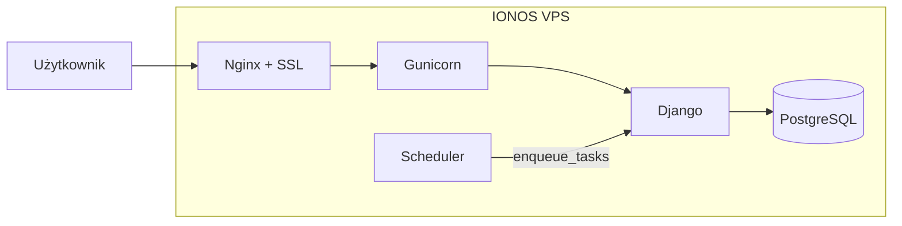

# Plan uruchomienia Cogitomedica na IONOS VPS

## Kontekst

**Projekt:** [README.md](README.md) – aplikacja **Cogitomedica Digital Consents**: Django 6, PostgreSQL 16, WeasyPrint (PDF), Django Tasks (outbox), SMS (SMSApi), panel recepcji/lekarza, tablet pacjenta, obsługa PL/EN/DE. Obecny Docker używa `runserver` (dev); na produkcji wymagany jest **Gunicorn** i **Nginx** z SSL.

**Hosting IONOS VPS** ([ionos.com/servers/vps](https://www.ionos.com/servers/vps)):

- Pełna wirtualizacja, root access, NVMe, 1 Gbps, 99.99% SLA
- Plany od ok. 2–22 USD/mies. (np. VPS M: 4 GB RAM, 120 GB NVMe)
- System: wybór dystrybucji Linux (Ubuntu 24.04 LTS zalecane pod Docker)
- Brak wbudowanego panelu do Dockera – konfiguracja ręczna lub przez Cloud Panel (restart, backup)

---

## Architektura docelowa na VPS

- **WWW:** Nginx (reverse proxy, static/media, SSL) → Gunicorn (Django WSGI).
- **Baza:** PostgreSQL w Dockerze (wolumen trwały).
- **Zadania w tle:** kontener `scheduler` z `run_periodic_tasks` (jak w [docker-compose.yml](docker-compose.yml)) lub cron wywołujący `enqueue_tasks --skip-import` – do wyboru.
- **Monitorowanie:** Sentry (już w projekcie); opcjonalnie Prometheus/Grafana/Alertmanager/Tempo na tym samym VPS (więcej RAM – np. VPS L).

---

## Krok 1: Zakup i przygotowanie VPS (IONOS)

- W panelu IONOS wybrać **VPS** (np. VPS M lub L, jeśli planujesz stack monitoringu).
- Wybrać **Ubuntu 24.04 LTS** (lub inną dystrybucję z obsługą Docker).
- Po dostarczeniu: zapisać **adres IP** i dane logowania (SSH). Zalogować się: `ssh root@<IP>` (lub użytkownik z kluczem, jeśli skonfigurowano).
- Zaktualizować system: `apt update && apt upgrade -y`.
- (Opcjonalnie) Utworzyć użytkownika deploy z sudo zamiast root.

---

## Krok 2: Instalacja Dockera na VPS

- Zainstalować Docker Engine i Docker Compose (plugin):
  - Oficjalna dokumentacja: [docs.docker.com/engine/install/ubuntu](https://docs.docker.com/engine/install/ubuntu/)
  - Lub: `curl -fsSL https://get.docker.com | sh`, potem `apt install docker-compose-plugin`.
- Sprawdzenie: `docker run hello-world`, `docker compose version`.

---

## Krok 3: Zmiany w repozytorium (produkcja)

Obecny [Dockerfile](Dockerfile) i [docker-compose.yml](docker-compose.yml) są nastawione na dev (`runserver`). Trzeba dodać obsługę produkcji:

| Element                     | Działanie                                                                                                                                                                                                                                                                                                                                                       |
| --------------------------- | --------------------------------------------------------------------------------------------------------------------------------------------------------------------------------------------------------------------------------------------------------------------------------------------------------------------------------------------------------------- |
| **Gunicorn**                | Dodać `gunicorn` do [requirements.txt](requirements.txt). W Dockerfile pozostawić obecną bazę (Python 3.13-slim, zależności systemowe pod WeasyPrint są już w Dockerfile).                                                                                                                                                                                      |
| **Entrypoint / CMD**        | W **produkcyjnym** Compose (np. `docker-compose.prod.yml` lub profile `prod`) dla serwisu `web`: zamiast `runserver` użyć `gunicorn cogitomedica.wsgi:application --bind 0.0.0.0:8000 --workers 2 --threads 2` (workers dostosować do RAM). Migracje: osobny step w entrypoint lub przed startem (np. `sh -c "python manage.py migrate && exec gunicorn ..."`). |
| **collectstatic**           | W entrypoint lub w CI przed buildem: `python manage.py collectstatic --noinput`. Pliki trafiają do `STATIC_ROOT` ([cogitomedica/settings.py](cogitomedica/settings.py): `staticfiles`).                                                                                                                                                                         |
| **Nginx**                   | Dodać katalog np. `deploy/nginx/` z konfiguracją Nginx: reverse proxy na `web:8000`, serwowanie `/static/` i `/media/` z odpowiednich ścieżek (np. volume z hosta lub z kontenera po collectstatic). Konfiguracja SSL przez certbot (Let's Encrypt) – certyfikaty na hoście lub w kontenerze nginx.                                                             |
| **docker-compose.prod.yml** | Nowy plik (lub override): serwisy `web` (Gunicorn), `db`, `scheduler`, `nginx`; bez Prometheus/Grafana/Tempo jeśli VPS ma mało RAM. Zmienne środowiska z `.env` (na serwerze plik `.env` poza repozytorium).                                                                                                                                                    |

Proponowana struktura plików do dodania:

- `deploy/nginx/nginx.conf` – proxy do `web:8000`, `location /static`, `location /media`, później `listen 443 ssl` i `ssl_certificate` po uzyskaniu certyfikatów.
- `deploy/nginx/conf.d/` lub jeden plik z `server { ... }` pod domenę.
- `docker-compose.prod.yml` – definicja `web` (command: gunicorn), `nginx`, `db`, `scheduler`; volumes dla static/media jeśli Nginx ma je serwować z hosta.
- (Opcjonalnie) `scripts/entrypoint-prod.sh` – migracje + collectstatic + `exec gunicorn ...`.

---

## Krok 4: Konfiguracja środowiska produkcyjnego na VPS

- **Domena:** W panelu DNS (u u dostawcy domeny) ustawić **A** dla wybranej domeny (np. `app.cogitomedica.pl`) na **adres IP VPS**.
- Na VPS w katalogu projektu (np. `/opt/cogitomedica` po sklonowaniu repozytorium) utworzyć plik `**.env`** (nie commitować) z co najmniej:
  - `ENVIRONMENT=prod`
  - `SECRET_KEY=<silny-losowy-klucz>`
  - `ALLOWED_HOSTS=app.cogitomedica.pl,twojadomena.pl`
  - `DEBUG=0`
  - `DB_HOST=db`, `DB_PORT=5432`, `DB_NAME=...`, `DB_USER=...`, `DB_PASSWORD=...` (spójne z `docker-compose.prod.yml`)
  - `PROMETHEUS_METRICS_TOKEN=...` (jeśli włączasz Prometheus)
  - `SENTRY_DSN=...`, `SMSAPI_ACCESS_TOKEN`, `PATIENT_RESULTS_BASE_URL`, `PATIENT_RESULTS_OTP_PEPPER`, `CORS_ALLOWED_ORIGINS`, `CSRF_TRUSTED_ORIGINS` (np. `https://app.cogitomedica.pl`) – [settings.py](cogitomedica/settings.py) wymaga w prod `SECRET_KEY` i `ALLOWED_HOSTS`; `CSRF_TRUSTED_ORIGINS` warto uzupełnić o domenę produkcyjną (obecnie w kodzie jest tylko ngrok).
- W [cogitomedica/settings.py](cogitomedica/settings.py) można dodać odczyt `CSRF_TRUSTED_ORIGINS` z zmiennej środowiskowej (np. `CSRF_TRUSTED_ORIGINS` z listy rozdzielonej przecinkami), żeby nie trzymać domen w kodzie.

---

## Krok 5: SSL (Let's Encrypt) na VPS

- Zainstalować **Certbot** na hoście (Ubuntu: `apt install certbot`).
- Zatrzymać Nginx (jeśli nasłuchuje na 80/443). Wygenerować certyfikat: `certbot certonly --standalone -d app.cogitomedica.pl` (potrzebny otwarty port 80).
- W konfiguracji Nginx ustawić `ssl_certificate` i `ssl_certificate_key` na ścieżki z Certbota (np. `/etc/letsencrypt/live/app.cogitomedica.pl/...`) i zamontować je w kontenerze Nginx przez volumes.
- Odnawianie: `certbot renew` w cronie (np. dwa razy dziennie); po odnawianiu `docker compose -f docker-compose.prod.yml restart nginx`.

---

## Krok 6: Wdrożenie kodu i pierwsze uruchomienie

- Na VPS: `git clone <repo> /opt/cogitomedica` (lub deploy przez CI: rsync/scp po buildzie).
- W katalogu projektu: skopiować `.env` (lub utworzyć z szablonu) – bez wpisywania do gita.
- Uruchomienie: `docker compose -f docker-compose.prod.yml up -d --build`.
- Sprawdzenie: migracje (jeśli nie w entrypoint): `docker compose -f docker-compose.prod.yml run --rm web python manage.py migrate`.
- Utworzenie superusera: `docker compose -f docker-compose.prod.yml run --rm web python manage.py createsuperuser`.
- Opcjonalnie: `load_default_translations`.
- Health check: `curl -s https://app.cogitomedica.pl/api/v1/observability/health`.

---

## Krok 7: Zadania w tle (scheduler)

- **Opcja A (zalecana na VPS):** Kontener `scheduler` w `docker-compose.prod.yml` z poleceniem `python manage.py run_periodic_tasks --interval-seconds 300 --skip-import` – jak w obecnym [docker-compose.yml](docker-compose.yml) (serwis `scheduler`).
- **Opcja B:** Zamiast długo działającego procesu – cron na hoście co 5 min:  
`docker compose -f docker-compose.prod.yml run --rm web python manage.py enqueue_tasks --skip-import`.

---

## Krok 8: Rate limiting i cache (opcjonalnie)

- README wspomina, że przy wielu workerach Gunicorna limit logowania (django-ratelimit) powinien opierać się na wspólnym cache (np. Redis). Obecnie w [cogitomedica/settings.py](cogitomedica/settings.py) nie ma konfiguracji `CACHES` – domyślnie backend to local memory. Na start można zostawić domyślne (limit per worker). Jeśli chcesz jeden limit na całą aplikację: dodać Redis w `docker-compose.prod.yml` i w settings `CACHES` z backendem Redis dla `prod`.

---

## Krok 9: Backup bazy i wolumenów

- IONOS oferuje opcjonalny Cloud Backup; można też samodzielnie:
  - Cron: `docker compose -f docker-compose.prod.yml exec -T db pg_dump -U ... > backup_$(date +%Y%m%d).sql` i wysyłka do zewnętrznego storage lub drugiego serwera.
  - Backup wolumenu `postgres_data` (np. tar) i ewentualnie `media` (wygenerowane PDF).

---

## Podsumowanie – co zrobić w repozytorium

| Element                   | Działanie                                                                                                                                   |
| ------------------------- | ------------------------------------------------------------------------------------------------------------------------------------------- |
| `requirements.txt`        | Dodać `gunicorn`.                                                                                                                           |
| `Dockerfile`              | Bez zmian (albo osobny stage prod tylko jeśli potrzebny inny CMD).                                                                          |
| `docker-compose.prod.yml` | Nowy plik: `web` (Gunicorn + migracje/collectstatic w entrypoint), `db`, `scheduler`, `nginx`; volumes dla static/media i certyfikatów SSL. |
| `deploy/nginx/`           | Konfiguracja Nginx (proxy, static, media, SSL).                                                                                             |
| Entrypoint prod           | Skrypt lub CMD: migracje, `collectstatic --noinput`, `exec gunicorn ...`.                                                                   |
| `CSRF_TRUSTED_ORIGINS`    | Dodać w settings odczyt z env (np. `CSRF_TRUSTED_ORIGINS`) dla domeny produkcyjnej.                                                         |
| Dokumentacja              | Krótki plik `docs/deploy-ionos-vps.md` z linkami do IONOS, listą kroków i przykładowymi poleceniami.                                        |

---

## Ryzyka i uwagi

- **Zasoby:** WeasyPrint i kilka workerów Gunicorna potrzebują RAM; plan VPS M (4 GB) to minimum, L (8 GB) wygodniejszy przy stacku z Prometheus/Grafana.
- **Firewall:** W Cloud Panel / ufw otworzyć porty 80, 443 i 22 (SSH); pozostałe zamknięte.
- **Monitoring:** Prometheus/Grafana/Alertmanager/Tempo z obecnego `docker-compose.yml` można dołączyć do `docker-compose.prod.yml` jeśli VPS ma wystarczająco RAM; w przeciwnym razie ograniczyć się do Sentry i health checku.

