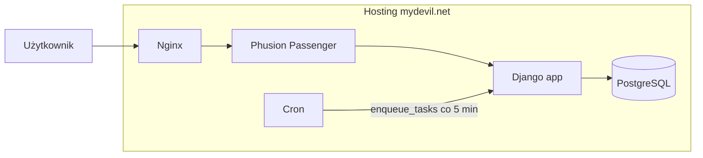

# Plan uruchomienia Cogitomedica na [mydevil.net](http://mydevil.net)

## Kontekst

**Projekt:** [README.md](README.md) – aplikacja Django 6 (Cogitomedica Digital Consents): panel recepcji/lekarza, tablet pacjenta, generowanie PDF (WeasyPrint), Django Tasks (outbox), SMS, obsługa PL/EN/DE.

**Hosting:** [mydevil.net](https://www.mydevil.net/) – współdzielony hosting z:

- **Python** 3.8–3.12 (domyślnie 3.11), virtualenv, **Phusion Passenger** dla Django
- **PostgreSQL** (m.in. wersja 16), zarządzanie przez DevilWEB / `devil pgsql`, host np. `pgsqlX.mydevil.net`
- **Cron** – zadania cykliczne w DevilWEB lub `crontab -e`
- **Strona WWW typu Python** – katalog projektu: `/usr/home/LOGIN/domains/DOMENA/public_python`; pliki statyczne z katalogu `public_python/public/`
- **Zmienne środowiskowe** dla Passenger: `~/.bash_profile` (dokumentacja: [Django](https://dev.pomoc.mydevil.net/Django/), [Python](https://dev.pomoc.mydevil.net/Python/))
- **Binexec** – wymagane do virtualenv i własnego oprogramowania

---

## Architektura docelowa




- **WWW:** Nginx → Passenger → Django (WSGI). Aplikacja w `public_python`, wejście: `passenger_wsgi.py`.
- **Baza:** PostgreSQL na `pgsqlX.mydevil.net` (ten sam kontener/klaster co strona – bez tunelu SSH dla aplikacji).
- **Zadania w tle:** zamiast długo działającego `run_periodic_tasks` – cron co 5 min uruchamia `manage.py enqueue_tasks` (zalecane `--skip-import` jeśli import plików nie jest używany na tym środowisku).
- **Monitorowanie:** tylko Sentry (Prometheus/Grafana/Tempo z docker-compose nie są przenoszone na shared hosting).

---

## Krok 1: Przygotowanie konta i domeny

- W panelu DevilWEB dodać **stronę WWW typu Python** dla domeny (np. `app.cogitomedica.pl`).
- Włączyć **Binexec** (konfiguracja konta – umożliwienie własnego oprogramowania).
- Utworzyć **virtualenv** w np. `/usr/home/LOGIN/.virtualenvs/cogito` z Pythonem 3.11 lub 3.12:
  - `virtualenv cogito -p /usr/local/bin/python3.11`
- W ustawieniach strony WWW wskazać interpreter: `/usr/home/LOGIN/.virtualenvs/cogito/bin/python`.
- Opcjonalnie: dodać darmowy certyfikat SSL (Let’s Encrypt) w panelu – wtedy `ENVIRONMENT=prod` w projekcie włączy przekierowanie HTTPS.

---

## Krok 2: Baza PostgreSQL

- W DevilWEB (zakładka PostgreSQL) lub przez SSH: `devil pgsql db add NAZWA_BAZY` (np. `cogitomedica`) i ustawić hasło.
- Ustalić **host bazy**: dla serwera `sX.mydevil.net` będzie to `pgsqlX.mydevil.net` (dokumentacja: [PostgreSQL](https://pomoc.mydevil.net/PostgreSQL/)).
- Zapisać: `DB_HOST`, `DB_NAME`, `DB_USER`, `DB_PASSWORD`, `DB_PORT=5432` – do użycia w zmiennych środowiska (krok 4).

---

## Krok 3: Wgranie kodu i struktura katalogów

- Główny katalog projektu Django (z `manage.py`) musi być `**public_python`** na serwerze.
- Ścieżka docelowa: `/usr/home/LOGIN/domains/DOMENA/public_python/` (np. `.../cogitomedica.pl/public_python/`).
- **Sposób wdrożenia:** rsync z repozytorium (np. po `git clone` na serwerze) lub pipeline CI (git pull + rsync), tak aby w `public_python` znalazły się m.in.:
  - `manage.py`, `requirements.txt`
  - katalog `cogitomedica/` (settings, wsgi, urls)
  - katalogi `apps/`, `static/`, `locale/`, szablony, itd.
- **Nie** umieszczać w repozytorium plików wrażliwych; na serwerze utworzyć `.env` (patrz krok 4).

Struktura docelowa (skrót):

```
public_python/
  manage.py
  passenger_wsgi.py   # nowy plik dla Passengera
  requirements.txt
  .env                # tylko na serwerze, nie w git
  cogitomedica/
  apps/
  static/
  public/             # katalog na static + media (patrz krok 5)
    static/
    media/
```

---

## Krok 4: Plik `passenger_wsgi.py` i zmienne środowiska

- W katalogu `public_python` utworzyć plik `**passenger_wsgi.py**` (Phusion Passenger uruchamia ten plik – [dokumentacja mydevil Django](https://dev.pomoc.mydevil.net/Django/)).

Przykład zawartości (ścieżki i nazwa modułu zgodne z projektem):

```python
import sys
import os

sys.path.insert(0, os.getcwd())
os.environ.setdefault("DJANGO_SETTINGS_MODULE", "cogitomedica.settings")

# Opcjonalnie: wymuszenie ładowania .env z katalogu projektu
from pathlib import Path
from dotenv import load_dotenv
load_dotenv(Path(__file__).resolve().parent / ".env")

from django.core.wsgi import get_wsgi_application
application = get_wsgi_application()
```

- **Zmienne środowiska:** projekt ładuje je z `.env` ([python-dotenv](https://github.com/theskumar/python-dotenv)) w [cogitomedica/settings.py](cogitomedica/settings.py). Na serwerze utworzyć plik `.env` w `public_python/` (poza repozytorium) z co najmniej:
  - `ENVIRONMENT=prod`
  - `SECRET_KEY=...` (silny, losowy)
  - `ALLOWED_HOSTS=twojadomena.pl,www.twojadomena.pl`
  - `DEBUG=0`
  - `DB_HOST=pgsqlX.mydevil.net`, `DB_NAME=...`, `DB_USER=...`, `DB_PASSWORD=...`, `DB_PORT=5432`
  - Opcjonalnie: `SENTRY_DSN`, `PROMETHEUS_METRICS_TOKEN`, `SMSAPI_ACCESS_TOKEN`, `PATIENT_RESULTS_BASE_URL`, `PATIENT_RESULTS_OTP_PEPPER`, `CORS_ALLOWED_ORIGINS`, `CSRF_TRUSTED_ORIGINS` (domena produkcyjna).
- Alternatywa: ustawienie tych zmiennych w `~/.bash_profile` (wtedy `load_dotenv` w `passenger_wsgi.py` może być pominięte, ale trzymanie sekretów w jednym pliku `.env` na serwerze jest wygodniejsze).

---

## Krok 5: Static i media (Django a mydevil)

- Na mydevil pliki z katalogu `**public_python/public/`** są serwowane bezpośrednio przez serwer (nie przez Django). Należy tam kierować pliki statyczne i media.
- W [cogitomedica/settings.py](cogitomedica/settings.py) w środowisku produkcyjnym (np. gdy `ENVIRONMENT == "prod"`) ustawić ścieżki pod mydevil (np. przez zmienne środowiska, żeby nie zmieniać kodu dla każdego hosta):
  - `STATIC_ROOT = BASE_DIR / "public" / "static"`
  - `MEDIA_ROOT = BASE_DIR / "public" / "media"`
  - `STATIC_URL = "/static/"`, `MEDIA_URL = "/media/"` (jeśli serwer mapuje `public/` na root domeny, to `/static/` i `/media/` będą pod ścieżkami w `public/`).
- Po wdrożeniu: utworzyć katalogi `public/static`, `public/media`; nadać uprawnienia zapisu dla `public/media` (użytkownik, pod którym działa Passenger). Uruchomić: `python manage.py collectstatic --noinput`.
- W repozytorium można dodać konfigurację warunkową (np. `MYDEVIL_DEPLOY=1` lub `STATIC_ROOT` z env), żeby te ścieżki stosować tylko na mydevil.

---

## Krok 6: Zależności Pythona i WeasyPrint (ryzyko)

- W virtualenv zainstalować zależności: `pip install -r requirements.txt` (najlepiej z ograniczeniem równoległości, np. `MAKEFLAGS=-j1`, jeśli dokumentacja mydevil to zaleca – [Python – rozwiązywanie problemów](https://dev.pomoc.mydevil.net/Python/)).
- **WeasyPrint** wymaga bibliotek systemowych (Cairo, Pango, GdkPixbuf) – w [Dockerfile](Dockerfile) są one instalone przez `apt-get`. Na współdzielonym hostingu **nie ma dostępu do apt**. Należy:
  - **Zweryfikować** (np. przez SSH: `ldconfig -p | grep cairo`, sprawdzenie ścieżek w dokumentacji mydevil), czy na serwerze są dostępne biblioteki potrzebne dla WeasyPrint.
  - W razie ich braku: skontaktować się z supportem mydevil w sprawie dostępności libcairo/libpango lub rozważyć **VPS** dla tej aplikacji (wtedy pełna kontrola nad systemem i Dockerem).
- Jeśli WeasyPrint się nie skompiluje/nie uruchomi: generowanie PDF na tym hostingu będzie niedostępne; reszta aplikacji (panel, API, tablet) może działać, jeśli kod obsługuje brak generatora PDF (np. opcjonalny fallback lub wyłączenie funkcji „publish → PDF”).

---

## Krok 7: Migracje i pierwsze uruchomienie

- SSH w katalog `public_python`, aktywacja virtualenv.
- Uruchomienie: `python manage.py migrate`.
- Opcjonalnie: `python manage.py load_default_translations`, `python manage.py createsuperuser`.
- Test konfiguracji Passengera: `python passenger_wsgi.py` (brak błędów przy imporcie).
- Restart aplikacji: w DevilWEB (WWW → wybrana domena → restart) lub `devil www restart DOMENA`.

---

## Krok 8: Cron – zadania w tle (Django Tasks)

- Zamiast kontenera `scheduler` z `run_periodic_tasks` uruchomić **cron** co 5 minut.
- W DevilWEB (Zadania Cron) lub `crontab -e` dodać wpis (ścieżki dostosować do LOGIN i DOMENA):

```text
  */5 * * * * /usr/home/LOGIN/.virtualenvs/cogito/bin/python /usr/home/LOGIN/domains/DOMENA/public_python/manage.py enqueue_tasks --skip-import
  

```

- Ewentualnie ustawić `PATH` w crontab, jeśli polecenia nie są znajdowane.
- `--skip-import` pomija import plików (np. Doctolib), jeśli na tym środowisku nie jest używany; w razie potrzeby można go usunąć.

---

## Krok 9: Bezpieczeństwo i finał

- Upewnić się, że **CSRF_TRUSTED_ORIGINS** w ustawieniach lub `.env` zawiera domenę produkcyjną z protokołem (np. `https://app.cogitomedica.pl`). W [settings.py](cogitomedica/settings.py) można dodać odczyt z zmiennej środowiskowej.
- Po włączeniu SSL: `SECURE_SSL_REDIRECT`, `SESSION_COOKIE_SECURE` itd. są włączane przy `ENVIRONMENT=prod` – bez zmian.
- Limit procesów Passenger (opcjonalnie): w DevilWEB (WWW → szczegóły domeny) ustawić „Limit procesów” według potrzeb.
- Logi błędów: `/usr/home/LOGIN/domains/DOMENA/logs/error.log` – przydatne przy diagnozie 500 i problemów z WeasyPrint/DB.

---

## Podsumowanie – co zrobić w repozytorium


| Element                 | Działanie                                                                                                                                                                                              |
| ----------------------- | ------------------------------------------------------------------------------------------------------------------------------------------------------------------------------------------------------ |
| `passenger_wsgi.py`     | Dodać w katalogu głównym projektu (obok `manage.py`), z `DJANGO_SETTINGS_MODULE=cogitomedica.settings` i opcjonalnym `load_dotenv`.                                                                    |
| Static/Media na mydevil | Dodać w `settings.py` warunek (np. zmienna `USE_MYDEVIL_STATIC_PATHS` lub `STATIC_ROOT` z env) ustawiający `STATIC_ROOT`/`MEDIA_ROOT` na `BASE_DIR / "public" / "static"` i `.../ "public" / "media"`. |
| `.env`                  | Nie commitować; na serwerze utworzyć ręcznie z wartościami produkcyjnymi.                                                                                                                              |
| Dokumentacja            | Krótki plik np. `docs/deploy-mydevil.md` z linkami do dokumentacji mydevil (Django, Python, PostgreSQL, Cron) oraz listą kroków z tego planu.                                                          |


---

## Ryzyka i ograniczenia

- **WeasyPrint:** zależności systemowe (Cairo, Pango) mogą być niedostępne na shared hostingu – wymaga weryfikacji lub wsparcia mydevil; w skrajnym przypadku generowanie PDF tylko na VPS.
- **Monitorowanie:** brak Prometheus/Grafana/Tempo na mydevil – pozostaje Sentry i logi; endpoint `/api/v1/observability/health` nadal można używać do prostego health checku.
- **Rate limiting:** projekt używa django-ratelimit; przy jednym procesie Passenger limit jest per proces – wystarczy; przy większej liczbie procesów warto w przyszłości rozważyć wspólny backend (np. Redis), jeśli mydevil go udostępnia.
- **Czas życia aplikacji:** po 24 h bez ruchu Passenger może wyłączyć aplikację i uruchomić ją przy pierwszym żądaniu – akceptowalne dla typowego użycia.

