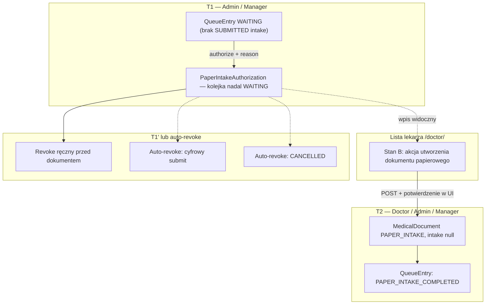

# Ścieżka papierowa — przepływ operacyjny (T1 / T1′ / T2)

Ten dokument jest **skrótem procesowym** uzupełniającym [instrukcję lekarza](03-doktor.md) oraz [procedurę administratora / managera](04-administrator-paper-intake.md). Zakłada model **dwuetapowy**: najpierw **nadzorcza autoryzacja** (T1), potem **utworzenie dokumentu medycznego** przez personel z uprawnieniami klinicznymi (T2).

## Diagram przepływu

## Tabela ról i skutków

| Krok | Kto | Skutek w systemie |
|------|-----|-------------------|
| **T1** | **Admin** lub **Manager** | Powstaje `PaperIntakeAuthorization` (powód w polu **reason**). `entry_status` pozostaje **WAITING**. Audyt autoryzacji. |
| **T1′** | **Admin** lub **Manager** | Cofnięcie autoryzacji **tylko gdy dokument medyczny jeszcze nie istnieje**. Osobny powód cofnięcia. |
| **T2** | **Doctor**, **Admin** lub **Manager** | Atomowo: dokument `PAPER_INTAKE` + status kolejki **PAPER_INTAKE_COMPLETED**. Powód w dokumencie pochodzi ze **snapshotu** autoryzacji (lekarz nie wpisuje drugiego `reason` przy T2). |

## Różnica względem ścieżki cyfrowej (tablet)

| Aspekt | Cyfrowa ankieta | Ścieżka papierowa |
|--------|-----------------|-------------------|
| Wejście lekarza w dokument | Zwykle z listy po **SUBMITTED** / istniejącym dokumencie | Po T2 — ten sam panel **Befund**; wcześniej **tylko** tworzenie dokumentu z listy (stan B), nie „ciche” utworzenie przy wejściu `open` bez ankiety. |
| Status kolejki po „ankiecie” | **PATIENT_COMPLETED** (po wysłaniu formularza) | **PAPER_INTAKE_COMPLETED** dopiero **po** utworzeniu dokumentu medycznego. |
| Cofnięcie | Inne reguły anulowania wizyty / intake | Autoryzację papieru można cofnąć **tylko przed T2**; **nie ma** cofania samego dokumentu utworzonego w tej ścieżce z poziomu tego przepływu. |

## Punkty synchronizacji (auto-revoke)

System **usuwa ważność** autoryzacji papierowej (z audytem), gdy:

1. Pacjent **ukończy i wyśle** cyfrową ankietę na tablecie — wtedy obowiązuje standardowa ścieżka z `PatientIntakeForm`.
2. Wpis kolejki zostanie oznaczony jako **anulowany** (`CANCELLED`).

W obu przypadkach personel powinien **nie polegać** na „papierze w systemie”, jeśli doszło do zdarzenia merytorycznego po stronie recepcji/tabletu — odśwież listę i hub **`/admin/paper-intake/`**.

## Dowód papierowy poza systemem

CogitoMedica zapisuje **fakt decyzji** (kto, kiedy, tekst `reason`, powiązanie z wpisem kolejki i dokumentem). **Nie przechowuje** skanu ani treści fizycznej ankiety papierowej — procedura **gdzie leży papier i kto go archiwizuje** musi być opisana **wewnętrznym regulaminem placówki**.

Powiązane: [04-administrator-paper-intake.md](04-administrator-paper-intake.md), [03-doktor.md](03-doktor.md), [04-administrator.md](04-administrator.md).
